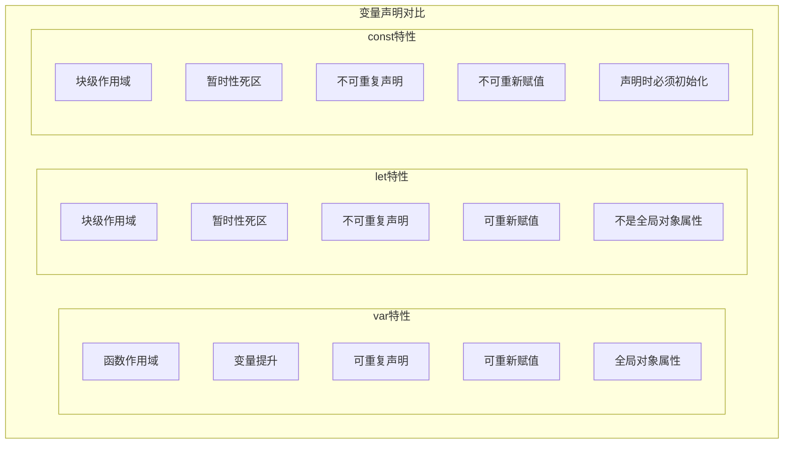
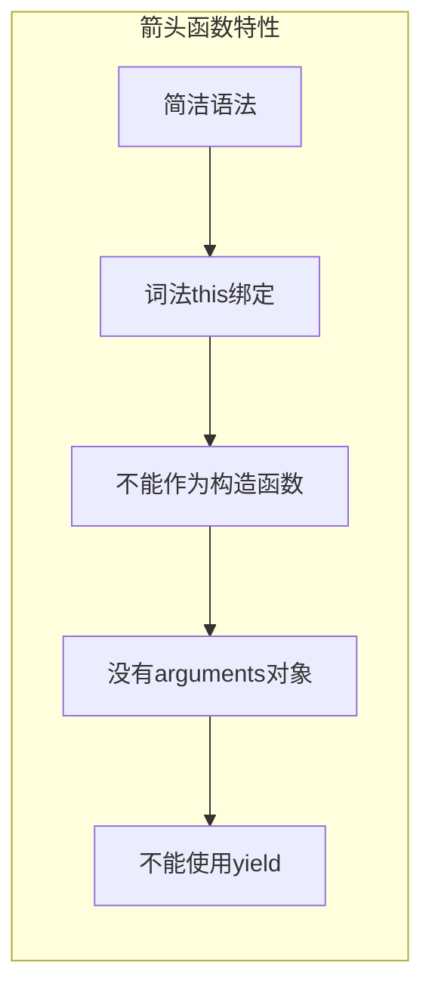
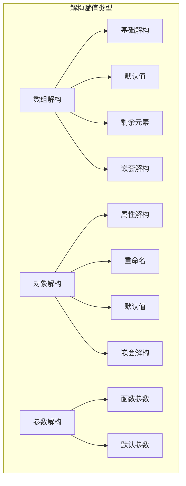
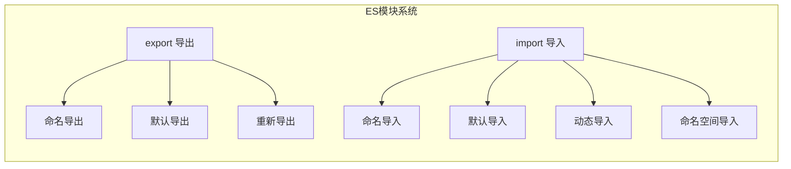

import Tabs from '@theme/Tabs';
import TabItem from '@theme/TabItem';
import CodeBlock from '@theme/CodeBlock';

# ES6+现代JavaScript特性全解析

ES6（ECMAScript 2015）及后续版本为JavaScript带来了革命性的改进，引入了类、模块、箭头函数、Promise等现代编程特性。这些特性不仅提升了开发效率，还使JavaScript成为了更强大、更优雅的编程语言。

:::tip 核心价值
**ES6+ = 现代语法 + 模块化 + 异步编程 + 函数式编程**
- 🎯 **现代语法**：箭头函数、模板字符串、解构赋值等简洁语法
- 📦 **模块化系统**：import/export模块系统，告别全局污染
- ⚡ **异步编程**：Promise、async/await，优雅处理异步操作
- 🔧 **函数式编程**：高阶函数、纯函数、不可变数据
- 🏗️ **面向对象增强**：class语法、继承、私有字段
- 🌟 **新数据结构**：Map、Set、WeakMap、WeakSet等
:::

## 1. 变量声明与作用域

### 1.1 let、const vs var

ES6引入的`let`和`const`解决了`var`的诸多问题，提供了更安全的变量声明方式。



#### 变量声明对比表

| 特性 | var | let | const | 推荐使用 |
|------|-----|-----|-------|----------|
| **作用域** | 函数作用域 | 块级作用域 | 块级作用域 | let/const |
| **变量提升** | 是 | 否（暂时性死区） | 否（暂时性死区） | let/const |
| **重复声明** | 允许 | 不允许 | 不允许 | let/const |
| **重新赋值** | 允许 | 允许 | 不允许 | 根据需求 |
| **全局对象属性** | 是 | 否 | 否 | let/const |

<Tabs>
<TabItem value="scope-examples" label="作用域示例">

#### 作用域与变量提升详解

```javascript title="作用域与变量提升完整示例"
// 1. var的函数作用域问题
function varScopeExample() {
  console.log(x); // undefined (变量提升，但未赋值)
  
  if (true) {
    var x = 1;
    console.log(x); // 1
  }
  
  console.log(x); // 1 (var没有块级作用域)
}

// 2. let的块级作用域
function letScopeExample() {
  // console.log(y); // ReferenceError: Cannot access 'y' before initialization
  
  if (true) {
    let y = 1;
    console.log(y); // 1
  }
  
  // console.log(y); // ReferenceError: y is not defined
}

// 3. const的特性
function constExample() {
  const PI = 3.14159;
  // PI = 3.14; // TypeError: Assignment to constant variable
  
  // 对象和数组的const
  const user = { name: 'John', age: 30 };
  user.age = 31; // 可以修改对象属性
  user.city = 'New York'; // 可以添加属性
  // user = {}; // TypeError: Assignment to constant variable
  
  const numbers = [1, 2, 3];
  numbers.push(4); // 可以修改数组内容
  // numbers = []; // TypeError: Assignment to constant variable
}

// 4. 循环中的作用域问题
// var的问题
for (var i = 0; i < 3; i++) {
  setTimeout(() => {
    console.log('var:', i); // 输出: 3, 3, 3
  }, 100);
}

// let的解决方案
for (let i = 0; i < 3; i++) {
  setTimeout(() => {
    console.log('let:', i); // 输出: 0, 1, 2
  }, 100);
}

// 5. 暂时性死区（Temporal Dead Zone）
function temporalDeadZoneExample() {
  console.log(typeof x); // "undefined" (var)
  // console.log(typeof y); // ReferenceError (let)
  
  var x = 1;
  let y = 2;
}

// 6. 全局对象属性
var globalVar = 'I am global';
let globalLet = 'I am also global';
const globalConst = 'I am global too';

console.log(window.globalVar); // "I am global"
console.log(window.globalLet); // undefined
console.log(window.globalConst); // undefined
```

</TabItem>
<TabItem value="best-practices" label="最佳实践">

#### 变量声明最佳实践

```javascript title="变量声明最佳实践"
// 1. 优先使用const，需要重新赋值时使用let
const API_URL = 'https://api.example.com';
const users = [];
let currentUser = null;

// 2. 避免使用var
// 不推荐
var count = 0;

// 推荐
let count = 0;

// 3. 在最小作用域内声明变量
function processUsers(userList) {
  const processedUsers = [];
  
  for (let i = 0; i < userList.length; i++) {
    const user = userList[i];
    
    if (user.active) {
      const processedUser = {
        id: user.id,
        name: user.name.toUpperCase(),
        email: user.email.toLowerCase()
      };
      processedUsers.push(processedUser);
    }
  }
  
  return processedUsers;
}

// 4. 使用有意义的变量名
// 不推荐
const d = new Date();
const u = users.filter(x => x.a);

// 推荐
const currentDate = new Date();
const activeUsers = users.filter(user => user.active);

// 5. 常量使用大写字母和下划线
const MAX_RETRY_COUNT = 3;
const API_ENDPOINTS = {
  USERS: '/api/users',
  POSTS: '/api/posts'
};

// 6. 对象和数组的不可变操作
const originalArray = [1, 2, 3];

// 不推荐：直接修改原数组
originalArray.push(4);

// 推荐：创建新数组
const newArray = [...originalArray, 4];

const originalObject = { name: 'John', age: 30 };

// 不推荐：直接修改原对象
originalObject.city = 'New York';

// 推荐：创建新对象
const newObject = { ...originalObject, city: 'New York' };
```

</TabItem>
</Tabs>

## 2. 箭头函数与函数增强

### 2.1 箭头函数语法

箭头函数是ES6引入的简洁函数语法，不仅语法更简洁，还解决了传统函数中`this`绑定的问题。



<Tabs>
<TabItem value="arrow-syntax" label="箭头函数语法">

#### 箭头函数完整语法

```javascript title="箭头函数语法详解"
// 1. 基础语法对比
// 传统函数
function add(a, b) {
  return a + b;
}

// 箭头函数
const add = (a, b) => a + b;

// 2. 不同参数情况
// 无参数
const greet = () => 'Hello World';

// 单个参数（可省略括号）
const double = x => x * 2;
const square = (x) => x * x; // 也可以保留括号

// 多个参数
const multiply = (a, b) => a * b;

// 默认参数
const greetUser = (name = 'Guest') => `Hello, ${name}!`;

// 剩余参数
const sum = (...numbers) => numbers.reduce((acc, num) => acc + num, 0);

// 解构参数
const getFullName = ({ firstName, lastName }) => `${firstName} ${lastName}`;

// 3. 函数体语法
// 表达式体（隐式返回）
const isEven = n => n % 2 === 0;

// 语句体（需要显式return）
const processData = (data) => {
  const processed = data.map(item => item.toUpperCase());
  const filtered = processed.filter(item => item.length > 3);
  return filtered;
};

// 返回对象字面量（需要括号）
const createUser = (name, age) => ({ name, age, id: Date.now() });

// 4. 高阶函数中的箭头函数
const numbers = [1, 2, 3, 4, 5];

// 传统写法
const doubled = numbers.map(function(n) {
  return n * 2;
});

// 箭头函数写法
const doubled = numbers.map(n => n * 2);

// 链式调用
const result = numbers
  .filter(n => n > 2)
  .map(n => n * 2)
  .reduce((acc, n) => acc + n, 0);

// 5. 复杂的函数式编程示例
const users = [
  { name: 'Alice', age: 25, active: true },
  { name: 'Bob', age: 30, active: false },
  { name: 'Charlie', age: 35, active: true }
];

// 函数组合
const pipe = (...fns) => (value) => fns.reduce((acc, fn) => fn(acc), value);

const processUsers = pipe(
  users => users.filter(user => user.active),
  users => users.map(user => ({ ...user, ageGroup: user.age < 30 ? 'young' : 'adult' })),
  users => users.sort((a, b) => a.age - b.age)
);

const processedUsers = processUsers(users);

// 6. 柯里化函数
const curry = (fn) => {
  return function curried(...args) {
    if (args.length >= fn.length) {
      return fn.apply(this, args);
    } else {
      return (...nextArgs) => curried(...args, ...nextArgs);
    }
  };
};

// 使用箭头函数的柯里化
const add = (a, b, c) => a + b + c;
const curriedAdd = curry(add);

const add5 = curriedAdd(5);
const add5And3 = add5(3);
const result = add5And3(2); // 10

// 7. 异步箭头函数
const fetchUserData = async (userId) => {
  try {
    const response = await fetch(`/api/users/${userId}`);
    const userData = await response.json();
    return userData;
  } catch (error) {
    console.error('Failed to fetch user:', error);
    throw error;
  }
};

// Promise链中的箭头函数
fetchUserData(123)
  .then(user => ({ ...user, processed: true }))
  .then(user => console.log('Processed user:', user))
  .catch(error => console.error('Error:', error));
```

</TabItem>
<TabItem value="this-binding" label="this绑定">

#### this绑定机制对比

```javascript title="this绑定详解"
// 1. 传统函数 vs 箭头函数的this
const obj = {
  name: 'MyObject',
  
  // 传统函数方法
  traditionalMethod: function() {
    console.log('Traditional:', this.name); // 'MyObject'
    
    setTimeout(function() {
      console.log('Traditional setTimeout:', this.name); // undefined (全局this)
    }, 100);
  },
  
  // 箭头函数方法
  arrowMethod: () => {
    console.log('Arrow method:', this.name); // undefined (词法this，指向全局)
  },
  
  // 混合使用
  mixedMethod: function() {
    console.log('Mixed outer:', this.name); // 'MyObject'
    
    setTimeout(() => {
      console.log('Mixed arrow setTimeout:', this.name); // 'MyObject' (继承外层this)
    }, 100);
  }
};

// 2. 类中的箭头函数
class EventHandler {
  constructor(name) {
    this.name = name;
    this.clickCount = 0;
  }
  
  // 传统方法
  handleClickTraditional() {
    this.clickCount++;
    console.log(`${this.name} clicked ${this.clickCount} times`);
  }
  
  // 箭头函数方法（类字段语法）
  handleClickArrow = () => {
    this.clickCount++;
    console.log(`${this.name} clicked ${this.clickCount} times`);
  }
  
  setupEventListeners() {
    const button1 = document.getElementById('btn1');
    const button2 = document.getElementById('btn2');
    
    // 传统方法需要绑定this
    button1.addEventListener('click', this.handleClickTraditional.bind(this));
    
    // 箭头函数自动绑定this
    button2.addEventListener('click', this.handleClickArrow);
  }
}

// 3. React组件中的应用
class ReactComponent extends React.Component {
  constructor(props) {
    super(props);
    this.state = { count: 0 };
  }
  
  // 传统方法需要在constructor中绑定
  handleClickTraditional() {
    this.setState({ count: this.state.count + 1 });
  }
  
  // 箭头函数自动绑定
  handleClickArrow = () => {
    this.setState({ count: this.state.count + 1 });
  }
  
  render() {
    return (
      <div>
        <button onClick={this.handleClickTraditional.bind(this)}>
          Traditional: {this.state.count}
        </button>
        <button onClick={this.handleClickArrow}>
          Arrow: {this.state.count}
        </button>
      </div>
    );
  }
}

// 4. 函数式编程中的this
const calculator = {
  value: 0,
  
  add: function(n) {
    this.value += n;
    return this;
  },
  
  multiply: function(n) {
    this.value *= n;
    return this;
  },
  
  // 箭头函数不适合链式调用
  // subtract: (n) => {
  //   this.value -= n; // this不指向calculator
  //   return this;
  // },
  
  subtract: function(n) {
    this.value -= n;
    return this;
  },
  
  getValue: function() {
    return this.value;
  }
};

// 链式调用
const result = calculator
  .add(10)
  .multiply(2)
  .subtract(5)
  .getValue(); // 15

// 5. 箭头函数的限制
// 不能作为构造函数
const ArrowConstructor = () => {};
// new ArrowConstructor(); // TypeError: ArrowConstructor is not a constructor

// 没有arguments对象
function traditionalFunction() {
  console.log(arguments); // Arguments对象
}

const arrowFunction = () => {
  // console.log(arguments); // ReferenceError: arguments is not defined
  // 使用剩余参数代替
  console.log(...args);
};

// 不能使用call、apply、bind改变this
const arrowFunc = () => console.log(this);
const obj2 = { name: 'test' };

arrowFunc.call(obj2); // this仍然是词法this，不是obj2
```

</TabItem>
<TabItem value="function-enhancements" label="函数增强特性">

#### ES6+函数增强特性

```javascript title="函数增强特性详解"
// 1. 默认参数
function greet(name = 'World', greeting = 'Hello') {
  return `${greeting}, ${name}!`;
}

// 默认参数可以是表达式
function createId(prefix = 'id', suffix = Date.now()) {
  return `${prefix}_${suffix}`;
}

// 默认参数可以引用前面的参数
function createUser(name, role = 'user', permissions = getDefaultPermissions(role)) {
  return { name, role, permissions };
}

function getDefaultPermissions(role) {
  const permissionMap = {
    admin: ['read', 'write', 'delete'],
    user: ['read'],
    guest: []
  };
  return permissionMap[role] || [];
}

// 2. 剩余参数
function sum(...numbers) {
  return numbers.reduce((total, num) => total + num, 0);
}

// 剩余参数与普通参数结合
function logMessage(level, ...messages) {
  const timestamp = new Date().toISOString();
  console.log(`[${timestamp}] ${level.toUpperCase()}:`, ...messages);
}

logMessage('info', 'User logged in', { userId: 123 });

// 3. 扩展运算符
const arr1 = [1, 2, 3];
const arr2 = [4, 5, 6];

// 数组合并
const combined = [...arr1, ...arr2]; // [1, 2, 3, 4, 5, 6]

// 数组复制
const copied = [...arr1]; // [1, 2, 3]

// 函数调用
function multiply(a, b, c) {
  return a * b * c;
}

const numbers = [2, 3, 4];
const result = multiply(...numbers); // 24

// 4. 函数名属性
function namedFunction() {}
const anonymousFunction = function() {};
const arrowFunction = () => {};

console.log(namedFunction.name); // 'namedFunction'
console.log(anonymousFunction.name); // 'anonymousFunction'
console.log(arrowFunction.name); // 'arrowFunction'

// 5. 尾调用优化（理论上支持，实际支持有限）
function factorial(n, acc = 1) {
  if (n <= 1) return acc;
  return factorial(n - 1, n * acc); // 尾调用
}

// 6. 函数参数解构
function processUser({ name, age, email = 'unknown' }) {
  console.log(`Processing ${name}, age ${age}, email ${email}`);
}

processUser({ name: 'John', age: 30 });

// 数组参数解构
function getCoordinates([x, y, z = 0]) {
  return { x, y, z };
}

getCoordinates([10, 20]); // { x: 10, y: 20, z: 0 }

// 7. 高级函数模式
// 函数组合
const compose = (...fns) => (value) => fns.reduceRight((acc, fn) => fn(acc), value);

const addOne = x => x + 1;
const double = x => x * 2;
const square = x => x * x;

const composedFunction = compose(square, double, addOne);
console.log(composedFunction(3)); // ((3 + 1) * 2)² = 64

// 管道操作
const pipe = (...fns) => (value) => fns.reduce((acc, fn) => fn(acc), value);

const pipedFunction = pipe(addOne, double, square);
console.log(pipedFunction(3)); // ((3 + 1) * 2)² = 64

// 偏函数应用
const partial = (fn, ...presetArgs) => {
  return (...laterArgs) => fn(...presetArgs, ...laterArgs);
};

const multiply = (a, b, c) => a * b * c;
const multiplyBy2 = partial(multiply, 2);
const multiplyBy2And3 = partial(multiply, 2, 3);

console.log(multiplyBy2(3, 4)); // 24
console.log(multiplyBy2And3(4)); // 24

// 8. 记忆化函数
const memoize = (fn) => {
  const cache = new Map();
  
  return (...args) => {
    const key = JSON.stringify(args);
    
    if (cache.has(key)) {
      return cache.get(key);
    }
    
    const result = fn(...args);
    cache.set(key, result);
    return result;
  };
};

const expensiveFunction = (n) => {
  console.log(`Computing for ${n}`);
  return n * n;
};

const memoizedFunction = memoize(expensiveFunction);

console.log(memoizedFunction(5)); // Computing for 5, returns 25
console.log(memoizedFunction(5)); // returns 25 (from cache)

// 9. 函数重载模拟
function createOverloadedFunction(...implementations) {
  return function(...args) {
    const implementation = implementations.find(impl => 
      impl.length === args.length
    );
    
    if (implementation) {
      return implementation.apply(this, args);
    }
    
    throw new Error(`No implementation found for ${args.length} arguments`);
  };
}

const overloadedAdd = createOverloadedFunction(
  (a) => a,
  (a, b) => a + b,
  (a, b, c) => a + b + c
);

console.log(overloadedAdd(5)); // 5
console.log(overloadedAdd(2, 3)); // 5
console.log(overloadedAdd(1, 2, 3)); // 6
```

</TabItem>
</Tabs>

## 3. 解构赋值与扩展运算符

### 3.1 解构赋值语法

解构赋值允许从数组或对象中提取值，并赋给变量，是ES6中最实用的特性之一。



<Tabs>
<TabItem value="array-destructuring" label="数组解构">

#### 数组解构详解

```javascript title="数组解构完整示例"
// 1. 基础数组解构
const colors = ['red', 'green', 'blue'];
const [first, second, third] = colors;
console.log(first, second, third); // 'red', 'green', 'blue'

// 2. 跳过元素
const [primary, , tertiary] = colors;
console.log(primary, tertiary); // 'red', 'blue'

// 3. 默认值
const [a, b, c, d = 'yellow'] = colors;
console.log(d); // 'yellow'

// 4. 剩余元素
const numbers = [1, 2, 3, 4, 5];
const [head, ...tail] = numbers;
console.log(head); // 1
console.log(tail); // [2, 3, 4, 5]

// 5. 嵌套数组解构
const nested = [[1, 2], [3, 4], [5, 6]];
const [[x1, y1], [x2, y2]] = nested;
console.log(x1, y1, x2, y2); // 1, 2, 3, 4

// 6. 交换变量
let x = 1, y = 2;
[x, y] = [y, x];
console.log(x, y); // 2, 1

// 7. 函数返回多个值
function getCoordinates() {
  return [10, 20, 30];
}

const [x, y, z] = getCoordinates();

// 8. 字符串解构
const str = 'hello';
const [h, e, l1, l2, o] = str;
console.log(h, e, l1, l2, o); // 'h', 'e', 'l', 'l', 'o'

// 9. 实际应用示例
// 处理API响应
async function fetchUserData() {
  const response = await fetch('/api/user');
  const [user, posts, comments] = await Promise.all([
    response.json(),
    fetch('/api/posts').then(r => r.json()),
    fetch('/api/comments').then(r => r.json())
  ]);
  
  return { user, posts, comments };
}

// 数组方法链式调用
const processNumbers = (nums) => {
  const [evens, odds] = nums.reduce(
    ([evens, odds], num) => 
      num % 2 === 0 
        ? [[...evens, num], odds]
        : [evens, [...odds, num]],
    [[], []]
  );
  
  return { evens, odds };
};

console.log(processNumbers([1, 2, 3, 4, 5])); 
// { evens: [2, 4], odds: [1, 3, 5] }

// 10. 高级模式
// 递归解构
function flattenArray([head, ...tail]) {
  if (tail.length === 0) return [head];
  
  return Array.isArray(head) 
    ? [...flattenArray(head), ...flattenArray(tail)]
    : [head, ...flattenArray(tail)];
}

const nestedArray = [1, [2, 3], [4, [5, 6]]];
console.log(flattenArray(nestedArray)); // [1, 2, 3, 4, 5, 6]

// 模式匹配模拟
function processCommand([command, ...args]) {
  switch (command) {
    case 'create':
      const [type, name] = args;
      return `Creating ${type}: ${name}`;
    
    case 'delete':
      const [id] = args;
      return `Deleting item with id: ${id}`;
    
    case 'update':
      const [targetId, ...updates] = args;
      return `Updating ${targetId} with: ${updates.join(', ')}`;
    
    default:
      return 'Unknown command';
  }
}

console.log(processCommand(['create', 'user', 'john'])); 
// "Creating user: john"
```

</TabItem>
<TabItem value="object-destructuring" label="对象解构">

#### 对象解构详解

```javascript title="对象解构完整示例"
// 1. 基础对象解构
const user = {
  name: 'John Doe',
  age: 30,
  email: 'john@example.com'
};

const { name, age, email } = user;
console.log(name, age, email); // 'John Doe', 30, 'john@example.com'

// 2. 重命名变量
const { name: userName, age: userAge } = user;
console.log(userName, userAge); // 'John Doe', 30

// 3. 默认值
const { name, age, city = 'Unknown' } = user;
console.log(city); // 'Unknown'

// 4. 重命名 + 默认值
const { email: userEmail = 'no-email' } = user;

// 5. 嵌套对象解构
const userProfile = {
  personal: {
    name: 'Alice',
    age: 25
  },
  contact: {
    email: 'alice@example.com',
    phone: '123-456-7890'
  },
  preferences: {
    theme: 'dark',
    notifications: {
      email: true,
      push: false
    }
  }
};

const {
  personal: { name: fullName, age: years },
  contact: { email: contactEmail },
  preferences: {
    theme,
    notifications: { email: emailNotifications }
  }
} = userProfile;

// 6. 剩余属性
const settings = {
  theme: 'dark',
  fontSize: 14,
  showLineNumbers: true,
  autoSave: true,
  tabSize: 2
};

const { theme, fontSize, ...otherSettings } = settings;
console.log(otherSettings); 
// { showLineNumbers: true, autoSave: true, tabSize: 2 }

// 7. 动态属性名
const key = 'dynamicKey';
const obj = { [key]: 'dynamicValue', staticKey: 'staticValue' };
const { [key]: dynamicValue, staticKey } = obj;

// 8. 函数参数解构
function createUser({ name, age, email = 'unknown' }) {
  return {
    id: Date.now(),
    name,
    age,
    email,
    createdAt: new Date()
  };
}

const newUser = createUser({ name: 'Bob', age: 25 });

// 9. 复杂的参数解构
function processApiResponse({
  data: { users = [], posts = [] } = {},
  meta: { page = 1, limit = 10, total = 0 } = {},
  error = null
} = {}) {
  if (error) {
    throw new Error(`API Error: ${error.message}`);
  }
  
  return {
    users: users.slice(0, limit),
    posts: posts.slice(0, limit),
    pagination: { page, limit, total }
  };
}

// 10. 实际应用示例
// React组件props解构
function UserCard({ 
  user: { name, avatar, email }, 
  onEdit, 
  onDelete,
  className = 'user-card' 
}) {
  return (
    <div className={className}>
      
      <h3>{name}</h3>
      <p>{email}</p>
      <button onClick={() => onEdit(user)}>Edit</button>
      <button onClick={() => onDelete(user.id)}>Delete</button>
    </div>
  );
}

// API数据处理
async function fetchAndProcessUser(userId) {
  const response = await fetch(`/api/users/${userId}`);
  const {
    data: {
      id,
      profile: { firstName, lastName, avatar },
      settings: { theme, language = 'en' },
      stats: { postsCount, followersCount }
    },
    meta: { lastUpdated }
  } = await response.json();
  
  return {
    id,
    fullName: `${firstName} ${lastName}`,
    avatar,
    preferences: { theme, language },
    statistics: { posts: postsCount, followers: followersCount },
    lastUpdated: new Date(lastUpdated)
  };
}

// 配置对象处理
function initializeApp(config = {}) {
  const {
    api: {
      baseURL = 'http://localhost:3000',
      timeout = 5000,
      retries = 3
    } = {},
    ui: {
      theme = 'light',
      animations = true,
      sidebar = { collapsed: false, width: 250 }
    } = {},
    features: {
      analytics = false,
      notifications = true,
      ...otherFeatures
    } = {}
  } = config;
  
  return {
    apiConfig: { baseURL, timeout, retries },
    uiConfig: { theme, animations, sidebar },
    featureFlags: { analytics, notifications, ...otherFeatures }
  };
}

// 11. 高级模式
// 条件解构
function processUserData(userData) {
  const isAdmin = userData.role === 'admin';
  
  const {
    name,
    email,
    ...(isAdmin && { 
      adminLevel: adminLevel = 1,
      permissions: permissions = []
    })
  } = userData;
  
  return isAdmin 
    ? { name, email, adminLevel, permissions }
    : { name, email };
}

// 解构赋值与数组方法结合
const users = [
  { name: 'Alice', age: 25, city: 'New York' },
  { name: 'Bob', age: 30, city: 'London' },
  { name: 'Charlie', age: 35, city: 'Tokyo' }
];

// 提取特定属性
const names = users.map(({ name }) => name);
const cities = users.map(({ city }) => city);

// 过滤和解构
const youngUsers = users
  .filter(({ age }) => age < 30)
  .map(({ name, city }) => ({ name, city }));

// 分组
const usersByCity = users.reduce((acc, { city, ...user }) => {
  acc[city] = acc[city] || [];
  acc[city].push(user);
  return acc;
}, {});
```

</TabItem>
<TabItem value="spread-operator" label="扩展运算符">

#### 扩展运算符应用

```javascript title="扩展运算符完整应用"
// 1. 数组扩展
const arr1 = [1, 2, 3];
const arr2 = [4, 5, 6];

// 数组合并
const combined = [...arr1, ...arr2]; // [1, 2, 3, 4, 5, 6]
const withExtra = [0, ...arr1, 3.5, ...arr2, 7]; // [0, 1, 2, 3, 3.5, 4, 5, 6, 7]

// 数组复制（浅拷贝）
const copied = [...arr1]; // [1, 2, 3]

// 数组转换
const str = 'hello';
const chars = [...str]; // ['h', 'e', 'l', 'l', 'o']

const nodeList = document.querySelectorAll('div');
const divArray = [...nodeList]; // 将NodeList转为数组

// 2. 对象扩展
const obj1 = { a: 1, b: 2 };
const obj2 = { c: 3, d: 4 };

// 对象合并
const merged = { ...obj1, ...obj2 }; // { a: 1, b: 2, c: 3, d: 4 }

// 对象复制（浅拷贝）
const objCopy = { ...obj1 }; // { a: 1, b: 2 }

// 属性覆盖
const updated = { ...obj1, b: 20, e: 5 }; // { a: 1, b: 20, e: 5 }

// 3. 函数调用中的扩展
function sum(a, b, c) {
  return a + b + c;
}

const numbers = [1, 2, 3];
const result = sum(...numbers); // 等同于 sum(1, 2, 3)

// Math对象方法
const nums = [5, 2, 8, 1, 9];
const max = Math.max(...nums); // 9
const min = Math.min(...nums); // 1

// 4. 实用工具函数
// 数组去重
const removeDuplicates = (arr) => [...new Set(arr)];
console.log(removeDuplicates([1, 2, 2, 3, 3, 4])); // [1, 2, 3, 4]

// 数组扁平化（一层）
const flatten = (arr) => [].concat(...arr);
console.log(flatten([[1, 2], [3, 4], [5]])); // [1, 2, 3, 4, 5]

// 深度扁平化
const deepFlatten = (arr) => 
  arr.reduce((acc, val) => 
    Array.isArray(val) 
      ? acc.concat(deepFlatten(val))
      : acc.concat(val), 
    []
  );

// 对象深度合并
const deepMerge = (target, source) => {
  const result = { ...target };
  
  for (const key in source) {
    if (source[key] && typeof source[key] === 'object' && !Array.isArray(source[key])) {
      result[key] = deepMerge(result[key] || {}, source[key]);
    } else {
      result[key] = source[key];
    }
  }
  
  return result;
};

// 5. React中的应用
// 状态更新
const [state, setState] = useState({
  user: { name: 'John', age: 30 },
  settings: { theme: 'dark' }
});

// 更新嵌套状态
const updateUserAge = (newAge) => {
  setState(prevState => ({
    ...prevState,
    user: {
      ...prevState.user,
      age: newAge
    }
  }));
};

// Props传递
const UserComponent = (props) => {
  const commonProps = { className: 'user', role: 'button' };
  
  return (
    <div {...commonProps} {...props}>
      {props.children}
    </div>
  );
};

// 6. 数组操作模式
const todos = [
  { id: 1, text: 'Learn React', completed: false },
  { id: 2, text: 'Build an app', completed: true }
];

// 添加新项
const addTodo = (newTodo) => [...todos, newTodo];

// 更新项
const updateTodo = (id, updates) =>
  todos.map(todo => 
    todo.id === id 
      ? { ...todo, ...updates }
      : todo
  );

// 删除项
const deleteTodo = (id) => todos.filter(todo => todo.id !== id);

// 7. 高级模式
// 条件扩展
const createUser = (userData, isAdmin = false) => ({
  ...userData,
  role: 'user',
  ...(isAdmin && { 
    role: 'admin',
    permissions: ['read', 'write', 'delete']
  })
});

// 动态对象构建
const buildApiRequest = (endpoint, options = {}) => ({
  url: endpoint,
  method: 'GET',
  headers: {
    'Content-Type': 'application/json',
    ...options.headers
  },
  ...options
});

// 函数参数收集
const createLogger = (level, ...formatters) => {
  return (message, ...args) => {
    const formattedMessage = formatters.reduce(
      (msg, formatter) => formatter(msg),
      message
    );
    console[level](formattedMessage, ...args);
  };
};

const logger = createLogger('log', 
  msg => `[${new Date().toISOString()}]`,
  msg => msg.toUpperCase()
);

// 8. 性能考虑
// 避免在渲染函数中使用扩展运算符
// 不好的做法
const BadComponent = ({ items }) => (
  <div>
    {[...items].map(item => <Item key={item.id} {...item} />)}
  </div>
);

// 好的做法
const GoodComponent = ({ items }) => {
  const itemsCopy = useMemo(() => [...items], [items]);
  
  return (
    <div>
      {itemsCopy.map(item => <Item key={item.id} {...item} />)}
    </div>
  );
};

// 大对象的浅拷贝优化
const optimizedCopy = (obj) => {
  if (Object.keys(obj).length > 1000) {
    // 对于大对象，考虑使用其他方法
    return Object.assign({}, obj);
  }
  return { ...obj };
};
```

</TabItem>
</Tabs> 
#
# 4. 模块系统(ES Modules)

### 4.1 模块导入导出

ES6引入的模块系统提供了标准化的代码组织和复用方式。



<Tabs>
<TabItem value="export-import" label="导入导出语法">

#### 模块导入导出详解

```javascript title="模块导出示例"
// utils.js - 工具函数模块
// 1. 命名导出
export const PI = 3.14159;
export const E = 2.71828;

export function add(a, b) {
  return a + b;
}

export function multiply(a, b) {
  return a * b;
}

// 批量导出
const subtract = (a, b) => a - b;
const divide = (a, b) => a / b;

export { subtract, divide };

// 重命名导出
const power = (base, exponent) => Math.pow(base, exponent);
export { power as pow };

// 2. 默认导出
class Calculator {
  constructor() {
    this.result = 0;
  }
  
  add(value) {
    this.result += value;
    return this;
  }
  
  subtract(value) {
    this.result -= value;
    return this;
  }
  
  multiply(value) {
    this.result *= value;
    return this;
  }
  
  divide(value) {
    this.result /= value;
    return this;
  }
  
  getValue() {
    return this.result;
  }
  
  reset() {
    this.result = 0;
    return this;
  }
}

export default Calculator;

// 同时有命名导出和默认导出
export { Calculator as Calc };
```

```javascript title="模块导入示例"
// main.js - 主应用文件
// 1. 命名导入
import { add, multiply, PI } from './utils.js';

console.log(add(2, 3)); // 5
console.log(multiply(4, 5)); // 20
console.log(PI); // 3.14159

// 2. 重命名导入
import { subtract as minus, pow } from './utils.js';

console.log(minus(10, 3)); // 7
console.log(pow(2, 3)); // 8

// 3. 默认导入
import Calculator from './utils.js';

const calc = new Calculator();
const result = calc.add(10).multiply(2).subtract(5).getValue();
console.log(result); // 15

// 4. 混合导入
import Calculator, { add, PI } from './utils.js';

// 5. 命名空间导入
import * as MathUtils from './utils.js';

console.log(MathUtils.add(1, 2)); // 3
console.log(MathUtils.PI); // 3.14159
const calculator = new MathUtils.default();

// 6. 动态导入
async function loadModule() {
  try {
    const module = await import('./utils.js');
    console.log(module.add(1, 2)); // 3
    
    const Calculator = module.default;
    const calc = new Calculator();
    console.log(calc.add(5).getValue()); // 5
  } catch (error) {
    console.error('模块加载失败:', error);
  }
}

loadModule();

// 条件动态导入
async function conditionalImport(condition) {
  if (condition) {
    const { heavyFunction } = await import('./heavy-module.js');
    return heavyFunction();
  }
  return null;
}
```

</TabItem>
<TabItem value="module-patterns" label="模块模式">

#### 高级模块模式

```javascript title="高级模块模式"
// config.js - 配置模块
const config = {
  development: {
    apiUrl: 'http://localhost:3000/api',
    debug: true,
    logLevel: 'debug'
  },
  production: {
    apiUrl: 'https://api.example.com',
    debug: false,
    logLevel: 'error'
  }
};

const environment = process.env.NODE_ENV || 'development';
export default config[environment];

// logger.js - 日志模块
class Logger {
  constructor(level = 'info') {
    this.level = level;
    this.levels = {
      debug: 0,
      info: 1,
      warn: 2,
      error: 3
    };
  }
  
  log(level, message, ...args) {
    if (this.levels[level] >= this.levels[this.level]) {
      console[level](`[${level.toUpperCase()}]`, message, ...args);
    }
  }
  
  debug(message, ...args) {
    this.log('debug', message, ...args);
  }
  
  info(message, ...args) {
    this.log('info', message, ...args);
  }
  
  warn(message, ...args) {
    this.log('warn', message, ...args);
  }
  
  error(message, ...args) {
    this.log('error', message, ...args);
  }
}

// 单例模式
let instance = null;

export function createLogger(level) {
  if (!instance) {
    instance = new Logger(level);
  }
  return instance;
}

export { Logger };

// api.js - API模块
import config from './config.js';
import { createLogger } from './logger.js';

const logger = createLogger(config.logLevel);

class ApiClient {
  constructor(baseURL = config.apiUrl) {
    this.baseURL = baseURL;
    this.interceptors = {
      request: [],
      response: []
    };
  }
  
  addRequestInterceptor(interceptor) {
    this.interceptors.request.push(interceptor);
  }
  
  addResponseInterceptor(interceptor) {
    this.interceptors.response.push(interceptor);
  }
  
  async request(url, options = {}) {
    let config = {
      ...options,
      url: `${this.baseURL}${url}`,
      headers: {
        'Content-Type': 'application/json',
        ...options.headers
      }
    };
    
    // 应用请求拦截器
    for (const interceptor of this.interceptors.request) {
      config = await interceptor(config);
    }
    
    logger.debug('API请求:', config);
    
    try {
      let response = await fetch(config.url, config);
      
      // 应用响应拦截器
      for (const interceptor of this.interceptors.response) {
        response = await interceptor(response);
      }
      
      if (!response.ok) {
        throw new Error(`HTTP ${response.status}: ${response.statusText}`);
      }
      
      const data = await response.json();
      logger.debug('API响应:', data);
      
      return data;
    } catch (error) {
      logger.error('API请求失败:', error);
      throw error;
    }
  }
  
  get(url, options) {
    return this.request(url, { ...options, method: 'GET' });
  }
  
  post(url, data, options) {
    return this.request(url, {
      ...options,
      method: 'POST',
      body: JSON.stringify(data)
    });
  }
  
  put(url, data, options) {
    return this.request(url, {
      ...options,
      method: 'PUT',
      body: JSON.stringify(data)
    });
  }
  
  delete(url, options) {
    return this.request(url, { ...options, method: 'DELETE' });
  }
}

// 导出单例实例
export default new ApiClient();

// 也导出类，允许创建多个实例
export { ApiClient };

// store.js - 状态管理模块
class Store {
  constructor(initialState = {}) {
    this.state = { ...initialState };
    this.listeners = [];
    this.middlewares = [];
  }
  
  getState() {
    return { ...this.state };
  }
  
  setState(newState) {
    const prevState = { ...this.state };
    this.state = { ...this.state, ...newState };
    
    // 应用中间件
    for (const middleware of this.middlewares) {
      middleware(prevState, this.state);
    }
    
    // 通知监听器
    this.listeners.forEach(listener => {
      listener(this.state, prevState);
    });
  }
  
  subscribe(listener) {
    this.listeners.push(listener);
    
    // 返回取消订阅函数
    return () => {
      const index = this.listeners.indexOf(listener);
      if (index > -1) {
        this.listeners.splice(index, 1);
      }
    };
  }
  
  use(middleware) {
    this.middlewares.push(middleware);
  }
}

// 创建全局store
const store = new Store({
  user: null,
  theme: 'light',
  language: 'zh-CN'
});

// 添加日志中间件
store.use((prevState, nextState) => {
  logger.debug('状态变化:', { prevState, nextState });
});

export default store;
export { Store };

// app.js - 应用入口
import config from './config.js';
import { createLogger } from './logger.js';
import apiClient from './api.js';
import store from './store.js';

const logger = createLogger(config.logLevel);

class App {
  constructor() {
    this.initialized = false;
  }
  
  async init() {
    if (this.initialized) return;
    
    logger.info('应用初始化开始');
    
    try {
      // 设置API拦截器
      apiClient.addRequestInterceptor(async (config) => {
        const token = store.getState().user?.token;
        if (token) {
          config.headers.Authorization = `Bearer ${token}`;
        }
        return config;
      });
      
      // 加载用户信息
      await this.loadUser();
      
      // 订阅状态变化
      store.subscribe((state, prevState) => {
        if (state.theme !== prevState.theme) {
          this.updateTheme(state.theme);
        }
      });
      
      this.initialized = true;
      logger.info('应用初始化完成');
      
    } catch (error) {
      logger.error('应用初始化失败:', error);
      throw error;
    }
  }
  
  async loadUser() {
    try {
      const user = await apiClient.get('/user/profile');
      store.setState({ user });
    } catch (error) {
      logger.warn('用户信息加载失败:', error);
    }
  }
  
  updateTheme(theme) {
    document.documentElement.setAttribute('data-theme', theme);
    logger.info('主题已更新:', theme);
  }
  
  async login(credentials) {
    try {
      const response = await apiClient.post('/auth/login', credentials);
      store.setState({ user: response.user });
      logger.info('用户登录成功');
      return response;
    } catch (error) {
      logger.error('登录失败:', error);
      throw error;
    }
  }
  
  logout() {
    store.setState({ user: null });
    logger.info('用户已登出');
  }
}

export default new App();
```

</TabItem>
<TabItem value="tree-shaking" label="Tree Shaking优化">

#### Tree Shaking与模块优化

```javascript title="Tree Shaking优化示例"
// utils/math.js - 数学工具函数
export const add = (a, b) => a + b;
export const subtract = (a, b) => a - b;
export const multiply = (a, b) => a * b;
export const divide = (a, b) => a / b;
export const power = (base, exp) => Math.pow(base, exp);
export const sqrt = (n) => Math.sqrt(n);

// 复杂函数，可能不会被使用
export const complexCalculation = (data) => {
  // 大量计算逻辑
  return data.reduce((acc, val) => acc + val * val, 0);
};

// utils/string.js - 字符串工具函数
export const capitalize = (str) => str.charAt(0).toUpperCase() + str.slice(1);
export const camelCase = (str) => str.replace(/-([a-z])/g, (g) => g[1].toUpperCase());
export const kebabCase = (str) => str.replace(/([A-Z])/g, '-$1').toLowerCase();
export const truncate = (str, length) => str.length > length ? str.slice(0, length) + '...' : str;

// 大型工具函数，可能不会被使用
export const advancedStringProcessing = (str) => {
  // 复杂的字符串处理逻辑
  return str.split('').reverse().join('').toUpperCase();
};

// utils/index.js - 统一导出（避免这种做法，不利于Tree Shaking）
// 不推荐的做法
export * from './math.js';
export * from './string.js';

// 推荐的做法 - 明确导出需要的函数
export { add, subtract, multiply, divide } from './math.js';
export { capitalize, camelCase, kebabCase } from './string.js';

// main.js - 主应用文件
// Tree Shaking友好的导入方式
import { add, multiply } from './utils/math.js';
import { capitalize } from './utils/string.js';

// 只有这些函数会被包含在最终的bundle中
console.log(add(2, 3)); // 5
console.log(multiply(4, 5)); // 20
console.log(capitalize('hello')); // "Hello"

// 动态导入优化
async function loadHeavyModule() {
  // 只在需要时加载大型模块
  const { heavyFunction } = await import('./heavy-module.js');
  return heavyFunction();
}

// 条件加载
if (process.env.NODE_ENV === 'development') {
  import('./dev-tools.js').then(devTools => {
    devTools.init();
  });
}

// webpack.config.js - Webpack配置示例
module.exports = {
  mode: 'production', // 启用Tree Shaking
  optimization: {
    usedExports: true, // 标记未使用的导出
    sideEffects: false, // 声明代码无副作用
    // 或者指定有副作用的文件
    // sideEffects: ['*.css', './src/polyfills.js']
  },
  resolve: {
    // 优先使用ES模块版本
    mainFields: ['module', 'main']
  }
};

// package.json - 包配置
{
  "name": "my-package",
  "version": "1.0.0",
  "main": "dist/index.js",
  "module": "dist/index.esm.js", // ES模块版本
  "sideEffects": false, // 声明包无副作用
  "exports": {
    ".": {
      "import": "./dist/index.esm.js",
      "require": "./dist/index.js"
    },
    "./math": {
      "import": "./dist/math.esm.js",
      "require": "./dist/math.js"
    }
  }
}

// 模块分析工具
class BundleAnalyzer {
  static analyzeImports(code) {
    const importRegex = /import\s+(?:(?:\{[^}]*\}|\*\s+as\s+\w+|\w+)\s+from\s+)?['"]([^'"]+)['"]/g;
    const imports = [];
    let match;
    
    while ((match = importRegex.exec(code)) !== null) {
      imports.push(match[1]);
    }
    
    return imports;
  }
  
  static findUnusedExports(exports, imports) {
    return exports.filter(exp => !imports.includes(exp));
  }
  
  static generateReport(modules) {
    const report = {
      totalModules: modules.length,
      unusedExports: [],
      circularDependencies: [],
      bundleSize: 0
    };
    
    // 分析逻辑
    modules.forEach(module => {
      // 检查未使用的导出
      // 检查循环依赖
      // 计算bundle大小
    });
    
    return report;
  }
}
```

</TabItem>
</Tabs>

## 5. 类与继承

### 5.1 ES6类语法

ES6引入的class语法提供了更清晰的面向对象编程方式。

<Tabs>
<TabItem value="class-basics" label="类基础">

#### 类的基本语法

```javascript title="ES6类详解"
// 基础类定义
class Person {
  // 静态属性
  static species = 'Homo sapiens';
  
  // 私有字段（ES2022）
  #id = Math.random().toString(36);
  
  // 构造函数
  constructor(name, age) {
    this.name = name;
    this.age = age;
    this._email = ''; // 约定的私有属性
  }
  
  // 实例方法
  introduce() {
    return `Hello, I'm ${this.name}, ${this.age} years old.`;
  }
  
  // Getter
  get email() {
    return this._email;
  }
  
  // Setter
  set email(value) {
    if (this.validateEmail(value)) {
      this._email = value;
    } else {
      throw new Error('Invalid email format');
    }
  }
  
  // 私有方法
  #generateId() {
    return Math.random().toString(36).substr(2, 9);
  }
  
  // 公共方法调用私有方法
  getId() {
    return this.#id;
  }
  
  // 静态方法
  static createFromString(str) {
    const [name, age] = str.split(',');
    return new Person(name.trim(), parseInt(age.trim()));
  }
  
  static compareAge(person1, person2) {
    return person1.age - person2.age;
  }
  
  // 验证方法
  validateEmail(email) {
    const emailRegex = /^[^\s@]+@[^\s@]+\.[^\s@]+$/;
    return emailRegex.test(email);
  }
  
  // 转换为JSON
  toJSON() {
    return {
      name: this.name,
      age: this.age,
      email: this._email
    };
  }
  
  // 字符串表示
  toString() {
    return `Person(${this.name}, ${this.age})`;
  }
}

// 使用类
const person1 = new Person('Alice', 25);
console.log(person1.introduce()); // "Hello, I'm Alice, 25 years old."

person1.email = 'alice@example.com';
console.log(person1.email); // "alice@example.com"

console.log(person1.getId()); // 私有ID

// 静态方法使用
const person2 = Person.createFromString('Bob, 30');
console.log(Person.compareAge(person1, person2)); // -5

console.log(Person.species); // "Homo sapiens"
```

</TabItem>
<TabItem value="inheritance" label="继承">

#### 类继承详解

```javascript title="类继承示例"
// 基类
class Animal {
  constructor(name, species) {
    this.name = name;
    this.species = species;
    this.energy = 100;
  }
  
  eat(food) {
    console.log(`${this.name} is eating ${food}`);
    this.energy += 10;
  }
  
  sleep() {
    console.log(`${this.name} is sleeping`);
    this.energy += 20;
  }
  
  move() {
    console.log(`${this.name} is moving`);
    this.energy -= 5;
  }
  
  getStatus() {
    return `${this.name} (${this.species}) - Energy: ${this.energy}`;
  }
}

// 继承类
class Dog extends Animal {
  constructor(name, breed) {
    super(name, 'Canine'); // 调用父类构造函数
    this.breed = breed;
    this.tricks = [];
  }
  
  // 重写父类方法
  move() {
    console.log(`${this.name} is running`);
    this.energy -= 3; // 狗跑步消耗更少能量
  }
  
  // 新增方法
  bark() {
    console.log(`${this.name} says: Woof!`);
    this.energy -= 2;
  }
  
  learnTrick(trick) {
    this.tricks.push(trick);
    console.log(`${this.name} learned ${trick}`);
  }
  
  performTrick(trick) {
    if (this.tricks.includes(trick)) {
      console.log(`${this.name} performs ${trick}`);
      this.energy -= 5;
    } else {
      console.log(`${this.name} doesn't know ${trick}`);
    }
  }
  
  // 重写getStatus方法
  getStatus() {
    const baseStatus = super.getStatus(); // 调用父类方法
    return `${baseStatus} - Breed: ${this.breed} - Tricks: ${this.tricks.length}`;
  }
}

// 多层继承
class ServiceDog extends Dog {
  constructor(name, breed, certification) {
    super(name, breed);
    this.certification = certification;
    this.isWorking = false;
  }
  
  startWork() {
    this.isWorking = true;
    console.log(`${this.name} is now working`);
  }
  
  stopWork() {
    this.isWorking = false;
    console.log(`${this.name} is off duty`);
  }
  
  // 重写move方法
  move() {
    if (this.isWorking) {
      console.log(`${this.name} is carefully guiding`);
      this.energy -= 2;
    } else {
      super.move(); // 调用父类的move方法
    }
  }
  
  getStatus() {
    const baseStatus = super.getStatus();
    return `${baseStatus} - Certification: ${this.certification} - Working: ${this.isWorking}`;
  }
}

// 使用继承
const dog = new Dog('Buddy', 'Golden Retriever');
dog.eat('kibble');
dog.bark();
dog.learnTrick('sit');
dog.learnTrick('fetch');
dog.performTrick('sit');
console.log(dog.getStatus());

const serviceDog = new ServiceDog('Max', 'German Shepherd', 'Guide Dog');
serviceDog.startWork();
serviceDog.move();
serviceDog.stopWork();
serviceDog.move();
console.log(serviceDog.getStatus());

// Mixin模式 - 多重继承的替代方案
const Flyable = {
  fly() {
    console.log(`${this.name} is flying`);
    this.energy -= 10;
  },
  
  land() {
    console.log(`${this.name} has landed`);
  }
};

const Swimmable = {
  swim() {
    console.log(`${this.name} is swimming`);
    this.energy -= 8;
  },
  
  dive() {
    console.log(`${this.name} is diving`);
    this.energy -= 12;
  }
};

// 应用Mixin
class Bird extends Animal {
  constructor(name, species) {
    super(name, species);
  }
}

// 将Mixin混入到类中
Object.assign(Bird.prototype, Flyable);

class Duck extends Bird {
  constructor(name) {
    super(name, 'Duck');
  }
}

// 鸭子既能飞又能游泳
Object.assign(Duck.prototype, Flyable, Swimmable);

const duck = new Duck('Donald');
duck.fly();
duck.swim();
duck.dive();
duck.land();

// 抽象类模拟
class AbstractShape {
  constructor() {
    if (new.target === AbstractShape) {
      throw new Error('Cannot instantiate abstract class');
    }
  }
  
  // 抽象方法
  getArea() {
    throw new Error('Abstract method must be implemented');
  }
  
  getPerimeter() {
    throw new Error('Abstract method must be implemented');
  }
  
  // 具体方法
  describe() {
    return `This shape has an area of ${this.getArea()} and perimeter of ${this.getPerimeter()}`;
  }
}

class Rectangle extends AbstractShape {
  constructor(width, height) {
    super();
    this.width = width;
    this.height = height;
  }
  
  getArea() {
    return this.width * this.height;
  }
  
  getPerimeter() {
    return 2 * (this.width + this.height);
  }
}

class Circle extends AbstractShape {
  constructor(radius) {
    super();
    this.radius = radius;
  }
  
  getArea() {
    return Math.PI * this.radius * this.radius;
  }
  
  getPerimeter() {
    return 2 * Math.PI * this.radius;
  }
}

// 使用抽象类
const rectangle = new Rectangle(5, 3);
console.log(rectangle.describe()); // "This shape has an area of 15 and perimeter of 16"

const circle = new Circle(4);
console.log(circle.describe()); // "This shape has an area of 50.26... and perimeter of 25.13..."

// 尝试实例化抽象类会抛出错误
// const shape = new AbstractShape(); // Error: Cannot instantiate abstract class
```

</TabItem>
<TabItem value="advanced-patterns" label="高级模式">

#### 高级类模式

```javascript title="高级类模式示例"
// 1. 装饰器模式（使用类）
class Component {
  operation() {
    return 'Component';
  }
}

class Decorator extends Component {
  constructor(component) {
    super();
    this.component = component;
  }
  
  operation() {
    return this.component.operation();
  }
}

class ConcreteDecoratorA extends Decorator {
  operation() {
    return `ConcreteDecoratorA(${super.operation()})`;
  }
}

class ConcreteDecoratorB extends Decorator {
  operation() {
    return `ConcreteDecoratorB(${super.operation()})`;
  }
}

// 使用装饰器
let component = new Component();
component = new ConcreteDecoratorA(component);
component = new ConcreteDecoratorB(component);
console.log(component.operation()); // "ConcreteDecoratorB(ConcreteDecoratorA(Component))"

// 2. 观察者模式
class EventEmitter {
  constructor() {
    this.events = {};
  }
  
  on(event, listener) {
    if (!this.events[event]) {
      this.events[event] = [];
    }
    this.events[event].push(listener);
  }
  
  off(event, listenerToRemove) {
    if (!this.events[event]) return;
    
    this.events[event] = this.events[event].filter(
      listener => listener !== listenerToRemove
    );
  }
  
  emit(event, ...args) {
    if (!this.events[event]) return;
    
    this.events[event].forEach(listener => {
      listener.apply(this, args);
    });
  }
  
  once(event, listener) {
    const onceListener = (...args) => {
      listener.apply(this, args);
      this.off(event, onceListener);
    };
    this.on(event, onceListener);
  }
}

class Model extends EventEmitter {
  constructor(data = {}) {
    super();
    this.data = { ...data };
  }
  
  set(key, value) {
    const oldValue = this.data[key];
    this.data[key] = value;
    this.emit('change', key, value, oldValue);
    this.emit(`change:${key}`, value, oldValue);
  }
  
  get(key) {
    return this.data[key];
  }
  
  toJSON() {
    return { ...this.data };
  }
}

// 使用观察者模式
const model = new Model({ name: 'John', age: 25 });

model.on('change', (key, newValue, oldValue) => {
  console.log(`${key} changed from ${oldValue} to ${newValue}`);
});

model.on('change:name', (newValue, oldValue) => {
  console.log(`Name specifically changed from ${oldValue} to ${newValue}`);
});

model.set('name', 'Jane'); // 触发两个事件
model.set('age', 26); // 触发change事件

// 3. 单例模式
class Singleton {
  constructor() {
    if (Singleton.instance) {
      return Singleton.instance;
    }
    
    this.data = {};
    Singleton.instance = this;
  }
  
  static getInstance() {
    if (!Singleton.instance) {
      Singleton.instance = new Singleton();
    }
    return Singleton.instance;
  }
  
  setData(key, value) {
    this.data[key] = value;
  }
  
  getData(key) {
    return this.data[key];
  }
}

// 使用单例
const singleton1 = new Singleton();
const singleton2 = new Singleton();
const singleton3 = Singleton.getInstance();

console.log(singleton1 === singleton2); // true
console.log(singleton2 === singleton3); // true

singleton1.setData('test', 'value');
console.log(singleton2.getData('test')); // 'value'

// 4. 工厂模式
class Product {
  constructor(name) {
    this.name = name;
  }
}

class ConcreteProductA extends Product {
  constructor() {
    super('Product A');
  }
  
  operation() {
    return 'ConcreteProductA operation';
  }
}

class ConcreteProductB extends Product {
  constructor() {
    super('Product B');
  }
  
  operation() {
    return 'ConcreteProductB operation';
  }
}

class ProductFactory {
  static createProduct(type) {
    switch (type) {
      case 'A':
        return new ConcreteProductA();
      case 'B':
        return new ConcreteProductB();
      default:
        throw new Error('Unknown product type');
    }
  }
}

// 使用工厂模式
const productA = ProductFactory.createProduct('A');
const productB = ProductFactory.createProduct('B');

console.log(productA.operation()); // "ConcreteProductA operation"
console.log(productB.operation()); // "ConcreteProductB operation"

// 5. 建造者模式
class User {
  constructor() {
    this.name = '';
    this.email = '';
    this.age = 0;
    this.address = '';
    this.phone = '';
  }
}

class UserBuilder {
  constructor() {
    this.user = new User();
  }
  
  setName(name) {
    this.user.name = name;
    return this;
  }
  
  setEmail(email) {
    this.user.email = email;
    return this;
  }
  
  setAge(age) {
    this.user.age = age;
    return this;
  }
  
  setAddress(address) {
    this.user.address = address;
    return this;
  }
  
  setPhone(phone) {
    this.user.phone = phone;
    return this;
  }
  
  build() {
    return this.user;
  }
}

// 使用建造者模式
const user = new UserBuilder()
  .setName('John Doe')
  .setEmail('john@example.com')
  .setAge(30)
  .setAddress('123 Main St')
  .setPhone('555-1234')
  .build();

console.log(user);

// 6. 策略模式
class Strategy {
  execute(data) {
    throw new Error('Strategy execute method must be implemented');
  }
}

class ConcreteStrategyA extends Strategy {
  execute(data) {
    return data.sort((a, b) => a - b); // 升序排序
  }
}

class ConcreteStrategyB extends Strategy {
  execute(data) {
    return data.sort((a, b) => b - a); // 降序排序
  }
}

class ConcreteStrategyC extends Strategy {
  execute(data) {
    return data.filter(item => item % 2 === 0); // 过滤偶数
  }
}

class Context {
  constructor(strategy) {
    this.strategy = strategy;
  }
  
  setStrategy(strategy) {
    this.strategy = strategy;
  }
  
  executeStrategy(data) {
    return this.strategy.execute(data);
  }
}

// 使用策略模式
const data = [5, 2, 8, 1, 9, 3];
const context = new Context(new ConcreteStrategyA());

console.log(context.executeStrategy([...data])); // [1, 2, 3, 5, 8, 9]

context.setStrategy(new ConcreteStrategyB());
console.log(context.executeStrategy([...data])); // [9, 8, 5, 3, 2, 1]

context.setStrategy(new ConcreteStrategyC());
console.log(context.executeStrategy([...data])); // [2, 8]
```

</TabItem>
</Tabs>

## 面试题

### 1. let、const和var的区别是什么？

**答案：**
- **作用域**：var是函数作用域，let和const是块级作用域
- **变量提升**：var会提升并初始化为undefined，let和const会提升但不初始化（暂时性死区）
- **重复声明**：var允许重复声明，let和const不允许
- **重新赋值**：var和let可以重新赋值，const不可以
- **全局对象属性**：var声明的全局变量会成为全局对象的属性，let和const不会

### 2. 箭头函数与普通函数的区别？

**答案：**
- **this绑定**：箭头函数没有自己的this，继承外层作用域的this；普通函数的this由调用方式决定
- **arguments对象**：箭头函数没有arguments对象，普通函数有
- **构造函数**：箭头函数不能作为构造函数，普通函数可以
- **原型**：箭头函数没有prototype属性，普通函数有
- **yield关键字**：箭头函数不能使用yield，不能作为生成器函数

### 3. 什么是解构赋值？有哪些应用场景？

**答案：**
解构赋值是一种JavaScript表达式，可以将数组或对象的属性解包到不同的变量中。

应用场景：
- 交换变量：`[a, b] = [b, a]`
- 函数参数：`function({name, age}) {}`
- 提取数组元素：`const [first, second] = array`
- 提取对象属性：`const {name, age} = person`
- 设置默认值：`const {name = 'Unknown'} = person`

### 4. ES6模块与CommonJS模块的区别？

**答案：**
- **加载时机**：ES6模块是编译时加载，CommonJS是运行时加载
- **输出**：ES6模块输出的是值的引用，CommonJS输出的是值的拷贝
- **this指向**：ES6模块顶层this是undefined，CommonJS顶层this指向当前模块
- **循环依赖**：ES6模块支持循环依赖，CommonJS可能出现问题
- **Tree Shaking**：ES6模块支持静态分析，可以进行Tree Shaking优化

### 5. 什么是Promise？如何处理Promise链？

**答案：**
Promise是异步编程的解决方案，代表一个异步操作的最终完成或失败。

Promise有三种状态：
- pending（进行中）
- fulfilled（已成功）
- rejected（已失败）

Promise链处理：
```javascript
promise
  .then(result => {
    // 处理成功结果
    return nextPromise;
  })
  .then(result => {
    // 处理下一个结果
  })
  .catch(error => {
    // 处理错误
  })
  .finally(() => {
    // 无论成功失败都执行
  });
```

通过掌握这些ES6+特性，可以编写更现代、更简洁、更强大的JavaScript代码，提升开发效率和代码质量。