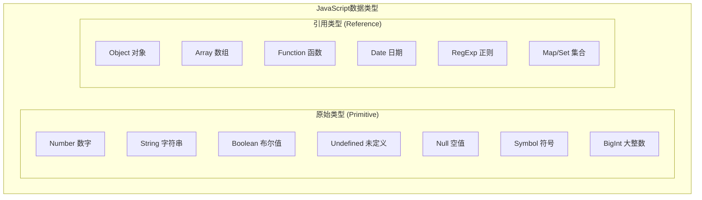
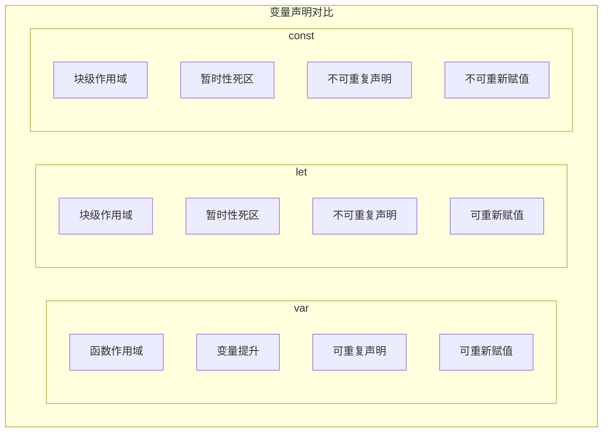
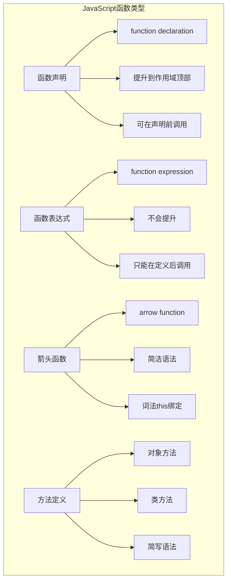

import Tabs from '@theme/Tabs';
import TabItem from '@theme/TabItem';
import CodeBlock from '@theme/CodeBlock';

# JavaScript核心基础与现代特性

JavaScript是现代Web开发的核心语言，从简单的网页脚本发展为功能强大的编程语言，支持函数式编程、面向对象编程和异步编程等多种编程范式。掌握JavaScript的核心概念对于前端开发至关重要。

:::tip 核心价值
**JavaScript = 动态类型 + 函数式编程 + 面向对象 + 异步编程**
- 🔄 **动态类型系统**：灵活的类型转换和运行时类型检查
- 🎯 **函数式编程**：高阶函数、闭包、纯函数等特性
- 🏗️ **面向对象编程**：原型链、类、继承等机制
- ⚡ **异步编程**：Promise、async/await、事件循环
- 🌐 **跨平台能力**：浏览器、Node.js、移动端统一语言
- 📦 **丰富生态**：npm生态系统和无数开源库
:::

## 1. JavaScript数据类型系统

### 1.1 数据类型分类

JavaScript有两大类数据类型：原始类型（Primitive Types）和引用类型（Reference Types）。


#### 数据类型特性对比

| 类型分类 | 存储方式 | 赋值行为 | 比较方式 | 可变性 |
|---------|----------|----------|----------|--------|
| **原始类型** | 栈内存 | 值拷贝 | 值比较 | 不可变 |
| **引用类型** | 堆内存 | 引用拷贝 | 引用比较 | 可变 |

<Tabs>
<TabItem value="primitive" label="原始类型详解">

#### 原始类型深度解析

```javascript title="原始类型完整示例"
// 1. Number 数字类型
const integer = 42;                    // 整数
const float = 3.14159;                 // 浮点数
const scientific = 1.23e-4;           // 科学计数法
const binary = 0b1010;                 // 二进制
const octal = 0o755;                   // 八进制
const hex = 0xFF;                      // 十六进制
const infinity = Infinity;             // 无穷大
const notANumber = NaN;                // 非数字

// 数字类型检查和转换
console.log(Number.isInteger(42));     // true
console.log(Number.isNaN(NaN));        // true
console.log(Number.parseFloat('3.14')); // 3.14
console.log(Number.parseInt('42px'));   // 42

// 2. String 字符串类型
const singleQuote = 'Hello World';
const doubleQuote = "Hello World";
const templateLiteral = `Hello ${name}`;
const multiLine = `
  这是一个
  多行字符串
`;

// 字符串方法
const text = "JavaScript";
console.log(text.length);              // 10
console.log(text.toUpperCase());       // "JAVASCRIPT"
console.log(text.slice(0, 4));         // "Java"
console.log(text.includes('Script'));  // true
console.log(text.split(''));           // ['J','a','v','a','S','c','r','i','p','t']

// 3. Boolean 布尔类型
const isTrue = true;
const isFalse = false;

// 布尔转换规则
console.log(Boolean(0));               // false
console.log(Boolean(''));              // false
console.log(Boolean(null));            // false
console.log(Boolean(undefined));       // false
console.log(Boolean(NaN));             // false
console.log(Boolean([]));              // true (空数组是真值)
console.log(Boolean({}));              // true (空对象是真值)

// 4. Undefined 和 Null
let undefinedVar;                      // undefined
const nullVar = null;                  // null

console.log(typeof undefined);         // "undefined"
console.log(typeof null);              // "object" (历史遗留问题)
console.log(undefined == null);        // true (宽松相等)
console.log(undefined === null);       // false (严格相等)

// 5. Symbol 符号类型 (ES6+)
const symbol1 = Symbol('description');
const symbol2 = Symbol('description');
console.log(symbol1 === symbol2);      // false (每个Symbol都是唯一的)

// Symbol的应用场景
const PRIVATE_KEY = Symbol('private');
const obj = {
  publicProperty: 'public',
  [PRIVATE_KEY]: 'private'
};

// 6. BigInt 大整数类型 (ES2020+)
const bigInt1 = 123456789012345678901234567890n;
const bigInt2 = BigInt('123456789012345678901234567890');
console.log(bigInt1 === bigInt2);      // true

// BigInt运算
console.log(bigInt1 + 1n);             // 需要使用BigInt进行运算
// console.log(bigInt1 + 1);           // TypeError: 不能混合BigInt和Number
```

</TabItem>
<TabItem value="reference" label="引用类型详解">

#### 引用类型深度解析

```javascript title="引用类型完整示例"
// 1. Object 对象类型
const person = {
  name: 'John',
  age: 30,
  address: {
    city: 'New York',
    country: 'USA'
  },
  greet() {
    return `Hello, I'm ${this.name}`;
  }
};

// 对象操作
console.log(person.name);              // "John"
console.log(person['age']);            // 30
person.email = 'john@example.com';     // 动态添加属性
delete person.age;                     // 删除属性

// 对象方法
console.log(Object.keys(person));      // 获取所有键
console.log(Object.values(person));    // 获取所有值
console.log(Object.entries(person));   // 获取键值对数组

// 2. Array 数组类型
const numbers = [1, 2, 3, 4, 5];
const mixed = [1, 'hello', true, null, { name: 'object' }];

// 数组方法 - 变异方法（修改原数组）
numbers.push(6);                       // 添加到末尾
numbers.pop();                         // 删除末尾元素
numbers.unshift(0);                    // 添加到开头
numbers.shift();                       // 删除开头元素
numbers.splice(2, 1, 'new');           // 删除并插入

// 数组方法 - 非变异方法（返回新数组）
const doubled = numbers.map(n => n * 2);
const evens = numbers.filter(n => n % 2 === 0);
const sum = numbers.reduce((acc, n) => acc + n, 0);
const found = numbers.find(n => n > 3);
const hasLarge = numbers.some(n => n > 10);
const allPositive = numbers.every(n => n > 0);

// 3. Function 函数类型
// 函数声明
function regularFunction(a, b) {
  return a + b;
}

// 函数表达式
const functionExpression = function(a, b) {
  return a + b;
};

// 箭头函数
const arrowFunction = (a, b) => a + b;
const singleParam = x => x * 2;
const noParams = () => 'Hello';

// 高阶函数
function createMultiplier(factor) {
  return function(number) {
    return number * factor;
  };
}

const double = createMultiplier(2);
console.log(double(5)); // 10

// 4. Date 日期类型
const now = new Date();
const specificDate = new Date('2023-12-25');
const timestamp = new Date(1640995200000);

console.log(now.getFullYear());        // 当前年份
console.log(now.getMonth());           // 月份 (0-11)
console.log(now.getDate());            // 日期
console.log(now.toISOString());        // ISO格式字符串
console.log(now.toLocaleDateString()); // 本地日期格式

// 5. RegExp 正则表达式
const emailRegex = /^[^\s@]+@[^\s@]+\.[^\s@]+$/;
const phoneRegex = new RegExp('^\\d{3}-\\d{3}-\\d{4}$');

console.log(emailRegex.test('user@example.com')); // true
console.log('Hello World'.match(/\w+/g));         // ['Hello', 'World']
console.log('abc123def'.replace(/\d+/g, 'XXX'));  // 'abcXXXdef'

// 6. Map 和 Set (ES6+)
const map = new Map();
map.set('name', 'John');
map.set(1, 'number key');
map.set(true, 'boolean key');

console.log(map.get('name'));          // "John"
console.log(map.has(1));               // true
console.log(map.size);                 // 3

const set = new Set([1, 2, 3, 3, 4]);
console.log(set);                      // Set {1, 2, 3, 4}
set.add(5);
set.delete(1);
console.log(set.has(2));               // true
```

</TabItem>
<TabItem value="type-conversion" label="类型转换">

#### 类型转换机制

```javascript title="类型转换完整示例"
// 1. 显式类型转换
// 转换为字符串
console.log(String(123));              // "123"
console.log(String(true));             // "true"
console.log(String(null));             // "null"
console.log(String(undefined));        // "undefined"
console.log((123).toString());         // "123"

// 转换为数字
console.log(Number('123'));            // 123
console.log(Number('123.45'));         // 123.45
console.log(Number('123px'));          // NaN
console.log(Number(true));             // 1
console.log(Number(false));            // 0
console.log(Number(null));             // 0
console.log(Number(undefined));        // NaN

console.log(parseInt('123px'));        // 123
console.log(parseFloat('123.45px'));   // 123.45

// 转换为布尔值
console.log(Boolean(1));               // true
console.log(Boolean(0));               // false
console.log(Boolean(''));              // false
console.log(Boolean('hello'));         // true
console.log(Boolean([]));              // true
console.log(Boolean({}));              // true

// 2. 隐式类型转换
// 字符串拼接
console.log('5' + 3);                  // "53"
console.log('5' + true);               // "5true"
console.log('5' + null);               // "5null"

// 数学运算
console.log('5' - 3);                  // 2
console.log('5' * 3);                  // 15
console.log('5' / 2);                  // 2.5
console.log('5' % 2);                  // 1

// 比较运算
console.log('5' == 5);                 // true (宽松相等)
console.log('5' === 5);                // false (严格相等)
console.log(null == undefined);        // true
console.log(null === undefined);       // false

// 3. 特殊的类型转换规则
// 对象到原始值的转换
const obj = {
  valueOf() {
    return 42;
  },
  toString() {
    return 'object';
  }
};

console.log(obj + 1);                  // 43 (调用valueOf)
console.log(String(obj));              // "object" (调用toString)

// 数组的类型转换
console.log([1, 2, 3] + '');           // "1,2,3"
console.log([] + '');                  // ""
console.log([1] + 1);                  // "11"
console.log([1, 2] + 1);               // "1,21"

// 4. 类型检测方法
function getType(value) {
  return Object.prototype.toString.call(value).slice(8, -1);
}

console.log(typeof 123);               // "number"
console.log(typeof 'hello');           // "string"
console.log(typeof true);              // "boolean"
console.log(typeof undefined);         // "undefined"
console.log(typeof null);              // "object" (历史遗留)
console.log(typeof {});                // "object"
console.log(typeof []);                // "object"
console.log(typeof function(){});      // "function"

console.log(getType(123));             // "Number"
console.log(getType('hello'));         // "String"
console.log(getType([]));              // "Array"
console.log(getType({}));              // "Object"
console.log(getType(null));            // "Null"

console.log(Array.isArray([]));        // true
console.log(Number.isInteger(42));     // true
console.log(Number.isNaN(NaN));        // true
```

</TabItem>
</Tabs>

## 2. 变量与作用域

### 2.1 变量声明方式

JavaScript提供了三种变量声明方式：`var`、`let`、`const`，它们在作用域、提升和重复声明方面有重要区别。



#### 变量声明对比表

| 特性 | var | let | const | 推荐使用 |
|------|-----|-----|-------|----------|
| **作用域** | 函数作用域 | 块级作用域 | 块级作用域 | let/const |
| **变量提升** | 是 | 否（暂时性死区） | 否（暂时性死区） | let/const |
| **重复声明** | 允许 | 不允许 | 不允许 | let/const |
| **重新赋值** | 允许 | 允许 | 不允许 | 根据需求 |
| **全局对象属性** | 是 | 否 | 否 | let/const |

<Tabs>
<TabItem value="var-issues" label="var的问题">

#### var声明的问题

```javascript title="var声明问题示例"
// 1. 函数作用域问题
function varScopeIssue() {
  if (true) {
    var x = 1;
  }
  console.log(x); // 1 - var没有块级作用域
}

// 2. 变量提升问题
console.log(hoistedVar); // undefined - 变量提升但未赋值
var hoistedVar = 'Hello';

// 等价于：
// var hoistedVar;
// console.log(hoistedVar); // undefined
// hoistedVar = 'Hello';

// 3. 循环中的问题
for (var i = 0; i < 3; i++) {
  setTimeout(() => {
    console.log('var:', i); // 输出: 3, 3, 3
  }, 100);
}

// 4. 重复声明问题
var name = 'John';
var name = 'Jane'; // 不会报错，但可能导致意外覆盖
console.log(name); // 'Jane'

// 5. 全局对象污染
var globalVar = 'I am global';
console.log(window.globalVar); // 'I am global' (在浏览器中)
```

</TabItem>
<TabItem value="let-const" label="let和const的优势">

#### let和const的优势

```javascript title="let和const优势示例"
// 1. 块级作用域
function blockScopeExample() {
  if (true) {
    let blockScoped = 'I am block scoped';
    const alsoBlockScoped = 'Me too';
  }
  // console.log(blockScoped); // ReferenceError
  // console.log(alsoBlockScoped); // ReferenceError
}

// 2. 暂时性死区
function temporalDeadZone() {
  // console.log(letVar); // ReferenceError: Cannot access before initialization
  let letVar = 'Hello';
  
  // console.log(constVar); // ReferenceError: Cannot access before initialization
  const constVar = 'World';
}

// 3. 循环中的正确行为
for (let i = 0; i < 3; i++) {
  setTimeout(() => {
    console.log('let:', i); // 输出: 0, 1, 2
  }, 100);
}

// 4. 不允许重复声明
// let name = 'John';
// let name = 'Jane'; // SyntaxError: Identifier 'name' has already been declared

// 5. const的不可变性
const config = {
  apiUrl: 'https://api.example.com',
  timeout: 5000
};

// config = {}; // TypeError: Assignment to constant variable

// 但可以修改对象属性
config.timeout = 10000; // 这是允许的
config.newProperty = 'new value'; // 这也是允许的

// 如果需要完全不可变，使用Object.freeze()
const frozenConfig = Object.freeze({
  apiUrl: 'https://api.example.com',
  timeout: 5000
});

// frozenConfig.timeout = 10000; // 在严格模式下会抛出错误
```

</TabItem>
<TabItem value="best-practices" label="最佳实践">

#### 变量声明最佳实践

```javascript title="变量声明最佳实践"
// 1. 优先使用const，需要重新赋值时使用let
const API_URL = 'https://api.example.com';
const users = [];
let currentUser = null;

// 2. 在最小作用域内声明变量
function processData(data) {
  const processedData = [];
  
  for (let i = 0; i < data.length; i++) {
    const item = data[i];
    
    if (item.active) {
      const processedItem = {
        id: item.id,
        name: item.name.toUpperCase(),
        timestamp: Date.now()
      };
      processedData.push(processedItem);
    }
  }
  
  return processedData;
}

// 3. 使用有意义的变量名
// 不好的命名
const d = new Date();
const u = users.filter(x => x.a);

// 好的命名
const currentDate = new Date();
const activeUsers = users.filter(user => user.active);

// 4. 常量使用大写字母和下划线
const MAX_RETRY_COUNT = 3;
const DEFAULT_TIMEOUT = 5000;
const API_ENDPOINTS = {
  USERS: '/api/users',
  POSTS: '/api/posts'
};

// 5. 解构赋值优化变量声明
const user = {
  name: 'John',
  age: 30,
  address: {
    city: 'New York',
    country: 'USA'
  }
};

// 传统方式
const name = user.name;
const age = user.age;
const city = user.address.city;

// 解构赋值方式
const { name, age, address: { city } } = user;

// 6. 模块化变量管理
// config.js
export const CONFIG = {
  API_URL: process.env.API_URL || 'http://localhost:3000',
  TIMEOUT: 5000,
  MAX_RETRIES: 3
};

// constants.js
export const HTTP_STATUS = {
  OK: 200,
  CREATED: 201,
  BAD_REQUEST: 400,
  UNAUTHORIZED: 401,
  NOT_FOUND: 404,
  INTERNAL_SERVER_ERROR: 500
};

export const EVENTS = {
  USER_LOGIN: 'user:login',
  USER_LOGOUT: 'user:logout',
  DATA_LOADED: 'data:loaded'
};
```

</TabItem>
</Tabs>

## 3. 函数与作用域

### 3.1 函数定义方式

JavaScript提供了多种函数定义方式，每种方式都有其特定的用途和特性。



<Tabs>
<TabItem value="function-types" label="函数类型">

#### 函数定义方式详解

```javascript title="函数定义方式对比"
// 1. 函数声明 (Function Declaration)
function greet(name) {
  return `Hello, ${name}!`;
}

// 函数声明会被提升，可以在声明前调用
console.log(sayHello('World')); // "Hello, World!"

function sayHello(name) {
  return `Hello, ${name}!`;
}

// 2. 函数表达式 (Function Expression)
const greetExpression = function(name) {
  return `Hello, ${name}!`;
};

// 命名函数表达式
const greetNamed = function greetFunction(name) {
  return `Hello, ${name}!`;
};

// 3. 箭头函数 (Arrow Function)
const greetArrow = (name) => {
  return `Hello, ${name}!`;
};

// 简化的箭头函数
const greetShort = name => `Hello, ${name}!`;

// 无参数箭头函数
const getCurrentTime = () => new Date().toISOString();

// 多参数箭头函数
const add = (a, b) => a + b;

// 返回对象字面量（需要括号）
const createUser = (name, age) => ({ name, age, id: Date.now() });

// 4. 方法定义
const obj = {
  // 传统方法定义
  greet: function(name) {
    return `Hello, ${name}!`;
  },
  
  // ES6简写方法
  greetShort(name) {
    return `Hello, ${name}!`;
  },
  
  // 箭头函数方法（注意this绑定）
  greetArrow: (name) => {
    // 这里的this不指向obj
    return `Hello, ${name}!`;
  }
};

// 5. 构造函数
function Person(name, age) {
  this.name = name;
  this.age = age;
  this.greet = function() {
    return `Hello, I'm ${this.name}`;
  };
}

// 使用new关键字创建实例
const person = new Person('John', 30);

// 6. 生成器函数
function* numberGenerator() {
  let i = 0;
  while (true) {
    yield i++;
  }
}

const gen = numberGenerator();
console.log(gen.next().value); // 0
console.log(gen.next().value); // 1

// 7. 异步函数
async function fetchData(url) {
  try {
    const response = await fetch(url);
    const data = await response.json();
    return data;
  } catch (error) {
    console.error('Fetch error:', error);
    throw error;
  }
}

// 异步箭头函数
const fetchDataArrow = async (url) => {
  const response = await fetch(url);
  return response.json();
};

// 8. 立即执行函数表达式 (IIFE)
(function() {
  console.log('IIFE executed immediately');
})();

// 箭头函数IIFE
(() => {
  console.log('Arrow IIFE executed');
})();

// 带参数的IIFE
((name) => {
  console.log(`Hello, ${name}!`);
})('World');

// 9. 高阶函数
function createMultiplier(factor) {
  return function(number) {
    return number * factor;
  };
}

const double = createMultiplier(2);
const triple = createMultiplier(3);

console.log(double(5)); // 10
console.log(triple(4)); // 12

// 10. 函数作为参数
function processArray(arr, callback) {
  const result = [];
  for (let i = 0; i < arr.length; i++) {
    result.push(callback(arr[i], i, arr));
  }
  return result;
}

const numbers = [1, 2, 3, 4, 5];
const doubled = processArray(numbers, x => x * 2);
console.log(doubled); // [2, 4, 6, 8, 10]
```

</TabItem>
<TabItem value="scope-chain" label="作用域链">

#### 作用域与作用域链

```javascript title="作用域链详解"
// 全局作用域
var globalVar = 'I am global';
let globalLet = 'I am also global';
const globalConst = 'I am global too';

function outerFunction(outerParam) {
  // 外层函数作用域
  var outerVar = 'I am in outer function';
  let outerLet = 'I am outer let';
  
  console.log('In outer function:');
  console.log('- Can access globalVar:', globalVar);
  console.log('- Can access outerParam:', outerParam);
  console.log('- Can access outerVar:', outerVar);
  
  function innerFunction(innerParam) {
    // 内层函数作用域
    var innerVar = 'I am in inner function';
    let innerLet = 'I am inner let';
    
    console.log('In inner function:');
    console.log('- Can access globalVar:', globalVar);
    console.log('- Can access outerParam:', outerParam);
    console.log('- Can access outerVar:', outerVar);
    console.log('- Can access innerParam:', innerParam);
    console.log('- Can access innerVar:', innerVar);
    
    // 作用域链查找顺序：
    // 1. 当前函数作用域 (innerFunction)
    // 2. 外层函数作用域 (outerFunction)
    // 3. 全局作用域
    
    function deeperFunction() {
      console.log('In deeper function:');
      console.log('- Still can access outerParam:', outerParam);
      console.log('- Still can access innerVar:', innerVar);
    }
    
    return deeperFunction;
  }
  
  return innerFunction;
}

// 调用示例
const inner = outerFunction('outer parameter');
const deeper = inner('inner parameter');
deeper();

// 块级作用域示例
function blockScopeExample() {
  console.log('=== Block Scope Example ===');
  
  if (true) {
    var varInBlock = 'var in block';
    let letInBlock = 'let in block';
    const constInBlock = 'const in block';
    
    console.log('Inside block:');
    console.log('- varInBlock:', varInBlock);
    console.log('- letInBlock:', letInBlock);
    console.log('- constInBlock:', constInBlock);
  }
  
  console.log('Outside block:');
  console.log('- varInBlock:', varInBlock); // 可以访问
  // console.log('- letInBlock:', letInBlock); // ReferenceError
  // console.log('- constInBlock:', constInBlock); // ReferenceError
  
  // 循环中的作用域
  for (var i = 0; i < 3; i++) {
    // var i 在函数作用域中
  }
  console.log('var i after loop:', i); // 3
  
  for (let j = 0; j < 3; j++) {
    // let j 在块级作用域中
  }
  // console.log('let j after loop:', j); // ReferenceError
}

blockScopeExample();

// 闭包示例
function createCounter() {
  let count = 0;
  
  return {
    increment() {
      count++;
      return count;
    },
    
    decrement() {
      count--;
      return count;
    },
    
    getCount() {
      return count;
    }
  };
}

const counter1 = createCounter();
const counter2 = createCounter();

console.log('Counter 1:', counter1.increment()); // 1
console.log('Counter 1:', counter1.increment()); // 2
console.log('Counter 2:', counter2.increment()); // 1
console.log('Counter 1 current:', counter1.getCount()); // 2

// 模块模式
const Module = (function() {
  // 私有变量和方法
  let privateVar = 'I am private';
  
  function privateMethod() {
    return 'This is a private method';
  }
  
  // 公共接口
  return {
    publicVar: 'I am public',
    
    publicMethod() {
      return 'This is a public method';
    },
    
    accessPrivate() {
      return privateVar + ' - accessed through public method';
    },
    
    callPrivateMethod() {
      return privateMethod();
    }
  };
})();

console.log(Module.publicVar); // "I am public"
console.log(Module.publicMethod()); // "This is a public method"
console.log(Module.accessPrivate()); // "I am private - accessed through public method"
// console.log(Module.privateVar); // undefined

// 词法作用域与动态作用域对比
function lexicalScopeExample() {
  const name = 'Lexical';
  
  function inner() {
    console.log('Name in inner:', name); // 总是 'Lexical'
  }
  
  function callInner() {
    const name = 'Dynamic';
    inner(); // 仍然输出 'Lexical'，因为JavaScript使用词法作用域
  }
  
  callInner();
}

lexicalScopeExample();
```

</TabItem>
<TabItem value="closures" label="闭包详解">

#### 闭包深度解析

```javascript title="闭包详解与应用"
// 1. 闭包基础概念
function outerFunction(x) {
  // 外层函数的变量
  const outerVariable = x;
  
  // 内层函数（闭包）
  function innerFunction(y) {
    // 内层函数可以访问外层函数的变量
    return outerVariable + y;
  }
  
  // 返回内层函数
  return innerFunction;
}

const closure = outerFunction(10);
console.log(closure(5)); // 15

// 2. 闭包的实际应用

// 数据封装和私有变量
function createBankAccount(initialBalance) {
  let balance = initialBalance;
  
  return {
    deposit(amount) {
      if (amount > 0) {
        balance += amount;
        return balance;
      }
      throw new Error('Deposit amount must be positive');
    },
    
    withdraw(amount) {
      if (amount > 0 && amount <= balance) {
        balance -= amount;
        return balance;
      }
      throw new Error('Invalid withdrawal amount');
    },
    
    getBalance() {
      return balance;
    }
  };
}

const account = createBankAccount(1000);
console.log(account.deposit(500)); // 1500
console.log(account.withdraw(200)); // 1300
console.log(account.getBalance()); // 1300
// console.log(account.balance); // undefined - 无法直接访问私有变量

// 3. 函数工厂
function createValidator(pattern, errorMessage) {
  const regex = new RegExp(pattern);
  
  return function(value) {
    if (regex.test(value)) {
      return { valid: true, value };
    } else {
      return { valid: false, error: errorMessage };
    }
  };
}

const emailValidator = createValidator(
  '^[^\\s@]+@[^\\s@]+\\.[^\\s@]+$',
  'Invalid email format'
);

const phoneValidator = createValidator(
  '^\\d{3}-\\d{3}-\\d{4}$',
  'Phone number must be in format: 123-456-7890'
);

console.log(emailValidator('user@example.com')); // { valid: true, value: 'user@example.com' }
console.log(phoneValidator('123-456-7890')); // { valid: true, value: '123-456-7890' }

// 4. 记忆化（Memoization）
function memoize(fn) {
  const cache = {};
  
  return function(...args) {
    const key = JSON.stringify(args);
    
    if (key in cache) {
      console.log('Cache hit for:', key);
      return cache[key];
    }
    
    console.log('Computing for:', key);
    const result = fn.apply(this, args);
    cache[key] = result;
    
    return result;
  };
}

// 斐波那契数列（递归版本）
const fibonacci = memoize(function(n) {
  if (n <= 1) return n;
  return fibonacci(n - 1) + fibonacci(n - 2);
});

console.log(fibonacci(10)); // 计算并缓存
console.log(fibonacci(10)); // 从缓存获取

// 5. 偏函数应用
function partial(fn, ...presetArgs) {
  return function(...laterArgs) {
    return fn(...presetArgs, ...laterArgs);
  };
}

function multiply(a, b, c) {
  return a * b * c;
}

const multiplyBy2 = partial(multiply, 2);
const multiplyBy2And3 = partial(multiply, 2, 3);

console.log(multiplyBy2(3, 4)); // 2 * 3 * 4 = 24
console.log(multiplyBy2And3(5)); // 2 * 3 * 5 = 30

// 6. 柯里化
function curry(fn) {
  return function curried(...args) {
    if (args.length >= fn.length) {
      return fn.apply(this, args);
    } else {
      return function(...nextArgs) {
        return curried(...args, ...nextArgs);
      };
    }
  };
}

const curriedMultiply = curry(multiply);
const step1 = curriedMultiply(2);
const step2 = step1(3);
const result = step2(4);
console.log(result); // 24

// 或者链式调用
console.log(curriedMultiply(2)(3)(4)); // 24

// 7. 事件处理中的闭包
function setupEventHandlers() {
  const buttons = document.querySelectorAll('.btn');
  
  for (let i = 0; i < buttons.length; i++) {
    // 使用闭包保存循环变量
    buttons[i].addEventListener('click', (function(index) {
      return function() {
        console.log(`Button ${index} clicked`);
      };
    })(i));
  }
  
  // 或者使用let的块级作用域
  for (let i = 0; i < buttons.length; i++) {
    buttons[i].addEventListener('click', function() {
      console.log(`Button ${i} clicked`);
    });
  }
}

// 8. 模块模式的高级应用
const AdvancedModule = (function() {
  // 私有变量
  let privateCounter = 0;
  const privateData = [];
  
  // 私有方法
  function privateMethod() {
    return 'This is private';
  }
  
  function validateInput(input) {
    return input != null && input !== '';
  }
  
  // 公共接口
  return {
    // 公共方法
    increment() {
      privateCounter++;
      return privateCounter;
    },
    
    decrement() {
      privateCounter--;
      return privateCounter;
    },
    
    getCounter() {
      return privateCounter;
    },
    
    addData(item) {
      if (validateInput(item)) {
        privateData.push(item);
        return true;
      }
      return false;
    },
    
    getData() {
      return [...privateData]; // 返回副本，防止外部修改
    },
    
    // 特权方法（可以访问私有成员）
    reset() {
      privateCounter = 0;
      privateData.length = 0;
      return 'Module reset';
    }
  };
})();

console.log(AdvancedModule.increment()); // 1
console.log(AdvancedModule.addData('test')); // true
console.log(AdvancedModule.getData()); // ['test']

// 9. 闭包的内存管理
function createLeakyFunction() {
  const largeData = new Array(1000000).fill('data');
  
  return function() {
    // 这个函数保持对largeData的引用
    return largeData.length;
  };
}

// 避免内存泄漏的方法
function createOptimizedFunction() {
  const largeData = new Array(1000000).fill('data');
  const dataLength = largeData.length;
  
  return function() {
    // 只保存需要的值，而不是整个数组
    return dataLength;
  };
}

// 10. 闭包与异步操作
function createAsyncProcessor() {
  let processingQueue = [];
  let isProcessing = false;
  
  async function processQueue() {
    if (isProcessing || processingQueue.length === 0) {
      return;
    }
    
    isProcessing = true;
    
    while (processingQueue.length > 0) {
      const task = processingQueue.shift();
      try {
        await task();
      } catch (error) {
        console.error('Task failed:', error);
      }
    }
    
    isProcessing = false;
  }
  
  return {
    addTask(asyncTask) {
      processingQueue.push(asyncTask);
      processQueue();
    },
    
    getQueueLength() {
      return processingQueue.length;
    },
    
    isProcessing() {
      return isProcessing;
    }
  };
}

const processor = createAsyncProcessor();

processor.addTask(async () => {
  console.log('Task 1 started');
  await new Promise(resolve => setTimeout(resolve, 1000));
  console.log('Task 1 completed');
});

processor.addTask(async () => {
  console.log('Task 2 started');
  await new Promise(resolve => setTimeout(resolve, 500));
  console.log('Task 2 completed');
});
```

</TabItem>
</Tabs>

## 4. 对象与原型

### 4.1 对象创建与操作

JavaScript中的对象是键值对的集合，是语言的核心数据结构。

<Tabs>
<TabItem value="object-creation" label="对象创建">

#### 对象创建方式

```javascript title="对象创建方式详解"
// 1. 对象字面量（最常用）
const person = {
  name: 'John',
  age: 30,
  city: 'New York',
  
  // 方法
  greet() {
    return `Hello, I'm ${this.name}`;
  },
  
  // 计算属性名
  ['full' + 'Name']: 'John Doe',
  
  // 属性简写
  // 如果变量名和属性名相同，可以简写
  // name, // 等价于 name: name
};

// 2. Object构造函数
const person2 = new Object();
person2.name = 'Jane';
person2.age = 25;
person2.greet = function() {
  return `Hello, I'm ${this.name}`;
};

// 3. Object.create()
const personPrototype = {
  greet() {
    return `Hello, I'm ${this.name}`;
  },
  
  setAge(age) {
    this.age = age;
  }
};

const person3 = Object.create(personPrototype);
person3.name = 'Bob';
person3.age = 35;

// 4. 构造函数
function Person(name, age) {
  this.name = name;
  this.age = age;
}

Person.prototype.greet = function() {
  return `Hello, I'm ${this.name}`;
};

const person4 = new Person('Alice', 28);

// 5. 类语法（ES6+）
class PersonClass {
  constructor(name, age) {
    this.name = name;
    this.age = age;
  }
  
  greet() {
    return `Hello, I'm ${this.name}`;
  }
  
  static createAnonymous() {
    return new PersonClass('Anonymous', 0);
  }
}

const person5 = new PersonClass('Charlie', 32);

// 6. 工厂函数
function createPerson(name, age) {
  return {
    name,
    age,
    greet() {
      return `Hello, I'm ${this.name}`;
    }
  };
}

const person6 = createPerson('David', 27);

// 7. 使用Object.assign()
const defaultPerson = {
  name: 'Unknown',
  age: 0,
  city: 'Unknown'
};

const person7 = Object.assign({}, defaultPerson, {
  name: 'Eve',
  age: 29
});

// 8. 使用扩展运算符
const person8 = {
  ...defaultPerson,
  name: 'Frank',
  age: 31
};

// 9. 动态属性创建
function createObjectWithDynamicProps(props) {
  const obj = {};
  
  for (const [key, value] of Object.entries(props)) {
    obj[key] = value;
  }
  
  return obj;
}

const dynamicPerson = createObjectWithDynamicProps({
  name: 'Grace',
  age: 26,
  occupation: 'Developer'
});

// 10. 使用Proxy创建对象
const personProxy = new Proxy({}, {
  set(target, property, value) {
    if (property === 'age' && (typeof value !== 'number' || value < 0)) {
      throw new Error('Age must be a positive number');
    }
    target[property] = value;
    return true;
  },
  
  get(target, property) {
    if (property === 'info') {
      return `${target.name} is ${target.age} years old`;
    }
    return target[property];
  }
});

personProxy.name = 'Henry';
personProxy.age = 33;
console.log(personProxy.info); // "Henry is 33 years old"
```

</TabItem>
<TabItem value="object-operations" label="对象操作">

#### 对象操作详解

```javascript title="对象操作完整示例"
const user = {
  id: 1,
  name: 'John Doe',
  email: 'john@example.com',
  age: 30,
  address: {
    street: '123 Main St',
    city: 'New York',
    country: 'USA'
  },
  hobbies: ['reading', 'coding', 'gaming']
};

// 1. 属性访问
console.log(user.name); // 点号访问
console.log(user['email']); // 方括号访问
console.log(user.address.city); // 嵌套属性访问

// 动态属性访问
const propertyName = 'age';
console.log(user[propertyName]); // 30

// 2. 属性检查
console.log('name' in user); // true
console.log(user.hasOwnProperty('name')); // true
console.log(user.hasOwnProperty('toString')); // false (继承的属性)

// 3. 属性添加和修改
user.phone = '123-456-7890'; // 添加新属性
user.age = 31; // 修改现有属性
user.address.zipCode = '10001'; // 添加嵌套属性

// 4. 属性删除
delete user.phone;
console.log(user.phone); // undefined

// 5. 对象遍历
// for...in 遍历所有可枚举属性（包括继承的）
for (const key in user) {
  if (user.hasOwnProperty(key)) {
    console.log(`${key}: ${user[key]}`);
  }
}

// Object.keys() 只遍历自有可枚举属性
Object.keys(user).forEach(key => {
  console.log(`${key}: ${user[key]}`);
});

// Object.entries() 获取键值对数组
Object.entries(user).forEach(([key, value]) => {
  console.log(`${key}: ${value}`);
});

// Object.values() 获取所有值
Object.values(user).forEach(value => {
  console.log(value);
});

// 6. 对象复制
// 浅拷贝
const shallowCopy1 = Object.assign({}, user);
const shallowCopy2 = { ...user };

// 深拷贝（简单版本，不处理函数、日期等特殊对象）
const deepCopy = JSON.parse(JSON.stringify(user));

// 深拷贝（完整版本）
function deepClone(obj) {
  if (obj === null || typeof obj !== 'object') {
    return obj;
  }
  
  if (obj instanceof Date) {
    return new Date(obj.getTime());
  }
  
  if (obj instanceof Array) {
    return obj.map(item => deepClone(item));
  }
  
  if (typeof obj === 'object') {
    const clonedObj = {};
    for (const key in obj) {
      if (obj.hasOwnProperty(key)) {
        clonedObj[key] = deepClone(obj[key]);
      }
    }
    return clonedObj;
  }
}

const deepCopyComplete = deepClone(user);

// 7. 对象合并
const additionalInfo = {
  occupation: 'Developer',
  company: 'Tech Corp'
};

const mergedUser = {
  ...user,
  ...additionalInfo,
  age: 32 // 覆盖原有属性
};

// 深度合并
function deepMerge(target, source) {
  const result = { ...target };
  
  for (const key in source) {
    if (source.hasOwnProperty(key)) {
      if (
        source[key] && 
        typeof source[key] === 'object' && 
        !Array.isArray(source[key])
      ) {
        result[key] = deepMerge(result[key] || {}, source[key]);
      } else {
        result[key] = source[key];
      }
    }
  }
  
  return result;
}

// 8. 对象属性描述符
Object.defineProperty(user, 'id', {
  writable: false, // 不可写
  enumerable: true, // 可枚举
  configurable: false // 不可配置
});

// user.id = 2; // 在严格模式下会抛出错误

// 获取属性描述符
const descriptor = Object.getOwnPropertyDescriptor(user, 'id');
console.log(descriptor);

// 定义多个属性
Object.defineProperties(user, {
  firstName: {
    get() {
      return this.name.split(' ')[0];
    },
    enumerable: true
  },
  lastName: {
    get() {
      return this.name.split(' ')[1];
    },
    enumerable: true
  }
});

// 9. 对象冻结和密封
const frozenUser = Object.freeze({ ...user });
// frozenUser.name = 'Jane'; // 无效，对象被冻结

const sealedUser = Object.seal({ ...user });
sealedUser.name = 'Jane'; // 可以修改现有属性
// sealedUser.newProp = 'value'; // 无效，不能添加新属性

// 检查对象状态
console.log(Object.isFrozen(frozenUser)); // true
console.log(Object.isSealed(sealedUser)); // true
console.log(Object.isExtensible(user)); // true

// 10. 对象比较
function objectsEqual(obj1, obj2) {
  const keys1 = Object.keys(obj1);
  const keys2 = Object.keys(obj2);
  
  if (keys1.length !== keys2.length) {
    return false;
  }
  
  for (const key of keys1) {
    if (!keys2.includes(key)) {
      return false;
    }
    
    if (typeof obj1[key] === 'object' && typeof obj2[key] === 'object') {
      if (!objectsEqual(obj1[key], obj2[key])) {
        return false;
      }
    } else if (obj1[key] !== obj2[key]) {
      return false;
    }
  }
  
  return true;
}

// 11. 对象转换
// 转换为数组
const userEntries = Object.entries(user);
const userKeys = Object.keys(user);
const userValues = Object.values(user);

// 从数组创建对象
const objFromEntries = Object.fromEntries([
  ['name', 'John'],
  ['age', 30],
  ['city', 'New York']
]);

// 12. 对象方法链
const FluentObject = {
  data: {},
  
  set(key, value) {
    this.data[key] = value;
    return this; // 返回this以支持链式调用
  },
  
  get(key) {
    return this.data[key];
  },
  
  delete(key) {
    delete this.data[key];
    return this;
  },
  
  clear() {
    this.data = {};
    return this;
  },
  
  toJSON() {
    return JSON.stringify(this.data);
  }
};

// 链式调用
const result = FluentObject
  .set('name', 'John')
  .set('age', 30)
  .set('city', 'New York')
  .delete('age')
  .toJSON();

console.log(result); // {"name":"John","city":"New York"}
```

</TabItem>
<TabItem value="prototype-chain" label="原型链">

#### 原型链详解

```javascript title="原型链完整解析"
// 1. 原型链基础概念
function Animal(name) {
  this.name = name;
}

Animal.prototype.speak = function() {
  return `${this.name} makes a sound`;
};

Animal.prototype.eat = function() {
  return `${this.name} is eating`;
};

function Dog(name, breed) {
  Animal.call(this, name); // 调用父构造函数
  this.breed = breed;
}

// 设置原型链
Dog.prototype = Object.create(Animal.prototype);
Dog.prototype.constructor = Dog;

// 添加Dog特有的方法
Dog.prototype.bark = function() {
  return `${this.name} barks: Woof!`;
};

// 重写父类方法
Dog.prototype.speak = function() {
  return `${this.name} barks`;
};

const dog = new Dog('Buddy', 'Golden Retriever');

console.log(dog.name); // 'Buddy'
console.log(dog.bark()); // 'Buddy barks: Woof!'
console.log(dog.speak()); // 'Buddy barks' (重写的方法)
console.log(dog.eat()); // 'Buddy is eating' (继承的方法)

// 2. 原型链查找过程
console.log('=== 原型链查找 ===');
console.log(dog.hasOwnProperty('name')); // true (实例属性)
console.log(dog.hasOwnProperty('bark')); // false (原型方法)

// 原型链：dog -> Dog.prototype -> Animal.prototype -> Object.prototype -> null
console.log(Object.getPrototypeOf(dog) === Dog.prototype); // true
console.log(Object.getPrototypeOf(Dog.prototype) === Animal.prototype); // true
console.log(Object.getPrototypeOf(Animal.prototype) === Object.prototype); // true
console.log(Object.getPrototypeOf(Object.prototype) === null); // true

// 3. instanceof 操作符
console.log(dog instanceof Dog); // true
console.log(dog instanceof Animal); // true
console.log(dog instanceof Object); // true

// 4. 原型方法
// Object.create() 创建对象并设置原型
const animalPrototype = {
  speak() {
    return `${this.name} makes a sound`;
  },
  
  eat() {
    return `${this.name} is eating`;
  }
};

const cat = Object.create(animalPrototype);
cat.name = 'Whiskers';
cat.meow = function() {
  return `${this.name} meows`;
};

console.log(cat.speak()); // 'Whiskers makes a sound'
console.log(cat.meow()); // 'Whiskers meows'

// 5. 原型污染示例（需要避免）
// 不要这样做！
// Object.prototype.customMethod = function() {
//   return 'This affects all objects';
// };

// 6. 现代类语法与原型
class ModernAnimal {
  constructor(name) {
    this.name = name;
  }
  
  speak() {
    return `${this.name} makes a sound`;
  }
  
  eat() {
    return `${this.name} is eating`;
  }
  
  static getSpecies() {
    return 'Unknown species';
  }
}

class ModernDog extends ModernAnimal {
  constructor(name, breed) {
    super(name);
    this.breed = breed;
  }
  
  bark() {
    return `${this.name} barks: Woof!`;
  }
  
  speak() {
    return `${this.name} barks`;
  }
  
  static getSpecies() {
    return 'Canis lupus';
  }
}

const modernDog = new ModernDog('Max', 'Labrador');

// 类语法实际上也是基于原型的
console.log(modernDog instanceof ModernDog); // true
console.log(modernDog instanceof ModernAnimal); // true
console.log(ModernDog.prototype.isPrototypeOf(modernDog)); // true

// 7. 原型方法的动态添加
ModernAnimal.prototype.sleep = function() {
  return `${this.name} is sleeping`;
};

// 所有实例都会获得新方法
console.log(modernDog.sleep()); // 'Max is sleeping'

// 8. 原型链的实际应用 - 扩展内置对象
// 注意：在生产环境中要谨慎扩展内置对象
Array.prototype.last = function() {
  return this[this.length - 1];
};

const numbers = [1, 2, 3, 4, 5];
console.log(numbers.last()); // 5

// 9. 原型链调试
function debugPrototypeChain(obj) {
  const chain = [];
  let current = obj;
  
  while (current) {
    chain.push(current.constructor.name || 'Object');
    current = Object.getPrototypeOf(current);
  }
  
  return chain.join(' -> ');
}

console.log(debugPrototypeChain(modernDog)); 
// 'ModernDog -> ModernAnimal -> Object'

// 10. 原型链性能考虑
// 深层原型链会影响属性查找性能
function createDeepChain(depth) {
  let proto = {};
  
  for (let i = 0; i < depth; i++) {
    const newProto = Object.create(proto);
    newProto[`prop${i}`] = `value${i}`;
    proto = newProto;
  }
  
  return proto;
}

const deepObject = createDeepChain(100);
console.time('deep property access');
for (let i = 0; i < 10000; i++) {
  deepObject.prop0; // 需要遍历整个原型链
}
console.timeEnd('deep property access');

// 11. 原型链的安全性
// 防止原型污染
function safeObjectCreate(proto) {
  if (proto === null || typeof proto === 'object') {
    return Object.create(proto);
  }
  throw new Error('Prototype must be an object or null');
}

// 12. 混入模式（Mixin）
const Flyable = {
  fly() {
    return `${this.name} is flying`;
  }
};

const Swimmable = {
  swim() {
    return `${this.name} is swimming`;
  }
};

// 创建具有多种能力的对象
function createDuck(name) {
  const duck = Object.create(animalPrototype);
  duck.name = name;
  
  // 混入多个能力
  Object.assign(duck, Flyable, Swimmable);
  
  return duck;
}

const duck = createDuck('Donald');
console.log(duck.speak()); // 'Donald makes a sound'
console.log(duck.fly()); // 'Donald is flying'
console.log(duck.swim()); // 'Donald is swimming'
```

</TabItem>
</Tabs>

## 面试题

### 1. 解释JavaScript中的变量提升

**答案：**
变量提升是JavaScript引擎在执行代码前，将变量和函数声明移动到其作用域顶部的行为。

- **var声明**：变量声明被提升，但赋值不会提升，初始值为undefined
- **let/const声明**：声明被提升，但存在暂时性死区，访问会报错
- **函数声明**：整个函数定义都会被提升
- **函数表达式**：只有变量声明被提升，函数定义不会

### 2. 什么是闭包？闭包有什么用途？

**答案：**
闭包是指内部函数可以访问外部函数作用域中变量的特性，即使外部函数已经执行完毕。

用途：
- 数据封装和私有变量
- 模块模式
- 函数工厂
- 回调函数中保持状态
- 记忆化和缓存

### 3. 解释JavaScript的原型链

**答案：**
原型链是JavaScript实现继承的机制。每个对象都有一个内部属性`[[Prototype]]`，指向其原型对象。当访问对象属性时，如果对象本身没有该属性，就会沿着原型链向上查找。

查找顺序：对象本身 → 对象原型 → 原型的原型 → ... → Object.prototype → null

### 4. this关键字的绑定规则是什么？

**答案：**
this的绑定遵循以下规则（优先级从高到低）：
1. **new绑定**：使用new调用函数时，this绑定到新创建的对象
2. **显式绑定**：使用call、apply、bind时，this绑定到指定对象
3. **隐式绑定**：作为对象方法调用时，this绑定到该对象
4. **默认绑定**：独立函数调用时，this绑定到全局对象（严格模式下为undefined）

箭头函数不遵循这些规则，它的this由词法作用域决定。

### 5. 如何实现对象的深拷贝？

**答案：**
```javascript
function deepClone(obj) {
  if (obj === null || typeof obj !== 'object') {
    return obj;
  }
  
  if (obj instanceof Date) {
    return new Date(obj.getTime());
  }
  
  if (obj instanceof Array) {
    return obj.map(item => deepClone(item));
  }
  
  if (typeof obj === 'object') {
    const clonedObj = {};
    for (const key in obj) {
      if (obj.hasOwnProperty(key)) {
        clonedObj[key] = deepClone(obj[key]);
      }
    }
    return clonedObj;
  }
}
```

其他方法：
- `JSON.parse(JSON.stringify(obj))`（有限制）
- 使用Lodash的`cloneDeep`
- 使用structuredClone（现代浏览器）

通过掌握这些JavaScript核心概念，可以编写更高质量、更可维护的代码，并为学习更高级的JavaScript特性打下坚实基础。