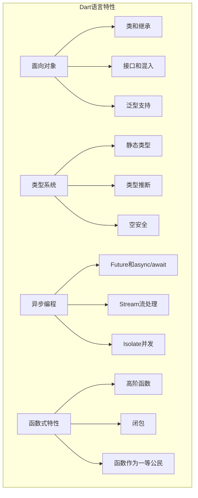
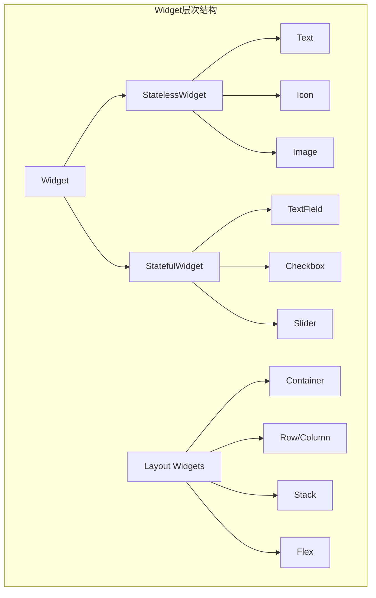

import Tabs from '@theme/Tabs';
import TabItem from '@theme/TabItem';
import CodeBlock from '@theme/CodeBlock';

# Flutter跨平台开发详解

Flutter是Google开发的开源UI工具包，用于从单一代码库构建漂亮的、原生编译的多平台应用程序。Flutter使用Dart语言，提供了丰富的Widget系统和强大的性能，是现代跨平台开发的优秀选择。

:::tip 核心价值
**Flutter = 单一代码库 + 原生性能 + 丰富UI + 热重载**
- 🚀 **跨平台统一**：一套代码运行在iOS、Android、Web、桌面
- ⚡ **原生性能**：直接编译为原生代码，性能接近原生应用
- 🎨 **丰富UI组件**：Material Design和Cupertino风格组件
- 🔥 **热重载**：毫秒级代码更新，极大提升开发效率
- 📦 **完整生态**：丰富的第三方包和工具链
- 🎯 **声明式UI**：直观的UI构建方式，易于理解和维护
:::

## 1. Dart语言基础

### 1.1 Dart语言特性

Dart是Flutter的编程语言，具有现代编程语言的特性，易于学习且功能强大。



<Tabs>
<TabItem value="basics" label="基础语法">

#### Dart基础语法

```dart title="Dart基础语法示例"
// 1. 变量声明
void main() {
  // 类型推断
  var name = 'Flutter';
  var year = 2024;
  var isAwesome = true;
  
  // 显式类型声明
  String language = 'Dart';
  int version = 3;
  bool isNullSafe = true;
  
  // 常量
  const pi = 3.14159;
  final currentTime = DateTime.now();
  
  // 空安全
  String? nullableName; // 可为空
  String nonNullableName = 'Flutter'; // 不可为空
  
  // 空值检查
  print(nullableName?.length ?? 0); // 安全调用
  
  // 集合类型
  List<String> fruits = ['apple', 'banana', 'orange'];
  Set<int> uniqueNumbers = {1, 2, 3, 4, 5};
  Map<String, int> scores = {
    'Alice': 95,
    'Bob': 87,
    'Charlie': 92,
  };
  
  // 展开操作符
  List<String> moreFruits = [...fruits, 'grape', 'kiwi'];
  
  // 条件表达式
  String message = isAwesome ? 'Flutter is awesome!' : 'Try Flutter';
  
  print('$name $year: $message');
}

// 2. 函数定义
// 普通函数
String greet(String name, {String greeting = 'Hello'}) {
  return '$greeting, $name!';
}

// 箭头函数
String greetShort(String name) => 'Hello, $name!';

// 可选参数
void printInfo(String name, [int? age, String? city]) {
  print('Name: $name');
  if (age != null) print('Age: $age');
  if (city != null) print('City: $city');
}

// 命名参数
void createUser({
  required String name,
  required String email,
  int age = 18,
  bool isActive = true,
}) {
  print('Creating user: $name ($email)');
}

// 3. 类和对象
class Person {
  // 属性
  String name;
  int age;
  String? email;
  
  // 构造函数
  Person(this.name, this.age, {this.email});
  
  // 命名构造函数
  Person.guest() : name = 'Guest', age = 0;
  
  // Getter和Setter
  String get displayName => name.toUpperCase();
  
  set displayName(String value) {
    name = value.toLowerCase();
  }
  
  // 方法
  void introduce() {
    print('Hi, I\'m $name, $age years old.');
  }
  
  // 静态方法
  static Person fromJson(Map<String, dynamic> json) {
    return Person(
      json['name'] as String,
      json['age'] as int,
      email: json['email'] as String?,
    );
  }
  
  // 重写toString
  @override
  String toString() => 'Person(name: $name, age: $age)';
}

// 4. 继承
class Student extends Person {
  String school;
  List<String> subjects;
  
  Student(String name, int age, this.school, this.subjects) 
      : super(name, age);
  
  @override
  void introduce() {
    super.introduce();
    print('I study at $school.');
  }
  
  void addSubject(String subject) {
    subjects.add(subject);
  }
}

// 5. 抽象类和接口
abstract class Animal {
  String name;
  
  Animal(this.name);
  
  // 抽象方法
  void makeSound();
  
  // 具体方法
  void sleep() {
    print('$name is sleeping...');
  }
}

class Dog extends Animal {
  Dog(String name) : super(name);
  
  @override
  void makeSound() {
    print('$name says: Woof!');
  }
}

// 6. Mixin混入
mixin Flyable {
  void fly() {
    print('Flying high!');
  }
}

mixin Swimmable {
  void swim() {
    print('Swimming gracefully!');
  }
}

class Duck extends Animal with Flyable, Swimmable {
  Duck(String name) : super(name);
  
  @override
  void makeSound() {
    print('$name says: Quack!');
  }
}
```

</TabItem>
<TabItem value="async" label="异步编程">

#### Dart异步编程

```dart title="Dart异步编程详解"
import 'dart:async';
import 'dart:convert';
import 'dart:io';

// 1. Future基础
Future<String> fetchUserData(int userId) async {
  // 模拟网络请求
  await Future.delayed(Duration(seconds: 2));
  
  if (userId <= 0) {
    throw Exception('Invalid user ID');
  }
  
  return 'User data for ID: $userId';
}

// 2. 错误处理
Future<void> handleAsyncOperations() async {
  try {
    String userData = await fetchUserData(123);
    print('Success: $userData');
  } catch (e) {
    print('Error: $e');
  } finally {
    print('Cleanup completed');
  }
}

// 3. 并发执行
Future<void> concurrentOperations() async {
  // 并行执行多个异步操作
  List<Future<String>> futures = [
    fetchUserData(1),
    fetchUserData(2),
    fetchUserData(3),
  ];
  
  try {
    List<String> results = await Future.wait(futures);
    print('All results: $results');
  } catch (e) {
    print('One or more operations failed: $e');
  }
  
  // 超时控制
  try {
    String result = await fetchUserData(1)
        .timeout(Duration(seconds: 1));
    print('Result: $result');
  } on TimeoutException {
    print('Operation timed out');
  }
}

// 4. Stream流处理
class DataStream {
  // 创建Stream
  Stream<int> countStream(int max) async* {
    for (int i = 1; i <= max; i++) {
      await Future.delayed(Duration(milliseconds: 500));
      yield i;
    }
  }
  
  // 处理Stream
  Future<void> processStream() async {
    Stream<int> stream = countStream(5);
    
    // 监听Stream
    await for (int value in stream) {
      print('Received: $value');
    }
    
    // 使用Stream方法
    Stream<int> evenNumbers = countStream(10)
        .where((number) => number % 2 == 0)
        .map((number) => number * 2);
    
    List<int> results = await evenNumbers.toList();
    print('Even numbers doubled: $results');
  }
  
  // StreamController
  StreamController<String> _messageController = StreamController<String>();
  
  Stream<String> get messageStream => _messageController.stream;
  
  void addMessage(String message) {
    _messageController.add(message);
  }
  
  void dispose() {
    _messageController.close();
  }
}

// 5. HTTP请求示例
class ApiService {
  static const String baseUrl = 'https://jsonplaceholder.typicode.com';
  
  Future<Map<String, dynamic>> getUser(int id) async {
    try {
      final response = await HttpClient()
          .getUrl(Uri.parse('$baseUrl/users/$id'))
          .then((request) => request.close());
      
      if (response.statusCode == 200) {
        String body = await response.transform(utf8.decoder).join();
        return json.decode(body) as Map<String, dynamic>;
      } else {
        throw Exception('Failed to load user: ${response.statusCode}');
      }
    } catch (e) {
      throw Exception('Network error: $e');
    }
  }
  
  Future<List<Map<String, dynamic>>> getUsers() async {
    try {
      final response = await HttpClient()
          .getUrl(Uri.parse('$baseUrl/users'))
          .then((request) => request.close());
      
      if (response.statusCode == 200) {
        String body = await response.transform(utf8.decoder).join();
        List<dynamic> jsonList = json.decode(body) as List<dynamic>;
        return jsonList.cast<Map<String, dynamic>>();
      } else {
        throw Exception('Failed to load users: ${response.statusCode}');
      }
    } catch (e) {
      throw Exception('Network error: $e');
    }
  }
}

// 6. Isolate并发
import 'dart:isolate';

class IsolateExample {
  // 在Isolate中执行计算密集型任务
  static void heavyComputation(SendPort sendPort) {
    int result = 0;
    for (int i = 0; i < 1000000000; i++) {
      result += i;
    }
    sendPort.send(result);
  }
  
  Future<int> runHeavyTask() async {
    ReceivePort receivePort = ReceivePort();
    
    await Isolate.spawn(heavyComputation, receivePort.sendPort);
    
    int result = await receivePort.first as int;
    return result;
  }
}

// 使用示例
void main() async {
  print('=== Dart异步编程示例 ===');
  
  // 基础异步操作
  await handleAsyncOperations();
  
  // 并发操作
  await concurrentOperations();
  
  // Stream处理
  DataStream dataStream = DataStream();
  await dataStream.processStream();
  
  // API调用
  ApiService apiService = ApiService();
  try {
    Map<String, dynamic> user = await apiService.getUser(1);
    print('User: ${user['name']}');
  } catch (e) {
    print('API Error: $e');
  }
  
  // Isolate示例
  IsolateExample isolateExample = IsolateExample();
  print('Starting heavy computation...');
  int result = await isolateExample.runHeavyTask();
  print('Computation result: $result');
  
  dataStream.dispose();
}
```

</TabItem>
<TabItem value="collections" label="集合操作">

#### Dart集合操作

```dart title="Dart集合操作详解"
void main() {
  demonstrateListOperations();
  demonstrateSetOperations();
  demonstrateMapOperations();
  demonstrateAdvancedOperations();
}

// 1. List操作
void demonstrateListOperations() {
  print('=== List操作 ===');
  
  // 创建List
  List<String> fruits = ['apple', 'banana', 'orange'];
  List<int> numbers = List.generate(5, (index) => index * 2);
  
  print('Fruits: $fruits');
  print('Numbers: $numbers');
  
  // 添加元素
  fruits.add('grape');
  fruits.addAll(['kiwi', 'mango']);
  fruits.insert(1, 'strawberry');
  
  // 删除元素
  fruits.remove('banana');
  fruits.removeAt(0);
  fruits.removeWhere((fruit) => fruit.startsWith('k'));
  
  // 查找元素
  bool hasApple = fruits.contains('apple');
  int appleIndex = fruits.indexOf('apple');
  String? firstLongName = fruits.firstWhere(
    (fruit) => fruit.length > 6,
    orElse: () => 'Not found',
  );
  
  print('Has apple: $hasApple');
  print('Apple index: $appleIndex');
  print('First long name: $firstLongName');
  
  // 转换操作
  List<String> upperFruits = fruits.map((fruit) => fruit.toUpperCase()).toList();
  List<String> longFruits = fruits.where((fruit) => fruit.length > 5).toList();
  
  print('Upper fruits: $upperFruits');
  print('Long fruits: $longFruits');
  
  // 排序
  List<String> sortedFruits = [...fruits]..sort();
  List<String> sortedByLength = [...fruits]
    ..sort((a, b) => a.length.compareTo(b.length));
  
  print('Sorted fruits: $sortedFruits');
  print('Sorted by length: $sortedByLength');
  
  // 聚合操作
  int totalLength = fruits.fold(0, (sum, fruit) => sum + fruit.length);
  String joined = fruits.join(', ');
  
  print('Total length: $totalLength');
  print('Joined: $joined');
}

// 2. Set操作
void demonstrateSetOperations() {
  print('\n=== Set操作 ===');
  
  Set<int> set1 = {1, 2, 3, 4, 5};
  Set<int> set2 = {4, 5, 6, 7, 8};
  
  // 集合运算
  Set<int> union = set1.union(set2);           // 并集
  Set<int> intersection = set1.intersection(set2); // 交集
  Set<int> difference = set1.difference(set2);     // 差集
  
  print('Set1: $set1');
  print('Set2: $set2');
  print('Union: $union');
  print('Intersection: $intersection');
  print('Difference: $difference');
  
  // 去重
  List<int> duplicates = [1, 2, 2, 3, 3, 3, 4, 4, 5];
  Set<int> unique = duplicates.toSet();
  List<int> uniqueList = unique.toList();
  
  print('Duplicates: $duplicates');
  print('Unique: $uniqueList');
}

// 3. Map操作
void demonstrateMapOperations() {
  print('\n=== Map操作 ===');
  
  Map<String, int> scores = {
    'Alice': 95,
    'Bob': 87,
    'Charlie': 92,
  };
  
  // 添加和更新
  scores['David'] = 88;
  scores.putIfAbsent('Eve', () => 90);
  scores.update('Alice', (value) => value + 5);
  scores.updateAll((key, value) => value + 2);
  
  print('Scores: $scores');
  
  // 查询操作
  bool hasAlice = scores.containsKey('Alice');
  bool hasScore100 = scores.containsValue(100);
  int? aliceScore = scores['Alice'];
  
  print('Has Alice: $hasAlice');
  print('Has score 100: $hasScore100');
  print('Alice score: $aliceScore');
  
  // 遍历
  print('All entries:');
  scores.forEach((name, score) {
    print('  $name: $score');
  });
  
  // 转换
  List<String> names = scores.keys.toList();
  List<int> allScores = scores.values.toList();
  Map<String, String> grades = scores.map(
    (name, score) => MapEntry(name, score >= 90 ? 'A' : 'B'),
  );
  
  print('Names: $names');
  print('All scores: $allScores');
  print('Grades: $grades');
  
  // 过滤
  Map<String, int> highScores = Map.fromEntries(
    scores.entries.where((entry) => entry.value >= 90),
  );
  
  print('High scores: $highScores');
}

// 4. 高级集合操作
void demonstrateAdvancedOperations() {
  print('\n=== 高级集合操作 ===');
  
  List<Map<String, dynamic>> students = [
    {'name': 'Alice', 'age': 20, 'grade': 'A', 'subjects': ['Math', 'Physics']},
    {'name': 'Bob', 'age': 19, 'grade': 'B', 'subjects': ['Chemistry', 'Biology']},
    {'name': 'Charlie', 'age': 21, 'grade': 'A', 'subjects': ['Math', 'Chemistry']},
    {'name': 'David', 'age': 20, 'grade': 'C', 'subjects': ['Physics', 'Biology']},
  ];
  
  // 复杂过滤
  List<Map<String, dynamic>> youngAStudents = students
      .where((student) => student['age'] < 21 && student['grade'] == 'A')
      .toList();
  
  print('Young A students: $youngAStudents');
  
  // 分组
  Map<String, List<Map<String, dynamic>>> studentsByGrade = {};
  for (var student in students) {
    String grade = student['grade'];
    studentsByGrade.putIfAbsent(grade, () => []).add(student);
  }
  
  print('Students by grade: $studentsByGrade');
  
  // 扁平化
  List<String> allSubjects = students
      .expand((student) => student['subjects'] as List<String>)
      .toSet()
      .toList();
  
  print('All subjects: $allSubjects');
  
  // 聚合统计
  double averageAge = students
      .map((student) => student['age'] as int)
      .reduce((a, b) => a + b) / students.length;
  
  Map<String, int> gradeCount = {};
  for (var student in students) {
    String grade = student['grade'];
    gradeCount[grade] = (gradeCount[grade] ?? 0) + 1;
  }
  
  print('Average age: ${averageAge.toStringAsFixed(1)}');
  print('Grade count: $gradeCount');
  
  // 链式操作
  List<String> result = students
      .where((student) => student['age'] >= 20)
      .map((student) => student['name'] as String)
      .where((name) => name.startsWith('A') || name.startsWith('C'))
      .map((name) => name.toUpperCase())
      .toList()
    ..sort();
  
  print('Processed names: $result');
}
```

</TabItem>
</Tabs>

## 2. Widget与布局系统

### 2.1 Widget核心概念

Flutter中一切皆Widget，Widget是Flutter应用的基本构建块。



<Tabs>
<TabItem value="stateless" label="StatelessWidget">

#### StatelessWidget详解

```dart title="StatelessWidget示例"
import 'package:flutter/material.dart';

// 1. 基础StatelessWidget
class WelcomeScreen extends StatelessWidget {
  final String title;
  final String subtitle;
  final VoidCallback? onPressed;
  
  const WelcomeScreen({
    Key? key,
    required this.title,
    this.subtitle = '',
    this.onPressed,
  }) : super(key: key);
  
  @override
  Widget build(BuildContext context) {
    return Scaffold(
      appBar: AppBar(
        title: Text(title),
        backgroundColor: Theme.of(context).primaryColor,
      ),
      body: Center(
        child: Column(
          mainAxisAlignment: MainAxisAlignment.center,
          children: [
            Icon(
              Icons.flutter_dash,
              size: 100,
              color: Theme.of(context).primaryColor,
            ),
            SizedBox(height: 20),
            Text(
              title,
              style: Theme.of(context).textTheme.headlineMedium,
              textAlign: TextAlign.center,
            ),
            if (subtitle.isNotEmpty) ...[
              SizedBox(height: 10),
              Text(
                subtitle,
                style: Theme.of(context).textTheme.bodyLarge,
                textAlign: TextAlign.center,
              ),
            ],
            SizedBox(height: 30),
            if (onPressed != null)
              ElevatedButton(
                onPressed: onPressed,
                child: Text('开始使用'),
              ),
          ],
        ),
      ),
    );
  }
}

// 2. 自定义卡片组件
class CustomCard extends StatelessWidget {
  final String title;
  final String description;
  final String? imageUrl;
  final List<String> tags;
  final VoidCallback? onTap;
  
  const CustomCard({
    Key? key,
    required this.title,
    required this.description,
    this.imageUrl,
    this.tags = const [],
    this.onTap,
  }) : super(key: key);
  
  @override
  Widget build(BuildContext context) {
    return Card(
      elevation: 4,
      margin: EdgeInsets.all(8),
      child: InkWell(
        onTap: onTap,
        borderRadius: BorderRadius.circular(8),
        child: Column(
          crossAxisAlignment: CrossAxisAlignment.start,
          children: [
            // 图片部分
            if (imageUrl != null)
              ClipRRect(
                borderRadius: BorderRadius.vertical(top: Radius.circular(8)),
                child: Image.network(
                  imageUrl!,
                  height: 200,
                  width: double.infinity,
                  fit: BoxFit.cover,
                  errorBuilder: (context, error, stackTrace) {
                    return Container(
                      height: 200,
                      color: Colors.grey[300],
                      child: Icon(Icons.error, size: 50),
                    );
                  },
                ),
              ),
            
            // 内容部分
            Padding(
              padding: EdgeInsets.all(16),
              child: Column(
                crossAxisAlignment: CrossAxisAlignment.start,
                children: [
                  Text(
                    title,
                    style: Theme.of(context).textTheme.titleLarge,
                    maxLines: 2,
                    overflow: TextOverflow.ellipsis,
                  ),
                  SizedBox(height: 8),
                  Text(
                    description,
                    style: Theme.of(context).textTheme.bodyMedium,
                    maxLines: 3,
                    overflow: TextOverflow.ellipsis,
                  ),
                  
                  // 标签部分
                  if (tags.isNotEmpty) ...[
                    SizedBox(height: 12),
                    Wrap(
                      spacing: 8,
                      runSpacing: 4,
                      children: tags.map((tag) => Chip(
                        label: Text(
                          tag,
                          style: TextStyle(fontSize: 12),
                        ),
                        backgroundColor: Theme.of(context).primaryColor.withOpacity(0.1),
                      )).toList(),
                    ),
                  ],
                ],
              ),
            ),
          ],
        ),
      ),
    );
  }
}

// 3. 响应式布局组件
class ResponsiveLayout extends StatelessWidget {
  final Widget mobile;
  final Widget? tablet;
  final Widget? desktop;
  
  const ResponsiveLayout({
    Key? key,
    required this.mobile,
    this.tablet,
    this.desktop,
  }) : super(key: key);
  
  @override
  Widget build(BuildContext context) {
    return LayoutBuilder(
      builder: (context, constraints) {
        if (constraints.maxWidth >= 1200) {
          return desktop ?? tablet ?? mobile;
        } else if (constraints.maxWidth >= 800) {
          return tablet ?? mobile;
        } else {
          return mobile;
        }
      },
    );
  }
}

// 4. 加载状态组件
class LoadingWidget extends StatelessWidget {
  final String? message;
  final double size;
  final Color? color;
  
  const LoadingWidget({
    Key? key,
    this.message,
    this.size = 50.0,
    this.color,
  }) : super(key: key);
  
  @override
  Widget build(BuildContext context) {
    return Center(
      child: Column(
        mainAxisSize: MainAxisSize.min,
        children: [
          SizedBox(
            width: size,
            height: size,
            child: CircularProgressIndicator(
              valueColor: AlwaysStoppedAnimation<Color>(
                color ?? Theme.of(context).primaryColor,
              ),
            ),
          ),
          if (message != null) ...[
            SizedBox(height: 16),
            Text(
              message!,
              style: Theme.of(context).textTheme.bodyMedium,
              textAlign: TextAlign.center,
            ),
          ],
        ],
      ),
    );
  }
}

// 5. 错误状态组件
class ErrorWidget extends StatelessWidget {
  final String message;
  final VoidCallback? onRetry;
  final IconData icon;
  
  const ErrorWidget({
    Key? key,
    required this.message,
    this.onRetry,
    this.icon = Icons.error_outline,
  }) : super(key: key);
  
  @override
  Widget build(BuildContext context) {
    return Center(
      child: Padding(
        padding: EdgeInsets.all(32),
        child: Column(
          mainAxisSize: MainAxisSize.min,
          children: [
            Icon(
              icon,
              size: 80,
              color: Colors.red[300],
            ),
            SizedBox(height: 16),
            Text(
              '出错了',
              style: Theme.of(context).textTheme.headlineSmall,
            ),
            SizedBox(height: 8),
            Text(
              message,
              style: Theme.of(context).textTheme.bodyMedium,
              textAlign: TextAlign.center,
            ),
            if (onRetry != null) ...[
              SizedBox(height: 24),
              ElevatedButton.icon(
                onPressed: onRetry,
                icon: Icon(Icons.refresh),
                label: Text('重试'),
              ),
            ],
          ],
        ),
      ),
    );
  }
}

// 使用示例
class ExampleApp extends StatelessWidget {
  @override
  Widget build(BuildContext context) {
    return MaterialApp(
      title: 'StatelessWidget示例',
      theme: ThemeData(
        primarySwatch: Colors.blue,
        visualDensity: VisualDensity.adaptivePlatformDensity,
      ),
      home: WelcomeScreen(
        title: 'Flutter开发',
        subtitle: '构建美丽的跨平台应用',
        onPressed: () {
          // 导航到下一个页面
        },
      ),
    );
  }
}
```

</TabItem>
<TabItem value="stateful" label="StatefulWidget">

#### StatefulWidget详解

```dart title="StatefulWidget示例"
import 'package:flutter/material.dart';
import 'dart:async';

// 1. 基础StatefulWidget - 计数器
class CounterWidget extends StatefulWidget {
  final int initialValue;
  final int step;
  final int? maxValue;
  final ValueChanged<int>? onChanged;
  
  const CounterWidget({
    Key? key,
    this.initialValue = 0,
    this.step = 1,
    this.maxValue,
    this.onChanged,
  }) : super(key: key);
  
  @override
  State<CounterWidget> createState() => _CounterWidgetState();
}

class _CounterWidgetState extends State<CounterWidget> {
  late int _counter;
  
  @override
  void initState() {
    super.initState();
    _counter = widget.initialValue;
  }
  
  @override
  void didUpdateWidget(CounterWidget oldWidget) {
    super.didUpdateWidget(oldWidget);
    // 当widget属性改变时的处理
    if (oldWidget.initialValue != widget.initialValue) {
      _counter = widget.initialValue;
    }
  }
  
  void _increment() {
    setState(() {
      if (widget.maxValue == null || _counter < widget.maxValue!) {
        _counter += widget.step;
        widget.onChanged?.call(_counter);
      }
    });
  }
  
  void _decrement() {
    setState(() {
      _counter -= widget.step;
      widget.onChanged?.call(_counter);
    });
  }
  
  void _reset() {
    setState(() {
      _counter = widget.initialValue;
      widget.onChanged?.call(_counter);
    });
  }
  
  @override
  Widget build(BuildContext context) {
    return Card(
      child: Padding(
        padding: EdgeInsets.all(16),
        child: Column(
          mainAxisSize: MainAxisSize.min,
          children: [
            Text(
              '计数器',
              style: Theme.of(context).textTheme.titleLarge,
            ),
            SizedBox(height: 16),
            Text(
              '$_counter',
              style: Theme.of(context).textTheme.displayMedium,
            ),
            SizedBox(height: 16),
            Row(
              mainAxisAlignment: MainAxisAlignment.spaceEvenly,
              children: [
                ElevatedButton(
                  onPressed: _decrement,
                  child: Icon(Icons.remove),
                ),
                ElevatedButton(
                  onPressed: _reset,
                  child: Icon(Icons.refresh),
                ),
                ElevatedButton(
                  onPressed: (widget.maxValue == null || _counter < widget.maxValue!)
                      ? _increment
                      : null,
                  child: Icon(Icons.add),
                ),
              ],
            ),
          ],
        ),
      ),
    );
  }
}

// 2. 表单组件
class UserForm extends StatefulWidget {
  final Function(Map<String, dynamic>) onSubmit;
  
  const UserForm({Key? key, required this.onSubmit}) : super(key: key);
  
  @override
  State<UserForm> createState() => _UserFormState();
}

class _UserFormState extends State<UserForm> {
  final _formKey = GlobalKey<FormState>();
  final _nameController = TextEditingController();
  final _emailController = TextEditingController();
  final _phoneController = TextEditingController();
  
  String _selectedGender = '男';
  bool _agreeToTerms = false;
  List<String> _interests = [];
  
  final List<String> _availableInterests = [
    '编程', '设计', '音乐', '运动', '阅读', '旅行'
  ];
  
  @override
  void dispose() {
    _nameController.dispose();
    _emailController.dispose();
    _phoneController.dispose();
    super.dispose();
  }
  
  String? _validateEmail(String? value) {
    if (value == null || value.isEmpty) {
      return '请输入邮箱';
    }
    if (!RegExp(r'^[\w-\.]+@([\w-]+\.)+[\w-]{2,4}$').hasMatch(value)) {
      return '请输入有效的邮箱地址';
    }
    return null;
  }
  
  String? _validatePhone(String? value) {
    if (value == null || value.isEmpty) {
      return '请输入手机号';
    }
    if (!RegExp(r'^1[3-9]\d{9}$').hasMatch(value)) {
      return '请输入有效的手机号';
    }
    return null;
  }
  
  void _submitForm() {
    if (_formKey.currentState!.validate() && _agreeToTerms) {
      final formData = {
        'name': _nameController.text,
        'email': _emailController.text,
        'phone': _phoneController.text,
        'gender': _selectedGender,
        'interests': _interests,
      };
      widget.onSubmit(formData);
    } else if (!_agreeToTerms) {
      ScaffoldMessenger.of(context).showSnackBar(
        SnackBar(content: Text('请同意用户协议')),
      );
    }
  }
  
  @override
  Widget build(BuildContext context) {
    return Form(
      key: _formKey,
      child: Column(
        crossAxisAlignment: CrossAxisAlignment.start,
        children: [
          // 姓名输入
          TextFormField(
            controller: _nameController,
            decoration: InputDecoration(
              labelText: '姓名',
              prefixIcon: Icon(Icons.person),
              border: OutlineInputBorder(),
            ),
            validator: (value) {
              if (value == null || value.isEmpty) {
                return '请输入姓名';
              }
              return null;
            },
          ),
          SizedBox(height: 16),
          
          // 邮箱输入
          TextFormField(
            controller: _emailController,
            decoration: InputDecoration(
              labelText: '邮箱',
              prefixIcon: Icon(Icons.email),
              border: OutlineInputBorder(),
            ),
            keyboardType: TextInputType.emailAddress,
            validator: _validateEmail,
          ),
          SizedBox(height: 16),
          
          // 手机号输入
          TextFormField(
            controller: _phoneController,
            decoration: InputDecoration(
              labelText: '手机号',
              prefixIcon: Icon(Icons.phone),
              border: OutlineInputBorder(),
            ),
            keyboardType: TextInputType.phone,
            validator: _validatePhone,
          ),
          SizedBox(height: 16),
          
          // 性别选择
          Text('性别', style: Theme.of(context).textTheme.titleMedium),
          Row(
            children: [
              Radio<String>(
                value: '男',
                groupValue: _selectedGender,
                onChanged: (value) {
                  setState(() {
                    _selectedGender = value!;
                  });
                },
              ),
              Text('男'),
              Radio<String>(
                value: '女',
                groupValue: _selectedGender,
                onChanged: (value) {
                  setState(() {
                    _selectedGender = value!;
                  });
                },
              ),
              Text('女'),
            ],
          ),
          SizedBox(height: 16),
          
          // 兴趣选择
          Text('兴趣爱好', style: Theme.of(context).textTheme.titleMedium),
          Wrap(
            spacing: 8,
            children: _availableInterests.map((interest) {
              return FilterChip(
                label: Text(interest),
                selected: _interests.contains(interest),
                onSelected: (selected) {
                  setState(() {
                    if (selected) {
                      _interests.add(interest);
                    } else {
                      _interests.remove(interest);
                    }
                  });
                },
              );
            }).toList(),
          ),
          SizedBox(height: 16),
          
          // 协议同意
          CheckboxListTile(
            title: Text('我同意用户协议和隐私政策'),
            value: _agreeToTerms,
            onChanged: (value) {
              setState(() {
                _agreeToTerms = value!;
              });
            },
            controlAffinity: ListTileControlAffinity.leading,
          ),
          SizedBox(height: 24),
          
          // 提交按钮
          SizedBox(
            width: double.infinity,
            child: ElevatedButton(
              onPressed: _submitForm,
              child: Text('提交'),
            ),
          ),
        ],
      ),
    );
  }
}

// 3. 定时器组件
class TimerWidget extends StatefulWidget {
  final int initialSeconds;
  final VoidCallback? onFinished;
  
  const TimerWidget({
    Key? key,
    this.initialSeconds = 60,
    this.onFinished,
  }) : super(key: key);
  
  @override
  State<TimerWidget> createState() => _TimerWidgetState();
}

class _TimerWidgetState extends State<TimerWidget> {
  late int _remainingSeconds;
  Timer? _timer;
  bool _isRunning = false;
  
  @override
  void initState() {
    super.initState();
    _remainingSeconds = widget.initialSeconds;
  }
  
  @override
  void dispose() {
    _timer?.cancel();
    super.dispose();
  }
  
  void _startTimer() {
    setState(() {
      _isRunning = true;
    });
    
    _timer = Timer.periodic(Duration(seconds: 1), (timer) {
      setState(() {
        if (_remainingSeconds > 0) {
          _remainingSeconds--;
        } else {
          _isRunning = false;
          timer.cancel();
          widget.onFinished?.call();
        }
      });
    });
  }
  
  void _pauseTimer() {
    setState(() {
      _isRunning = false;
    });
    _timer?.cancel();
  }
  
  void _resetTimer() {
    setState(() {
      _isRunning = false;
      _remainingSeconds = widget.initialSeconds;
    });
    _timer?.cancel();
  }
  
  String _formatTime(int seconds) {
    int minutes = seconds ~/ 60;
    int remainingSeconds = seconds % 60;
    return '${minutes.toString().padLeft(2, '0')}:${remainingSeconds.toString().padLeft(2, '0')}';
  }
  
  @override
  Widget build(BuildContext context) {
    return Card(
      child: Padding(
        padding: EdgeInsets.all(16),
        child: Column(
          mainAxisSize: MainAxisSize.min,
          children: [
            Text(
              '倒计时',
              style: Theme.of(context).textTheme.titleLarge,
            ),
            SizedBox(height: 16),
            Text(
              _formatTime(_remainingSeconds),
              style: Theme.of(context).textTheme.displayLarge?.copyWith(
                color: _remainingSeconds <= 10 ? Colors.red : null,
              ),
            ),
            SizedBox(height: 16),
            Row(
              mainAxisAlignment: MainAxisAlignment.spaceEvenly,
              children: [
                ElevatedButton(
                  onPressed: _isRunning ? _pauseTimer : _startTimer,
                  child: Text(_isRunning ? '暂停' : '开始'),
                ),
                ElevatedButton(
                  onPressed: _resetTimer,
                  child: Text('重置'),
                ),
              ],
            ),
          ],
        ),
      ),
    );
  }
}

// 4. 生命周期演示组件
class LifecycleDemo extends StatefulWidget {
  @override
  State<LifecycleDemo> createState() => _LifecycleDemoState();
}

class _LifecycleDemoState extends State<LifecycleDemo>
    with WidgetsBindingObserver {
  List<String> _lifecycleEvents = [];
  
  void _addEvent(String event) {
    setState(() {
      _lifecycleEvents.add('${DateTime.now().toString().substring(11, 19)}: $event');
    });
    print('Lifecycle: $event');
  }
  
  @override
  void initState() {
    super.initState();
    _addEvent('initState');
    WidgetsBinding.instance.addObserver(this);
  }
  
  @override
  void didChangeDependencies() {
    super.didChangeDependencies();
    _addEvent('didChangeDependencies');
  }
  
  @override
  void didUpdateWidget(LifecycleDemo oldWidget) {
    super.didUpdateWidget(oldWidget);
    _addEvent('didUpdateWidget');
  }
  
  @override
  void deactivate() {
    _addEvent('deactivate');
    super.deactivate();
  }
  
  @override
  void dispose() {
    _addEvent('dispose');
    WidgetsBinding.instance.removeObserver(this);
    super.dispose();
  }
  
  @override
  void didChangeAppLifecycleState(AppLifecycleState state) {
    _addEvent('App lifecycle: ${state.toString()}');
  }
  
  @override
  Widget build(BuildContext context) {
    _addEvent('build');
    
    return Scaffold(
      appBar: AppBar(title: Text('生命周期演示')),
      body: Column(
        children: [
          Padding(
            padding: EdgeInsets.all(16),
            child: Text(
              '生命周期事件:',
              style: Theme.of(context).textTheme.titleMedium,
            ),
          ),
          Expanded(
            child: ListView.builder(
              itemCount: _lifecycleEvents.length,
              itemBuilder: (context, index) {
                return ListTile(
                  title: Text(_lifecycleEvents[index]),
                  dense: true,
                );
              },
            ),
          ),
        ],
      ),
      floatingActionButton: FloatingActionButton(
        onPressed: () {
          setState(() {
            // 触发rebuild
          });
        },
        child: Icon(Icons.refresh),
      ),
    );
  }
}
```

</TabItem>
<TabItem value="layout" label="布局组件">

#### Flutter布局组件

```dart title="Flutter布局组件详解"
import 'package:flutter/material.dart';

class LayoutExamples extends StatelessWidget {
  @override
  Widget build(BuildContext context) {
    return Scaffold(
      appBar: AppBar(title: Text('布局组件示例')),
      body: SingleChildScrollView(
        padding: EdgeInsets.all(16),
        child: Column(
          crossAxisAlignment: CrossAxisAlignment.start,
          children: [
            _buildSectionTitle('Container布局'),
            _buildContainerExample(),
            SizedBox(height: 24),
            
            _buildSectionTitle('Row和Column布局'),
            _buildRowColumnExample(),
            SizedBox(height: 24),
            
            _buildSectionTitle('Stack布局'),
            _buildStackExample(),
            SizedBox(height: 24),
            
            _buildSectionTitle('Flex布局'),
            _buildFlexExample(),
            SizedBox(height: 24),
            
            _buildSectionTitle('Wrap布局'),
            _buildWrapExample(),
            SizedBox(height: 24),
            
            _buildSectionTitle('GridView布局'),
            _buildGridExample(),
          ],
        ),
      ),
    );
  }
  
  Widget _buildSectionTitle(String title) {
    return Padding(
      padding: EdgeInsets.only(bottom: 8),
      child: Text(
        title,
        style: TextStyle(fontSize: 18, fontWeight: FontWeight.bold),
      ),
    );
  }
  
  // 1. Container布局示例
  Widget _buildContainerExample() {
    return Row(
      children: [
        // 基础Container
        Container(
          width: 80,
          height: 80,
          color: Colors.blue,
          child: Center(
            child: Text('基础', style: TextStyle(color: Colors.white)),
          ),
        ),
        SizedBox(width: 8),
        
        // 带装饰的Container
        Container(
          width: 80,
          height: 80,
          decoration: BoxDecoration(
            gradient: LinearGradient(
              colors: [Colors.purple, Colors.pink],
            ),
            borderRadius: BorderRadius.circular(12),
            boxShadow: [
              BoxShadow(
                color: Colors.grey.withOpacity(0.5),
                spreadRadius: 2,
                blurRadius: 5,
                offset: Offset(0, 3),
              ),
            ],
          ),
          child: Center(
            child: Text('装饰', style: TextStyle(color: Colors.white)),
          ),
        ),
        SizedBox(width: 8),
        
        // 带边框的Container
        Container(
          width: 80,
          height: 80,
          decoration: BoxDecoration(
            color: Colors.white,
            border: Border.all(color: Colors.orange, width: 3),
            borderRadius: BorderRadius.circular(8),
          ),
          child: Center(
            child: Text('边框', style: TextStyle(color: Colors.orange)),
          ),
        ),
      ],
    );
  }
  
  // 2. Row和Column布局示例
  Widget _buildRowColumnExample() {
    return Column(
      children: [
        // Row示例
        Container(
          height: 60,
          decoration: BoxDecoration(
            color: Colors.grey[100],
            borderRadius: BorderRadius.circular(8),
          ),
          child: Row(
            mainAxisAlignment: MainAxisAlignment.spaceEvenly,
            children: [
              Icon(Icons.home, color: Colors.blue),
              Icon(Icons.search, color: Colors.green),
              Icon(Icons.favorite, color: Colors.red),
              Icon(Icons.person, color: Colors.purple),
            ],
          ),
        ),
        SizedBox(height: 16),
        
        // Column示例
        Row(
          children: [
            Expanded(
              child: Container(
                height: 120,
                decoration: BoxDecoration(
                  color: Colors.blue[50],
                  borderRadius: BorderRadius.circular(8),
                ),
                child: Column(
                  mainAxisAlignment: MainAxisAlignment.spaceEvenly,
                  children: [
                    Icon(Icons.cloud, color: Colors.blue),
                    Text('云存储'),
                    Text('100GB', style: TextStyle(fontSize: 12)),
                  ],
                ),
              ),
            ),
            SizedBox(width: 8),
            Expanded(
              child: Container(
                height: 120,
                decoration: BoxDecoration(
                  color: Colors.green[50],
                  borderRadius: BorderRadius.circular(8),
                ),
                child: Column(
                  mainAxisAlignment: MainAxisAlignment.spaceEvenly,
                  children: [
                    Icon(Icons.security, color: Colors.green),
                    Text('安全'),
                    Text('已保护', style: TextStyle(fontSize: 12)),
                  ],
                ),
              ),
            ),
          ],
        ),
      ],
    );
  }
  
  // 3. Stack布局示例
  Widget _buildStackExample() {
    return Container(
      height: 150,
      child: Stack(
        children: [
          // 背景
          Container(
            width: double.infinity,
            height: 150,
            decoration: BoxDecoration(
              gradient: LinearGradient(
                colors: [Colors.blue, Colors.purple],
              ),
              borderRadius: BorderRadius.circular(12),
            ),
          ),
          
          // 左上角标签
          Positioned(
            top: 8,
            left: 8,
            child: Container(
              padding: EdgeInsets.symmetric(horizontal: 8, vertical: 4),
              decoration: BoxDecoration(
                color: Colors.red,
                borderRadius: BorderRadius.circular(12),
              ),
              child: Text(
                'NEW',
                style: TextStyle(color: Colors.white, fontSize: 12),
              ),
            ),
          ),
          
          // 中心内容
          Center(
            child: Column(
              mainAxisSize: MainAxisSize.min,
              children: [
                Icon(Icons.star, color: Colors.white, size: 40),
                Text(
                  'Stack布局',
                  style: TextStyle(color: Colors.white, fontSize: 18),
                ),
              ],
            ),
          ),
          
          // 右下角按钮
          Positioned(
            bottom: 8,
            right: 8,
            child: FloatingActionButton(
              mini: true,
              onPressed: () {},
              child: Icon(Icons.add),
            ),
          ),
        ],
      ),
    );
  }
  
  // 4. Flex布局示例
  Widget _buildFlexExample() {
    return Column(
      children: [
        // Flexible示例
        Container(
          height: 60,
          child: Row(
            children: [
              Container(
                width: 60,
                color: Colors.red,
                child: Center(child: Text('固定')),
              ),
              Flexible(
                flex: 1,
                child: Container(
                  color: Colors.green,
                  child: Center(child: Text('Flex 1')),
                ),
              ),
              Flexible(
                flex: 2,
                child: Container(
                  color: Colors.blue,
                  child: Center(child: Text('Flex 2')),
                ),
              ),
            ],
          ),
        ),
        SizedBox(height: 8),
        
        // Expanded示例
        Container(
          height: 60,
          child: Row(
            children: [
              Expanded(
                flex: 1,
                child: Container(
                  color: Colors.orange,
                  child: Center(child: Text('Expanded 1')),
                ),
              ),
              Expanded(
                flex: 3,
                child: Container(
                  color: Colors.purple,
                  child: Center(child: Text('Expanded 3')),
                ),
              ),
            ],
          ),
        ),
      ],
    );
  }
  
  // 5. Wrap布局示例
  Widget _buildWrapExample() {
    final List<String> tags = [
      'Flutter', 'Dart', '移动开发', '跨平台', 'UI', '组件',
      '状态管理', '导航', '动画', '网络请求', '数据库', '测试'
    ];
    
    return Container(
      padding: EdgeInsets.all(16),
      decoration: BoxDecoration(
        color: Colors.grey[50],
        borderRadius: BorderRadius.circular(8),
      ),
      child: Wrap(
        spacing: 8,
        runSpacing: 8,
        children: tags.map((tag) => Chip(
          label: Text(tag),
          backgroundColor: Colors.blue[100],
        )).toList(),
      ),
    );
  }
  
  // 6. GridView布局示例
  Widget _buildGridExample() {
    return Container(
      height: 200,
      child: GridView.builder(
        gridDelegate: SliverGridDelegateWithFixedCrossAxisCount(
          crossAxisCount: 3,
          crossAxisSpacing: 8,
          mainAxisSpacing: 8,
          childAspectRatio: 1,
        ),
        itemCount: 9,
        itemBuilder: (context, index) {
          final colors = [
            Colors.red, Colors.green, Colors.blue,
            Colors.orange, Colors.purple, Colors.teal,
            Colors.pink, Colors.indigo, Colors.amber,
          ];
          
          return Container(
            decoration: BoxDecoration(
              color: colors[index],
              borderRadius: BorderRadius.circular(8),
            ),
            child: Center(
              child: Text(
                '${index + 1}',
                style: TextStyle(
                  color: Colors.white,
                  fontSize: 18,
                  fontWeight: FontWeight.bold,
                ),
              ),
            ),
          );
        },
      ),
    );
  }
}

// 复杂布局示例 - 仿微信聊天界面
class ChatLayoutExample extends StatelessWidget {
  final List<ChatMessage> messages = [
    ChatMessage(text: '你好！', isMe: false, time: '10:30'),
    ChatMessage(text: '嗨，最近怎么样？', isMe: true, time: '10:31'),
    ChatMessage(text: '还不错，在学习Flutter呢', isMe: false, time: '10:32'),
    ChatMessage(text: '哇，Flutter很棒的！我也在学', isMe: true, time: '10:33'),
    ChatMessage(text: '一起加油！💪', isMe: false, time: '10:34'),
  ];
  
  @override
  Widget build(BuildContext context) {
    return Scaffold(
      appBar: AppBar(
        title: Text('聊天界面'),
        backgroundColor: Colors.green,
      ),
      body: Column(
        children: [
          Expanded(
            child: ListView.builder(
              padding: EdgeInsets.all(16),
              itemCount: messages.length,
              itemBuilder: (context, index) {
                return _buildMessageBubble(messages[index]);
              },
            ),
          ),
          _buildInputArea(),
        ],
      ),
    );
  }
  
  Widget _buildMessageBubble(ChatMessage message) {
    return Padding(
      padding: EdgeInsets.only(bottom: 16),
      child: Row(
        mainAxisAlignment: message.isMe 
            ? MainAxisAlignment.end 
            : MainAxisAlignment.start,
        crossAxisAlignment: CrossAxisAlignment.start,
        children: [
          if (!message.isMe) ...[
            CircleAvatar(
              radius: 20,
              backgroundColor: Colors.grey[300],
              child: Icon(Icons.person, color: Colors.grey[600]),
            ),
            SizedBox(width: 8),
          ],
          
          Flexible(
            child: Column(
              crossAxisAlignment: message.isMe 
                  ? CrossAxisAlignment.end 
                  : CrossAxisAlignment.start,
              children: [
                Container(
                  padding: EdgeInsets.symmetric(horizontal: 16, vertical: 10),
                  decoration: BoxDecoration(
                    color: message.isMe ? Colors.green : Colors.grey[200],
                    borderRadius: BorderRadius.circular(18),
                  ),
                  child: Text(
                    message.text,
                    style: TextStyle(
                      color: message.isMe ? Colors.white : Colors.black87,
                    ),
                  ),
                ),
                SizedBox(height: 4),
                Text(
                  message.time,
                  style: TextStyle(
                    fontSize: 12,
                    color: Colors.grey[600],
                  ),
                ),
              ],
            ),
          ),
          
          if (message.isMe) ...[
            SizedBox(width: 8),
            CircleAvatar(
              radius: 20,
              backgroundColor: Colors.green[300],
              child: Icon(Icons.person, color: Colors.white),
            ),
          ],
        ],
      ),
    );
  }
  
  Widget _buildInputArea() {
    return Container(
      padding: EdgeInsets.all(16),
      decoration: BoxDecoration(
        color: Colors.white,
        border: Border(top: BorderSide(color: Colors.grey[300]!)),
      ),
      child: Row(
        children: [
          Expanded(
            child: TextField(
              decoration: InputDecoration(
                hintText: '输入消息...',
                border: OutlineInputBorder(
                  borderRadius: BorderRadius.circular(25),
                ),
                contentPadding: EdgeInsets.symmetric(
                  horizontal: 16,
                  vertical: 8,
                ),
              ),
            ),
          ),
          SizedBox(width: 8),
          FloatingActionButton(
            mini: true,
            onPressed: () {},
            child: Icon(Icons.send),
          ),
        ],
      ),
    );
  }
}

class ChatMessage {
  final String text;
  final bool isMe;
  final String time;
  
  ChatMessage({
    required this.text,
    required this.isMe,
    required this.time,
  });
}
```

</TabItem>
</Tabs> 