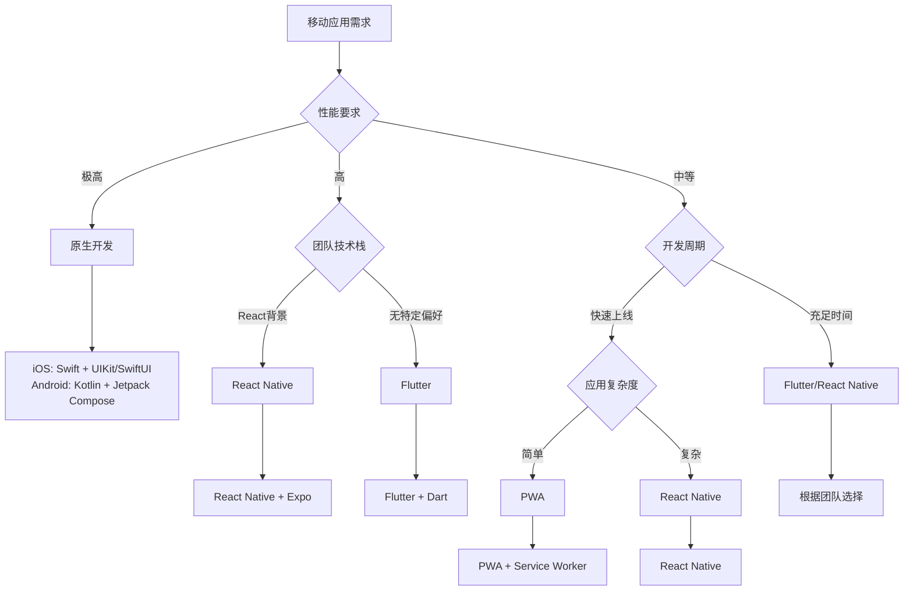

# 移动应用开发介绍

移动应用开发专注于为智能手机和平板电脑等移动设备创建软件应用程序。随着移动设备的普及，移动应用开发已成为现代软件开发的重要组成部分。

## 移动开发方法

在移动应用开发中，主要有三种开发方法：

### 原生应用开发

使用平台特定的编程语言和开发工具创建应用：
- iOS应用使用Swift或Objective-C
- Android应用使用Kotlin或Java

优点是性能优越、用户体验最佳，缺点是需要为不同平台单独开发和维护代码。

### 跨平台开发

使用单一代码库创建可在多个平台上运行的应用：
- React Native (使用JavaScript/React)
- Flutter (使用Dart)
- Xamarin (使用C#)

这种方法平衡了开发效率和性能，是当前流行的移动开发方式。

### 渐进式Web应用(PWA)

结合Web技术和原生应用特性的混合解决方案，使用HTML、CSS和JavaScript创建，通过浏览器访问但具有类似原生应用的体验。

## 移动开发技术对比

### 技术选型矩阵

| 技术方案 | 开发语言 | 性能 | 开发效率 | 学习成本 | 生态系统 | 适用场景 |
|---------|----------|------|----------|----------|----------|----------|
| **原生开发** | Swift/Kotlin | ⭐⭐⭐⭐⭐ | ⭐⭐ | ⭐⭐⭐⭐ | ⭐⭐⭐⭐⭐ | 高性能要求、平台特性丰富 |
| **React Native** | JavaScript | ⭐⭐⭐⭐ | ⭐⭐⭐⭐ | ⭐⭐⭐ | ⭐⭐⭐⭐⭐ | 快速开发、团队熟悉React |
| **Flutter** | Dart | ⭐⭐⭐⭐⭐ | ⭐⭐⭐⭐ | ⭐⭐⭐ | ⭐⭐⭐⭐ | UI一致性、高性能要求 |
| **PWA** | Web技术 | ⭐⭐⭐ | ⭐⭐⭐⭐⭐ | ⭐⭐ | ⭐⭐⭐⭐⭐ | 轻量级应用、快速部署 |

### 选型决策流程



## 移动开发核心概念

### 1. 响应式设计原则

#### 屏幕适配策略
```css
/* 移动优先的响应式设计 */
.container {
  width: 100%;
  padding: 16px;
}

/* 平板适配 */
@media (min-width: 768px) {
  .container {
    max-width: 750px;
    margin: 0 auto;
    padding: 24px;
  }
}

/* 桌面适配 */
@media (min-width: 1024px) {
  .container {
    max-width: 1200px;
    padding: 32px;
  }
}

/* 高分辨率屏幕适配 */
@media (-webkit-min-device-pixel-ratio: 2) {
  .icon {
    background-image: url('icon@2x.png');
    background-size: 24px 24px;
  }
}
```

#### 触摸友好的交互设计
```css
/* 触摸目标最小尺寸 */
.touch-target {
  min-height: 44px; /* iOS推荐 */
  min-width: 44px;
  padding: 12px;
  margin: 8px;
}

/* 触摸反馈 */
.button {
  transition: all 0.2s ease;
  -webkit-tap-highlight-color: transparent;
}

.button:active {
  transform: scale(0.95);
  opacity: 0.8;
}

/* 防止意外缩放 */
input, textarea, select {
  font-size: 16px; /* 防止iOS自动缩放 */
}
```

### 2. 性能优化策略

#### 移动端特有优化
```javascript
// 图片懒加载
class LazyImageLoader {
  constructor() {
    this.imageObserver = new IntersectionObserver(
      this.handleIntersection.bind(this),
      { rootMargin: '50px' }
    );
  }
  
  observe(img) {
    this.imageObserver.observe(img);
  }
  
  handleIntersection(entries) {
    entries.forEach(entry => {
      if (entry.isIntersecting) {
        const img = entry.target;
        img.src = img.dataset.src;
        img.classList.remove('lazy');
        this.imageObserver.unobserve(img);
      }
    });
  }
}

// 触摸事件优化
class TouchOptimizer {
  constructor(element) {
    this.element = element;
    this.startY = 0;
    this.isScrolling = false;
    
    // 使用passive事件监听器
    element.addEventListener('touchstart', this.handleTouchStart.bind(this), { passive: true });
    element.addEventListener('touchmove', this.handleTouchMove.bind(this), { passive: false });
  }
  
  handleTouchStart(e) {
    this.startY = e.touches[0].clientY;
    this.isScrolling = false;
  }
  
  handleTouchMove(e) {
    if (this.isScrolling) return;
    
    const currentY = e.touches[0].clientY;
    const deltaY = Math.abs(currentY - this.startY);
    
    if (deltaY > 10) {
      this.isScrolling = true;
    } else {
      // 防止意外滚动
      e.preventDefault();
    }
  }
}
```

### 3. 离线支持策略

#### Service Worker实现
```javascript
// sw.js - Service Worker
const CACHE_NAME = 'mobile-app-v1';
const urlsToCache = [
  '/',
  '/static/css/main.css',
  '/static/js/main.js',
  '/static/images/logo.png'
];

// 安装事件
self.addEventListener('install', (event) => {
  event.waitUntil(
    caches.open(CACHE_NAME)
      .then((cache) => cache.addAll(urlsToCache))
  );
});

// 拦截网络请求
self.addEventListener('fetch', (event) => {
  event.respondWith(
    caches.match(event.request)
      .then((response) => {
        // 缓存命中，返回缓存资源
        if (response) {
          return response;
        }
        
        // 网络请求
        return fetch(event.request).then((response) => {
          // 检查响应是否有效
          if (!response || response.status !== 200 || response.type !== 'basic') {
            return response;
          }
          
          // 克隆响应并缓存
          const responseToCache = response.clone();
          caches.open(CACHE_NAME)
            .then((cache) => {
              cache.put(event.request, responseToCache);
            });
          
          return response;
        });
      })
  );
});
```

#### 数据同步策略
```javascript
// 离线数据管理
class OfflineDataManager {
  constructor() {
    this.dbName = 'MobileAppDB';
    this.version = 1;
    this.db = null;
    this.init();
  }
  
  async init() {
    return new Promise((resolve, reject) => {
      const request = indexedDB.open(this.dbName, this.version);
      
      request.onerror = () => reject(request.error);
      request.onsuccess = () => {
        this.db = request.result;
        resolve(this.db);
      };
      
      request.onupgradeneeded = (event) => {
        const db = event.target.result;
        
        // 创建对象存储
        const store = db.createObjectStore('data', { keyPath: 'id' });
        store.createIndex('timestamp', 'timestamp', { unique: false });
        store.createIndex('synced', 'synced', { unique: false });
      };
    });
  }
  
  async saveData(data) {
    const transaction = this.db.transaction(['data'], 'readwrite');
    const store = transaction.objectStore('data');
    
    const dataWithMeta = {
      ...data,
      timestamp: Date.now(),
      synced: navigator.onLine
    };
    
    return store.add(dataWithMeta);
  }
  
  async syncPendingData() {
    if (!navigator.onLine) return;
    
    const transaction = this.db.transaction(['data'], 'readonly');
    const store = transaction.objectStore('data');
    const index = store.index('synced');
    
    const request = index.getAll(false);
    request.onsuccess = async () => {
      const pendingData = request.result;
      
      for (const item of pendingData) {
        try {
          await this.uploadData(item);
          await this.markAsSynced(item.id);
        } catch (error) {
          console.error('同步失败:', error);
        }
      }
    };
  }
  
  async uploadData(data) {
    const response = await fetch('/api/data', {
      method: 'POST',
      headers: { 'Content-Type': 'application/json' },
      body: JSON.stringify(data)
    });
    
    if (!response.ok) {
      throw new Error('上传失败');
    }
    
    return response.json();
  }
  
  async markAsSynced(id) {
    const transaction = this.db.transaction(['data'], 'readwrite');
    const store = transaction.objectStore('data');
    
    const request = store.get(id);
    request.onsuccess = () => {
      const data = request.result;
      data.synced = true;
      store.put(data);
    };
  }
}

// 网络状态监听
window.addEventListener('online', () => {
  console.log('网络已连接，开始同步数据');
  offlineManager.syncPendingData();
});

window.addEventListener('offline', () => {
  console.log('网络已断开，启用离线模式');
});
```

## 移动端调试技巧

### 1. 远程调试
```javascript
// 移动端调试工具
class MobileDebugger {
  constructor() {
    this.isDebugMode = localStorage.getItem('debug') === 'true';
    this.logs = [];
    
    if (this.isDebugMode) {
      this.initDebugPanel();
      this.overrideConsole();
    }
  }
  
  initDebugPanel() {
    const panel = document.createElement('div');
    panel.id = 'debug-panel';
    panel.style.cssText = `
      position: fixed;
      top: 0;
      right: 0;
      width: 300px;
      height: 200px;
      background: rgba(0,0,0,0.8);
      color: white;
      font-size: 12px;
      padding: 10px;
      z-index: 9999;
      overflow-y: auto;
      display: none;
    `;
    
    document.body.appendChild(panel);
    
    // 双击显示/隐藏调试面板
    let tapCount = 0;
    document.addEventListener('touchend', () => {
      tapCount++;
      setTimeout(() => {
        if (tapCount === 2) {
          panel.style.display = panel.style.display === 'none' ? 'block' : 'none';
        }
        tapCount = 0;
      }, 300);
    });
  }
  
  overrideConsole() {
    const originalLog = console.log;
    const originalError = console.error;
    
    console.log = (...args) => {
      this.addLog('LOG', args);
      originalLog.apply(console, args);
    };
    
    console.error = (...args) => {
      this.addLog('ERROR', args);
      originalError.apply(console, args);
    };
  }
  
  addLog(type, args) {
    const timestamp = new Date().toLocaleTimeString();
    const message = args.map(arg => 
      typeof arg === 'object' ? JSON.stringify(arg) : String(arg)
    ).join(' ');
    
    this.logs.push({ type, timestamp, message });
    this.updateDebugPanel();
  }
  
  updateDebugPanel() {
    const panel = document.getElementById('debug-panel');
    if (panel) {
      panel.innerHTML = this.logs.slice(-20).map(log => 
        `<div style="color: ${log.type === 'ERROR' ? 'red' : 'white'}">
          [${log.timestamp}] ${log.type}: ${log.message}
        </div>`
      ).join('');
      panel.scrollTop = panel.scrollHeight;
    }
  }
}

// 设备信息收集
class DeviceInfo {
  static collect() {
    return {
      userAgent: navigator.userAgent,
      platform: navigator.platform,
      language: navigator.language,
      cookieEnabled: navigator.cookieEnabled,
      onLine: navigator.onLine,
      screen: {
        width: screen.width,
        height: screen.height,
        pixelRatio: window.devicePixelRatio
      },
      viewport: {
        width: window.innerWidth,
        height: window.innerHeight
      },
      touch: 'ontouchstart' in window,
      orientation: screen.orientation?.type || 'unknown'
    };
  }
  
  static reportError(error, context = {}) {
    const errorReport = {
      message: error.message,
      stack: error.stack,
      timestamp: Date.now(),
      url: window.location.href,
      device: this.collect(),
      context
    };
    
    // 发送错误报告
    fetch('/api/mobile-errors', {
      method: 'POST',
      headers: { 'Content-Type': 'application/json' },
      body: JSON.stringify(errorReport)
    }).catch(console.error);
  }
}
```

### 2. 性能监控
```javascript
// 移动端性能监控
class MobilePerformanceMonitor {
  constructor() {
    this.metrics = {};
    this.init();
  }
  
  init() {
    // 监控页面加载性能
    window.addEventListener('load', () => {
      this.measurePageLoad();
    });
    
    // 监控内存使用
    if ('memory' in performance) {
      setInterval(() => {
        this.measureMemory();
      }, 30000); // 每30秒检查一次
    }
    
    // 监控电池状态
    if ('getBattery' in navigator) {
      navigator.getBattery().then(battery => {
        this.monitorBattery(battery);
      });
    }
  }
  
  measurePageLoad() {
    const navigation = performance.getEntriesByType('navigation')[0];
    
    this.metrics.pageLoad = {
      dns: navigation.domainLookupEnd - navigation.domainLookupStart,
      tcp: navigation.connectEnd - navigation.connectStart,
      request: navigation.responseStart - navigation.requestStart,
      response: navigation.responseEnd - navigation.responseStart,
      dom: navigation.domContentLoadedEventEnd - navigation.responseEnd,
      load: navigation.loadEventEnd - navigation.loadEventStart,
      total: navigation.loadEventEnd - navigation.navigationStart
    };
    
    this.reportMetrics();
  }
  
  measureMemory() {
    if (performance.memory) {
      this.metrics.memory = {
        used: performance.memory.usedJSHeapSize,
        total: performance.memory.totalJSHeapSize,
        limit: performance.memory.jsHeapSizeLimit,
        timestamp: Date.now()
      };
      
      // 内存使用过高警告
      const usagePercent = (this.metrics.memory.used / this.metrics.memory.limit) * 100;
      if (usagePercent > 80) {
        console.warn('内存使用率过高:', usagePercent.toFixed(2) + '%');
      }
    }
  }
  
  monitorBattery(battery) {
    const updateBatteryInfo = () => {
      this.metrics.battery = {
        level: battery.level,
        charging: battery.charging,
        chargingTime: battery.chargingTime,
        dischargingTime: battery.dischargingTime,
        timestamp: Date.now()
      };
      
      // 低电量警告
      if (battery.level < 0.2 && !battery.charging) {
        console.warn('设备电量低，建议优化性能');
      }
    };
    
    updateBatteryInfo();
    battery.addEventListener('levelchange', updateBatteryInfo);
    battery.addEventListener('chargingchange', updateBatteryInfo);
  }
  
  reportMetrics() {
    // 发送性能数据到分析服务
    fetch('/api/mobile-performance', {
      method: 'POST',
      headers: { 'Content-Type': 'application/json' },
      body: JSON.stringify({
        metrics: this.metrics,
        device: DeviceInfo.collect(),
        timestamp: Date.now()
      })
    }).catch(console.error);
  }
}
```

## 本节内容

本节将重点介绍跨平台开发技术和PWA，包括：

- **React Native开发实践**：使用JavaScript构建原生移动应用
- **Flutter框架应用**：使用Dart语言的跨平台UI框架
- **PWA的创建与优化**：渐进式Web应用的最佳实践

通过这些内容，你将能够：
- 理解不同移动开发技术的优劣势
- 选择合适的移动开发技术栈
- 掌握移动端性能优化技巧
- 实现离线支持和数据同步
- 有效地构建和调试跨平台移动应用 