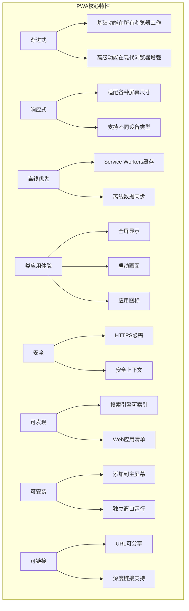
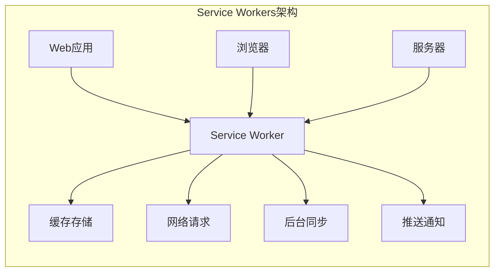

import Tabs from '@theme/Tabs';
import TabItem from '@theme/TabItem';
import CodeBlock from '@theme/CodeBlock';

# 渐进式Web应用(PWA)详解

渐进式Web应用(Progressive Web App)是一种使用现代Web技术构建的应用程序，提供类似原生应用的用户体验。PWA结合了Web和原生应用的最佳特性，可以在任何设备上运行，并提供离线功能、推送通知和安装体验。

:::tip 核心价值
**PWA = Web技术 + 原生体验 + 渐进增强 + 跨平台**
- 🌐 **Web技术基础**：使用HTML、CSS、JavaScript构建
- 📱 **原生应用体验**：全屏显示、启动画面、应用图标
- 🔄 **离线功能**：Service Workers实现离线缓存和同步
- 🔔 **推送通知**：实时消息推送，提升用户参与度
- 📦 **可安装性**：可添加到主屏幕，无需应用商店
- ⚡ **渐进增强**：在支持的浏览器上提供更好的体验
:::

## 1. PWA核心概念

### 1.1 PWA特性概览

PWA具有以下核心特性，使其能够提供接近原生应用的体验：



### 1.2 PWA技术栈

| 技术组件 | 作用 | 必需性 | 浏览器支持 |
|---------|------|--------|------------|
| **Web应用清单** | 定义应用元数据和安装行为 | 必需 | 广泛支持 |
| **Service Workers** | 离线缓存、后台同步、推送通知 | 必需 | 现代浏览器 |
| **HTTPS** | 安全上下文要求 | 必需 | 所有浏览器 |
| **响应式设计** | 适配不同设备 | 推荐 | 所有浏览器 |
| **App Shell架构** | 快速加载的应用外壳 | 推荐 | 所有浏览器 |

## 2. Service Workers详解

### 2.1 Service Workers基础

Service Workers是PWA的核心技术，运行在后台的JavaScript脚本，充当Web应用和网络之间的代理。



<Tabs>
<TabItem value="registration" label="注册与生命周期">

#### Service Worker注册与生命周期

```javascript title="Service Worker注册"
// main.js - 主应用文件
if ('serviceWorker' in navigator) {
  window.addEventListener('load', async () => {
    try {
      const registration = await navigator.serviceWorker.register('/sw.js', {
        scope: '/' // Service Worker的作用域
      });
      
      console.log('Service Worker注册成功:', registration.scope);
      
      // 监听Service Worker状态变化
      registration.addEventListener('updatefound', () => {
        const newWorker = registration.installing;
        console.log('发现新的Service Worker');
        
        newWorker.addEventListener('statechange', () => {
          console.log('Service Worker状态:', newWorker.state);
          
          if (newWorker.state === 'installed') {
            if (navigator.serviceWorker.controller) {
              // 有新版本可用
              showUpdateAvailableNotification();
            } else {
              // 首次安装完成
              showCachedNotification();
            }
          }
        });
      });
      
      // 监听Service Worker控制器变化
      navigator.serviceWorker.addEventListener('controllerchange', () => {
        console.log('Service Worker控制器已更新');
        window.location.reload();
      });
      
    } catch (error) {
      console.error('Service Worker注册失败:', error);
    }
  });
}

// 显示更新可用通知
function showUpdateAvailableNotification() {
  const notification = document.createElement('div');
  notification.className = 'update-notification';
  notification.innerHTML = `
    <div class="notification-content">
      <p>新版本可用！</p>
      <button onclick="updateServiceWorker()">更新</button>
      <button onclick="dismissNotification()">稍后</button>
    </div>
  `;
  document.body.appendChild(notification);
}

// 更新Service Worker
async function updateServiceWorker() {
  const registration = await navigator.serviceWorker.getRegistration();
  if (registration && registration.waiting) {
    // 向等待中的Service Worker发送消息
    registration.waiting.postMessage({ type: 'SKIP_WAITING' });
  }
}

// Service Worker生命周期管理
class ServiceWorkerManager {
  constructor() {
    this.registration = null;
    this.isUpdateAvailable = false;
  }
  
  async init() {
    if (!('serviceWorker' in navigator)) {
      console.warn('Service Worker不被支持');
      return;
    }
    
    try {
      this.registration = await navigator.serviceWorker.register('/sw.js');
      this.setupEventListeners();
      console.log('Service Worker管理器初始化成功');
    } catch (error) {
      console.error('Service Worker注册失败:', error);
    }
  }
  
  setupEventListeners() {
    // 监听更新
    this.registration.addEventListener('updatefound', () => {
      const newWorker = this.registration.installing;
      this.trackInstalling(newWorker);
    });
    
    // 监听消息
    navigator.serviceWorker.addEventListener('message', (event) => {
      this.handleMessage(event.data);
    });
    
    // 监听控制器变化
    navigator.serviceWorker.addEventListener('controllerchange', () => {
      window.location.reload();
    });
  }
  
  trackInstalling(worker) {
    worker.addEventListener('statechange', () => {
      if (worker.state === 'installed') {
        this.isUpdateAvailable = true;
        this.notifyUpdateAvailable();
      }
    });
  }
  
  notifyUpdateAvailable() {
    // 触发自定义事件
    window.dispatchEvent(new CustomEvent('sw-update-available'));
  }
  
  async skipWaiting() {
    if (this.registration && this.registration.waiting) {
      this.registration.waiting.postMessage({ type: 'SKIP_WAITING' });
    }
  }
  
  handleMessage(data) {
    switch (data.type) {
      case 'SW_UPDATED':
        console.log('Service Worker已更新');
        break;
      case 'CACHE_UPDATED':
        console.log('缓存已更新');
        break;
    }
  }
}

// 使用Service Worker管理器
const swManager = new ServiceWorkerManager();
swManager.init();

// 监听更新事件
window.addEventListener('sw-update-available', () => {
  showUpdateAvailableNotification();
});
```

</TabItem>
<TabItem value="caching" label="缓存策略">

#### Service Worker缓存策略

```javascript title="Service Worker缓存实现"
// sw.js - Service Worker文件
const CACHE_NAME = 'pwa-cache-v1';
const STATIC_CACHE = 'static-cache-v1';
const DYNAMIC_CACHE = 'dynamic-cache-v1';

// 需要缓存的静态资源
const STATIC_ASSETS = [
  '/',
  '/index.html',
  '/manifest.json',
  '/css/styles.css',
  '/js/app.js',
  '/images/icon-192.png',
  '/images/icon-512.png',
  '/offline.html'
];

// 安装事件 - 缓存静态资源
self.addEventListener('install', (event) => {
  console.log('Service Worker: 安装中...');
  
  event.waitUntil(
    caches.open(STATIC_CACHE)
      .then((cache) => {
        console.log('Service Worker: 缓存静态资源');
        return cache.addAll(STATIC_ASSETS);
      })
      .then(() => {
        console.log('Service Worker: 安装完成');
        return self.skipWaiting(); // 立即激活新的Service Worker
      })
  );
});

// 激活事件 - 清理旧缓存
self.addEventListener('activate', (event) => {
  console.log('Service Worker: 激活中...');
  
  event.waitUntil(
    caches.keys()
      .then((cacheNames) => {
        return Promise.all(
          cacheNames.map((cacheName) => {
            if (cacheName !== STATIC_CACHE && cacheName !== DYNAMIC_CACHE) {
              console.log('Service Worker: 删除旧缓存', cacheName);
              return caches.delete(cacheName);
            }
          })
        );
      })
      .then(() => {
        console.log('Service Worker: 激活完成');
        return self.clients.claim(); // 立即控制所有客户端
      })
  );
});

// 拦截网络请求
self.addEventListener('fetch', (event) => {
  event.respondWith(
    handleFetch(event.request)
  );
});

// 请求处理策略
async function handleFetch(request) {
  const url = new URL(request.url);
  
  // 静态资源：缓存优先策略
  if (STATIC_ASSETS.includes(url.pathname)) {
    return cacheFirst(request);
  }
  
  // API请求：网络优先策略
  if (url.pathname.startsWith('/api/')) {
    return networkFirst(request);
  }
  
  // 图片资源：缓存优先策略
  if (request.destination === 'image') {
    return cacheFirst(request);
  }
  
  // HTML页面：网络优先策略
  if (request.mode === 'navigate') {
    return networkFirst(request, '/offline.html');
  }
  
  // 其他资源：网络优先策略
  return networkFirst(request);
}

// 缓存优先策略
async function cacheFirst(request) {
  try {
    const cachedResponse = await caches.match(request);
    if (cachedResponse) {
      return cachedResponse;
    }
    
    const networkResponse = await fetch(request);
    
    // 缓存成功的响应
    if (networkResponse.ok) {
      const cache = await caches.open(DYNAMIC_CACHE);
      cache.put(request, networkResponse.clone());
    }
    
    return networkResponse;
  } catch (error) {
    console.error('缓存优先策略失败:', error);
    return new Response('离线状态', { status: 503 });
  }
}

// 网络优先策略
async function networkFirst(request, fallbackUrl = null) {
  try {
    const networkResponse = await fetch(request);
    
    // 缓存成功的响应
    if (networkResponse.ok) {
      const cache = await caches.open(DYNAMIC_CACHE);
      cache.put(request, networkResponse.clone());
    }
    
    return networkResponse;
  } catch (error) {
    console.log('网络请求失败，尝试缓存:', request.url);
    
    const cachedResponse = await caches.match(request);
    if (cachedResponse) {
      return cachedResponse;
    }
    
    // 返回离线页面
    if (fallbackUrl) {
      const fallbackResponse = await caches.match(fallbackUrl);
      if (fallbackResponse) {
        return fallbackResponse;
      }
    }
    
    return new Response('离线状态', { status: 503 });
  }
}

// 仅网络策略（用于关键API）
async function networkOnly(request) {
  return fetch(request);
}

// 仅缓存策略（用于静态资源）
async function cacheOnly(request) {
  return caches.match(request);
}

// 最快响应策略（同时请求网络和缓存）
async function staleWhileRevalidate(request) {
  const cachedResponse = caches.match(request);
  const networkResponse = fetch(request).then((response) => {
    if (response.ok) {
      const cache = caches.open(DYNAMIC_CACHE);
      cache.then((c) => c.put(request, response.clone()));
    }
    return response;
  });
  
  return cachedResponse || networkResponse;
}

// 缓存管理工具
class CacheManager {
  static async clearOldCaches(currentCaches) {
    const cacheNames = await caches.keys();
    const deletePromises = cacheNames
      .filter(name => !currentCaches.includes(name))
      .map(name => caches.delete(name));
    
    return Promise.all(deletePromises);
  }
  
  static async getCacheSize(cacheName) {
    const cache = await caches.open(cacheName);
    const keys = await cache.keys();
    let totalSize = 0;
    
    for (const key of keys) {
      const response = await cache.match(key);
      if (response) {
        const blob = await response.blob();
        totalSize += blob.size;
      }
    }
    
    return totalSize;
  }
  
  static async limitCacheSize(cacheName, maxSize) {
    const cache = await caches.open(cacheName);
    const keys = await cache.keys();
    
    while (await this.getCacheSize(cacheName) > maxSize && keys.length > 0) {
      const oldestKey = keys.shift();
      await cache.delete(oldestKey);
    }
  }
}

// 消息处理
self.addEventListener('message', (event) => {
  const { type, payload } = event.data;
  
  switch (type) {
    case 'SKIP_WAITING':
      self.skipWaiting();
      break;
      
    case 'GET_CACHE_SIZE':
      CacheManager.getCacheSize(payload.cacheName)
        .then(size => {
          event.ports[0].postMessage({ size });
        });
      break;
      
    case 'CLEAR_CACHE':
      caches.delete(payload.cacheName)
        .then(() => {
          event.ports[0].postMessage({ success: true });
        });
      break;
  }
});
```

</TabItem>
<TabItem value="background-sync" label="后台同步">

#### 后台同步实现

```javascript title="后台同步功能"
// sw.js - 后台同步功能
// 后台同步事件
self.addEventListener('sync', (event) => {
  console.log('后台同步事件:', event.tag);
  
  switch (event.tag) {
    case 'background-sync':
      event.waitUntil(doBackgroundSync());
      break;
    case 'send-messages':
      event.waitUntil(sendPendingMessages());
      break;
    case 'upload-data':
      event.waitUntil(uploadPendingData());
      break;
  }
});

// 执行后台同步
async function doBackgroundSync() {
  try {
    console.log('执行后台同步...');
    
    // 同步离线数据
    await syncOfflineData();
    
    // 发送待发送的消息
    await sendPendingMessages();
    
    // 上传待上传的文件
    await uploadPendingFiles();
    
    console.log('后台同步完成');
    
    // 通知客户端同步完成
    const clients = await self.clients.matchAll();
    clients.forEach(client => {
      client.postMessage({
        type: 'SYNC_COMPLETE',
        timestamp: Date.now()
      });
    });
    
  } catch (error) {
    console.error('后台同步失败:', error);
    throw error; // 重新抛出错误，让浏览器重试
  }
}

// 同步离线数据
async function syncOfflineData() {
  const db = await openIndexedDB();
  const pendingData = await getPendingData(db);
  
  for (const data of pendingData) {
    try {
      const response = await fetch('/api/sync', {
        method: 'POST',
        headers: { 'Content-Type': 'application/json' },
        body: JSON.stringify(data)
      });
      
      if (response.ok) {
        await removePendingData(db, data.id);
        console.log('数据同步成功:', data.id);
      }
    } catch (error) {
      console.error('数据同步失败:', data.id, error);
    }
  }
}

// 发送待发送的消息
async function sendPendingMessages() {
  const db = await openIndexedDB();
  const pendingMessages = await getPendingMessages(db);
  
  for (const message of pendingMessages) {
    try {
      const response = await fetch('/api/messages', {
        method: 'POST',
        headers: { 'Content-Type': 'application/json' },
        body: JSON.stringify(message)
      });
      
      if (response.ok) {
        await removePendingMessage(db, message.id);
        console.log('消息发送成功:', message.id);
      }
    } catch (error) {
      console.error('消息发送失败:', message.id, error);
    }
  }
}

// IndexedDB操作
function openIndexedDB() {
  return new Promise((resolve, reject) => {
    const request = indexedDB.open('PWADatabase', 1);
    
    request.onerror = () => reject(request.error);
    request.onsuccess = () => resolve(request.result);
    
    request.onupgradeneeded = (event) => {
      const db = event.target.result;
      
      // 创建存储对象
      if (!db.objectStoreNames.contains('pendingData')) {
        const store = db.createObjectStore('pendingData', { keyPath: 'id' });
        store.createIndex('timestamp', 'timestamp', { unique: false });
      }
      
      if (!db.objectStoreNames.contains('pendingMessages')) {
        const store = db.createObjectStore('pendingMessages', { keyPath: 'id' });
        store.createIndex('timestamp', 'timestamp', { unique: false });
      }
    };
  });
}

// 获取待同步数据
function getPendingData(db) {
  return new Promise((resolve, reject) => {
    const transaction = db.transaction(['pendingData'], 'readonly');
    const store = transaction.objectStore('pendingData');
    const request = store.getAll();
    
    request.onerror = () => reject(request.error);
    request.onsuccess = () => resolve(request.result);
  });
}

// 主应用中的后台同步管理
class BackgroundSyncManager {
  constructor() {
    this.isOnline = navigator.onLine;
    this.setupEventListeners();
  }
  
  setupEventListeners() {
    // 监听网络状态变化
    window.addEventListener('online', () => {
      this.isOnline = true;
      this.triggerSync();
    });
    
    window.addEventListener('offline', () => {
      this.isOnline = false;
    });
    
    // 监听Service Worker消息
    navigator.serviceWorker.addEventListener('message', (event) => {
      if (event.data.type === 'SYNC_COMPLETE') {
        this.handleSyncComplete(event.data);
      }
    });
  }
  
  // 添加数据到同步队列
  async addToSyncQueue(data) {
    const db = await this.openDB();
    const transaction = db.transaction(['pendingData'], 'readwrite');
    const store = transaction.objectStore('pendingData');
    
    const syncData = {
      id: Date.now() + Math.random(),
      ...data,
      timestamp: Date.now()
    };
    
    await store.add(syncData);
    
    // 如果在线，立即尝试同步
    if (this.isOnline) {
      this.triggerSync();
    }
  }
  
  // 触发后台同步
  async triggerSync() {
    if ('serviceWorker' in navigator && 'sync' in window.ServiceWorkerRegistration.prototype) {
      const registration = await navigator.serviceWorker.ready;
      await registration.sync.register('background-sync');
    }
  }
  
  // 处理同步完成
  handleSyncComplete(data) {
    console.log('后台同步完成:', data.timestamp);
    
    // 触发自定义事件
    window.dispatchEvent(new CustomEvent('sync-complete', {
      detail: data
    }));
  }
  
  async openDB() {
    return new Promise((resolve, reject) => {
      const request = indexedDB.open('PWADatabase', 1);
      request.onerror = () => reject(request.error);
      request.onsuccess = () => resolve(request.result);
    });
  }
}

// 使用示例
const syncManager = new BackgroundSyncManager();

// 添加数据到同步队列
document.getElementById('saveButton').addEventListener('click', async () => {
  const formData = {
    name: document.getElementById('name').value,
    email: document.getElementById('email').value,
    message: document.getElementById('message').value
  };
  
  try {
    if (navigator.onLine) {
      // 在线时直接发送
      const response = await fetch('/api/data', {
        method: 'POST',
        headers: { 'Content-Type': 'application/json' },
        body: JSON.stringify(formData)
      });
      
      if (response.ok) {
        showMessage('数据保存成功');
      } else {
        throw new Error('保存失败');
      }
    } else {
      // 离线时添加到同步队列
      await syncManager.addToSyncQueue(formData);
      showMessage('数据已保存到离线队列，将在网络恢复时同步');
    }
  } catch (error) {
    // 保存失败时也添加到同步队列
    await syncManager.addToSyncQueue(formData);
    showMessage('数据已保存到离线队列');
  }
});

// 监听同步完成事件
window.addEventListener('sync-complete', (event) => {
  showMessage('离线数据同步完成');
});
```

</TabItem>
</Tabs>

## 3. Web应用清单(Manifest)

### 3.1 清单文件配置

Web应用清单是一个JSON文件，定义了PWA的元数据和行为。

<Tabs>
<TabItem value="basic-manifest" label="基础清单">

#### 基础清单配置

```json title="manifest.json"
{
  "name": "我的PWA应用",
  "short_name": "PWA应用",
  "description": "一个功能完整的渐进式Web应用示例",
  "start_url": "/",
  "scope": "/",
  "display": "standalone",
  "orientation": "portrait-primary",
  "theme_color": "#2196F3",
  "background_color": "#ffffff",
  "lang": "zh-CN",
  "dir": "ltr",
  
  "icons": [
    {
      "src": "/images/icon-72.png",
      "sizes": "72x72",
      "type": "image/png",
      "purpose": "any"
    },
    {
      "src": "/images/icon-96.png",
      "sizes": "96x96",
      "type": "image/png",
      "purpose": "any"
    },
    {
      "src": "/images/icon-128.png",
      "sizes": "128x128",
      "type": "image/png",
      "purpose": "any"
    },
    {
      "src": "/images/icon-144.png",
      "sizes": "144x144",
      "type": "image/png",
      "purpose": "any"
    },
    {
      "src": "/images/icon-152.png",
      "sizes": "152x152",
      "type": "image/png",
      "purpose": "any"
    },
    {
      "src": "/images/icon-192.png",
      "sizes": "192x192",
      "type": "image/png",
      "purpose": "any maskable"
    },
    {
      "src": "/images/icon-384.png",
      "sizes": "384x384",
      "type": "image/png",
      "purpose": "any"
    },
    {
      "src": "/images/icon-512.png",
      "sizes": "512x512",
      "type": "image/png",
      "purpose": "any maskable"
    }
  ],
  
  "categories": ["productivity", "utilities"],
  "screenshots": [
    {
      "src": "/images/screenshot-mobile.png",
      "sizes": "640x1136",
      "type": "image/png",
      "form_factor": "narrow"
    },
    {
      "src": "/images/screenshot-desktop.png",
      "sizes": "1280x720",
      "type": "image/png",
      "form_factor": "wide"
    }
  ]
}
```

</TabItem>
<TabItem value="advanced-manifest" label="高级配置">

#### 高级清单配置

```json title="高级manifest.json配置"
{
  "name": "高级PWA应用",
  "short_name": "高级PWA",
  "description": "具有高级功能的渐进式Web应用",
  "start_url": "/?utm_source=pwa&utm_medium=homescreen",
  "scope": "/",
  "id": "/",
  "display": "standalone",
  "display_override": ["window-controls-overlay", "minimal-ui"],
  "orientation": "any",
  "theme_color": "#1976D2",
  "background_color": "#fafafa",
  "lang": "zh-CN",
  "dir": "ltr",
  
  "icons": [
    {
      "src": "/images/icon-192.png",
      "sizes": "192x192",
      "type": "image/png",
      "purpose": "any"
    },
    {
      "src": "/images/icon-192-maskable.png",
      "sizes": "192x192",
      "type": "image/png",
      "purpose": "maskable"
    },
    {
      "src": "/images/icon-512.png",
      "sizes": "512x512",
      "type": "image/png",
      "purpose": "any"
    },
    {
      "src": "/images/icon-512-maskable.png",
      "sizes": "512x512",
      "type": "image/png",
      "purpose": "maskable"
    }
  ],
  
  "shortcuts": [
    {
      "name": "新建文档",
      "short_name": "新建",
      "description": "快速创建新文档",
      "url": "/new-document",
      "icons": [
        {
          "src": "/images/shortcut-new.png",
          "sizes": "96x96",
          "type": "image/png"
        }
      ]
    },
    {
      "name": "最近文档",
      "short_name": "最近",
      "description": "查看最近编辑的文档",
      "url": "/recent-documents",
      "icons": [
        {
          "src": "/images/shortcut-recent.png",
          "sizes": "96x96",
          "type": "image/png"
        }
      ]
    }
  ],
  
  "categories": ["productivity", "business", "utilities"],
  "iarc_rating_id": "e84b072d-71b3-4d3e-86ae-31a8ce4e53b7",
  
  "prefer_related_applications": false,
  "related_applications": [
    {
      "platform": "play",
      "url": "https://play.google.com/store/apps/details?id=com.example.app",
      "id": "com.example.app"
    },
    {
      "platform": "itunes",
      "url": "https://apps.apple.com/app/example-app/id123456789"
    }
  ],
  
  "protocol_handlers": [
    {
      "protocol": "mailto",
      "url": "/compose?to=%s"
    },
    {
      "protocol": "web+pwa",
      "url": "/handle-protocol?url=%s"
    }
  ],
  
  "file_handlers": [
    {
      "action": "/open-file",
      "accept": {
        "text/plain": [".txt"],
        "application/json": [".json"],
        "image/*": [".png", ".jpg", ".jpeg", ".gif"]
      }
    }
  ],
  
  "share_target": {
    "action": "/share",
    "method": "POST",
    "enctype": "multipart/form-data",
    "params": {
      "title": "title",
      "text": "text",
      "url": "url",
      "files": [
        {
          "name": "files",
          "accept": ["image/*", "text/plain"]
        }
      ]
    }
  },
  
  "launch_handler": {
    "client_mode": "navigate-existing"
  },
  
  "edge_side_panel": {
    "preferred_width": 400
  }
}
```

</TabItem>
<TabItem value="manifest-validation" label="清单验证">

#### 清单文件验证与优化

```javascript title="清单文件验证工具"
class ManifestValidator {
  constructor(manifest) {
    this.manifest = manifest;
    this.errors = [];
    this.warnings = [];
  }
  
  validate() {
    this.validateRequired();
    this.validateIcons();
    this.validateDisplay();
    this.validateUrls();
    this.validateColors();
    this.validateScreenshots();
    
    return {
      isValid: this.errors.length === 0,
      errors: this.errors,
      warnings: this.warnings
    };
  }
  
  validateRequired() {
    const required = ['name', 'start_url', 'display', 'icons'];
    
    required.forEach(field => {
      if (!this.manifest[field]) {
        this.errors.push(`缺少必需字段: ${field}`);
      }
    });
    
    if (!this.manifest.short_name && this.manifest.name.length > 12) {
      this.warnings.push('建议提供short_name，因为name太长');
    }
  }
  
  validateIcons() {
    if (!this.manifest.icons || this.manifest.icons.length === 0) {
      this.errors.push('至少需要一个图标');
      return;
    }
    
    const requiredSizes = ['192x192', '512x512'];
    const availableSizes = this.manifest.icons.map(icon => icon.sizes);
    
    requiredSizes.forEach(size => {
      if (!availableSizes.includes(size)) {
        this.errors.push(`缺少${size}尺寸的图标`);
      }
    });
    
    // 检查maskable图标
    const hasMaskable = this.manifest.icons.some(icon => 
      icon.purpose && icon.purpose.includes('maskable')
    );
    
    if (!hasMaskable) {
      this.warnings.push('建议提供maskable图标以支持自适应图标');
    }
    
    // 验证图标URL
    this.manifest.icons.forEach((icon, index) => {
      if (!icon.src) {
        this.errors.push(`图标${index}缺少src属性`);
      }
      
      if (!icon.sizes) {
        this.warnings.push(`图标${index}缺少sizes属性`);
      }
      
      if (!icon.type) {
        this.warnings.push(`图标${index}缺少type属性`);
      }
    });
  }
  
  validateDisplay() {
    const validDisplayModes = [
      'fullscreen', 'standalone', 'minimal-ui', 'browser'
    ];
    
    if (!validDisplayModes.includes(this.manifest.display)) {
      this.errors.push(`无效的display值: ${this.manifest.display}`);
    }
  }
  
  validateUrls() {
    const urlFields = ['start_url', 'scope'];
    
    urlFields.forEach(field => {
      if (this.manifest[field]) {
        try {
          new URL(this.manifest[field], window.location.origin);
        } catch (error) {
          this.errors.push(`${field}不是有效的URL: ${this.manifest[field]}`);
        }
      }
    });
    
    // 验证scope包含start_url
    if (this.manifest.scope && this.manifest.start_url) {
      const scope = new URL(this.manifest.scope, window.location.origin);
      const startUrl = new URL(this.manifest.start_url, window.location.origin);
      
      if (!startUrl.pathname.startsWith(scope.pathname)) {
        this.warnings.push('start_url应该在scope范围内');
      }
    }
  }
  
  validateColors() {
    const colorFields = ['theme_color', 'background_color'];
    
    colorFields.forEach(field => {
      if (this.manifest[field]) {
        if (!this.isValidColor(this.manifest[field])) {
          this.errors.push(`${field}不是有效的颜色值: ${this.manifest[field]}`);
        }
      }
    });
  }
  
  validateScreenshots() {
    if (this.manifest.screenshots) {
      this.manifest.screenshots.forEach((screenshot, index) => {
        if (!screenshot.src) {
          this.errors.push(`截图${index}缺少src属性`);
        }
        
        if (!screenshot.sizes) {
          this.warnings.push(`截图${index}缺少sizes属性`);
        }
        
        if (!screenshot.type) {
          this.warnings.push(`截图${index}缺少type属性`);
        }
      });
    }
  }
  
  isValidColor(color) {
    const style = new Option().style;
    style.color = color;
    return style.color !== '';
  }
}

// 清单文件生成器
class ManifestGenerator {
  constructor() {
    this.manifest = {
      name: '',
      short_name: '',
      description: '',
      start_url: '/',
      scope: '/',
      display: 'standalone',
      theme_color: '#000000',
      background_color: '#ffffff',
      icons: []
    };
  }
  
  setBasicInfo(name, shortName, description) {
    this.manifest.name = name;
    this.manifest.short_name = shortName;
    this.manifest.description = description;
    return this;
  }
  
  setUrls(startUrl, scope) {
    this.manifest.start_url = startUrl;
    this.manifest.scope = scope;
    return this;
  }
  
  setDisplay(display, orientation = 'any') {
    this.manifest.display = display;
    this.manifest.orientation = orientation;
    return this;
  }
  
  setColors(themeColor, backgroundColor) {
    this.manifest.theme_color = themeColor;
    this.manifest.background_color = backgroundColor;
    return this;
  }
  
  addIcon(src, sizes, type = 'image/png', purpose = 'any') {
    this.manifest.icons.push({
      src,
      sizes,
      type,
      purpose
    });
    return this;
  }
  
  addShortcut(name, url, description, iconSrc) {
    if (!this.manifest.shortcuts) {
      this.manifest.shortcuts = [];
    }
    
    this.manifest.shortcuts.push({
      name,
      url,
      description,
      icons: iconSrc ? [{
        src: iconSrc,
        sizes: '96x96',
        type: 'image/png'
      }] : []
    });
    return this;
  }
  
  generate() {
    return JSON.stringify(this.manifest, null, 2);
  }
}

// 使用示例
const generator = new ManifestGenerator()
  .setBasicInfo('我的应用', '应用', '这是一个PWA应用')
  .setUrls('/', '/')
  .setDisplay('standalone', 'portrait')
  .setColors('#2196F3', '#ffffff')
  .addIcon('/icon-192.png', '192x192')
  .addIcon('/icon-512.png', '512x512')
  .addShortcut('新建', '/new', '创建新内容', '/shortcut-new.png');

const manifestJson = generator.generate();
console.log(manifestJson);

// 验证生成的清单
const validator = new ManifestValidator(JSON.parse(manifestJson));
const result = validator.validate();
console.log('验证结果:', result);
```

</TabItem>
</Tabs> 