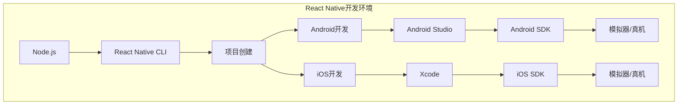
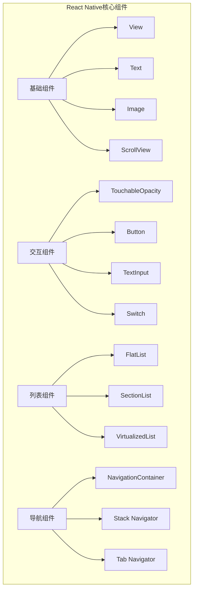

import Tabs from '@theme/Tabs';
import TabItem from '@theme/TabItem';
import CodeBlock from '@theme/CodeBlock';

# React Native跨平台开发详解

React Native是Facebook开发的开源框架，允许开发者使用React和JavaScript构建原生移动应用程序。它结合了原生开发的最佳部分与React的优势，让开发者能够使用一套代码库同时为iOS和Android平台构建应用。

:::tip 核心价值
**React Native = React语法 + 原生性能 + 跨平台开发 + 热重载**
- ⚛️ **React生态**：使用熟悉的React语法和生态系统
- 📱 **原生性能**：编译为真正的原生组件，性能接近原生应用
- 🔄 **代码复用**：一套代码同时运行在iOS和Android平台
- 🔥 **快速开发**：热重载功能，实时查看代码更改效果
- 🌉 **原生桥接**：轻松集成原生模块和第三方库
- 👥 **活跃社区**：庞大的开发者社区和丰富的第三方组件
:::

## 1. 环境搭建与项目初始化

### 1.1 开发环境配置

React Native开发需要配置相应的开发环境，包括Node.js、React Native CLI、Android Studio和Xcode等。



<Tabs>
<TabItem value="setup" label="环境搭建">

#### 开发环境搭建指南

```bash title="环境搭建步骤"
# 1. 安装Node.js (推荐使用LTS版本)
# 从 https://nodejs.org 下载并安装

# 2. 安装React Native CLI
npm install -g @react-native-community/cli

# 3. 创建新项目
npx react-native init MyAwesomeApp

# 或使用TypeScript模板
npx react-native init MyAwesomeApp --template react-native-template-typescript

# 4. 进入项目目录
cd MyAwesomeApp

# 5. 安装依赖
npm install
# 或
yarn install

# 6. iOS依赖安装 (仅macOS)
cd ios && pod install && cd ..

# 7. 启动Metro服务器
npx react-native start

# 8. 运行应用
# Android
npx react-native run-android

# iOS (仅macOS)
npx react-native run-ios
```

#### 项目结构解析

```
MyAwesomeApp/
├── android/                 # Android原生代码
│   ├── app/
│   │   ├── src/main/
│   │   │   ├── java/
│   │   │   └── res/
│   │   └── build.gradle
│   └── build.gradle
├── ios/                     # iOS原生代码
│   ├── MyAwesomeApp/
│   │   ├── AppDelegate.h
│   │   ├── AppDelegate.m
│   │   └── Info.plist
│   └── MyAwesomeApp.xcodeproj/
├── src/                     # 源代码目录
│   ├── components/          # 组件
│   ├── screens/            # 页面
│   ├── navigation/         # 导航配置
│   ├── services/           # 服务层
│   ├── utils/              # 工具函数
│   └── types/              # TypeScript类型定义
├── __tests__/              # 测试文件
├── App.tsx                 # 应用入口
├── index.js               # 注册入口
├── package.json           # 项目配置
├── metro.config.js        # Metro配置
├── babel.config.js        # Babel配置
└── tsconfig.json          # TypeScript配置
```

</TabItem>
<TabItem value="configuration" label="配置优化">

#### 开发配置优化

```javascript title="metro.config.js - Metro配置优化"
const { getDefaultConfig } = require('metro-config');

module.exports = (async () => {
  const {
    resolver: { sourceExts, assetExts },
  } = await getDefaultConfig();
  
  return {
    transformer: {
      babelTransformerPath: require.resolve('react-native-svg-transformer'),
      getTransformOptions: async () => ({
        transform: {
          experimentalImportSupport: false,
          inlineRequires: true,
        },
      }),
    },
    resolver: {
      assetExts: assetExts.filter(ext => ext !== 'svg'),
      sourceExts: [...sourceExts, 'svg'],
      alias: {
        '@': './src',
        '@components': './src/components',
        '@screens': './src/screens',
        '@services': './src/services',
        '@utils': './src/utils',
        '@types': './src/types',
      },
    },
    watchFolders: [],
  };
})();
```

```json title="tsconfig.json - TypeScript配置"
{
  "compilerOptions": {
    "target": "esnext",
    "lib": ["es2017"],
    "allowJs": true,
    "skipLibCheck": true,
    "esModuleInterop": true,
    "allowSyntheticDefaultImports": true,
    "strict": true,
    "forceConsistentCasingInFileNames": true,
    "moduleResolution": "node",
    "resolveJsonModule": true,
    "isolatedModules": true,
    "noEmit": true,
    "jsx": "react-jsx",
    "baseUrl": "./",
    "paths": {
      "@/*": ["src/*"],
      "@components/*": ["src/components/*"],
      "@screens/*": ["src/screens/*"],
      "@services/*": ["src/services/*"],
      "@utils/*": ["src/utils/*"],
      "@types/*": ["src/types/*"]
    }
  },
  "include": [
    "src/**/*",
    "App.tsx",
    "index.js"
  ],
  "exclude": [
    "node_modules",
    "babel.config.js",
    "metro.config.js",
    "jest.config.js"
  ]
}
```

```javascript title="babel.config.js - Babel配置"
module.exports = {
  presets: ['module:metro-react-native-babel-preset'],
  plugins: [
    [
      'module-resolver',
      {
        root: ['./src'],
        extensions: ['.ios.js', '.android.js', '.js', '.ts', '.tsx', '.json'],
        alias: {
          '@': './src',
          '@components': './src/components',
          '@screens': './src/screens',
          '@services': './src/services',
          '@utils': './src/utils',
          '@types': './src/types',
        },
      },
    ],
    'react-native-reanimated/plugin', // 必须放在最后
  ],
};
```

</TabItem>
<TabItem value="debugging" label="调试工具">

#### 调试工具配置

```javascript title="调试工具集成"
// Flipper调试工具配置
// 在App.tsx中添加
import { useEffect } from 'react';

if (__DEV__) {
  import('./ReactotronConfig').then(() => console.log('Reactotron Configured'));
}

// ReactotronConfig.js
import Reactotron from 'reactotron-react-native';
import { reactotronRedux } from 'reactotron-redux';
import AsyncStorage from '@react-native-async-storage/async-storage';

const reactotron = Reactotron
  .setAsyncStorageHandler(AsyncStorage)
  .configure({
    name: 'MyAwesomeApp',
  })
  .useReactNative({
    asyncStorage: false,
    networking: {
      ignoreUrls: /symbolicate/,
    },
    editor: false,
    errors: { veto: (stackFrame) => false },
    overlay: false,
  })
  .use(reactotronRedux())
  .connect();

export default reactotron;

// 性能监控
class PerformanceMonitor {
  static startTiming(label) {
    console.time(label);
  }
  
  static endTiming(label) {
    console.timeEnd(label);
  }
  
  static measureRender(Component) {
    return function MeasuredComponent(props) {
      useEffect(() => {
        const startTime = performance.now();
        return () => {
          const endTime = performance.now();
          console.log(`${Component.name} render time: ${endTime - startTime}ms`);
        };
      });
      
      return <Component {...props} />;
    };
  }
}

// 网络请求监控
const originalFetch = global.fetch;
global.fetch = function(...args) {
  const startTime = Date.now();
  const url = args[0];
  
  console.log(`🌐 Request: ${url}`);
  
  return originalFetch.apply(this, args)
    .then(response => {
      const duration = Date.now() - startTime;
      console.log(`✅ Response: ${url} (${duration}ms)`);
      return response;
    })
    .catch(error => {
      const duration = Date.now() - startTime;
      console.log(`❌ Error: ${url} (${duration}ms)`, error);
      throw error;
    });
};
```

</TabItem>
</Tabs>

## 2. 核心组件与API

### 2.1 基础组件

React Native提供了丰富的内置组件，这些组件会被编译为对应平台的原生组件。



<Tabs>
<TabItem value="basic-components" label="基础组件">

#### 基础组件使用

```tsx title="基础组件示例"
import React, { useState } from 'react';
import {
  View,
  Text,
  Image,
  ScrollView,
  StyleSheet,
  Dimensions,
  SafeAreaView,
} from 'react-native';

const { width, height } = Dimensions.get('window');

const BasicComponentsExample: React.FC = () => {
  return (
    <SafeAreaView style={styles.container}>
      <ScrollView 
        style={styles.scrollView}
        showsVerticalScrollIndicator={false}
        contentContainerStyle={styles.scrollContent}
      >
        {/* View组件 - 容器 */}
        <View style={styles.section}>
          <Text style={styles.sectionTitle}>View组件</Text>
          <View style={styles.colorBox}>
            <Text style={styles.boxText}>这是一个View容器</Text>
          </View>
        </View>

        {/* Text组件 - 文本显示 */}
        <View style={styles.section}>
          <Text style={styles.sectionTitle}>Text组件</Text>
          <Text style={styles.normalText}>普通文本</Text>
          <Text style={styles.boldText}>粗体文本</Text>
          <Text style={styles.colorText}>彩色文本</Text>
          <Text 
            style={styles.longText}
            numberOfLines={2}
            ellipsizeMode="tail"
          >
            这是一段很长的文本，用来演示numberOfLines和ellipsizeMode属性的使用效果
          </Text>
        </View>

        {/* Image组件 - 图片显示 */}
        <View style={styles.section}>
          <Text style={styles.sectionTitle}>Image组件</Text>
          
          {/* 本地图片 */}
          <Image
            source={require('./assets/logo.png')}
            style={styles.localImage}
            resizeMode="contain"
          />
          
          {/* 网络图片 */}
          <Image
            source={{
              uri: 'https://picsum.photos/200/150',
              cache: 'force-cache',
            }}
            style={styles.networkImage}
            resizeMode="cover"
            onLoad={() => console.log('图片加载完成')}
            onError={(error) => console.log('图片加载失败', error)}
          />
          
          {/* 带加载状态的图片 */}
          <ImageWithLoading
            source={{ uri: 'https://picsum.photos/300/200' }}
            style={styles.networkImage}
          />
        </View>

        {/* ScrollView组件 - 滚动容器 */}
        <View style={styles.section}>
          <Text style={styles.sectionTitle}>ScrollView组件</Text>
          
          {/* 水平滚动 */}
          <ScrollView 
            horizontal
            showsHorizontalScrollIndicator={false}
            style={styles.horizontalScroll}
          >
            {[1, 2, 3, 4, 5].map(item => (
              <View key={item} style={styles.horizontalItem}>
                <Text style={styles.itemText}>{item}</Text>
              </View>
            ))}
          </ScrollView>
        </View>
      </ScrollView>
    </SafeAreaView>
  );
};

// 带加载状态的图片组件
const ImageWithLoading: React.FC<{
  source: { uri: string };
  style: any;
}> = ({ source, style }) => {
  const [loading, setLoading] = useState(true);
  const [error, setError] = useState(false);

  return (
    <View style={[style, styles.imageContainer]}>
      {loading && !error && (
        <View style={styles.loadingContainer}>
          <Text>加载中...</Text>
        </View>
      )}
      {error && (
        <View style={styles.errorContainer}>
          <Text>加载失败</Text>
        </View>
      )}
      <Image
        source={source}
        style={style}
        onLoad={() => setLoading(false)}
        onError={() => {
          setLoading(false);
          setError(true);
        }}
      />
    </View>
  );
};

const styles = StyleSheet.create({
  container: {
    flex: 1,
    backgroundColor: '#f5f5f5',
  },
  scrollView: {
    flex: 1,
  },
  scrollContent: {
    padding: 16,
  },
  section: {
    marginBottom: 24,
    backgroundColor: 'white',
    borderRadius: 8,
    padding: 16,
    shadowColor: '#000',
    shadowOffset: {
      width: 0,
      height: 2,
    },
    shadowOpacity: 0.1,
    shadowRadius: 3.84,
    elevation: 5,
  },
  sectionTitle: {
    fontSize: 18,
    fontWeight: 'bold',
    marginBottom: 12,
    color: '#333',
  },
  colorBox: {
    backgroundColor: '#4CAF50',
    padding: 16,
    borderRadius: 8,
    alignItems: 'center',
  },
  boxText: {
    color: 'white',
    fontSize: 16,
    fontWeight: '500',
  },
  normalText: {
    fontSize: 16,
    marginBottom: 8,
    color: '#333',
  },
  boldText: {
    fontSize: 16,
    fontWeight: 'bold',
    marginBottom: 8,
    color: '#333',
  },
  colorText: {
    fontSize: 16,
    color: '#2196F3',
    marginBottom: 8,
  },
  longText: {
    fontSize: 14,
    color: '#666',
    lineHeight: 20,
  },
  localImage: {
    width: 100,
    height: 100,
    marginBottom: 12,
  },
  networkImage: {
    width: width - 64,
    height: 150,
    borderRadius: 8,
    marginBottom: 12,
  },
  imageContainer: {
    position: 'relative',
  },
  loadingContainer: {
    position: 'absolute',
    top: 0,
    left: 0,
    right: 0,
    bottom: 0,
    justifyContent: 'center',
    alignItems: 'center',
    backgroundColor: '#f0f0f0',
    zIndex: 1,
  },
  errorContainer: {
    position: 'absolute',
    top: 0,
    left: 0,
    right: 0,
    bottom: 0,
    justifyContent: 'center',
    alignItems: 'center',
    backgroundColor: '#ffebee',
    zIndex: 1,
  },
  horizontalScroll: {
    height: 80,
  },
  horizontalItem: {
    width: 60,
    height: 60,
    backgroundColor: '#FF9800',
    marginRight: 12,
    borderRadius: 30,
    justifyContent: 'center',
    alignItems: 'center',
  },
  itemText: {
    color: 'white',
    fontSize: 18,
    fontWeight: 'bold',
  },
});

export default BasicComponentsExample;
```

</TabItem>
<TabItem value="interactive-components" label="交互组件">

#### 交互组件使用

```tsx title="交互组件示例"
import React, { useState } from 'react';
import {
  View,
  Text,
  TouchableOpacity,
  TouchableHighlight,
  TouchableWithoutFeedback,
  Pressable,
  Button,
  TextInput,
  Switch,
  Slider,
  Alert,
  StyleSheet,
  SafeAreaView,
  ScrollView,
} from 'react-native';

const InteractiveComponentsExample: React.FC = () => {
  const [text, setText] = useState('');
  const [isEnabled, setIsEnabled] = useState(false);
  const [sliderValue, setSliderValue] = useState(50);
  const [pressCount, setPressCount] = useState(0);

  const showAlert = () => {
    Alert.alert(
      '提示',
      '这是一个警告对话框',
      [
        { text: '取消', style: 'cancel' },
        { text: '确定', onPress: () => console.log('确定被点击') },
      ]
    );
  };

  const showActionSheet = () => {
    Alert.alert(
      '选择操作',
      '请选择要执行的操作',
      [
        { text: '拍照', onPress: () => console.log('拍照') },
        { text: '从相册选择', onPress: () => console.log('相册') },
        { text: '取消', style: 'cancel' },
      ]
    );
  };

  return (
    <SafeAreaView style={styles.container}>
      <ScrollView style={styles.scrollView}>
        {/* TouchableOpacity - 透明度变化 */}
        <View style={styles.section}>
          <Text style={styles.sectionTitle}>TouchableOpacity</Text>
          <TouchableOpacity
            style={styles.button}
            activeOpacity={0.7}
            onPress={() => setPressCount(pressCount + 1)}
          >
            <Text style={styles.buttonText}>
              点击我 (已点击 {pressCount} 次)
            </Text>
          </TouchableOpacity>
        </View>

        {/* TouchableHighlight - 高亮效果 */}
        <View style={styles.section}>
          <Text style={styles.sectionTitle}>TouchableHighlight</Text>
          <TouchableHighlight
            style={styles.button}
            underlayColor="#DDDDDD"
            onPress={showAlert}
          >
            <Text style={styles.buttonText}>显示警告对话框</Text>
          </TouchableHighlight>
        </View>

        {/* Pressable - 现代触摸组件 */}
        <View style={styles.section}>
          <Text style={styles.sectionTitle}>Pressable</Text>
          <Pressable
            style={({ pressed }) => [
              styles.button,
              pressed && styles.buttonPressed
            ]}
            onPress={showActionSheet}
            onLongPress={() => Alert.alert('长按', '长按事件触发')}
          >
            {({ pressed }) => (
              <Text style={styles.buttonText}>
                {pressed ? '按下中...' : '长按或点击我'}
              </Text>
            )}
          </Pressable>
        </View>

        {/* Button - 系统按钮 */}
        <View style={styles.section}>
          <Text style={styles.sectionTitle}>Button</Text>
          <View style={styles.buttonRow}>
            <Button
              title="主要按钮"
              onPress={() => console.log('主要按钮')}
            />
            <Button
              title="次要按钮"
              onPress={() => console.log('次要按钮')}
              color="#FF6B6B"
            />
          </View>
        </View>

        {/* TextInput - 文本输入 */}
        <View style={styles.section}>
          <Text style={styles.sectionTitle}>TextInput</Text>
          
          {/* 基础输入框 */}
          <TextInput
            style={styles.textInput}
            placeholder="请输入文本"
            value={text}
            onChangeText={setText}
            clearButtonMode="while-editing"
          />
          
          {/* 多行输入框 */}
          <TextInput
            style={[styles.textInput, styles.multilineInput]}
            placeholder="多行文本输入"
            multiline
            numberOfLines={4}
            textAlignVertical="top"
          />
          
          {/* 密码输入框 */}
          <TextInput
            style={styles.textInput}
            placeholder="请输入密码"
            secureTextEntry
            autoCapitalize="none"
          />
          
          {/* 数字输入框 */}
          <TextInput
            style={styles.textInput}
            placeholder="请输入数字"
            keyboardType="numeric"
            returnKeyType="done"
          />
          
          <Text style={styles.inputDisplay}>
            当前输入: {text}
          </Text>
        </View>

        {/* Switch - 开关 */}
        <View style={styles.section}>
          <Text style={styles.sectionTitle}>Switch</Text>
          <View style={styles.switchRow}>
            <Text style={styles.switchLabel}>启用通知</Text>
            <Switch
              trackColor={{ false: '#767577', true: '#81b0ff' }}
              thumbColor={isEnabled ? '#f5dd4b' : '#f4f3f4'}
              ios_backgroundColor="#3e3e3e"
              onValueChange={setIsEnabled}
              value={isEnabled}
            />
          </View>
          <Text style={styles.switchStatus}>
            状态: {isEnabled ? '开启' : '关闭'}
          </Text>
        </View>

        {/* Slider - 滑块 */}
        <View style={styles.section}>
          <Text style={styles.sectionTitle}>Slider</Text>
          <Slider
            style={styles.slider}
            minimumValue={0}
            maximumValue={100}
            value={sliderValue}
            onValueChange={setSliderValue}
            minimumTrackTintColor="#1976D2"
            maximumTrackTintColor="#d3d3d3"
            thumbTintColor="#1976D2"
          />
          <Text style={styles.sliderValue}>
            当前值: {Math.round(sliderValue)}
          </Text>
        </View>

        {/* 自定义交互组件 */}
        <View style={styles.section}>
          <Text style={styles.sectionTitle}>自定义交互组件</Text>
          <CustomButton
            title="自定义按钮"
            onPress={() => Alert.alert('自定义', '自定义按钮被点击')}
            variant="primary"
          />
          <CustomButton
            title="次要按钮"
            onPress={() => Alert.alert('自定义', '次要按钮被点击')}
            variant="secondary"
          />
        </View>
      </ScrollView>
    </SafeAreaView>
  );
};

// 自定义按钮组件
interface CustomButtonProps {
  title: string;
  onPress: () => void;
  variant?: 'primary' | 'secondary';
  disabled?: boolean;
}

const CustomButton: React.FC<CustomButtonProps> = ({
  title,
  onPress,
  variant = 'primary',
  disabled = false,
}) => {
  return (
    <Pressable
      style={({ pressed }) => [
        styles.customButton,
        variant === 'primary' ? styles.primaryButton : styles.secondaryButton,
        pressed && styles.customButtonPressed,
        disabled && styles.customButtonDisabled,
      ]}
      onPress={onPress}
      disabled={disabled}
    >
      <Text
        style={[
          styles.customButtonText,
          variant === 'secondary' && styles.secondaryButtonText,
          disabled && styles.customButtonTextDisabled,
        ]}
      >
        {title}
      </Text>
    </Pressable>
  );
};

const styles = StyleSheet.create({
  container: {
    flex: 1,
    backgroundColor: '#f5f5f5',
  },
  scrollView: {
    flex: 1,
    padding: 16,
  },
  section: {
    backgroundColor: 'white',
    borderRadius: 8,
    padding: 16,
    marginBottom: 16,
    shadowColor: '#000',
    shadowOffset: {
      width: 0,
      height: 2,
    },
    shadowOpacity: 0.1,
    shadowRadius: 3.84,
    elevation: 5,
  },
  sectionTitle: {
    fontSize: 18,
    fontWeight: 'bold',
    marginBottom: 12,
    color: '#333',
  },
  button: {
    backgroundColor: '#2196F3',
    padding: 12,
    borderRadius: 8,
    alignItems: 'center',
    marginBottom: 8,
  },
  buttonPressed: {
    backgroundColor: '#1976D2',
  },
  buttonText: {
    color: 'white',
    fontSize: 16,
    fontWeight: '500',
  },
  buttonRow: {
    flexDirection: 'row',
    justifyContent: 'space-around',
  },
  textInput: {
    borderWidth: 1,
    borderColor: '#ddd',
    borderRadius: 8,
    padding: 12,
    fontSize: 16,
    marginBottom: 12,
    backgroundColor: '#fafafa',
  },
  multilineInput: {
    height: 100,
  },
  inputDisplay: {
    fontSize: 14,
    color: '#666',
    fontStyle: 'italic',
  },
  switchRow: {
    flexDirection: 'row',
    justifyContent: 'space-between',
    alignItems: 'center',
    marginBottom: 8,
  },
  switchLabel: {
    fontSize: 16,
    color: '#333',
  },
  switchStatus: {
    fontSize: 14,
    color: '#666',
  },
  slider: {
    width: '100%',
    height: 40,
    marginBottom: 8,
  },
  sliderValue: {
    textAlign: 'center',
    fontSize: 16,
    color: '#333',
  },
  customButton: {
    padding: 12,
    borderRadius: 8,
    alignItems: 'center',
    marginBottom: 8,
  },
  primaryButton: {
    backgroundColor: '#4CAF50',
  },
  secondaryButton: {
    backgroundColor: 'transparent',
    borderWidth: 1,
    borderColor: '#4CAF50',
  },
  customButtonPressed: {
    opacity: 0.8,
  },
  customButtonDisabled: {
    backgroundColor: '#ccc',
    borderColor: '#ccc',
  },
  customButtonText: {
    color: 'white',
    fontSize: 16,
    fontWeight: '500',
  },
  secondaryButtonText: {
    color: '#4CAF50',
  },
  customButtonTextDisabled: {
    color: '#999',
  },
});

export default InteractiveComponentsExample;
```

</TabItem>
<TabItem value="list-components" label="列表组件">

#### 列表组件使用

```tsx title="列表组件示例"
import React, { useState, useCallback, useMemo } from 'react';
import {
  View,
  Text,
  FlatList,
  SectionList,
  TouchableOpacity,
  Image,
  RefreshControl,
  ActivityIndicator,
  StyleSheet,
  SafeAreaView,
  Alert,
} from 'react-native';

// 数据类型定义
interface User {
  id: string;
  name: string;
  email: string;
  avatar: string;
  age: number;
}

interface Section {
  title: string;
  data: User[];
}

const ListComponentsExample: React.FC = () => {
  const [users, setUsers] = useState<User[]>(generateUsers(50));
  const [refreshing, setRefreshing] = useState(false);
  const [loading, setLoading] = useState(false);

  // 生成模拟数据
  function generateUsers(count: number): User[] {
    return Array.from({ length: count }, (_, index) => ({
      id: `user-${index}`,
      name: `用户 ${index + 1}`,
      email: `user${index + 1}@example.com`,
      avatar: `https://picsum.photos/60/60?random=${index}`,
      age: 20 + Math.floor(Math.random() * 40),
    }));
  }

  // 下拉刷新
  const onRefresh = useCallback(() => {
    setRefreshing(true);
    setTimeout(() => {
      setUsers(generateUsers(50));
      setRefreshing(false);
    }, 2000);
  }, []);

  // 加载更多
  const loadMore = useCallback(() => {
    if (loading) return;
    
    setLoading(true);
    setTimeout(() => {
      const newUsers = generateUsers(20);
      const startId = users.length;
      const updatedUsers = newUsers.map((user, index) => ({
        ...user,
        id: `user-${startId + index}`,
        name: `用户 ${startId + index + 1}`,
      }));
      setUsers(prevUsers => [...prevUsers, ...updatedUsers]);
      setLoading(false);
    }, 1500);
  }, [users.length, loading]);

  // 按年龄分组的数据
  const sectionData = useMemo(() => {
    const grouped = users.reduce((acc, user) => {
      const ageGroup = Math.floor(user.age / 10) * 10;
      const key = `${ageGroup}-${ageGroup + 9}岁`;
      
      if (!acc[key]) {
        acc[key] = [];
      }
      acc[key].push(user);
      return acc;
    }, {} as Record<string, User[]>);

    return Object.entries(grouped).map(([title, data]) => ({
      title,
      data: data.sort((a, b) => a.age - b.age),
    }));
  }, [users]);

  // 渲染用户项
  const renderUserItem = useCallback(({ item, index }: { item: User; index: number }) => (
    <UserItem
      user={item}
      index={index}
      onPress={() => Alert.alert('用户信息', `姓名: ${item.name}\n邮箱: ${item.email}`)}
    />
  ), []);

  // 渲染分组标题
  const renderSectionHeader = useCallback(({ section }: { section: Section }) => (
    <View style={styles.sectionHeader}>
      <Text style={styles.sectionHeaderText}>{section.title}</Text>
      <Text style={styles.sectionCount}>({section.data.length}人)</Text>
    </View>
  ), []);

  // 渲染加载更多
  const renderFooter = useCallback(() => {
    if (!loading) return null;
    
    return (
      <View style={styles.loadingFooter}>
        <ActivityIndicator size="small" color="#2196F3" />
        <Text style={styles.loadingText}>加载中...</Text>
      </View>
    );
  }, [loading]);

  // 渲染空状态
  const renderEmpty = useCallback(() => (
    <View style={styles.emptyContainer}>
      <Text style={styles.emptyText}>暂无数据</Text>
      <TouchableOpacity style={styles.retryButton} onPress={onRefresh}>
        <Text style={styles.retryButtonText}>重试</Text>
      </TouchableOpacity>
    </View>
  ), [onRefresh]);

  return (
    <SafeAreaView style={styles.container}>
      <View style={styles.tabContainer}>
        <TouchableOpacity style={styles.tab}>
          <Text style={styles.tabText}>FlatList</Text>
        </TouchableOpacity>
        <TouchableOpacity style={styles.tab}>
          <Text style={styles.tabText}>SectionList</Text>
        </TouchableOpacity>
      </View>

      {/* FlatList示例 */}
      <View style={styles.listContainer}>
        <Text style={styles.listTitle}>FlatList - 用户列表</Text>
        <FlatList
          data={users}
          renderItem={renderUserItem}
          keyExtractor={(item) => item.id}
          refreshControl={
            <RefreshControl
              refreshing={refreshing}
              onRefresh={onRefresh}
              colors={['#2196F3']}
              tintColor="#2196F3"
            />
          }
          onEndReached={loadMore}
          onEndReachedThreshold={0.1}
          ListFooterComponent={renderFooter}
          ListEmptyComponent={renderEmpty}
          ItemSeparatorComponent={() => <View style={styles.separator} />}
          showsVerticalScrollIndicator={false}
          removeClippedSubviews={true}
          maxToRenderPerBatch={10}
          windowSize={10}
          initialNumToRender={15}
          getItemLayout={(data, index) => ({
            length: 80,
            offset: 80 * index,
            index,
          })}
        />
      </View>

      {/* SectionList示例 */}
      <View style={styles.listContainer}>
        <Text style={styles.listTitle}>SectionList - 按年龄分组</Text>
        <SectionList
          sections={sectionData}
          renderItem={renderUserItem}
          renderSectionHeader={renderSectionHeader}
          keyExtractor={(item) => item.id}
          refreshControl={
            <RefreshControl
              refreshing={refreshing}
              onRefresh={onRefresh}
              colors={['#2196F3']}
              tintColor="#2196F3"
            />
          }
          ItemSeparatorComponent={() => <View style={styles.separator} />}
          SectionSeparatorComponent={() => <View style={styles.sectionSeparator} />}
          showsVerticalScrollIndicator={false}
          stickySectionHeadersEnabled={true}
        />
      </View>
    </SafeAreaView>
  );
};

// 用户项组件
const UserItem: React.FC<{
  user: User;
  index: number;
  onPress: () => void;
}> = React.memo(({ user, index, onPress }) => {
  return (
    <TouchableOpacity style={styles.userItem} onPress={onPress}>
      <Image source={{ uri: user.avatar }} style={styles.avatar} />
      <View style={styles.userInfo}>
        <Text style={styles.userName}>{user.name}</Text>
        <Text style={styles.userEmail}>{user.email}</Text>
        <Text style={styles.userAge}>年龄: {user.age}岁</Text>
      </View>
      <View style={styles.indexBadge}>
        <Text style={styles.indexText}>{index + 1}</Text>
      </View>
    </TouchableOpacity>
  );
});

const styles = StyleSheet.create({
  container: {
    flex: 1,
    backgroundColor: '#f5f5f5',
  },
  tabContainer: {
    flexDirection: 'row',
    backgroundColor: 'white',
    paddingHorizontal: 16,
  },
  tab: {
    flex: 1,
    paddingVertical: 12,
    alignItems: 'center',
    borderBottomWidth: 2,
    borderBottomColor: '#2196F3',
  },
  tabText: {
    fontSize: 16,
    fontWeight: '500',
    color: '#2196F3',
  },
  listContainer: {
    flex: 1,
    backgroundColor: 'white',
    margin: 16,
    borderRadius: 8,
    overflow: 'hidden',
  },
  listTitle: {
    fontSize: 18,
    fontWeight: 'bold',
    padding: 16,
    backgroundColor: '#f8f9fa',
    borderBottomWidth: 1,
    borderBottomColor: '#e9ecef',
  },
  userItem: {
    flexDirection: 'row',
    alignItems: 'center',
    padding: 16,
    backgroundColor: 'white',
  },
  avatar: {
    width: 50,
    height: 50,
    borderRadius: 25,
    marginRight: 12,
  },
  userInfo: {
    flex: 1,
  },
  userName: {
    fontSize: 16,
    fontWeight: '500',
    color: '#333',
    marginBottom: 4,
  },
  userEmail: {
    fontSize: 14,
    color: '#666',
    marginBottom: 2,
  },
  userAge: {
    fontSize: 12,
    color: '#999',
  },
  indexBadge: {
    backgroundColor: '#2196F3',
    borderRadius: 12,
    width: 24,
    height: 24,
    justifyContent: 'center',
    alignItems: 'center',
  },
  indexText: {
    color: 'white',
    fontSize: 12,
    fontWeight: 'bold',
  },
  separator: {
    height: 1,
    backgroundColor: '#f0f0f0',
    marginLeft: 78,
  },
  sectionHeader: {
    flexDirection: 'row',
    alignItems: 'center',
    backgroundColor: '#e3f2fd',
    paddingHorizontal: 16,
    paddingVertical: 8,
  },
  sectionHeaderText: {
    fontSize: 16,
    fontWeight: 'bold',
    color: '#1976d2',
  },
  sectionCount: {
    fontSize: 14,
    color: '#666',
    marginLeft: 8,
  },
  sectionSeparator: {
    height: 8,
    backgroundColor: '#f5f5f5',
  },
  loadingFooter: {
    flexDirection: 'row',
    justifyContent: 'center',
    alignItems: 'center',
    paddingVertical: 16,
  },
  loadingText: {
    marginLeft: 8,
    fontSize: 14,
    color: '#666',
  },
  emptyContainer: {
    flex: 1,
    justifyContent: 'center',
    alignItems: 'center',
    paddingVertical: 50,
  },
  emptyText: {
    fontSize: 16,
    color: '#999',
    marginBottom: 16,
  },
  retryButton: {
    backgroundColor: '#2196F3',
    paddingHorizontal: 24,
    paddingVertical: 12,
    borderRadius: 6,
  },
  retryButtonText: {
    color: 'white',
    fontSize: 14,
    fontWeight: '500',
  },
});

export default ListComponentsExample;
```

</TabItem>
</Tabs> 