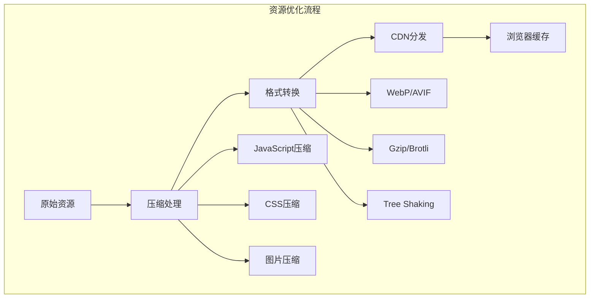

import Tabs from '@theme/Tabs';
import TabItem from '@theme/TabItem';
import CodeBlock from '@theme/CodeBlock';

# 前端加载优化策略详解

加载优化是前端性能优化的核心环节，直接影响用户的首次体验和页面可交互时间。通过系统化的加载优化策略，可以显著提升页面性能，改善用户体验，提高业务转化率。

:::tip 核心价值
**加载优化 = 资源压缩 + 代码分割 + 缓存策略 + 预加载技术**
- 📦 **资源压缩**：减少文件体积，降低传输时间
- ✂️ **代码分割**：按需加载，减少初始包大小
- 🗄️ **缓存策略**：合理利用浏览器和CDN缓存
- ⚡ **预加载技术**：提前加载关键资源
- 🔄 **懒加载**：延迟加载非关键资源
- 📊 **性能监控**：持续监控和优化加载性能
:::

## 1. 资源优化策略

### 1.1 资源压缩与合并

资源压缩是减少文件体积的基础手段，包括JavaScript、CSS、图片等各类资源的优化。



#### 资源压缩对比表

| 资源类型 | 压缩技术 | 压缩率 | 工具推荐 | 适用场景 |
|---------|----------|--------|----------|----------|
| **JavaScript** | Terser/UglifyJS | 60-80% | Webpack, Rollup | 生产环境必备 |
| **CSS** | cssnano/clean-css | 40-60% | PostCSS, Webpack | 样式文件优化 |
| **HTML** | html-minifier | 20-40% | Webpack插件 | 模板文件压缩 |
| **图片** | WebP/AVIF | 25-50% | imagemin, squoosh | 现代浏览器 |
| **字体** | WOFF2 | 30-50% | fonttools | Web字体优化 |

<Tabs>
<TabItem value="js-compression" label="JavaScript压缩">

#### JavaScript压缩优化

```javascript title="Webpack JavaScript压缩配置"
const TerserPlugin = require('terser-webpack-plugin');
const CompressionPlugin = require('compression-webpack-plugin');

module.exports = {
  mode: 'production',
  optimization: {
    minimize: true,
    minimizer: [
      new TerserPlugin({
        terserOptions: {
          compress: {
            // 移除console语句
            drop_console: true,
            drop_debugger: true,
            // 移除未使用的代码
            pure_funcs: ['console.log', 'console.info'],
            // 压缩条件语句
            conditionals: true,
            // 移除死代码
            dead_code: true,
            // 优化if语句
            if_return: true,
            // 合并变量声明
            join_vars: true,
            // 压缩循环
            loops: true
          },
          mangle: {
            // 混淆变量名
            toplevel: true,
            // 保留类名
            keep_classnames: true,
            // 保留函数名
            keep_fnames: false
          },
          format: {
            // 移除注释
            comments: false
          }
        },
        // 并行压缩
        parallel: true,
        // 提取注释到单独文件
        extractComments: false
      })
    ],
    // 代码分割
    splitChunks: {
      chunks: 'all',
      cacheGroups: {
        vendor: {
          test: /[\\/]node_modules[\\/]/,
          name: 'vendors',
          chunks: 'all',
          priority: 10
        },
        common: {
          name: 'common',
          minChunks: 2,
          chunks: 'all',
          priority: 5,
          reuseExistingChunk: true
        }
      }
    }
  },
  plugins: [
    // Gzip压缩
    new CompressionPlugin({
      algorithm: 'gzip',
      test: /\.(js|css|html|svg)$/,
      threshold: 8192,
      minRatio: 0.8
    }),
    // Brotli压缩
    new CompressionPlugin({
      filename: '[path][base].br',
      algorithm: 'brotliCompress',
      test: /\.(js|css|html|svg)$/,
      compressionOptions: {
        params: {
          [require('zlib').constants.BROTLI_PARAM_QUALITY]: 11,
        },
      },
      threshold: 8192,
      minRatio: 0.8
    })
  ]
};

// 自定义压缩函数
class CustomMinifier {
  static minifyJS(code, options = {}) {
    const defaultOptions = {
      removeComments: true,
      removeConsole: true,
      minifyVariables: true,
      ...options
    };
    
    let minified = code;
    
    if (defaultOptions.removeComments) {
      // 移除单行注释
      minified = minified.replace(/\/\/.*$/gm, '');
      // 移除多行注释
      minified = minified.replace(/\/\*[\s\S]*?\*\//g, '');
    }
    
    if (defaultOptions.removeConsole) {
      // 移除console语句
      minified = minified.replace(/console\.(log|info|warn|error|debug)\([^)]*\);?/g, '');
    }
    
    if (defaultOptions.minifyVariables) {
      // 简单的变量名压缩（生产环境建议使用专业工具）
      const varMap = new Map();
      let varCounter = 0;
      
      minified = minified.replace(/\b(var|let|const)\s+([a-zA-Z_$][a-zA-Z0-9_$]*)/g, (match, keyword, varName) => {
        if (!varMap.has(varName)) {
          varMap.set(varName, `v${varCounter++}`);
        }
        return `${keyword} ${varMap.get(varName)}`;
      });
    }
    
    // 移除多余空白
    minified = minified.replace(/\s+/g, ' ').trim();
    
    return minified;
  }
}

// 使用示例
const originalCode = `
// 这是一个示例函数
function calculateTotal(items) {
  console.log('Calculating total for items:', items);
  let total = 0;
  for (let i = 0; i < items.length; i++) {
    total += items[i].price;
  }
  return total;
}
`;

const minifiedCode = CustomMinifier.minifyJS(originalCode);
console.log('压缩后代码:', minifiedCode);
```

</TabItem>
<TabItem value="css-compression" label="CSS压缩">

#### CSS压缩优化

```javascript title="CSS压缩配置与实现"
// PostCSS配置
module.exports = {
  plugins: [
    require('autoprefixer'),
    require('cssnano')({
      preset: ['default', {
        // 移除注释
        discardComments: {
          removeAll: true
        },
        // 移除未使用的规则
        discardUnused: true,
        // 合并相同规则
        mergeRules: true,
        // 压缩颜色值
        colormin: true,
        // 压缩字体
        minifyFontValues: true,
        // 压缩选择器
        minifySelectors: true,
        // 标准化空白
        normalizeWhitespace: true,
        // 移除重复规则
        uniqueSelectors: true
      }]
    })
  ]
};

// Webpack CSS压缩配置
const MiniCssExtractPlugin = require('mini-css-extract-plugin');
const CssMinimizerPlugin = require('css-minimizer-webpack-plugin');

module.exports = {
  module: {
    rules: [
      {
        test: /\.css$/,
        use: [
          MiniCssExtractPlugin.loader,
          'css-loader',
          {
            loader: 'postcss-loader',
            options: {
              postcssOptions: {
                plugins: [
                  ['autoprefixer'],
                  ['cssnano', { preset: 'default' }]
                ]
              }
            }
          }
        ]
      }
    ]
  },
  plugins: [
    new MiniCssExtractPlugin({
      filename: '[name].[contenthash].css',
      chunkFilename: '[id].[contenthash].css'
    })
  ],
  optimization: {
    minimizer: [
      new CssMinimizerPlugin({
        minimizerOptions: {
          preset: [
            'default',
            {
              discardComments: { removeAll: true },
              normalizeUnicode: false
            }
          ]
        }
      })
    ]
  }
};

// 自定义CSS压缩工具
class CSSMinifier {
  static minifyCSS(css) {
    return css
      // 移除注释
      .replace(/\/\*[\s\S]*?\*\//g, '')
      // 移除多余空白
      .replace(/\s+/g, ' ')
      // 移除分号前的空格
      .replace(/\s*;\s*/g, ';')
      // 移除花括号前后的空格
      .replace(/\s*{\s*/g, '{')
      .replace(/\s*}\s*/g, '}')
      // 移除冒号后的空格
      .replace(/:\s+/g, ':')
      // 移除逗号后的空格
      .replace(/,\s+/g, ',')
      // 压缩颜色值
      .replace(/#([0-9a-f])\1([0-9a-f])\2([0-9a-f])\3/gi, '#$1$2$3')
      // 移除0值的单位
      .replace(/\b0(px|em|rem|%|vh|vw|pt|pc|in|cm|mm|ex|ch|vmin|vmax)\b/g, '0')
      // 压缩margin/padding简写
      .replace(/margin:\s*0\s+0\s+0\s+0/g, 'margin:0')
      .replace(/padding:\s*0\s+0\s+0\s+0/g, 'padding:0')
      .trim();
  }
  
  static optimizeSelectors(css) {
    // 合并相同的选择器
    const rules = new Map();
    
    css.replace(/([^{}]+)\{([^{}]*)\}/g, (match, selector, declarations) => {
      const cleanSelector = selector.trim();
      const cleanDeclarations = declarations.trim();
      
      if (rules.has(cleanDeclarations)) {
        rules.set(cleanDeclarations, rules.get(cleanDeclarations) + ',' + cleanSelector);
      } else {
        rules.set(cleanDeclarations, cleanSelector);
      }
    });
    
    let optimizedCSS = '';
    rules.forEach((selectors, declarations) => {
      optimizedCSS += `${selectors}{${declarations}}`;
    });
    
    return optimizedCSS;
  }
}

// 关键CSS提取
class CriticalCSSExtractor {
  static extractCritical(html, css) {
    const usedSelectors = new Set();
    const dom = new DOMParser().parseFromString(html, 'text/html');
    
    // 解析CSS规则
    const styleSheet = new CSSStyleSheet();
    styleSheet.replaceSync(css);
    
    for (const rule of styleSheet.cssRules) {
      if (rule.type === CSSRule.STYLE_RULE) {
        try {
          if (dom.querySelector(rule.selectorText)) {
            usedSelectors.add(rule.cssText);
          }
        } catch (e) {
          // 忽略无效选择器
        }
      }
    }
    
    return Array.from(usedSelectors).join('\n');
  }
}
```

</TabItem>
<TabItem value="image-optimization" label="图片优化">

#### 图片优化策略

```javascript title="图片优化完整方案"
// 图片压缩配置
const ImageMinimizerPlugin = require('image-minimizer-webpack-plugin');

module.exports = {
  module: {
    rules: [
      {
        test: /\.(jpe?g|png|gif|svg)$/i,
        type: 'asset',
        parser: {
          dataUrlCondition: {
            maxSize: 8 * 1024 // 8KB以下转为base64
          }
        },
        generator: {
          filename: 'images/[name].[hash:8][ext]'
        }
      }
    ]
  },
  plugins: [
    new ImageMinimizerPlugin({
      minimizer: {
        implementation: ImageMinimizerPlugin.imageminMinify,
        options: {
          plugins: [
            ['imagemin-mozjpeg', { quality: 80 }],
            ['imagemin-pngquant', { quality: [0.6, 0.8] }],
            ['imagemin-svgo', {
              plugins: [
                { name: 'removeViewBox', active: false },
                { name: 'removeDimensions', active: true }
              ]
            }]
          ]
        }
      },
      generator: [
        {
          type: 'asset',
          preset: 'webp-custom-name',
          implementation: ImageMinimizerPlugin.imageminGenerate,
          options: {
            plugins: ['imagemin-webp']
          }
        }
      ]
    })
  ]
};

// 响应式图片组件
class ResponsiveImage {
  constructor(options) {
    this.src = options.src;
    this.alt = options.alt;
    this.sizes = options.sizes || '100vw';
    this.loading = options.loading || 'lazy';
    this.formats = options.formats || ['webp', 'jpg'];
  }
  
  generateSrcSet(basePath, sizes) {
    return sizes.map(size => `${basePath}-${size}w.jpg ${size}w`).join(', ');
  }
  
  generatePicture() {
    const basePath = this.src.replace(/\.[^/.]+$/, '');
    const sizes = [400, 800, 1200, 1600];
    
    let pictureHTML = '<picture>';
    
    // 添加现代格式
    this.formats.forEach(format => {
      if (format !== 'jpg' && format !== 'jpeg') {
        const srcSet = sizes.map(size => 
          `${basePath}-${size}w.${format} ${size}w`
        ).join(', ');
        
        pictureHTML += `<source srcset="${srcSet}" sizes="${this.sizes}" type="image/${format}">`;
      }
    });
    
    // 添加fallback
    const fallbackSrcSet = this.generateSrcSet(basePath, sizes);
    pictureHTML += ``;
    pictureHTML += '</picture>';
    
    return pictureHTML;
  }
}

// 图片懒加载实现
class LazyImageLoader {
  constructor(options = {}) {
    this.rootMargin = options.rootMargin || '50px';
    this.threshold = options.threshold || 0.1;
    this.loadingClass = options.loadingClass || 'lazy-loading';
    this.loadedClass = options.loadedClass || 'lazy-loaded';
    this.errorClass = options.errorClass || 'lazy-error';
    
    this.observer = new IntersectionObserver(
      this.handleIntersection.bind(this),
      {
        rootMargin: this.rootMargin,
        threshold: this.threshold
      }
    );
  }
  
  observe(img) {
    this.observer.observe(img);
  }
  
  handleIntersection(entries) {
    entries.forEach(entry => {
      if (entry.isIntersecting) {
        this.loadImage(entry.target);
        this.observer.unobserve(entry.target);
      }
    });
  }
  
  loadImage(img) {
    img.classList.add(this.loadingClass);
    
    const imageLoader = new Image();
    
    imageLoader.onload = () => {
      img.src = img.dataset.src;
      img.classList.remove(this.loadingClass);
      img.classList.add(this.loadedClass);
      
      // 如果是picture元素，处理srcset
      if (img.dataset.srcset) {
        img.srcset = img.dataset.srcset;
      }
    };
    
    imageLoader.onerror = () => {
      img.classList.remove(this.loadingClass);
      img.classList.add(this.errorClass);
    };
    
    imageLoader.src = img.dataset.src;
  }
  
  // 批量初始化
  static init(selector = 'img[data-src]', options = {}) {
    const loader = new LazyImageLoader(options);
    const images = document.querySelectorAll(selector);
    
    images.forEach(img => loader.observe(img));
    
    return loader;
  }
}

// 图片格式检测和选择
class ImageFormatDetector {
  static supportsWebP() {
    return new Promise(resolve => {
      const webP = new Image();
      webP.onload = webP.onerror = () => {
        resolve(webP.height === 2);
      };
      webP.src = 'data:image/webp;base64,UklGRjoAAABXRUJQVlA4IC4AAACyAgCdASoCAAIALmk0mk0iIiIiIgBoSygABc6WWgAA/veff/0PP8bA//LwYAAA';
    });
  }
  
  static supportsAVIF() {
    return new Promise(resolve => {
      const avif = new Image();
      avif.onload = avif.onerror = () => {
        resolve(avif.height === 2);
      };
      avif.src = 'data:image/avif;base64,AAAAIGZ0eXBhdmlmAAAAAGF2aWZtaWYxbWlhZk1BMUIAAADybWV0YQAAAAAAAAAoaGRscgAAAAAAAAAAcGljdAAAAAAAAAAAAAAAAGxpYmF2aWYAAAAADnBpdG0AAAAAAAEAAAAeaWxvYwAAAABEAAABAAEAAAABAAABGgAAAB0AAAAoaWluZgAAAAAAAQAAABppbmZlAgAAAAABAABhdjAxQ29sb3IAAAAAamlwcnAAAABLaXBjbwAAABRpc3BlAAAAAAAAAAIAAAACAAAAEHBpeGkAAAAAAwgICAAAAAxhdjFDgQ0MAAAAABNjb2xybmNseAACAAIAAYAAAAAXaXBtYQAAAAAAAAABAAEEAQKDBAAAACVtZGF0EgAKCBgABogQEAwgMg8f8D///8WfhwB8+ErK42A=';
    });
  }
  
  static async getBestFormat(formats = ['avif', 'webp', 'jpg']) {
    const support = await Promise.all([
      this.supportsAVIF(),
      this.supportsWebP()
    ]);
    
    if (support[0] && formats.includes('avif')) return 'avif';
    if (support[1] && formats.includes('webp')) return 'webp';
    return 'jpg';
  }
}

// 使用示例
document.addEventListener('DOMContentLoaded', async () => {
  // 初始化懒加载
  LazyImageLoader.init('img[data-src]', {
    rootMargin: '100px',
    loadingClass: 'img-loading',
    loadedClass: 'img-loaded'
  });
  
  // 检测最佳图片格式
  const bestFormat = await ImageFormatDetector.getBestFormat();
  console.log('最佳图片格式:', bestFormat);
  
  // 动态创建响应式图片
  const responsiveImg = new ResponsiveImage({
    src: '/images/hero.jpg',
    alt: '英雄图片',
    sizes: '(max-width: 768px) 100vw, 50vw',
    formats: [bestFormat, 'jpg']
  });
  
  document.getElementById('hero-container').innerHTML = responsiveImg.generatePicture();
});
```

</TabItem>
</Tabs>

### CSS压缩
- 移除不必要的空格和注释
- 合并相同的CSS规则
- 使用CSS压缩工具如cssnano

### 图片优化
- **格式选择**：WebP、AVIF等现代格式
- **响应式图片**：使用srcset和sizes属性
- **懒加载**：延迟加载非首屏图片

```html
<!-- 响应式图片示例 -->

```

## 代码分割

### 路由级分割
```javascript
// React Router代码分割
import { lazy, Suspense } from 'react';

const Home = lazy(() => import('./pages/Home'));
const About = lazy(() => import('./pages/About'));

function App() {
  return (
    <Suspense fallback={<div>Loading...</div>}>
      <Routes>
        <Route path="/" element={<Home />} />
        <Route path="/about" element={<About />} />
      </Routes>
    </Suspense>
  );
}
```

### 组件级分割
```javascript
// 动态导入组件
const HeavyComponent = lazy(() => import('./HeavyComponent'));

function MyComponent() {
  const [showHeavy, setShowHeavy] = useState(false);
  
  return (
    <div>
      <button onClick={() => setShowHeavy(true)}>
        加载重型组件
      </button>
      {showHeavy && (
        <Suspense fallback={<div>加载中...</div>}>
          <HeavyComponent />
        </Suspense>
      )}
    </div>
  );
}
```

## 缓存策略

### 浏览器缓存
```javascript
// Service Worker缓存策略
const CACHE_NAME = 'my-app-cache-v1';
const urlsToCache = [
  '/',
  '/styles/main.css',
  '/scripts/main.js'
];

self.addEventListener('install', event => {
  event.waitUntil(
    caches.open(CACHE_NAME)
      .then(cache => cache.addAll(urlsToCache))
  );
});
```

### HTTP缓存头
```nginx
# Nginx缓存配置
location ~* \.(js|css|png|jpg|jpeg|gif|ico|svg)$ {
    expires 1y;
    add_header Cache-Control "public, immutable";
}

location ~* \.(html)$ {
    expires 1h;
    add_header Cache-Control "public, must-revalidate";
}
```

## 预加载与预取

### 关键资源预加载
```html
<!-- 预加载关键CSS -->
<link rel="preload" href="critical.css" as="style" onload="this.onload=null;this.rel='stylesheet'">

<!-- 预加载字体 -->
<link rel="preload" href="font.woff2" as="font" type="font/woff2" crossorigin>

<!-- DNS预解析 -->
<link rel="dns-prefetch" href="//cdn.example.com">
```

### 预取非关键资源
```html
<!-- 预取下一页资源 -->
<link rel="prefetch" href="/next-page">

<!-- 预取图片 -->
<link rel="prefetch" href="hero-image.jpg">
```

## 懒加载实现

### 图片懒加载
```javascript
// Intersection Observer API
const imageObserver = new IntersectionObserver((entries, observer) => {
  entries.forEach(entry => {
    if (entry.isIntersecting) {
      const img = entry.target;
      img.src = img.dataset.src;
      img.classList.remove('lazy');
      observer.unobserve(img);
    }
  });
});

document.querySelectorAll('img[data-src]').forEach(img => {
  imageObserver.observe(img);
});
```

### 组件懒加载
```javascript
// React组件懒加载
import { lazy, Suspense } from 'react';

const LazyComponent = lazy(() => 
  import('./LazyComponent').then(module => ({
    default: module.LazyComponent
  }))
);

function App() {
  return (
    <Suspense fallback={<div>Loading...</div>}>
      <LazyComponent />
    </Suspense>
  );
}
```

## 关键渲染路径优化

### CSS优化
```html
<!-- 内联关键CSS -->
<style>
  .critical-styles { /* 关键样式 */ }
</style>

<!-- 异步加载非关键CSS -->
<link rel="preload" href="non-critical.css" as="style" onload="this.onload=null;this.rel='stylesheet'">
```

### JavaScript优化
```html
<!-- 异步加载JavaScript -->
<script src="app.js" async></script>

<!-- 延迟加载JavaScript -->
<script src="analytics.js" defer></script>
```

## 性能监控

### 加载时间监控
```javascript
// 监控页面加载性能
window.addEventListener('load', () => {
  const navigation = performance.getEntriesByType('navigation')[0];
  
  console.log('页面加载时间:', navigation.loadEventEnd - navigation.loadEventStart);
  console.log('DOM内容加载时间:', navigation.domContentLoadedEventEnd - navigation.domContentLoadedEventStart);
});
```

### 资源加载监控
```javascript
// 监控资源加载性能
const observer = new PerformanceObserver((list) => {
  list.getEntries().forEach((entry) => {
    if (entry.entryType === 'resource') {
      console.log(`${entry.name} 加载时间:`, entry.duration);
    }
  });
});

observer.observe({ entryTypes: ['resource'] });
``` 