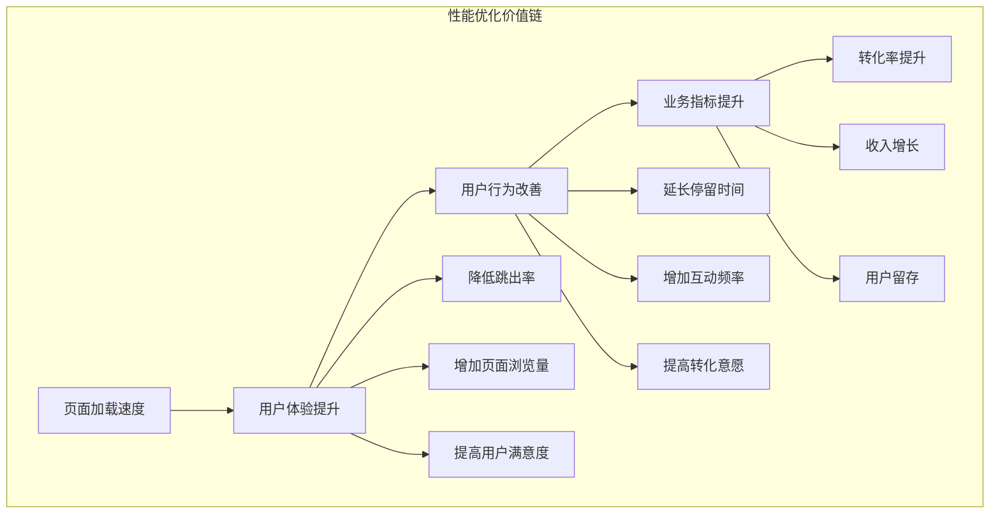
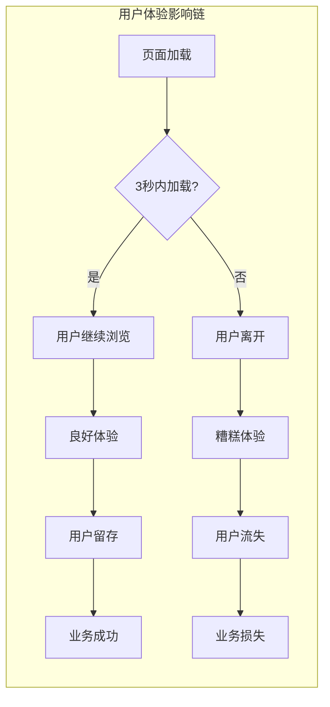
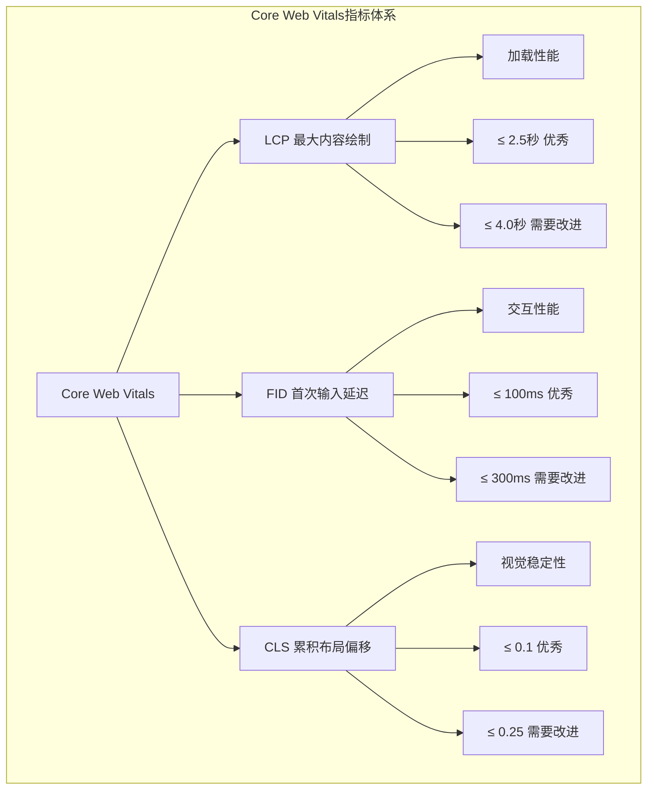

import Tabs from '@theme/Tabs';
import TabItem from '@theme/TabItem';
import CodeBlock from '@theme/CodeBlock';

# 前端性能优化全面指南

前端性能优化是现代Web开发的核心竞争力，直接影响用户体验、业务转化率和搜索引擎排名。在移动互联网时代，用户对页面加载速度的期望越来越高，性能优化已成为决定产品成败的关键因素。

:::tip 核心价值
**性能优化 = 用户体验 + 业务价值 + 技术卓越**
- 🚀 **用户体验**：快速响应，流畅交互，降低跳出率
- 💰 **业务价值**：提升转化率，增加用户留存，降低成本
- 🎯 **技术卓越**：代码质量，架构优化，可维护性
- 📊 **数据驱动**：性能监控，持续优化，量化改进
- 🌍 **SEO友好**：搜索引擎排名，可访问性，用户覆盖
:::

## 1. 性能优化的商业价值

### 1.1 性能与业务指标的关系

性能优化不仅是技术问题，更是商业问题。研究表明，页面性能与关键业务指标存在强相关性。



#### 性能影响数据统计

| 性能改进 | 业务影响 | 典型案例 | 提升幅度 |
|---------|----------|----------|----------|
| **页面加载时间减少1秒** | 转化率提升 | Amazon | 7% |
| **首屏时间优化** | 跳出率降低 | BBC | 10% |
| **移动端性能提升** | 用户参与度 | Pinterest | 15% |
| **Core Web Vitals优化** | SEO排名 | Google搜索 | 显著提升 |
| **资源加载优化** | 服务器成本 | Netflix | 降低43% |

<Tabs>
<TabItem value="user-experience" label="用户体验影响">

### 用户体验与性能的关系



#### 用户期望与现实

- **移动端用户期望**：页面在2秒内完成加载
- **桌面端用户期望**：页面在1秒内开始渲染
- **交互响应期望**：点击后100ms内有视觉反馈
- **滚动流畅度期望**：保持60fps的帧率

</TabItem>
<TabItem value="business-impact" label="商业影响">

### 性能对业务的直接影响

#### 电商行业案例分析

```javascript title="性能优化ROI计算器"
class PerformanceROICalculator {
  constructor(currentMetrics) {
    this.currentMetrics = currentMetrics;
  }
  
  calculateImpact(improvements) {
    const results = {};
    
    // 转化率影响计算
    if (improvements.loadTimeReduction) {
      const conversionIncrease = improvements.loadTimeReduction * 0.07; // 每秒7%提升
      results.conversionRate = {
        current: this.currentMetrics.conversionRate,
        improved: this.currentMetrics.conversionRate * (1 + conversionIncrease),
        increase: conversionIncrease * 100
      };
    }
    
    // 跳出率影响计算
    if (improvements.firstContentfulPaint) {
      const bounceRateReduction = Math.min(improvements.firstContentfulPaint * 0.05, 0.3);
      results.bounceRate = {
        current: this.currentMetrics.bounceRate,
        improved: this.currentMetrics.bounceRate * (1 - bounceRateReduction),
        reduction: bounceRateReduction * 100
      };
    }
    
    // 收入影响计算
    if (results.conversionRate && this.currentMetrics.monthlyRevenue) {
      const revenueIncrease = this.currentMetrics.monthlyRevenue * 
        (results.conversionRate.improved / results.conversionRate.current - 1);
      results.revenue = {
        monthlyIncrease: revenueIncrease,
        yearlyIncrease: revenueIncrease * 12
      };
    }
    
    return results;
  }
}

// 使用示例
const calculator = new PerformanceROICalculator({
  conversionRate: 0.025, // 2.5%
  bounceRate: 0.45, // 45%
  monthlyRevenue: 1000000 // 100万
});

const impact = calculator.calculateImpact({
  loadTimeReduction: 2, // 减少2秒
  firstContentfulPaint: 1.5 // FCP提升1.5秒
});

console.log('性能优化预期影响:', impact);
```

</TabItem>
<TabItem value="seo-benefits" label="SEO收益">

### 性能优化对SEO的影响

#### Core Web Vitals与搜索排名

Google已将Core Web Vitals作为搜索排名的重要因素，性能优化直接影响网站的搜索可见性。

```javascript title="SEO性能监控"
class SEOPerformanceMonitor {
  constructor() {
    this.metrics = {};
    this.thresholds = {
      LCP: 2500, // 2.5秒
      FID: 100,  // 100毫秒
      CLS: 0.1   // 0.1
    };
  }
  
  async measureCoreWebVitals() {
    // 动态导入web-vitals库
    const { getCLS, getFID, getLCP } = await import('web-vitals');
    
    return new Promise((resolve) => {
      const metrics = {};
      let collected = 0;
      const total = 3;
      
      const checkComplete = () => {
        collected++;
        if (collected === total) {
          resolve(this.generateSEOScore(metrics));
        }
      };
      
      getCLS((metric) => {
        metrics.CLS = metric.value;
        checkComplete();
      });
      
      getFID((metric) => {
        metrics.FID = metric.value;
        checkComplete();
      });
      
      getLCP((metric) => {
        metrics.LCP = metric.value;
        checkComplete();
      });
    });
  }
  
  generateSEOScore(metrics) {
    let score = 0;
    let maxScore = 300; // 每个指标100分
    
    // LCP评分
    if (metrics.LCP <= this.thresholds.LCP) {
      score += 100;
    } else if (metrics.LCP <= 4000) {
      score += 50;
    }
    
    // FID评分
    if (metrics.FID <= this.thresholds.FID) {
      score += 100;
    } else if (metrics.FID <= 300) {
      score += 50;
    }
    
    // CLS评分
    if (metrics.CLS <= this.thresholds.CLS) {
      score += 100;
    } else if (metrics.CLS <= 0.25) {
      score += 50;
    }
    
    return {
      metrics,
      score,
      maxScore,
      percentage: (score / maxScore) * 100,
      grade: this.getGrade(score / maxScore),
      recommendations: this.getRecommendations(metrics)
    };
  }
  
  getGrade(percentage) {
    if (percentage >= 0.9) return 'A';
    if (percentage >= 0.8) return 'B';
    if (percentage >= 0.7) return 'C';
    if (percentage >= 0.6) return 'D';
    return 'F';
  }
  
  getRecommendations(metrics) {
    const recommendations = [];
    
    if (metrics.LCP > this.thresholds.LCP) {
      recommendations.push({
        metric: 'LCP',
        issue: '最大内容绘制时间过长',
        solutions: [
          '优化服务器响应时间',
          '使用CDN加速资源加载',
          '压缩和优化图片',
          '预加载关键资源'
        ]
      });
    }
    
    if (metrics.FID > this.thresholds.FID) {
      recommendations.push({
        metric: 'FID',
        issue: '首次输入延迟过长',
        solutions: [
          '减少JavaScript执行时间',
          '代码分割和懒加载',
          '优化第三方脚本',
          '使用Web Workers处理复杂计算'
        ]
      });
    }
    
    if (metrics.CLS > this.thresholds.CLS) {
      recommendations.push({
        metric: 'CLS',
        issue: '累积布局偏移过大',
        solutions: [
          '为图片和视频设置尺寸属性',
          '避免在现有内容上方插入内容',
          '使用transform动画代替改变布局的动画',
          '预留广告和嵌入内容的空间'
        ]
      });
    }
    
    return recommendations;
  }
}
```

</TabItem>
</Tabs>

## 2. 核心性能指标详解

### 2.1 Core Web Vitals深度解析

Core Web Vitals是Google推出的用户体验核心指标，直接影响搜索排名和用户体验。



<Tabs>
<TabItem value="lcp" label="LCP - 最大内容绘制">

### LCP (Largest Contentful Paint)

LCP测量页面主要内容的加载时间，反映用户感知的加载速度。

#### LCP优化策略

```javascript title="LCP优化实践"
// 1. 关键资源预加载
class LCPOptimizer {
  constructor() {
    this.criticalResources = [];
    this.observer = null;
  }
  
  // 识别LCP元素
  identifyLCPElement() {
    return new Promise((resolve) => {
      const observer = new PerformanceObserver((list) => {
        const entries = list.getEntries();
        const lastEntry = entries[entries.length - 1];
        
        if (lastEntry) {
          resolve({
            element: lastEntry.element,
            loadTime: lastEntry.loadTime,
            size: lastEntry.size
          });
        }
      });
      
      observer.observe({ entryTypes: ['largest-contentful-paint'] });
      
      // 10秒后停止观察
      setTimeout(() => {
        observer.disconnect();
        resolve(null);
      }, 10000);
    });
  }
  
  // 预加载关键资源
  preloadCriticalResources() {
    const criticalImages = document.querySelectorAll('img[data-critical="true"]');
    
    criticalImages.forEach(img => {
      const link = document.createElement('link');
      link.rel = 'preload';
      link.as = 'image';
      link.href = img.src;
      
      // 响应式图片预加载
      if (img.srcset) {
        link.imagesrcset = img.srcset;
        link.imagesizes = img.sizes || '100vw';
      }
      
      document.head.appendChild(link);
    });
  }
  
  // 优化图片加载
  optimizeImageLoading() {
    const images = document.querySelectorAll('img');
    
    images.forEach(img => {
      // 添加loading属性
      if (!img.hasAttribute('loading')) {
        img.loading = img.dataset.critical === 'true' ? 'eager' : 'lazy';
      }
      
      // 添加fetchpriority属性
      if (img.dataset.critical === 'true') {
        img.fetchPriority = 'high';
      }
      
      // 图片加载错误处理
      img.addEventListener('error', () => {
        console.warn('图片加载失败:', img.src);
        // 可以设置默认图片
        img.src = '/images/placeholder.jpg';
      });
    });
  }
  
  // 监控LCP性能
  async monitorLCP() {
    const lcpData = await this.identifyLCPElement();
    
    if (lcpData) {
      console.log('LCP元素信息:', lcpData);
      
      // 发送性能数据
      this.sendPerformanceData({
        metric: 'LCP',
        value: lcpData.loadTime,
        element: lcpData.element.tagName,
        url: window.location.href
      });
      
      // 如果LCP时间过长，给出优化建议
      if (lcpData.loadTime > 2500) {
        this.suggestOptimizations(lcpData);
      }
    }
  }
  
  suggestOptimizations(lcpData) {
    const suggestions = [];
    
    if (lcpData.element.tagName === 'IMG') {
      suggestions.push('考虑使用WebP格式图片');
      suggestions.push('添加适当的图片尺寸属性');
      suggestions.push('使用CDN加速图片加载');
    }
    
    if (lcpData.loadTime > 4000) {
      suggestions.push('检查服务器响应时间');
      suggestions.push('启用Gzip压缩');
      suggestions.push('优化关键渲染路径');
    }
    
    console.log('LCP优化建议:', suggestions);
  }
  
  sendPerformanceData(data) {
    // 发送到分析服务
    if (navigator.sendBeacon) {
      navigator.sendBeacon('/api/performance', JSON.stringify(data));
    }
  }
}

// 使用示例
const lcpOptimizer = new LCPOptimizer();
lcpOptimizer.preloadCriticalResources();
lcpOptimizer.optimizeImageLoading();
lcpOptimizer.monitorLCP();
```

#### LCP优化检查清单

- ✅ **服务器响应时间** < 200ms
- ✅ **关键资源预加载** 使用 `<link rel="preload">`
- ✅ **图片优化** WebP格式，适当压缩
- ✅ **CDN使用** 全球分布式内容分发
- ✅ **关键CSS内联** 避免渲染阻塞

</TabItem>
<TabItem value="fid" label="FID - 首次输入延迟">

### FID (First Input Delay)

FID测量用户首次与页面交互时的延迟，反映页面的交互响应性。

#### FID优化策略

```javascript title="FID优化实践"
// 1. JavaScript执行优化
class FIDOptimizer {
  constructor() {
    this.taskQueue = [];
    this.isProcessing = false;
  }
  
  // 任务调度器 - 避免长任务阻塞主线程
  scheduleTask(task, priority = 'normal') {
    return new Promise((resolve, reject) => {
      this.taskQueue.push({
        task,
        priority,
        resolve,
        reject,
        timestamp: performance.now()
      });
      
      this.processQueue();
    });
  }
  
  async processQueue() {
    if (this.isProcessing) return;
    
    this.isProcessing = true;
    
    while (this.taskQueue.length > 0) {
      // 按优先级排序
      this.taskQueue.sort((a, b) => {
        const priorityOrder = { high: 3, normal: 2, low: 1 };
        return priorityOrder[b.priority] - priorityOrder[a.priority];
      });
      
      const { task, resolve, reject } = this.taskQueue.shift();
      
      try {
        // 使用 scheduler.postTask (如果支持) 或 MessageChannel
        if ('scheduler' in window && 'postTask' in scheduler) {
          await scheduler.postTask(() => {
            const result = task();
            resolve(result);
          });
        } else {
          // 降级方案：使用 MessageChannel 实现时间切片
          await this.executeWithTimeSlicing(task, resolve);
        }
      } catch (error) {
        reject(error);
      }
      
      // 让出控制权，避免阻塞用户交互
      await this.yieldToMain();
    }
    
    this.isProcessing = false;
  }
  
  executeWithTimeSlicing(task, resolve) {
    return new Promise((resolveSlice) => {
      const channel = new MessageChannel();
      
      channel.port2.onmessage = () => {
        const result = task();
        resolve(result);
        resolveSlice();
      };
      
      channel.port1.postMessage(null);
    });
  }
  
  yieldToMain() {
    return new Promise(resolve => {
      setTimeout(resolve, 0);
    });
  }
  
  // 代码分割和懒加载
  async loadModuleOnDemand(modulePath) {
    try {
      const startTime = performance.now();
      const module = await import(modulePath);
      const loadTime = performance.now() - startTime;
      
      console.log(`模块 ${modulePath} 加载时间: ${loadTime}ms`);
      
      return module;
    } catch (error) {
      console.error('模块加载失败:', error);
      throw error;
    }
  }
  
  // 事件处理优化
  optimizeEventHandlers() {
    // 使用事件委托减少事件监听器数量
    document.addEventListener('click', this.handleClick.bind(this), {
      passive: true,
      capture: false
    });
    
    // 优化滚动事件
    let scrollTimeout;
    document.addEventListener('scroll', () => {
      if (scrollTimeout) {
        cancelAnimationFrame(scrollTimeout);
      }
      
      scrollTimeout = requestAnimationFrame(() => {
        this.handleScroll();
      });
    }, { passive: true });
  }
  
  handleClick(event) {
    const target = event.target.closest('[data-action]');
    if (!target) return;
    
    const action = target.dataset.action;
    
    // 使用任务调度器处理点击事件
    this.scheduleTask(() => {
      this.executeAction(action, target);
    }, 'high');
  }
  
  executeAction(action, element) {
    switch (action) {
      case 'load-content':
        return this.loadContent(element);
      case 'submit-form':
        return this.submitForm(element);
      default:
        console.warn('未知操作:', action);
    }
  }
  
  async loadContent(element) {
    const contentId = element.dataset.contentId;
    
    // 显示加载状态
    element.classList.add('loading');
    
    try {
      const content = await fetch(`/api/content/${contentId}`);
      const data = await content.json();
      
      // 更新UI
      this.updateContent(data);
    } catch (error) {
      console.error('内容加载失败:', error);
    } finally {
      element.classList.remove('loading');
    }
  }
  
  // Web Workers处理复杂计算
  createWorker(workerScript) {
    return new Promise((resolve, reject) => {
      const worker = new Worker(workerScript);
      
      worker.onmessage = (event) => {
        resolve(event.data);
        worker.terminate();
      };
      
      worker.onerror = (error) => {
        reject(error);
        worker.terminate();
      };
      
      return worker;
    });
  }
  
  async processDataInWorker(data) {
    const worker = await this.createWorker('/workers/data-processor.js');
    
    return new Promise((resolve, reject) => {
      worker.onmessage = (event) => {
        resolve(event.data);
      };
      
      worker.onerror = reject;
      worker.postMessage(data);
    });
  }
}

// Web Worker 示例 (data-processor.js)
/*
self.onmessage = function(event) {
  const data = event.data;
  
  // 执行复杂计算
  const result = processLargeDataset(data);
  
  // 返回结果
  self.postMessage(result);
};

function processLargeDataset(data) {
  // 模拟复杂计算
  let result = [];
  for (let i = 0; i < data.length; i++) {
    result.push(data[i] * 2);
  }
  return result;
}
*/

// 使用示例
const fidOptimizer = new FIDOptimizer();
fidOptimizer.optimizeEventHandlers();

// 调度任务示例
fidOptimizer.scheduleTask(() => {
  console.log('执行低优先级任务');
}, 'low');
```

</TabItem>
<TabItem value="cls" label="CLS - 累积布局偏移">

### CLS (Cumulative Layout Shift)

CLS测量页面布局的稳定性，避免意外的布局偏移影响用户体验。

#### CLS优化策略

```javascript title="CLS优化实践"
// 1. 布局稳定性优化
class CLSOptimizer {
  constructor() {
    this.layoutShifts = [];
    this.observer = null;
    this.init();
  }
  
  init() {
    this.observeLayoutShifts();
    this.optimizeImages();
    this.optimizeFonts();
    this.reserveSpaceForAds();
  }
  
  // 监控布局偏移
  observeLayoutShifts() {
    if (!('LayoutShift' in window)) {
      console.warn('浏览器不支持Layout Shift API');
      return;
    }
    
    this.observer = new PerformanceObserver((list) => {
      for (const entry of list.getEntries()) {
        if (!entry.hadRecentInput) {
          this.layoutShifts.push({
            value: entry.value,
            sources: entry.sources,
            timestamp: entry.startTime
          });
          
          console.log('检测到布局偏移:', {
            value: entry.value,
            sources: entry.sources?.map(source => ({
              element: source.node,
              previousRect: source.previousRect,
              currentRect: source.currentRect
            }))
          });
          
          // 如果偏移值过大，发出警告
          if (entry.value > 0.1) {
            this.handleLargeShift(entry);
          }
        }
      }
    });
    
    this.observer.observe({ entryTypes: ['layout-shift'] });
  }
  
  handleLargeShift(entry) {
    console.warn('检测到大幅布局偏移:', entry.value);
    
    // 分析偏移原因
    if (entry.sources) {
      entry.sources.forEach(source => {
        const element = source.node;
        console.log('偏移元素:', element);
        
        // 给出优化建议
        this.suggestFix(element);
      });
    }
  }
  
  suggestFix(element) {
    const suggestions = [];
    
    if (element.tagName === 'IMG') {
      if (!element.width || !element.height) {
        suggestions.push('为图片添加width和height属性');
      }
      if (!element.style.aspectRatio) {
        suggestions.push('使用aspect-ratio CSS属性');
      }
    }
    
    if (element.tagName === 'IFRAME') {
      suggestions.push('为iframe预留空间');
    }
    
    if (element.classList.contains('ad-container')) {
      suggestions.push('为广告容器预留固定尺寸');
    }
    
    console.log('优化建议:', suggestions);
  }
  
  // 图片优化
  optimizeImages() {
    const images = document.querySelectorAll('img');
    
    images.forEach(img => {
      // 如果图片没有尺寸属性，尝试从CSS获取
      if (!img.width || !img.height) {
        const computedStyle = getComputedStyle(img);
        const aspectRatio = this.calculateAspectRatio(img);
        
        if (aspectRatio) {
          img.style.aspectRatio = aspectRatio;
        }
      }
      
      // 添加加载占位符
      if (!img.complete) {
        this.addImagePlaceholder(img);
      }
    });
  }
  
  calculateAspectRatio(img) {
    if (img.naturalWidth && img.naturalHeight) {
      return `${img.naturalWidth} / ${img.naturalHeight}`;
    }
    return null;
  }
  
  addImagePlaceholder(img) {
    const placeholder = document.createElement('div');
    placeholder.className = 'image-placeholder';
    placeholder.style.cssText = `
      background-color: #f0f0f0;
      display: flex;
      align-items: center;
      justify-content: center;
      color: #999;
      font-size: 14px;
    `;
    
    // 复制图片的尺寸样式
    const computedStyle = getComputedStyle(img);
    placeholder.style.width = computedStyle.width;
    placeholder.style.height = computedStyle.height;
    placeholder.textContent = '加载中...';
    
    // 插入占位符
    img.parentNode.insertBefore(placeholder, img);
    img.style.display = 'none';
    
    // 图片加载完成后移除占位符
    img.addEventListener('load', () => {
      img.style.display = '';
      placeholder.remove();
    });
  }
  
  // 字体优化
  optimizeFonts() {
    // 预加载关键字体
    const criticalFonts = [
      '/fonts/main-font.woff2',
      '/fonts/heading-font.woff2'
    ];
    
    criticalFonts.forEach(fontUrl => {
      const link = document.createElement('link');
      link.rel = 'preload';
      link.as = 'font';
      link.type = 'font/woff2';
      link.crossOrigin = 'anonymous';
      link.href = fontUrl;
      document.head.appendChild(link);
    });
    
    // 使用font-display优化字体加载
    const style = document.createElement('style');
    style.textContent = `
      @font-face {
        font-family: 'MainFont';
        src: url('/fonts/main-font.woff2') format('woff2');
        font-display: swap;
      }
    `;
    document.head.appendChild(style);
  }
  
  // 为广告预留空间
  reserveSpaceForAds() {
    const adContainers = document.querySelectorAll('.ad-container');
    
    adContainers.forEach(container => {
      const adSize = container.dataset.adSize || '300x250';
      const [width, height] = adSize.split('x');
      
      // 设置最小尺寸
      container.style.minWidth = `${width}px`;
      container.style.minHeight = `${height}px`;
      
      // 添加加载状态
      container.classList.add('ad-loading');
      
      // 模拟广告加载
      setTimeout(() => {
        container.classList.remove('ad-loading');
        container.classList.add('ad-loaded');
      }, 1000);
    });
  }
  
  // 动态内容插入优化
  insertContentSafely(container, content, position = 'beforeend') {
    // 记录插入前的布局信息
    const beforeRect = container.getBoundingClientRect();
    
    // 插入内容
    container.insertAdjacentHTML(position, content);
    
    // 检查是否造成布局偏移
    requestAnimationFrame(() => {
      const afterRect = container.getBoundingClientRect();
      
      if (beforeRect.height !== afterRect.height) {
        console.log('内容插入导致布局变化:', {
          before: beforeRect.height,
          after: afterRect.height,
          diff: afterRect.height - beforeRect.height
        });
      }
    });
  }
  
  // 获取CLS分数
  getCLSScore() {
    const totalShift = this.layoutShifts.reduce((sum, shift) => sum + shift.value, 0);
    return {
      score: totalShift,
      grade: this.getGrade(totalShift),
      shifts: this.layoutShifts.length,
      details: this.layoutShifts
    };
  }
  
  getGrade(score) {
    if (score <= 0.1) return 'Good';
    if (score <= 0.25) return 'Needs Improvement';
    return 'Poor';
  }
  
  // 清理观察器
  disconnect() {
    if (this.observer) {
      this.observer.disconnect();
    }
  }
}

// CSS优化示例
const clsOptimizationCSS = `
/* 1. 为图片设置aspect-ratio */
.responsive-image {
  width: 100%;
  height: auto;
  aspect-ratio: 16 / 9;
}

/* 2. 为广告容器预留空间 */
.ad-container {
  min-height: 250px;
  background-color: #f5f5f5;
  display: flex;
  align-items: center;
  justify-content: center;
}

.ad-container.ad-loading::before {
  content: "广告加载中...";
  color: #999;
}

/* 3. 字体加载优化 */
@font-face {
  font-family: 'CustomFont';
  src: url('/fonts/custom-font.woff2') format('woff2');
  font-display: swap; /* 避免字体加载时的布局偏移 */
}

/* 4. 动画使用transform而不是改变布局属性 */
.slide-in {
  transform: translateX(-100%);
  transition: transform 0.3s ease;
}

.slide-in.active {
  transform: translateX(0);
}

/* 5. 为动态内容预留空间 */
.dynamic-content-container {
  min-height: 200px;
  transition: min-height 0.3s ease;
}
`;

// 使用示例
const clsOptimizer = new CLSOptimizer();

// 5秒后获取CLS分数
setTimeout(() => {
  const clsScore = clsOptimizer.getCLSScore();
  console.log('CLS评分:', clsScore);
}, 5000);
```

</TabItem>
</Tabs>

### 2.2 其他重要性能指标

### 核心Web指标（Core Web Vitals）
- **LCP（Largest Contentful Paint）**：最大内容绘制时间，应小于2.5秒
- **FID（First Input Delay）**：首次输入延迟，应小于100毫秒
- **CLS（Cumulative Layout Shift）**：累积布局偏移，应小于0.1

### 其他重要指标
- **TTFB（Time to First Byte）**：首字节时间
- **FCP（First Contentful Paint）**：首次内容绘制
- **TTI（Time to Interactive）**：可交互时间

## 性能优化策略

### 1. 资源优化
- **压缩和合并**：减少HTTP请求数量
- **CDN使用**：利用全球分布式网络加速
- **图片优化**：选择合适的格式和压缩算法

### 2. 代码优化
- **代码分割**：按需加载减少初始包大小
- **懒加载**：延迟加载非关键资源
- **缓存策略**：合理利用浏览器缓存

### 3. 渲染优化
- **关键路径优化**：优先加载关键资源
- **CSS优化**：避免阻塞渲染的CSS
- **JavaScript优化**：异步加载非关键脚本

## 性能监控

### 工具选择
- **Lighthouse**：Google提供的性能审计工具
- **WebPageTest**：详细的性能分析
- **Chrome DevTools**：浏览器内置的性能分析工具
- **Real User Monitoring (RUM)**：真实用户性能数据

### 监控指标
- **技术指标**：加载时间、渲染时间等
- **业务指标**：转化率、用户行为等
- **错误监控**：JavaScript错误、资源加载失败等

## 最佳实践

### 开发阶段
- 在开发过程中持续关注性能
- 使用性能预算来约束资源大小
- 定期进行性能测试和优化

### 部署阶段
- 使用自动化工具进行性能检查
- 建立性能回归测试
- 监控生产环境的性能表现

### 持续优化
- 分析用户行为数据
- 根据业务需求调整优化策略
- 关注新技术和优化方法

## 性能优化实践

### 1. 资源加载优化

#### 图片优化
```html
<!-- 响应式图片 -->


<!-- 现代图片格式 -->
<picture>
  <source srcset="image.webp" type="image/webp">
  <source srcset="image.avif" type="image/avif">
  
</picture>
```

#### 资源预加载
```html
<!-- 预加载关键资源 -->
<link rel="preload" href="critical.css" as="style">
<link rel="preload" href="hero-image.jpg" as="image">
<link rel="preload" href="main.js" as="script">

<!-- 预连接外部域名 -->
<link rel="preconnect" href="https://fonts.googleapis.com">
<link rel="dns-prefetch" href="https://api.example.com">

<!-- 预获取下一页资源 -->
<link rel="prefetch" href="/next-page.html">
```

### 2. JavaScript性能优化

#### 代码分割
```javascript
// 动态导入实现代码分割
const LazyComponent = React.lazy(() => import('./LazyComponent'));

// 路由级别的代码分割
const Home = React.lazy(() => import('./pages/Home'));
const About = React.lazy(() => import('./pages/About'));

function App() {
  return (
    <Router>
      <Suspense fallback={<div>Loading...</div>}>
        <Routes>
          <Route path="/" element={<Home />} />
          <Route path="/about" element={<About />} />
        </Routes>
      </Suspense>
    </Router>
  );
}
```

#### 防抖和节流
```javascript
// 防抖函数
function debounce(func, wait) {
  let timeout;
  return function executedFunction(...args) {
    const later = () => {
      clearTimeout(timeout);
      func(...args);
    };
    clearTimeout(timeout);
    timeout = setTimeout(later, wait);
  };
}

// 节流函数
function throttle(func, limit) {
  let inThrottle;
  return function(...args) {
    if (!inThrottle) {
      func.apply(this, args);
      inThrottle = true;
      setTimeout(() => inThrottle = false, limit);
    }
  };
}

// 使用示例
const debouncedSearch = debounce((query) => {
  // 执行搜索
  searchAPI(query);
}, 300);

const throttledScroll = throttle(() => {
  // 处理滚动事件
  handleScroll();
}, 100);
```

#### 虚拟滚动
```javascript
// 虚拟滚动组件示例
function VirtualList({ items, itemHeight, containerHeight }) {
  const [scrollTop, setScrollTop] = useState(0);
  
  const visibleCount = Math.ceil(containerHeight / itemHeight);
  const startIndex = Math.floor(scrollTop / itemHeight);
  const endIndex = Math.min(startIndex + visibleCount, items.length);
  
  const visibleItems = items.slice(startIndex, endIndex);
  const offsetY = startIndex * itemHeight;
  
  return (
    <div 
      style={{ height: containerHeight, overflow: 'auto' }}
      onScroll={(e) => setScrollTop(e.target.scrollTop)}
    >
      <div style={{ height: items.length * itemHeight, position: 'relative' }}>
        <div style={{ transform: `translateY(${offsetY}px)` }}>
          {visibleItems.map((item, index) => (
            <div key={startIndex + index} style={{ height: itemHeight }}>
              {item.content}
            </div>
          ))}
        </div>
      </div>
    </div>
  );
}
```

### 3. CSS性能优化

#### 关键CSS内联
```html
<head>
  <style>
    /* 关键CSS内联到HTML中 */
    .header { background: #fff; height: 60px; }
    .hero { min-height: 400px; background: #f0f0f0; }
  </style>
  
  <!-- 非关键CSS异步加载 -->
  <link rel="preload" href="styles.css" as="style" onload="this.onload=null;this.rel='stylesheet'">
  <noscript><link rel="stylesheet" href="styles.css"></noscript>
</head>
```

#### CSS优化技巧
```css
/* 避免复杂选择器 */
/* 不好 */
.container .sidebar .widget .title h3 { }

/* 好 */
.widget-title { }

/* 使用transform和opacity进行动画 */
.element {
  transition: transform 0.3s ease, opacity 0.3s ease;
}

.element:hover {
  transform: translateY(-2px);
  opacity: 0.8;
}

/* 使用contain属性优化渲染 */
.card {
  contain: layout style paint;
}
```

### 4. 缓存策略

#### HTTP缓存
```javascript
// Service Worker缓存策略
self.addEventListener('fetch', (event) => {
  if (event.request.destination === 'image') {
    // 图片使用缓存优先策略
    event.respondWith(
      caches.match(event.request).then((response) => {
        return response || fetch(event.request).then((fetchResponse) => {
          const responseClone = fetchResponse.clone();
          caches.open('images').then((cache) => {
            cache.put(event.request, responseClone);
          });
          return fetchResponse;
        });
      })
    );
  }
});
```

#### 浏览器缓存
```javascript
// 本地存储缓存
class CacheManager {
  static set(key, data, ttl = 3600000) { // 默认1小时
    const item = {
      data,
      timestamp: Date.now(),
      ttl
    };
    localStorage.setItem(key, JSON.stringify(item));
  }
  
  static get(key) {
    const item = localStorage.getItem(key);
    if (!item) return null;
    
    const { data, timestamp, ttl } = JSON.parse(item);
    if (Date.now() - timestamp > ttl) {
      localStorage.removeItem(key);
      return null;
    }
    
    return data;
  }
}

// 使用示例
const cachedData = CacheManager.get('user-data');
if (!cachedData) {
  const userData = await fetchUserData();
  CacheManager.set('user-data', userData, 1800000); // 30分钟
}
```

## 性能监控实现

### Web Vitals监控
```javascript
// 监控Core Web Vitals
import { getCLS, getFID, getFCP, getLCP, getTTFB } from 'web-vitals';

function sendToAnalytics(metric) {
  // 发送到分析服务
  analytics.track('web_vital', {
    name: metric.name,
    value: metric.value,
    id: metric.id,
    url: window.location.href
  });
}

// 监控各项指标
getCLS(sendToAnalytics);
getFID(sendToAnalytics);
getFCP(sendToAnalytics);
getLCP(sendToAnalytics);
getTTFB(sendToAnalytics);
```

### 性能API使用
```javascript
// 使用Performance API监控
class PerformanceMonitor {
  static measurePageLoad() {
    window.addEventListener('load', () => {
      const navigation = performance.getEntriesByType('navigation')[0];
      const metrics = {
        dns: navigation.domainLookupEnd - navigation.domainLookupStart,
        tcp: navigation.connectEnd - navigation.connectStart,
        request: navigation.responseStart - navigation.requestStart,
        response: navigation.responseEnd - navigation.responseStart,
        dom: navigation.domContentLoadedEventEnd - navigation.responseEnd,
        load: navigation.loadEventEnd - navigation.loadEventStart
      };
      
      console.log('页面加载性能指标:', metrics);
    });
  }
  
  static measureResource() {
    const resources = performance.getEntriesByType('resource');
    resources.forEach(resource => {
      if (resource.transferSize > 100000) { // 大于100KB的资源
        console.warn('大资源文件:', resource.name, resource.transferSize);
      }
    });
  }
  
  static measureCustom(name, fn) {
    performance.mark(`${name}-start`);
    const result = fn();
    performance.mark(`${name}-end`);
    performance.measure(name, `${name}-start`, `${name}-end`);
    
    const measure = performance.getEntriesByName(name)[0];
    console.log(`${name} 执行时间:`, measure.duration);
    
    return result;
  }
}
```

### 错误监控
```javascript
// 全局错误监控
class ErrorMonitor {
  static init() {
    // JavaScript错误
    window.addEventListener('error', (event) => {
      this.reportError({
        type: 'javascript',
        message: event.message,
        filename: event.filename,
        lineno: event.lineno,
        colno: event.colno,
        stack: event.error?.stack
      });
    });
    
    // Promise错误
    window.addEventListener('unhandledrejection', (event) => {
      this.reportError({
        type: 'promise',
        message: event.reason?.message || 'Unhandled Promise Rejection',
        stack: event.reason?.stack
      });
    });
    
    // 资源加载错误
    window.addEventListener('error', (event) => {
      if (event.target !== window) {
        this.reportError({
          type: 'resource',
          message: `Failed to load ${event.target.tagName}`,
          source: event.target.src || event.target.href
        });
      }
    }, true);
  }
  
  static reportError(error) {
    // 发送错误报告到监控服务
    fetch('/api/errors', {
      method: 'POST',
      headers: { 'Content-Type': 'application/json' },
      body: JSON.stringify({
        ...error,
        url: window.location.href,
        userAgent: navigator.userAgent,
        timestamp: Date.now()
      })
    });
  }
}
```

## 性能优化工具

### 构建优化
```javascript
// Webpack性能优化配置
module.exports = {
  optimization: {
    splitChunks: {
      chunks: 'all',
      cacheGroups: {
        vendor: {
          test: /[\\/]node_modules[\\/]/,
          name: 'vendors',
          chunks: 'all',
        },
        common: {
          name: 'common',
          minChunks: 2,
          chunks: 'all',
          enforce: true
        }
      }
    },
    usedExports: true,
    sideEffects: false
  },
  resolve: {
    alias: {
      '@': path.resolve(__dirname, 'src')
    }
  }
};
```

### 性能预算
```javascript
// 性能预算配置
module.exports = {
  performance: {
    maxAssetSize: 250000, // 250KB
    maxEntrypointSize: 250000,
    hints: 'warning'
  },
  // Lighthouse CI配置
  ci: {
    collect: {
      numberOfRuns: 3
    },
    assert: {
      assertions: {
        'categories:performance': ['warn', { minScore: 0.9 }],
        'categories:accessibility': ['error', { minScore: 0.9 }]
      }
    }
  }
};
```

通过系统化的性能优化实践，可以显著提升Web应用的用户体验，降低跳出率，提高转化率和用户满意度。 