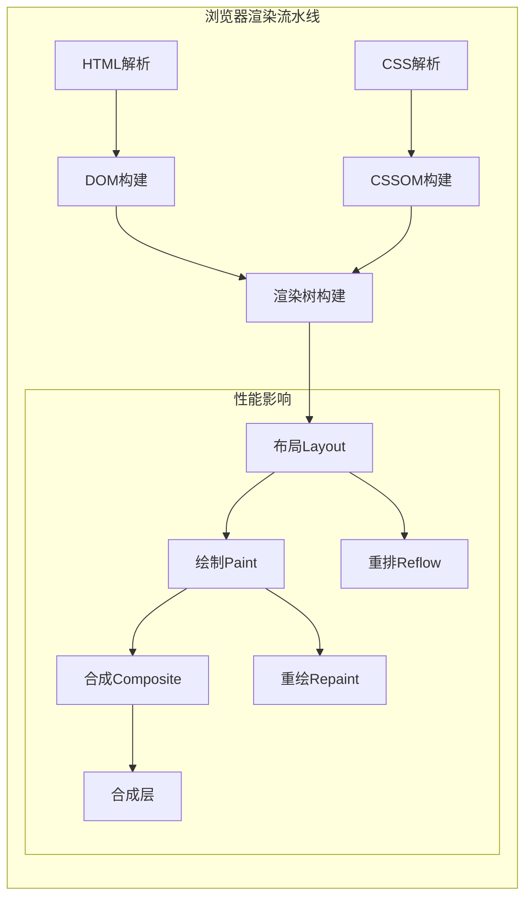
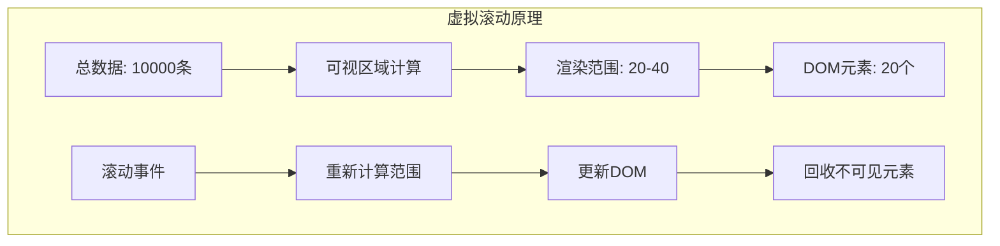

import Tabs from '@theme/Tabs';
import TabItem from '@theme/TabItem';
import CodeBlock from '@theme/CodeBlock';

# 前端渲染优化策略详解

渲染优化是前端性能优化的核心环节，直接影响用户界面的流畅度和响应性。通过系统化的渲染优化策略，可以实现60fps的丝滑体验，提升用户满意度和应用性能。

:::tip 核心价值
**渲染优化 = DOM优化 + 重排重绘控制 + 事件优化 + 虚拟化技术**
- 🎯 **DOM操作优化**：减少DOM操作次数，批量处理更新
- 🔄 **重排重绘控制**：避免强制同步布局，使用GPU加速
- ⚡ **事件优化**：防抖节流，事件委托减少内存占用
- 📊 **虚拟化技术**：大数据列表渲染优化
- 🧠 **React优化**：memo、useMemo、useCallback合理使用
- 📈 **性能监控**：实时监控渲染性能指标
:::

## 1. 浏览器渲染机制

### 1.1 渲染流水线

理解浏览器渲染流水线是优化的基础，每个步骤都可能成为性能瓶颈。



#### 渲染性能指标对比

| 操作类型 | 触发阶段 | 性能影响 | 优化策略 | 示例属性 |
|---------|----------|----------|----------|----------|
| **重排+重绘+合成** | Layout → Paint → Composite | 最高 | 避免或批量操作 | width, height, margin |
| **重绘+合成** | Paint → Composite | 中等 | 使用合成层 | color, background |
| **仅合成** | Composite | 最低 | 优先使用 | transform, opacity |
| **无影响** | - | 无 | 理想状态 | 读取计算样式 |

## 2. DOM操作优化策略

### 2.1 批量DOM操作技术

DOM操作是渲染性能的主要瓶颈，通过批量操作和DocumentFragment可以显著提升性能。

<Tabs>
<TabItem value="batch-operations" label="批量操作">

#### DOM批量操作最佳实践

```javascript title="DOM批量操作优化对比"
// ❌ 错误示例：频繁DOM操作
function inefficientDOMOperations() {
  const list = document.getElementById('product-list');
  const products = getProducts(); // 假设返回1000个产品
  
  // 每次appendChild都会触发重排重绘
  products.forEach(product => {
    const item = document.createElement('div');
    item.className = 'product-item';
    item.innerHTML = `
      <h3>${product.name}</h3>
      <p>¥${product.price}</p>
      <button onclick="addToCart(${product.id})">加入购物车</button>
    `;
    list.appendChild(item); // 触发1000次重排！
  });
}

// ✅ 正确示例：批量DOM操作
function efficientDOMOperations() {
  const list = document.getElementById('product-list');
  const products = getProducts();
  const fragment = document.createDocumentFragment();
  
  // 在内存中构建DOM结构
  products.forEach(product => {
    const item = document.createElement('div');
    item.className = 'product-item';
    item.innerHTML = `
      <h3>${product.name}</h3>
      <p>¥${product.price}</p>
      <button onclick="addToCart(${product.id})">加入购物车</button>
    `;
    fragment.appendChild(item); // 在内存中操作
  });
  
  list.appendChild(fragment); // 只触发1次重排！
}

// 🚀 高级示例：虚拟DOM批量更新
class DOMBatcher {
  constructor() {
    this.updates = [];
    this.isScheduled = false;
  }
  
  scheduleUpdate(element, property, value) {
    this.updates.push({ element, property, value });
    
    if (!this.isScheduled) {
      this.isScheduled = true;
      requestAnimationFrame(() => this.flushUpdates());
    }
  }
  
  flushUpdates() {
    // 批量应用所有更新
    this.updates.forEach(({ element, property, value }) => {
      element.style[property] = value;
    });
    
    this.updates = [];
    this.isScheduled = false;
  }
}

// 使用批量更新器
const batcher = new DOMBatcher();

function animateElements() {
  const elements = document.querySelectorAll('.animated-item');
  
  elements.forEach((element, index) => {
    // 调度更新而不是立即执行
    batcher.scheduleUpdate(element, 'transform', `translateX(${index * 10}px)`);
    batcher.scheduleUpdate(element, 'opacity', '0.8');
  });
}
```

</TabItem>
<TabItem value="fragment-usage" label="DocumentFragment">

#### DocumentFragment高级用法

```javascript title="DocumentFragment最佳实践"
// 基础DocumentFragment使用
class DOMBuilder {
  constructor() {
    this.fragment = document.createDocumentFragment();
  }
  
  // 创建产品卡片
  createProductCard(product) {
    const card = document.createElement('div');
    card.className = 'product-card';
    card.dataset.productId = product.id;
    
    card.innerHTML = `
      <div class="product-image">
        
        ${!product.inStock ? '<div class="out-of-stock">缺货</div>' : ''}
      </div>
      <div class="product-info">
        <h3 class="product-name">${product.name}</h3>
        <p class="product-price">¥${product.price}</p>
        <div class="product-rating">
          ${this.createStarRating(product.rating)}
        </div>
        <button class="add-to-cart-btn" ${!product.inStock ? 'disabled' : ''}>
          ${product.inStock ? '加入购物车' : '缺货'}
        </button>
      </div>
    `;
    
    return card;
  }
  
  // 创建星级评分
  createStarRating(rating) {
    const stars = [];
    for (let i = 1; i <= 5; i++) {
      const starClass = i <= rating ? 'star-filled' : 'star-empty';
      stars.push(`<span class="star ${starClass}">★</span>`);
    }
    return stars.join('');
  }
  
  // 批量创建并添加产品
  buildProductGrid(products, container) {
    // 清空现有内容
    container.innerHTML = '';
    
    // 批量创建产品卡片
    products.forEach(product => {
      const card = this.createProductCard(product);
      this.fragment.appendChild(card);
    });
    
    // 一次性添加到DOM
    container.appendChild(this.fragment);
    
    // 重置fragment以便重用
    this.fragment = document.createDocumentFragment();
  }
}

// 使用示例
const domBuilder = new DOMBuilder();
const productContainer = document.getElementById('product-grid');

// 初始加载产品
fetch('/api/products')
  .then(response => response.json())
  .then(products => {
    domBuilder.buildProductGrid(products, productContainer);
  });
```

</TabItem>
</Tabs>

## 3. 重排重绘优化策略

### 3.1 避免强制同步布局

强制同步布局是性能杀手，了解如何避免是优化的关键。

:::warning 性能陷阱
读取布局属性（如offsetWidth、scrollTop）会强制浏览器立即计算布局，打断渲染流水线！
:::

<Tabs>
<TabItem value="layout-thrashing" label="布局抖动">

#### 避免布局抖动

```javascript title="布局抖动优化对比"
// ❌ 错误示例：布局抖动
function layoutThrashing() {
  const elements = document.querySelectorAll('.animated-item');
  
  elements.forEach(element => {
    // 读取布局属性，强制同步布局
    const width = element.offsetWidth;
    const height = element.offsetHeight;
    
    // 修改样式，触发重排
    element.style.width = width + 10 + 'px';
    element.style.height = height + 10 + 'px';
    
    // 再次读取，又一次强制同步布局
    const newWidth = element.offsetWidth;
    console.log('New width:', newWidth);
  });
}

// ✅ 正确示例：批量读写分离
function optimizedLayout() {
  const elements = document.querySelectorAll('.animated-item');
  const measurements = [];
  
  // 第一阶段：批量读取
  elements.forEach(element => {
    measurements.push({
      element,
      width: element.offsetWidth,
      height: element.offsetHeight
    });
  });
  
  // 第二阶段：批量写入
  measurements.forEach(({ element, width, height }) => {
    element.style.width = width + 10 + 'px';
    element.style.height = height + 10 + 'px';
  });
  
  // 第三阶段：批量读取新值（如果需要）
  measurements.forEach(({ element }) => {
    const newWidth = element.offsetWidth;
    console.log('New width:', newWidth);
  });
}
```

</TabItem>
<TabItem value="gpu-acceleration" label="GPU加速">

#### 利用GPU加速

```javascript title="GPU加速优化策略"
// CSS GPU加速属性
const gpuAcceleratedProperties = {
  // 优先使用的GPU加速属性
  transform: 'translateX(100px) scale(1.2)',
  opacity: '0.8',
  filter: 'blur(2px)',
  
  // 避免使用的CPU密集属性
  // left: '100px',        // 触发重排
  // width: '200px',       // 触发重排
  // background: 'red',    // 触发重绘
};

// 创建合成层的技巧
class GPUAccelerator {
  static createCompositeLayer(element) {
    // 方法1：使用transform3d强制创建合成层
    element.style.transform = 'translateZ(0)';
    
    // 方法2：使用will-change提示浏览器
    element.style.willChange = 'transform, opacity';
    
    // 方法3：使用backface-visibility
    element.style.backfaceVisibility = 'hidden';
  }
  
  static optimizeAnimation(element, keyframes, options = {}) {
    // 确保动画在合成层上运行
    this.createCompositeLayer(element);
    
    // 使用Web Animations API
    const animation = element.animate(keyframes, {
      duration: 1000,
      easing: 'ease-out',
      fill: 'forwards',
      ...options
    });
    
    // 动画结束后清理will-change
    animation.addEventListener('finish', () => {
      element.style.willChange = 'auto';
    });
    
    return animation;
  }
}
```

</TabItem>
</Tabs>

## 4. 虚拟滚动与大数据渲染

### 4.1 虚拟滚动核心原理

虚拟滚动是处理大量数据列表的核心技术，只渲染可视区域内的元素，大幅提升性能。



<Tabs>
<TabItem value="basic-virtual-scroll" label="基础虚拟滚动">

#### 基础虚拟滚动实现

```javascript title="高性能虚拟滚动器"
class VirtualScroller {
  constructor(options) {
    this.container = options.container;
    this.itemHeight = options.itemHeight;
    this.items = options.items || [];
    this.renderItem = options.renderItem;
    this.bufferSize = options.bufferSize || 5; // 缓冲区大小
    
    this.scrollTop = 0;
    this.containerHeight = 0;
    this.visibleStart = 0;
    this.visibleEnd = 0;
    this.renderedItems = new Map();
    
    this.init();
  }
  
  init() {
    this.setupContainer();
    this.calculateDimensions();
    this.bindEvents();
    this.render();
  }
  
  setupContainer() {
    this.container.style.position = 'relative';
    this.container.style.overflow = 'auto';
    
    // 创建内容容器
    this.content = document.createElement('div');
    this.content.style.position = 'relative';
    this.content.style.height = `${this.items.length * this.itemHeight}px`;
    this.container.appendChild(this.content);
  }
  
  calculateDimensions() {
    this.containerHeight = this.container.clientHeight;
    this.visibleCount = Math.ceil(this.containerHeight / this.itemHeight);
  }
  
  bindEvents() {
    this.container.addEventListener('scroll', this.handleScroll.bind(this), {
      passive: true
    });
    
    // 监听容器尺寸变化
    if (window.ResizeObserver) {
      this.resizeObserver = new ResizeObserver(() => {
        this.calculateDimensions();
        this.render();
      });
      this.resizeObserver.observe(this.container);
    }
  }
  
  handleScroll() {
    const newScrollTop = this.container.scrollTop;
    
    // 防抖优化
    if (Math.abs(newScrollTop - this.scrollTop) < this.itemHeight / 2) {
      return;
    }
    
    this.scrollTop = newScrollTop;
    this.render();
  }
  
  calculateVisibleRange() {
    const start = Math.floor(this.scrollTop / this.itemHeight);
    const end = Math.min(
      start + this.visibleCount + this.bufferSize * 2,
      this.items.length
    );
    
    this.visibleStart = Math.max(0, start - this.bufferSize);
    this.visibleEnd = end;
  }
  
  render() {
    this.calculateVisibleRange();
    
    // 移除不在可视范围内的元素
    this.cleanupInvisibleItems();
    
    // 渲染可视范围内的元素
    for (let i = this.visibleStart; i < this.visibleEnd; i++) {
      if (!this.renderedItems.has(i)) {
        this.renderItemAt(i);
      }
    }
  }
  
  renderItemAt(index) {
    const item = this.items[index];
    const element = this.renderItem(item, index);
    
    // 设置元素位置
    element.style.position = 'absolute';
    element.style.top = `${index * this.itemHeight}px`;
    element.style.height = `${this.itemHeight}px`;
    element.style.width = '100%';
    element.dataset.index = index;
    
    this.content.appendChild(element);
    this.renderedItems.set(index, element);
  }
  
  cleanupInvisibleItems() {
    const toRemove = [];
    
    this.renderedItems.forEach((element, index) => {
      if (index < this.visibleStart || index >= this.visibleEnd) {
        toRemove.push(index);
      }
    });
    
    toRemove.forEach(index => {
      const element = this.renderedItems.get(index);
      if (element && element.parentNode) {
        element.parentNode.removeChild(element);
      }
      this.renderedItems.delete(index);
    });
  }
  
  // 更新数据
  updateItems(newItems) {
    this.items = newItems;
    this.content.style.height = `${this.items.length * this.itemHeight}px`;
    
    // 清空所有渲染的元素
    this.renderedItems.forEach(element => {
      if (element.parentNode) {
        element.parentNode.removeChild(element);
      }
    });
    this.renderedItems.clear();
    
    this.render();
  }
  
  // 滚动到指定索引
  scrollToIndex(index) {
    const targetScrollTop = index * this.itemHeight;
    this.container.scrollTop = targetScrollTop;
  }
  
  // 销毁
  destroy() {
    if (this.resizeObserver) {
      this.resizeObserver.disconnect();
    }
    this.container.removeEventListener('scroll', this.handleScroll);
  }
}

// 使用示例
const virtualScroller = new VirtualScroller({
  container: document.getElementById('virtual-list'),
  itemHeight: 50,
  items: Array.from({ length: 10000 }, (_, i) => ({
    id: i,
    name: `Item ${i}`,
    description: `Description for item ${i}`
  })),
  renderItem: (item, index) => {
    const div = document.createElement('div');
    div.className = 'virtual-item';
    div.innerHTML = `
      <div class="item-content">
        <h4>${item.name}</h4>
        <p>${item.description}</p>
        <small>Index: ${index}</small>
      </div>
    `;
    return div;
  },
  bufferSize: 10
});
```

</TabItem>
</Tabs>

## 5. React渲染优化专题

### 5.1 React.memo优化

React.memo是React中用于优化函数组件渲染的重要工具。

```typescript title="React.memo最佳实践"
import React, { memo, useMemo, useCallback, useState } from 'react';

// 基础memo使用
interface UserCardProps {
  user: {
    id: number;
    name: string;
    email: string;
    avatar?: string;
  };
  onEdit: (id: number) => void;
  onDelete: (id: number) => void;
}

const UserCard = memo<UserCardProps>(({ user, onEdit, onDelete }) => {
  console.log('UserCard render:', user.name);
  
  return (
    <div className="user-card">
      
      <div className="user-info">
        <h3>{user.name}</h3>
        <p>{user.email}</p>
      </div>
      <div className="user-actions">
        <button onClick={() => onEdit(user.id)}>编辑</button>
        <button onClick={() => onDelete(user.id)}>删除</button>
      </div>
    </div>
  );
});

// 使用示例
const App: React.FC = () => {
  const [users, setUsers] = useState([
    { id: 1, name: 'Alice', email: 'alice@example.com' },
    { id: 2, name: 'Bob', email: 'bob@example.com' }
  ]);
  
  const [counter, setCounter] = useState(0);
  
  // 使用useCallback优化回调函数
  const handleEditUser = useCallback((id: number) => {
    console.log('Edit user:', id);
  }, []);
  
  const handleDeleteUser = useCallback((id: number) => {
    setUsers(prev => prev.filter(user => user.id !== id));
  }, []);
  
  return (
    <div className="app">
      <h1>React.memo优化示例</h1>
      
      {/* 计数器不会影响UserCard的重新渲染 */}
      <div>
        <p>计数器: {counter}</p>
        <button onClick={() => setCounter(c => c + 1)}>增加</button>
      </div>
      
      <div className="user-list">
        <h2>用户列表</h2>
        {users.map(user => (
          <UserCard
            key={user.id}
            user={user}
            onEdit={handleEditUser}
            onDelete={handleDeleteUser}
          />
        ))}
      </div>
    </div>
  );
};
```

## 6. 性能监控与调试

### 6.1 渲染性能监控工具

建立完善的性能监控体系是持续优化的基础。

```typescript title="渲染性能监控系统"
// 综合性能监控类
class RenderingPerformanceMonitor {
  private observers: Map<string, PerformanceObserver> = new Map();
  private metrics: Map<string, any[]> = new Map();
  private isMonitoring = false;
  
  constructor(private options: {
    enableFPS?: boolean;
    enableMemory?: boolean;
    enablePaint?: boolean;
    reportInterval?: number;
  } = {}) {
    this.options = {
      enableFPS: true,
      enableMemory: true,
      enablePaint: true,
      reportInterval: 5000,
      ...options
    };
  }
  
  start() {
    if (this.isMonitoring) return;
    
    this.isMonitoring = true;
    
    if (this.options.enableFPS) {
      this.startFPSMonitoring();
    }
    
    if (this.options.enableMemory) {
      this.startMemoryMonitoring();
    }
    
    // 定期报告
    setInterval(() => {
      this.generateReport();
    }, this.options.reportInterval);
  }
  
  private startFPSMonitoring() {
    let frameCount = 0;
    let lastTime = performance.now();
    
    const countFrames = () => {
      frameCount++;
      const currentTime = performance.now();
      
      if (currentTime - lastTime >= 1000) {
        const fps = Math.round((frameCount * 1000) / (currentTime - lastTime));
        this.recordMetric('fps', { value: fps, timestamp: currentTime });
        
        frameCount = 0;
        lastTime = currentTime;
      }
      
      if (this.isMonitoring) {
        requestAnimationFrame(countFrames);
      }
    };
    
    requestAnimationFrame(countFrames);
  }
  
  private startMemoryMonitoring() {
    if (!('memory' in performance)) return;
    
    const checkMemory = () => {
      const memory = (performance as any).memory;
      this.recordMetric('memory', {
        used: memory.usedJSHeapSize,
        total: memory.totalJSHeapSize,
        limit: memory.jsHeapSizeLimit,
        timestamp: performance.now()
      });
      
      if (this.isMonitoring) {
        setTimeout(checkMemory, 1000);
      }
    };
    
    checkMemory();
  }
  
  private recordMetric(type: string, data: any) {
    if (!this.metrics.has(type)) {
      this.metrics.set(type, []);
    }
    
    const metrics = this.metrics.get(type)!;
    metrics.push(data);
    
    // 保持最近100条记录
    if (metrics.length > 100) {
      metrics.shift();
    }
  }
  
  generateReport() {
    const report: any = {
      timestamp: new Date().toISOString(),
      metrics: {}
    };
    
    this.metrics.forEach((data, type) => {
      if (data.length === 0) return;
      
      switch (type) {
        case 'fps':
          const fpsValues = data.map(d => d.value);
          report.metrics.fps = {
            current: fpsValues[fpsValues.length - 1],
            average: fpsValues.reduce((sum, v) => sum + v, 0) / fpsValues.length,
            min: Math.min(...fpsValues),
            max: Math.max(...fpsValues)
          };
          break;
          
        case 'memory':
          const latestMemory = data[data.length - 1];
          report.metrics.memory = {
            used: Math.round(latestMemory.used / 1024 / 1024), // MB
            total: Math.round(latestMemory.total / 1024 / 1024), // MB
            usage: Math.round((latestMemory.used / latestMemory.total) * 100) // %
          };
          break;
      }
    });
    
    console.log('Performance Report:', report);
    return report;
  }
  
  stop() {
    this.isMonitoring = false;
    this.observers.forEach(observer => observer.disconnect());
    this.observers.clear();
  }
}

// 使用示例
const monitor = new RenderingPerformanceMonitor({
  enableFPS: true,
  enableMemory: true,
  reportInterval: 10000
});

// 启动监控
monitor.start();

// 在应用卸载时停止监控
window.addEventListener('beforeunload', () => {
  monitor.stop();
});
```

通过这个完整的渲染优化指南，开发者可以系统性地理解和应用各种渲染优化技术，从DOM操作优化到React组件优化，从虚拟滚动到性能监控，全面提升Web应用的渲染性能和用户体验。