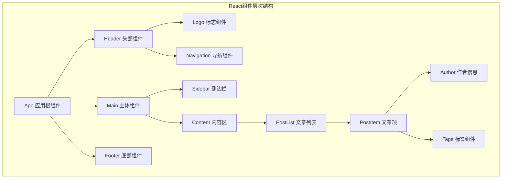
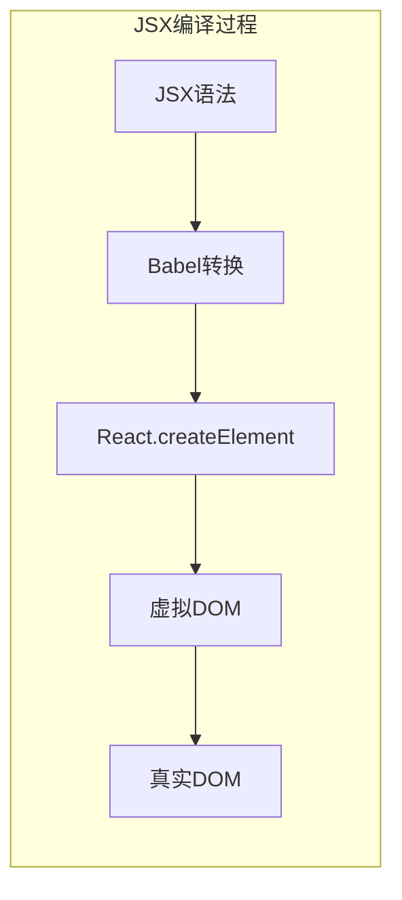

import Tabs from '@theme/Tabs';
import TabItem from '@theme/TabItem';
import CodeBlock from '@theme/CodeBlock';

# React核心概念与现代开发实践

React是由Facebook开发的用于构建用户界面的JavaScript库，以其组件化、声明式和高效的特点成为现代前端开发的主流选择。本指南将深入解析React的核心概念、最佳实践和现代开发模式。

:::tip 核心价值
**React = 组件化 + 声明式 + 单向数据流 + 虚拟DOM**
- 🧩 **组件化架构**：可复用、可维护的UI组件
- 📝 **声明式编程**：描述UI应该是什么样子，而不是如何实现
- 🔄 **单向数据流**：可预测的数据流向，易于调试
- ⚡ **虚拟DOM**：高效的DOM更新机制
- 🎯 **生态丰富**：庞大的社区和工具生态系统
- 🔧 **开发体验**：优秀的开发工具和调试支持
:::

## 1. React组件化开发

### 1.1 组件设计原则

React组件化开发遵循单一职责原则，每个组件应该专注于一个特定的功能或UI片段。



#### 组件分类与设计模式

| 组件类型 | 职责 | 特点 | 使用场景 | 示例 |
|---------|------|------|----------|------|
| **展示组件** | UI渲染 | 无状态、纯函数 | 可复用UI元素 | Button, Card, Modal |
| **容器组件** | 逻辑处理 | 有状态、数据管理 | 业务逻辑封装 | UserProfile, ProductList |
| **高阶组件** | 功能增强 | 组件包装器 | 横切关注点 | withAuth, withLoading |
| **自定义Hook** | 逻辑复用 | 状态逻辑提取 | 跨组件逻辑共享 | useApi, useLocalStorage |

<Tabs>
<TabItem value="functional" label="函数组件">

#### 现代函数组件开发

```typescript title="函数组件最佳实践"
import React, { useState, useEffect, useCallback, useMemo } from 'react';

// 1. 基础函数组件
interface ButtonProps {
  variant?: 'primary' | 'secondary' | 'danger';
  size?: 'small' | 'medium' | 'large';
  disabled?: boolean;
  loading?: boolean;
  children: React.ReactNode;
  onClick?: () => void;
}

export const Button: React.FC<ButtonProps> = ({
  variant = 'primary',
  size = 'medium',
  disabled = false,
  loading = false,
  children,
  onClick
}) => {
  const buttonClass = useMemo(() => {
    const baseClass = 'btn';
    const variantClass = `btn--${variant}`;
    const sizeClass = `btn--${size}`;
    const disabledClass = disabled ? 'btn--disabled' : '';
    const loadingClass = loading ? 'btn--loading' : '';
    
    return [baseClass, variantClass, sizeClass, disabledClass, loadingClass]
      .filter(Boolean)
      .join(' ');
  }, [variant, size, disabled, loading]);
  
  const handleClick = useCallback(() => {
    if (!disabled && !loading && onClick) {
      onClick();
    }
  }, [disabled, loading, onClick]);
  
  return (
    <button 
      className={buttonClass}
      onClick={handleClick}
      disabled={disabled || loading}
      aria-busy={loading}
    >
      {loading && <span className="spinner" />}
      <span className={loading ? 'btn__text--hidden' : 'btn__text'}>
        {children}
      </span>
    </button>
  );
};
```

</TabItem>
</Tabs>

## 2. JSX语法与最佳实践

### 2.1 JSX核心概念

JSX是JavaScript的语法扩展，允许在JavaScript中编写类似HTML的代码，是React的核心特性之一。



#### JSX语法规则与最佳实践

| 规则类型 | 说明 | 正确示例 | 错误示例 |
|---------|------|----------|----------|
| **单一根元素** | 必须有一个根元素 | `<div>...</div>` | `<div></div><span></span>` |
| **Fragment** | 使用Fragment避免额外DOM | `<>...</>` | 不必要的div包装 |
| **属性命名** | 使用驼峰命名 | `className`, `onClick` | `class`, `onclick` |
| **自闭合标签** | 必须自闭合 | ``, `<br />` | ``, `<br>` |
| **JavaScript表达式** | 使用{}包裹 | `{user.name}` | `user.name` |

## 3. React状态管理

### 3.1 本地状态 vs 全局状态

理解何时使用本地状态，何时使用全局状态，是React开发中的重要决策。

```typescript title="状态管理策略"
// 本地状态示例 - 适用于组件内部的UI状态
const LocalStateExample: React.FC = () => {
  const [isOpen, setIsOpen] = useState(false);
  const [inputValue, setInputValue] = useState('');
  
  return (
    <div>
      <button onClick={() => setIsOpen(!isOpen)}>
        {isOpen ? '关闭' : '打开'}
      </button>
      {isOpen && (
        <div>
          <input
            value={inputValue}
            onChange={(e) => setInputValue(e.target.value)}
            placeholder="输入内容..."
          />
        </div>
      )}
    </div>
  );
};
```

通过这个React基础指南，开发者可以全面掌握React的核心概念，为构建现代React应用打下坚实的基础。