import Tabs from '@theme/Tabs';
import TabItem from '@theme/TabItem';
import CodeBlock from '@theme/CodeBlock';

# React状态管理完全指南

状态管理是React应用开发的核心挑战之一。随着应用规模的增长，如何高效、可维护地管理应用状态变得至关重要。本指南将深入探讨各种状态管理方案，帮助你选择最适合项目需求的解决方案。

:::tip 核心价值
**状态管理 = 数据流控制 + 状态共享 + 性能优化 + 开发体验**
- 🎯 **数据流控制**：单向数据流，可预测的状态变化
- 🔄 **状态共享**：跨组件状态共享，避免prop drilling
- ⚡ **性能优化**：精确更新，避免不必要的重新渲染
- 🛠️ **开发体验**：调试工具，时间旅行，状态持久化
- 📊 **可维护性**：清晰的状态结构，易于测试和维护
- 🎨 **灵活性**：适应不同规模和复杂度的应用需求
:::

## 1. 状态管理方案对比

### 1.1 方案选择指南

选择合适的状态管理方案需要考虑应用规模、团队经验、性能要求等多个因素。

```mermaid
graph TB
    subgraph "状态管理方案选择决策树"
        A[开始评估] --> B{应用规模}
        B -->|小型应用| C[React内置状态]
        B -->|中型应用| D{状态复杂度}
        B -->|大型应用| E[企业级方案]
        
        C --> C1[useState + useContext]
        
        D -->|简单| D1[Zustand]
        D -->|复杂| D2[Redux Toolkit]
        
        E --> E1[Redux + Saga]
        E --> E2[MobX]
        E --> E3[Recoil]
        
        F[团队经验] --> G{Redux经验}
        G -->|有| H[Redux生态]
        G -->|无| I[现代轻量方案]
        
        H --> H1[Redux Toolkit]
        H --> H2[Redux + RTK Query]
        
        I --> I1[Zustand]
        I --> I2[Jotai]
        I --> I3[Valtio]
    end
```



#### 状态管理方案对比表

| 方案 | 学习曲线 | 包大小 | 性能 | 生态系统 | 适用场景 | TypeScript支持 |
|------|----------|--------|------|----------|----------|----------------|
| **useState + useContext** | 低 | 0KB | 中等 | React内置 | 小型应用 | ⭐⭐⭐ |
| **Redux Toolkit** | 中等 | 47KB | 高 | 丰富 | 中大型应用 | ⭐⭐⭐⭐⭐ |
| **Zustand** | 低 | 8KB | 高 | 中等 | 中小型应用 | ⭐⭐⭐⭐ |
| **Jotai** | 中等 | 13KB | 高 | 新兴 | 原子化状态 | ⭐⭐⭐⭐⭐ |
| **Recoil** | 中等 | 79KB | 高 | Facebook | 复杂状态图 | ⭐⭐⭐⭐ |
| **MobX** | 高 | 16KB | 高 | 成熟 | 面向对象 | ⭐⭐⭐⭐ |
| **Valtio** | 低 | 9KB | 高 | 新兴 | 代理状态 | ⭐⭐⭐⭐ |

<Tabs>
<TabItem value="react-builtin" label="React内置状态">

### React内置状态管理

对于小到中型应用，React的内置状态管理通常已经足够。

```typescript title="React内置状态管理最佳实践"
import React, { createContext, useContext, useReducer, useState, useCallback, useMemo } from 'react';

// 1. 简单状态管理 - useState + useContext
interface AppState {
  user: User | null;
  theme: 'light' | 'dark';
  language: 'zh' | 'en';
  notifications: Notification[];
}

interface User {
  id: number;
  name: string;
  email: string;
  avatar?: string;
}

interface Notification {
  id: string;
  type: 'success' | 'error' | 'warning' | 'info';
  message: string;
  timestamp: number;
}

// Context定义
const AppStateContext = createContext<{
  state: AppState;
  actions: {
    setUser: (user: User | null) => void;
    toggleTheme: () => void;
    setLanguage: (language: 'zh' | 'en') => void;
    addNotification: (notification: Omit<Notification, 'id' | 'timestamp'>) => void;
    removeNotification: (id: string) => void;
    clearNotifications: () => void;
  };
} | undefined>(undefined);

// Provider组件
export const AppStateProvider: React.FC<{ children: React.ReactNode }> = ({ children }) => {
  const [state, setState] = useState<AppState>({
    user: null,
    theme: 'light',
    language: 'zh',
    notifications: []
  });
  
  // 优化的action creators
  const actions = useMemo(() => ({
    setUser: (user: User | null) => {
      setState(prev => ({ ...prev, user }));
    },
    
    toggleTheme: () => {
      setState(prev => ({ 
        ...prev, 
        theme: prev.theme === 'light' ? 'dark' : 'light' 
      }));
    },
    
    setLanguage: (language: 'zh' | 'en') => {
      setState(prev => ({ ...prev, language }));
    },
    
    addNotification: (notification: Omit<Notification, 'id' | 'timestamp'>) => {
      const newNotification: Notification = {
        ...notification,
        id: Math.random().toString(36).substr(2, 9),
        timestamp: Date.now()
      };
      
      setState(prev => ({
        ...prev,
        notifications: [...prev.notifications, newNotification]
      }));
      
      // 自动移除通知
      setTimeout(() => {
        setState(prev => ({
          ...prev,
          notifications: prev.notifications.filter(n => n.id !== newNotification.id)
        }));
      }, 5000);
    },
    
    removeNotification: (id: string) => {
      setState(prev => ({
        ...prev,
        notifications: prev.notifications.filter(n => n.id !== id)
      }));
    },
    
    clearNotifications: () => {
      setState(prev => ({ ...prev, notifications: [] }));
    }
  }), []);
  
  const value = useMemo(() => ({ state, actions }), [state, actions]);
  
  return (
    <AppStateContext.Provider value={value}>
      {children}
    </AppStateContext.Provider>
  );
};

// Hook
export const useAppState = () => {
  const context = useContext(AppStateContext);
  if (context === undefined) {
    throw new Error('useAppState must be used within an AppStateProvider');
  }
  return context;
};

// 2. 复杂状态管理 - useReducer
interface TodoState {
  todos: Todo[];
  filter: 'all' | 'active' | 'completed';
  loading: boolean;
  error: string | null;
}

interface Todo {
  id: string;
  text: string;
  completed: boolean;
  createdAt: number;
  updatedAt: number;
}

type TodoAction =
  | { type: 'ADD_TODO'; payload: { text: string } }
  | { type: 'TOGGLE_TODO'; payload: { id: string } }
  | { type: 'DELETE_TODO'; payload: { id: string } }
  | { type: 'EDIT_TODO'; payload: { id: string; text: string } }
  | { type: 'SET_FILTER'; payload: { filter: TodoState['filter'] } }
  | { type: 'SET_LOADING'; payload: { loading: boolean } }
  | { type: 'SET_ERROR'; payload: { error: string | null } }
  | { type: 'LOAD_TODOS'; payload: { todos: Todo[] } }
  | { type: 'CLEAR_COMPLETED' };

const todoReducer = (state: TodoState, action: TodoAction): TodoState => {
  switch (action.type) {
    case 'ADD_TODO': {
      const newTodo: Todo = {
        id: Math.random().toString(36).substr(2, 9),
        text: action.payload.text,
        completed: false,
        createdAt: Date.now(),
        updatedAt: Date.now()
      };
      
      return {
        ...state,
        todos: [...state.todos, newTodo],
        error: null
      };
    }
    
    case 'TOGGLE_TODO':
      return {
        ...state,
        todos: state.todos.map(todo =>
          todo.id === action.payload.id
            ? { ...todo, completed: !todo.completed, updatedAt: Date.now() }
            : todo
        )
      };
    
    case 'DELETE_TODO':
      return {
        ...state,
        todos: state.todos.filter(todo => todo.id !== action.payload.id)
      };
    
    case 'EDIT_TODO':
      return {
        ...state,
        todos: state.todos.map(todo =>
          todo.id === action.payload.id
            ? { ...todo, text: action.payload.text, updatedAt: Date.now() }
            : todo
        )
      };
    
    case 'SET_FILTER':
      return {
        ...state,
        filter: action.payload.filter
      };
    
    case 'SET_LOADING':
      return {
        ...state,
        loading: action.payload.loading
      };
    
    case 'SET_ERROR':
      return {
        ...state,
        error: action.payload.error,
        loading: false
      };
    
    case 'LOAD_TODOS':
      return {
        ...state,
        todos: action.payload.todos,
        loading: false,
        error: null
      };
    
    case 'CLEAR_COMPLETED':
      return {
        ...state,
        todos: state.todos.filter(todo => !todo.completed)
      };
    
    default:
      return state;
  }
};

// Todo Context
const TodoContext = createContext<{
  state: TodoState;
  dispatch: React.Dispatch<TodoAction>;
  actions: {
    addTodo: (text: string) => void;
    toggleTodo: (id: string) => void;
    deleteTodo: (id: string) => void;
    editTodo: (id: string, text: string) => void;
    setFilter: (filter: TodoState['filter']) => void;
    clearCompleted: () => void;
    loadTodos: () => Promise<void>;
  };
} | undefined>(undefined);

export const TodoProvider: React.FC<{ children: React.ReactNode }> = ({ children }) => {
  const [state, dispatch] = useReducer(todoReducer, {
    todos: [],
    filter: 'all',
    loading: false,
    error: null
  });
  
  // Action creators
  const actions = useMemo(() => ({
    addTodo: (text: string) => {
      dispatch({ type: 'ADD_TODO', payload: { text } });
    },
    
    toggleTodo: (id: string) => {
      dispatch({ type: 'TOGGLE_TODO', payload: { id } });
    },
    
    deleteTodo: (id: string) => {
      dispatch({ type: 'DELETE_TODO', payload: { id } });
    },
    
    editTodo: (id: string, text: string) => {
      dispatch({ type: 'EDIT_TODO', payload: { id, text } });
    },
    
    setFilter: (filter: TodoState['filter']) => {
      dispatch({ type: 'SET_FILTER', payload: { filter } });
    },
    
    clearCompleted: () => {
      dispatch({ type: 'CLEAR_COMPLETED' });
    },
    
    loadTodos: async () => {
      dispatch({ type: 'SET_LOADING', payload: { loading: true } });
      
      try {
        // 模拟API调用
        const response = await fetch('/api/todos');
        if (!response.ok) {
          throw new Error('Failed to load todos');
        }
        
        const todos = await response.json();
        dispatch({ type: 'LOAD_TODOS', payload: { todos } });
      } catch (error) {
        dispatch({ 
          type: 'SET_ERROR', 
          payload: { error: error instanceof Error ? error.message : 'Unknown error' }
        });
      }
    }
  }), []);
  
  const value = useMemo(() => ({ state, dispatch, actions }), [state, actions]);
  
  return (
    <TodoContext.Provider value={value}>
      {children}
    </TodoContext.Provider>
  );
};

export const useTodos = () => {
  const context = useContext(TodoContext);
  if (context === undefined) {
    throw new Error('useTodos must be used within a TodoProvider');
  }
  return context;
};

// 使用示例
const TodoApp: React.FC = () => {
  const { state, actions } = useTodos();
  const [newTodoText, setNewTodoText] = useState('');
  
  // 过滤todos
  const filteredTodos = useMemo(() => {
    switch (state.filter) {
      case 'active':
        return state.todos.filter(todo => !todo.completed);
      case 'completed':
        return state.todos.filter(todo => todo.completed);
      default:
        return state.todos;
    }
  }, [state.todos, state.filter]);
  
  const handleAddTodo = useCallback((e: React.FormEvent) => {
    e.preventDefault();
    if (newTodoText.trim()) {
      actions.addTodo(newTodoText.trim());
      setNewTodoText('');
    }
  }, [newTodoText, actions]);
  
  useEffect(() => {
    actions.loadTodos();
  }, [actions]);
  
  if (state.loading) {
    return <div className="loading">加载中...</div>;
  }
  
  if (state.error) {
    return <div className="error">错误: {state.error}</div>;
  }
  
  return (
    <div className="todo-app">
      <h1>待办事项</h1>
      
      <form onSubmit={handleAddTodo} className="add-todo-form">
        <input
          type="text"
          value={newTodoText}
          onChange={(e) => setNewTodoText(e.target.value)}
          placeholder="添加新的待办事项..."
          className="todo-input"
        />
        <button type="submit">添加</button>
      </form>
      
      <div className="todo-filters">
        <button
          className={state.filter === 'all' ? 'active' : ''}
          onClick={() => actions.setFilter('all')}
        >
          全部
        </button>
        <button
          className={state.filter === 'active' ? 'active' : ''}
          onClick={() => actions.setFilter('active')}
        >
          未完成
        </button>
        <button
          className={state.filter === 'completed' ? 'active' : ''}
          onClick={() => actions.setFilter('completed')}
        >
          已完成
        </button>
      </div>
      
      <ul className="todo-list">
        {filteredTodos.map(todo => (
          <TodoItem
            key={todo.id}
            todo={todo}
            onToggle={() => actions.toggleTodo(todo.id)}
            onDelete={() => actions.deleteTodo(todo.id)}
            onEdit={(text) => actions.editTodo(todo.id, text)}
          />
        ))}
      </ul>
      
      {state.todos.some(todo => todo.completed) && (
        <button onClick={actions.clearCompleted} className="clear-completed">
          清除已完成
        </button>
      )}
    </div>
  );
};
```

</TabItem>
<TabItem value="redux-toolkit" label="Redux Toolkit">

### Redux Toolkit现代化状态管理

Redux Toolkit是Redux官方推荐的现代化工具集，大幅简化了Redux的使用。

```typescript title="Redux Toolkit完整实现"
import { createSlice, createAsyncThunk, configureStore, PayloadAction } from '@reduxjs/toolkit';
import { useSelector, useDispatch, TypedUseSelectorHook } from 'react-redux';

// 1. 用户状态管理
interface User {
  id: number;
  name: string;
  email: string;
  avatar?: string;
  role: 'admin' | 'user' | 'guest';
}

interface UserState {
  currentUser: User | null;
  users: User[];
  loading: boolean;
  error: string | null;
}

const initialUserState: UserState = {
  currentUser: null,
  users: [],
  loading: false,
  error: null
};

// 异步Thunk
export const fetchUsers = createAsyncThunk(
  'users/fetchUsers',
  async (_, { rejectWithValue }) => {
    try {
      const response = await fetch('/api/users');
      if (!response.ok) {
        throw new Error('Failed to fetch users');
      }
      return await response.json();
    } catch (error) {
      return rejectWithValue(error instanceof Error ? error.message : 'Unknown error');
    }
  }
);

export const loginUser = createAsyncThunk(
  'users/loginUser',
  async ({ email, password }: { email: string; password: string }, { rejectWithValue }) => {
    try {
      const response = await fetch('/api/auth/login', {
        method: 'POST',
        headers: { 'Content-Type': 'application/json' },
        body: JSON.stringify({ email, password })
      });
      
      if (!response.ok) {
        throw new Error('Login failed');
      }
      
      const data = await response.json();
      localStorage.setItem('token', data.token);
      return data.user;
    } catch (error) {
      return rejectWithValue(error instanceof Error ? error.message : 'Login failed');
    }
  }
);

export const updateUser = createAsyncThunk(
  'users/updateUser',
  async ({ id, updates }: { id: number; updates: Partial<User> }, { rejectWithValue }) => {
    try {
      const token = localStorage.getItem('token');
      const response = await fetch(`/api/users/${id}`, {
        method: 'PATCH',
        headers: {
          'Content-Type': 'application/json',
          'Authorization': `Bearer ${token}`
        },
        body: JSON.stringify(updates)
      });
      
      if (!response.ok) {
        throw new Error('Update failed');
      }
      
      return await response.json();
    } catch (error) {
      return rejectWithValue(error instanceof Error ? error.message : 'Update failed');
    }
  }
);

// User Slice
const userSlice = createSlice({
  name: 'users',
  initialState: initialUserState,
  reducers: {
    logout: (state) => {
      state.currentUser = null;
      localStorage.removeItem('token');
    },
    clearError: (state) => {
      state.error = null;
    },
    setCurrentUser: (state, action: PayloadAction<User>) => {
      state.currentUser = action.payload;
    }
  },
  extraReducers: (builder) => {
    builder
      // fetchUsers
      .addCase(fetchUsers.pending, (state) => {
        state.loading = true;
        state.error = null;
      })
      .addCase(fetchUsers.fulfilled, (state, action) => {
        state.loading = false;
        state.users = action.payload;
      })
      .addCase(fetchUsers.rejected, (state, action) => {
        state.loading = false;
        state.error = action.payload as string;
      })
      // loginUser
      .addCase(loginUser.pending, (state) => {
        state.loading = true;
        state.error = null;
      })
      .addCase(loginUser.fulfilled, (state, action) => {
        state.loading = false;
        state.currentUser = action.payload;
      })
      .addCase(loginUser.rejected, (state, action) => {
        state.loading = false;
        state.error = action.payload as string;
      })
      // updateUser
      .addCase(updateUser.fulfilled, (state, action) => {
        if (state.currentUser && state.currentUser.id === action.payload.id) {
          state.currentUser = action.payload;
        }
        state.users = state.users.map(user =>
          user.id === action.payload.id ? action.payload : user
        );
      });
  }
});

export const { logout, clearError, setCurrentUser } = userSlice.actions;

// 2. 购物车状态管理
interface CartItem {
  id: number;
  name: string;
  price: number;
  quantity: number;
  image: string;
}

interface CartState {
  items: CartItem[];
  totalItems: number;
  totalPrice: number;
  discount: number;
  shippingCost: number;
}

const initialCartState: CartState = {
  items: [],
  totalItems: 0,
  totalPrice: 0,
  discount: 0,
  shippingCost: 0
};

const cartSlice = createSlice({
  name: 'cart',
  initialState: initialCartState,
  reducers: {
    addItem: (state, action: PayloadAction<Omit<CartItem, 'quantity'>>) => {
      const existingItem = state.items.find(item => item.id === action.payload.id);
      
      if (existingItem) {
        existingItem.quantity += 1;
      } else {
        state.items.push({ ...action.payload, quantity: 1 });
      }
      
      cartSlice.caseReducers.calculateTotals(state);
    },
    
    removeItem: (state, action: PayloadAction<number>) => {
      state.items = state.items.filter(item => item.id !== action.payload);
      cartSlice.caseReducers.calculateTotals(state);
    },
    
    updateQuantity: (state, action: PayloadAction<{ id: number; quantity: number }>) => {
      const { id, quantity } = action.payload;
      
      if (quantity <= 0) {
        state.items = state.items.filter(item => item.id !== id);
      } else {
        const item = state.items.find(item => item.id === id);
        if (item) {
          item.quantity = quantity;
        }
      }
      
      cartSlice.caseReducers.calculateTotals(state);
    },
    
    applyDiscount: (state, action: PayloadAction<number>) => {
      state.discount = action.payload;
    },
    
    setShippingCost: (state, action: PayloadAction<number>) => {
      state.shippingCost = action.payload;
    },
    
    clearCart: (state) => {
      state.items = [];
      state.totalItems = 0;
      state.totalPrice = 0;
      state.discount = 0;
    },
    
    calculateTotals: (state) => {
      state.totalItems = state.items.reduce((sum, item) => sum + item.quantity, 0);
      state.totalPrice = state.items.reduce((sum, item) => sum + item.price * item.quantity, 0);
    }
  }
});

export const {
  addItem,
  removeItem,
  updateQuantity,
  applyDiscount,
  setShippingCost,
  clearCart
} = cartSlice.actions;

// 3. 通知状态管理
interface Notification {
  id: string;
  type: 'success' | 'error' | 'warning' | 'info';
  message: string;
  timestamp: number;
  autoClose?: boolean;
}

interface NotificationState {
  notifications: Notification[];
}

const initialNotificationState: NotificationState = {
  notifications: []
};

const notificationSlice = createSlice({
  name: 'notifications',
  initialState: initialNotificationState,
  reducers: {
    addNotification: (state, action: PayloadAction<Omit<Notification, 'id' | 'timestamp'>>) => {
      const notification: Notification = {
        ...action.payload,
        id: Math.random().toString(36).substr(2, 9),
        timestamp: Date.now()
      };
      
      state.notifications.push(notification);
    },
    
    removeNotification: (state, action: PayloadAction<string>) => {
      state.notifications = state.notifications.filter(n => n.id !== action.payload);
    },
    
    clearNotifications: (state) => {
      state.notifications = [];
    }
  }
});

export const { addNotification, removeNotification, clearNotifications } = notificationSlice.actions;

// Store配置
export const store = configureStore({
  reducer: {
    users: userSlice.reducer,
    cart: cartSlice.reducer,
    notifications: notificationSlice.reducer
  },
  middleware: (getDefaultMiddleware) =>
    getDefaultMiddleware({
      serializableCheck: {
        ignoredActions: ['persist/PERSIST', 'persist/REHYDRATE']
      }
    }),
  devTools: process.env.NODE_ENV !== 'production'
});

export type RootState = ReturnType<typeof store.getState>;
export type AppDispatch = typeof store.dispatch;

// 类型化的hooks
export const useAppDispatch = () => useDispatch<AppDispatch>();
export const useAppSelector: TypedUseSelectorHook<RootState> = useSelector;

// Selectors
export const selectCurrentUser = (state: RootState) => state.users.currentUser;
export const selectUsers = (state: RootState) => state.users.users;
export const selectUserLoading = (state: RootState) => state.users.loading;
export const selectUserError = (state: RootState) => state.users.error;

export const selectCartItems = (state: RootState) => state.cart.items;
export const selectCartTotal = (state: RootState) => state.cart.totalPrice;
export const selectCartItemCount = (state: RootState) => state.cart.totalItems;
export const selectCartFinalPrice = (state: RootState) => {
  const { totalPrice, discount, shippingCost } = state.cart;
  const discountAmount = totalPrice * (discount / 100);
  return totalPrice - discountAmount + shippingCost;
};

export const selectNotifications = (state: RootState) => state.notifications.notifications;

// 使用示例组件
const UserProfile: React.FC = () => {
  const dispatch = useAppDispatch();
  const currentUser = useAppSelector(selectCurrentUser);
  const loading = useAppSelector(selectUserLoading);
  const error = useAppSelector(selectUserError);
  
  const [editing, setEditing] = useState(false);
  const [name, setName] = useState(currentUser?.name || '');
  
  const handleSave = async () => {
    if (currentUser) {
      try {
        await dispatch(updateUser({ id: currentUser.id, updates: { name } })).unwrap();
        setEditing(false);
        dispatch(addNotification({
          type: 'success',
          message: '用户信息更新成功',
          autoClose: true
        }));
      } catch (error) {
        dispatch(addNotification({
          type: 'error',
          message: '更新失败: ' + error,
          autoClose: true
        }));
      }
    }
  };
  
  if (loading) return <div>加载中...</div>;
  if (error) return <div>错误: {error}</div>;
  if (!currentUser) return <div>请先登录</div>;
  
  return (
    <div className="user-profile">
      <h2>用户资料</h2>
      
      {editing ? (
        <div>
          <input
            type="text"
            value={name}
            onChange={(e) => setName(e.target.value)}
          />
          <button onClick={handleSave}>保存</button>
          <button onClick={() => setEditing(false)}>取消</button>
        </div>
      ) : (
        <div>
          <p>姓名: {currentUser.name}</p>
          <p>邮箱: {currentUser.email}</p>
          <button onClick={() => setEditing(true)}>编辑</button>
        </div>
      )}
      
      <button onClick={() => dispatch(logout())}>
        退出登录
      </button>
    </div>
  );
};

const ShoppingCart: React.FC = () => {
  const dispatch = useAppDispatch();
  const items = useAppSelector(selectCartItems);
  const totalPrice = useAppSelector(selectCartTotal);
  const finalPrice = useAppSelector(selectCartFinalPrice);
  
  return (
    <div className="shopping-cart">
      <h2>购物车</h2>
      
      {items.length === 0 ? (
        <p>购物车为空</p>
      ) : (
        <>
          {items.map(item => (
            <div key={item.id} className="cart-item">
              <span>{item.name}</span>
              <span>¥{item.price}</span>
              <div>
                <button
                  onClick={() => dispatch(updateQuantity({ id: item.id, quantity: item.quantity - 1 }))}
                >
                  -
                </button>
                <span>{item.quantity}</span>
                <button
                  onClick={() => dispatch(updateQuantity({ id: item.id, quantity: item.quantity + 1 }))}
                >
                  +
                </button>
              </div>
              <button onClick={() => dispatch(removeItem(item.id))}>
                删除
              </button>
            </div>
          ))}
          
          <div className="cart-summary">
            <p>小计: ¥{totalPrice.toFixed(2)}</p>
            <p>总计: ¥{finalPrice.toFixed(2)}</p>
            <button onClick={() => dispatch(clearCart())}>
              清空购物车
            </button>
          </div>
        </>
      )}
    </div>
  );
};
```

</TabItem>
<TabItem value="zustand" label="Zustand">

### Zustand轻量级状态管理

Zustand是一个小巧、快速、可扩展的状态管理解决方案。

```typescript title="Zustand状态管理实现"
import { create } from 'zustand';
import { subscribeWithSelector } from 'zustand/middleware';
import { immer } from 'zustand/middleware/immer';
import { persist } from 'zustand/middleware';

// 1. 基础Store
interface CounterState {
  count: number;
  increment: () => void;
  decrement: () => void;
  reset: () => void;
  setCount: (count: number) => void;
}

export const useCounterStore = create<CounterState>((set) => ({
  count: 0,
  increment: () => set((state) => ({ count: state.count + 1 })),
  decrement: () => set((state) => ({ count: state.count - 1 })),
  reset: () => set({ count: 0 }),
  setCount: (count) => set({ count })
}));

// 2. 复杂Store with Immer
interface Todo {
  id: string;
  text: string;
  completed: boolean;
  createdAt: number;
}

interface TodoState {
  todos: Todo[];
  filter: 'all' | 'active' | 'completed';
  loading: boolean;
  error: string | null;
  
  // Actions
  addTodo: (text: string) => void;
  toggleTodo: (id: string) => void;
  deleteTodo: (id: string) => void;
  editTodo: (id: string, text: string) => void;
  setFilter: (filter: 'all' | 'active' | 'completed') => void;
  clearCompleted: () => void;
  loadTodos: () => Promise<void>;
  
  // Computed
  filteredTodos: () => Todo[];
  completedCount: () => number;
  activeCount: () => number;
}

export const useTodoStore = create<TodoState>()(
  immer(
    subscribeWithSelector((set, get) => ({
      todos: [],
      filter: 'all',
      loading: false,
      error: null,
      
      addTodo: (text: string) =>
        set((state) => {
          state.todos.push({
            id: Math.random().toString(36).substr(2, 9),
            text,
            completed: false,
            createdAt: Date.now()
          });
        }),
      
      toggleTodo: (id: string) =>
        set((state) => {
          const todo = state.todos.find(t => t.id === id);
          if (todo) {
            todo.completed = !todo.completed;
          }
        }),
      
      deleteTodo: (id: string) =>
        set((state) => {
          state.todos = state.todos.filter(t => t.id !== id);
        }),
      
      editTodo: (id: string, text: string) =>
        set((state) => {
          const todo = state.todos.find(t => t.id === id);
          if (todo) {
            todo.text = text;
          }
        }),
      
      setFilter: (filter) => set({ filter }),
      
      clearCompleted: () =>
        set((state) => {
          state.todos = state.todos.filter(t => !t.completed);
        }),
      
      loadTodos: async () => {
        set({ loading: true, error: null });
        
        try {
          const response = await fetch('/api/todos');
          if (!response.ok) {
            throw new Error('Failed to load todos');
          }
          
          const todos = await response.json();
          set({ todos, loading: false });
        } catch (error) {
          set({
            error: error instanceof Error ? error.message : 'Unknown error',
            loading: false
          });
        }
      },
      
      // Computed values
      filteredTodos: () => {
        const { todos, filter } = get();
        switch (filter) {
          case 'active':
            return todos.filter(t => !t.completed);
          case 'completed':
            return todos.filter(t => t.completed);
          default:
            return todos;
        }
      },
      
      completedCount: () => get().todos.filter(t => t.completed).length,
      activeCount: () => get().todos.filter(t => !t.completed).length
    }))
  )
);

// 3. 持久化Store
interface UserState {
  user: User | null;
  theme: 'light' | 'dark';
  language: 'zh' | 'en';
  preferences: {
    notifications: boolean;
    autoSave: boolean;
    compactMode: boolean;
  };
  
  // Actions
  setUser: (user: User | null) => void;
  toggleTheme: () => void;
  setLanguage: (language: 'zh' | 'en') => void;
  updatePreferences: (preferences: Partial<UserState['preferences']>) => void;
  login: (email: string, password: string) => Promise<void>;
  logout: () => void;
}

export const useUserStore = create<UserState>()(
  persist(
    immer((set, get) => ({
      user: null,
      theme: 'light',
      language: 'zh',
      preferences: {
        notifications: true,
        autoSave: true,
        compactMode: false
      },
      
      setUser: (user) => set({ user }),
      
      toggleTheme: () =>
        set((state) => {
          state.theme = state.theme === 'light' ? 'dark' : 'light';
        }),
      
      setLanguage: (language) => set({ language }),
      
      updatePreferences: (newPreferences) =>
        set((state) => {
          Object.assign(state.preferences, newPreferences);
        }),
      
      login: async (email: string, password: string) => {
        try {
          const response = await fetch('/api/auth/login', {
            method: 'POST',
            headers: { 'Content-Type': 'application/json' },
            body: JSON.stringify({ email, password })
          });
          
          if (!response.ok) {
            throw new Error('Login failed');
          }
          
          const { user, token } = await response.json();
          localStorage.setItem('token', token);
          set({ user });
        } catch (error) {
          throw error;
        }
      },
      
      logout: () => {
        localStorage.removeItem('token');
        set({ user: null });
      }
    })),
    {
      name: 'user-storage',
      partialize: (state) => ({
        theme: state.theme,
        language: state.language,
        preferences: state.preferences
      })
    }
  )
);

// 4. 订阅和中间件
// 主题变化监听
useUserStore.subscribe(
  (state) => state.theme,
  (theme) => {
    document.documentElement.setAttribute('data-theme', theme);
  }
);

// 语言变化监听
useUserStore.subscribe(
  (state) => state.language,
  (language) => {
    document.documentElement.setAttribute('lang', language);
  }
);

// 5. 选择器优化
export const useUser = () => useUserStore((state) => state.user);
export const useTheme = () => useUserStore((state) => state.theme);
export const useLanguage = () => useUserStore((state) => state.language);
export const usePreferences = () => useUserStore((state) => state.preferences);

// 浅比较选择器
export const useTodoStats = () => 
  useTodoStore(
    (state) => ({
      total: state.todos.length,
      completed: state.completedCount(),
      active: state.activeCount()
    }),
    (a, b) => a.total === b.total && a.completed === b.completed && a.active === b.active
  );

// 6. 使用示例
const TodoApp: React.FC = () => {
  const {
    todos,
    filter,
    loading,
    error,
    addTodo,
    toggleTodo,
    deleteTodo,
    setFilter,
    clearCompleted,
    loadTodos,
    filteredTodos
  } = useTodoStore();
  
  const stats = useTodoStats();
  const [newTodoText, setNewTodoText] = useState('');
  
  useEffect(() => {
    loadTodos();
  }, [loadTodos]);
  
  const handleAddTodo = (e: React.FormEvent) => {
    e.preventDefault();
    if (newTodoText.trim()) {
      addTodo(newTodoText.trim());
      setNewTodoText('');
    }
  };
  
  if (loading) return <div>加载中...</div>;
  if (error) return <div>错误: {error}</div>;
  
  return (
    <div className="todo-app">
      <h1>待办事项 ({stats.total})</h1>
      
      <form onSubmit={handleAddTodo}>
        <input
          type="text"
          value={newTodoText}
          onChange={(e) => setNewTodoText(e.target.value)}
          placeholder="添加新的待办事项..."
        />
        <button type="submit">添加</button>
      </form>
      
      <div className="filters">
        <button
          className={filter === 'all' ? 'active' : ''}
          onClick={() => setFilter('all')}
        >
          全部 ({stats.total})
        </button>
        <button
          className={filter === 'active' ? 'active' : ''}
          onClick={() => setFilter('active')}
        >
          未完成 ({stats.active})
        </button>
        <button
          className={filter === 'completed' ? 'active' : ''}
          onClick={() => setFilter('completed')}
        >
          已完成 ({stats.completed})
        </button>
      </div>
      
      <ul className="todo-list">
        {filteredTodos().map(todo => (
          <li key={todo.id} className={todo.completed ? 'completed' : ''}>
            <input
              type="checkbox"
              checked={todo.completed}
              onChange={() => toggleTodo(todo.id)}
            />
            <span>{todo.text}</span>
            <button onClick={() => deleteTodo(todo.id)}>删除</button>
          </li>
        ))}
      </ul>
      
      {stats.completed > 0 && (
        <button onClick={clearCompleted}>
          清除已完成 ({stats.completed})
        </button>
      )}
    </div>
  );
};

const UserSettings: React.FC = () => {
  const { theme, language, preferences, toggleTheme, setLanguage, updatePreferences } = useUserStore();
  
  return (
    <div className="user-settings">
      <h2>用户设置</h2>
      
      <div className="setting-group">
        <label>主题</label>
        <button onClick={toggleTheme}>
          {theme === 'light' ? '🌙 切换到深色' : '☀️ 切换到浅色'}
        </button>
      </div>
      
      <div className="setting-group">
        <label>语言</label>
        <select value={language} onChange={(e) => setLanguage(e.target.value as 'zh' | 'en')}>
          <option value="zh">中文</option>
          <option value="en">English</option>
        </select>
      </div>
      
      <div className="setting-group">
        <label>
          <input
            type="checkbox"
            checked={preferences.notifications}
            onChange={(e) => updatePreferences({ notifications: e.target.checked })}
          />
          启用通知
        </label>
      </div>
      
      <div className="setting-group">
        <label>
          <input
            type="checkbox"
            checked={preferences.autoSave}
            onChange={(e) => updatePreferences({ autoSave: e.target.checked })}
          />
          自动保存
        </label>
      </div>
      
      <div className="setting-group">
        <label>
          <input
            type="checkbox"
            checked={preferences.compactMode}
            onChange={(e) => updatePreferences({ compactMode: e.target.checked })}
          />
          紧凑模式
        </label>
      </div>
    </div>
  );
};
```

</TabItem>
<TabItem value="jotai" label="Jotai原子化">

### Jotai原子化状态管理

Jotai采用原子化的状态管理方式，提供了更细粒度的状态控制。

```typescript title="Jotai原子化状态管理"
import { atom, useAtom, useAtomValue, useSetAtom } from 'jotai';
import { atomWithStorage, atomWithReset, RESET } from 'jotai/utils';
import { atomWithImmer } from 'jotai-immer';

// 1. 基础原子
export const countAtom = atom(0);
export const nameAtom = atom('');
export const emailAtom = atom('');

// 2. 派生原子
export const doubleCountAtom = atom((get) => get(countAtom) * 2);
export const isEvenAtom = atom((get) => get(countAtom) % 2 === 0);

// 3. 可写派生原子
export const uppercaseNameAtom = atom(
  (get) => get(nameAtom).toUpperCase(),
  (get, set, newValue: string) => {
    set(nameAtom, newValue.toLowerCase());
  }
);

// 4. 异步原子
interface User {
  id: number;
  name: string;
  email: string;
}

export const userIdAtom = atom<number | null>(null);

export const userAtom = atom(async (get) => {
  const userId = get(userIdAtom);
  if (!userId) return null;
  
  const response = await fetch(`/api/users/${userId}`);
  if (!response.ok) {
    throw new Error('Failed to fetch user');
  }
  
  return response.json() as Promise<User>;
});

// 5. 存储原子
export const themeAtom = atomWithStorage<'light' | 'dark'>('theme', 'light');
export const languageAtom = atomWithStorage<'zh' | 'en'>('language', 'zh');

// 6. 可重置原子
export const formDataAtom = atomWithReset({
  name: '',
  email: '',
  message: ''
});

// 7. Immer原子
interface Todo {
  id: string;
  text: string;
  completed: boolean;
  createdAt: number;
}

export const todosAtom = atomWithImmer<Todo[]>([]);

// 8. 复杂状态组合
interface AppState {
  user: User | null;
  todos: Todo[];
  filter: 'all' | 'active' | 'completed';
  loading: boolean;
  error: string | null;
}

// 分离的原子
export const currentUserAtom = atom<User | null>(null);
export const todoListAtom = atomWithImmer<Todo[]>([]);
export const todoFilterAtom = atom<'all' | 'active' | 'completed'>('all');
export const loadingAtom = atom(false);
export const errorAtom = atom<string | null>(null);

// 派生原子
export const filteredTodosAtom = atom((get) => {
  const todos = get(todoListAtom);
  const filter = get(todoFilterAtom);
  
  switch (filter) {
    case 'active':
      return todos.filter(todo => !todo.completed);
    case 'completed':
      return todos.filter(todo => todo.completed);
    default:
      return todos;
  }
});

export const todoStatsAtom = atom((get) => {
  const todos = get(todoListAtom);
  return {
    total: todos.length,
    completed: todos.filter(t => t.completed).length,
    active: todos.filter(t => !t.completed).length
  };
});

// 9. 动作原子
export const addTodoAtom = atom(
  null,
  (get, set, text: string) => {
    const newTodo: Todo = {
      id: Math.random().toString(36).substr(2, 9),
      text,
      completed: false,
      createdAt: Date.now()
    };
    
    set(todoListAtom, (draft) => {
      draft.push(newTodo);
    });
  }
);

export const toggleTodoAtom = atom(
  null,
  (get, set, id: string) => {
    set(todoListAtom, (draft) => {
      const todo = draft.find(t => t.id === id);
      if (todo) {
        todo.completed = !todo.completed;
      }
    });
  }
);

export const deleteTodoAtom = atom(
  null,
  (get, set, id: string) => {
    set(todoListAtom, (draft) => {
      const index = draft.findIndex(t => t.id === id);
      if (index !== -1) {
        draft.splice(index, 1);
      }
    });
  }
);

export const clearCompletedAtom = atom(
  null,
  (get, set) => {
    set(todoListAtom, (draft) => {
      return draft.filter(t => !t.completed);
    });
  }
);

// 10. 异步动作原子
export const loadTodosAtom = atom(
  null,
  async (get, set) => {
    set(loadingAtom, true);
    set(errorAtom, null);
    
    try {
      const response = await fetch('/api/todos');
      if (!response.ok) {
        throw new Error('Failed to load todos');
      }
      
      const todos = await response.json();
      set(todoListAtom, todos);
    } catch (error) {
      set(errorAtom, error instanceof Error ? error.message : 'Unknown error');
    } finally {
      set(loadingAtom, false);
    }
  }
);

export const saveTodoAtom = atom(
  null,
  async (get, set, todo: Todo) => {
    try {
      const response = await fetch(`/api/todos/${todo.id}`, {
        method: 'PUT',
        headers: { 'Content-Type': 'application/json' },
        body: JSON.stringify(todo)
      });
      
      if (!response.ok) {
        throw new Error('Failed to save todo');
      }
      
      const updatedTodo = await response.json();
      
      set(todoListAtom, (draft) => {
        const index = draft.findIndex(t => t.id === todo.id);
        if (index !== -1) {
          draft[index] = updatedTodo;
        }
      });
    } catch (error) {
      set(errorAtom, error instanceof Error ? error.message : 'Save failed');
    }
  }
);

// 11. 使用示例组件
const Counter: React.FC = () => {
  const [count, setCount] = useAtom(countAtom);
  const doubleCount = useAtomValue(doubleCountAtom);
  const isEven = useAtomValue(isEvenAtom);
  
  return (
    <div className="counter">
      <h2>计数器</h2>
      <p>当前值: {count}</p>
      <p>双倍值: {doubleCount}</p>
      <p>是否为偶数: {isEven ? '是' : '否'}</p>
      
      <div className="controls">
        <button onClick={() => setCount(c => c - 1)}>-1</button>
        <button onClick={() => setCount(c => c + 1)}>+1</button>
        <button onClick={() => setCount(0)}>重置</button>
      </div>
    </div>
  );
};

const TodoApp: React.FC = () => {
  const todos = useAtomValue(filteredTodosAtom);
  const stats = useAtomValue(todoStatsAtom);
  const [filter, setFilter] = useAtom(todoFilterAtom);
  const loading = useAtomValue(loadingAtom);
  const error = useAtomValue(errorAtom);
  
  const addTodo = useSetAtom(addTodoAtom);
  const toggleTodo = useSetAtom(toggleTodoAtom);
  const deleteTodo = useSetAtom(deleteTodoAtom);
  const clearCompleted = useSetAtom(clearCompletedAtom);
  const loadTodos = useSetAtom(loadTodosAtom);
  
  const [newTodoText, setNewTodoText] = useState('');
  
  useEffect(() => {
    loadTodos();
  }, [loadTodos]);
  
  const handleAddTodo = (e: React.FormEvent) => {
    e.preventDefault();
    if (newTodoText.trim()) {
      addTodo(newTodoText.trim());
      setNewTodoText('');
    }
  };
  
  if (loading) return <div>加载中...</div>;
  if (error) return <div>错误: {error}</div>;
  
  return (
    <div className="todo-app">
      <h1>待办事项 ({stats.total})</h1>
      
      <form onSubmit={handleAddTodo}>
        <input
          type="text"
          value={newTodoText}
          onChange={(e) => setNewTodoText(e.target.value)}
          placeholder="添加新的待办事项..."
        />
        <button type="submit">添加</button>
      </form>
      
      <div className="filters">
        <button
          className={filter === 'all' ? 'active' : ''}
          onClick={() => setFilter('all')}
        >
          全部 ({stats.total})
        </button>
        <button
          className={filter === 'active' ? 'active' : ''}
          onClick={() => setFilter('active')}
        >
          未完成 ({stats.active})
        </button>
        <button
          className={filter === 'completed' ? 'active' : ''}
          onClick={() => setFilter('completed')}
        >
          已完成 ({stats.completed})
        </button>
      </div>
      
      <ul className="todo-list">
        {todos.map(todo => (
          <TodoItem
            key={todo.id}
            todo={todo}
            onToggle={() => toggleTodo(todo.id)}
            onDelete={() => deleteTodo(todo.id)}
          />
        ))}
      </ul>
      
      {stats.completed > 0 && (
        <button onClick={() => clearCompleted()}>
          清除已完成 ({stats.completed})
        </button>
      )}
    </div>
  );
};

const TodoItem: React.FC<{
  todo: Todo;
  onToggle: () => void;
  onDelete: () => void;
}> = ({ todo, onToggle, onDelete }) => {
  const [editing, setEditing] = useState(false);
  const [text, setText] = useState(todo.text);
  const saveTodo = useSetAtom(saveTodoAtom);
  
  const handleSave = async () => {
    if (text.trim() && text !== todo.text) {
      await saveTodo({ ...todo, text: text.trim() });
    }
    setEditing(false);
  };
  
  const handleCancel = () => {
    setText(todo.text);
    setEditing(false);
  };
  
  return (
    <li className={`todo-item ${todo.completed ? 'completed' : ''}`}>
      <input
        type="checkbox"
        checked={todo.completed}
        onChange={onToggle}
      />
      
      {editing ? (
        <div className="edit-mode">
          <input
            type="text"
            value={text}
            onChange={(e) => setText(e.target.value)}
            onKeyDown={(e) => {
              if (e.key === 'Enter') handleSave();
              if (e.key === 'Escape') handleCancel();
            }}
            autoFocus
          />
          <button onClick={handleSave}>保存</button>
          <button onClick={handleCancel}>取消</button>
        </div>
      ) : (
        <div className="view-mode">
          <span onDoubleClick={() => setEditing(true)}>
            {todo.text}
          </span>
          <button onClick={() => setEditing(true)}>编辑</button>
          <button onClick={onDelete}>删除</button>
        </div>
      )}
    </li>
  );
};

// 12. 表单处理
const ContactForm: React.FC = () => {
  const [formData, setFormData] = useAtom(formDataAtom);
  const resetForm = useSetAtom(RESET);
  
  const handleSubmit = async (e: React.FormEvent) => {
    e.preventDefault();
    
    try {
      const response = await fetch('/api/contact', {
        method: 'POST',
        headers: { 'Content-Type': 'application/json' },
        body: JSON.stringify(formData)
      });
      
      if (response.ok) {
        alert('消息发送成功！');
        resetForm(formDataAtom);
      } else {
        throw new Error('发送失败');
      }
    } catch (error) {
      alert('发送失败，请重试');
    }
  };
  
  return (
    <form onSubmit={handleSubmit} className="contact-form">
      <h2>联系我们</h2>
      
      <div className="form-field">
        <label htmlFor="name">姓名</label>
        <input
          id="name"
          type="text"
          value={formData.name}
          onChange={(e) => setFormData(prev => ({ ...prev, name: e.target.value }))}
          required
        />
      </div>
      
      <div className="form-field">
        <label htmlFor="email">邮箱</label>
        <input
          id="email"
          type="email"
          value={formData.email}
          onChange={(e) => setFormData(prev => ({ ...prev, email: e.target.value }))}
          required
        />
      </div>
      
      <div className="form-field">
        <label htmlFor="message">消息</label>
        <textarea
          id="message"
          value={formData.message}
          onChange={(e) => setFormData(prev => ({ ...prev, message: e.target.value }))}
          required
          rows={4}
        />
      </div>
      
      <div className="form-actions">
        <button type="submit">发送</button>
        <button type="button" onClick={() => resetForm(formDataAtom)}>
          重置
        </button>
      </div>
    </form>
  );
};
```

</TabItem>
</Tabs>

## 2. 状态设计原则与最佳实践 