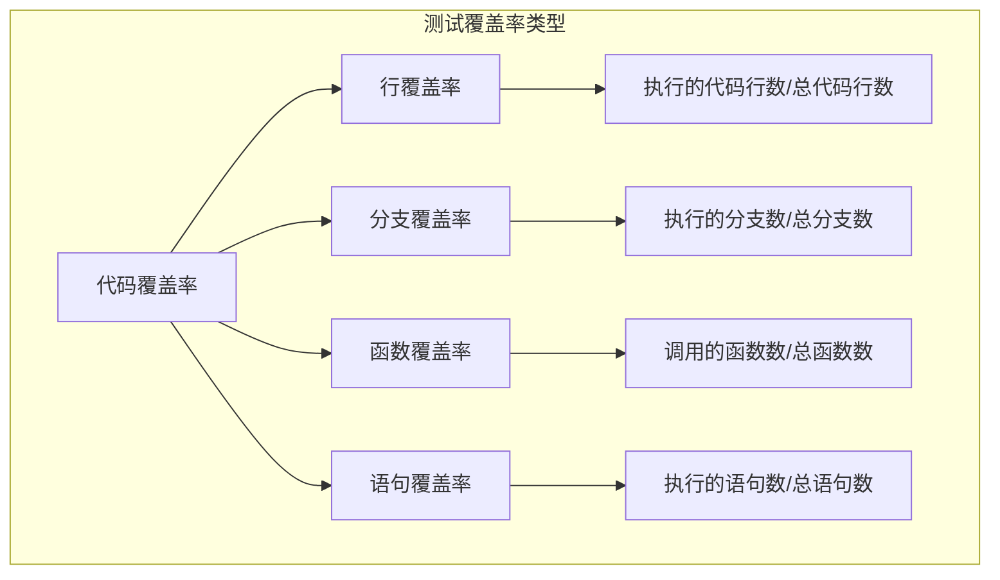
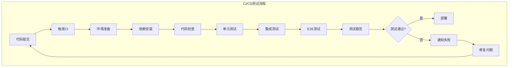
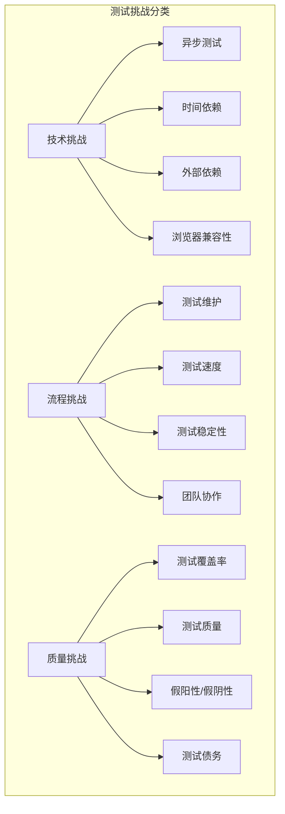

import Tabs from '@theme/Tabs';
import TabItem from '@theme/TabItem';

# 前端测试介绍

前端测试是确保Web应用程序质量、可靠性和用户体验的关键环节。通过系统化的测试策略，可以及早发现和修复问题，提高代码质量和开发效率。

## 测试的重要性

### 质量保证
- **功能验证**：确保应用按预期工作
- **回归测试**：防止新功能破坏现有功能
- **用户体验**：保证界面和交互的一致性

### 开发效率
- **快速反馈**：自动化测试提供即时反馈
- **重构安全**：测试为重构提供安全保障
- **文档作用**：测试代码作为活文档

### 团队协作
- **代码审查**：测试帮助理解代码意图
- **持续集成**：自动化测试支持CI/CD流程
- **知识传承**：测试用例记录业务逻辑

## 测试金字塔

### 单元测试（底层）
- **范围**：单个函数、组件或模块
- **速度**：最快，毫秒级
- **成本**：最低
- **工具**：Jest、Mocha、Vitest等

### 集成测试（中层）
- **范围**：多个组件或模块的交互
- **速度**：中等，秒级
- **成本**：中等
- **工具**：Testing Library、Cypress等

### 端到端测试（顶层）
- **范围**：完整用户流程
- **速度**：最慢，分钟级
- **成本**：最高
- **工具**：Cypress、Playwright、Selenium等

## 测试类型

### 功能测试
- **单元测试**：测试单个函数或组件
- **集成测试**：测试组件间交互
- **端到端测试**：测试完整用户流程

### 非功能测试
- **性能测试**：测试应用性能表现
- **可访问性测试**：测试无障碍访问
- **兼容性测试**：测试跨浏览器兼容性
- **安全测试**：测试安全漏洞

## 测试工具生态

### 测试框架
- **Jest**：Facebook开发的测试框架
- **Vitest**：基于Vite的现代测试框架
- **Mocha**：灵活的JavaScript测试框架
- **Jasmine**：行为驱动开发测试框架

### 测试库
- **React Testing Library**：React组件测试
- **Vue Test Utils**：Vue组件测试
- **Testing Library**：通用DOM测试库
- **Enzyme**：React组件测试（已不推荐）

### 端到端测试
- **Cypress**：现代Web应用测试
- **Playwright**：微软开发的测试工具
- **Selenium**：传统WebDriver测试
- **Puppeteer**：Chrome DevTools协议

### 视觉测试
- **Percy**：视觉回归测试
- **BackstopJS**：视觉回归测试
- **Chromatic**：Storybook视觉测试

## 测试最佳实践

### 测试编写原则
- **AAA模式**：Arrange（准备）、Act（执行）、Assert（断言）
- **FIRST原则**：Fast、Independent、Repeatable、Self-validating、Timely
- **单一职责**：每个测试只测试一个功能点
- **可读性**：测试代码应该清晰易懂

### 测试覆盖率
- **行覆盖率**：代码执行行数比例
- **分支覆盖率**：条件分支执行比例
- **函数覆盖率**：被调用函数的比例
- **语句覆盖率**：被执行语句的比例

### 测试策略
- **测试驱动开发（TDD）**：先写测试，再写实现
- **行为驱动开发（BDD）**：基于用户行为编写测试
- **持续测试**：在CI/CD流程中集成自动化测试

## 测试实践示例

### 单元测试示例
```javascript
// utils.js
export function add(a, b) {
  return a + b;
}

export function formatCurrency(amount) {
  return new Intl.NumberFormat('zh-CN', {
    style: 'currency',
    currency: 'CNY'
  }).format(amount);
}

// utils.test.js
import { add, formatCurrency } from './utils';

describe('工具函数测试', () => {
  describe('add函数', () => {
    test('应该正确计算两个正数的和', () => {
      expect(add(2, 3)).toBe(5);
    });

    test('应该正确处理负数', () => {
      expect(add(-1, 1)).toBe(0);
    });

    test('应该正确处理小数', () => {
      expect(add(0.1, 0.2)).toBeCloseTo(0.3);
    });
  });

  describe('formatCurrency函数', () => {
    test('应该正确格式化货币', () => {
      expect(formatCurrency(1234.56)).toBe('¥1,234.56');
    });

    test('应该处理零值', () => {
      expect(formatCurrency(0)).toBe('¥0.00');
    });
  });
});
```

### React组件测试示例
```javascript
// Button.jsx
import React from 'react';

export function Button({ children, onClick, disabled = false, variant = 'primary' }) {
  return (
    <button
      className={`btn btn--${variant}`}
      onClick={onClick}
      disabled={disabled}
    >
      {children}
    </button>
  );
}

// Button.test.jsx
import React from 'react';
import { render, screen, fireEvent } from '@testing-library/react';
import { Button } from './Button';

describe('Button组件', () => {
  test('应该渲染按钮文本', () => {
    render(<Button>点击我</Button>);
    expect(screen.getByText('点击我')).toBeInTheDocument();
  });

  test('应该响应点击事件', () => {
    const handleClick = jest.fn();
    render(<Button onClick={handleClick}>点击我</Button>);
    
    fireEvent.click(screen.getByText('点击我'));
    expect(handleClick).toHaveBeenCalledTimes(1);
  });

  test('禁用状态下不应响应点击', () => {
    const handleClick = jest.fn();
    render(<Button onClick={handleClick} disabled>点击我</Button>);
    
    fireEvent.click(screen.getByText('点击我'));
    expect(handleClick).not.toHaveBeenCalled();
  });

  test('应该应用正确的CSS类', () => {
    render(<Button variant="secondary">按钮</Button>);
    expect(screen.getByText('按钮')).toHaveClass('btn--secondary');
  });
});
```

### 集成测试示例
```javascript
// TodoApp.test.jsx
import React from 'react';
import { render, screen, fireEvent, waitFor } from '@testing-library/react';
import userEvent from '@testing-library/user-event';
import { TodoApp } from './TodoApp';

describe('TodoApp集成测试', () => {
  test('完整的添加和删除待办事项流程', async () => {
    const user = userEvent.setup();
    render(<TodoApp />);

    // 添加新的待办事项
    const input = screen.getByPlaceholderText('输入待办事项...');
    const addButton = screen.getByText('添加');

    await user.type(input, '学习React测试');
    await user.click(addButton);

    // 验证待办事项已添加
    expect(screen.getByText('学习React测试')).toBeInTheDocument();
    expect(input).toHaveValue('');

    // 标记为完成
    const checkbox = screen.getByRole('checkbox');
    await user.click(checkbox);

    // 验证状态变化
    expect(checkbox).toBeChecked();
    expect(screen.getByText('学习React测试')).toHaveClass('completed');

    // 删除待办事项
    const deleteButton = screen.getByText('删除');
    await user.click(deleteButton);

    // 验证待办事项已删除
    expect(screen.queryByText('学习React测试')).not.toBeInTheDocument();
  });
});
```

## 测试配置

### Jest配置示例
```javascript
// jest.config.js
module.exports = {
  testEnvironment: 'jsdom',
  setupFilesAfterEnv: ['<rootDir>/src/setupTests.js'],
  moduleNameMapping: {
    '\\.(css|less|scss|sass)$': 'identity-obj-proxy',
    '\\.(jpg|jpeg|png|gif|eot|otf|webp|svg|ttf|woff|woff2)$': 'jest-transform-stub'
  },
  collectCoverageFrom: [
    'src/**/*.{js,jsx}',
    '!src/index.js',
    '!src/reportWebVitals.js'
  ],
  coverageThreshold: {
    global: {
      branches: 80,
      functions: 80,
      lines: 80,
      statements: 80
    }
  }
};
```

### 测试环境设置
```javascript
// src/setupTests.js
import '@testing-library/jest-dom';

// Mock全局对象
global.fetch = jest.fn();

// Mock localStorage
const localStorageMock = {
  getItem: jest.fn(),
  setItem: jest.fn(),
  removeItem: jest.fn(),
  clear: jest.fn(),
};
global.localStorage = localStorageMock;

// 清理函数
afterEach(() => {
  jest.clearAllMocks();
});
```

## 测试策略建议

### 测试优先级
1. **核心业务逻辑**：优先测试关键功能
2. **用户交互**：测试主要用户流程
3. **边界条件**：测试异常情况和边界值
4. **性能关键路径**：测试性能敏感的代码

### 测试维护
- **定期重构测试代码**：保持测试代码的质量
- **更新测试用例**：随着功能变化更新测试
- **删除过时测试**：移除不再相关的测试用例
- **测试文档化**：为复杂测试添加说明

通过系统化的测试实践，可以显著提高前端应用的质量和可维护性，为用户提供更稳定可靠的产品体验。

<Tabs>
<TabItem value="coverage-metrics" label="覆盖率指标">

### 测试覆盖率详解



#### 覆盖率指标说明

| 覆盖率类型 | 计算方式 | 目标值 | 重要性 | 注意事项 |
|-----------|----------|--------|--------|----------|
| **行覆盖率** | 执行行数/总行数 | >80% | 基础指标 | 可能遗漏逻辑分支 |
| **分支覆盖率** | 执行分支/总分支 | >85% | 重要指标 | 确保所有条件都被测试 |
| **函数覆盖率** | 调用函数/总函数 | >90% | 基础指标 | 不代表函数内部逻辑完整性 |
| **语句覆盖率** | 执行语句/总语句 | >85% | 详细指标 | 最细粒度的覆盖率统计 |

```javascript title="覆盖率监控实现"
// 覆盖率配置示例
module.exports = {
  collectCoverageFrom: [
    'src/**/*.{js,jsx,ts,tsx}',
    '!src/**/*.d.ts',
    '!src/**/*.stories.{js,jsx,ts,tsx}',
    '!src/index.tsx',
    '!src/reportWebVitals.ts'
  ],
  
  coverageThreshold: {
    global: {
      branches: 80,
      functions: 80,
      lines: 80,
      statements: 80
    },
    // 核心模块要求更高覆盖率
    './src/utils/': {
      branches: 95,
      functions: 95,
      lines: 95,
      statements: 95
    },
    // 组件覆盖率要求
    './src/components/': {
      branches: 85,
      functions: 90,
      lines: 85,
      statements: 85
    }
  },
  
  coverageReporters: [
    'text',           // 控制台输出
    'text-summary',   // 简要摘要
    'html',          // HTML报告
    'lcov',          // LCOV格式
    'json-summary'   // JSON摘要
  ]
};

// 自定义覆盖率报告
class CoverageReporter {
  constructor(options = {}) {
    this.threshold = options.threshold || 80;
    this.outputPath = options.outputPath || './coverage';
  }
  
  generateReport(coverageData) {
    const report = {
      timestamp: new Date().toISOString(),
      summary: this.calculateSummary(coverageData),
      details: this.analyzeDetails(coverageData),
      recommendations: this.generateRecommendations(coverageData)
    };
    
    return report;
  }
  
  calculateSummary(data) {
    return {
      lines: {
        total: data.numTotalStatements,
        covered: data.numCoveredStatements,
        percentage: (data.numCoveredStatements / data.numTotalStatements * 100).toFixed(2)
      },
      branches: {
        total: data.numTotalBranches,
        covered: data.numCoveredBranches,
        percentage: (data.numCoveredBranches / data.numTotalBranches * 100).toFixed(2)
      },
      functions: {
        total: data.numTotalFunctions,
        covered: data.numCoveredFunctions,
        percentage: (data.numCoveredFunctions / data.numTotalFunctions * 100).toFixed(2)
      }
    };
  }
  
  analyzeDetails(data) {
    const uncoveredFiles = [];
    const lowCoverageFiles = [];
    
    Object.entries(data.coverageMap).forEach(([filePath, fileData]) => {
      const coverage = this.calculateFileCoverage(fileData);
      
      if (coverage.lines.percentage === 0) {
        uncoveredFiles.push(filePath);
      } else if (coverage.lines.percentage < this.threshold) {
        lowCoverageFiles.push({
          file: filePath,
          coverage: coverage.lines.percentage
        });
      }
    });
    
    return {
      uncoveredFiles,
      lowCoverageFiles: lowCoverageFiles.sort((a, b) => a.coverage - b.coverage)
    };
  }
  
  generateRecommendations(data) {
    const recommendations = [];
    const summary = this.calculateSummary(data);
    
    if (summary.branches.percentage < 80) {
      recommendations.push({
        type: 'branch_coverage',
        message: '分支覆盖率偏低，建议增加条件分支测试',
        priority: 'high'
      });
    }
    
    if (summary.functions.percentage < 90) {
      recommendations.push({
        type: 'function_coverage',
        message: '函数覆盖率偏低，建议为未测试函数添加测试用例',
        priority: 'medium'
      });
    }
    
    return recommendations;
  }
}
```

</TabItem>
<TabItem value="test-data" label="测试数据管理">

### 测试数据管理策略

```javascript title="测试数据工厂模式"
// 测试数据工厂
class TestDataFactory {
  static createUser(overrides = {}) {
    return {
      id: Math.floor(Math.random() * 1000),
      name: 'Test User',
      email: 'test@example.com',
      age: 25,
      role: 'user',
      createdAt: new Date().toISOString(),
      ...overrides
    };
  }
  
  static createUserList(count = 3, overrides = {}) {
    return Array.from({ length: count }, (_, index) => 
      this.createUser({
        id: index + 1,
        name: `User ${index + 1}`,
        email: `user${index + 1}@example.com`,
        ...overrides
      })
    );
  }
  
  static createProduct(overrides = {}) {
    return {
      id: Math.floor(Math.random() * 1000),
      name: 'Test Product',
      price: 99.99,
      category: 'electronics',
      inStock: true,
      description: 'A test product for testing purposes',
      ...overrides
    };
  }
  
  static createOrder(overrides = {}) {
    return {
      id: Math.floor(Math.random() * 1000),
      userId: 1,
      items: [this.createProduct()],
      total: 99.99,
      status: 'pending',
      createdAt: new Date().toISOString(),
      ...overrides
    };
  }
}

// 测试数据构建器模式
class UserBuilder {
  constructor() {
    this.user = {
      id: 1,
      name: 'Test User',
      email: 'test@example.com',
      age: 25,
      role: 'user'
    };
  }
  
  withId(id) {
    this.user.id = id;
    return this;
  }
  
  withName(name) {
    this.user.name = name;
    return this;
  }
  
  withEmail(email) {
    this.user.email = email;
    return this;
  }
  
  withAge(age) {
    this.user.age = age;
    return this;
  }
  
  withRole(role) {
    this.user.role = role;
    return this;
  }
  
  asAdmin() {
    this.user.role = 'admin';
    return this;
  }
  
  asGuest() {
    this.user.role = 'guest';
    return this;
  }
  
  build() {
    return { ...this.user };
  }
}

// 使用示例
describe('User Service', () => {
  it('should handle admin users', () => {
    const adminUser = new UserBuilder()
      .withName('Admin User')
      .withEmail('admin@example.com')
      .asAdmin()
      .build();
    
    expect(userService.canDeleteUser(adminUser)).toBe(true);
  });
  
  it('should handle multiple users', () => {
    const users = TestDataFactory.createUserList(5);
    expect(users).toHaveLength(5);
    expect(users[0].name).toBe('User 1');
  });
});

// 测试数据清理
class TestDataCleaner {
  constructor() {
    this.createdData = [];
  }
  
  track(data) {
    this.createdData.push(data);
    return data;
  }
  
  cleanup() {
    // 清理所有创建的测试数据
    this.createdData.forEach(data => {
      if (data.cleanup && typeof data.cleanup === 'function') {
        data.cleanup();
      }
    });
    this.createdData = [];
  }
}

// 全局测试数据管理
const testDataCleaner = new TestDataCleaner();

beforeEach(() => {
  // 每个测试前清理数据
  testDataCleaner.cleanup();
});

afterAll(() => {
  // 所有测试完成后清理
  testDataCleaner.cleanup();
});
```

</TabItem>
<TabItem value="mock-strategies" label="Mock策略">

### Mock和Stub策略

```javascript title="Mock策略实现"
// API Mock策略
class APIMocker {
  constructor() {
    this.mocks = new Map();
    this.originalFetch = global.fetch;
  }
  
  mockEndpoint(url, response, options = {}) {
    const { method = 'GET', status = 200, delay = 0 } = options;
    
    this.mocks.set(`${method}:${url}`, {
      response,
      status,
      delay
    });
  }
  
  install() {
    global.fetch = jest.fn().mockImplementation(async (url, options = {}) => {
      const method = options.method || 'GET';
      const key = `${method}:${url}`;
      
      if (this.mocks.has(key)) {
        const mock = this.mocks.get(key);
        
        // 模拟网络延迟
        if (mock.delay > 0) {
          await new Promise(resolve => setTimeout(resolve, mock.delay));
        }
        
        return Promise.resolve({
          ok: mock.status >= 200 && mock.status < 300,
          status: mock.status,
          json: async () => mock.response,
          text: async () => JSON.stringify(mock.response)
        });
      }
      
      // 如果没有mock，返回404
      return Promise.resolve({
        ok: false,
        status: 404,
        json: async () => ({ error: 'Not found' })
      });
    });
  }
  
  uninstall() {
    global.fetch = this.originalFetch;
    this.mocks.clear();
  }
  
  reset() {
    this.mocks.clear();
  }
}

// 使用示例
describe('User API', () => {
  const apiMocker = new APIMocker();
  
  beforeAll(() => {
    apiMocker.install();
  });
  
  afterAll(() => {
    apiMocker.uninstall();
  });
  
  beforeEach(() => {
    apiMocker.reset();
  });
  
  it('should fetch user successfully', async () => {
    const mockUser = { id: 1, name: 'John Doe' };
    apiMocker.mockEndpoint('/api/users/1', mockUser);
    
    const user = await fetchUser(1);
    expect(user).toEqual(mockUser);
  });
  
  it('should handle API errors', async () => {
    apiMocker.mockEndpoint('/api/users/999', 
      { error: 'User not found' }, 
      { status: 404 }
    );
    
    await expect(fetchUser(999)).rejects.toThrow('User not found');
  });
  
  it('should handle network delays', async () => {
    const mockUser = { id: 1, name: 'John Doe' };
    apiMocker.mockEndpoint('/api/users/1', mockUser, { delay: 1000 });
    
    const startTime = Date.now();
    await fetchUser(1);
    const endTime = Date.now();
    
    expect(endTime - startTime).toBeGreaterThanOrEqual(1000);
  });
});

// 模块Mock工厂
class ModuleMocker {
  static createMockModule(modulePath, mockImplementation = {}) {
    return jest.doMock(modulePath, () => ({
      __esModule: true,
      ...mockImplementation
    }));
  }
  
  static createPartialMock(modulePath, mockedMethods = {}) {
    return jest.doMock(modulePath, () => ({
      ...jest.requireActual(modulePath),
      ...mockedMethods
    }));
  }
  
  static createSpyModule(modulePath, spiedMethods = []) {
    const actualModule = jest.requireActual(modulePath);
    const spies = {};
    
    spiedMethods.forEach(method => {
      spies[method] = jest.spyOn(actualModule, method);
    });
    
    return spies;
  }
}

// 时间Mock
class TimeMocker {
  constructor() {
    this.originalDate = Date;
    this.originalSetTimeout = setTimeout;
    this.originalSetInterval = setInterval;
  }
  
  mockDate(fixedDate) {
    const MockDate = class extends Date {
      constructor(...args) {
        if (args.length === 0) {
          super(fixedDate);
        } else {
          super(...args);
        }
      }
      
      static now() {
        return new Date(fixedDate).getTime();
      }
    };
    
    global.Date = MockDate;
  }
  
  mockTimers() {
    jest.useFakeTimers();
  }
  
  restoreTimers() {
    jest.useRealTimers();
  }
  
  restoreDate() {
    global.Date = this.originalDate;
  }
  
  advanceTime(ms) {
    jest.advanceTimersByTime(ms);
  }
  
  runAllTimers() {
    jest.runAllTimers();
  }
}

// 使用示例
describe('Time-dependent functionality', () => {
  const timeMocker = new TimeMocker();
  
  beforeEach(() => {
    timeMocker.mockTimers();
    timeMocker.mockDate('2023-01-01T00:00:00.000Z');
  });
  
  afterEach(() => {
    timeMocker.restoreTimers();
    timeMocker.restoreDate();
  });
  
  it('should handle scheduled tasks', () => {
    const callback = jest.fn();
    
    setTimeout(callback, 1000);
    expect(callback).not.toHaveBeenCalled();
    
    timeMocker.advanceTime(1000);
    expect(callback).toHaveBeenCalledTimes(1);
  });
  
  it('should work with fixed dates', () => {
    const now = new Date();
    expect(now.toISOString()).toBe('2023-01-01T00:00:00.000Z');
  });
});
```

</TabItem>
</Tabs>

## 持续集成中的测试

### CI/CD集成最佳实践



<Tabs>
<TabItem value="github-actions" label="GitHub Actions">

### GitHub Actions测试配置

```yaml title=".github/workflows/test.yml"
name: Test Suite

on:
  push:
    branches: [ main, develop ]
  pull_request:
    branches: [ main ]

jobs:
  test:
    runs-on: ubuntu-latest
    
    strategy:
      matrix:
        node-version: [16.x, 18.x, 20.x]
    
    steps:
    - name: Checkout code
      uses: actions/checkout@v4
    
    - name: Setup Node.js ${{ matrix.node-version }}
      uses: actions/setup-node@v4
      with:
        node-version: ${{ matrix.node-version }}
        cache: 'npm'
    
    - name: Install dependencies
      run: npm ci
    
    - name: Run linting
      run: npm run lint
    
    - name: Run type checking
      run: npm run type-check
    
    - name: Run unit tests
      run: npm run test:coverage
    
    - name: Run integration tests
      run: npm run test:integration
    
    - name: Upload coverage reports
      uses: codecov/codecov-action@v3
      with:
        file: ./coverage/lcov.info
        flags: unittests
        name: codecov-umbrella
    
    - name: Comment PR with coverage
      if: github.event_name == 'pull_request'
      uses: romeovs/lcov-reporter-action@v0.3.1
      with:
        github-token: ${{ secrets.GITHUB_TOKEN }}
        lcov-file: ./coverage/lcov.info
    
    - name: Archive test results
      if: always()
      uses: actions/upload-artifact@v3
      with:
        name: test-results-${{ matrix.node-version }}
        path: |
          coverage/
          test-results.xml
          
  e2e:
    runs-on: ubuntu-latest
    needs: test
    
    steps:
    - name: Checkout code
      uses: actions/checkout@v4
    
    - name: Setup Node.js
      uses: actions/setup-node@v4
      with:
        node-version: '18.x'
        cache: 'npm'
    
    - name: Install dependencies
      run: npm ci
    
    - name: Build application
      run: npm run build
    
    - name: Start application
      run: npm start &
      
    - name: Wait for application
      run: npx wait-on http://localhost:3000
    
    - name: Run E2E tests
      run: npm run test:e2e
    
    - name: Upload E2E artifacts
      if: failure()
      uses: actions/upload-artifact@v3
      with:
        name: e2e-artifacts
        path: |
          cypress/screenshots/
          cypress/videos/
```

</TabItem>
<TabItem value="jenkins" label="Jenkins">

### Jenkins测试流水线

```groovy title="Jenkinsfile"
pipeline {
    agent any
    
    environment {
        NODE_VERSION = '18'
        CI = 'true'
    }
    
    stages {
        stage('Checkout') {
            steps {
                checkout scm
            }
        }
        
        stage('Setup') {
            steps {
                script {
                    // 安装Node.js
                    sh "nvm use ${NODE_VERSION}"
                    sh 'npm ci'
                }
            }
        }
        
        stage('Code Quality') {
            parallel {
                stage('Lint') {
                    steps {
                        sh 'npm run lint'
                    }
                    post {
                        always {
                            publishHTML([
                                allowMissing: false,
                                alwaysLinkToLastBuild: true,
                                keepAll: true,
                                reportDir: 'lint-results',
                                reportFiles: 'index.html',
                                reportName: 'ESLint Report'
                            ])
                        }
                    }
                }
                
                stage('Type Check') {
                    steps {
                        sh 'npm run type-check'
                    }
                }
            }
        }
        
        stage('Test') {
            parallel {
                stage('Unit Tests') {
                    steps {
                        sh 'npm run test:coverage'
                    }
                    post {
                        always {
                            // 发布测试结果
                            publishTestResults testResultsPattern: 'test-results.xml'
                            
                            // 发布覆盖率报告
                            publishHTML([
                                allowMissing: false,
                                alwaysLinkToLastBuild: true,
                                keepAll: true,
                                reportDir: 'coverage/lcov-report',
                                reportFiles: 'index.html',
                                reportName: 'Coverage Report'
                            ])
                            
                            // 覆盖率检查
                            script {
                                def coverage = readJSON file: 'coverage/coverage-summary.json'
                                def linesCoverage = coverage.total.lines.pct
                                
                                if (linesCoverage < 80) {
                                    error "Coverage ${linesCoverage}% is below threshold 80%"
                                }
                            }
                        }
                    }
                }
                
                stage('Integration Tests') {
                    steps {
                        sh 'npm run test:integration'
                    }
                }
            }
        }
        
        stage('E2E Tests') {
            when {
                anyOf {
                    branch 'main'
                    branch 'develop'
                }
            }
            steps {
                sh 'npm run build'
                sh 'npm start &'
                sh 'npx wait-on http://localhost:3000'
                sh 'npm run test:e2e'
            }
            post {
                always {
                    archiveArtifacts artifacts: 'cypress/screenshots/**,cypress/videos/**', allowEmptyArchive: true
                }
            }
        }
    }
    
    post {
        always {
            // 清理工作空间
            cleanWs()
        }
        
        failure {
            // 发送失败通知
            emailext (
                subject: "Build Failed: ${env.JOB_NAME} - ${env.BUILD_NUMBER}",
                body: "Build failed. Check console output at ${env.BUILD_URL}",
                to: "${env.CHANGE_AUTHOR_EMAIL}"
            )
        }
        
        success {
            // 发送成功通知
            script {
                if (env.BRANCH_NAME == 'main') {
                    slackSend(
                        channel: '#deployments',
                        color: 'good',
                        message: "✅ Tests passed for ${env.JOB_NAME} - ${env.BUILD_NUMBER}"
                    )
                }
            }
        }
    }
}
```

</TabItem>
<TabItem value="test-strategies" label="测试策略">

### 测试策略配置

```javascript title="测试策略配置"
// 测试环境配置
const testConfig = {
  // 快速反馈策略
  fastFeedback: {
    // 优先运行的测试
    priority: [
      'src/**/*.test.js',
      'src/utils/**/*.test.js',
      'src/components/**/*.test.js'
    ],
    // 并行执行配置
    parallel: {
      workers: '50%',
      maxConcurrency: 4
    },
    // 超时配置
    timeout: 5000
  },
  
  // 完整测试策略
  comprehensive: {
    include: [
      'src/**/*.test.js',
      'src/**/*.spec.js',
      'integration/**/*.test.js',
      'e2e/**/*.test.js'
    ],
    timeout: 30000,
    retries: 2
  },
  
  // 性能测试策略
  performance: {
    thresholds: {
      unitTest: 100,      // 单元测试最大执行时间(ms)
      integration: 5000,  // 集成测试最大执行时间(ms)
      e2e: 30000         // E2E测试最大执行时间(ms)
    },
    monitoring: {
      slowTests: true,
      memoryUsage: true,
      cpuUsage: true
    }
  }
};

// 测试报告配置
const reportConfig = {
  reporters: [
    'default',
    ['jest-html-reporter', {
      pageTitle: 'Test Report',
      outputPath: './test-report.html',
      includeFailureMsg: true,
      includeSuiteFailure: true
    }],
    ['jest-junit', {
      outputDirectory: './test-results',
      outputName: 'junit.xml',
      suiteName: 'Jest Tests'
    }],
    ['jest-sonar-reporter', {
      outputDirectory: './test-results',
      outputName: 'sonar-report.xml'
    }]
  ],
  
  // 覆盖率报告
  coverageReporters: [
    'text',
    'text-summary',
    'html',
    'lcov',
    'cobertura'
  ],
  
  // 通知配置
  notifications: {
    slack: {
      webhook: process.env.SLACK_WEBHOOK,
      channel: '#testing',
      onFailure: true,
      onSuccess: false
    },
    email: {
      recipients: ['team@example.com'],
      onFailure: true,
      onCoverageThreshold: true
    }
  }
};

// 测试数据管理
const testDataConfig = {
  // 测试数据库配置
  database: {
    host: process.env.TEST_DB_HOST || 'localhost',
    port: process.env.TEST_DB_PORT || 5432,
    database: 'test_db',
    resetBetweenTests: true,
    seedData: './test/fixtures/seed.sql'
  },
  
  // Mock服务配置
  mockServices: {
    api: {
      baseUrl: 'http://localhost:3001',
      endpoints: './test/mocks/api-mocks.json'
    },
    external: {
      payment: 'mock',
      email: 'mock',
      sms: 'mock'
    }
  },
  
  // 测试文件配置
  fixtures: {
    users: './test/fixtures/users.json',
    products: './test/fixtures/products.json',
    orders: './test/fixtures/orders.json'
  }
};

module.exports = {
  testConfig,
  reportConfig,
  testDataConfig
};
```

</TabItem>
</Tabs>

## 测试挑战与解决方案

### 常见测试挑战



<Tabs>
<TabItem value="async-testing" label="异步测试">

### 异步测试解决方案

```javascript title="异步测试最佳实践"
// Promise测试
describe('Async Operations', () => {
  // 1. 使用async/await
  it('should handle async operations with async/await', async () => {
    const result = await fetchUserData(1);
    expect(result).toEqual({ id: 1, name: 'John' });
  });
  
  // 2. 使用Promise.resolves/rejects
  it('should handle promise resolution', () => {
    return expect(fetchUserData(1)).resolves.toEqual({ id: 1, name: 'John' });
  });
  
  it('should handle promise rejection', () => {
    return expect(fetchUserData(-1)).rejects.toThrow('Invalid user ID');
  });
  
  // 3. 使用waitFor处理异步DOM更新
  it('should wait for DOM updates', async () => {
    render(<AsyncComponent />);
    
    await waitFor(() => {
      expect(screen.getByText('Loaded')).toBeInTheDocument();
    });
  });
  
  // 4. 处理复杂异步流程
  it('should handle complex async flows', async () => {
    const mockApi = jest.fn()
      .mockResolvedValueOnce({ step: 1 })
      .mockResolvedValueOnce({ step: 2 })
      .mockResolvedValueOnce({ step: 3, complete: true });
    
    const result = await processMultiStepOperation(mockApi);
    
    expect(mockApi).toHaveBeenCalledTimes(3);
    expect(result.complete).toBe(true);
  });
});

// 异步测试工具类
class AsyncTestHelper {
  static async waitForCondition(condition, timeout = 5000, interval = 100) {
    const startTime = Date.now();
    
    while (Date.now() - startTime < timeout) {
      if (await condition()) {
        return true;
      }
      await this.sleep(interval);
    }
    
    throw new Error(`Condition not met within ${timeout}ms`);
  }
  
  static sleep(ms) {
    return new Promise(resolve => setTimeout(resolve, ms));
  }
  
  static async waitForElement(selector, timeout = 5000) {
    return this.waitForCondition(
      () => document.querySelector(selector) !== null,
      timeout
    );
  }
  
  static async waitForApiCall(mockFn, expectedCalls = 1, timeout = 5000) {
    return this.waitForCondition(
      () => mockFn.mock.calls.length >= expectedCalls,
      timeout
    );
  }
}

// 使用示例
describe('Complex Async Component', () => {
  it('should handle multi-step loading', async () => {
    const mockFetch = jest.fn()
      .mockResolvedValueOnce({ ok: true, json: () => ({ loading: true }) })
      .mockResolvedValueOnce({ ok: true, json: () => ({ data: 'result' }) });
    
    global.fetch = mockFetch;
    
    render(<ComplexAsyncComponent />);
    
    // 等待第一次API调用
    await AsyncTestHelper.waitForApiCall(mockFetch, 1);
    expect(screen.getByText('Loading...')).toBeInTheDocument();
    
    // 等待第二次API调用
    await AsyncTestHelper.waitForApiCall(mockFetch, 2);
    
    // 等待最终结果
    await waitFor(() => {
      expect(screen.getByText('result')).toBeInTheDocument();
    });
  });
});
```

</TabItem>
<TabItem value="time-testing" label="时间测试">

### 时间相关测试

```javascript title="时间测试解决方案"
// 时间Mock工具
class TimeTestHelper {
  constructor() {
    this.originalDate = Date;
    this.originalSetTimeout = global.setTimeout;
    this.originalSetInterval = global.setInterval;
    this.originalClearTimeout = global.clearTimeout;
    this.originalClearInterval = global.clearInterval;
  }
  
  // 固定时间
  freezeTime(timestamp) {
    const frozenTime = new Date(timestamp);
    
    global.Date = class extends Date {
      constructor(...args) {
        if (args.length === 0) {
          super(frozenTime);
        } else {
          super(...args);
        }
      }
      
      static now() {
        return frozenTime.getTime();
      }
    };
  }
  
  // 恢复时间
  restoreTime() {
    global.Date = this.originalDate;
  }
  
  // Mock定时器
  mockTimers() {
    jest.useFakeTimers();
  }
  
  // 恢复定时器
  restoreTimers() {
    jest.useRealTimers();
  }
  
  // 快进时间
  advanceTime(ms) {
    jest.advanceTimersByTime(ms);
  }
  
  // 执行所有定时器
  runAllTimers() {
    jest.runAllTimers();
  }
  
  // 执行下一个定时器
  runOnlyPendingTimers() {
    jest.runOnlyPendingTimers();
  }
}

// 使用示例
describe('Time-dependent functionality', () => {
  const timeHelper = new TimeTestHelper();
  
  beforeEach(() => {
    timeHelper.mockTimers();
    timeHelper.freezeTime('2023-01-01T00:00:00.000Z');
  });
  
  afterEach(() => {
    timeHelper.restoreTimers();
    timeHelper.restoreTime();
  });
  
  it('should handle countdown timer', () => {
    const onComplete = jest.fn();
    const timer = new CountdownTimer(5000, onComplete);
    
    timer.start();
    
    // 快进4秒
    timeHelper.advanceTime(4000);
    expect(onComplete).not.toHaveBeenCalled();
    
    // 再快进1秒
    timeHelper.advanceTime(1000);
    expect(onComplete).toHaveBeenCalledTimes(1);
  });
  
  it('should handle date formatting', () => {
    const formatter = new DateFormatter();
    const result = formatter.formatNow();
    
    expect(result).toBe('2023-01-01 00:00:00');
  });
  
  it('should handle periodic tasks', () => {
    const callback = jest.fn();
    const interval = setInterval(callback, 1000);
    
    // 快进3秒
    timeHelper.advanceTime(3000);
    expect(callback).toHaveBeenCalledTimes(3);
    
    clearInterval(interval);
  });
});

// 时区测试
describe('Timezone handling', () => {
  const originalTimezone = process.env.TZ;
  
  afterEach(() => {
    process.env.TZ = originalTimezone;
  });
  
  it('should handle different timezones', () => {
    // 设置时区
    process.env.TZ = 'America/New_York';
    
    const date = new Date('2023-01-01T12:00:00Z');
    const formatter = new DateFormatter();
    
    expect(formatter.formatLocal(date)).toBe('2023-01-01 07:00:00 EST');
  });
  
  it('should handle UTC', () => {
    process.env.TZ = 'UTC';
    
    const date = new Date('2023-01-01T12:00:00Z');
    const formatter = new DateFormatter();
    
    expect(formatter.formatLocal(date)).toBe('2023-01-01 12:00:00 UTC');
  });
});
```

</TabItem>
<TabItem value="external-deps" label="外部依赖">

### 外部依赖测试

```javascript title="外部依赖Mock策略"
// API依赖Mock
class ExternalServiceMocker {
  constructor() {
    this.mocks = new Map();
    this.interceptors = [];
  }
  
  // Mock HTTP请求
  mockHttpService(baseUrl) {
    const axios = require('axios');
    const MockAdapter = require('axios-mock-adapter');
    
    const mock = new MockAdapter(axios);
    this.mocks.set('http', mock);
    
    return {
      onGet: (url, response, status = 200) => {
        mock.onGet(`${baseUrl}${url}`).reply(status, response);
      },
      onPost: (url, response, status = 201) => {
        mock.onPost(`${baseUrl}${url}`).reply(status, response);
      },
      onPut: (url, response, status = 200) => {
        mock.onPut(`${baseUrl}${url}`).reply(status, response);
      },
      onDelete: (url, status = 204) => {
        mock.onDelete(`${baseUrl}${url}`).reply(status);
      },
      reset: () => mock.reset(),
      restore: () => mock.restore()
    };
  }
  
  // Mock WebSocket
  mockWebSocket() {
    const WS = require('jest-websocket-mock');
    const server = new WS('ws://localhost:8080');
    
    this.mocks.set('websocket', server);
    
    return {
      server,
      waitForConnection: () => server.connected,
      send: (message) => server.send(message),
      close: () => server.close(),
      cleanup: () => WS.clean()
    };
  }
  
  // Mock localStorage
  mockLocalStorage() {
    const localStorageMock = {
      getItem: jest.fn(),
      setItem: jest.fn(),
      removeItem: jest.fn(),
      clear: jest.fn(),
      length: 0,
      key: jest.fn()
    };
    
    Object.defineProperty(window, 'localStorage', {
      value: localStorageMock,
      writable: true
    });
    
    this.mocks.set('localStorage', localStorageMock);
    return localStorageMock;
  }
  
  // Mock 地理位置API
  mockGeolocation() {
    const mockGeolocation = {
      getCurrentPosition: jest.fn(),
      watchPosition: jest.fn(),
      clearWatch: jest.fn()
    };
    
    Object.defineProperty(navigator, 'geolocation', {
      value: mockGeolocation,
      writable: true
    });
    
    this.mocks.set('geolocation', mockGeolocation);
    return mockGeolocation;
  }
  
  // Mock 文件API
  mockFileAPI() {
    const mockFile = (name, content, type = 'text/plain') => {
      return new File([content], name, { type });
    };
    
    const mockFileReader = {
      readAsText: jest.fn(),
      readAsDataURL: jest.fn(),
      result: null,
      onload: null,
      onerror: null
    };
    
    global.File = jest.fn().mockImplementation(mockFile);
    global.FileReader = jest.fn().mockImplementation(() => mockFileReader);
    
    this.mocks.set('file', { File: global.File, FileReader: mockFileReader });
    
    return { mockFile, mockFileReader };
  }
  
  // 清理所有Mock
  cleanup() {
    this.mocks.forEach((mock, key) => {
      switch (key) {
        case 'http':
          mock.restore();
          break;
        case 'websocket':
          mock.cleanup();
          break;
        default:
          // 其他清理逻辑
          break;
      }
    });
    this.mocks.clear();
  }
}

// 使用示例
describe('External Dependencies', () => {
  const serviceMocker = new ExternalServiceMocker();
  
  afterEach(() => {
    serviceMocker.cleanup();
  });
  
  it('should handle API calls', async () => {
    const httpMock = serviceMocker.mockHttpService('https://api.example.com');
    
    httpMock.onGet('/users/1', { id: 1, name: 'John' });
    httpMock.onPost('/users', { id: 2, name: 'Jane' }, 201);
    
    const userService = new UserService('https://api.example.com');
    
    const user = await userService.getUser(1);
    expect(user).toEqual({ id: 1, name: 'John' });
    
    const newUser = await userService.createUser({ name: 'Jane' });
    expect(newUser).toEqual({ id: 2, name: 'Jane' });
  });
  
  it('should handle WebSocket connections', async () => {
    const wsMock = serviceMocker.mockWebSocket();
    
    const client = new WebSocketClient('ws://localhost:8080');
    await wsMock.waitForConnection();
    
    wsMock.send('Hello from server');
    
    expect(client.lastMessage).toBe('Hello from server');
  });
  
  it('should handle localStorage', () => {
    const localStorageMock = serviceMocker.mockLocalStorage();
    
    const storage = new StorageService();
    storage.set('key', 'value');
    
    expect(localStorageMock.setItem).toHaveBeenCalledWith('key', 'value');
  });
  
  it('should handle geolocation', (done) => {
    const geolocationMock = serviceMocker.mockGeolocation();
    
    geolocationMock.getCurrentPosition.mockImplementation((success) => {
      success({
        coords: {
          latitude: 40.7128,
          longitude: -74.0060
        }
      });
    });
    
    const locationService = new LocationService();
    locationService.getCurrentLocation((position) => {
      expect(position.coords.latitude).toBe(40.7128);
      expect(position.coords.longitude).toBe(-74.0060);
      done();
    });
  });
});
```

</TabItem>
</Tabs> 