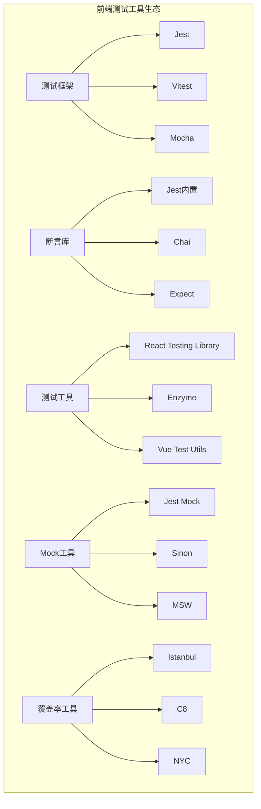

import Tabs from '@theme/Tabs';
import TabItem from '@theme/TabItem';
import CodeBlock from '@theme/CodeBlock';

# 前端单元测试完全指南

单元测试是测试金字塔的基础，专注于测试单个函数、组件或模块的功能。通过系统化的单元测试实践，可以快速验证代码逻辑、提供即时反馈、确保代码质量，并为重构提供安全保障。

:::tip 核心价值
**单元测试 = 快速反馈 + 代码质量 + 重构安全 + 文档价值**
- 🚀 **快速反馈**：毫秒级测试执行，即时发现问题
- 🎯 **代码质量**：强制思考边界条件和异常情况
- 🛡️ **重构安全**：为代码重构提供安全网
- 📚 **文档价值**：测试用例作为代码使用说明
- 🔧 **开发效率**：减少手动测试时间，提高开发速度
- 📊 **覆盖率监控**：量化测试完整性，识别测试盲点
:::

## 1. 测试环境搭建与配置

### 1.1 现代测试工具链

构建高效的测试环境需要选择合适的工具组合，每个工具都有其特定的职责和优势。



#### 测试工具对比

| 工具 | 类型 | 优势 | 劣势 | 适用场景 |
|------|------|------|------|----------|
| **Jest** | 测试框架 | 零配置、功能全面、生态丰富 | 较重、启动慢 | React项目、大型应用 |
| **Vitest** | 测试框架 | 快速、现代、Vite集成 | 生态较新 | Vite项目、现代应用 |
| **React Testing Library** | 测试工具 | 用户行为导向、最佳实践 | 学习曲线 | React组件测试 |
| **MSW** | Mock工具 | 真实网络模拟、开发友好 | 配置复杂 | API测试、集成测试 |

<Tabs>
<TabItem value="jest-setup" label="Jest配置">

### Jest完整配置

```javascript title="jest.config.js - 完整配置示例"
module.exports = {
  // 基础配置
  preset: 'ts-jest',
  testEnvironment: 'jsdom',
  
  // 文件路径配置
  roots: ['<rootDir>/src'],
  testMatch: [
    '<rootDir>/src/**/__tests__/**/*.{js,jsx,ts,tsx}',
    '<rootDir>/src/**/*.(test|spec).{js,jsx,ts,tsx}'
  ],
  
  // 模块解析
  moduleNameMapping: {
    '^@/(.*)$': '<rootDir>/src/$1',
    '^@components/(.*)$': '<rootDir>/src/components/$1',
    '^@utils/(.*)$': '<rootDir>/src/utils/$1',
    '\\.(css|less|scss|sass)$': 'identity-obj-proxy',
    '\\.(jpg|jpeg|png|gif|eot|otf|webp|svg|ttf|woff|woff2)$': 'jest-transform-stub'
  },
  
  // 设置文件
  setupFilesAfterEnv: ['<rootDir>/src/setupTests.ts'],
  
  // 转换配置
  transform: {
    '^.+\\.(js|jsx|ts|tsx)$': 'ts-jest',
    '^.+\\.css$': 'jest-transform-css'
  },
  
  // 忽略转换的模块
  transformIgnorePatterns: [
    'node_modules/(?!(axios|@testing-library)/)'
  ],
  
  // 覆盖率配置
  collectCoverageFrom: [
    'src/**/*.{js,jsx,ts,tsx}',
    '!src/**/*.d.ts',
    '!src/index.tsx',
    '!src/serviceWorker.ts',
    '!src/reportWebVitals.ts',
    '!src/**/*.stories.{js,jsx,ts,tsx}',
    '!src/**/*.test.{js,jsx,ts,tsx}'
  ],
  
  coverageThreshold: {
    global: {
      branches: 80,
      functions: 80,
      lines: 80,
      statements: 80
    },
    './src/components/': {
      branches: 90,
      functions: 90,
      lines: 90,
      statements: 90
    },
    './src/utils/': {
      branches: 95,
      functions: 95,
      lines: 95,
      statements: 95
    }
  },
  
  coverageReporters: ['text', 'lcov', 'html', 'json-summary'],
  
  // 性能配置
  maxWorkers: '50%',
  cache: true,
  cacheDirectory: '<rootDir>/.jest-cache',
  
  // 全局变量
  globals: {
    'ts-jest': {
      tsconfig: 'tsconfig.json',
      isolatedModules: true
    }
  },
  
  // 测试超时
  testTimeout: 10000,
  
  // 清理配置
  clearMocks: true,
  restoreMocks: true,
  
  // 详细输出
  verbose: true,
  
  // 错误处理
  errorOnDeprecated: true
};
```

```typescript title="setupTests.ts - 测试环境设置"
import '@testing-library/jest-dom';
import 'jest-canvas-mock';

// 全局Mock
global.fetch = jest.fn();
global.ResizeObserver = jest.fn().mockImplementation(() => ({
  observe: jest.fn(),
  unobserve: jest.fn(),
  disconnect: jest.fn(),
}));

global.IntersectionObserver = jest.fn().mockImplementation(() => ({
  observe: jest.fn(),
  unobserve: jest.fn(),
  disconnect: jest.fn(),
}));

// Mock localStorage
const localStorageMock = {
  getItem: jest.fn(),
  setItem: jest.fn(),
  removeItem: jest.fn(),
  clear: jest.fn(),
  length: 0,
  key: jest.fn(),
};
global.localStorage = localStorageMock;

// Mock sessionStorage
global.sessionStorage = localStorageMock;

// Mock window.matchMedia
Object.defineProperty(window, 'matchMedia', {
  writable: true,
  value: jest.fn().mockImplementation(query => ({
    matches: false,
    media: query,
    onchange: null,
    addListener: jest.fn(),
    removeListener: jest.fn(),
    addEventListener: jest.fn(),
    removeEventListener: jest.fn(),
    dispatchEvent: jest.fn(),
  })),
});

// Mock console methods for cleaner test output
const originalError = console.error;
beforeAll(() => {
  console.error = (...args: any[]) => {
    if (
      typeof args[0] === 'string' &&
      args[0].includes('Warning: ReactDOM.render is no longer supported')
    ) {
      return;
    }
    originalError.call(console, ...args);
  };
});

afterAll(() => {
  console.error = originalError;
});

// 全局测试工具
global.testUtils = {
  // 等待异步操作完成
  waitForAsync: (ms = 0) => new Promise(resolve => setTimeout(resolve, ms)),
  
  // 创建模拟事件
  createMockEvent: (type: string, properties = {}) => ({
    type,
    preventDefault: jest.fn(),
    stopPropagation: jest.fn(),
    target: { value: '' },
    ...properties
  }),
  
  // 模拟用户输入
  mockUserInput: (element: HTMLElement, value: string) => {
    const event = new Event('input', { bubbles: true });
    Object.defineProperty(event, 'target', {
      writable: false,
      value: { value }
    });
    element.dispatchEvent(event);
  }
};

// 清理函数
afterEach(() => {
  jest.clearAllMocks();
  localStorage.clear();
  sessionStorage.clear();
});
```

</TabItem>
<TabItem value="vitest-setup" label="Vitest配置">

### Vitest现代化配置

```typescript title="vitest.config.ts - Vitest配置"
import { defineConfig } from 'vitest/config';
import react from '@vitejs/plugin-react';
import path from 'path';

export default defineConfig({
  plugins: [react()],
  
  test: {
    // 测试环境
    environment: 'jsdom',
    
    // 全局设置
    globals: true,
    
    // 设置文件
    setupFiles: ['./src/setupTests.ts'],
    
    // 包含的测试文件
    include: [
      'src/**/*.{test,spec}.{js,jsx,ts,tsx}',
      'src/**/__tests__/**/*.{js,jsx,ts,tsx}'
    ],
    
    // 排除的文件
    exclude: [
      'node_modules',
      'dist',
      '.idea',
      '.git',
      '.cache'
    ],
    
    // 覆盖率配置
    coverage: {
      provider: 'v8',
      reporter: ['text', 'json', 'html'],
      include: ['src/**/*.{js,jsx,ts,tsx}'],
      exclude: [
        'src/**/*.d.ts',
        'src/**/*.stories.{js,jsx,ts,tsx}',
        'src/**/*.test.{js,jsx,ts,tsx}',
        'src/main.tsx',
        'src/vite-env.d.ts'
      ],
      thresholds: {
        global: {
          branches: 80,
          functions: 80,
          lines: 80,
          statements: 80
        }
      }
    },
    
    // 性能配置
    pool: 'threads',
    poolOptions: {
      threads: {
        singleThread: false,
        maxThreads: 4,
        minThreads: 1
      }
    },
    
    // 超时配置
    testTimeout: 10000,
    hookTimeout: 10000,
    
    // 监听模式配置
    watch: {
      ignore: ['node_modules/**', 'dist/**']
    },
    
    // 报告器配置
    reporter: ['verbose', 'json', 'html'],
    
    // 并发配置
    sequence: {
      concurrent: true
    }
  },
  
  resolve: {
    alias: {
      '@': path.resolve(__dirname, './src'),
      '@components': path.resolve(__dirname, './src/components'),
      '@utils': path.resolve(__dirname, './src/utils'),
      '@hooks': path.resolve(__dirname, './src/hooks'),
      '@types': path.resolve(__dirname, './src/types')
    }
  }
});
```

</TabItem>
<TabItem value="package-scripts" label="NPM脚本">

### 测试相关NPM脚本

```json title="package.json - 测试脚本配置"
{
  "scripts": {
    "test": "jest",
    "test:watch": "jest --watch",
    "test:coverage": "jest --coverage",
    "test:ci": "jest --coverage --watchAll=false --passWithNoTests",
    "test:debug": "node --inspect-brk node_modules/.bin/jest --runInBand",
    "test:update": "jest --updateSnapshot",
    "test:clear": "jest --clearCache",
    
    // Vitest脚本
    "test:vitest": "vitest",
    "test:vitest:ui": "vitest --ui",
    "test:vitest:coverage": "vitest --coverage",
    "test:vitest:run": "vitest run",
    
    // 测试相关工具
    "lint:test": "eslint 'src/**/*.test.{js,jsx,ts,tsx}'",
    "type-check:test": "tsc --noEmit --project tsconfig.test.json"
  },
  
  "devDependencies": {
    "@testing-library/jest-dom": "^6.1.4",
    "@testing-library/react": "^13.4.0",
    "@testing-library/user-event": "^14.5.1",
    "@types/jest": "^29.5.8",
    "jest": "^29.7.0",
    "jest-environment-jsdom": "^29.7.0",
    "jest-transform-stub": "^2.0.0",
    "ts-jest": "^29.1.1",
    
    // Vitest相关
    "vitest": "^1.0.0",
    "@vitest/ui": "^1.0.0",
    "jsdom": "^23.0.0",
    
    // Mock相关
    "msw": "^2.0.0",
    "jest-canvas-mock": "^2.5.2"
  }
}
```

</TabItem>
</Tabs>

## 2. 工具函数测试实践

### 安装和配置
```bash
# 安装Jest
npm install --save-dev jest

# 安装TypeScript支持
npm install --save-dev @types/jest ts-jest
```

```javascript
// jest.config.js
module.exports = {
  preset: 'ts-jest',
  testEnvironment: 'jsdom',
  setupFilesAfterEnv: ['<rootDir>/src/setupTests.ts'],
  moduleNameMapping: {
    '^@/(.*)$': '<rootDir>/src/$1'
  }
};
```

### 基本测试结构
```javascript
// math.test.js
function add(a, b) {
  return a + b;
}

function multiply(a, b) {
  return a * b;
}

describe('Math functions', () => {
  describe('add', () => {
    it('should add two positive numbers', () => {
      expect(add(2, 3)).toBe(5);
    });

    it('should handle negative numbers', () => {
      expect(add(-1, 1)).toBe(0);
    });

    it('should handle zero', () => {
      expect(add(0, 5)).toBe(5);
    });
  });

  describe('multiply', () => {
    it('should multiply two numbers', () => {
      expect(multiply(2, 3)).toBe(6);
    });
  });
});
```

## 测试工具函数

### 工具函数测试
```javascript
// utils.js
export function formatDate(date) {
  return date.toISOString().split('T')[0];
}

export function debounce(func, wait) {
  let timeout;
  return function executedFunction(...args) {
    const later = () => {
      clearTimeout(timeout);
      func(...args);
    };
    clearTimeout(timeout);
    timeout = setTimeout(later, wait);
  };
}

export function validateEmail(email) {
  const emailRegex = /^[^\s@]+@[^\s@]+\.[^\s@]+$/;
  return emailRegex.test(email);
}
```

```javascript
// utils.test.js
import { formatDate, debounce, validateEmail } from './utils';

describe('Utils', () => {
  describe('formatDate', () => {
    it('should format date correctly', () => {
      const date = new Date('2023-12-25T10:30:00Z');
      expect(formatDate(date)).toBe('2023-12-25');
    });
  });

  describe('debounce', () => {
    it('should debounce function calls', (done) => {
      let callCount = 0;
      const debouncedFn = debounce(() => {
        callCount++;
      }, 100);

      debouncedFn();
      debouncedFn();
      debouncedFn();

      setTimeout(() => {
        expect(callCount).toBe(1);
        done();
      }, 150);
    });
  });

  describe('validateEmail', () => {
    it('should validate correct email addresses', () => {
      expect(validateEmail('test@example.com')).toBe(true);
      expect(validateEmail('user.name@domain.co.uk')).toBe(true);
    });

    it('should reject invalid email addresses', () => {
      expect(validateEmail('invalid-email')).toBe(false);
      expect(validateEmail('test@')).toBe(false);
      expect(validateEmail('@example.com')).toBe(false);
    });
  });
});
```

## React组件测试

### 安装测试库
```bash
npm install --save-dev @testing-library/react @testing-library/jest-dom
```

```javascript
// setupTests.js
import '@testing-library/jest-dom';
```

### 基础组件测试
```javascript
// Button.jsx
import React from 'react';

function Button({ children, onClick, disabled = false, variant = 'primary' }) {
  return (
    <button 
      onClick={onClick} 
      disabled={disabled}
      className={`btn btn-${variant}`}
    >
      {children}
    </button>
  );
}

export default Button;
```

```javascript
// Button.test.jsx
import React from 'react';
import { render, screen, fireEvent } from '@testing-library/react';
import Button from './Button';

describe('Button', () => {
  it('renders with correct text', () => {
    render(<Button>Click me</Button>);
    expect(screen.getByText('Click me')).toBeInTheDocument();
  });

  it('calls onClick when clicked', () => {
    const handleClick = jest.fn();
    render(<Button onClick={handleClick}>Click me</Button>);
    
    fireEvent.click(screen.getByText('Click me'));
    expect(handleClick).toHaveBeenCalledTimes(1);
  });

  it('is disabled when disabled prop is true', () => {
    render(<Button disabled>Click me</Button>);
    expect(screen.getByText('Click me')).toBeDisabled();
  });

  it('applies correct variant class', () => {
    render(<Button variant="secondary">Click me</Button>);
    expect(screen.getByText('Click me')).toHaveClass('btn-secondary');
  });
});
```

### 表单组件测试
```javascript
// LoginForm.jsx
import React, { useState } from 'react';

function LoginForm({ onSubmit }) {
  const [email, setEmail] = useState('');
  const [password, setPassword] = useState('');

  const handleSubmit = (e) => {
    e.preventDefault();
    onSubmit({ email, password });
  };

  return (
    <form onSubmit={handleSubmit}>
      <input
        type="email"
        value={email}
        onChange={(e) => setEmail(e.target.value)}
        placeholder="Email"
        required
      />
      <input
        type="password"
        value={password}
        onChange={(e) => setPassword(e.target.value)}
        placeholder="Password"
        required
      />
      <button type="submit">Login</button>
    </form>
  );
}

export default LoginForm;
```

```javascript
// LoginForm.test.jsx
import React from 'react';
import { render, screen, fireEvent } from '@testing-library/react';
import LoginForm from './LoginForm';

describe('LoginForm', () => {
  it('renders form elements', () => {
    render(<LoginForm onSubmit={jest.fn()} />);
    
    expect(screen.getByPlaceholderText('Email')).toBeInTheDocument();
    expect(screen.getByPlaceholderText('Password')).toBeInTheDocument();
    expect(screen.getByRole('button', { name: 'Login' })).toBeInTheDocument();
  });

  it('updates input values', () => {
    render(<LoginForm onSubmit={jest.fn()} />);
    
    const emailInput = screen.getByPlaceholderText('Email');
    const passwordInput = screen.getByPlaceholderText('Password');
    
    fireEvent.change(emailInput, { target: { value: 'test@example.com' } });
    fireEvent.change(passwordInput, { target: { value: 'password123' } });
    
    expect(emailInput.value).toBe('test@example.com');
    expect(passwordInput.value).toBe('password123');
  });

  it('calls onSubmit with form data', () => {
    const mockOnSubmit = jest.fn();
    render(<LoginForm onSubmit={mockOnSubmit} />);
    
    fireEvent.change(screen.getByPlaceholderText('Email'), {
      target: { value: 'test@example.com' }
    });
    fireEvent.change(screen.getByPlaceholderText('Password'), {
      target: { value: 'password123' }
    });
    fireEvent.click(screen.getByRole('button', { name: 'Login' }));
    
    expect(mockOnSubmit).toHaveBeenCalledWith({
      email: 'test@example.com',
      password: 'password123'
    });
  });
});
```

## 异步测试

### Promise测试
```javascript
// api.js
export async function fetchUser(id) {
  const response = await fetch(`/api/users/${id}`);
  if (!response.ok) {
    throw new Error('User not found');
  }
  return response.json();
}
```

```javascript
// api.test.js
import { fetchUser } from './api';

// Mock fetch
global.fetch = jest.fn();

describe('fetchUser', () => {
  beforeEach(() => {
    fetch.mockClear();
  });

  it('should fetch user successfully', async () => {
    const mockUser = { id: 1, name: 'John Doe' };
    fetch.mockResolvedValueOnce({
      ok: true,
      json: async () => mockUser
    });

    const result = await fetchUser(1);
    expect(result).toEqual(mockUser);
    expect(fetch).toHaveBeenCalledWith('/api/users/1');
  });

  it('should throw error when user not found', async () => {
    fetch.mockResolvedValueOnce({
      ok: false
    });

    await expect(fetchUser(999)).rejects.toThrow('User not found');
  });
});
```

### 异步组件测试
```javascript
// UserProfile.jsx
import React, { useState, useEffect } from 'react';

function UserProfile({ userId }) {
  const [user, setUser] = useState(null);
  const [loading, setLoading] = useState(true);
  const [error, setError] = useState(null);

  useEffect(() => {
    async function loadUser() {
      try {
        const response = await fetch(`/api/users/${userId}`);
        if (!response.ok) {
          throw new Error('User not found');
        }
        const userData = await response.json();
        setUser(userData);
      } catch (err) {
        setError(err.message);
      } finally {
        setLoading(false);
      }
    }

    loadUser();
  }, [userId]);

  if (loading) return <div>Loading...</div>;
  if (error) return <div>Error: {error}</div>;
  if (!user) return <div>No user found</div>;

  return (
    <div>
      <h1>{user.name}</h1>
      <p>{user.email}</p>
    </div>
  );
}

export default UserProfile;
```

```javascript
// UserProfile.test.jsx
import React from 'react';
import { render, screen, waitFor } from '@testing-library/react';
import UserProfile from './UserProfile';

// Mock fetch
global.fetch = jest.fn();

describe('UserProfile', () => {
  beforeEach(() => {
    fetch.mockClear();
  });

  it('shows loading state initially', () => {
    render(<UserProfile userId={1} />);
    expect(screen.getByText('Loading...')).toBeInTheDocument();
  });

  it('shows user data when fetch succeeds', async () => {
    const mockUser = { name: 'John Doe', email: 'john@example.com' };
    fetch.mockResolvedValueOnce({
      ok: true,
      json: async () => mockUser
    });

    render(<UserProfile userId={1} />);

    await waitFor(() => {
      expect(screen.getByText('John Doe')).toBeInTheDocument();
    });
    expect(screen.getByText('john@example.com')).toBeInTheDocument();
  });

  it('shows error when fetch fails', async () => {
    fetch.mockResolvedValueOnce({
      ok: false
    });

    render(<UserProfile userId={999} />);

    await waitFor(() => {
      expect(screen.getByText('Error: User not found')).toBeInTheDocument();
    });
  });
});
```

## Mock和Stub

### 函数Mock
```javascript
// calculator.js
export function add(a, b) {
  return a + b;
}

export function multiply(a, b) {
  return a * b;
}

export function calculate(a, b, operation) {
  switch (operation) {
    case 'add':
      return add(a, b);
    case 'multiply':
      return multiply(a, b);
    default:
      throw new Error('Unknown operation');
  }
}
```

```javascript
// calculator.test.js
import { calculate, add, multiply } from './calculator';

// Mock the add and multiply functions
jest.mock('./calculator', () => ({
  ...jest.requireActual('./calculator'),
  add: jest.fn(),
  multiply: jest.fn()
}));

describe('calculate', () => {
  beforeEach(() => {
    add.mockClear();
    multiply.mockClear();
  });

  it('should call add function for add operation', () => {
    add.mockReturnValue(5);
    
    const result = calculate(2, 3, 'add');
    
    expect(add).toHaveBeenCalledWith(2, 3);
    expect(result).toBe(5);
  });

  it('should call multiply function for multiply operation', () => {
    multiply.mockReturnValue(6);
    
    const result = calculate(2, 3, 'multiply');
    
    expect(multiply).toHaveBeenCalledWith(2, 3);
    expect(result).toBe(6);
  });
});
```

### 模块Mock
```javascript
// userService.js
import { fetchUser } from './api';

export async function getUserName(id) {
  const user = await fetchUser(id);
  return user.name;
}
```

```javascript
// userService.test.js
import { getUserName } from './userService';

// Mock the api module
jest.mock('./api', () => ({
  fetchUser: jest.fn()
}));

import { fetchUser } from './api';

describe('getUserName', () => {
  beforeEach(() => {
    fetchUser.mockClear();
  });

  it('should return user name', async () => {
    fetchUser.mockResolvedValue({ name: 'John Doe' });
    
    const result = await getUserName(1);
    
    expect(fetchUser).toHaveBeenCalledWith(1);
    expect(result).toBe('John Doe');
  });
});
```

## 测试覆盖率

### 配置覆盖率
```javascript
// jest.config.js
module.exports = {
  collectCoverageFrom: [
    'src/**/*.{js,jsx,ts,tsx}',
    '!src/**/*.d.ts',
    '!src/index.tsx',
    '!src/serviceWorker.ts'
  ],
  coverageThreshold: {
    global: {
      branches: 80,
      functions: 80,
      lines: 80,
      statements: 80
    }
  }
};
```

### 运行覆盖率
```bash
# 运行测试并生成覆盖率报告
npm test -- --coverage

# 只运行覆盖率
npm test -- --coverage --watchAll=false
```

## 测试最佳实践

### 测试命名
```javascript
describe('UserService', () => {
  describe('getUser', () => {
    it('should return user when valid ID is provided', () => {
      // test implementation
    });

    it('should throw error when user not found', () => {
      // test implementation
    });
  });
});
```

### 测试数据工厂
```javascript
// testFactories.js
export function createUser(overrides = {}) {
  return {
    id: 1,
    name: 'John Doe',
    email: 'john@example.com',
    ...overrides
  };
}

export function createUserList(count = 3) {
  return Array.from({ length: count }, (_, index) => 
    createUser({ id: index + 1, name: `User ${index + 1}` })
  );
}
```

### 测试清理
```javascript
describe('UserService', () => {
  beforeEach(() => {
    // 设置测试环境
    jest.clearAllMocks();
  });

  afterEach(() => {
    // 清理测试数据
  });

  afterAll(() => {
    // 清理全局状态
  });
});
``` 