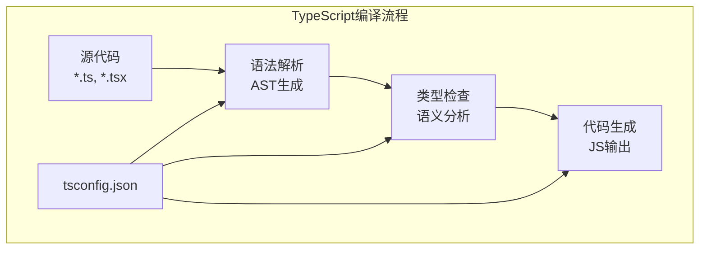
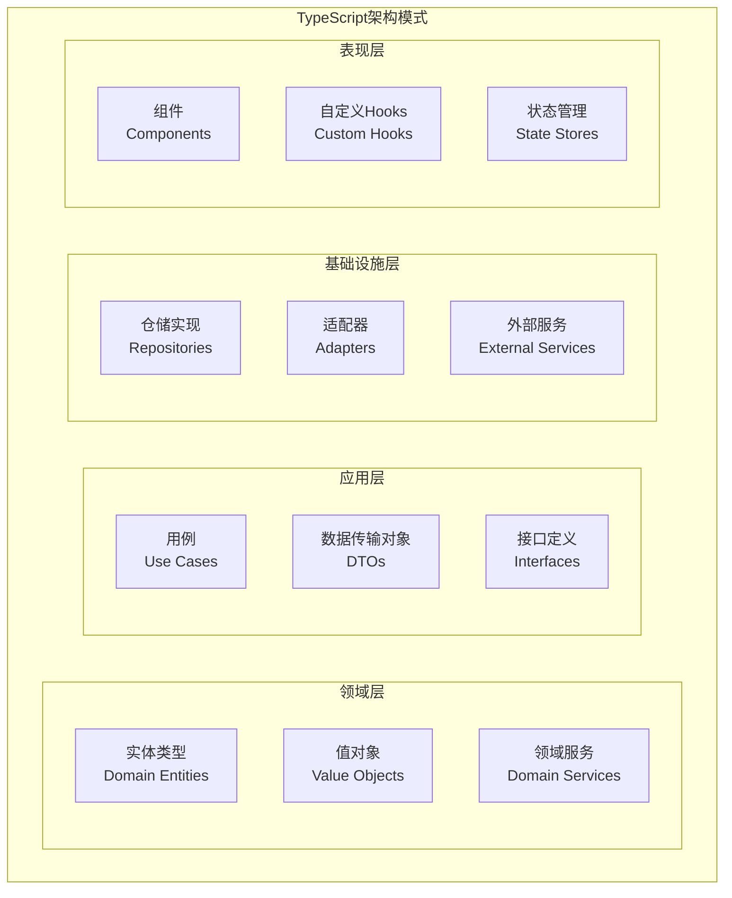

import Tabs from '@theme/Tabs';
import TabItem from '@theme/TabItem';
import CodeBlock from '@theme/CodeBlock';

# TypeScript现代开发实践指南

TypeScript是JavaScript的超集，通过添加静态类型检查，为大型应用开发提供了更好的可维护性、可读性和开发体验。随着前端应用复杂度的增加，TypeScript已成为现代前端开发的标准选择。

:::tip 核心价值
**TypeScript = 类型安全 + 开发体验 + 工程化 + 生态支持**
- 🛡️ **类型安全**：编译时错误检查，减少运行时错误
- 🔧 **开发体验**：智能提示、重构支持、导航跳转
- 📦 **工程化支持**：模块系统、装饰器、编译优化
- 🌐 **生态丰富**：与主流框架和工具深度集成
- 📚 **渐进式采用**：可以逐步从JavaScript迁移
- 🎯 **团队协作**：统一的类型约定，提高代码质量
:::

## 1. TypeScript类型系统深度解析

### 1.1 类型系统架构

TypeScript的类型系统是其核心特性，提供了从基础类型到高级类型的完整解决方案。

```mermaid
graph TB
    subgraph "TypeScript类型系统"
        subgraph "基础类型"
            PRIMITIVE[原始类型<br/>string, number, boolean]
            LITERAL[字面量类型<br/>'hello', 42, true]
            ARRAY[数组类型<br/>T[], Array<T>]
        end
        
        subgraph "复合类型"
            OBJECT[对象类型<br/>interface, type]
            FUNCTION[函数类型<br/>(args) => return]
            UNION[联合类型<br/>A | B]
            INTERSECTION[交叉类型<br/>A & B]
        end
        
        subgraph "高级类型"
            GENERIC[泛型<br/><T>]
            CONDITIONAL[条件类型<br/>T extends U ? X : Y]
            MAPPED[映射类型<br/>{[K in keyof T]: U}]
            TEMPLATE[模板字面量<br/>`${string}-${number}`]
        end
        
        subgraph "工具类型"
            UTILITY[内置工具类型<br/>Partial, Required, Pick]
            CUSTOM[自定义工具类型<br/>业务特定类型]
        end
    end
```

#### 类型系统特性对比

| 类型特性 | JavaScript | TypeScript | 优势 | 适用场景 |
|---------|------------|------------|------|----------|
| **静态类型检查** | ❌ | ✅ | 编译时发现错误 | 大型项目 |
| **类型推断** | ❌ | ✅ | 减少类型注解 | 提升开发效率 |
| **接口定义** | ❌ | ✅ | 契约式编程 | API设计 |
| **泛型支持** | ❌ | ✅ | 类型复用 | 工具函数 |
| **装饰器** | 实验性 | ✅ | 元编程 | 框架开发 |
| **枚举类型** | ❌ | ✅ | 常量管理 | 状态定义 |

<Tabs>
<TabItem value="basic-types" label="基础类型系统">

#### 基础类型与类型注解

```typescript title="TypeScript基础类型完整示例"
// 1. 原始类型
const userName: string = 'John Doe'
const userAge: number = 30
const isActive: boolean = true
const userSymbol: symbol = Symbol('user')
const userBigInt: bigint = 100n

// 2. 字面量类型
type Theme = 'light' | 'dark' | 'auto'
type HttpMethod = 'GET' | 'POST' | 'PUT' | 'DELETE'
type StatusCode = 200 | 404 | 500

const currentTheme: Theme = 'dark'
const apiMethod: HttpMethod = 'POST'

// 3. 数组类型
const numbers: number[] = [1, 2, 3, 4, 5]
const strings: Array<string> = ['hello', 'world']
const mixed: (string | number)[] = ['hello', 42, 'world']

// 只读数组
const readonlyNumbers: readonly number[] = [1, 2, 3]
const readonlyStrings: ReadonlyArray<string> = ['a', 'b', 'c']

// 4. 元组类型
type Coordinate = [number, number]
type NamedCoordinate = [x: number, y: number]
type OptionalTuple = [string, number?]
type RestTuple = [string, ...number[]]

const point: Coordinate = [10, 20]
const namedPoint: NamedCoordinate = [10, 20]
const optionalPoint: OptionalTuple = ['origin']
const restPoint: RestTuple = ['point', 1, 2, 3]

// 5. 对象类型
interface User {
  readonly id: number
  name: string
  email?: string
  age: number
  preferences: {
    theme: Theme
    notifications: boolean
  }
}

type UserUpdate = {
  name?: string
  email?: string
  age?: number
}

// 索引签名
interface Dictionary<T> {
  [key: string]: T
}

interface NumberDictionary {
  [index: string]: number
  length: number // 必须是number类型
}

// 6. 函数类型
type AddFunction = (a: number, b: number) => number
type AsyncFunction<T> = (data: T) => Promise<void>
type EventHandler<T = Event> = (event: T) => void

const add: AddFunction = (a, b) => a + b
const processData: AsyncFunction<User> = async (user) => {
  console.log(`Processing user: ${user.name}`)
}

// 函数重载
function createUser(name: string): User
function createUser(id: number, name: string): User
function createUser(idOrName: string | number, name?: string): User {
  if (typeof idOrName === 'string') {
    return {
      id: Math.random(),
      name: idOrName,
      age: 0,
      preferences: { theme: 'light', notifications: true }
    }
  } else {
    return {
      id: idOrName,
      name: name!,
      age: 0,
      preferences: { theme: 'light', notifications: true }
    }
  }
}

// 7. 联合类型和交叉类型
type StringOrNumber = string | number
type UserWithTimestamp = User & {
  createdAt: Date
  updatedAt: Date
}

// 判别联合类型
interface LoadingState {
  status: 'loading'
}

interface SuccessState {
  status: 'success'
  data: any
}

interface ErrorState {
  status: 'error'
  error: string
}

type AsyncState = LoadingState | SuccessState | ErrorState

function handleState(state: AsyncState) {
  switch (state.status) {
    case 'loading':
      console.log('Loading...')
      break
    case 'success':
      console.log('Data:', state.data) // TypeScript知道这里有data属性
      break
    case 'error':
      console.log('Error:', state.error) // TypeScript知道这里有error属性
      break
  }
}

// 8. 类型守卫
function isString(value: unknown): value is string {
  return typeof value === 'string'
}

function isUser(obj: any): obj is User {
  return obj && 
         typeof obj.id === 'number' &&
         typeof obj.name === 'string' &&
         typeof obj.age === 'number'
}

// 使用类型守卫
function processValue(value: unknown) {
  if (isString(value)) {
    // TypeScript知道value是string类型
    console.log(value.toUpperCase())
  }
  
  if (isUser(value)) {
    // TypeScript知道value是User类型
    console.log(`User: ${value.name}, Age: ${value.age}`)
  }
}

// 9. 类型断言
const userInput = document.getElementById('user-input') as HTMLInputElement
const apiResponse = JSON.parse('{"name": "John"}') as User

// 非空断言
function processUser(user: User | null) {
  // 确定user不为null时使用
  console.log(user!.name)
}

// 10. 类型缩窄
function processStringOrNumber(value: string | number) {
  if (typeof value === 'string') {
    // 在这个分支中，TypeScript知道value是string
    return value.toUpperCase()
  } else {
    // 在这个分支中，TypeScript知道value是number
    return value.toFixed(2)
  }
}

// 11. never类型
function throwError(message: string): never {
  throw new Error(message)
}

function exhaustiveCheck(value: never): never {
  throw new Error(`Unexpected value: ${value}`)
}

// 在switch语句中使用never确保完整性
function handleTheme(theme: Theme) {
  switch (theme) {
    case 'light':
      return 'Light theme'
    case 'dark':
      return 'Dark theme'
    case 'auto':
      return 'Auto theme'
    default:
      // 如果添加新的Theme值但忘记处理，TypeScript会报错
      return exhaustiveCheck(theme)
  }
}
```

</TabItem>
<TabItem value="interfaces" label="接口与类型别名">

#### 接口设计与类型别名

```typescript title="接口与类型别名最佳实践"
// 1. 基础接口定义
interface BaseEntity {
  readonly id: string
  createdAt: Date
  updatedAt: Date
}

interface User extends BaseEntity {
  name: string
  email: string
  age?: number
  avatar?: string
  status: 'active' | 'inactive' | 'pending'
}

// 2. 可选属性和只读属性
interface UserPreferences {
  readonly userId: string
  theme?: 'light' | 'dark' | 'auto'
  language?: string
  notifications?: {
    email: boolean
    push: boolean
    sms: boolean
  }
}

// 3. 索引签名
interface ApiResponse<T = any> {
  success: boolean
  data?: T
  error?: string
  meta?: {
    [key: string]: any
  }
}

// 4. 函数接口
interface EventEmitter {
  on(event: string, listener: (...args: any[]) => void): void
  off(event: string, listener: (...args: any[]) => void): void
  emit(event: string, ...args: any[]): void
}

interface HttpClient {
  get<T>(url: string, config?: RequestConfig): Promise<ApiResponse<T>>
  post<T>(url: string, data?: any, config?: RequestConfig): Promise<ApiResponse<T>>
  put<T>(url: string, data?: any, config?: RequestConfig): Promise<ApiResponse<T>>
  delete<T>(url: string, config?: RequestConfig): Promise<ApiResponse<T>>
}

// 5. 接口继承和组合
interface Timestamped {
  createdAt: Date
  updatedAt: Date
}

interface Auditable {
  createdBy: string
  updatedBy: string
}

interface Post extends BaseEntity, Auditable {
  title: string
  content: string
  author: User
  tags: string[]
  published: boolean
}

// 6. 类型别名 vs 接口
// 类型别名 - 适用于联合类型、原始类型、计算类型
type Status = 'loading' | 'success' | 'error'
type EventHandler<T> = (event: T) => void
type DeepReadonly<T> = {
  readonly [P in keyof T]: T[P] extends object ? DeepReadonly<T[P]> : T[P]
}

// 接口 - 适用于对象形状定义、类实现、声明合并
interface UserService {
  getUser(id: string): Promise<User>
  updateUser(id: string, updates: Partial<User>): Promise<User>
  deleteUser(id: string): Promise<void>
}

// 7. 声明合并
interface Window {
  customProperty: string
}

interface Window {
  anotherProperty: number
}

// 现在Window接口包含两个属性

// 8. 条件类型和映射类型
type NonNullable<T> = T extends null | undefined ? never : T
type Partial<T> = {
  [P in keyof T]?: T[P]
}

type Required<T> = {
  [P in keyof T]-?: T[P]
}

type Pick<T, K extends keyof T> = {
  [P in K]: T[P]
}

type Omit<T, K extends keyof T> = Pick<T, Exclude<keyof T, K>>

// 9. 实用工具类型应用
type UserCreateInput = Omit<User, 'id' | 'createdAt' | 'updatedAt'>
type UserUpdateInput = Partial<Pick<User, 'name' | 'email' | 'age' | 'avatar'>>
type UserPublicInfo = Pick<User, 'id' | 'name' | 'avatar'>

// 10. 高级类型模式
// 递归类型
type DeepPartial<T> = {
  [P in keyof T]?: T[P] extends object ? DeepPartial<T[P]> : T[P]
}

// 模板字面量类型
type EventName<T extends string> = `on${Capitalize<T>}`
type ApiEndpoint<T extends string> = `/api/${T}`

type UserEvents = EventName<'userCreated' | 'userUpdated' | 'userDeleted'>
// 结果: 'onUserCreated' | 'onUserUpdated' | 'onUserDeleted'

// 11. 品牌类型（Branded Types）
type UserId = string & { readonly brand: unique symbol }
type Email = string & { readonly brand: unique symbol }

function createUserId(id: string): UserId {
  return id as UserId
}

function createEmail(email: string): Email {
  if (!email.includes('@')) {
    throw new Error('Invalid email')
  }
  return email as Email
}

// 12. 类型安全的事件系统
interface EventMap {
  'user:created': { user: User }
  'user:updated': { user: User; changes: Partial<User> }
  'user:deleted': { userId: string }
  'system:error': { error: Error; context?: string }
}

class TypedEventEmitter {
  private listeners: {
    [K in keyof EventMap]?: Array<(data: EventMap[K]) => void>
  } = {}

  on<K extends keyof EventMap>(
    event: K,
    listener: (data: EventMap[K]) => void
  ): void {
    if (!this.listeners[event]) {
      this.listeners[event] = []
    }
    this.listeners[event]!.push(listener)
  }

  emit<K extends keyof EventMap>(event: K, data: EventMap[K]): void {
    const eventListeners = this.listeners[event]
    if (eventListeners) {
      eventListeners.forEach(listener => listener(data))
    }
  }

  off<K extends keyof EventMap>(
    event: K,
    listener: (data: EventMap[K]) => void
  ): void {
    const eventListeners = this.listeners[event]
    if (eventListeners) {
      const index = eventListeners.indexOf(listener)
      if (index > -1) {
        eventListeners.splice(index, 1)
      }
    }
  }
}

// 使用示例
const eventEmitter = new TypedEventEmitter()

eventEmitter.on('user:created', (data) => {
  // data的类型自动推断为 { user: User }
  console.log(`User created: ${data.user.name}`)
})

eventEmitter.emit('user:created', {
  user: {
    id: '1',
    name: 'John',
    email: 'john@example.com',
    status: 'active',
    createdAt: new Date(),
    updatedAt: new Date()
  }
})

// 13. API客户端类型安全
interface ApiEndpoints {
  'GET /users': {
    response: User[]
  }
  'GET /users/:id': {
    params: { id: string }
    response: User
  }
  'POST /users': {
    body: UserCreateInput
    response: User
  }
  'PUT /users/:id': {
    params: { id: string }
    body: UserUpdateInput
    response: User
  }
  'DELETE /users/:id': {
    params: { id: string }
    response: void
  }
}

type ExtractParams<T> = T extends { params: infer P } ? P : never
type ExtractBody<T> = T extends { body: infer B } ? B : never
type ExtractResponse<T> = T extends { response: infer R } ? R : never

class TypedApiClient {
  async request<K extends keyof ApiEndpoints>(
    endpoint: K,
    options?: {
      params?: ExtractParams<ApiEndpoints[K]>
      body?: ExtractBody<ApiEndpoints[K]>
    }
  ): Promise<ExtractResponse<ApiEndpoints[K]>> {
    // 实际的HTTP请求实现
    throw new Error('Not implemented')
  }
}

// 使用示例
const apiClient = new TypedApiClient()

// TypeScript会自动推断参数和返回类型
const user = await apiClient.request('GET /users/:id', {
  params: { id: '123' }
}) // user的类型是User

const newUser = await apiClient.request('POST /users', {
  body: {
    name: 'John',
    email: 'john@example.com',
    status: 'active'
  }
}) // newUser的类型是User
```

</TabItem>
<TabItem value="generics" label="泛型系统">

#### 泛型编程与类型约束

```typescript title="泛型系统深度应用"
// 1. 基础泛型
function identity<T>(arg: T): T {
  return arg
}

// 泛型接口
interface GenericResponse<T> {
  data: T
  success: boolean
  message?: string
}

// 泛型类
class GenericRepository<T, K = string> {
  private items: Map<K, T> = new Map()

  add(key: K, item: T): void {
    this.items.set(key, item)
  }

  get(key: K): T | undefined {
    return this.items.get(key)
  }

  getAll(): T[] {
    return Array.from(this.items.values())
  }

  delete(key: K): boolean {
    return this.items.delete(key)
  }
}

// 2. 泛型约束
interface Lengthwise {
  length: number
}

function loggingIdentity<T extends Lengthwise>(arg: T): T {
  console.log(arg.length) // 现在我们知道arg有length属性
  return arg
}

// 使用类型参数约束
function getProperty<T, K extends keyof T>(obj: T, key: K): T[K] {
  return obj[key]
}

const person = { name: 'John', age: 30, email: 'john@example.com' }
const name = getProperty(person, 'name') // string类型
const age = getProperty(person, 'age')   // number类型

// 3. 条件类型
type NonNullable<T> = T extends null | undefined ? never : T
type ReturnType<T> = T extends (...args: any[]) => infer R ? R : any
type Parameters<T> = T extends (...args: infer P) => any ? P : never

// 自定义条件类型
type IsArray<T> = T extends any[] ? true : false
type ArrayElement<T> = T extends (infer U)[] ? U : never

type Test1 = IsArray<string[]>  // true
type Test2 = IsArray<string>    // false
type Test3 = ArrayElement<User[]> // User

// 4. 映射类型
type Readonly<T> = {
  readonly [P in keyof T]: T[P]
}

type Partial<T> = {
  [P in keyof T]?: T[P]
}

type Nullable<T> = {
  [P in keyof T]: T[P] | null
}

// 高级映射类型
type DeepReadonly<T> = {
  readonly [P in keyof T]: T[P] extends object ? DeepReadonly<T[P]> : T[P]
}

type OptionalKeys<T> = {
  [K in keyof T]-?: {} extends Pick<T, K> ? K : never
}[keyof T]

type RequiredKeys<T> = {
  [K in keyof T]-?: {} extends Pick<T, K> ? never : K
}[keyof T]

// 5. 实用泛型工具
// 深度合并类型
type DeepMerge<T, U> = {
  [K in keyof T | keyof U]: K extends keyof U
    ? K extends keyof T
      ? T[K] extends object
        ? U[K] extends object
          ? DeepMerge<T[K], U[K]>
          : U[K]
        : U[K]
      : U[K]
    : K extends keyof T
    ? T[K]
    : never
}

// 类型安全的对象更新
function updateObject<T, U extends Partial<T>>(
  original: T,
  updates: U
): T & U {
  return { ...original, ...updates }
}

// 6. 高阶函数泛型
// 函数组合
function compose<A, B, C>(
  f: (b: B) => C,
  g: (a: A) => B
): (a: A) => C {
  return (a: A) => f(g(a))
}

// 管道操作
function pipe<T>(...fns: Array<(arg: T) => T>): (arg: T) => T {
  return (arg: T) => fns.reduce((acc, fn) => fn(acc), arg)
}

// 柯里化
function curry<A, B, C>(
  fn: (a: A, b: B) => C
): (a: A) => (b: B) => C {
  return (a: A) => (b: B) => fn(a, b)
}

// 7. 异步泛型模式
// Promise工具类型
type PromiseValue<T> = T extends Promise<infer U> ? U : T
type AwaitedReturnType<T> = T extends (...args: any[]) => Promise<infer R> ? R : never

// 异步数据获取器
class AsyncDataFetcher<T> {
  private cache = new Map<string, T>()

  async fetch<K extends keyof T>(
    key: K,
    fetcher: () => Promise<T[K]>
  ): Promise<T[K]> {
    const cacheKey = String(key)
    
    if (this.cache.has(cacheKey)) {
      return this.cache.get(cacheKey) as T[K]
    }

    const data = await fetcher()
    this.cache.set(cacheKey, data as any)
    return data
  }

  invalidate<K extends keyof T>(key: K): void {
    this.cache.delete(String(key))
  }

  clear(): void {
    this.cache.clear()
  }
}

// 8. 状态管理泛型
interface State {
  user: User | null
  posts: Post[]
  loading: boolean
  error: string | null
}

type Action<T extends keyof State> = {
  type: T
  payload: State[T]
}

type ActionCreator<T extends keyof State> = (payload: State[T]) => Action<T>

function createActionCreator<T extends keyof State>(
  type: T
): ActionCreator<T> {
  return (payload: State[T]) => ({ type, payload })
}

// 使用示例
const setUser = createActionCreator('user')
const setPosts = createActionCreator('posts')
const setLoading = createActionCreator('loading')

// 9. 表单验证泛型
type ValidationRule<T> = (value: T) => string | null
type ValidationRules<T> = {
  [K in keyof T]?: ValidationRule<T[K]>[]
}

type ValidationErrors<T> = {
  [K in keyof T]?: string
}

class FormValidator<T extends Record<string, any>> {
  constructor(private rules: ValidationRules<T>) {}

  validate(data: T): ValidationErrors<T> {
    const errors: ValidationErrors<T> = {}

    for (const key in this.rules) {
      const fieldRules = this.rules[key]
      if (fieldRules) {
        for (const rule of fieldRules) {
          const error = rule(data[key])
          if (error) {
            errors[key] = error
            break // 只显示第一个错误
          }
        }
      }
    }

    return errors
  }

  isValid(data: T): boolean {
    const errors = this.validate(data)
    return Object.keys(errors).length === 0
  }
}

// 使用示例
interface UserForm {
  name: string
  email: string
  age: number
}

const userValidator = new FormValidator<UserForm>({
  name: [
    (value) => value.length === 0 ? '姓名不能为空' : null,
    (value) => value.length < 2 ? '姓名至少2个字符' : null
  ],
  email: [
    (value) => value.length === 0 ? '邮箱不能为空' : null,
    (value) => !value.includes('@') ? '邮箱格式不正确' : null
  ],
  age: [
    (value) => value < 0 ? '年龄不能为负数' : null,
    (value) => value > 150 ? '年龄不能超过150' : null
  ]
})

// 10. 类型安全的事件总线
type EventBusEvents = {
  'user:login': { user: User }
  'user:logout': { userId: string }
  'post:created': { post: Post }
  'post:updated': { post: Post; changes: Partial<Post> }
}

class TypeSafeEventBus {
  private listeners: {
    [K in keyof EventBusEvents]?: Set<(data: EventBusEvents[K]) => void>
  } = {}

  on<K extends keyof EventBusEvents>(
    event: K,
    listener: (data: EventBusEvents[K]) => void
  ): () => void {
    if (!this.listeners[event]) {
      this.listeners[event] = new Set()
    }
    
    this.listeners[event]!.add(listener)
    
    // 返回取消订阅函数
    return () => {
      this.listeners[event]?.delete(listener)
    }
  }

  emit<K extends keyof EventBusEvents>(
    event: K,
    data: EventBusEvents[K]
  ): void {
    const eventListeners = this.listeners[event]
    if (eventListeners) {
      eventListeners.forEach(listener => listener(data))
    }
  }

  once<K extends keyof EventBusEvents>(
    event: K,
    listener: (data: EventBusEvents[K]) => void
  ): void {
    const onceListener = (data: EventBusEvents[K]) => {
      listener(data)
      this.listeners[event]?.delete(onceListener)
    }
    
    this.on(event, onceListener)
  }
}

// 使用示例
const eventBus = new TypeSafeEventBus()

const unsubscribe = eventBus.on('user:login', (data) => {
  console.log(`User ${data.user.name} logged in`)
})

eventBus.emit('user:login', {
  user: {
    id: '1',
    name: 'John',
    email: 'john@example.com',
    status: 'active',
    createdAt: new Date(),
    updatedAt: new Date()
  }
})

// 取消订阅
unsubscribe()
```

</TabItem>
</Tabs>

## 2. TypeScript工程化配置

### 2.1 编译配置与优化

TypeScript的编译配置是项目工程化的重要组成部分，合理的配置可以提升开发体验和构建性能。



#### 编译配置对比

| 配置项 | 开发环境 | 生产环境 | 说明 |
|--------|----------|----------|------|
| **target** | ES2020 | ES2018 | 编译目标版本 |
| **module** | ESNext | CommonJS | 模块系统 |
| **sourceMap** | true | false | 源码映射 |
| **strict** | true | true | 严格模式 |
| **incremental** | true | false | 增量编译 |
| **skipLibCheck** | true | true | 跳过库检查 |

<Tabs>
<TabItem value="tsconfig" label="配置文件">

#### 完整的tsconfig.json配置

```json title="tsconfig.json完整配置"
{
  "compilerOptions": {
    // 基础配置
    "target": "ES2020",
    "module": "ESNext",
    "lib": ["ES2020", "DOM", "DOM.Iterable"],
    "moduleResolution": "node",
    "allowJs": true,
    "checkJs": false,
    "jsx": "react-jsx",
    
    // 输出配置
    "outDir": "./dist",
    "rootDir": "./src",
    "removeComments": true,
    "noEmit": false,
    "importHelpers": true,
    "downlevelIteration": true,
    "isolatedModules": true,
    
    // 源码映射
    "sourceMap": true,
    "inlineSourceMap": false,
    "declarationMap": true,
    
    // 声明文件
    "declaration": true,
    "declarationDir": "./types",
    "emitDeclarationOnly": false,
    
    // 严格检查
    "strict": true,
    "noImplicitAny": true,
    "strictNullChecks": true,
    "strictFunctionTypes": true,
    "strictBindCallApply": true,
    "strictPropertyInitialization": true,
    "noImplicitThis": true,
    "noImplicitReturns": true,
    "noFallthroughCasesInSwitch": true,
    "noUncheckedIndexedAccess": true,
    
    // 额外检查
    "noUnusedLocals": true,
    "noUnusedParameters": true,
    "exactOptionalPropertyTypes": true,
    "noImplicitOverride": true,
    "noPropertyAccessFromIndexSignature": true,
    
    // 模块解析
    "baseUrl": "./",
    "paths": {
      "@/*": ["src/*"],
      "@/components/*": ["src/components/*"],
      "@/utils/*": ["src/utils/*"],
      "@/types/*": ["src/types/*"],
      "@/hooks/*": ["src/hooks/*"],
      "@/stores/*": ["src/stores/*"],
      "@/services/*": ["src/services/*"]
    },
    "typeRoots": ["./node_modules/@types", "./src/types"],
    "types": ["node", "jest", "@testing-library/jest-dom"],
    
    // 性能优化
    "incremental": true,
    "tsBuildInfoFile": "./node_modules/.cache/typescript/tsbuildinfo",
    "skipLibCheck": true,
    "skipDefaultLibCheck": true,
    
    // 互操作性
    "esModuleInterop": true,
    "allowSyntheticDefaultImports": true,
    "forceConsistentCasingInFileNames": true,
    "resolveJsonModule": true,
    
    // 实验性功能
    "experimentalDecorators": true,
    "emitDecoratorMetadata": true,
    "useDefineForClassFields": true
  },
  
  // 包含和排除
  "include": [
    "src/**/*",
    "tests/**/*",
    "*.d.ts"
  ],
  "exclude": [
    "node_modules",
    "dist",
    "build",
    "coverage",
    "**/*.spec.ts",
    "**/*.test.ts"
  ],
  
  // 项目引用
  "references": [
    { "path": "./packages/shared" },
    { "path": "./packages/utils" }
  ],
  
  // 监听配置
  "watchOptions": {
    "watchFile": "useFsEvents",
    "watchDirectory": "useFsEvents",
    "fallbackPolling": "dynamicPriority",
    "synchronousWatchDirectory": true,
    "excludeDirectories": ["**/node_modules", "dist"]
  },
  
  // TypeScript 4.9+ 配置
  "compilerOptions": {
    "moduleDetection": "auto",
    "allowImportingTsExtensions": false,
    "allowArbitraryExtensions": false
  }
}
```

#### 环境特定配置

```json title="tsconfig.dev.json - 开发环境配置"
{
  "extends": "./tsconfig.json",
  "compilerOptions": {
    "target": "ES2022",
    "module": "ESNext",
    "sourceMap": true,
    "incremental": true,
    "noEmit": true,
    "preserveWatchOutput": true,
    
    // 开发时放宽的检查
    "noUnusedLocals": false,
    "noUnusedParameters": false,
    "skipLibCheck": true
  },
  "include": [
    "src/**/*",
    "tests/**/*",
    "vite.config.ts",
    "vitest.config.ts"
  ]
}
```

```json title="tsconfig.build.json - 构建配置"
{
  "extends": "./tsconfig.json",
  "compilerOptions": {
    "target": "ES2018",
    "module": "CommonJS",
    "sourceMap": false,
    "incremental": false,
    "removeComments": true,
    "declaration": true,
    "declarationMap": false,
    
    // 生产构建优化
    "noEmitOnError": true,
    "listEmittedFiles": true,
    "listFiles": false
  },
  "exclude": [
    "src/**/*.test.ts",
    "src/**/*.spec.ts",
    "src/**/*.stories.ts",
    "tests/**/*"
  ]
}
```

</TabItem>
<TabItem value="project-setup" label="项目结构">

#### TypeScript项目结构最佳实践

```typescript title="项目结构与类型组织"
// src/types/index.ts - 全局类型定义
export interface BaseEntity {
  id: string
  createdAt: Date
  updatedAt: Date
}

export interface User extends BaseEntity {
  name: string
  email: string
  role: UserRole
  status: UserStatus
}

export type UserRole = 'admin' | 'user' | 'guest'
export type UserStatus = 'active' | 'inactive' | 'pending'

// API相关类型
export interface ApiResponse<T = any> {
  success: boolean
  data?: T
  error?: ApiError
  meta?: ApiMeta
}

export interface ApiError {
  code: string
  message: string
  details?: Record<string, any>
}

export interface ApiMeta {
  page?: number
  limit?: number
  total?: number
  hasMore?: boolean
}

// src/types/api.ts - API类型定义
import { User, ApiResponse } from './index'

export namespace UserAPI {
  export interface GetUsersRequest {
    page?: number
    limit?: number
    search?: string
    role?: UserRole
    status?: UserStatus
  }

  export interface GetUsersResponse extends ApiResponse<User[]> {
    meta: {
      page: number
      limit: number
      total: number
      hasMore: boolean
    }
  }

  export interface CreateUserRequest {
    name: string
    email: string
    role: UserRole
  }

  export interface UpdateUserRequest {
    name?: string
    email?: string
    role?: UserRole
    status?: UserStatus
  }
}

// src/types/components.ts - 组件类型定义
import { ReactNode, HTMLAttributes } from 'react'

export interface BaseComponentProps {
  className?: string
  children?: ReactNode
  testId?: string
}

export interface ButtonProps extends BaseComponentProps {
  variant?: 'primary' | 'secondary' | 'danger'
  size?: 'small' | 'medium' | 'large'
  disabled?: boolean
  loading?: boolean
  onClick?: () => void
}

export interface ModalProps extends BaseComponentProps {
  visible: boolean
  title?: string
  width?: number | string
  closable?: boolean
  onClose?: () => void
  onCancel?: () => void
  onOk?: () => void
}

// src/utils/types.ts - 工具类型
export type DeepPartial<T> = {
  [P in keyof T]?: T[P] extends object ? DeepPartial<T[P]> : T[P]
}

export type DeepRequired<T> = {
  [P in keyof T]-?: T[P] extends object ? DeepRequired<T[P]> : T[P]
}

export type KeysOfType<T, U> = {
  [K in keyof T]: T[K] extends U ? K : never
}[keyof T]

export type NonEmptyArray<T> = [T, ...T[]]

export type Prettify<T> = {
  [K in keyof T]: T[K]
} & {}

// 函数工具类型
export type AsyncReturnType<T extends (...args: any) => Promise<any>> = 
  T extends (...args: any) => Promise<infer R> ? R : any

export type PromiseType<T> = T extends Promise<infer U> ? U : T

// src/services/types.ts - 服务类型定义
export interface HttpClientConfig {
  baseURL: string
  timeout: number
  headers?: Record<string, string>
  interceptors?: {
    request?: (config: any) => any
    response?: (response: any) => any
    error?: (error: any) => any
  }
}

export interface CacheConfig {
  ttl: number
  maxSize: number
  strategy: 'lru' | 'fifo' | 'lfu'
}

export interface ServiceConfig {
  http: HttpClientConfig
  cache: CacheConfig
  retry: {
    attempts: number
    delay: number
    backoff: 'linear' | 'exponential'
  }
}

// src/hooks/types.ts - Hook类型定义
export interface UseApiOptions<T> {
  initialData?: T
  enabled?: boolean
  refetchOnWindowFocus?: boolean
  refetchInterval?: number
  onSuccess?: (data: T) => void
  onError?: (error: Error) => void
}

export interface UseApiResult<T> {
  data: T | undefined
  loading: boolean
  error: Error | null
  refetch: () => Promise<void>
  mutate: (data: T) => void
}

export interface UsePaginationOptions {
  initialPage?: number
  initialPageSize?: number
  total?: number
}

export interface UsePaginationResult {
  page: number
  pageSize: number
  total: number
  totalPages: number
  hasNext: boolean
  hasPrev: boolean
  goToPage: (page: number) => void
  nextPage: () => void
  prevPage: () => void
  setPageSize: (size: number) => void
}

// src/stores/types.ts - 状态管理类型
export interface RootState {
  user: UserState
  app: AppState
  ui: UIState
}

export interface UserState {
  currentUser: User | null
  loading: boolean
  error: string | null
}

export interface AppState {
  theme: 'light' | 'dark' | 'auto'
  language: string
  sidebarCollapsed: boolean
}

export interface UIState {
  notifications: Notification[]
  modals: Modal[]
  loading: Record<string, boolean>
}

// 动作类型
export type UserAction = 
  | { type: 'USER_LOGIN_START' }
  | { type: 'USER_LOGIN_SUCCESS'; payload: User }
  | { type: 'USER_LOGIN_FAILURE'; payload: string }
  | { type: 'USER_LOGOUT' }
  | { type: 'USER_UPDATE'; payload: Partial<User> }

// src/constants/types.ts - 常量类型
export const HTTP_STATUS = {
  OK: 200,
  CREATED: 201,
  BAD_REQUEST: 400,
  UNAUTHORIZED: 401,
  FORBIDDEN: 403,
  NOT_FOUND: 404,
  INTERNAL_SERVER_ERROR: 500
} as const

export type HttpStatus = typeof HTTP_STATUS[keyof typeof HTTP_STATUS]

export const USER_ROLES = {
  ADMIN: 'admin',
  USER: 'user',
  GUEST: 'guest'
} as const

export type UserRole = typeof USER_ROLES[keyof typeof USER_ROLES]

// 环境变量类型
declare global {
  namespace NodeJS {
    interface ProcessEnv {
      NODE_ENV: 'development' | 'production' | 'test'
      REACT_APP_API_URL: string
      REACT_APP_APP_NAME: string
      REACT_APP_VERSION: string
    }
  }
}

// 扩展第三方库类型
declare module 'react' {
  interface HTMLAttributes<T> {
    'data-testid'?: string
  }
}

declare module '*.svg' {
  const content: React.FunctionComponent<React.SVGAttributes<SVGElement>>
  export default content
}

declare module '*.png' {
  const content: string
  export default content
}

declare module '*.jpg' {
  const content: string
  export default content
}
```

</TabItem>
<TabItem value="build-tools" label="构建工具集成">

#### 构建工具与TypeScript集成

```typescript title="Vite + TypeScript配置"
// vite.config.ts
import { defineConfig } from 'vite'
import react from '@vitejs/plugin-react'
import { resolve } from 'path'
import dts from 'vite-plugin-dts'
import { visualizer } from 'rollup-plugin-visualizer'

export default defineConfig({
  plugins: [
    react(),
    
    // 生成类型声明文件
    dts({
      insertTypesEntry: true,
      include: ['src/**/*'],
      exclude: ['src/**/*.test.ts', 'src/**/*.spec.ts']
    }),
    
    // 构建分析
    visualizer({
      filename: 'dist/stats.html',
      open: true,
      gzipSize: true
    })
  ],
  
  // 路径别名
  resolve: {
    alias: {
      '@': resolve(__dirname, 'src'),
      '@/components': resolve(__dirname, 'src/components'),
      '@/utils': resolve(__dirname, 'src/utils'),
      '@/types': resolve(__dirname, 'src/types'),
      '@/hooks': resolve(__dirname, 'src/hooks'),
      '@/stores': resolve(__dirname, 'src/stores'),
      '@/services': resolve(__dirname, 'src/services')
    }
  },
  
  // 构建配置
  build: {
    target: 'es2018',
    lib: {
      entry: resolve(__dirname, 'src/index.ts'),
      name: 'MyLibrary',
      formats: ['es', 'cjs', 'umd']
    },
    rollupOptions: {
      external: ['react', 'react-dom'],
      output: {
        globals: {
          react: 'React',
          'react-dom': 'ReactDOM'
        }
      }
    },
    sourcemap: true,
    minify: 'terser',
    terserOptions: {
      compress: {
        drop_console: true,
        drop_debugger: true
      }
    }
  },
  
  // 开发服务器
  server: {
    port: 3000,
    open: true,
    cors: true
  },
  
  // 环境变量
  define: {
    __APP_VERSION__: JSON.stringify(process.env.npm_package_version)
  }
})

// webpack.config.ts (如果使用Webpack)
import path from 'path'
import { Configuration } from 'webpack'
import HtmlWebpackPlugin from 'html-webpack-plugin'
import MiniCssExtractPlugin from 'mini-css-extract-plugin'
import ForkTsCheckerWebpackPlugin from 'fork-ts-checker-webpack-plugin'

const config: Configuration = {
  entry: './src/index.tsx',
  
  output: {
    path: path.resolve(__dirname, 'dist'),
    filename: '[name].[contenthash].js',
    clean: true
  },
  
  resolve: {
    extensions: ['.ts', '.tsx', '.js', '.jsx'],
    alias: {
      '@': path.resolve(__dirname, 'src'),
      '@/components': path.resolve(__dirname, 'src/components'),
      '@/utils': path.resolve(__dirname, 'src/utils'),
      '@/types': path.resolve(__dirname, 'src/types')
    }
  },
  
  module: {
    rules: [
      {
        test: /\.tsx?$/,
        use: [
          {
            loader: 'ts-loader',
            options: {
              transpileOnly: true, // 类型检查交给ForkTsCheckerWebpackPlugin
              configFile: 'tsconfig.build.json'
            }
          }
        ],
        exclude: /node_modules/
      },
      {
        test: /\.css$/,
        use: [
          MiniCssExtractPlugin.loader,
          'css-loader',
          'postcss-loader'
        ]
      }
    ]
  },
  
  plugins: [
    new HtmlWebpackPlugin({
      template: './public/index.html'
    }),
    
    new MiniCssExtractPlugin({
      filename: '[name].[contenthash].css'
    }),
    
    // TypeScript类型检查
    new ForkTsCheckerWebpackPlugin({
      typescript: {
        configFile: 'tsconfig.build.json'
      }
    })
  ],
  
  optimization: {
    splitChunks: {
      chunks: 'all',
      cacheGroups: {
        vendor: {
          test: /[\\/]node_modules[\\/]/,
          name: 'vendors',
          chunks: 'all'
        }
      }
    }
  }
}

export default config

// jest.config.ts - 测试配置
import type { Config } from 'jest'

const config: Config = {
  preset: 'ts-jest',
  testEnvironment: 'jsdom',
  
  // 模块解析
  moduleNameMapping: {
    '^@/(.*)$': '<rootDir>/src/$1'
  },
  
  // 设置文件
  setupFilesAfterEnv: ['<rootDir>/src/setupTests.ts'],
  
  // 覆盖率配置
  collectCoverageFrom: [
    'src/**/*.{ts,tsx}',
    '!src/**/*.d.ts',
    '!src/**/*.stories.{ts,tsx}',
    '!src/index.tsx'
  ],
  
  coverageThreshold: {
    global: {
      branches: 80,
      functions: 80,
      lines: 80,
      statements: 80
    }
  },
  
  // 转换配置
  transform: {
    '^.+\\.tsx?$': ['ts-jest', {
      tsconfig: 'tsconfig.json'
    }]
  },
  
  // 模块文件扩展名
  moduleFileExtensions: ['ts', 'tsx', 'js', 'jsx', 'json'],
  
  // 测试匹配模式
  testMatch: [
    '<rootDir>/src/**/__tests__/**/*.{ts,tsx}',
    '<rootDir>/src/**/*.{test,spec}.{ts,tsx}'
  ]
}

export default config

// eslint.config.ts - ESLint配置
import { defineConfig } from 'eslint-define-config'

export default defineConfig({
  root: true,
  env: {
    browser: true,
    es2020: true,
    node: true
  },
  
  extends: [
    'eslint:recommended',
    '@typescript-eslint/recommended',
    '@typescript-eslint/recommended-requiring-type-checking',
    'plugin:react/recommended',
    'plugin:react-hooks/recommended',
    'plugin:jsx-a11y/recommended'
  ],
  
  parser: '@typescript-eslint/parser',
  parserOptions: {
    ecmaVersion: 'latest',
    sourceType: 'module',
    project: ['./tsconfig.json'],
    tsconfigRootDir: __dirname,
    ecmaFeatures: {
      jsx: true
    }
  },
  
  plugins: [
    '@typescript-eslint',
    'react',
    'react-hooks',
    'jsx-a11y'
  ],
  
  rules: {
    // TypeScript规则
    '@typescript-eslint/no-unused-vars': 'error',
    '@typescript-eslint/no-explicit-any': 'warn',
    '@typescript-eslint/explicit-function-return-type': 'off',
    '@typescript-eslint/explicit-module-boundary-types': 'off',
    '@typescript-eslint/no-non-null-assertion': 'warn',
    '@typescript-eslint/prefer-nullish-coalescing': 'error',
    '@typescript-eslint/prefer-optional-chain': 'error',
    
    // React规则
    'react/react-in-jsx-scope': 'off',
    'react/prop-types': 'off',
    'react-hooks/rules-of-hooks': 'error',
    'react-hooks/exhaustive-deps': 'warn',
    
    // 通用规则
    'no-console': 'warn',
    'no-debugger': 'error',
    'prefer-const': 'error',
    'no-var': 'error'
  },
  
  settings: {
    react: {
      version: 'detect'
    }
  },
  
  ignorePatterns: [
    'dist',
    'build',
    'node_modules',
    '*.config.js'
  ]
})
```

</TabItem>
</Tabs>

## 3. TypeScript最佳实践与模式

### 3.1 代码组织与架构模式

TypeScript的强类型特性为大型应用的架构设计提供了强有力的支持，合理的代码组织和架构模式至关重要。



#### 架构模式对比

| 架构模式 | 适用规模 | 类型安全 | 维护成本 | 学习曲线 |
|---------|----------|----------|----------|----------|
| **MVC** | 中小型 | ⭐⭐⭐ | ⭐⭐ | ⭐⭐ |
| **MVVM** | 中型 | ⭐⭐⭐⭐ | ⭐⭐⭐ | ⭐⭐⭐ |
| **Clean Architecture** | 大型 | ⭐⭐⭐⭐⭐ | ⭐⭐⭐⭐ | ⭐⭐⭐⭐ |
| **Hexagonal** | 大型 | ⭐⭐⭐⭐⭐ | ⭐⭐⭐⭐ | ⭐⭐⭐⭐ |
| **Modular Monolith** | 超大型 | ⭐⭐⭐⭐⭐ | ⭐⭐⭐⭐⭐ | ⭐⭐⭐⭐⭐ |

### 3.2 性能优化策略

TypeScript编译器提供了多种优化选项，合理配置可以显著提升编译性能和运行时性能。

#### 编译性能优化检查清单

| 优化策略 | 配置项 | 性能提升 | 适用场景 |
|---------|--------|----------|----------|
| **增量编译** | incremental: true | ⭐⭐⭐⭐ | 开发环境 |
| **跳过库检查** | skipLibCheck: true | ⭐⭐⭐⭐⭐ | 大型项目 |
| **项目引用** | references | ⭐⭐⭐⭐ | 多包项目 |
| **类型导入** | import type | ⭐⭐⭐ | 类型密集项目 |
| **路径映射** | paths | ⭐⭐ | 深层嵌套项目 |

:::tip TypeScript最佳实践原则
1. **类型优先**：优先使用类型而不是any
2. **渐进式采用**：从JavaScript逐步迁移到TypeScript
3. **严格模式**：启用strict模式获得最佳类型安全
4. **工具集成**：充分利用IDE和构建工具的TypeScript支持
5. **性能监控**：定期检查编译性能和包大小
6. **团队规范**：建立统一的TypeScript编码规范
:::

---

TypeScript作为现代前端开发的重要工具，其强大的类型系统、丰富的语言特性和完善的工具链为大型应用开发提供了坚实的基础。通过掌握TypeScript的核心概念、工程化配置和最佳实践，可以显著提升代码质量、开发效率和团队协作水平。