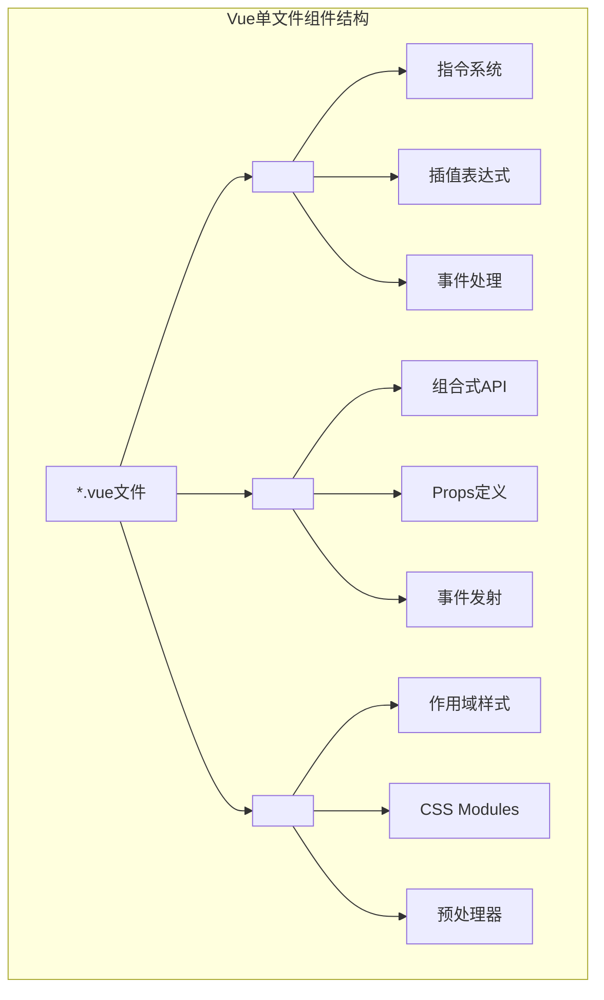
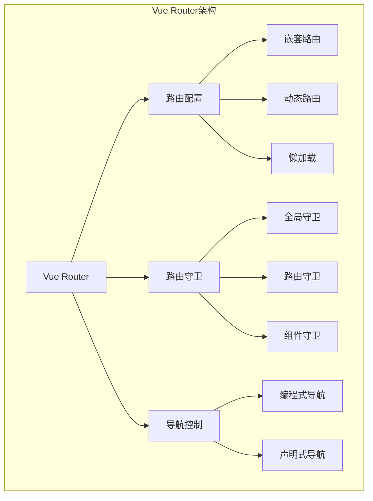
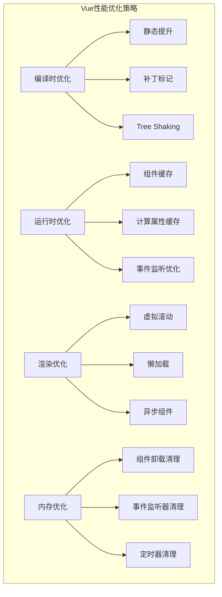

import Tabs from '@theme/Tabs';
import TabItem from '@theme/TabItem';
import CodeBlock from '@theme/CodeBlock';

# Vue.js现代开发实践指南

Vue.js是一个渐进式JavaScript框架，以其简洁的API、优秀的性能和丰富的生态系统成为现代前端开发的热门选择。Vue 3引入的组合式API、更好的TypeScript支持和性能优化，使其成为构建现代Web应用的理想选择。

:::tip 核心价值
**Vue.js = 渐进式 + 响应式 + 组件化 + 生态丰富**
- 🎯 **渐进式框架**：可以逐步采用，从简单页面到复杂应用
- ⚡ **响应式系统**：基于Proxy的高性能响应式数据绑定
- 🧩 **组件化开发**：单文件组件，开发体验优秀
- 🔧 **组合式API**：更好的逻辑复用和TypeScript支持
- 📦 **丰富生态**：Vue Router、Pinia、Nuxt.js等完整解决方案
- 🎨 **开发体验**：优秀的开发工具和调试支持
:::

## 1. Vue 3核心特性与架构

### 1.1 Vue 3架构演进

Vue 3相比Vue 2在架构上有了重大改进，引入了组合式API、更好的性能和TypeScript支持。

```mermaid
graph TB
    subgraph "Vue 3架构图"
        subgraph "编译时"
            SFC[单文件组件<br/>*.vue]
            COMPILER[Vue编译器<br/>Template → Render Function]
            OPTIMIZER[编译优化<br/>静态提升、补丁标记]
        end
        
        subgraph "运行时"
            REACTIVITY[响应式系统<br/>Proxy-based]
            RENDERER[渲染器<br/>Virtual DOM]
            SCHEDULER[调度器<br/>异步更新队列]
        end
        
        subgraph "组合式API"
            COMPOSITION[组合式API<br/>setup(), ref(), reactive()]
            LIFECYCLE[生命周期钩子<br/>onMounted(), onUpdated()]
            COMPUTED[计算属性<br/>computed(), watch()]
        end
    end
    
    SFC --> COMPILER
    COMPILER --> OPTIMIZER
    OPTIMIZER --> RENDERER
    RENDERER --> REACTIVITY
    REACTIVITY --> SCHEDULER
```

#### Vue 2 vs Vue 3 对比

| 特性对比 | Vue 2 | Vue 3 | 改进说明 |
|---------|-------|-------|----------|
| **响应式系统** | Object.defineProperty | Proxy | 更好的性能，支持数组和对象 |
| **API风格** | 选项式API | 组合式API + 选项式API | 更好的逻辑复用和TypeScript支持 |
| **性能** | 基准性能 | 2x更快 | 编译优化、Tree-shaking |
| **包大小** | ~34KB | ~16KB | 更好的Tree-shaking |
| **TypeScript** | 部分支持 | 完全支持 | 原生TypeScript支持 |
| **多根节点** | 不支持 | 支持 | Fragment支持 |
### 1.2 组合式API深度解析

组合式API是Vue 3的核心特性，提供了更灵活的逻辑组织方式和更好的TypeScript支持。

<Tabs>
<TabItem value="composition-basics" label="组合式API基础">

#### 基础组合式API使用

```vue title="组合式API基础示例"
<template>
  <div class="user-profile">
    <!-- 用户信息展示 -->
    <div class="user-info" v-if="!loading">
      
      <div class="details">
        <h2>{{ user?.name }}</h2>
        <p>{{ user?.email }}</p>
        <span class="role">{{ user?.role }}</span>
      </div>
    </div>
    
    <!-- 加载状态 -->
    <div v-else class="loading">
      <div class="spinner"></div>
      <p>加载中...</p>
    </div>
    
    <!-- 错误状态 -->
    <div v-if="error" class="error">
      <p>{{ error }}</p>
      <button @click="retry">重试</button>
    </div>
    
    <!-- 用户操作 -->
    <div class="actions" v-if="user">
      <button @click="toggleEdit" class="btn-primary">
        {{ isEditing ? '取消编辑' : '编辑资料' }}
      </button>
      <button @click="logout" class="btn-secondary">登出</button>
    </div>
    
    <!-- 编辑表单 -->
    <div v-if="isEditing" class="edit-form">
      <form @submit.prevent="saveUser">
        <div class="form-group">
          <label for="name">姓名：</label>
          <input
            id="name"
            v-model="editForm.name"
            type="text"
            required
            class="form-input"
          />
        </div>
        
        <div class="form-group">
          <label for="email">邮箱：</label>
          <input
            id="email"
            v-model="editForm.email"
            type="email"
            required
            class="form-input"
          />
        </div>
        
        <div class="form-actions">
          <button type="submit" :disabled="saving" class="btn-primary">
            {{ saving ? '保存中...' : '保存' }}
          </button>
          <button type="button" @click="cancelEdit" class="btn-secondary">
            取消
          </button>
        </div>
      </form>
    </div>
  </div>
</template>

<script setup lang="ts">
import { ref, reactive, computed, onMounted, watch, nextTick } from 'vue'
import { useRouter } from 'vue-router'
import { useUserStore } from '@/stores/user'

// 类型定义
interface User {
  id: number
  name: string
  email: string
  avatar: string
  role: 'admin' | 'user' | 'guest'
}

interface EditForm {
  name: string
  email: string
}

// 响应式数据
const user = ref<User | null>(null)
const loading = ref(true)
const error = ref<string | null>(null)
const isEditing = ref(false)
const saving = ref(false)

// 响应式对象
const editForm = reactive<EditForm>({
  name: '',
  email: ''
})

// 组合式函数
const router = useRouter()
const userStore = useUserStore()

// 计算属性
const isAdmin = computed(() => user.value?.role === 'admin')
const canEdit = computed(() => user.value && (isAdmin.value || user.value.id === userStore.currentUserId))

// 生命周期钩子
onMounted(async () => {
  await fetchUser()
})

// 侦听器
watch(user, (newUser) => {
  if (newUser) {
    editForm.name = newUser.name
    editForm.email = newUser.email
  }
}, { immediate: true })

// 方法定义
const fetchUser = async () => {
  try {
    loading.value = true
    error.value = null
    
    const response = await fetch('/api/user/profile')
    if (!response.ok) {
      throw new Error('获取用户信息失败')
    }
    
    user.value = await response.json()
  } catch (err) {
    error.value = err instanceof Error ? err.message : '未知错误'
  } finally {
    loading.value = false
  }
}

const toggleEdit = () => {
  if (!canEdit.value) return
  
  isEditing.value = !isEditing.value
  
  if (isEditing.value) {
    // 进入编辑模式时，聚焦到第一个输入框
    nextTick(() => {
      const firstInput = document.querySelector('.edit-form input') as HTMLInputElement
      firstInput?.focus()
    })
  }
}

const saveUser = async () => {
  if (!user.value) return
  
  try {
    saving.value = true
    
    const response = await fetch(`/api/users/${user.value.id}`, {
      method: 'PATCH',
      headers: {
        'Content-Type': 'application/json'
      },
      body: JSON.stringify(editForm)
    })
    
    if (!response.ok) {
      throw new Error('保存失败')
    }
    
    const updatedUser = await response.json()
    user.value = updatedUser
    isEditing.value = false
    
    // 显示成功消息
    userStore.showMessage('保存成功', 'success')
  } catch (err) {
    error.value = err instanceof Error ? err.message : '保存失败'
  } finally {
    saving.value = false
  }
}

const cancelEdit = () => {
  if (user.value) {
    editForm.name = user.value.name
    editForm.email = user.value.email
  }
  isEditing.value = false
}

const retry = () => {
  fetchUser()
}

const logout = async () => {
  await userStore.logout()
  router.push('/login')
}
</script>

<style scoped>
.user-profile {
  max-width: 600px;
  margin: 0 auto;
  padding: 20px;
}

.user-info {
  display: flex;
  align-items: center;
  gap: 20px;
  padding: 20px;
  border: 1px solid #e0e0e0;
  border-radius: 8px;
  background: #fff;
}

.avatar {
  width: 80px;
  height: 80px;
  border-radius: 50%;
  object-fit: cover;
}

.details h2 {
  margin: 0 0 8px 0;
  color: #333;
}

.details p {
  margin: 0 0 8px 0;
  color: #666;
}

.role {
  display: inline-block;
  padding: 4px 8px;
  background: #e3f2fd;
  color: #1976d2;
  border-radius: 4px;
  font-size: 12px;
}

.loading, .error {
  text-align: center;
  padding: 40px;
}

.spinner {
  width: 40px;
  height: 40px;
  border: 4px solid #f3f3f3;
  border-top: 4px solid #3498db;
  border-radius: 50%;
  animation: spin 1s linear infinite;
  margin: 0 auto 16px;
}

@keyframes spin {
  0% { transform: rotate(0deg); }
  100% { transform: rotate(360deg); }
}

.actions {
  display: flex;
  gap: 12px;
  margin-top: 20px;
}

.edit-form {
  margin-top: 20px;
  padding: 20px;
  border: 1px solid #e0e0e0;
  border-radius: 8px;
  background: #f9f9f9;
}

.form-group {
  margin-bottom: 16px;
}

.form-group label {
  display: block;
  margin-bottom: 4px;
  font-weight: 500;
}

.form-input {
  width: 100%;
  padding: 8px 12px;
  border: 1px solid #ddd;
  border-radius: 4px;
  font-size: 14px;
}

.form-input:focus {
  outline: none;
  border-color: #3498db;
  box-shadow: 0 0 0 2px rgba(52, 152, 219, 0.2);
}

.form-actions {
  display: flex;
  gap: 12px;
}

.btn-primary, .btn-secondary {
  padding: 8px 16px;
  border: none;
  border-radius: 4px;
  cursor: pointer;
  font-size: 14px;
  transition: background-color 0.2s;
}

.btn-primary {
  background: #3498db;
  color: white;
}

.btn-primary:hover:not(:disabled) {
  background: #2980b9;
}

.btn-primary:disabled {
  background: #bdc3c7;
  cursor: not-allowed;
}

.btn-secondary {
  background: #95a5a6;
  color: white;
}

.btn-secondary:hover {
  background: #7f8c8d;
}

.error {
  color: #e74c3c;
}
</style>
```

</TabItem>
<TabItem value="composables" label="组合式函数">

#### 自定义组合式函数

```typescript title="组合式函数最佳实践"
// composables/useApi.ts
import { ref, computed } from 'vue'

export interface ApiState<T> {
  data: Ref<T | null>
  loading: Ref<boolean>
  error: Ref<string | null>
  execute: (...args: any[]) => Promise<T>
  reset: () => void
}

export function useApi<T>(
  apiFunction: (...args: any[]) => Promise<T>
): ApiState<T> {
  const data = ref<T | null>(null)
  const loading = ref(false)
  const error = ref<string | null>(null)
  
  const execute = async (...args: any[]): Promise<T> => {
    try {
      loading.value = true
      error.value = null
      
      const result = await apiFunction(...args)
      data.value = result
      return result
    } catch (err) {
      error.value = err instanceof Error ? err.message : '请求失败'
      throw err
    } finally {
      loading.value = false
    }
  }
  
  const reset = () => {
    data.value = null
    loading.value = false
    error.value = null
  }
  
  return {
    data,
    loading,
    error,
    execute,
    reset
  }
}

// composables/useLocalStorage.ts
import { ref, watch, Ref } from 'vue'

export function useLocalStorage<T>(
  key: string,
  defaultValue: T
): [Ref<T>, (value: T) => void] {
  const storedValue = localStorage.getItem(key)
  const initialValue = storedValue ? JSON.parse(storedValue) : defaultValue
  
  const state = ref<T>(initialValue)
  
  const setValue = (value: T) => {
    state.value = value
  }
  
  watch(
    state,
    (newValue) => {
      localStorage.setItem(key, JSON.stringify(newValue))
    },
    { deep: true }
  )
  
  return [state, setValue]
}

// composables/useDebounce.ts
import { ref, watch, Ref } from 'vue'

export function useDebounce<T>(
  value: Ref<T>,
  delay: number = 300
): Ref<T> {
  const debouncedValue = ref<T>(value.value)
  
  watch(value, (newValue) => {
    const timer = setTimeout(() => {
      debouncedValue.value = newValue
    }, delay)
    
    return () => clearTimeout(timer)
  })
  
  return debouncedValue
}

// composables/useIntersectionObserver.ts
import { ref, onMounted, onUnmounted, Ref } from 'vue'

export function useIntersectionObserver(
  target: Ref<Element | null>,
  options: IntersectionObserverInit = {}
) {
  const isIntersecting = ref(false)
  const isSupported = typeof IntersectionObserver !== 'undefined'
  
  let observer: IntersectionObserver | null = null
  
  const cleanup = () => {
    if (observer) {
      observer.disconnect()
      observer = null
    }
  }
  
  const observe = () => {
    if (!isSupported || !target.value) return
    
    cleanup()
    
    observer = new IntersectionObserver(([entry]) => {
      isIntersecting.value = entry.isIntersecting
    }, options)
    
    observer.observe(target.value)
  }
  
  onMounted(observe)
  onUnmounted(cleanup)
  
  return {
    isIntersecting,
    isSupported,
    observe,
    cleanup
  }
}

// 使用示例
export default defineComponent({
  setup() {
    // API调用
    const { data: users, loading, error, execute: fetchUsers } = useApi(
      () => fetch('/api/users').then(res => res.json())
    )
    
    // 本地存储
    const [preferences, setPreferences] = useLocalStorage('userPreferences', {
      theme: 'light',
      language: 'zh-CN'
    })
    
    // 防抖搜索
    const searchQuery = ref('')
    const debouncedQuery = useDebounce(searchQuery, 500)
    
    watch(debouncedQuery, (query) => {
      if (query) {
        // 执行搜索
        console.log('搜索:', query)
      }
    })
    
    // 无限滚动
    const loadMoreTrigger = ref<HTMLElement | null>(null)
    const { isIntersecting } = useIntersectionObserver(loadMoreTrigger)
    
    watch(isIntersecting, (intersecting) => {
      if (intersecting) {
        // 加载更多数据
        console.log('加载更多')
      }
    })
    
    onMounted(() => {
      fetchUsers()
    })
    
    return {
      users,
      loading,
      error,
      preferences,
      setPreferences,
      searchQuery,
      loadMoreTrigger
    }
  }
})
```

</TabItem>
<TabItem value="reactivity" label="响应式系统">

#### 响应式系统深入理解

```typescript title="Vue 3响应式系统详解"
import { 
  ref, 
  reactive, 
  computed, 
  watch, 
  watchEffect,
  readonly,
  shallowRef,
  shallowReactive,
  toRef,
  toRefs,
  unref,
  isRef,
  isReactive
} from 'vue'

// 1. 基础响应式API
export function useReactivityDemo() {
  // ref: 基础类型响应式
  const count = ref(0)
  const message = ref('Hello Vue 3')
  
  // reactive: 对象响应式
  const state = reactive({
    user: {
      name: 'John',
      age: 30
    },
    settings: {
      theme: 'dark',
      notifications: true
    }
  })
  
  // readonly: 只读响应式
  const readonlyState = readonly(state)
  
  // 计算属性
  const doubleCount = computed(() => count.value * 2)
  const userInfo = computed(() => `${state.user.name} (${state.user.age}岁)`)
  
  // 可写计算属性
  const fullName = computed({
    get: () => `${state.user.name}`,
    set: (value: string) => {
      state.user.name = value
    }
  })
  
  return {
    count,
    message,
    state,
    readonlyState,
    doubleCount,
    userInfo,
    fullName
  }
}

// 2. 高级响应式模式
export function useAdvancedReactivity() {
  // 浅层响应式
  const shallowState = shallowReactive({
    deep: {
      nested: {
        value: 1
      }
    }
  })
  
  const shallowCount = shallowRef({ count: 0 })
  
  // toRef 和 toRefs
  const state = reactive({
    name: 'Vue',
    version: '3.0',
    features: ['Composition API', 'TypeScript']
  })
  
  const name = toRef(state, 'name')
  const { version, features } = toRefs(state)
  
  // 响应式判断
  const checkReactivity = () => {
    console.log('count is ref:', isRef(count))
    console.log('state is reactive:', isReactive(state))
    console.log('unref count:', unref(count))
  }
  
  return {
    shallowState,
    shallowCount,
    name,
    version,
    features,
    checkReactivity
  }
}

// 3. 侦听器模式
export function useWatchers() {
  const count = ref(0)
  const state = reactive({
    name: 'Vue',
    nested: {
      value: 1
    }
  })
  
  // 基础侦听器
  watch(count, (newValue, oldValue) => {
    console.log(`count changed from ${oldValue} to ${newValue}`)
  })
  
  // 侦听多个源
  watch([count, () => state.name], ([newCount, newName], [oldCount, oldName]) => {
    console.log('Multiple sources changed:', {
      count: { old: oldCount, new: newCount },
      name: { old: oldName, new: newName }
    })
  })
  
  // 深度侦听
  watch(
    () => state.nested,
    (newValue, oldValue) => {
      console.log('Nested object changed:', newValue)
    },
    { deep: true }
  )
  
  // 立即执行侦听器
  watch(
    count,
    (value) => {
      console.log('Immediate watch:', value)
    },
    { immediate: true }
  )
  
  // watchEffect: 自动追踪依赖
  const stopWatcher = watchEffect(() => {
    console.log(`Count is ${count.value}, name is ${state.name}`)
  })
  
  // 停止侦听器
  const stopAllWatchers = () => {
    stopWatcher()
  }
  
  // 异步侦听器
  watchEffect(async (onInvalidate) => {
    const controller = new AbortController()
    
    onInvalidate(() => {
      controller.abort()
    })
    
    try {
      const response = await fetch(`/api/data/${count.value}`, {
        signal: controller.signal
      })
      const data = await response.json()
      console.log('Fetched data:', data)
    } catch (error) {
      if (error.name !== 'AbortError') {
        console.error('Fetch error:', error)
      }
    }
  })
  
  return {
    count,
    state,
    stopAllWatchers
  }
}

// 4. 响应式工具函数
export function useReactivityUtils() {
  // 响应式转换工具
  const convertToReactive = <T extends object>(obj: T): T => {
    return reactive(obj)
  }
  
  // 深度只读转换
  const makeDeepReadonly = <T>(obj: T): Readonly<T> => {
    return readonly(obj)
  }
  
  // 响应式数据克隆
  const cloneReactive = <T extends object>(source: T): T => {
    return reactive(JSON.parse(JSON.stringify(source)))
  }
  
  // 响应式数据合并
  const mergeReactive = <T extends object, U extends object>(
    target: T,
    source: U
  ): T & U => {
    return reactive({ ...target, ...source })
  }
  
  return {
    convertToReactive,
    makeDeepReadonly,
    cloneReactive,
    mergeReactive
  }
}

// 使用示例组件
export default defineComponent({
  setup() {
    const { count, state, doubleCount } = useReactivityDemo()
    const { name, version } = useAdvancedReactivity()
    const { stopAllWatchers } = useWatchers()
    
    // 组合多个组合式函数
    const increment = () => {
      count.value++
    }
    
    const updateUser = () => {
      state.user.name = 'Jane'
      state.user.age = 25
    }
    
    onUnmounted(() => {
      stopAllWatchers()
    })
    
    return {
      count,
      state,
      doubleCount,
      name,
      version,
      increment,
      updateUser
    }
  }
})
```

</TabItem>
</Tabs>

## 2. Vue组件化开发

### 2.1 单文件组件(SFC)架构

Vue的单文件组件提供了优秀的开发体验，将模板、逻辑和样式封装在一个文件中。



#### 组件设计模式对比

| 设计模式 | 适用场景 | 优势 | 劣势 | 示例 |
|---------|----------|------|------|------|
| **展示组件** | UI渲染 | 可复用、易测试 | 功能单一 | Button, Card, Modal |
| **容器组件** | 业务逻辑 | 逻辑集中 | 耦合度高 | UserList, ProductManager |
| **高阶组件** | 功能增强 | 横切关注点 | 复杂度高 | withAuth, withLoading |
| **Renderless组件** | 逻辑复用 | 灵活性高 | 理解成本 | DataProvider, FormValidator |

<Tabs>
<TabItem value="component-communication" label="组件通信">

#### 组件通信完整方案

```vue title="父子组件通信示例"
<!-- 父组件: UserManagement.vue -->
<template>
  <div class="user-management">
    <div class="header">
      <h1>用户管理</h1>
      <button @click="showAddModal = true" class="btn-primary">
        添加用户
      </button>
    </div>
    
    <!-- 搜索和过滤 -->
    <UserFilters
      v-model:search="searchQuery"
      v-model:role="selectedRole"
      :roles="availableRoles"
      @reset="resetFilters"
    />
    
    <!-- 用户列表 -->
    <UserList
      :users="filteredUsers"
      :loading="loading"
      @edit="handleEditUser"
      @delete="handleDeleteUser"
      @toggle-status="handleToggleStatus"
    />
    
    <!-- 添加/编辑用户模态框 -->
    <UserModal
      v-model:visible="showAddModal"
      :user="editingUser"
      :mode="modalMode"
      @save="handleSaveUser"
      @cancel="handleCancelEdit"
    />
    
    <!-- 确认删除对话框 -->
    <ConfirmDialog
      v-model:visible="showDeleteDialog"
      title="确认删除"
      :message="`确定要删除用户 ${deletingUser?.name} 吗？`"
      @confirm="confirmDelete"
      @cancel="showDeleteDialog = false"
    />
  </div>
</template>

<script setup lang="ts">
import { ref, computed, onMounted } from 'vue'
import UserFilters from './components/UserFilters.vue'
import UserList from './components/UserList.vue'
import UserModal from './components/UserModal.vue'
import ConfirmDialog from './components/ConfirmDialog.vue'
import { useUserApi } from '@/composables/useUserApi'
import { useNotification } from '@/composables/useNotification'

// 类型定义
interface User {
  id: number
  name: string
  email: string
  role: 'admin' | 'user' | 'guest'
  status: 'active' | 'inactive'
  avatar?: string
  createdAt: string
}

type ModalMode = 'add' | 'edit'

// 响应式数据
const searchQuery = ref('')
const selectedRole = ref<string>('')
const showAddModal = ref(false)
const showDeleteDialog = ref(false)
const editingUser = ref<User | null>(null)
const deletingUser = ref<User | null>(null)
const modalMode = ref<ModalMode>('add')

// 组合式函数
const { users, loading, fetchUsers, createUser, updateUser, deleteUser } = useUserApi()
const { showSuccess, showError } = useNotification()

// 计算属性
const availableRoles = computed(() => [
  { value: '', label: '全部角色' },
  { value: 'admin', label: '管理员' },
  { value: 'user', label: '普通用户' },
  { value: 'guest', label: '访客' }
])

const filteredUsers = computed(() => {
  return users.value.filter(user => {
    const matchesSearch = !searchQuery.value || 
      user.name.toLowerCase().includes(searchQuery.value.toLowerCase()) ||
      user.email.toLowerCase().includes(searchQuery.value.toLowerCase())
    
    const matchesRole = !selectedRole.value || user.role === selectedRole.value
    
    return matchesSearch && matchesRole
  })
})

// 事件处理
const handleEditUser = (user: User) => {
  editingUser.value = { ...user }
  modalMode.value = 'edit'
  showAddModal.value = true
}

const handleDeleteUser = (user: User) => {
  deletingUser.value = user
  showDeleteDialog.value = true
}

const handleToggleStatus = async (user: User) => {
  try {
    const newStatus = user.status === 'active' ? 'inactive' : 'active'
    await updateUser(user.id, { status: newStatus })
    showSuccess(`用户状态已更新为${newStatus === 'active' ? '激活' : '禁用'}`)
  } catch (error) {
    showError('更新用户状态失败')
  }
}

const handleSaveUser = async (userData: Partial<User>) => {
  try {
    if (modalMode.value === 'add') {
      await createUser(userData)
      showSuccess('用户创建成功')
    } else {
      await updateUser(editingUser.value!.id, userData)
      showSuccess('用户更新成功')
    }
    
    showAddModal.value = false
    editingUser.value = null
  } catch (error) {
    showError(modalMode.value === 'add' ? '创建用户失败' : '更新用户失败')
  }
}

const handleCancelEdit = () => {
  showAddModal.value = false
  editingUser.value = null
}

const confirmDelete = async () => {
  if (!deletingUser.value) return
  
  try {
    await deleteUser(deletingUser.value.id)
    showSuccess('用户删除成功')
    showDeleteDialog.value = false
    deletingUser.value = null
  } catch (error) {
    showError('删除用户失败')
  }
}

const resetFilters = () => {
  searchQuery.value = ''
  selectedRole.value = ''
}

// 生命周期
onMounted(() => {
  fetchUsers()
})
</script>

<!-- 子组件: UserFilters.vue -->
<template>
  <div class="user-filters">
    <div class="filter-group">
      <label for="search">搜索用户：</label>
      <input
        id="search"
        :value="search"
        @input="$emit('update:search', $event.target.value)"
        type="text"
        placeholder="输入姓名或邮箱..."
        class="search-input"
      />
    </div>
    
    <div class="filter-group">
      <label for="role">角色筛选：</label>
      <select
        id="role"
        :value="role"
        @change="$emit('update:role', $event.target.value)"
        class="role-select"
      >
        <option
          v-for="roleOption in roles"
          :key="roleOption.value"
          :value="roleOption.value"
        >
          {{ roleOption.label }}
        </option>
      </select>
    </div>
    
    <button @click="$emit('reset')" class="btn-secondary">
      重置筛选
    </button>
  </div>
</template>

<script setup lang="ts">
// Props定义
interface Props {
  search: string
  role: string
  roles: Array<{ value: string; label: string }>
}

defineProps<Props>()

// 事件定义
interface Emits {
  'update:search': [value: string]
  'update:role': [value: string]
  'reset': []
}

defineEmits<Emits>()
</script>

<!-- 子组件: UserList.vue -->
<template>
  <div class="user-list">
    <div v-if="loading" class="loading">
      <div class="spinner"></div>
      <p>加载中...</p>
    </div>
    
    <div v-else-if="users.length === 0" class="empty-state">
      <p>暂无用户数据</p>
    </div>
    
    <div v-else class="user-grid">
      <div
        v-for="user in users"
        :key="user.id"
        class="user-card"
        :class="{ 'user-card--inactive': user.status === 'inactive' }"
      >
        <div class="user-avatar">
          
          <div class="status-indicator" :class="`status--${user.status}`"></div>
        </div>
        
        <div class="user-info">
          <h3 class="user-name">{{ user.name }}</h3>
          <p class="user-email">{{ user.email }}</p>
          <span class="user-role" :class="`role--${user.role}`">
            {{ getRoleLabel(user.role) }}
          </span>
        </div>
        
        <div class="user-actions">
          <button
            @click="$emit('edit', user)"
            class="btn-icon"
            title="编辑"
          >
            ✏️
          </button>
          <button
            @click="$emit('toggle-status', user)"
            class="btn-icon"
            :title="user.status === 'active' ? '禁用' : '启用'"
          >
            {{ user.status === 'active' ? '🔒' : '🔓' }}
          </button>
          <button
            @click="$emit('delete', user)"
            class="btn-icon btn-danger"
            title="删除"
          >
            🗑️
          </button>
        </div>
      </div>
    </div>
  </div>
</template>

<script setup lang="ts">
// Props和Emits定义
interface User {
  id: number
  name: string
  email: string
  role: 'admin' | 'user' | 'guest'
  status: 'active' | 'inactive'
  avatar?: string
}

interface Props {
  users: User[]
  loading: boolean
}

interface Emits {
  'edit': [user: User]
  'delete': [user: User]
  'toggle-status': [user: User]
}

defineProps<Props>()
defineEmits<Emits>()

// 工具函数
const getRoleLabel = (role: string) => {
  const roleLabels = {
    admin: '管理员',
    user: '普通用户',
    guest: '访客'
  }
  return roleLabels[role] || role
}
</script>
```

</TabItem>
<TabItem value="provide-inject" label="依赖注入">

#### Provide/Inject模式

```vue title="依赖注入完整示例"
<!-- 根组件: App.vue -->
<template>
  <div id="app">
    <ThemeProvider>
      <UserProvider>
        <NotificationProvider>
          <router-view />
        </NotificationProvider>
      </UserProvider>
    </ThemeProvider>
  </div>
</template>

<script setup lang="ts">
import ThemeProvider from './providers/ThemeProvider.vue'
import UserProvider from './providers/UserProvider.vue'
import NotificationProvider from './providers/NotificationProvider.vue'
</script>

<!-- 主题提供者: ThemeProvider.vue -->
<template>
  <div :class="`theme-${theme}`">
    <slot />
  </div>
</template>

<script setup lang="ts">
import { ref, provide, computed } from 'vue'

// 主题类型定义
type Theme = 'light' | 'dark' | 'auto'

interface ThemeContext {
  theme: Ref<Theme>
  toggleTheme: () => void
  setTheme: (theme: Theme) => void
  isDark: ComputedRef<boolean>
}

// 注入键
export const ThemeKey = Symbol('theme') as InjectionKey<ThemeContext>

// 响应式状态
const theme = ref<Theme>('light')

// 计算属性
const isDark = computed(() => {
  if (theme.value === 'auto') {
    return window.matchMedia('(prefers-color-scheme: dark)').matches
  }
  return theme.value === 'dark'
})

// 方法
const toggleTheme = () => {
  theme.value = theme.value === 'light' ? 'dark' : 'light'
}

const setTheme = (newTheme: Theme) => {
  theme.value = newTheme
}

// 提供主题上下文
provide(ThemeKey, {
  theme,
  toggleTheme,
  setTheme,
  isDark
})

// 监听系统主题变化
if (theme.value === 'auto') {
  const mediaQuery = window.matchMedia('(prefers-color-scheme: dark)')
  mediaQuery.addEventListener('change', () => {
    // 触发重新计算
    theme.value = 'auto'
  })
}
</script>

<!-- 用户提供者: UserProvider.vue -->
<template>
  <slot />
</template>

<script setup lang="ts">
import { ref, provide, computed } from 'vue'
import { useRouter } from 'vue-router'

// 用户类型定义
interface User {
  id: number
  name: string
  email: string
  role: 'admin' | 'user' | 'guest'
  avatar?: string
  permissions: string[]
}

interface UserContext {
  user: Ref<User | null>
  loading: Ref<boolean>
  login: (credentials: LoginCredentials) => Promise<void>
  logout: () => Promise<void>
  updateProfile: (updates: Partial<User>) => Promise<void>
  hasPermission: (permission: string) => boolean
  isAdmin: ComputedRef<boolean>
}

// 注入键
export const UserKey = Symbol('user') as InjectionKey<UserContext>

// 响应式状态
const user = ref<User | null>(null)
const loading = ref(false)

// 路由
const router = useRouter()

// 计算属性
const isAdmin = computed(() => user.value?.role === 'admin')

// 方法
const login = async (credentials: LoginCredentials) => {
  try {
    loading.value = true
    
    const response = await fetch('/api/auth/login', {
      method: 'POST',
      headers: { 'Content-Type': 'application/json' },
      body: JSON.stringify(credentials)
    })
    
    if (!response.ok) {
      throw new Error('登录失败')
    }
    
    const { user: userData, token } = await response.json()
    
    localStorage.setItem('token', token)
    user.value = userData
    
    router.push('/dashboard')
  } catch (error) {
    throw error
  } finally {
    loading.value = false
  }
}

const logout = async () => {
  try {
    await fetch('/api/auth/logout', { method: 'POST' })
  } catch (error) {
    console.error('Logout error:', error)
  } finally {
    localStorage.removeItem('token')
    user.value = null
    router.push('/login')
  }
}

const updateProfile = async (updates: Partial<User>) => {
  if (!user.value) return
  
  try {
    const response = await fetch(`/api/users/${user.value.id}`, {
      method: 'PATCH',
      headers: { 'Content-Type': 'application/json' },
      body: JSON.stringify(updates)
    })
    
    if (!response.ok) {
      throw new Error('更新失败')
    }
    
    const updatedUser = await response.json()
    user.value = updatedUser
  } catch (error) {
    throw error
  }
}

const hasPermission = (permission: string): boolean => {
  return user.value?.permissions.includes(permission) || false
}

// 提供用户上下文
provide(UserKey, {
  user,
  loading,
  login,
  logout,
  updateProfile,
  hasPermission,
  isAdmin
})

// 初始化时检查登录状态
onMounted(async () => {
  const token = localStorage.getItem('token')
  if (token) {
    try {
      const response = await fetch('/api/auth/me', {
        headers: { Authorization: `Bearer ${token}` }
      })
      
      if (response.ok) {
        user.value = await response.json()
      } else {
        localStorage.removeItem('token')
      }
    } catch (error) {
      console.error('Auth check failed:', error)
      localStorage.removeItem('token')
    }
  }
})
</script>

<!-- 通知提供者: NotificationProvider.vue -->
<template>
  <div>
    <slot />
    
    <!-- 通知容器 -->
    <Teleport to="body">
      <div class="notification-container">
        <TransitionGroup name="notification" tag="div">
          <div
            v-for="notification in notifications"
            :key="notification.id"
            class="notification"
            :class="`notification--${notification.type}`"
          >
            <div class="notification-content">
              <div class="notification-icon">
                {{ getNotificationIcon(notification.type) }}
              </div>
              <div class="notification-text">
                <div class="notification-title">{{ notification.title }}</div>
                <div v-if="notification.message" class="notification-message">
                  {{ notification.message }}
                </div>
              </div>
              <button
                @click="removeNotification(notification.id)"
                class="notification-close"
              >
                ×
              </button>
            </div>
          </div>
        </TransitionGroup>
      </div>
    </Teleport>
  </div>
</template>

<script setup lang="ts">
import { ref, provide } from 'vue'

// 通知类型定义
type NotificationType = 'success' | 'error' | 'warning' | 'info'

interface Notification {
  id: string
  type: NotificationType
  title: string
  message?: string
  duration?: number
}

interface NotificationContext {
  notifications: Ref<Notification[]>
  showNotification: (notification: Omit<Notification, 'id'>) => void
  showSuccess: (title: string, message?: string) => void
  showError: (title: string, message?: string) => void
  showWarning: (title: string, message?: string) => void
  showInfo: (title: string, message?: string) => void
  removeNotification: (id: string) => void
}

// 注入键
export const NotificationKey = Symbol('notification') as InjectionKey<NotificationContext>

// 响应式状态
const notifications = ref<Notification[]>([])

// 方法
const showNotification = (notification: Omit<Notification, 'id'>) => {
  const id = Date.now().toString()
  const newNotification: Notification = {
    id,
    duration: 5000,
    ...notification
  }
  
  notifications.value.push(newNotification)
  
  // 自动移除
  if (newNotification.duration && newNotification.duration > 0) {
    setTimeout(() => {
      removeNotification(id)
    }, newNotification.duration)
  }
}

const showSuccess = (title: string, message?: string) => {
  showNotification({ type: 'success', title, message })
}

const showError = (title: string, message?: string) => {
  showNotification({ type: 'error', title, message })
}

const showWarning = (title: string, message?: string) => {
  showNotification({ type: 'warning', title, message })
}

const showInfo = (title: string, message?: string) => {
  showNotification({ type: 'info', title, message })
}

const removeNotification = (id: string) => {
  const index = notifications.value.findIndex(n => n.id === id)
  if (index > -1) {
    notifications.value.splice(index, 1)
  }
}

const getNotificationIcon = (type: NotificationType) => {
  const icons = {
    success: '✅',
    error: '❌',
    warning: '⚠️',
    info: 'ℹ️'
  }
  return icons[type]
}

// 提供通知上下文
provide(NotificationKey, {
  notifications,
  showNotification,
  showSuccess,
  showError,
  showWarning,
  showInfo,
  removeNotification
})
</script>

<!-- 使用依赖注入的组件 -->
<template>
  <div class="settings-page">
    <div class="settings-header">
      <h1>设置</h1>
      <button @click="toggleTheme" class="theme-toggle">
        {{ isDark ? '🌞' : '🌙' }}
      </button>
    </div>
    
    <div class="settings-content">
      <div class="setting-group">
        <h3>主题设置</h3>
        <select v-model="theme" @change="setTheme(theme)">
          <option value="light">浅色主题</option>
          <option value="dark">深色主题</option>
          <option value="auto">跟随系统</option>
        </select>
      </div>
      
      <div class="setting-group" v-if="isAdmin">
        <h3>管理员设置</h3>
        <button @click="showAdminPanel">管理面板</button>
      </div>
    </div>
  </div>
</template>

<script setup lang="ts">
import { inject } from 'vue'
import { ThemeKey } from '@/providers/ThemeProvider.vue'
import { UserKey } from '@/providers/UserProvider.vue'
import { NotificationKey } from '@/providers/NotificationProvider.vue'

// 注入依赖
const themeContext = inject(ThemeKey)
const userContext = inject(UserKey)
const notificationContext = inject(NotificationKey)

if (!themeContext || !userContext || !notificationContext) {
  throw new Error('Required providers not found')
}

const { theme, toggleTheme, setTheme, isDark } = themeContext
const { isAdmin } = userContext
const { showInfo } = notificationContext

// 方法
const showAdminPanel = () => {
  showInfo('管理面板', '即将跳转到管理面板')
}
</script>
```

</TabItem>
<TabItem value="slots" label="插槽系统">

#### 插槽系统高级用法

```vue title="插槽系统完整示例"
<!-- 基础插槽组件: BaseCard.vue -->
<template>
  <div class="base-card" :class="cardClasses">
    <!-- 头部插槽 -->
    <header v-if="$slots.header" class="card-header">
      <slot name="header" :title="title" :subtitle="subtitle" />
    </header>
    
    <!-- 默认内容插槽 -->
    <main class="card-content">
      <slot :loading="loading" :error="error" />
    </main>
    
    <!-- 底部插槽 -->
    <footer v-if="$slots.footer" class="card-footer">
      <slot name="footer" :actions="actions" />
    </footer>
    
    <!-- 加载状态插槽 -->
    <div v-if="loading && $slots.loading" class="card-loading">
      <slot name="loading" />
    </div>
    
    <!-- 错误状态插槽 -->
    <div v-if="error && $slots.error" class="card-error">
      <slot name="error" :error="error" :retry="retry" />
    </div>
  </div>
</template>

<script setup lang="ts">
import { computed } from 'vue'

// Props定义
interface Props {
  title?: string
  subtitle?: string
  variant?: 'default' | 'primary' | 'success' | 'warning' | 'danger'
  size?: 'small' | 'medium' | 'large'
  loading?: boolean
  error?: string | null
  actions?: Array<{ label: string; onClick: () => void }>
}

const props = withDefaults(defineProps<Props>(), {
  variant: 'default',
  size: 'medium',
  loading: false,
  error: null
})

// 事件定义
interface Emits {
  retry: []
}

const emit = defineEmits<Emits>()

// 计算属性
const cardClasses = computed(() => [
  `card--${props.variant}`,
  `card--${props.size}`,
  {
    'card--loading': props.loading,
    'card--error': props.error
  }
])

// 方法
const retry = () => {
  emit('retry')
}
</script>

<!-- 数据表格组件: DataTable.vue -->
<template>
  <BaseCard
    :loading="loading"
    :error="error"
    @retry="$emit('retry')"
    class="data-table-card"
  >
    <!-- 表格头部 -->
    <template #header="{ title, subtitle }">
      <div class="table-header">
        <div class="table-title">
          <h2>{{ title || '数据表格' }}</h2>
          <p v-if="subtitle">{{ subtitle }}</p>
        </div>
        
        <div class="table-actions">
          <slot name="actions" :selected="selectedRows" />
        </div>
      </div>
    </template>
    
    <!-- 表格内容 -->
    <template #default="{ loading, error }">
      <div class="table-container">
        <!-- 表格工具栏 -->
        <div class="table-toolbar">
          <div class="table-filters">
            <slot name="filters" />
          </div>
          
          <div class="table-controls">
            <button
              @click="toggleSelectAll"
              class="btn-secondary"
              :disabled="loading"
            >
              {{ isAllSelected ? '取消全选' : '全选' }}
            </button>
            
            <slot name="controls" :refresh="refresh" />
          </div>
        </div>
        
        <!-- 表格主体 -->
        <div class="table-wrapper">
          <table class="data-table">
            <thead>
              <tr>
                <th v-if="selectable" class="select-column">
                  <input
                    type="checkbox"
                    :checked="isAllSelected"
                    @change="toggleSelectAll"
                  />
                </th>
                
                <th
                  v-for="column in columns"
                  :key="column.key"
                  :class="getColumnClass(column)"
                  @click="handleSort(column)"
                >
                  <div class="column-header">
                    <span>{{ column.title }}</span>
                    <span
                      v-if="column.sortable"
                      class="sort-indicator"
                      :class="getSortClass(column.key)"
                    >
                      ↕️
                    </span>
                  </div>
                </th>
                
                <th v-if="$slots.actions" class="actions-column">
                  操作
                </th>
              </tr>
            </thead>
            
            <tbody>
              <tr
                v-for="(row, index) in paginatedData"
                :key="getRowKey(row, index)"
                :class="getRowClass(row, index)"
                @click="handleRowClick(row, index)"
              >
                <td v-if="selectable" class="select-cell">
                  <input
                    type="checkbox"
                    :checked="isRowSelected(row)"
                    @change="toggleRowSelection(row)"
                    @click.stop
                  />
                </td>
                
                <td
                  v-for="column in columns"
                  :key="column.key"
                  :class="getCellClass(column, row)"
                >
                  <!-- 自定义列渲染 -->
                  <slot
                    :name="`column-${column.key}`"
                    :row="row"
                    :column="column"
                    :value="getColumnValue(row, column.key)"
                    :index="index"
                  >
                    <!-- 默认列渲染 -->
                    <span>{{ getColumnValue(row, column.key) }}</span>
                  </slot>
                </td>
                
                <td v-if="$slots.actions" class="actions-cell">
                  <slot name="actions" :row="row" :index="index" />
                </td>
              </tr>
            </tbody>
          </table>
          
          <!-- 空状态 -->
          <div v-if="!loading && data.length === 0" class="empty-state">
            <slot name="empty">
              <div class="empty-content">
                <p>暂无数据</p>
              </div>
            </slot>
          </div>
        </div>
        
        <!-- 分页 -->
        <div v-if="pagination" class="table-pagination">
          <slot
            name="pagination"
            :current="currentPage"
            :total="totalPages"
            :pageSize="pageSize"
            :totalItems="data.length"
            :goToPage="goToPage"
            :changePageSize="changePageSize"
          >
            <!-- 默认分页组件 -->
            <DefaultPagination
              :current="currentPage"
              :total="totalPages"
              :page-size="pageSize"
              @change="goToPage"
              @size-change="changePageSize"
            />
          </slot>
        </div>
      </div>
    </template>
    
    <!-- 加载状态 -->
    <template #loading>
      <slot name="loading">
        <div class="table-loading">
          <div class="loading-spinner"></div>
          <p>数据加载中...</p>
        </div>
      </slot>
    </template>
    
    <!-- 错误状态 -->
    <template #error="{ error, retry }">
      <slot name="error" :error="error" :retry="retry">
        <div class="table-error">
          <p>{{ error }}</p>
          <button @click="retry" class="btn-primary">重试</button>
        </div>
      </slot>
    </template>
  </BaseCard>
</template>

<script setup lang="ts">
import { ref, computed, watch } from 'vue'
import BaseCard from './BaseCard.vue'
import DefaultPagination from './DefaultPagination.vue'

// 类型定义
interface Column {
  key: string
  title: string
  sortable?: boolean
  width?: string
  align?: 'left' | 'center' | 'right'
  fixed?: 'left' | 'right'
}

interface Props {
  data: any[]
  columns: Column[]
  loading?: boolean
  error?: string | null
  selectable?: boolean
  pagination?: boolean
  pageSize?: number
  rowKey?: string | ((row: any) => string)
}

interface Emits {
  'row-click': [row: any, index: number]
  'selection-change': [selectedRows: any[]]
  'sort-change': [column: string, direction: 'asc' | 'desc' | null]
  'retry': []
}

const props = withDefaults(defineProps<Props>(), {
  loading: false,
  error: null,
  selectable: false,
  pagination: true,
  pageSize: 10,
  rowKey: 'id'
})

const emit = defineEmits<Emits>()

// 响应式数据
const selectedRows = ref<any[]>([])
const currentPage = ref(1)
const sortColumn = ref<string | null>(null)
const sortDirection = ref<'asc' | 'desc' | null>(null)

// 计算属性
const sortedData = computed(() => {
  if (!sortColumn.value || !sortDirection.value) {
    return props.data
  }
  
  return [...props.data].sort((a, b) => {
    const aValue = getColumnValue(a, sortColumn.value!)
    const bValue = getColumnValue(b, sortColumn.value!)
    
    if (aValue < bValue) return sortDirection.value === 'asc' ? -1 : 1
    if (aValue > bValue) return sortDirection.value === 'asc' ? 1 : -1
    return 0
  })
})

const paginatedData = computed(() => {
  if (!props.pagination) return sortedData.value
  
  const start = (currentPage.value - 1) * props.pageSize
  const end = start + props.pageSize
  return sortedData.value.slice(start, end)
})

const totalPages = computed(() => {
  return Math.ceil(props.data.length / props.pageSize)
})

const isAllSelected = computed(() => {
  return props.data.length > 0 && selectedRows.value.length === props.data.length
})

// 方法
const getRowKey = (row: any, index: number): string => {
  if (typeof props.rowKey === 'function') {
    return props.rowKey(row)
  }
  return row[props.rowKey] || index.toString()
}

const getColumnValue = (row: any, key: string) => {
  return key.split('.').reduce((obj, k) => obj?.[k], row)
}

const getColumnClass = (column: Column) => [
  `column-${column.key}`,
  `align-${column.align || 'left'}`,
  {
    'sortable': column.sortable,
    'fixed-left': column.fixed === 'left',
    'fixed-right': column.fixed === 'right'
  }
]

const getCellClass = (column: Column, row: any) => [
  `cell-${column.key}`,
  `align-${column.align || 'left'}`
]

const getRowClass = (row: any, index: number) => [
  'table-row',
  {
    'row-selected': isRowSelected(row),
    'row-even': index % 2 === 0,
    'row-odd': index % 2 === 1
  }
]

const getSortClass = (columnKey: string) => {
  if (sortColumn.value !== columnKey) return ''
  return `sort-${sortDirection.value}`
}

const isRowSelected = (row: any): boolean => {
  const rowKey = getRowKey(row, 0)
  return selectedRows.value.some(selected => getRowKey(selected, 0) === rowKey)
}

const toggleRowSelection = (row: any) => {
  const rowKey = getRowKey(row, 0)
  const index = selectedRows.value.findIndex(selected => getRowKey(selected, 0) === rowKey)
  
  if (index > -1) {
    selectedRows.value.splice(index, 1)
  } else {
    selectedRows.value.push(row)
  }
}

const toggleSelectAll = () => {
  if (isAllSelected.value) {
    selectedRows.value = []
  } else {
    selectedRows.value = [...props.data]
  }
}

const handleSort = (column: Column) => {
  if (!column.sortable) return
  
  if (sortColumn.value === column.key) {
    // 切换排序方向
    if (sortDirection.value === 'asc') {
      sortDirection.value = 'desc'
    } else if (sortDirection.value === 'desc') {
      sortDirection.value = null
      sortColumn.value = null
    } else {
      sortDirection.value = 'asc'
    }
  } else {
    sortColumn.value = column.key
    sortDirection.value = 'asc'
  }
  
  emit('sort-change', sortColumn.value, sortDirection.value)
}

const handleRowClick = (row: any, index: number) => {
  emit('row-click', row, index)
}

const goToPage = (page: number) => {
  currentPage.value = page
}

const changePageSize = (size: number) => {
  props.pageSize = size
  currentPage.value = 1
}

const refresh = () => {
  emit('retry')
}

// 监听选择变化
watch(selectedRows, (newSelection) => {
  emit('selection-change', newSelection)
}, { deep: true })
</script>

<!-- 使用示例 -->
<template>
  <div class="user-management">
    <DataTable
      :data="users"
      :columns="columns"
      :loading="loading"
      :error="error"
      selectable
      @row-click="handleRowClick"
      @selection-change="handleSelectionChange"
      @retry="fetchUsers"
    >
      <!-- 操作按钮 -->
      <template #actions="{ selected }">
        <button
          @click="handleBatchDelete"
          :disabled="selected.length === 0"
          class="btn-danger"
        >
          批量删除 ({{ selected.length }})
        </button>
        <button @click="handleAddUser" class="btn-primary">
          添加用户
        </button>
      </template>
      
      <!-- 过滤器 -->
      <template #filters>
        <input
          v-model="searchQuery"
          placeholder="搜索用户..."
          class="search-input"
        />
        <select v-model="roleFilter" class="role-filter">
          <option value="">全部角色</option>
          <option value="admin">管理员</option>
          <option value="user">用户</option>
        </select>
      </template>
      
      <!-- 自定义列渲染 -->
      <template #column-avatar="{ row }">
        
      </template>
      
      <template #column-status="{ row }">
        <span
          class="status-badge"
          :class="`status--${row.status}`"
        >
          {{ row.status === 'active' ? '激活' : '禁用' }}
        </span>
      </template>
      
      <!-- 行操作 -->
      <template #actions="{ row }">
        <button @click="editUser(row)" class="btn-sm btn-secondary">
          编辑
        </button>
        <button @click="deleteUser(row)" class="btn-sm btn-danger">
          删除
        </button>
      </template>
      
      <!-- 空状态 -->
      <template #empty>
        <div class="empty-users">
          <h3>暂无用户</h3>
          <p>点击"添加用户"按钮创建第一个用户</p>
          <button @click="handleAddUser" class="btn-primary">
            添加用户
          </button>
        </div>
      </template>
    </DataTable>
  </div>
</template>
```

</TabItem>
</Tabs>

## 3. Vue生态系统与工具链

### 3.1 Vue Router 4路由管理

Vue Router 4为Vue 3应用提供了强大的路由功能，支持嵌套路由、路由守卫、动态路由等特性。



#### 路由配置最佳实践

| 路由特性 | 使用场景 | 配置方式 | 性能影响 |
|---------|----------|----------|----------|
| **嵌套路由** | 多层级页面 | children配置 | 中等 |
| **动态路由** | 参数化页面 | :id语法 | 低 |
| **懒加载** | 代码分割 | import()函数 | 优化首屏 |
| **路由守卫** | 权限控制 | beforeEnter等 | 低 |
| **命名路由** | 编程导航 | name属性 | 无 |

<Tabs>
<TabItem value="router-config" label="路由配置">

#### 完整路由配置示例

```typescript title="Vue Router完整配置"
// router/index.ts
import { createRouter, createWebHistory, RouteRecordRaw } from 'vue-router'
import { useUserStore } from '@/stores/user'
import { useNotificationStore } from '@/stores/notification'

// 路由类型定义
declare module 'vue-router' {
  interface RouteMeta {
    title?: string
    requiresAuth?: boolean
    roles?: string[]
    permissions?: string[]
    layout?: string
    keepAlive?: boolean
    showInMenu?: boolean
    icon?: string
  }
}

// 路由配置
const routes: RouteRecordRaw[] = [
  {
    path: '/',
    name: 'Home',
    component: () => import('@/views/Home.vue'),
    meta: {
      title: '首页',
      showInMenu: true,
      icon: '🏠'
    }
  },
  
  // 认证相关路由
  {
    path: '/auth',
    component: () => import('@/layouts/AuthLayout.vue'),
    children: [
      {
        path: 'login',
        name: 'Login',
        component: () => import('@/views/auth/Login.vue'),
        meta: {
          title: '登录',
          layout: 'auth'
        }
      },
      {
        path: 'register',
        name: 'Register',
        component: () => import('@/views/auth/Register.vue'),
        meta: {
          title: '注册',
          layout: 'auth'
        }
      },
      {
        path: 'forgot-password',
        name: 'ForgotPassword',
        component: () => import('@/views/auth/ForgotPassword.vue'),
        meta: {
          title: '忘记密码',
          layout: 'auth'
        }
      }
    ]
  },
  
  // 用户相关路由
  {
    path: '/user',
    component: () => import('@/layouts/DefaultLayout.vue'),
    meta: {
      requiresAuth: true
    },
    children: [
      {
        path: 'profile',
        name: 'UserProfile',
        component: () => import('@/views/user/Profile.vue'),
        meta: {
          title: '个人资料',
          requiresAuth: true,
          showInMenu: true,
          icon: '👤'
        }
      },
      {
        path: 'settings',
        name: 'UserSettings',
        component: () => import('@/views/user/Settings.vue'),
        meta: {
          title: '用户设置',
          requiresAuth: true,
          showInMenu: true,
          icon: '⚙️'
        }
      },
      {
        path: 'notifications',
        name: 'UserNotifications',
        component: () => import('@/views/user/Notifications.vue'),
        meta: {
          title: '消息通知',
          requiresAuth: true,
          showInMenu: true,
          icon: '🔔'
        }
      }
    ]
  },
  
  // 管理员路由
  {
    path: '/admin',
    component: () => import('@/layouts/AdminLayout.vue'),
    meta: {
      requiresAuth: true,
      roles: ['admin']
    },
    children: [
      {
        path: '',
        name: 'AdminDashboard',
        component: () => import('@/views/admin/Dashboard.vue'),
        meta: {
          title: '管理面板',
          requiresAuth: true,
          roles: ['admin'],
          showInMenu: true,
          icon: '📊'
        }
      },
      {
        path: 'users',
        name: 'AdminUsers',
        component: () => import('@/views/admin/Users.vue'),
        meta: {
          title: '用户管理',
          requiresAuth: true,
          roles: ['admin'],
          permissions: ['users.read'],
          showInMenu: true,
          icon: '👥'
        }
      },
      {
        path: 'users/:id',
        name: 'AdminUserDetail',
        component: () => import('@/views/admin/UserDetail.vue'),
        meta: {
          title: '用户详情',
          requiresAuth: true,
          roles: ['admin'],
          permissions: ['users.read']
        },
        props: true
      },
      {
        path: 'settings',
        name: 'AdminSettings',
        component: () => import('@/views/admin/Settings.vue'),
        meta: {
          title: '系统设置',
          requiresAuth: true,
          roles: ['admin'],
          permissions: ['settings.manage'],
          showInMenu: true,
          icon: '🔧'
        }
      }
    ]
  },
  
  // 动态路由示例
  {
    path: '/posts/:id(\\d+)',
    name: 'PostDetail',
    component: () => import('@/views/posts/PostDetail.vue'),
    meta: {
      title: '文章详情'
    },
    props: route => ({
      id: Number(route.params.id),
      tab: route.query.tab
    })
  },
  
  // 可选参数路由
  {
    path: '/search/:keyword?',
    name: 'Search',
    component: () => import('@/views/Search.vue'),
    meta: {
      title: '搜索'
    }
  },
  
  // 通配符路由
  {
    path: '/docs/:path(.*)*',
    name: 'Documentation',
    component: () => import('@/views/Documentation.vue'),
    meta: {
      title: '文档'
    }
  },
  
  // 重定向
  {
    path: '/dashboard',
    redirect: { name: 'Home' }
  },
  
  // 404页面
  {
    path: '/:pathMatch(.*)*',
    name: 'NotFound',
    component: () => import('@/views/errors/NotFound.vue'),
    meta: {
      title: '页面未找到'
    }
  }
]

// 创建路由实例
const router = createRouter({
  history: createWebHistory(import.meta.env.BASE_URL),
  routes,
  scrollBehavior(to, from, savedPosition) {
    // 滚动行为
    if (savedPosition) {
      return savedPosition
    } else if (to.hash) {
      return { el: to.hash, behavior: 'smooth' }
    } else {
      return { top: 0 }
    }
  }
})

// 全局前置守卫
router.beforeEach(async (to, from, next) => {
  const userStore = useUserStore()
  const notificationStore = useNotificationStore()
  
  // 设置页面标题
  if (to.meta.title) {
    document.title = `${to.meta.title} - My App`
  }
  
  // 检查认证要求
  if (to.meta.requiresAuth) {
    if (!userStore.isAuthenticated) {
      notificationStore.showError('请先登录')
      next({
        name: 'Login',
        query: { redirect: to.fullPath }
      })
      return
    }
    
    // 检查角色权限
    if (to.meta.roles && !userStore.hasAnyRole(to.meta.roles)) {
      notificationStore.showError('权限不足')
      next({ name: 'Home' })
      return
    }
    
    // 检查具体权限
    if (to.meta.permissions && !userStore.hasAnyPermission(to.meta.permissions)) {
      notificationStore.showError('权限不足')
      next({ name: 'Home' })
      return
    }
  }
  
  // 已登录用户访问认证页面时重定向
  if (to.path.startsWith('/auth') && userStore.isAuthenticated) {
    next({ name: 'Home' })
    return
  }
  
  next()
})

// 全局后置钩子
router.afterEach((to, from) => {
  // 页面访问统计
  if (typeof gtag !== 'undefined') {
    gtag('config', 'GA_MEASUREMENT_ID', {
      page_title: to.meta.title,
      page_location: window.location.href
    })
  }
  
  // 清除加载状态
  const loadingStore = useLoadingStore()
  loadingStore.setLoading(false)
})

// 路由错误处理
router.onError((error) => {
  console.error('Router error:', error)
  const notificationStore = useNotificationStore()
  notificationStore.showError('页面加载失败')
})

export default router

// 路由工具函数
export const routeUtils = {
  // 检查当前路由是否匹配
  isCurrentRoute(routeName: string): boolean {
    return router.currentRoute.value.name === routeName
  },
  
  // 检查是否为子路由
  isChildRoute(parentName: string): boolean {
    const current = router.currentRoute.value
    return current.matched.some(route => route.name === parentName)
  },
  
  // 获取面包屑导航
  getBreadcrumbs() {
    const route = router.currentRoute.value
    return route.matched
      .filter(record => record.meta?.title)
      .map(record => ({
        title: record.meta.title,
        name: record.name,
        path: record.path
      }))
  },
  
  // 生成菜单项
  generateMenuItems() {
    const userStore = useUserStore()
    
    const filterRoutes = (routes: RouteRecordRaw[]): any[] => {
      return routes
        .filter(route => {
          // 检查是否显示在菜单中
          if (!route.meta?.showInMenu) return false
          
          // 检查权限
          if (route.meta.requiresAuth && !userStore.isAuthenticated) return false
          if (route.meta.roles && !userStore.hasAnyRole(route.meta.roles)) return false
          if (route.meta.permissions && !userStore.hasAnyPermission(route.meta.permissions)) return false
          
          return true
        })
        .map(route => ({
          name: route.name,
          title: route.meta?.title,
          icon: route.meta?.icon,
          path: route.path,
          children: route.children ? filterRoutes(route.children) : []
        }))
    }
    
    return filterRoutes(routes)
  }
}
```

</TabItem>
<TabItem value="navigation" label="导航组件">

#### 导航组件实现

```vue title="导航组件完整实现"
<!-- 主导航组件: MainNavigation.vue -->
<template>
  <nav class="main-navigation">
    <!-- 顶部导航栏 -->
    <div class="nav-header">
      <router-link to="/" class="nav-logo">
        
        <span>My App</span>
      </router-link>
      
      <!-- 面包屑导航 -->
      <div class="breadcrumb">
        <router-link
          v-for="(crumb, index) in breadcrumbs"
          :key="crumb.name"
          :to="{ name: crumb.name }"
          class="breadcrumb-item"
          :class="{ active: index === breadcrumbs.length - 1 }"
        >
          {{ crumb.title }}
        </router-link>
      </div>
      
      <!-- 用户菜单 -->
      <div class="nav-user">
        <UserDropdown />
      </div>
    </div>
    
    <!-- 侧边导航菜单 -->
    <div class="nav-sidebar">
      <div class="nav-menu">
        <NavMenuItem
          v-for="item in menuItems"
          :key="item.name"
          :item="item"
          :level="0"
        />
      </div>
    </div>
  </nav>
</template>

<script setup lang="ts">
import { computed } from 'vue'
import { useRoute } from 'vue-router'
import { routeUtils } from '@/router'
import NavMenuItem from './NavMenuItem.vue'
import UserDropdown from './UserDropdown.vue'

// 当前路由
const route = useRoute()

// 计算属性
const breadcrumbs = computed(() => routeUtils.getBreadcrumbs())
const menuItems = computed(() => routeUtils.generateMenuItems())
</script>

<!-- 导航菜单项: NavMenuItem.vue -->
<template>
  <div class="nav-menu-item" :class="itemClasses">
    <!-- 有子菜单的项 -->
    <div
      v-if="item.children && item.children.length > 0"
      class="nav-item-header"
      @click="toggleExpanded"
    >
      <div class="nav-item-content">
        <span class="nav-item-icon">{{ item.icon }}</span>
        <span class="nav-item-title">{{ item.title }}</span>
      </div>
      <span class="nav-item-arrow" :class="{ expanded: isExpanded }">
        ▼
      </span>
    </div>
    
    <!-- 无子菜单的项 -->
    <router-link
      v-else
      :to="{ name: item.name }"
      class="nav-item-link"
      :class="{ active: isActive }"
    >
      <span class="nav-item-icon">{{ item.icon }}</span>
      <span class="nav-item-title">{{ item.title }}</span>
    </router-link>
    
    <!-- 子菜单 -->
    <Transition name="submenu">
      <div v-if="isExpanded && item.children" class="nav-submenu">
        <NavMenuItem
          v-for="child in item.children"
          :key="child.name"
          :item="child"
          :level="level + 1"
        />
      </div>
    </Transition>
  </div>
</template>

<script setup lang="ts">
import { ref, computed } from 'vue'
import { useRoute } from 'vue-router'
import { routeUtils } from '@/router'

// Props
interface MenuItem {
  name: string
  title: string
  icon?: string
  path: string
  children?: MenuItem[]
}

interface Props {
  item: MenuItem
  level: number
}

const props = defineProps<Props>()

// 响应式数据
const isExpanded = ref(false)
const route = useRoute()

// 计算属性
const isActive = computed(() => {
  return routeUtils.isCurrentRoute(props.item.name) ||
         routeUtils.isChildRoute(props.item.name)
})

const itemClasses = computed(() => [
  `nav-item-level-${props.level}`,
  {
    'nav-item-active': isActive.value,
    'nav-item-expanded': isExpanded.value,
    'nav-item-has-children': props.item.children && props.item.children.length > 0
  }
])

// 方法
const toggleExpanded = () => {
  isExpanded.value = !isExpanded.value
}

// 监听路由变化，自动展开激活的菜单
watch(route, () => {
  if (isActive.value && props.item.children) {
    isExpanded.value = true
  }
}, { immediate: true })
</script>

<!-- 用户下拉菜单: UserDropdown.vue -->
<template>
  <div class="user-dropdown" ref="dropdownRef">
    <button
      @click="toggleDropdown"
      class="user-trigger"
      :class="{ active: isOpen }"
    >
      
      <span class="user-name">{{ user?.name }}</span>
      <span class="dropdown-arrow">▼</span>
    </button>
    
    <Transition name="dropdown">
      <div v-if="isOpen" class="dropdown-menu">
        <div class="dropdown-header">
          <div class="user-info">
            
            <div class="user-details">
              <div class="user-name">{{ user?.name }}</div>
              <div class="user-email">{{ user?.email }}</div>
            </div>
          </div>
        </div>
        
        <div class="dropdown-body">
          <router-link
            to="/user/profile"
            class="dropdown-item"
            @click="closeDropdown"
          >
            <span class="item-icon">👤</span>
            <span class="item-text">个人资料</span>
          </router-link>
          
          <router-link
            to="/user/settings"
            class="dropdown-item"
            @click="closeDropdown"
          >
            <span class="item-icon">⚙️</span>
            <span class="item-text">设置</span>
          </router-link>
          
          <router-link
            to="/user/notifications"
            class="dropdown-item"
            @click="closeDropdown"
          >
            <span class="item-icon">🔔</span>
            <span class="item-text">通知</span>
            <span v-if="unreadCount > 0" class="notification-badge">
              {{ unreadCount }}
            </span>
          </router-link>
          
          <div class="dropdown-divider"></div>
          
          <button
            @click="handleLogout"
            class="dropdown-item dropdown-item-danger"
          >
            <span class="item-icon">🚪</span>
            <span class="item-text">退出登录</span>
          </button>
        </div>
      </div>
    </Transition>
  </div>
</template>

<script setup lang="ts">
import { ref, computed, onMounted, onUnmounted } from 'vue'
import { useRouter } from 'vue-router'
import { useUserStore } from '@/stores/user'
import { useNotificationStore } from '@/stores/notification'

// 响应式数据
const isOpen = ref(false)
const dropdownRef = ref<HTMLElement>()

// Store
const userStore = useUserStore()
const notificationStore = useNotificationStore()
const router = useRouter()

// 计算属性
const user = computed(() => userStore.currentUser)
const unreadCount = computed(() => notificationStore.unreadCount)

// 方法
const toggleDropdown = () => {
  isOpen.value = !isOpen.value
}

const closeDropdown = () => {
  isOpen.value = false
}

const handleLogout = async () => {
  try {
    await userStore.logout()
    router.push('/auth/login')
    notificationStore.showSuccess('已成功退出登录')
  } catch (error) {
    notificationStore.showError('退出登录失败')
  } finally {
    closeDropdown()
  }
}

// 点击外部关闭下拉菜单
const handleClickOutside = (event: MouseEvent) => {
  if (dropdownRef.value && !dropdownRef.value.contains(event.target as Node)) {
    closeDropdown()
  }
}

onMounted(() => {
  document.addEventListener('click', handleClickOutside)
})

onUnmounted(() => {
  document.removeEventListener('click', handleClickOutside)
})
</script>

<style scoped>
/* 导航样式 */
.main-navigation {
  display: flex;
  flex-direction: column;
  height: 100vh;
  background: #fff;
  border-right: 1px solid #e0e0e0;
}

.nav-header {
  display: flex;
  align-items: center;
  justify-content: space-between;
  padding: 16px 20px;
  border-bottom: 1px solid #e0e0e0;
}

.nav-logo {
  display: flex;
  align-items: center;
  gap: 8px;
  text-decoration: none;
  color: #333;
  font-weight: 600;
}

.nav-logo img {
  width: 32px;
  height: 32px;
}

.breadcrumb {
  display: flex;
  align-items: center;
  gap: 8px;
}

.breadcrumb-item {
  color: #666;
  text-decoration: none;
  font-size: 14px;
}

.breadcrumb-item:not(:last-child)::after {
  content: '/';
  margin-left: 8px;
  color: #ccc;
}

.breadcrumb-item.active {
  color: #333;
  font-weight: 500;
}

.nav-sidebar {
  flex: 1;
  overflow-y: auto;
}

.nav-menu {
  padding: 16px 0;
}

.nav-menu-item {
  margin-bottom: 4px;
}

.nav-item-header,
.nav-item-link {
  display: flex;
  align-items: center;
  justify-content: space-between;
  padding: 12px 20px;
  color: #666;
  text-decoration: none;
  transition: all 0.2s;
  cursor: pointer;
}

.nav-item-link:hover,
.nav-item-header:hover {
  background: #f5f5f5;
  color: #333;
}

.nav-item-link.active {
  background: #e3f2fd;
  color: #1976d2;
  border-right: 3px solid #1976d2;
}

.nav-item-content {
  display: flex;
  align-items: center;
  gap: 12px;
}

.nav-item-icon {
  font-size: 16px;
  width: 20px;
  text-align: center;
}

.nav-item-title {
  font-size: 14px;
}

.nav-item-arrow {
  font-size: 12px;
  transition: transform 0.2s;
}

.nav-item-arrow.expanded {
  transform: rotate(180deg);
}

.nav-submenu {
  background: #f9f9f9;
}

.nav-item-level-1 .nav-item-link,
.nav-item-level-1 .nav-item-header {
  padding-left: 52px;
}

/* 下拉菜单样式 */
.user-dropdown {
  position: relative;
}

.user-trigger {
  display: flex;
  align-items: center;
  gap: 8px;
  padding: 8px 12px;
  background: none;
  border: none;
  border-radius: 6px;
  cursor: pointer;
  transition: background-color 0.2s;
}

.user-trigger:hover,
.user-trigger.active {
  background: #f5f5f5;
}

.user-avatar {
  width: 32px;
  height: 32px;
  border-radius: 50%;
  object-fit: cover;
}

.user-name {
  font-size: 14px;
  color: #333;
}

.dropdown-arrow {
  font-size: 12px;
  color: #666;
  transition: transform 0.2s;
}

.user-trigger.active .dropdown-arrow {
  transform: rotate(180deg);
}

.dropdown-menu {
  position: absolute;
  top: 100%;
  right: 0;
  width: 280px;
  background: #fff;
  border: 1px solid #e0e0e0;
  border-radius: 8px;
  box-shadow: 0 4px 12px rgba(0, 0, 0, 0.1);
  z-index: 1000;
}

.dropdown-header {
  padding: 16px;
  border-bottom: 1px solid #e0e0e0;
}

.user-info {
  display: flex;
  align-items: center;
  gap: 12px;
}

.user-avatar-large {
  width: 48px;
  height: 48px;
  border-radius: 50%;
  object-fit: cover;
}

.user-details .user-name {
  font-weight: 500;
  color: #333;
  margin-bottom: 4px;
}

.user-details .user-email {
  font-size: 12px;
  color: #666;
}

.dropdown-body {
  padding: 8px 0;
}

.dropdown-item {
  display: flex;
  align-items: center;
  gap: 12px;
  padding: 12px 16px;
  color: #333;
  text-decoration: none;
  transition: background-color 0.2s;
  border: none;
  background: none;
  width: 100%;
  cursor: pointer;
}

.dropdown-item:hover {
  background: #f5f5f5;
}

.dropdown-item-danger {
  color: #d32f2f;
}

.dropdown-item-danger:hover {
  background: #ffebee;
}

.item-icon {
  font-size: 16px;
  width: 20px;
  text-align: center;
}

.item-text {
  flex: 1;
  font-size: 14px;
}

.notification-badge {
  background: #f44336;
  color: white;
  font-size: 12px;
  padding: 2px 6px;
  border-radius: 10px;
  min-width: 18px;
  text-align: center;
}

.dropdown-divider {
  height: 1px;
  background: #e0e0e0;
  margin: 8px 0;
}

/* 动画 */
.submenu-enter-active,
.submenu-leave-active {
  transition: all 0.3s ease;
  overflow: hidden;
}

.submenu-enter-from,
.submenu-leave-to {
  max-height: 0;
  opacity: 0;
}

.submenu-enter-to,
.submenu-leave-from {
  max-height: 200px;
  opacity: 1;
}

.dropdown-enter-active,
.dropdown-leave-active {
  transition: all 0.2s ease;
}

.dropdown-enter-from,
.dropdown-leave-to {
  opacity: 0;
  transform: translateY(-8px);
}
</style>
```

</TabItem>
<TabItem value="pinia" label="Pinia状态管理">

#### Pinia状态管理实践

```typescript title="Pinia状态管理完整实现"
// stores/user.ts
import { defineStore } from 'pinia'
import { ref, computed } from 'vue'
import { useRouter } from 'vue-router'
import { useNotificationStore } from './notification'

// 用户类型定义
interface User {
  id: number
  name: string
  email: string
  avatar?: string
  role: 'admin' | 'user' | 'guest'
  permissions: string[]
  preferences: {
    theme: 'light' | 'dark' | 'auto'
    language: string
    notifications: boolean
  }
  createdAt: string
  lastLoginAt: string
}

interface LoginCredentials {
  email: string
  password: string
  remember?: boolean
}

interface RegisterData {
  name: string
  email: string
  password: string
  confirmPassword: string
}

// 用户Store
export const useUserStore = defineStore('user', () => {
  // 状态
  const user = ref<User | null>(null)
  const loading = ref(false)
  const error = ref<string | null>(null)
  const token = ref<string | null>(localStorage.getItem('token'))
  
  // 计算属性
  const isAuthenticated = computed(() => !!user.value && !!token.value)
  const isAdmin = computed(() => user.value?.role === 'admin')
  const userName = computed(() => user.value?.name || '')
  const userAvatar = computed(() => user.value?.avatar || '/default-avatar.png')
  
  // 权限相关计算属性
  const userPermissions = computed(() => user.value?.permissions || [])
  const userRole = computed(() => user.value?.role || 'guest')
  
  // Actions
  const login = async (credentials: LoginCredentials) => {
    try {
      loading.value = true
      error.value = null
      
      const response = await fetch('/api/auth/login', {
        method: 'POST',
        headers: {
          'Content-Type': 'application/json'
        },
        body: JSON.stringify(credentials)
      })
      
      if (!response.ok) {
        const errorData = await response.json()
        throw new Error(errorData.message || '登录失败')
      }
      
      const { user: userData, token: authToken } = await response.json()
      
      // 保存用户信息和token
      user.value = userData
      token.value = authToken
      
      // 根据remember选项决定存储方式
      if (credentials.remember) {
        localStorage.setItem('token', authToken)
        localStorage.setItem('user', JSON.stringify(userData))
      } else {
        sessionStorage.setItem('token', authToken)
        sessionStorage.setItem('user', JSON.stringify(userData))
      }
      
      // 设置axios默认header
      setAuthHeader(authToken)
      
      return userData
    } catch (err) {
      error.value = err instanceof Error ? err.message : '登录失败'
      throw err
    } finally {
      loading.value = false
    }
  }
  
  const register = async (data: RegisterData) => {
    try {
      loading.value = true
      error.value = null
      
      const response = await fetch('/api/auth/register', {
        method: 'POST',
        headers: {
          'Content-Type': 'application/json'
        },
        body: JSON.stringify(data)
      })
      
      if (!response.ok) {
        const errorData = await response.json()
        throw new Error(errorData.message || '注册失败')
      }
      
      const { user: userData, token: authToken } = await response.json()
      
      user.value = userData
      token.value = authToken
      
      localStorage.setItem('token', authToken)
      localStorage.setItem('user', JSON.stringify(userData))
      
      setAuthHeader(authToken)
      
      return userData
    } catch (err) {
      error.value = err instanceof Error ? err.message : '注册失败'
      throw err
    } finally {
      loading.value = false
    }
  }
  
  const logout = async () => {
    try {
      // 调用后端登出接口
      if (token.value) {
        await fetch('/api/auth/logout', {
          method: 'POST',
          headers: {
            'Authorization': `Bearer ${token.value}`
          }
        })
      }
    } catch (err) {
      console.error('Logout API error:', err)
    } finally {
      // 清除本地状态
      user.value = null
      token.value = null
      error.value = null
      
      // 清除存储
      localStorage.removeItem('token')
      localStorage.removeItem('user')
      sessionStorage.removeItem('token')
      sessionStorage.removeItem('user')
      
      // 清除axios header
      setAuthHeader(null)
    }
  }
  
  const updateProfile = async (updates: Partial<User>) => {
    if (!user.value) throw new Error('用户未登录')
    
    try {
      loading.value = true
      
      const response = await fetch(`/api/users/${user.value.id}`, {
        method: 'PATCH',
        headers: {
          'Content-Type': 'application/json',
          'Authorization': `Bearer ${token.value}`
        },
        body: JSON.stringify(updates)
      })
      
      if (!response.ok) {
        throw new Error('更新失败')
      }
      
      const updatedUser = await response.json()
      user.value = updatedUser
      
      // 更新本地存储
      const storage = localStorage.getItem('token') ? localStorage : sessionStorage
      storage.setItem('user', JSON.stringify(updatedUser))
      
      return updatedUser
    } catch (err) {
      error.value = err instanceof Error ? err.message : '更新失败'
      throw err
    } finally {
      loading.value = false
    }
  }
  
  const changePassword = async (oldPassword: string, newPassword: string) => {
    try {
      loading.value = true
      
      const response = await fetch('/api/auth/change-password', {
        method: 'POST',
        headers: {
          'Content-Type': 'application/json',
          'Authorization': `Bearer ${token.value}`
        },
        body: JSON.stringify({ oldPassword, newPassword })
      })
      
      if (!response.ok) {
        const errorData = await response.json()
        throw new Error(errorData.message || '密码修改失败')
      }
      
      return true
    } catch (err) {
      error.value = err instanceof Error ? err.message : '密码修改失败'
      throw err
    } finally {
      loading.value = false
    }
  }
  
  const refreshToken = async () => {
    try {
      const response = await fetch('/api/auth/refresh', {
        method: 'POST',
        headers: {
          'Authorization': `Bearer ${token.value}`
        }
      })
      
      if (!response.ok) {
        throw new Error('Token刷新失败')
      }
      
      const { token: newToken } = await response.json()
      token.value = newToken
      
      const storage = localStorage.getItem('token') ? localStorage : sessionStorage
      storage.setItem('token', newToken)
      
      setAuthHeader(newToken)
      
      return newToken
    } catch (err) {
      // Token刷新失败，执行登出
      await logout()
      throw err
    }
  }
  
  const checkAuthStatus = async () => {
    const storedToken = localStorage.getItem('token') || sessionStorage.getItem('token')
    const storedUser = localStorage.getItem('user') || sessionStorage.getItem('user')
    
    if (storedToken && storedUser) {
      try {
        token.value = storedToken
        user.value = JSON.parse(storedUser)
        setAuthHeader(storedToken)
        
        // 验证token有效性
        const response = await fetch('/api/auth/me', {
          headers: {
            'Authorization': `Bearer ${storedToken}`
          }
        })
        
        if (response.ok) {
          const userData = await response.json()
          user.value = userData
          
          // 更新存储的用户信息
          const storage = localStorage.getItem('token') ? localStorage : sessionStorage
          storage.setItem('user', JSON.stringify(userData))
        } else {
          // Token无效，清除状态
          await logout()
        }
      } catch (err) {
        console.error('Auth check failed:', err)
        await logout()
      }
    }
  }
  
  // 权限检查方法
  const hasPermission = (permission: string): boolean => {
    return userPermissions.value.includes(permission)
  }
  
  const hasAnyPermission = (permissions: string[]): boolean => {
    return permissions.some(permission => hasPermission(permission))
  }
  
  const hasAllPermissions = (permissions: string[]): boolean => {
    return permissions.every(permission => hasPermission(permission))
  }
  
  const hasRole = (role: string): boolean => {
    return userRole.value === role
  }
  
  const hasAnyRole = (roles: string[]): boolean => {
    return roles.includes(userRole.value)
  }
  
  // 工具方法
  const setAuthHeader = (authToken: string | null) => {
    if (authToken) {
      // 设置axios默认header（如果使用axios）
      // axios.defaults.headers.common['Authorization'] = `Bearer ${authToken}`
    } else {
      // 清除axios默认header
      // delete axios.defaults.headers.common['Authorization']
    }
  }
  
  const clearError = () => {
    error.value = null
  }
  
  // 返回store接口
  return {
    // 状态
    user: readonly(user),
    loading: readonly(loading),
    error: readonly(error),
    token: readonly(token),
    
    // 计算属性
    isAuthenticated,
    isAdmin,
    userName,
    userAvatar,
    userPermissions,
    userRole,
    
    // Actions
    login,
    register,
    logout,
    updateProfile,
    changePassword,
    refreshToken,
    checkAuthStatus,
    
    // 权限方法
    hasPermission,
    hasAnyPermission,
    hasAllPermissions,
    hasRole,
    hasAnyRole,
    
    // 工具方法
    clearError
  }
})

// stores/notification.ts
export const useNotificationStore = defineStore('notification', () => {
  // 通知类型
  type NotificationType = 'success' | 'error' | 'warning' | 'info'
  
  interface Notification {
    id: string
    type: NotificationType
    title: string
    message?: string
    duration?: number
    persistent?: boolean
    actions?: Array<{
      label: string
      action: () => void
    }>
  }
  
  // 状态
  const notifications = ref<Notification[]>([])
  const unreadCount = ref(0)
  
  // Actions
  const addNotification = (notification: Omit<Notification, 'id'>) => {
    const id = Date.now().toString() + Math.random().toString(36).substr(2, 9)
    const newNotification: Notification = {
      id,
      duration: 5000,
      persistent: false,
      ...notification
    }
    
    notifications.value.push(newNotification)
    
    // 自动移除非持久化通知
    if (!newNotification.persistent && newNotification.duration && newNotification.duration > 0) {
      setTimeout(() => {
        removeNotification(id)
      }, newNotification.duration)
    }
    
    return id
  }
  
  const removeNotification = (id: string) => {
    const index = notifications.value.findIndex(n => n.id === id)
    if (index > -1) {
      notifications.value.splice(index, 1)
    }
  }
  
  const clearAllNotifications = () => {
    notifications.value = []
  }
  
  // 便捷方法
  const showSuccess = (title: string, message?: string, options?: Partial<Notification>) => {
    return addNotification({ type: 'success', title, message, ...options })
  }
  
  const showError = (title: string, message?: string, options?: Partial<Notification>) => {
    return addNotification({ type: 'error', title, message, ...options })
  }
  
  const showWarning = (title: string, message?: string, options?: Partial<Notification>) => {
    return addNotification({ type: 'warning', title, message, ...options })
  }
  
  const showInfo = (title: string, message?: string, options?: Partial<Notification>) => {
    return addNotification({ type: 'info', title, message, ...options })
  }
  
  return {
    notifications: readonly(notifications),
    unreadCount: readonly(unreadCount),
    addNotification,
    removeNotification,
    clearAllNotifications,
    showSuccess,
    showError,
    showWarning,
    showInfo
  }
})

// stores/app.ts - 应用全局状态
export const useAppStore = defineStore('app', () => {
  // 状态
  const loading = ref(false)
  const sidebarCollapsed = ref(false)
  const theme = ref<'light' | 'dark' | 'auto'>('light')
  const language = ref('zh-CN')
  
  // 计算属性
  const isDarkMode = computed(() => {
    if (theme.value === 'auto') {
      return window.matchMedia('(prefers-color-scheme: dark)').matches
    }
    return theme.value === 'dark'
  })
  
  // Actions
  const setLoading = (value: boolean) => {
    loading.value = value
  }
  
  const toggleSidebar = () => {
    sidebarCollapsed.value = !sidebarCollapsed.value
  }
  
  const setTheme = (newTheme: 'light' | 'dark' | 'auto') => {
    theme.value = newTheme
    localStorage.setItem('theme', newTheme)
    
    // 应用主题到DOM
    document.documentElement.setAttribute('data-theme', newTheme)
  }
  
  const setLanguage = (lang: string) => {
    language.value = lang
    localStorage.setItem('language', lang)
  }
  
  const initializeApp = () => {
    // 恢复主题设置
    const savedTheme = localStorage.getItem('theme') as 'light' | 'dark' | 'auto'
    if (savedTheme) {
      setTheme(savedTheme)
    }
    
    // 恢复语言设置
    const savedLanguage = localStorage.getItem('language')
    if (savedLanguage) {
      setLanguage(savedLanguage)
    }
    
    // 监听系统主题变化
    if (theme.value === 'auto') {
      const mediaQuery = window.matchMedia('(prefers-color-scheme: dark)')
      mediaQuery.addEventListener('change', () => {
        document.documentElement.setAttribute('data-theme', isDarkMode.value ? 'dark' : 'light')
      })
    }
  }
  
  return {
    loading: readonly(loading),
    sidebarCollapsed: readonly(sidebarCollapsed),
    theme: readonly(theme),
    language: readonly(language),
    isDarkMode,
    setLoading,
    toggleSidebar,
    setTheme,
    setLanguage,
    initializeApp
  }
})
```

</TabItem>
</Tabs>

## 4. Vue性能优化与最佳实践

### 4.1 性能优化策略

Vue 3在性能方面有了显著提升，但仍需要开发者采用正确的优化策略来构建高性能应用。



#### 性能优化检查清单

| 优化类型 | 技术方案 | 适用场景 | 性能提升 | 实现难度 |
|---------|----------|----------|----------|----------|
| **组件缓存** | KeepAlive | 频繁切换的组件 | ⭐⭐⭐⭐ | ⭐⭐ |
| **计算属性** | computed() | 复杂计算逻辑 | ⭐⭐⭐⭐⭐ | ⭐ |
| **虚拟滚动** | 自定义实现 | 大列表渲染 | ⭐⭐⭐⭐⭐ | ⭐⭐⭐⭐ |
| **异步组件** | defineAsyncComponent | 代码分割 | ⭐⭐⭐⭐ | ⭐⭐ |
| **响应式优化** | shallowRef/shallowReactive | 大对象处理 | ⭐⭐⭐ | ⭐⭐⭐ |

:::tip Vue性能优化原则
1. **测量优先**：使用Vue DevTools分析性能瓶颈
2. **渐进优化**：从影响最大的优化开始
3. **避免过早优化**：在确认性能问题后再优化
4. **用户体验导向**：关注用户感知的性能指标
5. **持续监控**：建立性能监控和告警机制
:::

---

Vue.js作为现代前端开发的重要框架，其组合式API、响应式系统和丰富的生态系统为开发者提供了强大的工具。通过掌握Vue 3的核心特性、组件化开发模式和性能优化技巧，可以构建出高质量、高性能的现代Web应用。