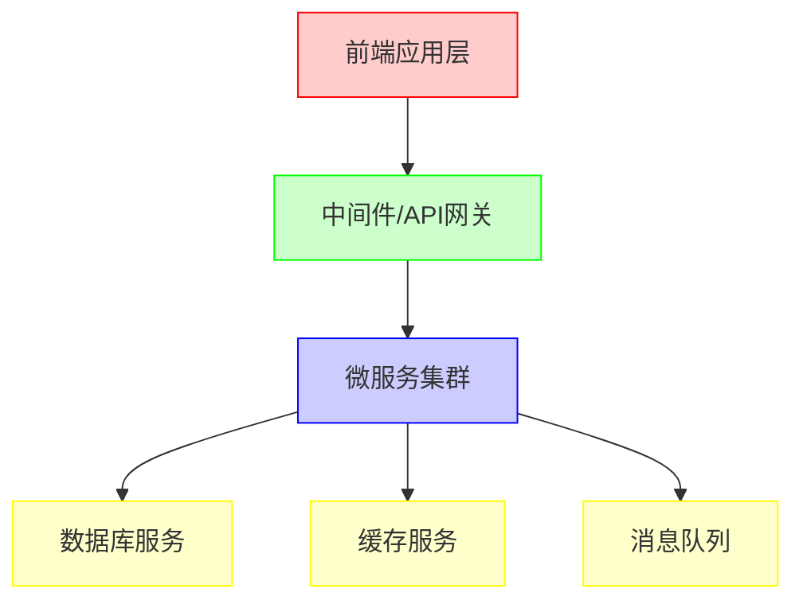
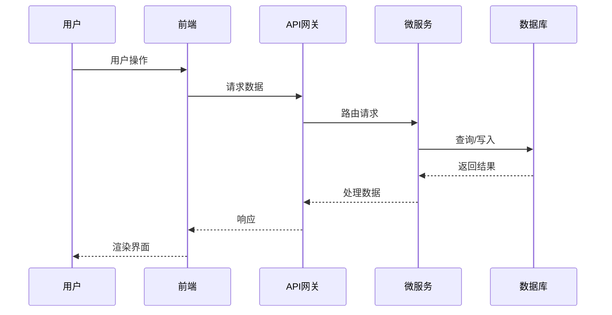
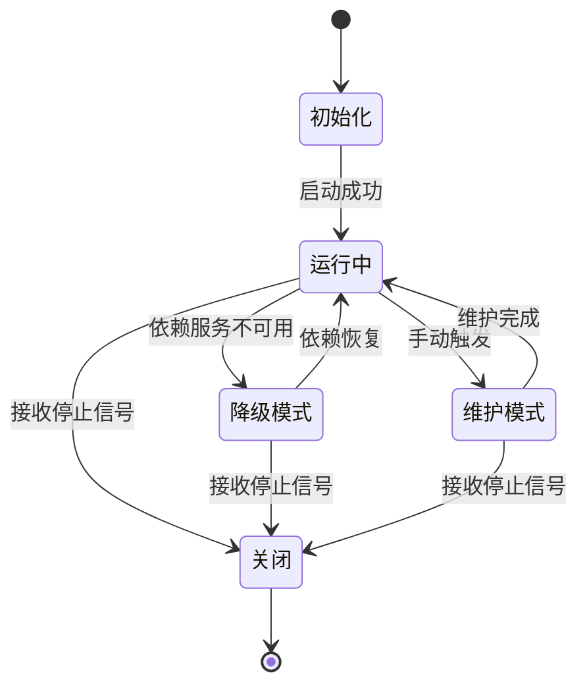

# 知识库导航

欢迎来到我的技术知识库！这里收集了我作为全栈开发工程师多年来的技术积累和经验总结。无论您是前端开发者、后端工程师，还是对全栈开发感兴趣的学习者，都能在这里找到有用的内容。

## 内容组织

知识库分为以下两大部分：

### [前端开发](/docs/frontend)
包含现代前端开发的各种技术、框架和最佳实践：
- JavaScript/TypeScript 核心概念
- React、Vue等框架的使用技巧
- 前端性能优化
- UI/UX设计原则
- 前端工程化与自动化

### [后端开发](/docs/backend) 
涵盖后端开发的关键技术和架构设计：
- 服务器端编程语言与框架
- 数据库设计与优化
- 微服务架构
- API设计规范
- 服务器部署与运维

## 技术栈概览

以下是我们的技术栈架构图：



### 前后端数据流

下面是一个典型的前后端数据流示意图：



## 代码示例

### React组件示例

下面是一个带有代码高亮的React组件示例：

```jsx
import React, { useState, useEffect } from 'react';

const UserProfile = ({ userId }) => {
  const [userData, setUserData] = useState(null);
  const [loading, setLoading] = useState(true);

  useEffect(() => {
    const fetchUserData = async () => {
      try {
        const response = await fetch(`/api/users/${userId}`);
        const data = await response.json();
        setUserData(data);
      } catch (error) {
        console.error('Error fetching user data:', error);
      } finally {
        setLoading(false);
      }
    };

    fetchUserData();
  }, [userId]);

  if (loading) return <div>Loading user profile...</div>;
  if (!userData) return <div>User not found</div>;

  return (
    <div className="user-profile">
      <h2>{userData.name}</h2>
      <p>Email: {userData.email}</p>
      <p>Role: {userData.role}</p>
      <p>Joined: {new Date(userData.createdAt).toLocaleDateString()}</p>
    </div>
  );
};

export default UserProfile;
```

### Java Spring Boot示例

后端API实现示例：

```java
@RestController
@RequestMapping("/api/users")
public class UserController {

    private final UserService userService;

    public UserController(UserService userService) {
        this.userService = userService;
    }

    @GetMapping("/{id}")
    public ResponseEntity<User> getUserById(@PathVariable Long id) {
        return userService.findById(id)
            .map(user -> ResponseEntity.ok().body(user))
            .orElse(ResponseEntity.notFound().build());
    }

    @PostMapping
    public ResponseEntity<User> createUser(@RequestBody User user) {
        User createdUser = userService.save(user);
        return ResponseEntity.created(URI.create("/api/users/" + createdUser.getId()))
            .body(createdUser);
    }
}
```

### TypeScript 示例

下面是一个 TypeScript 接口定义示例：

```typescript
export interface User {
  id: number;
  name: string;
  email: string;
  role: 'admin' | 'user' | 'guest';
  createdAt: string;
  profile?: {
    avatar: string;
    bio: string;
    location: string;
  };

  isActive: boolean;
}

export type UserPartial = Partial<User>;

export const isAdmin = (user: User): boolean => {
  return user.role === 'admin';
};
```

### CSS 样式示例

一些 CSS 样式代码：

```css
.user-profile {
  padding: 1.5rem;
  border-radius: 8px;
  box-shadow: 0 2px 8px rgba(0, 0, 0, 0.15);
  background-color: #fff;
  max-width: 600px;
  margin: 0 auto;
}

.user-profile h2 {
  color: #2c3e50;
  margin-bottom: 1rem;
  border-bottom: 1px solid #eee;
  padding-bottom: 0.5rem;
}

.user-profile p {
  margin-bottom: 0.75rem;
  color: #555;
}

.user-profile p:last-child { margin-bottom: 0; }
```

## 微服务架构设计

我们的微服务架构状态转换图：



## 如何使用本知识库

1. **浏览学习**：按照目录结构系统学习全栈开发知识
2. **问题解决**：使用搜索功能查找特定技术问题的解决方案
3. **技术提升**：通过最佳实践和架构设计案例提升技术能力

## 持续更新

本知识库将不断更新，添加新的技术文章和最佳实践。如果您有任何问题或建议，欢迎与我联系。

祝您学习愉快！
