# 考勤管理系统设计

:::tip 📌 重要说明：对标企业微信/钉钉考勤标准
本系统参考**企业微信**和**钉钉**的考勤管理标准，实现企业级考勤管理解决方案。

**系统核心特点**：
- ✅ **标准化流程**：对标主流平台的审批流程和规则
- ✅ **智能统计**：自动化考勤统计和月度汇总
- ✅ **多端支持**：Web端 + 移动端（预留接口）
- ✅ **灵活配置**：考勤规则、节假日、审批流程可配置
- ✅ **完善报表**：个人/部门/异常多维度报表

**技术栈**：
- 后端：Spring Boot 2.7.x + MyBatis-Plus 3.5.x + Spring Security + JWT
- 前端：Vue 3 + Element Plus + TypeScript + Pinia
- 数据库：MySQL 8.0 + Redis 6.0
- 定时任务：Quartz 2.3.x
- 工具库：Hutool、Lombok、MapStruct

**补卡规则说明**（参考钉钉/企业微信）：
- 每月最多补卡3次（可配置2-5次）
- 只能补最近7天内的打卡
- 补卡次数按月统计，每月1号重置
:::

## 一、项目概述

### 1.1 项目背景

随着企业信息化建设的深入，传统的人工考勤方式已无法满足现代企业管理需求。本系统旨在提供一套完整的、自动化的考勤管理解决方案，**对标企业微信和钉钉的考勤标准**，实现考勤打卡、请假出差、审批流转、统计报表等全流程管理。

### 1.2 设计目标

#### 业务目标
- ✅ **智能化**：自动计算考勤统计，智能识别异常
- ✅ **标准化**：对标企业微信/钉钉审批流程标准
- ✅ **可视化**：直观的日历视图和图表展示
- ✅ **移动化**：支持多端打卡（预留接口）

#### 技术目标
- ✅ **高性能**：支持千人级并发打卡
- ✅ **高可用**：7×24小时稳定运行
- ✅ **易扩展**：模块化设计，便于功能扩展
- ✅ **易维护**：清晰的代码结构和文档

### 1.3 核心功能

| 功能模块 | 核心功能 | 用户角色 |
|---------|---------|---------|
| 考勤打卡 | 上下班打卡、位置记录、异常标记 | 全员 |
| 请假管理 | 请假申请、审批流转、自动扣除考勤 | 全员、审批人 |
| 出差管理 | 出差申请、审批流转、出差期间免打卡 | 全员、审批人 |
| 补卡管理 | 补卡申请、审批后自动更新打卡记录 | 全员、审批人 |
| 考勤统计 | 日/月统计、自动计算工作时长 | 全员 |
| 考勤报表 | 个人报表、部门报表、异常报表 | 管理员、部门主管 |
| 规则配置 | 考勤规则、工作时间、节假日配置 | 管理员 |

### 1.4 用户角色

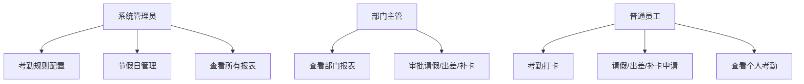

### 1.5 核心价值

| 价值点 | 说明 | 预期效果 |
|--------|------|----------|
| 🎯 **提升效率** | 自动化考勤统计，减少HR工作量 | 人力成本降低 50% |
| 📊 **数据准确** | 实时打卡记录，避免人工错误 | 数据准确率达 99.9% |
| 🔄 **流程规范** | 标准化审批流程，透明可追溯 | 审批效率提升 60% |
| 📈 **决策支持** | 多维度报表，辅助管理决策 | 决策效率提升 40% |

---

## 二、系统架构设计

### 2.1 总体架构

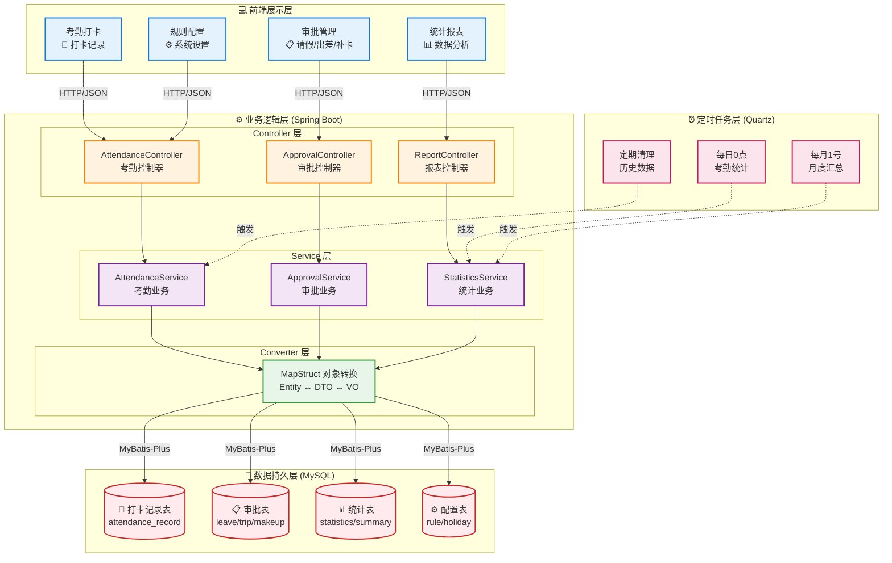

### 2.2 技术选型

#### 后端技术栈

| 技术 | 版本 | 用途 |
|------|------|------|
| Spring Boot | 2.7.x | 应用框架 |
| Spring Security | 5.7.x | 安全认证 |
| MyBatis-Plus | 3.5.x | ORM框架 |
| MySQL | 8.0+ | 关系数据库 |
| Redis | 6.0+ | 缓存/分布式锁 |
| Quartz | 2.3.x | 定时任务 |
| MapStruct | 1.5.5 | 对象映射 |
| JWT | - | Token认证 |
| Druid | 1.2.x | 数据库连接池 |

#### 前端技术栈

| 技术 | 版本 | 用途 |
|------|------|------|
| Vue.js | 3.x | 前端框架 |
| Element Plus | 2.x | UI组件库 |
| Axios | 1.x | HTTP客户端 |
| Pinia | 2.x | 状态管理 |
| Vue Router | 4.x | 路由管理 |
| ECharts | 5.x | 图表展示 |

### 2.3 分层架构设计

#### 表现层（Presentation Layer）
- **职责**：用户交互、数据展示、表单验证
- **组件**：Vue组件、Element Plus
- **特点**：响应式设计、前后端分离

#### 业务逻辑层（Business Logic Layer）
- **职责**：业务规则、流程控制、数据校验
- **组件**：Service服务、业务逻辑处理
- **特点**：事务管理、异常处理

#### 数据访问层（Data Access Layer）
- **职责**：数据CRUD、SQL执行
- **组件**：Mapper接口、MyBatis XML
- **特点**：SQL优化、连接池管理

#### 数据转换层（Converter Layer）
- **职责**：对象转换、数据映射
- **组件**：MapStruct接口
- **特点**：编译时生成、高性能

### 2.4 核心设计原则

1. **分层解耦**：严格按照MVC模式分层，降低耦合度
2. **单一职责**：每个类/方法只负责一个功能
3. **开闭原则**：对扩展开放，对修改关闭
4. **依赖倒置**：面向接口编程，而非具体实现
5. **里氏替换**：子类可以替换父类
6. **最少知识**：类之间减少依赖关系

---

## 三、功能模块设计

### 3.1 考勤打卡模块

#### 功能描述
员工通过系统进行上下班打卡，系统自动记录打卡时间、地点、方式，并判断是否正常。

#### 业务规则

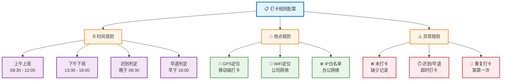

#### 流程设计

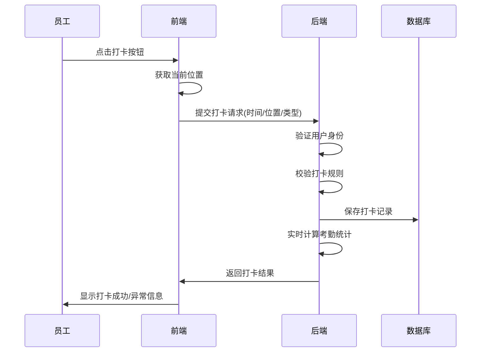

#### 数据流向

```
员工打卡 → 打卡记录表 → 实时统计 → 考勤统计表 → 月度汇总
```

### 3.2 请假管理模块

#### 功能描述
员工提交请假申请，审批人审批，审批通过后自动计算考勤统计，扣除相应考勤天数。

#### 请假类型

| 类型 | 代码 | 扣除考勤 | 需要证明 |
|------|------|---------|---------|
| 事假 | 1 | 是 | 否 |
| 病假 | 2 | 是 | 建议提供病假条 |
| 年假 | 3 | 否 | 否 |
| 调休 | 4 | 否 | 否 |
| 婚假 | 5 | 否 | 需要结婚证 |
| 产假 | 6 | 否 | 需要医院证明 |
| 丧假 | 7 | 否 | 需要相关证明 |

#### 审批流程

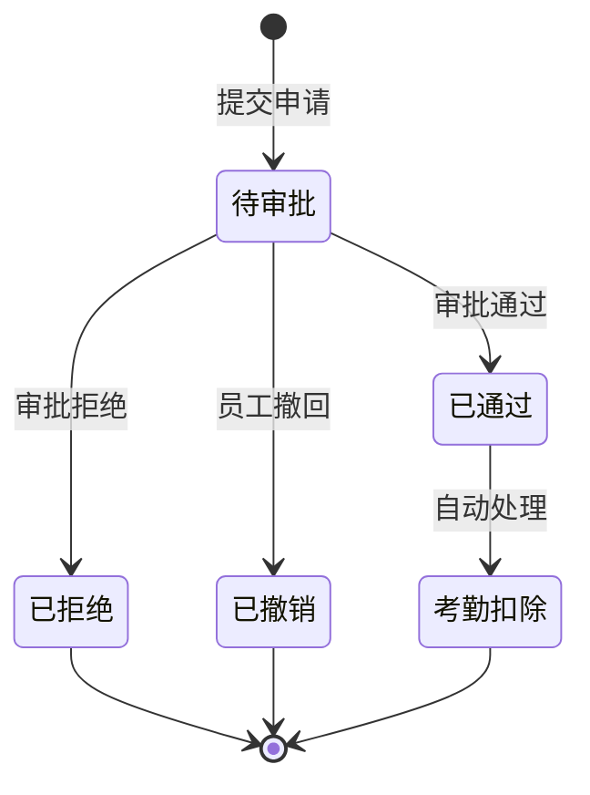

#### 业务规则

1. **状态流转**
   - 只有"待审批"状态才能审批或撤回
   - 审批后不可修改
   - 撤回后不可恢复

2. **权限控制**
   - 只有申请人本人可以撤回
   - 只有指定审批人可以审批
   - 管理员可以查看所有申请

3. **考勤影响**
   - 审批通过后次日自动校准考勤
   - 请假期间不计入迟到/早退
   - 扣除相应的应出勤天数

### 3.3 出差管理模块

#### 功能描述
员工提交出差申请，审批通过后出差期间免打卡，不影响考勤统计。

#### 业务规则

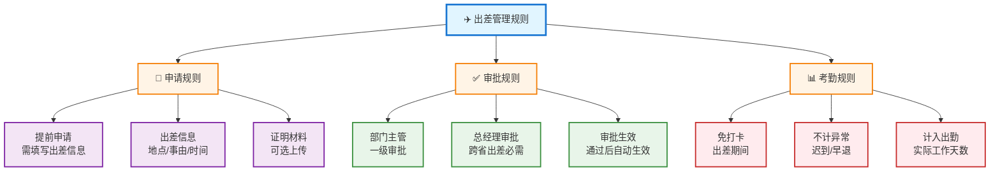

### 3.4 补卡管理模块

#### 功能描述
员工因特殊原因忘记打卡，可提交补卡申请，审批通过后自动创建打卡记录。

#### 核心流程

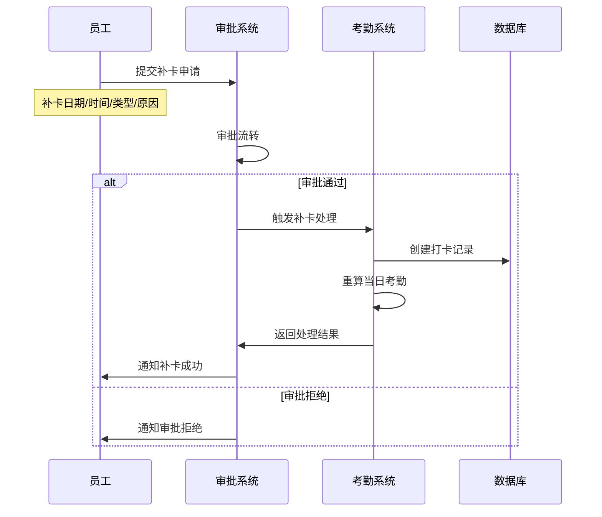

#### 业务规则

1. **补卡限制（参考钉钉/企业微信标准）**
   - **补卡次数**：每月最多补卡3次（可配置为2-5次）
   - **补卡时效**：只能补最近7天内的打卡
   - **补卡类型**：可以补上班卡或下班卡
   - **补卡场景**：
     - ✅ 忘记打卡（缺卡）
     - ✅ 打卡失败（系统故障）
     - ✅ 位置异常打卡（需要修正）
     - ❌ 已有正常打卡记录，不能重复补卡
   - **次数统计**：补卡次数按月统计，每月1号重置

2. **补卡校验规则**
   ```java
   // 补卡前置校验
   1. 检查当月已补卡次数 < 3次（或配置值）
   2. 检查补卡日期在最近7天内
   3. 检查该时段是否已有正常打卡记录
   4. 检查是否在工作日（节假日不允许补卡）
   5. 检查是否有请假/出差记录（有则不能补卡）
   ```

3. **审批后处理**
   - ✅ 自动创建打卡记录
   - ✅ 标记打卡来源为"补卡"
   - ✅ 累加当月补卡次数
   - ✅ 重新计算当日考勤统计
   - ✅ 更新月度汇总数据

### 3.5 考勤统计模块

#### 功能描述
自动统计员工每日、每月考勤数据，包括出勤天数、迟到次数、工作时长等。

#### 统计维度

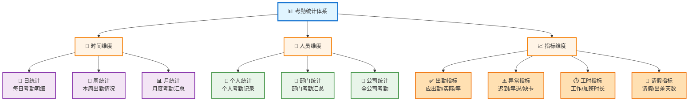

#### 计算规则

**应出勤天数计算**：
```
应出勤天数 = 当月总天数 - 周末天数 - 法定节假日天数 + 调休补班天数
```

**实际出勤天数计算**：
```
实际出勤天数 = 正常打卡天数 + 出差天数 + 年假天数 + 其他不扣除考勤的假期
```

**出勤率计算**：
```
出勤率 = (实际出勤天数 / 应出勤天数) × 100%
```

**工作时长计算**：
```
日工作时长 = 下午打卡时间 - 上午打卡时间 - 午休时间
月工作时长 = ∑ 日工作时长
```

#### 定时任务设计

| 任务名称 | 执行时间 | 执行内容 |
|---------|---------|---------|
| 每日统计任务 | 每天 01:00 | 统计昨日所有员工考勤数据 |
| 每月汇总任务 | 每月1号 01:00 | 生成上月考勤月报 |
| 数据清理任务 | 每月1号 02:00 | 清理6个月前的详细数据 |

#### 统计SQL实现

**1. 每日考勤统计SQL**

```sql
-- 统计某一天的考勤数据（插入或更新统计表）
INSERT INTO attendance_statistics (
    user_id, 
    stat_date, 
    am_in_time, 
    pm_out_time,
    is_late,
    late_minutes,
    is_early,
    early_minutes,
    is_absence,
    absence_times,
    work_hours,
    status
)
SELECT 
    u.user_id,
    DATE('2025-01-28') AS stat_date,
    
    -- 上午上班时间（取当天最早的上班打卡）
    MIN(CASE WHEN r.check_type = '1' THEN r.check_time END) AS am_in_time,
    
    -- 下午下班时间（取当天最晚的下班打卡）
    MAX(CASE WHEN r.check_type = '2' THEN r.check_time END) AS pm_out_time,
    
    -- 是否迟到（上班时间晚于8:30）
    CASE 
        WHEN MIN(CASE WHEN r.check_type = '1' THEN r.check_time END) > DATE_ADD(DATE('2025-01-28'), INTERVAL 8*60+30 MINUTE)
        THEN '1' 
        ELSE '0' 
    END AS is_late,
    
    -- 迟到分钟数
    CASE 
        WHEN MIN(CASE WHEN r.check_type = '1' THEN r.check_time END) > DATE_ADD(DATE('2025-01-28'), INTERVAL 8*60+30 MINUTE)
        THEN TIMESTAMPDIFF(MINUTE, DATE_ADD(DATE('2025-01-28'), INTERVAL 8*60+30 MINUTE), 
                          MIN(CASE WHEN r.check_type = '1' THEN r.check_time END))
        ELSE 0 
    END AS late_minutes,
    
    -- 是否早退（下班时间早于18:00）
    CASE 
        WHEN MAX(CASE WHEN r.check_type = '2' THEN r.check_time END) < DATE_ADD(DATE('2025-01-28'), INTERVAL 18*60 MINUTE)
        THEN '1' 
        ELSE '0' 
    END AS is_early,
    
    -- 早退分钟数
    CASE 
        WHEN MAX(CASE WHEN r.check_type = '2' THEN r.check_time END) < DATE_ADD(DATE('2025-01-28'), INTERVAL 18*60 MINUTE)
        THEN TIMESTAMPDIFF(MINUTE, MAX(CASE WHEN r.check_type = '2' THEN r.check_time END),
                          DATE_ADD(DATE('2025-01-28'), INTERVAL 18*60 MINUTE))
        ELSE 0 
    END AS early_minutes,
    
    -- 是否缺卡（上班或下班打卡缺失）
    CASE 
        WHEN MIN(CASE WHEN r.check_type = '1' THEN r.check_time END) IS NULL 
          OR MAX(CASE WHEN r.check_type = '2' THEN r.check_time END) IS NULL
        THEN '1' 
        ELSE '0' 
    END AS is_absence,
    
    -- 缺卡次数
    CASE 
        WHEN MIN(CASE WHEN r.check_type = '1' THEN r.check_time END) IS NULL THEN 1 ELSE 0 
    END + 
    CASE 
        WHEN MAX(CASE WHEN r.check_type = '2' THEN r.check_time END) IS NULL THEN 1 ELSE 0 
    END AS absence_times,
    
    -- 工作时长（下班-上班-午休1.5小时）
    CASE 
        WHEN MIN(CASE WHEN r.check_type = '1' THEN r.check_time END) IS NOT NULL 
         AND MAX(CASE WHEN r.check_type = '2' THEN r.check_time END) IS NOT NULL
        THEN ROUND(
            TIMESTAMPDIFF(MINUTE, 
                MIN(CASE WHEN r.check_type = '1' THEN r.check_time END),
                MAX(CASE WHEN r.check_type = '2' THEN r.check_time END)
            ) / 60.0 - 1.5, 2
        )
        ELSE 0 
    END AS work_hours,
    
    -- 状态判断
    CASE 
        -- 优先判断请假
        WHEN EXISTS (
            SELECT 1 FROM attendance_leave l 
            WHERE l.user_id = u.user_id 
              AND l.status = '1'
              AND DATE('2025-01-28') BETWEEN DATE(l.start_time) AND DATE(l.end_time)
        ) THEN '请假'
        
        -- 判断出差
        WHEN EXISTS (
            SELECT 1 FROM attendance_trip t 
            WHERE t.user_id = u.user_id 
              AND t.status = '1'
              AND DATE('2025-01-28') BETWEEN DATE(t.start_time) AND DATE(t.end_time)
        ) THEN '出差'
        
        -- 判断缺卡
        WHEN MIN(CASE WHEN r.check_type = '1' THEN r.check_time END) IS NULL 
          OR MAX(CASE WHEN r.check_type = '2' THEN r.check_time END) IS NULL
        THEN '缺卡'
        
        -- 判断迟到
        WHEN MIN(CASE WHEN r.check_type = '1' THEN r.check_time END) > DATE_ADD(DATE('2025-01-28'), INTERVAL 8*60+30 MINUTE)
        THEN '迟到'
        
        -- 判断早退
        WHEN MAX(CASE WHEN r.check_type = '2' THEN r.check_time END) < DATE_ADD(DATE('2025-01-28'), INTERVAL 18*60 MINUTE)
        THEN '早退'
        
        ELSE '正常'
    END AS status
    
FROM sys_user u
LEFT JOIN attendance_record r ON u.user_id = r.user_id 
    AND DATE(r.check_time) = DATE('2025-01-28')
WHERE u.status = '0'  -- 只统计在职员工
GROUP BY u.user_id
ON DUPLICATE KEY UPDATE
    am_in_time = VALUES(am_in_time),
    pm_out_time = VALUES(pm_out_time),
    is_late = VALUES(is_late),
    late_minutes = VALUES(late_minutes),
    is_early = VALUES(is_early),
    early_minutes = VALUES(early_minutes),
    is_absence = VALUES(is_absence),
    absence_times = VALUES(absence_times),
    work_hours = VALUES(work_hours),
    status = VALUES(status);
```

**2. 月度考勤汇总SQL**

```sql
-- 生成某月的考勤汇总报表
INSERT INTO attendance_monthly_summary (
    user_id,
    year_month,
    work_days,
    actual_days,
    late_times,
    early_times,
    absence_times,
    leave_days,
    trip_days,
    work_hours,
    attendance_rate
)
SELECT 
    u.user_id,
    '2025-01' AS year_month,
    
    -- 应出勤天数 = 当月天数 - 周末天数 - 节假日天数 + 补班天数
    (
        DAY(LAST_DAY('2025-01-01'))  -- 当月总天数
        - (
            -- 周末天数
            SELECT COUNT(*) 
            FROM (
                SELECT DATE_ADD('2025-01-01', INTERVAL seq DAY) AS d
                FROM (
                    SELECT a.N + b.N * 10 AS seq
                    FROM 
                        (SELECT 0 AS N UNION SELECT 1 UNION SELECT 2 UNION SELECT 3 UNION SELECT 4 
                         UNION SELECT 5 UNION SELECT 6 UNION SELECT 7 UNION SELECT 8 UNION SELECT 9) a,
                        (SELECT 0 AS N UNION SELECT 1 UNION SELECT 2 UNION SELECT 3) b
                ) nums
                WHERE DATE_ADD('2025-01-01', INTERVAL seq DAY) <= LAST_DAY('2025-01-01')
            ) dates
            WHERE DAYOFWEEK(d) IN (1, 7)  -- 周日=1, 周六=7
        )
        - (
            -- 法定节假日天数（排除补班日）
            SELECT COUNT(*) 
            FROM attendance_holiday 
            WHERE holiday_date BETWEEN '2025-01-01' AND LAST_DAY('2025-01-01')
              AND holiday_type = '0'
        )
        + (
            -- 补班天数
            SELECT COUNT(*) 
            FROM attendance_holiday 
            WHERE holiday_date BETWEEN '2025-01-01' AND LAST_DAY('2025-01-01')
              AND holiday_type = '1'
        )
    ) AS work_days,
    
    -- 实际出勤天数（正常+迟到+早退）
    COALESCE((
        SELECT COUNT(*) 
        FROM attendance_statistics s
        WHERE s.user_id = u.user_id
          AND s.stat_date BETWEEN '2025-01-01' AND LAST_DAY('2025-01-01')
          AND s.status IN ('正常', '迟到', '早退')
    ), 0) AS actual_days,
    
    -- 迟到次数
    COALESCE((
        SELECT COUNT(*) 
        FROM attendance_statistics s
        WHERE s.user_id = u.user_id
          AND s.stat_date BETWEEN '2025-01-01' AND LAST_DAY('2025-01-01')
          AND s.is_late = '1'
    ), 0) AS late_times,
    
    -- 早退次数
    COALESCE((
        SELECT COUNT(*) 
        FROM attendance_statistics s
        WHERE s.user_id = u.user_id
          AND s.stat_date BETWEEN '2025-01-01' AND LAST_DAY('2025-01-01')
          AND s.is_early = '1'
    ), 0) AS early_times,
    
    -- 缺卡次数
    COALESCE((
        SELECT SUM(s.absence_times) 
        FROM attendance_statistics s
        WHERE s.user_id = u.user_id
          AND s.stat_date BETWEEN '2025-01-01' AND LAST_DAY('2025-01-01')
    ), 0) AS absence_times,
    
    -- 请假天数
    COALESCE((
        SELECT SUM(l.leave_days) 
        FROM attendance_leave l
        WHERE l.user_id = u.user_id
          AND l.status = '1'
          AND (
              (DATE(l.start_time) BETWEEN '2025-01-01' AND LAST_DAY('2025-01-01'))
              OR (DATE(l.end_time) BETWEEN '2025-01-01' AND LAST_DAY('2025-01-01'))
              OR (DATE(l.start_time) <= '2025-01-01' AND DATE(l.end_time) >= LAST_DAY('2025-01-01'))
          )
    ), 0) AS leave_days,
    
    -- 出差天数
    COALESCE((
        SELECT SUM(t.trip_days) 
        FROM attendance_trip t
        WHERE t.user_id = u.user_id
          AND t.status = '1'
          AND (
              (DATE(t.start_time) BETWEEN '2025-01-01' AND LAST_DAY('2025-01-01'))
              OR (DATE(t.end_time) BETWEEN '2025-01-01' AND LAST_DAY('2025-01-01'))
              OR (DATE(t.start_time) <= '2025-01-01' AND DATE(t.end_time) >= LAST_DAY('2025-01-01'))
          )
    ), 0) AS trip_days,
    
    -- 工作时长
    COALESCE((
        SELECT SUM(s.work_hours) 
        FROM attendance_statistics s
        WHERE s.user_id = u.user_id
          AND s.stat_date BETWEEN '2025-01-01' AND LAST_DAY('2025-01-01')
    ), 0) AS work_hours,
    
    -- 出勤率（实际出勤/应出勤*100）
    ROUND(
        COALESCE((
            SELECT COUNT(*) 
            FROM attendance_statistics s
            WHERE s.user_id = u.user_id
              AND s.stat_date BETWEEN '2025-01-01' AND LAST_DAY('2025-01-01')
              AND s.status IN ('正常', '迟到', '早退')
        ), 0) * 100.0 / 
        GREATEST((
            DAY(LAST_DAY('2025-01-01'))
            - (SELECT COUNT(*) FROM (
                SELECT DATE_ADD('2025-01-01', INTERVAL seq DAY) AS d
                FROM (
                    SELECT a.N + b.N * 10 AS seq
                    FROM 
                        (SELECT 0 AS N UNION SELECT 1 UNION SELECT 2 UNION SELECT 3 UNION SELECT 4 
                         UNION SELECT 5 UNION SELECT 6 UNION SELECT 7 UNION SELECT 8 UNION SELECT 9) a,
                        (SELECT 0 AS N UNION SELECT 1 UNION SELECT 2 UNION SELECT 3) b
                ) nums
                WHERE DATE_ADD('2025-01-01', INTERVAL seq DAY) <= LAST_DAY('2025-01-01')
            ) dates WHERE DAYOFWEEK(d) IN (1, 7))
            - COALESCE((SELECT COUNT(*) FROM attendance_holiday 
                WHERE holiday_date BETWEEN '2025-01-01' AND LAST_DAY('2025-01-01')
                  AND holiday_type = '0'), 0)
            + COALESCE((SELECT COUNT(*) FROM attendance_holiday 
                WHERE holiday_date BETWEEN '2025-01-01' AND LAST_DAY('2025-01-01')
                  AND holiday_type = '1'), 0)
        ), 1),
        2
    ) AS attendance_rate
    
FROM sys_user u
WHERE u.status = '0'  -- 只统计在职员工
ON DUPLICATE KEY UPDATE
    work_days = VALUES(work_days),
    actual_days = VALUES(actual_days),
    late_times = VALUES(late_times),
    early_times = VALUES(early_times),
    absence_times = VALUES(absence_times),
    leave_days = VALUES(leave_days),
    trip_days = VALUES(trip_days),
    work_hours = VALUES(work_hours),
    attendance_rate = VALUES(attendance_rate);
```

**3. 查询个人月度统计**

```sql
-- 查询某用户某月的考勤统计
SELECT 
    user_id,
    year_month,
    work_days AS '应出勤天数',
    actual_days AS '实际出勤天数',
    late_times AS '迟到次数',
    early_times AS '早退次数',
    absence_times AS '缺卡次数',
    leave_days AS '请假天数',
    trip_days AS '出差天数',
    work_hours AS '工作时长(小时)',
    attendance_rate AS '出勤率(%)'
FROM attendance_monthly_summary
WHERE user_id = 1
  AND year_month = '2025-01';
```

**4. 查询部门考勤报表**

```sql
-- 查询某部门某月的考勤汇总
SELECT 
    u.user_id,
    u.user_name,
    u.nick_name,
    d.dept_name,
    s.work_days AS '应出勤',
    s.actual_days AS '实际出勤',
    s.attendance_rate AS '出勤率(%)',
    s.late_times AS '迟到',
    s.early_times AS '早退',
    s.absence_times AS '缺卡',
    s.leave_days AS '请假',
    s.work_hours AS '工时'
FROM attendance_monthly_summary s
INNER JOIN sys_user u ON s.user_id = u.user_id
INNER JOIN sys_dept d ON u.dept_id = d.dept_id
WHERE d.dept_id = 1
  AND s.year_month = '2025-01'
ORDER BY s.attendance_rate DESC;
```

**5. 查询异常考勤明细**

```sql
-- 查询某月迟到明细
SELECT 
    u.user_id,
    u.user_name,
    u.nick_name,
    d.dept_name,
    s.stat_date AS '日期',
    s.am_in_time AS '上班打卡时间',
    s.late_minutes AS '迟到分钟数',
    s.remark AS '备注'
FROM attendance_statistics s
INNER JOIN sys_user u ON s.user_id = u.user_id
INNER JOIN sys_dept d ON u.dept_id = d.dept_id
WHERE s.stat_date BETWEEN '2025-01-01' AND LAST_DAY('2025-01-01')
  AND s.is_late = '1'
ORDER BY s.stat_date DESC, s.late_minutes DESC;
```

### 3.6 考勤报表模块

#### 功能描述
提供多维度的考勤报表，支持导出Excel，方便管理层决策。

#### 报表类型

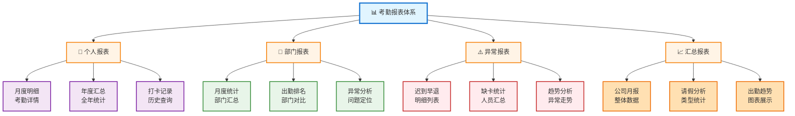

#### 数据展示

1. **表格展示**：详细的数据列表
2. **图表展示**：柱状图、折线图、饼图
3. **日历展示**：直观的日历视图
4. **导出功能**：支持Excel导出

### 3.7 规则配置模块

#### 功能描述
系统管理员配置考勤规则、工作时间、节假日等基础数据。

#### 配置项

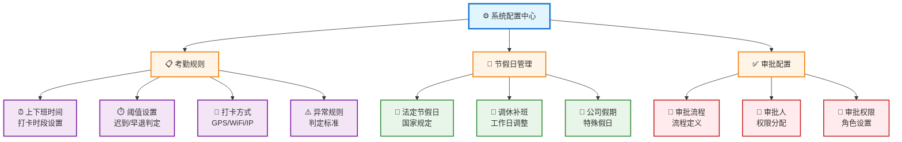

---

## 四、业务流程设计

### 4.1 考勤打卡完整流程

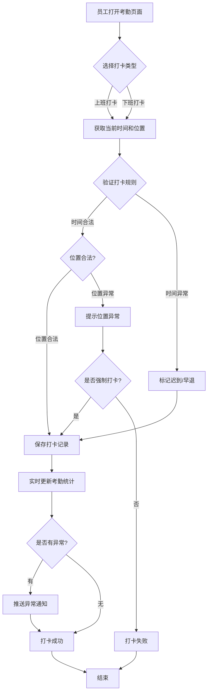

### 4.2 请假审批完整流程

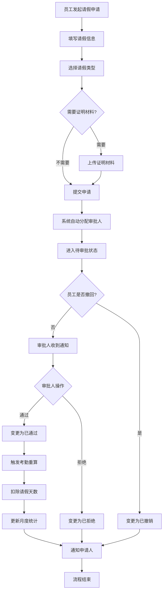

### 4.3 补卡审批与考勤更新流程

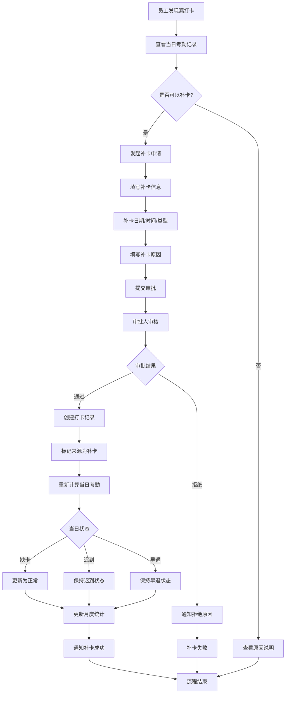

### 4.4 月度考勤统计流程

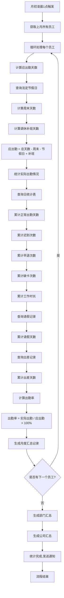

### 4.5 异常考勤处理流程

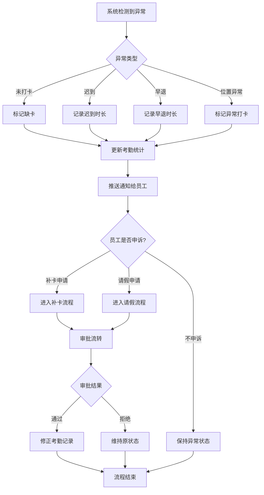

---

## 五、数据库设计

### 5.1 数据库架构

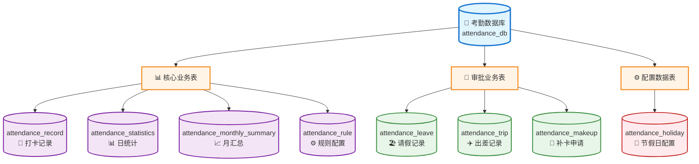

### 5.2 核心表设计

#### 5.2.1 打卡记录表 (attendance_record)

**表说明**：记录员工每次打卡的详细信息

```sql
CREATE TABLE `attendance_record` (
  `record_id` BIGINT NOT NULL AUTO_INCREMENT COMMENT '主键ID',
  `user_id` BIGINT NOT NULL COMMENT '用户ID',
  `check_time` DATETIME NOT NULL COMMENT '打卡时间',
  `check_type` VARCHAR(10) NOT NULL COMMENT '打卡类型(1上班2下班)',
  `check_source` VARCHAR(20) NOT NULL COMMENT '打卡来源(移动端/PC端/补卡)',
  `location` VARCHAR(200) DEFAULT NULL COMMENT '打卡位置',
  `latitude` DECIMAL(10,7) DEFAULT NULL COMMENT '纬度',
  `longitude` DECIMAL(10,7) DEFAULT NULL COMMENT '经度',
  `is_normal` CHAR(1) NOT NULL DEFAULT '1' COMMENT '是否正常(0否1是)',
  `remark` VARCHAR(500) DEFAULT NULL COMMENT '备注',
  `create_time` DATETIME NOT NULL DEFAULT CURRENT_TIMESTAMP COMMENT '创建时间',
  PRIMARY KEY (`record_id`),
  KEY `idx_user_time` (`user_id`, `check_time`),
  KEY `idx_check_time` (`check_time`)
) ENGINE=InnoDB DEFAULT CHARSET=utf8mb4 COMMENT='打卡记录表';
```

#### 5.2.2 考勤统计表 (attendance_statistics)

**表说明**：每日考勤统计数据，用于快速查询

```sql
CREATE TABLE `attendance_statistics` (
  `stat_id` BIGINT NOT NULL AUTO_INCREMENT COMMENT '主键ID',
  `user_id` BIGINT NOT NULL COMMENT '用户ID',
  `stat_date` DATE NOT NULL COMMENT '统计日期',
  `am_in_time` DATETIME DEFAULT NULL COMMENT '上午上班时间',
  `am_out_time` DATETIME DEFAULT NULL COMMENT '上午下班时间',
  `pm_in_time` DATETIME DEFAULT NULL COMMENT '下午上班时间',
  `pm_out_time` DATETIME DEFAULT NULL COMMENT '下午下班时间',
  `is_late` CHAR(1) NOT NULL DEFAULT '0' COMMENT '是否迟到(0否1是)',
  `late_minutes` INT DEFAULT NULL COMMENT '迟到分钟数',
  `is_early` CHAR(1) NOT NULL DEFAULT '0' COMMENT '是否早退(0否1是)',
  `early_minutes` INT DEFAULT NULL COMMENT '早退分钟数',
  `is_absence` CHAR(1) NOT NULL DEFAULT '0' COMMENT '是否缺卡(0否1是)',
  `absence_times` INT DEFAULT 0 COMMENT '缺卡次数',
  `work_hours` DECIMAL(5,2) DEFAULT NULL COMMENT '工作时长(小时)',
  `status` VARCHAR(20) NOT NULL COMMENT '状态(正常/迟到/早退/缺卡/请假/出差)',
  `remark` VARCHAR(500) DEFAULT NULL COMMENT '备注',
  PRIMARY KEY (`stat_id`),
  UNIQUE KEY `uk_user_date` (`user_id`, `stat_date`),
  KEY `idx_stat_date` (`stat_date`)
) ENGINE=InnoDB DEFAULT CHARSET=utf8mb4 COMMENT='考勤统计表';
```

#### 5.2.3 月度汇总表 (attendance_monthly_summary)

**表说明**：每月考勤汇总数据

```sql
CREATE TABLE `attendance_monthly_summary` (
  `summary_id` BIGINT NOT NULL AUTO_INCREMENT COMMENT '主键ID',
  `user_id` BIGINT NOT NULL COMMENT '用户ID',
  `year_month` VARCHAR(7) NOT NULL COMMENT '年月(YYYY-MM)',
  `work_days` INT NOT NULL COMMENT '应出勤天数',
  `actual_days` INT NOT NULL COMMENT '实际出勤天数',
  `late_times` INT NOT NULL DEFAULT 0 COMMENT '迟到次数',
  `early_times` INT NOT NULL DEFAULT 0 COMMENT '早退次数',
  `absence_times` INT NOT NULL DEFAULT 0 COMMENT '缺卡次数',
  `leave_days` DECIMAL(5,1) DEFAULT 0 COMMENT '请假天数',
  `trip_days` DECIMAL(5,1) DEFAULT 0 COMMENT '出差天数',
  `work_hours` DECIMAL(8,2) DEFAULT NULL COMMENT '工作时长(小时)',
  `attendance_rate` DECIMAL(5,2) DEFAULT NULL COMMENT '出勤率(%)',
  PRIMARY KEY (`summary_id`),
  UNIQUE KEY `uk_user_month` (`user_id`, `year_month`)
) ENGINE=InnoDB DEFAULT CHARSET=utf8mb4 COMMENT='月度汇总表';
```

#### 5.2.4 请假记录表 (attendance_leave)

**表说明**：员工请假申请记录

```sql
CREATE TABLE `attendance_leave` (
  `leave_id` BIGINT NOT NULL AUTO_INCREMENT COMMENT '主键ID',
  `user_id` BIGINT NOT NULL COMMENT '用户ID',
  `leave_type` VARCHAR(10) NOT NULL COMMENT '请假类型(1事假2病假3年假4调休5婚假6产假7丧假)',
  `start_time` DATETIME NOT NULL COMMENT '开始时间',
  `end_time` DATETIME NOT NULL COMMENT '结束时间',
  `leave_days` DECIMAL(5,1) NOT NULL COMMENT '请假天数',
  `reason` VARCHAR(500) NOT NULL COMMENT '请假原因',
  `proof_url` VARCHAR(500) DEFAULT NULL COMMENT '证明材料URL',
  `status` CHAR(1) NOT NULL DEFAULT '0' COMMENT '审批状态(0待审批1通过2拒绝3撤销)',
  `approver_id` BIGINT DEFAULT NULL COMMENT '审批人ID',
  `approve_time` DATETIME DEFAULT NULL COMMENT '审批时间',
  `approve_remark` VARCHAR(500) DEFAULT NULL COMMENT '审批备注',
  `create_time` DATETIME NOT NULL DEFAULT CURRENT_TIMESTAMP COMMENT '创建时间',
  `update_time` DATETIME DEFAULT NULL ON UPDATE CURRENT_TIMESTAMP COMMENT '更新时间',
  PRIMARY KEY (`leave_id`),
  KEY `idx_user_status` (`user_id`, `status`),
  KEY `idx_start_time` (`start_time`)
) ENGINE=InnoDB DEFAULT CHARSET=utf8mb4 COMMENT='请假记录表';
```

#### 5.2.5 出差记录表 (attendance_trip)

**表说明**：员工出差申请记录

```sql
CREATE TABLE `attendance_trip` (
  `trip_id` BIGINT NOT NULL AUTO_INCREMENT COMMENT '主键ID',
  `user_id` BIGINT NOT NULL COMMENT '用户ID',
  `destination` VARCHAR(200) NOT NULL COMMENT '出差地点',
  `start_time` DATETIME NOT NULL COMMENT '开始时间',
  `end_time` DATETIME NOT NULL COMMENT '结束时间',
  `trip_days` DECIMAL(5,1) NOT NULL COMMENT '出差天数',
  `reason` VARCHAR(500) NOT NULL COMMENT '出差事由',
  `proof_url` VARCHAR(500) DEFAULT NULL COMMENT '证明材料URL',
  `status` CHAR(1) NOT NULL DEFAULT '0' COMMENT '审批状态(0待审批1通过2拒绝3撤销)',
  `approver_id` BIGINT DEFAULT NULL COMMENT '审批人ID',
  `approve_time` DATETIME DEFAULT NULL COMMENT '审批时间',
  `approve_remark` VARCHAR(500) DEFAULT NULL COMMENT '审批备注',
  `create_time` DATETIME NOT NULL DEFAULT CURRENT_TIMESTAMP COMMENT '创建时间',
  `update_time` DATETIME DEFAULT NULL ON UPDATE CURRENT_TIMESTAMP COMMENT '更新时间',
  PRIMARY KEY (`trip_id`),
  KEY `idx_user_status` (`user_id`, `status`),
  KEY `idx_start_time` (`start_time`)
) ENGINE=InnoDB DEFAULT CHARSET=utf8mb4 COMMENT='出差记录表';
```

#### 5.2.6 补卡申请表 (attendance_makeup)

**表说明**：员工补卡申请记录

```sql
CREATE TABLE `attendance_makeup` (
  `makeup_id` BIGINT NOT NULL AUTO_INCREMENT COMMENT '主键ID',
  `user_id` BIGINT NOT NULL COMMENT '用户ID',
  `makeup_date` DATE NOT NULL COMMENT '补卡日期',
  `makeup_time` TIME NOT NULL COMMENT '补卡时间',
  `check_type` VARCHAR(10) NOT NULL COMMENT '打卡类型(1上班2下班)',
  `reason` VARCHAR(500) NOT NULL COMMENT '补卡原因',
  `status` CHAR(1) NOT NULL DEFAULT '0' COMMENT '审批状态(0待审批1通过2拒绝3撤销)',
  `approver_id` BIGINT DEFAULT NULL COMMENT '审批人ID',
  `approve_time` DATETIME DEFAULT NULL COMMENT '审批时间',
  `approve_remark` VARCHAR(500) DEFAULT NULL COMMENT '审批备注',
  `create_time` DATETIME NOT NULL DEFAULT CURRENT_TIMESTAMP COMMENT '创建时间',
  `update_time` DATETIME DEFAULT NULL ON UPDATE CURRENT_TIMESTAMP COMMENT '更新时间',
  PRIMARY KEY (`makeup_id`),
  KEY `idx_user_status` (`user_id`, `status`),
  KEY `idx_makeup_date` (`makeup_date`)
) ENGINE=InnoDB DEFAULT CHARSET=utf8mb4 COMMENT='补卡申请表';
```

#### 5.2.7 节假日配置表 (attendance_holiday)

**表说明**：法定节假日和调休补班日配置

```sql
CREATE TABLE `attendance_holiday` (
  `holiday_id` BIGINT NOT NULL AUTO_INCREMENT COMMENT '主键ID',
  `holiday_date` DATE NOT NULL COMMENT '日期',
  `holiday_type` CHAR(1) NOT NULL COMMENT '类型(0节假日1补班日)',
  `holiday_name` VARCHAR(100) NOT NULL COMMENT '节假日名称',
  `remark` VARCHAR(500) DEFAULT NULL COMMENT '备注',
  `create_time` DATETIME NOT NULL DEFAULT CURRENT_TIMESTAMP COMMENT '创建时间',
  PRIMARY KEY (`holiday_id`),
  UNIQUE KEY `uk_date` (`holiday_date`),
  KEY `idx_type` (`holiday_type`)
) ENGINE=InnoDB DEFAULT CHARSET=utf8mb4 COMMENT='节假日配置表';
```

#### 5.2.8 考勤规则表 (attendance_rule)

**表说明**：考勤规则配置

```sql
CREATE TABLE `attendance_rule` (
  `rule_id` BIGINT NOT NULL AUTO_INCREMENT COMMENT '主键ID',
  `rule_name` VARCHAR(100) NOT NULL COMMENT '规则名称',
  `am_start_time` TIME NOT NULL COMMENT '上午上班时间',
  `am_end_time` TIME NOT NULL COMMENT '上午下班时间',
  `pm_start_time` TIME NOT NULL COMMENT '下午上班时间',
  `pm_end_time` TIME NOT NULL COMMENT '下午下班时间',
  `late_threshold` INT DEFAULT 0 COMMENT '迟到阈值(分钟)',
  `early_threshold` INT DEFAULT 0 COMMENT '早退阈值(分钟)',
  `is_location_check` CHAR(1) DEFAULT '1' COMMENT '是否位置校验(0否1是)',
  `location_range` INT DEFAULT 500 COMMENT '位置范围(米)',
  `is_default` CHAR(1) DEFAULT '0' COMMENT '是否默认规则(0否1是)',
  `remark` VARCHAR(500) DEFAULT NULL COMMENT '备注',
  `create_time` DATETIME NOT NULL DEFAULT CURRENT_TIMESTAMP COMMENT '创建时间',
  `update_time` DATETIME DEFAULT NULL ON UPDATE CURRENT_TIMESTAMP COMMENT '更新时间',
  PRIMARY KEY (`rule_id`)
) ENGINE=InnoDB DEFAULT CHARSET=utf8mb4 COMMENT='考勤规则表';
```

### 5.3 数据关系图（ER图）

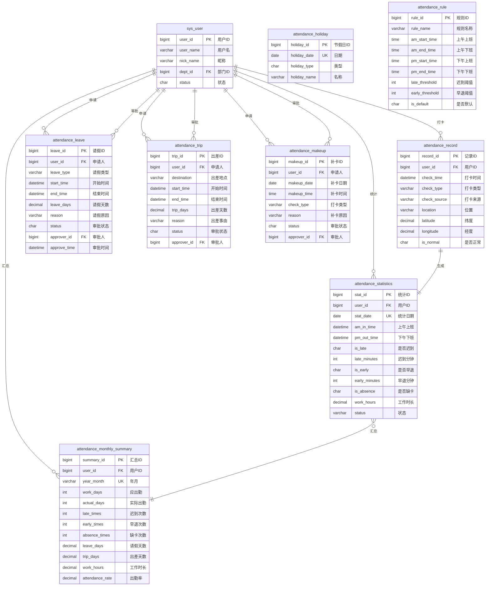

**关系说明**：

| 关系 | 说明 | 类型 |
|-----|------|------|
| sys_user → attendance_record | 一个用户有多条打卡记录 | 1:N |
| sys_user → attendance_statistics | 一个用户有多条日统计 | 1:N |
| sys_user → attendance_monthly_summary | 一个用户有多条月汇总 | 1:N |
| sys_user → attendance_leave/trip/makeup | 一个用户可以有多个申请 | 1:N |
| sys_user(审批人) → attendance_leave/trip/makeup | 一个审批人可以审批多个申请 | 1:N |
| attendance_record → attendance_statistics | 多条打卡记录生成一条日统计 | N:1 |
| attendance_statistics → attendance_monthly_summary | 多条日统计汇总为一条月汇总 | N:1 |

### 5.4 数据字典

#### 打卡类型 (check_type)
| 代码 | 名称 | 说明 |
|------|------|------|
| 1 | 上班打卡 | 上午上班、下午上班 |
| 2 | 下班打卡 | 上午下班、下午下班 |

#### 打卡来源 (check_source)
| 代码 | 名称 | 说明 |
|------|------|------|
| 移动端 | 手机APP | 移动设备打卡 |
| PC端 | 电脑网页 | 电脑网页打卡 |
| 补卡 | 补卡审批 | 补卡审批通过后创建 |

#### 考勤状态 (status)
| 代码 | 名称 | 说明 |
|------|------|------|
| 正常 | 正常出勤 | 按时打卡，无异常 |
| 迟到 | 迟到 | 上班打卡超时 |
| 早退 | 早退 | 下班打卡提前 |
| 缺卡 | 缺卡 | 缺少打卡记录 |
| 请假 | 请假 | 当天有请假 |
| 出差 | 出差 | 当天在出差 |

#### 审批状态 (status)
| 代码 | 名称 | 说明 |
|------|------|------|
| 0 | 待审批 | 已提交，等待审批 |
| 1 | 已通过 | 审批通过 |
| 2 | 已拒绝 | 审批拒绝 |
| 3 | 已撤销 | 申请人撤回 |

#### 请假类型 (leave_type)
| 代码 | 名称 | 扣除考勤 |
|------|------|---------|
| 1 | 事假 | 是 |
| 2 | 病假 | 是 |
| 3 | 年假 | 否 |
| 4 | 调休 | 否 |
| 5 | 婚假 | 否 |
| 6 | 产假 | 否 |
| 7 | 丧假 | 否 |

---

## 六、接口设计

### 6.1 接口规范

#### 请求规范
```
基础URL: http://domain/api
认证方式: JWT Token (Header: Authorization: Bearer {token})
请求格式: application/json
字符编码: UTF-8
```

#### 响应规范
```json
{
  "code": 200,           // 状态码：200成功，其他失败
  "msg": "操作成功",      // 提示信息
  "data": {}            // 响应数据
}
```

#### 状态码定义
| 状态码 | 说明 | 场景 |
|-------|------|------|
| 200 | 成功 | 操作成功 |
| 400 | 参数错误 | 请求参数不合法 |
| 401 | 未认证 | 未登录或Token过期 |
| 403 | 无权限 | 没有操作权限 |
| 404 | 不存在 | 资源不存在 |
| 500 | 服务器错误 | 系统内部错误 |

### 6.2 核心接口列表

#### 6.2.1 考勤打卡接口

**1. 打卡接口**

```http
POST /attendance/record/checkIn
Content-Type: application/json
Authorization: Bearer {token}
```

**请求参数**：
```json
{
  "checkType": "1",           // 打卡类型：1上班 2下班
  "checkSource": "移动端",     // 打卡来源
  "location": "深圳市南山区...", // 打卡位置
  "latitude": 22.5431,        // 纬度
  "longitude": 113.9520       // 经度
}
```

**响应数据**：
```json
{
  "code": 200,
  "msg": "打卡成功",
  "data": {
    "recordId": 12345,
    "checkTime": "2025-01-28 09:00:00",
    "isNormal": "1",          // 是否正常
    "lateMinutes": 0,         // 迟到分钟数
    "status": "正常"           // 考勤状态
  }
}
```

**2. 查询打卡记录**

```http
GET /attendance/record/list?date=2025-01-28
Authorization: Bearer {token}
```

**响应数据**：
```json
{
  "code": 200,
  "msg": "查询成功",
  "data": {
    "list": [
      {
        "recordId": 12345,
        "checkTime": "2025-01-28 09:00:00",
        "checkType": "1",
        "checkSource": "移动端",
        "isNormal": "1"
      }
    ],
    "total": 2
  }
}
```

#### 6.2.2 请假管理接口

**1. 提交请假申请**

```http
POST /attendance/leave
Content-Type: application/json
Authorization: Bearer {token}
```

**请求参数**：
```json
{
  "leaveType": "1",              // 请假类型
  "startTime": "2025-01-29 09:00:00",
  "endTime": "2025-01-30 18:00:00",
  "leaveDays": 2,                // 请假天数
  "reason": "家中有事",           // 请假原因
  "proofUrl": ""                 // 证明材料URL
}
```

**响应数据**：
```json
{
  "code": 200,
  "msg": "提交成功",
  "data": {
    "leaveId": 1001,
    "status": "0"                 // 待审批
  }
}
```

**2. 撤回请假申请**

```http
PUT /attendance/leave/cancel/{leaveId}
Authorization: Bearer {token}
```

**响应数据**：
```json
{
  "code": 200,
  "msg": "撤回成功"
}
```

#### 6.2.3 审批管理接口

**1. 查询待审批列表**

```http
GET /attendance/approve/pending
Authorization: Bearer {token}
```

**响应数据**：
```json
{
  "code": 200,
  "msg": "查询成功",
  "data": {
    "list": [
      {
        "id": 1001,
        "type": "leave",           // 类型：leave/trip/makeup
        "typeName": "请假申请",
        "userName": "zhangsan",
        "nickName": "张三",
        "deptName": "技术部",
        "content": "事假，2天",     // 申请内容
        "reason": "家中有事",
        "createTime": "2025-01-28 09:00:00",
        "status": "0"
      }
    ],
    "total": 5,
    "leaveCount": 2,              // 请假申请数
    "tripCount": 1,               // 出差申请数
    "makeupCount": 2              // 补卡申请数
  }
}
```

**2. 审批申请**

```http
PUT /attendance/approve/{type}/{id}/{status}
Content-Type: application/json
Authorization: Bearer {token}
```

**参数说明**：
- `type`: leave/trip/makeup（申请类型）
- `id`: 申请ID
- `status`: 1通过 / 2拒绝

**请求体**：
```json
{
  "remark": "同意"               // 审批备注
}
```

**响应数据**：
```json
{
  "code": 200,
  "msg": "审批成功"
}
```

#### 6.2.4 考勤统计接口

**1. 查询个人月度统计**

```http
GET /attendance/statistics/month?month=2025-01
Authorization: Bearer {token}
```

**响应数据**：
```json
{
  "code": 200,
  "msg": "查询成功",
  "data": {
    "workDays": 22,              // 应出勤天数
    "actualDays": 20,            // 实际出勤天数
    "lateTimes": 2,              // 迟到次数
    "earlyTimes": 0,             // 早退次数
    "absenceTimes": 0,           // 缺卡次数
    "leaveDays": 2,              // 请假天数
    "tripDays": 0,               // 出差天数
    "workHours": 160,            // 工作时长
    "attendanceRate": 90.91      // 出勤率
  }
}
```

**2. 查询个人日统计列表**

```http
GET /attendance/statistics/list?month=2025-01
Authorization: Bearer {token}
```

**响应数据**：
```json
{
  "code": 200,
  "msg": "查询成功",
  "data": {
    "list": [
      {
        "statDate": "2025-01-01",
        "amInTime": "2025-01-01 08:55:00",
        "pmOutTime": "2025-01-01 18:05:00",
        "isLate": "0",
        "isEarly": "0",
        "workHours": 8.5,
        "status": "正常"
      }
    ],
    "total": 30
  }
}
```

#### 6.2.5 报表接口

**1. 部门考勤报表**

```http
GET /attendance/report/department?month=2025-01&deptId=1
Authorization: Bearer {token}
```

**响应数据**：
```json
{
  "code": 200,
  "msg": "查询成功",
  "data": {
    "list": [
      {
        "userId": 1,
        "userName": "zhangsan",
        "nickName": "张三",
        "deptName": "技术部",
        "workDays": 22,
        "actualDays": 20,
        "attendanceRate": 90.91,
        "lateTimes": 2,
        "leaveDays": 2
      }
    ],
    "total": 10
  }
}
```

**2. 异常考勤报表**

```http
GET /attendance/report/abnormal?month=2025-01&type=late
Authorization: Bearer {token}
```

**参数说明**：
- `type`: late(迟到) / early(早退) / absence(缺卡)

**响应数据**：
```json
{
  "code": 200,
  "msg": "查询成功",
  "data": {
    "list": [
      {
        "userId": 1,
        "userName": "zhangsan",
        "nickName": "张三",
        "statDate": "2025-01-28",
        "amInTime": "2025-01-28 09:05:00",
        "lateMinutes": 5,
        "reason": "堵车"
      }
    ],
    "total": 15
  }
}
```

### 6.3 接口权限设计

| 接口路径 | 权限标识 | 角色要求 |
|---------|---------|---------|
| /attendance/record/checkIn | attendance:record:add | 全员 |
| /attendance/leave | attendance:leave:add | 全员 |
| /attendance/approve/pending | attendance:approve:list | 审批人 |
| /attendance/approve/* | attendance:approve:edit | 审批人 |
| /attendance/report/department | attendance:report:dept | 部门主管 |
| /attendance/rule | attendance:rule:edit | 管理员 |

---

## 七、安全设计

### 7.1 认证与授权

#### 认证机制
```
采用JWT (JSON Web Token) 认证机制：

1. 用户登录
   ↓
2. 验证用户名密码
   ↓
3. 生成JWT Token (有效期2小时)
   ↓
4. 返回Token给客户端
   ↓
5. 客户端每次请求携带Token
   ↓
6. 服务器验证Token有效性
   ↓
7. 解析Token获取用户信息
   ↓
8. 执行业务逻辑
```

#### Token结构
```json
{
  "header": {
    "alg": "HS256",
    "typ": "JWT"
  },
  "payload": {
    "userId": 1,
    "userName": "zhangsan",
    "roles": ["user", "dept_manager"],
    "exp": 1706428800          // 过期时间戳
  },
  "signature": "..."
}
```

#### 权限控制

**基于RBAC (Role-Based Access Control) 模型**：

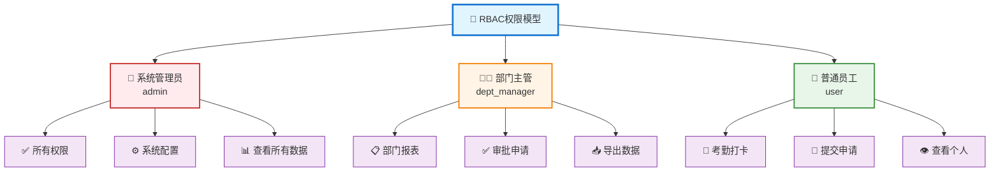

### 7.2 数据安全

#### 敏感数据加密
- **密码加密**：BCrypt算法，不可逆加密
- **通信加密**：HTTPS/TLS 1.2+
- **数据库加密**：敏感字段AES-256加密

#### SQL注入防护
- 使用MyBatis预编译语句
- 参数化查询
- 输入验证和过滤

#### XSS防护
- 前端输入过滤
- 后端输出编码
- CSP (Content Security Policy)

### 7.3 接口安全

#### 接口限流

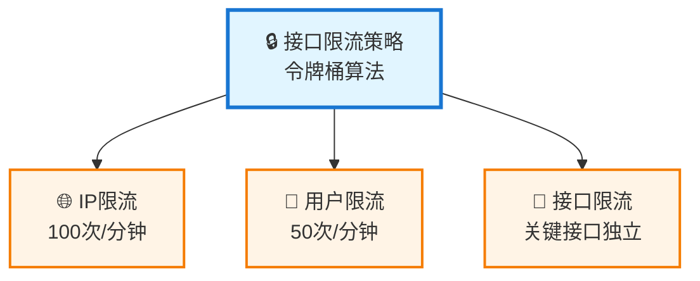

#### 防重放攻击
- 请求签名验证
- 时间戳验证（5分钟内有效）
- Nonce随机数验证

#### 操作日志

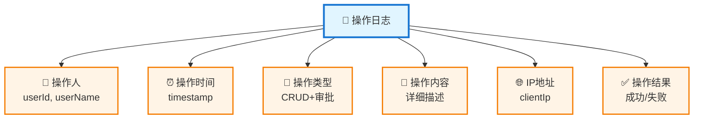

---

## 八、性能设计

### 8.1 性能目标

| 指标 | 目标值 | 说明 |
|------|--------|------|
| 打卡响应时间 | < 500ms | 99%请求 |
| 查询响应时间 | < 1s | 普通查询 |
| 报表生成时间 | < 3s | 月度报表 |
| 并发打卡 | 1000人/分钟 | 高峰期 |
| 系统可用性 | 99.9% | 年度统计 |

### 8.2 性能优化策略

#### 数据库优化

```mermaid
graph TD
    ROOT["💾 数据库优化"]
    
    ROOT --> OPT1["📇 索引优化"]
    ROOT --> OPT2["🔍 SQL优化"]
    ROOT --> OPT3["🔗 连接池"]
    ROOT --> OPT4["📊 读写分离"]
    
    OPT1 --> I1["联合索引<br/>user_id+stat_date"]
    OPT1 --> I2["覆盖索引<br/>常用字段"]
    OPT1 --> I3["避免全表扫描"]
    
    OPT2 --> S1["批量操作<br/>减少N+1"]
    OPT2 --> S2["分页查询<br/>LIMIT优化"]
    OPT2 --> S3["预编译语句<br/>防注入"]
    
    OPT3 --> P1["最小: 10"]
    OPT3 --> P2["最大: 100"]
    OPT3 --> P3["超时: 30s"]
    
    OPT4 --> R1["主库写"]
    OPT4 --> R2["从库读"]
    
    classDef rootStyle fill:#e1f5ff,stroke:#1976d2,stroke-width:3px
    classDef categoryStyle fill:#fff4e6,stroke:#f57c00,stroke-width:2px
    classDef detailStyle fill:#f3e5f5,stroke:#7b1fa2,stroke-width:1px
    
    class ROOT rootStyle
    class OPT1,OPT2,OPT3,OPT4 categoryStyle
    class I1,I2,I3,S1,S2,S3,P1,P2,P3,R1,R2 detailStyle
```

#### 缓存策略

```mermaid
graph TD
    ROOT["🚀 多级缓存"]
    
    ROOT --> L1["L1: MyBatis<br/>本地缓存"]
    ROOT --> L2["L2: Redis<br/>分布式缓存"]
    ROOT --> UPDATE["🔄 更新策略"]
    
    L2 --> C1["考勤规则<br/>24小时"]
    L2 --> C2["节假日<br/>7天"]
    L2 --> C3["用户信息<br/>1小时"]
    L2 --> C4["统计数据<br/>5分钟"]
    
    UPDATE --> U1["主动更新<br/>数据变更"]
    UPDATE --> U2["定时更新<br/>凌晨刷新"]
    
    classDef rootStyle fill:#e1f5ff,stroke:#1976d2,stroke-width:3px
    classDef levelStyle fill:#fff4e6,stroke:#f57c00,stroke-width:2px
    classDef cacheStyle fill:#e8f5e9,stroke:#388e3c,stroke-width:1px
    classDef updateStyle fill:#ffebee,stroke:#c62828,stroke-width:1px
    
    class ROOT rootStyle
    class L1,L2,UPDATE levelStyle
    class C1,C2,C3,C4 cacheStyle
    class U1,U2 updateStyle
```

#### 异步处理

```mermaid
graph TD
    ROOT["⚡ 异步任务队列"]
    
    ROOT --> TASK1["📊 考勤统计<br/>实时计算"]
    ROOT --> TASK2["📄 报表生成<br/>后台任务"]
    ROOT --> TASK3["📧 消息通知<br/>异步发送"]
    ROOT --> TASK4["📥 数据导出<br/>异步生成"]
    
    classDef rootStyle fill:#e1f5ff,stroke:#1976d2,stroke-width:3px
    classDef taskStyle fill:#fff4e6,stroke:#f57c00,stroke-width:2px
    
    class ROOT rootStyle
    class TASK1,TASK2,TASK3,TASK4 taskStyle
```

### 8.3 监控告警

#### 监控指标
- **系统指标**：CPU、内存、磁盘、网络
- **应用指标**：QPS、响应时间、错误率
- **业务指标**：打卡人数、审批数量、异常率

#### 告警规则
- CPU使用率 > 80%
- 内存使用率 > 85%
- 接口响应时间 > 3s
- 错误率 > 1%
- 数据库连接数 > 90

---

## 九、部署方案

### 9.1 部署架构

```mermaid
graph TB
    subgraph 负载层
        LB[Nginx 负载均衡<br/>IP: 192.168.1.10]
    end
    
    subgraph 应用层
        APP1[应用服务器1<br/>Spring Boot<br/>4核8G]
        APP2[应用服务器2<br/>Spring Boot<br/>4核8G]
        APP3[应用服务器3<br/>Spring Boot<br/>4核8G]
    end
    
    subgraph 数据层
        MASTER[(MySQL 主库<br/>写操作<br/>8核16G)]
        SLAVE1[(MySQL 从库1<br/>读操作<br/>8核16G)]
        SLAVE2[(MySQL 从库2<br/>读操作<br/>8核16G)]
    end
    
    subgraph 缓存层
        REDIS1[Redis 节点1<br/>4核8G]
        REDIS2[Redis 节点2<br/>4核8G]
        REDIS3[Redis 节点3<br/>4核8G]
    end
    
    LB --> APP1
    LB --> APP2
    LB --> APP3
    
    APP1 --> MASTER
    APP2 --> MASTER
    APP3 --> MASTER
    
    APP1 --> SLAVE1
    APP2 --> SLAVE1
    APP3 --> SLAVE2
    
    MASTER -.主从复制.-> SLAVE1
    MASTER -.主从复制.-> SLAVE2
    
    APP1 --> REDIS1
    APP2 --> REDIS2
    APP3 --> REDIS3
    
    REDIS1 -.集群同步.-> REDIS2
    REDIS2 -.集群同步.-> REDIS3
    REDIS3 -.集群同步.-> REDIS1
    
    style LB fill:#e1f5ff
    style APP1 fill:#fff4e6
    style APP2 fill:#fff4e6
    style APP3 fill:#fff4e6
    style MASTER fill:#ffebee
    style SLAVE1 fill:#f3e5f5
    style SLAVE2 fill:#f3e5f5
    style REDIS1 fill:#e8f5e9
    style REDIS2 fill:#e8f5e9
    style REDIS3 fill:#e8f5e9
```

### 9.2 环境配置

#### 生产环境
- **应用服务器**：3台，4核8G
- **数据库服务器**：1主2从，8核16G
- **Redis服务器**：3节点集群，4核8G
- **负载均衡**：Nginx，2核4G

#### 开发环境
- **一体化服务器**：1台，4核8G
- **包含**：应用、数据库、Redis

### 9.3 部署流程

```mermaid
flowchart TD
    A[代码提交] --> B[自动构建]
    B --> C[单元测试]
    C --> D{测试通过?}
    D -->|否| E[修复问题]
    E --> A
    D -->|是| F[打包部署包]
    F --> G[上传到服务器]
    G --> H[备份旧版本]
    H --> I[停止应用]
    I --> J[部署新版本]
    J --> K[启动应用]
    K --> L[健康检查]
    L --> M{检查通过?}
    M -->|否| N[回滚版本]
    N --> O[通知相关人员]
    M -->|是| P[部署成功]
```

### 9.4 备份策略

#### 数据备份
- **全量备份**：每周日凌晨2点
- **增量备份**：每天凌晨2点
- **保留策略**：保留最近30天数据

#### 日志备份
- **应用日志**：每天归档，保留30天
- **操作日志**：每周归档，保留90天
- **异常日志**：实时告警，保留180天

---

## 十、开发计划

### 10.1 开发周期

**总周期**：8周（2个月）

### 10.2 迭代计划

| 迭代 | 时间 | 目标 | 交付物 |
|-----|------|------|--------|
| Sprint 1 | Week 1-2 | 考勤打卡 + 基础配置 | 打卡功能、规则配置 |
| Sprint 2 | Week 3-4 | 审批流程（请假/出差/补卡） | 审批管理、流程流转 |
| Sprint 3 | Week 5-6 | 统计报表 + 定时任务 | 考勤统计、报表展示 |
| Sprint 4 | Week 7-8 | 测试优化 + 上线部署 | 测试报告、部署文档 |

### 10.3 团队配置

| 角色 | 人数 | 主要职责 |
|-----|------|---------|
| **后端开发** | 2 | 业务逻辑、接口开发 |
| **前端开发** | 1 | 页面开发、组件封装 |
| **测试工程师** | 1 | 测试用例、功能测试 |

### 10.4 里程碑

| 里程碑 | 时间节点 | 验收标准 |
|-------|---------|---------|
| **M1: 核心功能** | Week 4 | 打卡、审批功能完成 |
| **M2: 统计报表** | Week 6 | 统计、报表功能完成 |
| **M3: 系统可用** | Week 7 | 测试通过，性能达标 |
| **M4: 正式上线** | Week 8 | 生产环境部署完成 |

---

## 十一、附录

### 11.1 术语表

| 术语 | 英文 | 说明 |
|------|------|------|
| 考勤 | Attendance | 员工上下班打卡及相关管理 |
| 打卡 | Check-in | 记录员工上下班时间 |
| 应出勤天数 | Work Days | 排除周末节假日后的工作日天数 |
| 实际出勤天数 | Actual Days | 实际到岗的天数 |
| 出勤率 | Attendance Rate | 实际出勤/应出勤的比率 |
| 缺卡 | Absence | 漏打卡 |
| 补卡 | Makeup | 补充漏打的卡 |

### 11.2 参考文档

- 企业微信考勤文档：https://work.weixin.qq.com/help?doc_id=13726
- 钉钉考勤文档：https://open.dingtalk.com/document/orgapp/attendance-overview
- Spring Boot官方文档：https://spring.io/projects/spring-boot
- MyBatis官方文档：https://mybatis.org/mybatis-3/
- Element Plus官方文档：https://element-plus.org/

### 11.3 更新日志

| 版本 | 日期 | 更新内容 |
|------|------|---------|
| V1.0 | 2025-01-28 | 初始版本，完成基础功能设计 |

---

<div style={{textAlign: 'center', marginTop: '3rem', paddingTop: '2rem', borderTop: '2px solid #e0e0e0', color: '#666'}}>
  <p><strong>文档信息</strong></p>
  <table style={{margin: '0 auto', maxWidth: '600px'}}>
    <tbody>
      <tr>
        <td style={{textAlign: 'right', paddingRight: '1rem'}}><strong>文档编制：</strong></td>
        <td style={{textAlign: 'left'}}>系统架构师</td>
      </tr>
      <tr>
        <td style={{textAlign: 'right', paddingRight: '1rem'}}><strong>审核人员：</strong></td>
        <td style={{textAlign: 'left'}}>技术总监</td>
      </tr>
      <tr>
        <td style={{textAlign: 'right', paddingRight: '1rem'}}><strong>文档版本：</strong></td>
        <td style={{textAlign: 'left'}}>V1.0</td>
      </tr>
      <tr>
        <td style={{textAlign: 'right', paddingRight: '1rem'}}><strong>创建日期：</strong></td>
        <td style={{textAlign: 'left'}}>2025年1月28日</td>
      </tr>
      <tr>
        <td style={{textAlign: 'right', paddingRight: '1rem'}}><strong>最后更新：</strong></td>
        <td style={{textAlign: 'left'}}>2025年11月10日</td>
      </tr>
    </tbody>
  </table>
  <p style={{marginTop: '1.5rem', fontSize: '0.9rem', color: '#999'}}>
    © 2025 考勤管理系统 | 基于若依Pro-Mini架构 | 保留所有权利
  </p>
</div>

---

