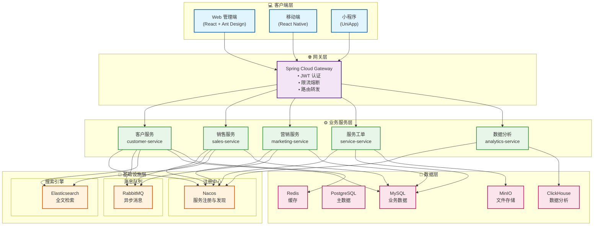
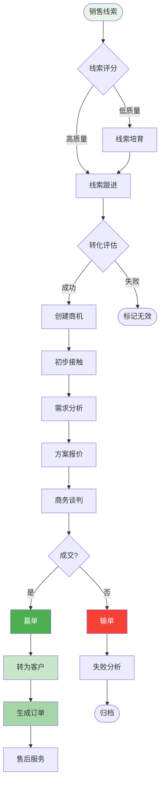

# CRM 客户关系管理系统设计

## 一、系统概述

### 1.1 系统简介

CRM（Customer Relationship Management）客户关系管理系统是一个以客户为中心的企业管理系统，帮助企业管理客户信息、销售机会、营销活动、客户服务等，提升客户满意度和企业销售业绩。

### 1.2 核心价值

| 价值点 | 说明 | 预期效果 |
|--------|------|----------|
| 🎯 **客户洞察** | 360度客户画像分析 | 客户转化率提升 35% |
| 📊 **销售提效** | 销售漏斗自动化管理 | 销售效率提升 40% |
| 🔄 **营销自动化** | 智能营销活动管理 | 营销 ROI 提升 50% |
| 📈 **数据驱动** | 实时数据分析决策 | 决策效率提升 45% |
| 🚀 **服务升级** | 智能工单系统 | 客户满意度提升 30% |

### 1.3 业务需求

#### 核心功能
- **客户管理**：客户信息、联系人、客户标签、客户分级
- **销售管理**：商机管理、销售漏斗、报价单、合同管理
- **营销管理**：营销活动、营销自动化、营销线索
- **服务管理**：工单管理、客户投诉、售后服务
- **数据分析**：销售报表、客户分析、业绩统计
- **协作管理**：任务管理、日程安排、团队协作

#### 非功能需求
- **高可用性**：系统可用性 99.9%
- **数据安全**：客户数据加密存储，权限严格控制
- **易用性**：界面友好，操作简单
- **移动端支持**：支持移动端 APP

---

## 二、系统架构

### 2.1 技术架构



### 2.2 销售漏斗流程



### 2.3 微服务划分

#### 1. 客户服务 (crm-customer-service)
```java
- 客户管理 (Customer)
- 联系人管理 (Contact)
- 客户标签 (CustomerTag)
- 客户跟进记录 (FollowUp)
- 客户分级 (CustomerLevel)
```

#### 2. 销售服务 (crm-sales-service)
```java
- 商机管理 (Opportunity)
- 销售线索 (Lead)
- 报价单管理 (Quotation)
- 合同管理 (Contract)
- 订单管理 (Order)
```

#### 3. 营销服务 (crm-marketing-service)
```java
- 营销活动 (Campaign)
- 营销自动化 (Marketing Automation)
- 邮件营销 (Email Marketing)
- 短信营销 (SMS Marketing)
- 营销效果分析 (Marketing Analytics)
```

#### 4. 服务工单 (crm-service-service)
```java
- 工单管理 (Ticket)
- 客户投诉 (Complaint)
- 售后服务 (After-sales Service)
- 知识库 (Knowledge Base)
```

#### 5. 数据分析服务 (crm-analytics-service)
```java
- 销售报表 (Sales Report)
- 客户分析 (Customer Analytics)
- 业绩统计 (Performance Statistics)
- 漏斗分析 (Funnel Analysis)
```

## 数据模型设计

### 核心表结构

#### 1. 客户表 (customer)
```sql
CREATE TABLE customer (
    id BIGINT PRIMARY KEY AUTO_INCREMENT,
    customer_no VARCHAR(50) NOT NULL UNIQUE COMMENT '客户编号',
    customer_name VARCHAR(200) NOT NULL COMMENT '客户名称',
    customer_type TINYINT NOT NULL COMMENT '客户类型:1-企业,2-个人',
    industry VARCHAR(50) COMMENT '所属行业',
    level TINYINT DEFAULT 1 COMMENT '客户等级:1-A类,2-B类,3-C类',
    source TINYINT COMMENT '客户来源:1-线上,2-线下,3-转介绍,4-其他',
    status TINYINT DEFAULT 1 COMMENT '状态:1-潜在客户,2-意向客户,3-成交客户,4-流失客户',
    province VARCHAR(50) COMMENT '省份',
    city VARCHAR(50) COMMENT '城市',
    address VARCHAR(200) COMMENT '详细地址',
    phone VARCHAR(20) COMMENT '电话',
    email VARCHAR(100) COMMENT '邮箱',
    website VARCHAR(200) COMMENT '网站',
    company_size VARCHAR(20) COMMENT '公司规模',
    annual_revenue DECIMAL(15,2) COMMENT '年营收',
    owner_user_id BIGINT COMMENT '负责人ID',
    create_user_id BIGINT COMMENT '创建人ID',
    create_time DATETIME DEFAULT CURRENT_TIMESTAMP,
    update_time DATETIME DEFAULT CURRENT_TIMESTAMP ON UPDATE CURRENT_TIMESTAMP,
    INDEX idx_customer_no (customer_no),
    INDEX idx_owner (owner_user_id),
    INDEX idx_status (status),
    INDEX idx_level (level)
) ENGINE=InnoDB DEFAULT CHARSET=utf8mb4 COMMENT='客户表';
```

#### 2. 联系人表 (contact)
```sql
CREATE TABLE contact (
    id BIGINT PRIMARY KEY AUTO_INCREMENT,
    customer_id BIGINT NOT NULL COMMENT '客户ID',
    contact_name VARCHAR(100) NOT NULL COMMENT '联系人姓名',
    gender TINYINT COMMENT '性别:1-男,2-女',
    position VARCHAR(50) COMMENT '职位',
    department VARCHAR(50) COMMENT '部门',
    mobile VARCHAR(20) COMMENT '手机',
    phone VARCHAR(20) COMMENT '电话',
    email VARCHAR(100) COMMENT '邮箱',
    wechat VARCHAR(50) COMMENT '微信',
    qq VARCHAR(20) COMMENT 'QQ',
    is_primary TINYINT DEFAULT 0 COMMENT '是否主联系人:0-否,1-是',
    birthday DATE COMMENT '生日',
    remark VARCHAR(500) COMMENT '备注',
    create_time DATETIME DEFAULT CURRENT_TIMESTAMP,
    update_time DATETIME DEFAULT CURRENT_TIMESTAMP ON UPDATE CURRENT_TIMESTAMP,
    INDEX idx_customer (customer_id),
    INDEX idx_mobile (mobile)
) ENGINE=InnoDB DEFAULT CHARSET=utf8mb4 COMMENT='联系人表';
```

#### 3. 商机表 (opportunity)
```sql
CREATE TABLE opportunity (
    id BIGINT PRIMARY KEY AUTO_INCREMENT,
    opportunity_no VARCHAR(50) NOT NULL UNIQUE COMMENT '商机编号',
    opportunity_name VARCHAR(200) NOT NULL COMMENT '商机名称',
    customer_id BIGINT NOT NULL COMMENT '客户ID',
    contact_id BIGINT COMMENT '联系人ID',
    amount DECIMAL(15,2) COMMENT '预计金额',
    stage TINYINT NOT NULL DEFAULT 1 COMMENT '阶段:1-初步接触,2-需求分析,3-方案报价,4-谈判,5-成交,6-失败',
    probability INT DEFAULT 0 COMMENT '赢单概率(%)',
    expected_close_date DATE COMMENT '预计成交日期',
    actual_close_date DATE COMMENT '实际成交日期',
    source TINYINT COMMENT '商机来源:1-线上,2-线下,3-转介绍,4-其他',
    competitor VARCHAR(200) COMMENT '竞争对手',
    priority TINYINT DEFAULT 0 COMMENT '优先级:0-普通,1-重要,2-紧急',
    status TINYINT DEFAULT 1 COMMENT '状态:1-进行中,2-已成交,3-已失败',
    owner_user_id BIGINT NOT NULL COMMENT '负责人ID',
    lose_reason VARCHAR(500) COMMENT '失败原因',
    remark VARCHAR(500) COMMENT '备注',
    create_user_id BIGINT COMMENT '创建人ID',
    create_time DATETIME DEFAULT CURRENT_TIMESTAMP,
    update_time DATETIME DEFAULT CURRENT_TIMESTAMP ON UPDATE CURRENT_TIMESTAMP,
    INDEX idx_opportunity_no (opportunity_no),
    INDEX idx_customer (customer_id),
    INDEX idx_owner (owner_user_id),
    INDEX idx_stage (stage),
    INDEX idx_status (status)
) ENGINE=InnoDB DEFAULT CHARSET=utf8mb4 COMMENT='商机表';
```

#### 4. 销售线索表 (lead)
```sql
CREATE TABLE lead (
    id BIGINT PRIMARY KEY AUTO_INCREMENT,
    lead_no VARCHAR(50) NOT NULL UNIQUE COMMENT '线索编号',
    company_name VARCHAR(200) COMMENT '公司名称',
    contact_name VARCHAR(100) NOT NULL COMMENT '联系人',
    mobile VARCHAR(20) COMMENT '手机',
    email VARCHAR(100) COMMENT '邮箱',
    province VARCHAR(50) COMMENT '省份',
    city VARCHAR(50) COMMENT '城市',
    industry VARCHAR(50) COMMENT '行业',
    source TINYINT COMMENT '来源:1-网站,2-广告,3-活动,4-转介绍,5-其他',
    campaign_id BIGINT COMMENT '营销活动ID',
    status TINYINT DEFAULT 1 COMMENT '状态:1-未处理,2-跟进中,3-已转化,4-无效',
    score INT DEFAULT 0 COMMENT '线索评分',
    owner_user_id BIGINT COMMENT '负责人ID',
    converted_customer_id BIGINT COMMENT '转化客户ID',
    converted_time DATETIME COMMENT '转化时间',
    remark VARCHAR(500) COMMENT '备注',
    create_time DATETIME DEFAULT CURRENT_TIMESTAMP,
    update_time DATETIME DEFAULT CURRENT_TIMESTAMP ON UPDATE CURRENT_TIMESTAMP,
    INDEX idx_lead_no (lead_no),
    INDEX idx_mobile (mobile),
    INDEX idx_status (status),
    INDEX idx_owner (owner_user_id)
) ENGINE=InnoDB DEFAULT CHARSET=utf8mb4 COMMENT='销售线索表';
```

#### 5. 跟进记录表 (follow_up)
```sql
CREATE TABLE follow_up (
    id BIGINT PRIMARY KEY AUTO_INCREMENT,
    related_type TINYINT NOT NULL COMMENT '关联类型:1-客户,2-商机,3-线索',
    related_id BIGINT NOT NULL COMMENT '关联ID',
    follow_up_type TINYINT NOT NULL COMMENT '跟进方式:1-电话,2-邮件,3-拜访,4-会议,5-其他',
    follow_up_time DATETIME NOT NULL COMMENT '跟进时间',
    content TEXT NOT NULL COMMENT '跟进内容',
    next_follow_up_time DATETIME COMMENT '下次跟进时间',
    attachment_url VARCHAR(500) COMMENT '附件URL',
    create_user_id BIGINT NOT NULL COMMENT '创建人ID',
    create_time DATETIME DEFAULT CURRENT_TIMESTAMP,
    INDEX idx_related (related_type, related_id),
    INDEX idx_create_user (create_user_id),
    INDEX idx_create_time (create_time)
) ENGINE=InnoDB DEFAULT CHARSET=utf8mb4 COMMENT='跟进记录表';
```

#### 6. 合同表 (contract)
```sql
CREATE TABLE contract (
    id BIGINT PRIMARY KEY AUTO_INCREMENT,
    contract_no VARCHAR(50) NOT NULL UNIQUE COMMENT '合同编号',
    contract_name VARCHAR(200) NOT NULL COMMENT '合同名称',
    customer_id BIGINT NOT NULL COMMENT '客户ID',
    opportunity_id BIGINT COMMENT '商机ID',
    contract_type TINYINT NOT NULL COMMENT '合同类型:1-销售合同,2-服务合同,3-其他',
    amount DECIMAL(15,2) NOT NULL COMMENT '合同金额',
    start_date DATE NOT NULL COMMENT '开始日期',
    end_date DATE NOT NULL COMMENT '结束日期',
    sign_date DATE COMMENT '签订日期',
    status TINYINT DEFAULT 1 COMMENT '状态:1-草稿,2-待审批,3-审批中,4-已生效,5-已终止',
    owner_user_id BIGINT NOT NULL COMMENT '负责人ID',
    contract_file_url VARCHAR(500) COMMENT '合同文件URL',
    remark VARCHAR(500) COMMENT '备注',
    create_user_id BIGINT COMMENT '创建人ID',
    create_time DATETIME DEFAULT CURRENT_TIMESTAMP,
    update_time DATETIME DEFAULT CURRENT_TIMESTAMP ON UPDATE CURRENT_TIMESTAMP,
    INDEX idx_contract_no (contract_no),
    INDEX idx_customer (customer_id),
    INDEX idx_status (status)
) ENGINE=InnoDB DEFAULT CHARSET=utf8mb4 COMMENT='合同表';
```

#### 7. 营销活动表 (campaign)
```sql
CREATE TABLE campaign (
    id BIGINT PRIMARY KEY AUTO_INCREMENT,
    campaign_no VARCHAR(50) NOT NULL UNIQUE COMMENT '活动编号',
    campaign_name VARCHAR(200) NOT NULL COMMENT '活动名称',
    campaign_type TINYINT NOT NULL COMMENT '活动类型:1-线上活动,2-线下活动,3-邮件营销,4-短信营销',
    channel VARCHAR(50) COMMENT '营销渠道',
    budget DECIMAL(15,2) COMMENT '预算',
    actual_cost DECIMAL(15,2) COMMENT '实际花费',
    start_time DATETIME NOT NULL COMMENT '开始时间',
    end_time DATETIME NOT NULL COMMENT '结束时间',
    target_audience VARCHAR(500) COMMENT '目标受众',
    target_count INT COMMENT '目标人数',
    actual_count INT DEFAULT 0 COMMENT '实际触达人数',
    lead_count INT DEFAULT 0 COMMENT '产生线索数',
    conversion_count INT DEFAULT 0 COMMENT '转化数',
    status TINYINT DEFAULT 1 COMMENT '状态:1-计划中,2-进行中,3-已结束,4-已取消',
    owner_user_id BIGINT NOT NULL COMMENT '负责人ID',
    description TEXT COMMENT '活动描述',
    create_user_id BIGINT COMMENT '创建人ID',
    create_time DATETIME DEFAULT CURRENT_TIMESTAMP,
    update_time DATETIME DEFAULT CURRENT_TIMESTAMP ON UPDATE CURRENT_TIMESTAMP,
    INDEX idx_campaign_no (campaign_no),
    INDEX idx_status (status),
    INDEX idx_time (start_time, end_time)
) ENGINE=InnoDB DEFAULT CHARSET=utf8mb4 COMMENT='营销活动表';
```

#### 8. 工单表 (ticket)
```sql
CREATE TABLE ticket (
    id BIGINT PRIMARY KEY AUTO_INCREMENT,
    ticket_no VARCHAR(50) NOT NULL UNIQUE COMMENT '工单编号',
    title VARCHAR(200) NOT NULL COMMENT '标题',
    customer_id BIGINT NOT NULL COMMENT '客户ID',
    contact_id BIGINT COMMENT '联系人ID',
    ticket_type TINYINT NOT NULL COMMENT '工单类型:1-咨询,2-投诉,3-售后,4-其他',
    priority TINYINT DEFAULT 0 COMMENT '优先级:0-普通,1-重要,2-紧急',
    status TINYINT DEFAULT 1 COMMENT '状态:1-待处理,2-处理中,3-待回复,4-已解决,5-已关闭',
    channel TINYINT COMMENT '渠道:1-电话,2-邮件,3-在线客服,4-其他',
    description TEXT COMMENT '问题描述',
    solution TEXT COMMENT '解决方案',
    assign_user_id BIGINT COMMENT '处理人ID',
    create_user_id BIGINT COMMENT '创建人ID',
    close_time DATETIME COMMENT '关闭时间',
    satisfaction TINYINT COMMENT '满意度:1-5分',
    create_time DATETIME DEFAULT CURRENT_TIMESTAMP,
    update_time DATETIME DEFAULT CURRENT_TIMESTAMP ON UPDATE CURRENT_TIMESTAMP,
    INDEX idx_ticket_no (ticket_no),
    INDEX idx_customer (customer_id),
    INDEX idx_status (status),
    INDEX idx_assign_user (assign_user_id)
) ENGINE=InnoDB DEFAULT CHARSET=utf8mb4 COMMENT='工单表';
```

## 核心业务流程

### 1. 销售线索转化流程

```
线索获取 → 线索评分 → 线索分配 → 跟进 → 线索转化 → 创建客户/商机
   ↓          ↓          ↓        ↓        ↓
(未处理)   (评分完成)   (跟进中)  (持续跟进) (已转化)
```

**关键步骤**：
1. 获取线索（网站表单、营销活动、广告等）
2. 线索评分（根据行业、职位、公司规模等打分）
3. 线索分配（自动/手动分配给销售人员）
4. 销售跟进（电话、邮件、拜访等）
5. 线索转化（创建客户和商机）

### 2. 销售商机管理流程

```
创建商机 → 需求分析 → 方案报价 → 谈判签约 → 成交/失败
   ↓         ↓          ↓         ↓         ↓
(初步接触) (需求分析)  (方案报价)  (谈判)   (结束)
```

**关键步骤**：
1. 创建商机（从线索转化或直接创建）
2. 需求分析（了解客户需求，评估商机价值）
3. 方案报价（制定解决方案，提供报价）
4. 谈判签约（商务谈判，签订合同）
5. 成交或失败（记录结果和原因）

### 3. 客户服务工单流程

```
创建工单 → 工单分配 → 处理中 → 待回复 → 已解决 → 关闭 → 满意度评价
   ↓         ↓         ↓        ↓        ↓       ↓
(待处理)   (已分配)   (处理中)  (待回复) (已解决) (已关闭)
```

## 技术实现方案

### 1. 客户搜索（Elasticsearch）

使用 **Elasticsearch** 实现客户全文搜索：

```java
@Service
public class CustomerSearchService {
    
    @Autowired
    private ElasticsearchRestTemplate elasticsearchTemplate;
    
    /**
     * 搜索客户
     */
    public PageResult<CustomerVO> searchCustomers(String keyword, int pageNum, int pageSize) {
        // 构建搜索条件
        NativeSearchQueryBuilder queryBuilder = new NativeSearchQueryBuilder();
        
        // 多字段搜索
        BoolQueryBuilder boolQuery = QueryBuilders.boolQuery();
        boolQuery.should(QueryBuilders.matchQuery("customerName", keyword))
                 .should(QueryBuilders.matchQuery("phone", keyword))
                 .should(QueryBuilders.matchQuery("email", keyword))
                 .should(QueryBuilders.matchQuery("address", keyword));
        
        queryBuilder.withQuery(boolQuery);
        queryBuilder.withPageable(PageRequest.of(pageNum - 1, pageSize));
        
        // 执行搜索
        SearchHits<CustomerDocument> searchHits = elasticsearchTemplate.search(
            queryBuilder.build(), 
            CustomerDocument.class
        );
        
        // 转换结果
        List<CustomerVO> customers = searchHits.stream()
            .map(hit -> convertToVO(hit.getContent()))
            .collect(Collectors.toList());
        
        return new PageResult<>(customers, searchHits.getTotalHits(), pageNum, pageSize);
    }
}
```

### 2. 线索评分系统

使用 **规则引擎** 实现线索自动评分：

```java
@Service
public class LeadScoringService {
    
    /**
     * 计算线索评分
     */
    public int calculateLeadScore(Lead lead) {
        int score = 0;
        
        // 行业评分
        score += getIndustryScore(lead.getIndustry());
        
        // 公司规模评分
        score += getCompanySizeScore(lead.getCompanySize());
        
        // 职位评分
        score += getPositionScore(lead.getPosition());
        
        // 来源评分
        score += getSourceScore(lead.getSource());
        
        // 行为评分（访问页面、下载资料等）
        score += getBehaviorScore(lead.getId());
        
        return Math.min(score, 100); // 最高100分
    }
    
    /**
     * 行业评分
     */
    private int getIndustryScore(String industry) {
        // 根据目标行业打分
        Map<String, Integer> industryScores = Map.of(
            "互联网", 30,
            "金融", 25,
            "制造业", 20,
            "其他", 10
        );
        return industryScores.getOrDefault(industry, 10);
    }
    
    /**
     * 公司规模评分
     */
    private int getCompanySizeScore(String companySize) {
        Map<String, Integer> sizeScores = Map.of(
            "1000人以上", 30,
            "500-1000人", 25,
            "100-500人", 20,
            "100人以下", 10
        );
        return sizeScores.getOrDefault(companySize, 10);
    }
}
```

### 3. 销售漏斗分析

```java
@Service
public class SalesFunnelService {
    
    @Autowired
    private OpportunityMapper opportunityMapper;
    
    /**
     * 获取销售漏斗数据
     */
    public SalesFunnelVO getSalesFunnel(Long userId, LocalDate startDate, LocalDate endDate) {
        // 查询各阶段的商机数量和金额
        List<OpportunityStageStats> stageStats = opportunityMapper.countByStage(
            userId, startDate, endDate
        );
        
        SalesFunnelVO funnel = new SalesFunnelVO();
        
        for (OpportunityStageStats stats : stageStats) {
            switch (stats.getStage()) {
                case 1: // 初步接触
                    funnel.setInitialContactCount(stats.getCount());
                    funnel.setInitialContactAmount(stats.getAmount());
                    break;
                case 2: // 需求分析
                    funnel.setNeedsAnalysisCount(stats.getCount());
                    funnel.setNeedsAnalysisAmount(stats.getAmount());
                    break;
                case 3: // 方案报价
                    funnel.setProposalCount(stats.getCount());
                    funnel.setProposalAmount(stats.getAmount());
                    break;
                case 4: // 谈判
                    funnel.setNegotiationCount(stats.getCount());
                    funnel.setNegotiationAmount(stats.getAmount());
                    break;
                case 5: // 成交
                    funnel.setWonCount(stats.getCount());
                    funnel.setWonAmount(stats.getAmount());
                    break;
            }
        }
        
        // 计算转化率
        funnel.calculateConversionRates();
        
        return funnel;
    }
}
```

### 4. 营销自动化

使用 **定时任务 + 消息队列** 实现营销自动化：

```java
@Component
public class MarketingAutomationTask {
    
    @Autowired
    private LeadService leadService;
    
    @Autowired
    private EmailService emailService;
    
    @Autowired
    private RabbitTemplate rabbitTemplate;
    
    /**
     * 自动跟进未处理的线索
     */
    @Scheduled(cron = "0 0 9 * * ?") // 每天9点执行
    public void autoFollowUpLeads() {
        // 查询未处理的线索（创建时间超过24小时）
        LocalDateTime yesterday = LocalDateTime.now().minusDays(1);
        List<Lead> unprocessedLeads = leadService.findUnprocessedLeads(yesterday);
        
        for (Lead lead : unprocessedLeads) {
            // 发送提醒邮件给负责人
            rabbitTemplate.convertAndSend(
                "crm.marketing.exchange",
                "lead.follow.up.reminder",
                new LeadFollowUpEvent(lead.getId(), lead.getOwnerUserId())
            );
        }
    }
    
    /**
     * 自动发送生日祝福
     */
    @Scheduled(cron = "0 0 8 * * ?") // 每天8点执行
    public void sendBirthdayGreetings() {
        // 查询今天生日的联系人
        List<Contact> birthdayContacts = leadService.findBirthdayContacts(LocalDate.now());
        
        for (Contact contact : birthdayContacts) {
            // 发送生日祝福邮件
            emailService.sendBirthdayEmail(contact);
        }
    }
}
```

### 5. 客户标签系统

```java
@Service
public class CustomerTagService {
    
    @Autowired
    private CustomerMapper customerMapper;
    
    @Autowired
    private CustomerTagMapper customerTagMapper;
    
    /**
     * 自动打标签
     */
    @Transactional
    public void autoTagCustomer(Long customerId) {
        Customer customer = customerMapper.selectById(customerId);
        
        List<String> tags = new ArrayList<>();
        
        // 根据行业打标签
        if ("互联网".equals(customer.getIndustry())) {
            tags.add("互联网行业");
        }
        
        // 根据客户等级打标签
        if (customer.getLevel() == 1) {
            tags.add("重点客户");
        }
        
        // 根据成交金额打标签
        BigDecimal totalAmount = customerMapper.getTotalOrderAmount(customerId);
        if (totalAmount.compareTo(new BigDecimal("100000")) > 0) {
            tags.add("大客户");
        }
        
        // 根据购买频率打标签
        int orderCount = customerMapper.getOrderCount(customerId);
        if (orderCount > 10) {
            tags.add("老客户");
        }
        
        // 保存标签
        for (String tagName : tags) {
            customerTagMapper.addTag(customerId, tagName);
        }
    }
}
```

### 6. 权限控制（数据权限）

```java
@Service
public class CustomerPermissionService {
    
    /**
     * 检查用户是否有权限访问客户
     */
    public boolean hasPermission(Long userId, Long customerId) {
        Customer customer = customerMapper.selectById(customerId);
        
        if (customer == null) {
            return false;
        }
        
        // 负责人有权限
        if (customer.getOwnerUserId().equals(userId)) {
            return true;
        }
        
        // 管理员有权限
        if (isAdmin(userId)) {
            return true;
        }
        
        // 同部门有权限（根据配置）
        if (isSameDepartment(userId, customer.getOwnerUserId())) {
            return true;
        }
        
        return false;
    }
}
```

## API 接口设计

### 1. 客户接口

```java
@RestController
@RequestMapping("/api/crm/customer")
public class CustomerController {
    
    @Autowired
    private CustomerService customerService;
    
    /**
     * 创建客户
     */
    @PostMapping("")
    public Result<Long> createCustomer(@RequestBody @Valid CustomerDTO dto) {
        Long customerId = customerService.createCustomer(dto);
        return Result.success(customerId);
    }
    
    /**
     * 客户列表
     */
    @GetMapping("")
    public Result<PageResult<CustomerVO>> listCustomers(
            @RequestParam(required = false) String keyword,
            @RequestParam(required = false) Integer level,
            @RequestParam(required = false) Integer status,
            @RequestParam(defaultValue = "1") Integer pageNum,
            @RequestParam(defaultValue = "20") Integer pageSize) {
        
        PageResult<CustomerVO> result = customerService.listCustomers(
            keyword, level, status, pageNum, pageSize
        );
        return Result.success(result);
    }
    
    /**
     * 客户详情
     */
    @GetMapping("/{customerId}")
    public Result<CustomerDetailVO> getCustomerDetail(@PathVariable Long customerId) {
        CustomerDetailVO vo = customerService.getCustomerDetail(customerId);
        return Result.success(vo);
    }
    
    /**
     * 添加跟进记录
     */
    @PostMapping("/{customerId}/follow-up")
    public Result<Void> addFollowUp(
            @PathVariable Long customerId,
            @RequestBody @Valid FollowUpDTO dto) {
        
        customerService.addFollowUp(customerId, dto);
        return Result.success();
    }
}
```

### 2. 商机接口

```java
@RestController
@RequestMapping("/api/crm/opportunity")
public class OpportunityController {
    
    @Autowired
    private OpportunityService opportunityService;
    
    /**
     * 创建商机
     */
    @PostMapping("")
    public Result<Long> createOpportunity(@RequestBody @Valid OpportunityDTO dto) {
        Long opportunityId = opportunityService.createOpportunity(dto);
        return Result.success(opportunityId);
    }
    
    /**
     * 更新商机阶段
     */
    @PutMapping("/{opportunityId}/stage")
    public Result<Void> updateStage(
            @PathVariable Long opportunityId,
            @RequestParam Integer stage) {
        
        opportunityService.updateStage(opportunityId, stage);
        return Result.success();
    }
    
    /**
     * 商机成交
     */
    @PostMapping("/{opportunityId}/win")
    public Result<Void> winOpportunity(
            @PathVariable Long opportunityId,
            @RequestBody @Valid WinOpportunityDTO dto) {
        
        opportunityService.winOpportunity(opportunityId, dto);
        return Result.success();
    }
    
    /**
     * 商机失败
     */
    @PostMapping("/{opportunityId}/lose")
    public Result<Void> loseOpportunity(
            @PathVariable Long opportunityId,
            @RequestParam String loseReason) {
        
        opportunityService.loseOpportunity(opportunityId, loseReason);
        return Result.success();
    }
    
    /**
     * 销售漏斗
     */
    @GetMapping("/funnel")
    public Result<SalesFunnelVO> getSalesFunnel(
            @RequestParam(required = false) Long userId,
            @RequestParam(required = false) @DateTimeFormat(pattern = "yyyy-MM-dd") LocalDate startDate,
            @RequestParam(required = false) @DateTimeFormat(pattern = "yyyy-MM-dd") LocalDate endDate) {
        
        SalesFunnelVO vo = opportunityService.getSalesFunnel(userId, startDate, endDate);
        return Result.success(vo);
    }
}
```

### 3. 销售线索接口

```java
@RestController
@RequestMapping("/api/crm/lead")
public class LeadController {
    
    @Autowired
    private LeadService leadService;
    
    /**
     * 创建线索
     */
    @PostMapping("")
    public Result<Long> createLead(@RequestBody @Valid LeadDTO dto) {
        Long leadId = leadService.createLead(dto);
        return Result.success(leadId);
    }
    
    /**
     * 线索转化
     */
    @PostMapping("/{leadId}/convert")
    public Result<ConvertResultVO> convertLead(
            @PathVariable Long leadId,
            @RequestBody @Valid LeadConvertDTO dto) {
        
        ConvertResultVO result = leadService.convertLead(leadId, dto);
        return Result.success(result);
    }
    
    /**
     * 批量分配线索
     */
    @PostMapping("/batch-assign")
    public Result<Void> batchAssignLeads(
            @RequestBody @Valid BatchAssignDTO dto) {
        
        leadService.batchAssignLeads(dto.getLeadIds(), dto.getUserId());
        return Result.success();
    }
}
```

### 4. 数据分析接口

```java
@RestController
@RequestMapping("/api/crm/analytics")
public class AnalyticsController {
    
    @Autowired
    private AnalyticsService analyticsService;
    
    /**
     * 销售报表
     */
    @GetMapping("/sales-report")
    public Result<SalesReportVO> getSalesReport(
            @RequestParam @DateTimeFormat(pattern = "yyyy-MM-dd") LocalDate startDate,
            @RequestParam @DateTimeFormat(pattern = "yyyy-MM-dd") LocalDate endDate,
            @RequestParam(required = false) Long userId) {
        
        SalesReportVO report = analyticsService.getSalesReport(startDate, endDate, userId);
        return Result.success(report);
    }
    
    /**
     * 客户分析
     */
    @GetMapping("/customer-analytics")
    public Result<CustomerAnalyticsVO> getCustomerAnalytics() {
        CustomerAnalyticsVO analytics = analyticsService.getCustomerAnalytics();
        return Result.success(analytics);
    }
    
    /**
     * 销售业绩排行
     */
    @GetMapping("/sales-ranking")
    public Result<List<SalesRankingVO>> getSalesRanking(
            @RequestParam @DateTimeFormat(pattern = "yyyy-MM-dd") LocalDate startDate,
            @RequestParam @DateTimeFormat(pattern = "yyyy-MM-dd") LocalDate endDate) {
        
        List<SalesRankingVO> ranking = analyticsService.getSalesRanking(startDate, endDate);
        return Result.success(ranking);
    }
}
```

## 性能优化方案

### 1. 数据库优化
- 合理建立索引（客户编号、负责人、状态等）
- 使用读写分离
- 对历史数据进行分区
- 定期归档历史数据

### 2. 缓存优化
- 缓存客户基础信息
- 缓存用户权限数据
- 缓存统计数据（短时缓存）

### 3. 搜索优化
- 使用 Elasticsearch 实现全文搜索
- 异步更新搜索索引

### 4. 大数据分析
- 使用 ClickHouse 存储分析数据
- 定时同步数据到 ClickHouse
- 复杂报表查询走 ClickHouse

## 扩展功能

### 1. AI 智能推荐
- 智能线索分配（根据销售特长、历史成交率等）
- 智能商机预测（预测成交概率）
- 智能客户画像

### 2. 移动端支持
- 移动端 APP（React Native / Flutter）
- 外勤签到
- 移动审批

### 3. 集成第三方系统
- 邮件系统集成（发送/接收邮件）
- 短信平台集成
- 企业微信/钉钉集成
- 财务系统集成

### 4. 高级分析
- 客户流失预警
- RFM 客户分析
- 客户生命周期价值分析
- 销售预测

## 总结

CRM 系统的核心在于：
1. **以客户为中心**：所有功能围绕客户展开
2. **销售流程规范化**：通过系统规范销售流程，提高销售效率
3. **数据驱动决策**：通过数据分析为决策提供支持
4. **营销自动化**：提高营销效率，降低营销成本
5. **客户满意度提升**：通过优质服务提升客户满意度

本设计方案基于 Spring Cloud 微服务架构，采用主流技术栈，可满足中大型企业的客户关系管理需求。

