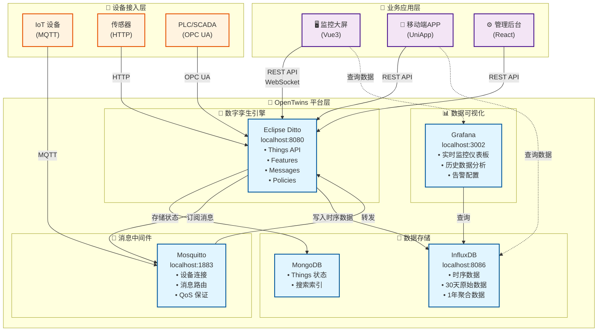
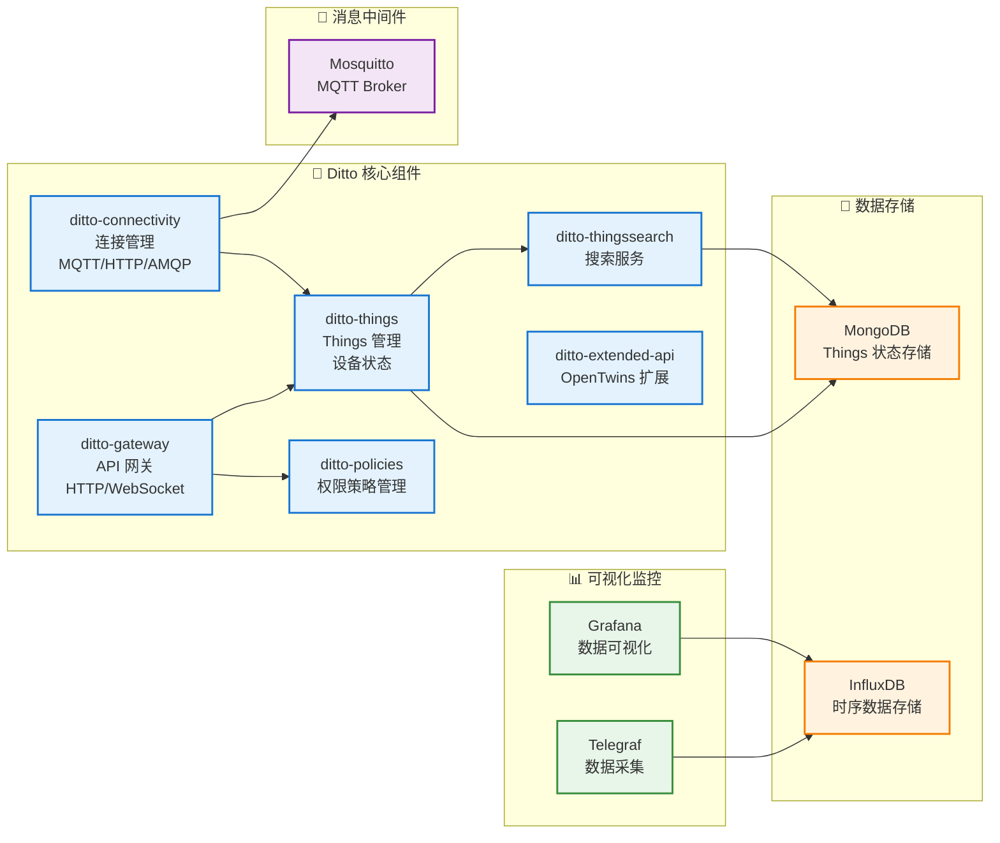
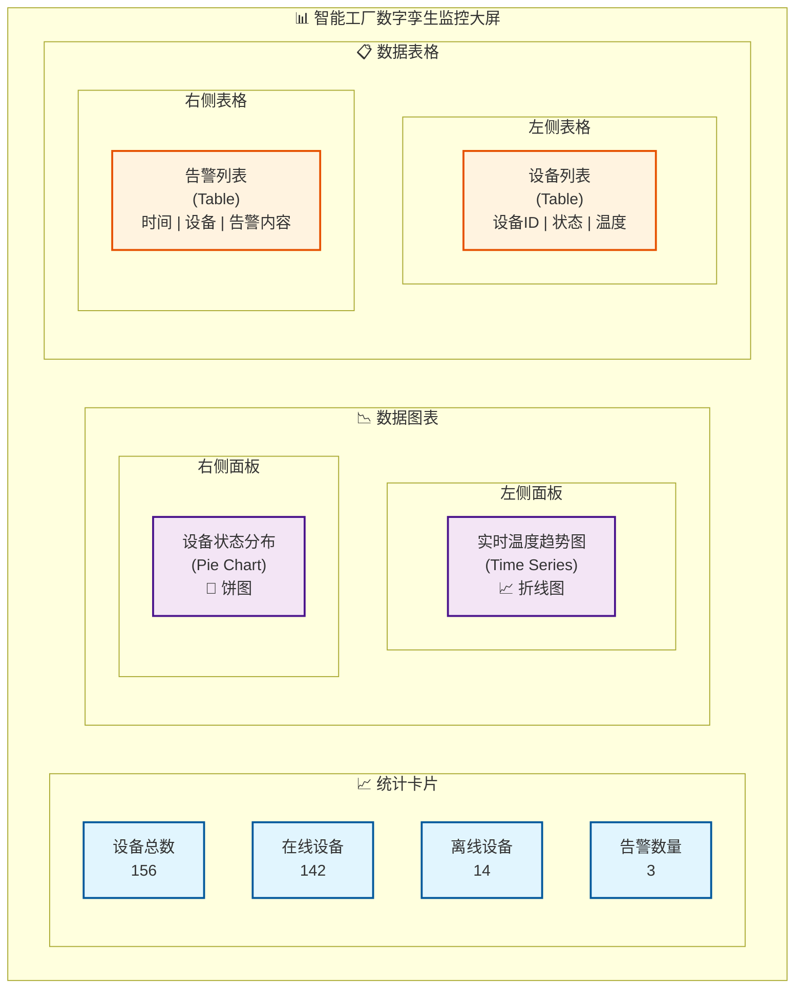

# 基于 OpenTwins 的数字孪生系统设计

## 一、项目概述

本项目基于开源数字孪生平台 **OpenTwins** 构建企业级数字孪生应用。OpenTwins 底层使用 Eclipse Ditto 作为数字孪生核心引擎，提供完整的设备管理、数据采集、可视化和分析能力。

### 1.1 什么是 OpenTwins？

OpenTwins 是一个开源的数字孪生平台，集成了以下核心组件：

- 🎯 **Eclipse Ditto** - 数字孪生核心引擎
- 📊 **Grafana** - 数据可视化和监控
- 💾 **InfluxDB** - 时序数据存储
- 📡 **Mosquitto** - MQTT 消息代理
- 📈 **Telegraf** - 数据采集和处理
- 🗄️ **MongoDB** - Things 状态存储

### 1.2 应用场景

#### 🏭 智能制造
- 生产设备实时监控
- 设备预测性维护
- 生产线数字孪生
- OEE（设备综合效率）分析

#### 🏢 智慧园区
- 园区 3D 可视化监控
- 能耗监测和优化
- 环境监测（温湿度、空气质量）
- 设备集中管理

#### ⚙️ 设备健康管理
- 设备状态实时监控
- 故障预警和诊断
- 维护计划优化
- 设备生命周期管理

### 1.3 技术架构



### 1.4 技术指标

| 指标 | 目标值 | 说明 |
|------|--------|------|
| 设备连接数 | 10,000+ | 同时在线设备 |
| 数据采集频率 | 1-10 Hz | 根据设备类型调整 |
| 端到端延迟 | < 1s | 从设备到可视化展示 |
| API 响应时间 | < 200ms | Ditto HTTP API |
| 数据保留期 | 30天/1年 | 原始数据/聚合数据 |
| 系统可用性 | 99.9% | 年度目标 |

---

## 二、OpenTwins 平台部署

### 2.1 环境准备

在开始开发之前，请先完成 OpenTwins 平台的部署。详细步骤请参考：

👉 **[OpenTwins Windows 本地部署实战指南](../digital-twin/opentwins-windows-deployment)**

**快速检查清单**：

```bash
# 1. 检查 Minikube 集群状态
kubectl get nodes

# 2. 检查 OpenTwins 所有 Pod 状态
kubectl get pods

# 3. 确认所有服务正常运行
kubectl get services

# 4. 启动端口转发
powershell -ExecutionPolicy Bypass -File .\start-opentwins-portforward.ps1
```

**访问地址**：

| 服务 | 地址 | 用途 |
|------|------|------|
| Grafana | http://localhost:3002 | 数据可视化（admin/admin） |
| Ditto API | http://localhost:8080 | 数字孪生核心 API |
| Extended API | http://localhost:8081 | OpenTwins 扩展 API |
| InfluxDB | http://localhost:8086 | 时序数据库管理 |
| MQTT | localhost:1883 | 设备消息接入 |

### 2.2 OpenTwins 组件架构



---

## 三、Eclipse Ditto 核心概念

### 3.1 Things 数据模型

Eclipse Ditto 使用 **Thing** 作为核心概念，一个 Thing 代表一个数字孪生实体。

**Thing 的完整结构**：

```json
{
  "thingId": "org.example:temperature-sensor-001",
  "policyId": "org.example:my-policy",
  "definition": "org.example:TemperatureSensor:1.0.0",
  "attributes": {
    "manufacturer": "Acme Inc.",
    "model": "TempSensor-2000",
    "serialNumber": "SN-12345",
    "location": {
      "building": "Building A",
      "floor": "2",
      "room": "201",
      "coordinates": {
        "latitude": 31.2304,
        "longitude": 121.4737
      }
    },
    "installDate": "2024-01-15",
    "warrantyDate": "2026-01-15"
  },
  "features": {
    "temperature": {
      "properties": {
        "value": 23.5,
        "unit": "°C",
        "quality": "good",
        "timestamp": "2024-01-15T10:30:00Z"
      }
    },
    "humidity": {
      "properties": {
        "value": 65.2,
        "unit": "%",
        "timestamp": "2024-01-15T10:30:00Z"
      }
    },
    "battery": {
      "properties": {
        "level": 85,
        "voltage": 3.7,
        "status": "charging"
      }
    }
  }
}
```

**关键概念说明**：

- **thingId**: 全局唯一标识符，格式：`namespace:name`
- **policyId**: 关联的权限策略 ID
- **definition**: Thing 的类型定义（可选）
- **attributes**: 静态属性（设备元数据，不常变化）
- **features**: 动态属性（传感器数据，经常变化）

### 3.2 Attributes vs Features

| 特性 | Attributes | Features |
|------|-----------|----------|
| **用途** | 静态元数据 | 动态数据 |
| **更新频率** | 低（很少变化） | 高（频繁变化） |
| **示例** | 制造商、型号、位置 | 温度、湿度、状态 |
| **搜索** | 支持全文搜索 | 支持属性搜索 |
| **典型大小** | 较小 | 可能较大 |

### 3.3 Policy 权限模型

Ditto 使用 Policy 来控制对 Thing 的访问权限。

**Policy 示例**：

```json
{
  "policyId": "org.example:my-policy",
  "entries": {
    "owner": {
      "subjects": {
        "nginx:admin": {
          "type": "nginx basic auth user"
        }
      },
      "resources": {
        "thing:/": {
          "grant": ["READ", "WRITE"],
          "revoke": []
        },
        "policy:/": {
          "grant": ["READ", "WRITE"],
          "revoke": []
        },
        "message:/": {
          "grant": ["READ", "WRITE"],
          "revoke": []
        }
      }
    },
    "observer": {
      "subjects": {
        "nginx:observer": {
          "type": "nginx basic auth user"
        }
      },
      "resources": {
        "thing:/": {
          "grant": ["READ"],
          "revoke": []
        }
      }
    }
  }
}
```

---

## 四、Ditto HTTP API 使用指南

### 4.1 创建数字孪生 (Thing)

**API 端点**: `PUT /api/2/things/{thingId}`

```bash
# 设置 Ditto API 基础地址
DITTO_API="http://localhost:8080/api/2"

# 创建一个温度传感器数字孪生
curl -X PUT "$DITTO_API/things/org.example:temp-sensor-001" \
  -H "Content-Type: application/json" \
  -d '{
    "attributes": {
      "manufacturer": "Acme Inc.",
      "model": "TempSensor-2000",
      "location": {
        "building": "A",
        "floor": "2",
        "room": "201"
      }
    },
    "features": {
      "temperature": {
        "properties": {
          "value": 0,
          "unit": "°C"
        }
      },
      "humidity": {
        "properties": {
          "value": 0,
          "unit": "%"
        }
      }
    }
  }'
```

**PowerShell 版本**：

```powershell
$dittoApi = "http://localhost:8080/api/2"
$thingId = "org.example:temp-sensor-001"

$body = @{
    attributes = @{
        manufacturer = "Acme Inc."
        model = "TempSensor-2000"
        location = @{
            building = "A"
            floor = "2"
            room = "201"
        }
    }
    features = @{
        temperature = @{
            properties = @{
                value = 0
                unit = "°C"
            }
        }
        humidity = @{
            properties = @{
                value = 0
                unit = "%"
            }
        }
    }
} | ConvertTo-Json -Depth 10

Invoke-RestMethod -Uri "$dittoApi/things/$thingId" `
    -Method Put `
    -ContentType "application/json" `
    -Body $body
```

### 4.2 查询数字孪生

**获取单个 Thing**：

```bash
curl -X GET "$DITTO_API/things/org.example:temp-sensor-001"
```

**搜索 Things**（使用 RQL 查询语言）：

```bash
# 查询所有 Acme 制造商的设备
curl -X GET "$DITTO_API/search/things?filter=eq(attributes/manufacturer,\"Acme Inc.\")"

# 查询特定楼层的所有设备
curl -X GET "$DITTO_API/search/things?filter=eq(attributes/location/floor,\"2\")"

# 查询温度大于 25°C 的设备
curl -X GET "$DITTO_API/search/things?filter=gt(features/temperature/properties/value,25)"

# 复杂查询：特定位置且温度异常
curl -X GET "$DITTO_API/search/things?filter=and(eq(attributes/location/building,\"A\"),gt(features/temperature/properties/value,30))"
```

### 4.3 更新设备属性

**更新单个 Feature 属性**：

```bash
# 更新温度值
curl -X PUT "$DITTO_API/things/org.example:temp-sensor-001/features/temperature/properties/value" \
  -H "Content-Type: application/json" \
  -d '25.6'

# 更新湿度值
curl -X PUT "$DITTO_API/things/org.example:temp-sensor-001/features/humidity/properties/value" \
  -H "Content-Type: application/json" \
  -d '62.3'
```

**批量更新整个 Feature**：

```bash
curl -X PUT "$DITTO_API/things/org.example:temp-sensor-001/features/temperature" \
  -H "Content-Type: application/json" \
  -d '{
    "properties": {
      "value": 25.6,
      "unit": "°C",
      "quality": "good",
      "timestamp": "2024-01-15T10:30:00Z"
    }
  }'
```

### 4.4 删除数字孪生

```bash
curl -X DELETE "$DITTO_API/things/org.example:temp-sensor-001"
```

---

## 五、设备接入实现

### 5.1 MQTT 设备接入

OpenTwins 使用 Mosquitto 作为 MQTT Broker，设备通过 MQTT 协议上报数据。

**MQTT 主题规范**：

```
# Ditto 标准主题格式
{namespace}/{thingId}/things/twin/commands/modify

# 示例
org.example/temp-sensor-001/things/twin/commands/modify
```

**设备上报数据示例**（Python）：

```python
import paho.mqtt.client as mqtt
import json
import time
from datetime import datetime

# MQTT 配置
MQTT_BROKER = "localhost"
MQTT_PORT = 1883
THING_ID = "org.example:temp-sensor-001"
NAMESPACE = "org.example"
THING_NAME = "temp-sensor-001"

# MQTT 主题
TOPIC = f"{NAMESPACE}/{THING_NAME}/things/twin/commands/modify"

def on_connect(client, userdata, flags, rc):
    print(f"Connected to MQTT Broker! Code: {rc}")

def publish_sensor_data(client, temperature, humidity):
    """发布传感器数据到 Ditto"""
    
    # 构建 Ditto 消息
    message = {
        "topic": f"{NAMESPACE}/{THING_NAME}/things/twin/commands/modify",
        "path": "/features",
        "value": {
            "temperature": {
                "properties": {
                    "value": temperature,
                    "unit": "°C",
                    "timestamp": datetime.utcnow().isoformat() + "Z"
                }
            },
            "humidity": {
                "properties": {
                    "value": humidity,
                    "unit": "%",
                    "timestamp": datetime.utcnow().isoformat() + "Z"
                }
            }
        }
    }
    
    # 发布消息
    result = client.publish(TOPIC, json.dumps(message))
    status = result[0]
    
    if status == 0:
        print(f"✓ Data sent: Temp={temperature}°C, Humidity={humidity}%")
    else:
        print(f"✗ Failed to send data to topic {TOPIC}")

# 创建 MQTT 客户端
client = mqtt.Client()
client.on_connect = on_connect

# 连接到 Broker
client.connect(MQTT_BROKER, MQTT_PORT, 60)
client.loop_start()

# 模拟传感器数据上报
try:
    while True:
        # 模拟读取传感器数据
        temperature = 20 + (time.time() % 10)  # 20-30°C
        humidity = 50 + (time.time() % 20)     # 50-70%
        
        # 发布数据
        publish_sensor_data(client, round(temperature, 2), round(humidity, 2))
        
        # 每 5 秒上报一次
        time.sleep(5)
        
except KeyboardInterrupt:
    print("\n停止数据上报")
    client.loop_stop()
    client.disconnect()
```

### 5.2 配置 Ditto MQTT 连接

需要在 Ditto 中配置 MQTT 连接，以便接收设备消息。

**创建 MQTT 连接配置**：

```bash
curl -X POST "http://localhost:8080/api/2/connections" \
  -H "Content-Type: application/json" \
  -d '{
    "id": "mqtt-connection-mosquitto",
    "connectionType": "mqtt",
    "connectionStatus": "open",
    "uri": "tcp://opentwins-mosquitto:1883",
    "sources": [{
      "addresses": ["org.example/+/things/twin/commands/modify"],
      "authorizationContext": ["nginx:ditto"],
      "qos": 1,
      "filters": []
    }],
    "targets": [{
      "address": "org.example/{{ thing:id }}/things/twin/events",
      "topics": ["_/_/things/twin/events"],
      "authorizationContext": ["nginx:ditto"],
      "qos": 1
    }]
  }'
```

### 5.3 HTTP API 设备接入

对于不支持 MQTT 的设备，可以直接使用 HTTP API 上报数据。

**HTTP 上报示例**（Python）：

```python
import requests
import time
from datetime import datetime

DITTO_API = "http://localhost:8080/api/2"
THING_ID = "org.example:temp-sensor-002"

def create_thing():
    """创建 Thing"""
    url = f"{DITTO_API}/things/{THING_ID}"
    data = {
        "attributes": {
            "manufacturer": "Acme Inc.",
            "model": "TempSensor-HTTP"
        },
        "features": {
            "temperature": {
                "properties": {
                    "value": 0,
                    "unit": "°C"
                }
            }
        }
    }
    
    response = requests.put(url, json=data)
    print(f"Thing created: {response.status_code}")

def update_temperature(value):
    """更新温度值"""
    url = f"{DITTO_API}/things/{THING_ID}/features/temperature/properties"
    data = {
        "value": value,
        "unit": "°C",
        "timestamp": datetime.utcnow().isoformat() + "Z"
    }
    
    response = requests.put(url, json=data)
    if response.status_code == 204:
        print(f"✓ Temperature updated: {value}°C")
    else:
        print(f"✗ Failed: {response.status_code}")

# 创建 Thing（首次运行）
# create_thing()

# 持续上报数据
while True:
    temp = 20 + (time.time() % 10)
    update_temperature(round(temp, 2))
    time.sleep(5)
```

---

## 六、数据可视化实现

### 6.1 Grafana 数据源配置

1. 访问 Grafana: http://localhost:3002
2. 登录（admin/admin）
3. 配置 InfluxDB 数据源

**添加 InfluxDB 数据源**：

- **Settings** → **Data Sources** → **Add data source**
- 选择 **InfluxDB**
- 配置参数：
  - **URL**: `http://opentwins-influxdb2:80`
  - **Query Language**: `Flux`
  - **Organization**: `iot`
  - **Token**: （从 InfluxDB 获取）
  - **Default Bucket**: `telegraf`

### 6.2 创建监控仪表板

**创建温度监控面板**：

1. **Create** → **Dashboard** → **Add new panel**
2. 选择数据源：**InfluxDB**
3. 编写 Flux 查询：

```flux
from(bucket: "telegraf")
  |> range(start: -1h)
  |> filter(fn: (r) => r["_measurement"] == "temperature")
  |> filter(fn: (r) => r["device"] == "temp-sensor-001")
  |> filter(fn: (r) => r["_field"] == "value")
  |> aggregateWindow(every: 1m, fn: mean, createEmpty: false)
  |> yield(name: "mean")
```

4. 配置可视化选项：
   - **Panel Title**: "设备温度实时监控"
   - **Visualization**: Time series（时间序列图）
   - **Unit**: Celsius (°C)
   - **Thresholds**: 设置告警阈值（如 >30°C）

### 6.3 完整监控大屏示例

**仪表板布局**：



**创建设备状态统计面板**：

```flux
from(bucket: "telegraf")
  |> range(start: -5m)
  |> filter(fn: (r) => r["_measurement"] == "device_status")
  |> last()
  |> group(columns: ["status"])
  |> count()
```

---

## 七、业务应用开发

### 7.1 前端应用架构

**技术栈选择**：

```json
{
  "dependencies": {
    "vue": "^3.4.0",
    "vue-router": "^4.2.0",
    "pinia": "^2.1.0",
    "axios": "^1.6.0",
    "element-plus": "^2.5.0",
    "echarts": "^5.4.0",
    "mqtt": "^5.3.0",
    "@vueuse/core": "^10.7.0"
  }
}
```

**项目结构**：

```
digital-twin-web/
├── src/
│   ├── api/                    # API 接口
│   │   ├── ditto.js           # Ditto API 封装
│   │   └── influxdb.js        # InfluxDB API 封装
│   ├── components/             # 公共组件
│   │   ├── DeviceCard.vue     # 设备卡片
│   │   ├── TemperatureChart.vue # 温度图表
│   │   └── DeviceList.vue     # 设备列表
│   ├── views/                  # 页面
│   │   ├── Dashboard.vue      # 监控大屏
│   │   ├── DeviceManage.vue   # 设备管理
│   │   ├── DataAnalysis.vue   # 数据分析
│   │   └── AlarmCenter.vue    # 告警中心
│   ├── stores/                 # Pinia 状态管理
│   │   ├── device.js          # 设备状态
│   │   └── mqtt.js            # MQTT 连接
│   ├── utils/                  # 工具函数
│   │   ├── request.js         # HTTP 请求封装
│   │   └── mqtt.js            # MQTT 工具
│   ├── App.vue
│   └── main.js
└── package.json
```

### 7.2 Ditto API 封装

创建 `src/api/ditto.js`：

```javascript
import axios from 'axios'

const DITTO_BASE_URL = 'http://localhost:8080/api/2'

// 创建 axios 实例
const dittoApi = axios.create({
  baseURL: DITTO_BASE_URL,
  timeout: 10000,
  headers: {
    'Content-Type': 'application/json'
  }
})

/**
 * Ditto API 封装
 */
export default {
  /**
   * 获取所有 Things
   */
  async getAllThings() {
    const response = await dittoApi.get('/things')
    return response.data
  },

  /**
   * 获取单个 Thing
   */
  async getThing(thingId) {
    const response = await dittoApi.get(`/things/${thingId}`)
    return response.data
  },

  /**
   * 创建 Thing
   */
  async createThing(thingId, data) {
    const response = await dittoApi.put(`/things/${thingId}`, data)
    return response.data
  },

  /**
   * 更新 Thing 属性
   */
  async updateThingAttribute(thingId, attributePath, value) {
    const response = await dittoApi.put(
      `/things/${thingId}/attributes/${attributePath}`,
      value
    )
    return response.data
  },

  /**
   * 更新 Feature 属性
   */
  async updateFeatureProperty(thingId, featureId, propertyPath, value) {
    const response = await dittoApi.put(
      `/things/${thingId}/features/${featureId}/properties/${propertyPath}`,
      value
    )
    return response.data
  },

  /**
   * 搜索 Things（RQL 查询）
   */
  async searchThings(filter, options = {}) {
    const params = {
      filter,
      ...options  // 支持 option、namespaces、fields 等参数
    }
    const response = await dittoApi.get('/search/things', { params })
    return response.data
  },

  /**
   * 删除 Thing
   */
  async deleteThing(thingId) {
    const response = await dittoApi.delete(`/things/${thingId}`)
    return response.data
  },

  /**
   * 发送消息给 Thing
   */
  async sendMessage(thingId, messageSubject, payload) {
    const response = await dittoApi.post(
      `/things/${thingId}/inbox/messages/${messageSubject}`,
      payload
    )
    return response.data
  }
}
```

### 7.3 设备列表页面实现

创建 `src/views/DeviceManage.vue`：

```vue
<template>
  <div class="device-manage">
    <el-card class="header-card">
      <div class="header-actions">
        <el-input
          v-model="searchText"
          placeholder="搜索设备..."
          style="width: 300px"
          clearable
          @input="handleSearch"
        >
          <template #prefix>
            <el-icon><Search /></el-icon>
          </template>
        </el-input>
        
        <el-button type="primary" @click="showCreateDialog = true">
          <el-icon><Plus /></el-icon>
          添加设备
        </el-button>
      </div>
    </el-card>

    <el-card class="device-list-card">
      <el-table :data="filteredDevices" style="width: 100%" v-loading="loading">
        <el-table-column prop="thingId" label="设备 ID" width="250" />
        
        <el-table-column label="制造商">
          <template #default="{ row }">
            {{ row.attributes?.manufacturer || '-' }}
          </template>
        </el-table-column>
        
        <el-table-column label="型号">
          <template #default="{ row }">
            {{ row.attributes?.model || '-' }}
          </template>
        </el-table-column>
        
        <el-table-column label="位置">
          <template #default="{ row }">
            {{ formatLocation(row.attributes?.location) }}
          </template>
        </el-table-column>
        
        <el-table-column label="温度">
          <template #default="{ row }">
            <span :class="getTemperatureClass(row.features?.temperature?.properties?.value)">
              {{ row.features?.temperature?.properties?.value || '-' }}
              {{ row.features?.temperature?.properties?.unit }}
            </span>
          </template>
        </el-table-column>
        
        <el-table-column label="湿度">
          <template #default="{ row }">
            {{ row.features?.humidity?.properties?.value || '-' }}
            {{ row.features?.humidity?.properties?.unit }}
          </template>
        </el-table-column>
        
        <el-table-column label="操作" width="200">
          <template #default="{ row }">
            <el-button size="small" @click="viewDevice(row)">详情</el-button>
            <el-button size="small" type="danger" @click="deleteDevice(row)">
              删除
            </el-button>
          </template>
        </el-table-column>
      </el-table>
    </el-card>

    <!-- 创建设备对话框 -->
    <el-dialog v-model="showCreateDialog" title="添加设备" width="600px">
      <el-form :model="newDevice" label-width="100px">
        <el-form-item label="设备 ID">
          <el-input v-model="newDevice.thingId" placeholder="org.example:device-001" />
        </el-form-item>
        
        <el-form-item label="制造商">
          <el-input v-model="newDevice.manufacturer" />
        </el-form-item>
        
        <el-form-item label="型号">
          <el-input v-model="newDevice.model" />
        </el-form-item>
        
        <el-form-item label="楼栋">
          <el-input v-model="newDevice.building" />
        </el-form-item>
        
        <el-form-item label="楼层">
          <el-input v-model="newDevice.floor" />
        </el-form-item>
        
        <el-form-item label="房间">
          <el-input v-model="newDevice.room" />
        </el-form-item>
      </el-form>
      
      <template #footer>
        <el-button @click="showCreateDialog = false">取消</el-button>
        <el-button type="primary" @click="createDevice" :loading="creating">
          创建
        </el-button>
      </template>
    </el-dialog>
  </div>
</template>

<script setup>
import { ref, computed, onMounted } from 'vue'
import { ElMessage, ElMessageBox } from 'element-plus'
import { Search, Plus } from '@element-plus/icons-vue'
import dittoApi from '@/api/ditto'

const devices = ref([])
const loading = ref(false)
const searchText = ref('')
const showCreateDialog = ref(false)
const creating = ref(false)

const newDevice = ref({
  thingId: '',
  manufacturer: '',
  model: '',
  building: '',
  floor: '',
  room: ''
})

// 过滤后的设备列表
const filteredDevices = computed(() => {
  if (!searchText.value) return devices.value
  
  const search = searchText.value.toLowerCase()
  return devices.value.filter(device => 
    device.thingId.toLowerCase().includes(search) ||
    device.attributes?.manufacturer?.toLowerCase().includes(search) ||
    device.attributes?.model?.toLowerCase().includes(search)
  )
})

// 加载设备列表
const loadDevices = async () => {
  loading.value = true
  try {
    const response = await dittoApi.getAllThings()
    devices.value = response.items || []
  } catch (error) {
    ElMessage.error('加载设备列表失败')
    console.error(error)
  } finally {
    loading.value = false
  }
}

// 创建设备
const createDevice = async () => {
  if (!newDevice.value.thingId) {
    ElMessage.warning('请输入设备 ID')
    return
  }
  
  creating.value = true
  try {
    const data = {
      attributes: {
        manufacturer: newDevice.value.manufacturer,
        model: newDevice.value.model,
        location: {
          building: newDevice.value.building,
          floor: newDevice.value.floor,
          room: newDevice.value.room
        }
      },
      features: {
        temperature: {
          properties: {
            value: 0,
            unit: '°C'
          }
        },
        humidity: {
          properties: {
            value: 0,
            unit: '%'
          }
        }
      }
    }
    
    await dittoApi.createThing(newDevice.value.thingId, data)
    ElMessage.success('设备创建成功')
    showCreateDialog.value = false
    loadDevices()
    
    // 重置表单
    newDevice.value = {
      thingId: '',
      manufacturer: '',
      model: '',
      building: '',
      floor: '',
      room: ''
    }
  } catch (error) {
    ElMessage.error('创建设备失败')
    console.error(error)
  } finally {
    creating.value = false
  }
}

// 删除设备
const deleteDevice = async (device) => {
  try {
    await ElMessageBox.confirm(
      `确定要删除设备 ${device.thingId} 吗？`,
      '确认删除',
      {
        confirmButtonText: '删除',
        cancelButtonText: '取消',
        type: 'warning'
      }
    )
    
    await dittoApi.deleteThing(device.thingId)
    ElMessage.success('设备删除成功')
    loadDevices()
  } catch (error) {
    if (error !== 'cancel') {
      ElMessage.error('删除设备失败')
      console.error(error)
    }
  }
}

// 查看设备详情
const viewDevice = (device) => {
  // 跳转到设备详情页
  console.log('View device:', device)
}

// 格式化位置
const formatLocation = (location) => {
  if (!location) return '-'
  return `${location.building || ''}-${location.floor || ''}F-${location.room || ''}`
}

// 获取温度样式类
const getTemperatureClass = (temp) => {
  if (!temp) return ''
  if (temp > 30) return 'temp-high'
  if (temp < 15) return 'temp-low'
  return 'temp-normal'
}

const handleSearch = () => {
  // 搜索逻辑已在 computed 中实现
}

onMounted(() => {
  loadDevices()
})
</script>

<style scoped>
.device-manage {
  padding: 20px;
}

.header-card {
  margin-bottom: 20px;
}

.header-actions {
  display: flex;
  justify-content: space-between;
  align-items: center;
}

.temp-high {
  color: #f56c6c;
  font-weight: bold;
}

.temp-low {
  color: #409eff;
  font-weight: bold;
}

.temp-normal {
  color: #67c23a;
}
</style>
```

---

## 八、实时通信 WebSocket

### 8.1 WebSocket 连接

Ditto 支持通过 WebSocket 订阅 Thing 的实时变化。

**创建 WebSocket 连接**（JavaScript）：

```javascript
// src/utils/dittoWebSocket.js
export class DittoWebSocket {
  constructor(wsUrl = 'ws://localhost:8080/ws/2') {
    this.wsUrl = wsUrl
    this.ws = null
    this.handlers = new Map()
    this.reconnectInterval = 5000
  }

  connect() {
    this.ws = new WebSocket(this.wsUrl)

    this.ws.onopen = () => {
      console.log('✓ WebSocket connected')
      
      // 订阅所有 Things 的变化
      this.subscribe()
    }

    this.ws.onmessage = (event) => {
      try {
        const message = JSON.parse(event.data)
        this.handleMessage(message)
      } catch (error) {
        console.error('Failed to parse WebSocket message:', error)
      }
    }

    this.ws.onerror = (error) => {
      console.error('WebSocket error:', error)
    }

    this.ws.onclose = () => {
      console.log('WebSocket closed. Reconnecting...')
      setTimeout(() => this.connect(), this.reconnectInterval)
    }
  }

  subscribe(filter = null) {
    const subscribeMessage = {
      topic: 'org.example/org.example:temp-sensor-001/things/twin/commands/subscribe',
      path: '/',
      value: {
        filter: filter || 'true'
      }
    }
    
    this.send(subscribeMessage)
  }

  send(message) {
    if (this.ws && this.ws.readyState === WebSocket.OPEN) {
      this.ws.send(JSON.stringify(message))
    }
  }

  handleMessage(message) {
    console.log('WebSocket message:', message)
    
    // 触发注册的处理函数
    this.handlers.forEach(handler => handler(message))
  }

  onMessage(handler) {
    const id = Symbol()
    this.handlers.set(id, handler)
    
    return () => {
      this.handlers.delete(id)
    }
  }

  disconnect() {
    if (this.ws) {
      this.ws.close()
      this.ws = null
    }
    }
}
```

**在 Vue 组件中使用**：

```vue
<script setup>
import { onMounted, onUnmounted } from 'vue'
import { DittoWebSocket } from '@/utils/dittoWebSocket'

let dittoWs = null

onMounted(() => {
  dittoWs = new DittoWebSocket()
  dittoWs.connect()
  
  // 订阅消息
  const unsubscribe = dittoWs.onMessage((message) => {
    console.log('Thing updated:', message)
    // 更新 UI
  })
  
  onUnmounted(() => {
    unsubscribe()
    dittoWs.disconnect()
  })
})
</script>
```

---

## 九、项目实战案例

### 9.1 智能工厂温度监控系统

**场景描述**：
- 工厂有 100+ 个温度传感器
- 需要实时监控所有设备温度
- 温度超过 30°C 时触发告警
- 提供历史数据分析和趋势预测

**实现步骤**：

#### 1. 创建设备批量导入脚本

```python
# scripts/import_devices.py
import requests

DITTO_API = "http://localhost:8080/api/2"

# 设备配置
devices = [
    {"id": f"org.factory:temp-sensor-{i:03d}", 
     "building": "A", 
     "floor": str(i // 10 + 1), 
     "room": str(i % 10 + 101)} 
    for i in range(1, 101)
]

def create_device(device_id, building, floor, room):
    """创建设备"""
    url = f"{DITTO_API}/things/{device_id}"
    data = {
        "attributes": {
            "manufacturer": "Acme Inc.",
            "model": "TempSensor-Industrial",
            "location": {
                "building": building,
                "floor": floor,
                "room": room
            }
        },
        "features": {
            "temperature": {
                "properties": {
                    "value": 25.0,
                    "unit": "°C",
                    "status": "normal"
                }
            }
        }
    }
    
    response = requests.put(url, json=data)
    return response.status_code

# 批量创建设备
for device in devices:
    status = create_device(
        device["id"], 
        device["building"], 
        device["floor"], 
        device["room"]
    )
    print(f"✓ Created {device['id']}: {status}")
```

#### 2. 设备数据模拟器

```python
# scripts/device_simulator.py
import paho.mqtt.client as mqtt
import json
import time
import random
from datetime import datetime

MQTT_BROKER = "localhost"
MQTT_PORT = 1883

def simulate_temperature():
    """模拟温度值（正态分布，偶尔出现异常）"""
    if random.random() < 0.05:  # 5% 概率出现高温
        return round(random.uniform(30, 35), 2)
    else:
        return round(random.gauss(25, 3), 2)  # 正常范围 20-30°C

def publish_data(client, device_id):
    """发布设备数据"""
    namespace, name = device_id.split(":")
    topic = f"{namespace}/{name}/things/twin/commands/modify"
    
    temperature = simulate_temperature()
    
    message = {
        "topic": f"{namespace}/{name}/things/twin/commands/modify",
        "path": "/features/temperature/properties",
        "value": {
            "value": temperature,
            "unit": "°C",
            "status": "high" if temperature > 30 else "normal",
            "timestamp": datetime.utcnow().isoformat() + "Z"
        }
    }
    
    client.publish(topic, json.dumps(message))
    return temperature

# MQTT 客户端
client = mqtt.Client()
client.connect(MQTT_BROKER, MQTT_PORT, 60)
client.loop_start()

# 模拟 100 个设备
devices = [f"org.factory:temp-sensor-{i:03d}" for i in range(1, 101)]

print("开始模拟设备数据上报...")
try:
    while True:
        for device_id in devices:
            temp = publish_data(client, device_id)
            print(f"📡 {device_id}: {temp}°C")
        
        time.sleep(60)  # 每分钟更新一次
        
except KeyboardInterrupt:
    print("\n停止模拟")
    client.loop_stop()
    client.disconnect()
```

### 9.2 数据分析仪表板

**Grafana 仪表板配置**：

1. **温度分布热力图**

```flux
from(bucket: "telegraf")
  |> range(start: -1h)
  |> filter(fn: (r) => r["_measurement"] == "temperature")
  |> filter(fn: (r) => r["_field"] == "value")
  |> aggregateWindow(every: 5m, fn: mean)
```

2. **异常设备列表**

```flux
from(bucket: "telegraf")
  |> range(start: -5m)
  |> filter(fn: (r) => r["_measurement"] == "temperature")
  |> filter(fn: (r) => r["_field"] == "value")
  |> filter(fn: (r) => r._value > 30.0)
  |> last()
```

3. **温度趋势预测**（使用 Holt-Winters 算法）

```flux
from(bucket: "telegraf")
  |> range(start: -7d)
  |> filter(fn: (r) => r["_measurement"] == "temperature")
  |> aggregateWindow(every: 1h, fn: mean)
  |> holtWinters(n: 24, interval: 1h)
```

---

## 十、最佳实践

### 10.1 Thing ID 命名规范

**推荐格式**：`{namespace}:{resource-type}-{identifier}`

```
org.factory:temp-sensor-001
org.factory:pump-motor-A12
com.warehouse:conveyor-belt-B03
```

**避免**：
- ❌ 过长的 ID：`org.company.department.factory.building-a.floor-2.room-201.temp-sensor-001`
- ❌ 特殊字符：`sensor#001`、`device@abc`
- ❌ 中文字符：`温度传感器-001`

### 10.2 数据更新策略

**高频数据（> 1 Hz）**：
```javascript
// 使用批量更新减少 API 调用
const batchUpdate = {
  "temperature": { "properties": { "value": 25.5 } },
  "humidity": { "properties": { "value": 65.2 } },
  "pressure": { "properties": { "value": 101.3 } }
}

await dittoApi.put(`/things/${thingId}/features`, batchUpdate)
```

**低频数据（< 1 次/分钟）**：
```javascript
// 单独更新每个属性
await dittoApi.put(
  `/things/${thingId}/features/battery/properties/level`,
  85
)
```

### 10.3 权限管理

**为不同角色创建 Policy**：

```json
{
  "policyId": "org.factory:device-policy",
  "entries": {
    "admin": {
      "subjects": {
        "nginx:admin": { "type": "admin" }
      },
      "resources": {
        "thing:/": { "grant": ["READ", "WRITE"], "revoke": [] },
        "policy:/": { "grant": ["READ", "WRITE"], "revoke": [] },
        "message:/": { "grant": ["READ", "WRITE"], "revoke": [] }
      }
    },
    "operator": {
      "subjects": {
        "nginx:operator": { "type": "operator" }
      },
      "resources": {
        "thing:/": { "grant": ["READ", "WRITE"], "revoke": [] },
        "policy:/": { "grant": ["READ"], "revoke": ["WRITE"] },
        "message:/": { "grant": ["READ", "WRITE"], "revoke": [] }
      }
    },
    "viewer": {
      "subjects": {
        "nginx:viewer": { "type": "viewer" }
      },
      "resources": {
        "thing:/": { "grant": ["READ"], "revoke": ["WRITE"] },
        "policy:/": { "grant": [], "revoke": ["READ", "WRITE"] },
        "message:/": { "grant": ["READ"], "revoke": ["WRITE"] }
      }
        }
    }
}
```

### 10.4 性能优化

**1. 使用搜索 API 代替轮询**

❌ **不推荐**（轮询所有设备）：
```javascript
setInterval(async () => {
  const things = await dittoApi.getAllThings()
  // 处理数据...
}, 5000)
```

✅ **推荐**（使用 WebSocket 订阅）：
```javascript
const ws = new DittoWebSocket()
ws.onMessage((message) => {
  // 实时处理变化
})
```

**2. 批量操作**

```javascript
// 批量删除
const thingIds = ['org.example:device-001', 'org.example:device-002']
await Promise.all(thingIds.map(id => dittoApi.deleteThing(id)))
```

**3. 分页查询**

```javascript
// 使用 option 参数进行分页
const page1 = await dittoApi.searchThings('eq(attributes/manufacturer,"Acme")', {
  option: 'size(50),cursor(0)'
})
```

---

## 十一、故障排查

### 11.1 常见问题

**问题 1：无法创建 Thing**

```
HTTP 400 Bad Request: Thing ID must match pattern namespace:name
```

**解决方案**：检查 Thing ID 格式，必须包含命名空间和名称，用冒号分隔。

```javascript
// ❌ 错误
"my-device"

// ✅ 正确
"org.example:my-device"
```

**问题 2：MQTT 消息未生效**

**排查步骤**：
1. 检查 MQTT 连接是否配置
2. 验证主题格式
3. 查看 Ditto connectivity 日志

```bash
# 查看 connectivity 服务日志
kubectl logs -f opentwins-ditto-connectivity-xxx
```

**问题 3：WebSocket 连接失败**

**解决方案**：检查端口转发是否正常

```bash
# 重新启动端口转发
kubectl port-forward svc/opentwins-ditto-nginx 8080:8080
```

### 11.2 监控和日志

**查看 OpenTwins 组件日志**：

```bash
# 查看所有 Pod
kubectl get pods

# 查看特定服务日志
kubectl logs -f opentwins-ditto-gateway-xxx
kubectl logs -f opentwins-ditto-things-xxx
kubectl logs -f opentwins-influxdb2-0

# 查看最近的事件
kubectl get events --sort-by='.lastTimestamp'
```

---

## 十二、总结与展望

### 12.1 项目总结

本文档详细介绍了基于 OpenTwins 平台构建数字孪生应用的完整流程：

✅ **平台部署**：OpenTwins 在 Windows 本地环境的安装和配置
✅ **核心概念**：Eclipse Ditto 的 Things、Features、Policies 数据模型
✅ **API 使用**：完整的 Ditto HTTP API 操作示例
✅ **设备接入**：MQTT 和 HTTP 两种设备接入方式
✅ **数据可视化**：Grafana 监控仪表板配置
✅ **应用开发**：Vue3 前端应用开发实践
✅ **实时通信**：WebSocket 实时数据订阅
✅ **最佳实践**：命名规范、性能优化、权限管理

### 12.2 技术优势

使用 OpenTwins 的优势：

| 优势 | 说明 |
|------|------|
| 🚀 **快速部署** | 一键部署完整数字孪生平台 |
| 🎯 **标准化** | 基于 Eclipse Ditto，符合工业标准 |
| 💰 **成本低** | 开源免费，无授权费用 |
| 🔧 **易扩展** | 微服务架构，支持水平扩展 |
| 📊 **可视化** | 内置 Grafana，开箱即用 |
| 🔒 **安全性** | 完善的权限控制机制 |

### 12.3 下一步计划

**功能扩展**：

1. **3D 可视化**
   - 集成 Three.js 实现 3D 场景
   - 设备在 3D 空间中的实时定位
   - 点击设备查看详细信息

2. **AI 预测**
   - 设备故障预测模型
   - 温度趋势预测
   - 异常检测算法

3. **告警系统**
   - 多级告警规则
   - 短信/邮件通知
   - 告警升级机制

4. **移动端应用**
   - UniApp 跨平台开发
   - 实时推送通知
   - 离线数据缓存

**生产环境部署**：

1. **Kubernetes 集群**
   - 使用生产级 Kubernetes 集群
   - 配置高可用性
   - 设置资源限制

2. **监控和运维**
   - Prometheus + Grafana 监控
   - ELK 日志收集
   - 自动备份和恢复

3. **安全加固**
   - HTTPS/TLS 加密
   - OAuth2 认证
   - API 访问限流

### 12.4 参考资源

**官方文档**：
- [OpenTwins 官网](https://ertis-research.github.io/opentwins/)
- [Eclipse Ditto 文档](https://www.eclipse.org/ditto/)
- [InfluxDB 文档](https://docs.influxdata.com/)
- [Grafana 文档](https://grafana.com/docs/)

**社区资源**：
- [Ditto GitHub](https://github.com/eclipse-ditto/ditto)
- [OpenTwins GitHub](https://github.com/ertis-research/opentwins)
- [Ditto 中文社区](https://gitee.com/eclipse-ditto)

**学习路径**：
1. 完成 OpenTwins 本地部署
2. 学习 Ditto Things 数据模型
3. 开发简单的设备接入程序
4. 创建 Grafana 监控仪表板
5. 开发 Vue 前端应用
6. 集成实时 WebSocket 通信
7. 部署到生产环境

---

**文档版本**：1.0.0
**最后更新**：2025-01-15
**作者**：Laby
**许可证**：MIT

**相关文档**：
- [OpenTwins Windows 本地部署实战指南](../digital-twin/opentwins-windows-deployment)
- [OpenTwins Linux 离线部署指南](../digital-twin/opentwins-linux-offline-deployment)
- [数字孪生技术概述](../digital-twin/digital-twin-intro)

---

🎉 **恭喜！** 您已经掌握了基于 OpenTwins 构建数字孪生应用的全部知识。现在开始动手实践吧！
