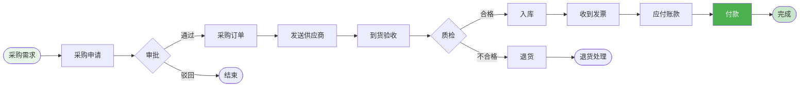

# ERP 企业资源规划系统设计

## 一、系统概述

### 1.1 系统简介

ERP（Enterprise Resource Planning）企业资源规划系统是一个集成化的企业管理系统，整合企业的财务、采购、生产、销售、库存、人力资源等核心业务流程，实现企业资源的优化配置和高效利用。

### 1.2 核心价值

| 价值点 | 说明 | 预期效果 |
|--------|------|----------|
| 🎯 **流程整合** | 打通企业全业务流程 | 流程效率提升 50% |
| 📊 **数据统一** | 建立统一数据中心 | 数据准确率 99.5% |
| 🔄 **资源优化** | 优化资源配置 | 资源利用率提升 40% |
| 📈 **决策支持** | 实时数据分析 | 决策效率提升 45% |
| 🚀 **成本控制** | 精细化成本管理 | 成本降低 30% |

### 1.3 业务需求

#### 核心功能模块
- **财务管理**：总账、应收应付、成本核算、资产管理
- **采购管理**：采购申请、采购订单、供应商管理、到货验收
- **销售管理**：销售订单、销售出库、客户管理、销售分析
- **库存管理**：库存管理、出入库管理、库存盘点、库存预警
- **生产管理**：生产计划、生产订单、物料需求、生产统计
- **人力资源**：员工管理、考勤管理、薪资管理、绩效管理
- **基础数据**：组织架构、权限管理、参数配置

#### 非功能需求
- **高可用性**：系统可用性 99.9%
- **数据一致性**：确保各模块数据一致性
- **权限安全**：严格的权限控制体系
- **性能要求**：支持 2000+ 并发用户
- **扩展性**：支持多组织、多工厂、多币种

---

## 二、系统架构

### 2.1 技术架构

```mermaid
graph TB
    subgraph Client["💻 客户端层"]
        Web["Web 管理端<br/>(Vue3 + Element Plus)"]
        Mobile["移动端<br/>(UniApp)"]
        MiniProgram["小程序<br/>(微信/钉钉)"]
    end

    subgraph Gateway["🌐 网关层"]
        SpringGW["Spring Cloud Gateway<br/>• OAuth2 认证<br/>• 限流熔断<br/>• 路由转发"]
    end

    subgraph Business["⚙️ 业务服务层"]
        Finance["财务服务<br/>finance-service"]
        Purchase["采购服务<br/>purchase-service"]
        Sales["销售服务<br/>sales-service"]
        Inventory["库存服务<br/>inventory-service"]
        Production["生产服务<br/>production-service"]
        HR["人力资源<br/>hr-service"]
        Base["基础服务<br/>base-service"]
    end

    subgraph Infrastructure["🔧 基础设施层"]
        subgraph Registry["注册中心"]
            Nacos["Nacos<br/>服务注册与发现"]
        end
        
        subgraph Message["消息队列"]
            RabbitMQ["RabbitMQ<br/>异步消息"]
        end
        
        subgraph Job["定时任务"]
            XXLJob["XXL-Job<br/>任务调度"]
        end
        
        subgraph Search["搜索引擎"]
            ES["Elasticsearch<br/>全文检索"]
        end
    end

    subgraph Data["💾 数据层"]
        MySQL["MySQL<br/>业务数据"]
        PostgreSQL["PostgreSQL<br/>主数据"]
        MongoDB["MongoDB<br/>日志数据"]
        Redis["Redis<br/>缓存"]
        ClickHouse["ClickHouse<br/>数据分析"]
        MinIO["MinIO<br/>文件存储"]
    end

    %% 连接关系
    Web --> SpringGW
    Mobile --> SpringGW
    MiniProgram --> SpringGW
    
    SpringGW --> Finance
    SpringGW --> Purchase
    SpringGW --> Sales
    SpringGW --> Inventory
    SpringGW --> Production
    SpringGW --> HR
    SpringGW --> Base
    
    Finance --> Nacos
    Purchase --> Nacos
    Sales --> Nacos
    Inventory --> Nacos
    Production --> Nacos
    HR --> Nacos
    Base --> Nacos
    
    Finance --> RabbitMQ
    Purchase --> RabbitMQ
    Sales --> RabbitMQ
    Production --> RabbitMQ
    
    Production --> XXLJob
    HR --> XXLJob
    
    Finance --> ES
    Purchase --> ES
    
    Finance --> MySQL
    Purchase --> MySQL
    Sales --> MySQL
    Inventory --> MySQL
    Production --> MySQL
    HR --> PostgreSQL
    
    Finance --> Redis
    Finance --> ClickHouse
    Base --> MinIO
    Production --> MongoDB

    %% 样式定义
    classDef clientStyle fill:#e1f5fe,stroke:#01579b,stroke-width:2px
    classDef gatewayStyle fill:#f3e5f5,stroke:#4a148c,stroke-width:2px
    classDef serviceStyle fill:#e8f5e9,stroke:#388e3c,stroke-width:2px
    classDef infraStyle fill:#fff3e0,stroke:#e65100,stroke-width:2px
    classDef dataStyle fill:#fce4ec,stroke:#c2185b,stroke-width:2px
    
    class Web,Mobile,MiniProgram clientStyle
    class SpringGW gatewayStyle
    class Finance,Purchase,Sales,Inventory,Production,HR,Base serviceStyle
    class Nacos,RabbitMQ,XXLJob,ES infraStyle
    class MySQL,PostgreSQL,MongoDB,Redis,ClickHouse,MinIO dataStyle
```



### 2.2 采购到付款流程



### 微服务划分

#### 1. 基础服务 (erp-base-service)
```java
- 组织管理 (Organization)
- 部门管理 (Department)
- 用户管理 (User)
- 角色权限 (Role & Permission)
- 数据字典 (Dictionary)
- 系统参数 (System Config)
```

#### 2. 财务服务 (erp-finance-service)
```java
- 总账管理 (General Ledger)
- 应收账款 (Accounts Receivable)
- 应付账款 (Accounts Payable)
- 成本核算 (Cost Accounting)
- 资产管理 (Asset Management)
- 报表管理 (Financial Report)
```

#### 3. 采购服务 (erp-purchase-service)
```java
- 采购申请 (Purchase Request)
- 采购订单 (Purchase Order)
- 供应商管理 (Supplier)
- 到货验收 (Goods Receipt)
- 采购退货 (Purchase Return)
```

#### 4. 销售服务 (erp-sales-service)
```java
- 销售订单 (Sales Order)
- 销售出库 (Sales Delivery)
- 销售退货 (Sales Return)
- 客户管理 (Customer)
- 价格管理 (Pricing)
- 信用管理 (Credit Management)
```

#### 5. 库存服务 (erp-inventory-service)
```java
- 库存管理 (Inventory)
- 出入库管理 (Inbound/Outbound)
- 库存调拨 (Transfer)
- 库存盘点 (Stock Taking)
- 批次管理 (Batch Management)
```

#### 6. 生产服务 (erp-production-service)
```java
- 生产计划 (Production Plan)
- 生产订单 (Production Order)
- 物料清单 (BOM)
- 工艺路线 (Routing)
- 生产领料 (Material Issue)
- 生产入库 (Production Receipt)
```

#### 7. 人力资源服务 (erp-hr-service)
```java
- 员工管理 (Employee)
- 考勤管理 (Attendance)
- 薪资管理 (Payroll)
- 绩效管理 (Performance)
- 招聘管理 (Recruitment)
```

## 数据模型设计

### 核心表结构

#### 1. 组织表 (organization)
```sql
CREATE TABLE organization (
    id BIGINT PRIMARY KEY AUTO_INCREMENT,
    org_code VARCHAR(50) NOT NULL UNIQUE COMMENT '组织编码',
    org_name VARCHAR(200) NOT NULL COMMENT '组织名称',
    parent_id BIGINT COMMENT '父组织ID',
    org_type TINYINT NOT NULL COMMENT '组织类型:1-集团,2-公司,3-工厂,4-部门',
    level INT NOT NULL COMMENT '层级',
    sort_order INT DEFAULT 0 COMMENT '排序',
    contact_person VARCHAR(50) COMMENT '联系人',
    contact_phone VARCHAR(20) COMMENT '联系电话',
    address VARCHAR(200) COMMENT '地址',
    status TINYINT DEFAULT 1 COMMENT '状态:1-启用,0-禁用',
    create_time DATETIME DEFAULT CURRENT_TIMESTAMP,
    update_time DATETIME DEFAULT CURRENT_TIMESTAMP ON UPDATE CURRENT_TIMESTAMP,
    INDEX idx_parent (parent_id),
    INDEX idx_code (org_code)
) ENGINE=InnoDB DEFAULT CHARSET=utf8mb4 COMMENT='组织表';
```

#### 2. 采购订单表 (purchase_order)
```sql
CREATE TABLE purchase_order (
    id BIGINT PRIMARY KEY AUTO_INCREMENT,
    order_no VARCHAR(50) NOT NULL UNIQUE COMMENT '采购单号',
    org_id BIGINT NOT NULL COMMENT '组织ID',
    supplier_id BIGINT NOT NULL COMMENT '供应商ID',
    order_date DATE NOT NULL COMMENT '订单日期',
    expected_date DATE COMMENT '期望到货日期',
    order_type TINYINT DEFAULT 1 COMMENT '订单类型:1-标准采购,2-紧急采购,3-委外加工',
    total_amount DECIMAL(15,2) NOT NULL DEFAULT 0 COMMENT '订单总额',
    tax_amount DECIMAL(15,2) DEFAULT 0 COMMENT '税额',
    discount_amount DECIMAL(15,2) DEFAULT 0 COMMENT '折扣金额',
    final_amount DECIMAL(15,2) NOT NULL COMMENT '最终金额',
    currency_code VARCHAR(10) DEFAULT 'CNY' COMMENT '币种',
    payment_term VARCHAR(100) COMMENT '付款条件',
    delivery_address VARCHAR(200) COMMENT '收货地址',
    status TINYINT DEFAULT 1 COMMENT '状态:1-草稿,2-待审批,3-审批中,4-已审批,5-执行中,6-已完成,7-已取消',
    buyer_id BIGINT COMMENT '采购员ID',
    approver_id BIGINT COMMENT '审批人ID',
    approve_time DATETIME COMMENT '审批时间',
    remark VARCHAR(500) COMMENT '备注',
    create_user_id BIGINT COMMENT '创建人ID',
    create_time DATETIME DEFAULT CURRENT_TIMESTAMP,
    update_time DATETIME DEFAULT CURRENT_TIMESTAMP ON UPDATE CURRENT_TIMESTAMP,
    INDEX idx_order_no (order_no),
    INDEX idx_supplier (supplier_id),
    INDEX idx_status (status),
    INDEX idx_order_date (order_date)
) ENGINE=InnoDB DEFAULT CHARSET=utf8mb4 COMMENT='采购订单表';
```

#### 3. 采购订单明细表 (purchase_order_detail)
```sql
CREATE TABLE purchase_order_detail (
    id BIGINT PRIMARY KEY AUTO_INCREMENT,
    order_id BIGINT NOT NULL COMMENT '采购单ID',
    line_no INT NOT NULL COMMENT '行号',
    product_id BIGINT NOT NULL COMMENT '物料ID',
    product_code VARCHAR(50) NOT NULL COMMENT '物料编码',
    product_name VARCHAR(200) NOT NULL COMMENT '物料名称',
    spec VARCHAR(200) COMMENT '规格',
    unit VARCHAR(20) COMMENT '单位',
    quantity DECIMAL(10,2) NOT NULL COMMENT '数量',
    unit_price DECIMAL(10,4) NOT NULL COMMENT '单价',
    tax_rate DECIMAL(5,2) DEFAULT 0 COMMENT '税率(%)',
    amount DECIMAL(15,2) NOT NULL COMMENT '金额',
    received_quantity DECIMAL(10,2) DEFAULT 0 COMMENT '已收货数量',
    invoiced_quantity DECIMAL(10,2) DEFAULT 0 COMMENT '已开票数量',
    expected_date DATE COMMENT '期望到货日期',
    warehouse_id BIGINT COMMENT '收货仓库ID',
    location_id BIGINT COMMENT '收货库位ID',
    remark VARCHAR(500) COMMENT '备注',
    create_time DATETIME DEFAULT CURRENT_TIMESTAMP,
    update_time DATETIME DEFAULT CURRENT_TIMESTAMP ON UPDATE CURRENT_TIMESTAMP,
    INDEX idx_order (order_id),
    INDEX idx_product (product_id)
) ENGINE=InnoDB DEFAULT CHARSET=utf8mb4 COMMENT='采购订单明细表';
```

#### 4. 销售订单表 (sales_order)
```sql
CREATE TABLE sales_order (
    id BIGINT PRIMARY KEY AUTO_INCREMENT,
    order_no VARCHAR(50) NOT NULL UNIQUE COMMENT '销售单号',
    org_id BIGINT NOT NULL COMMENT '组织ID',
    customer_id BIGINT NOT NULL COMMENT '客户ID',
    order_date DATE NOT NULL COMMENT '订单日期',
    delivery_date DATE COMMENT '要求交货日期',
    order_type TINYINT DEFAULT 1 COMMENT '订单类型:1-标准销售,2-预售,3-样品',
    total_amount DECIMAL(15,2) NOT NULL DEFAULT 0 COMMENT '订单总额',
    tax_amount DECIMAL(15,2) DEFAULT 0 COMMENT '税额',
    discount_amount DECIMAL(15,2) DEFAULT 0 COMMENT '折扣金额',
    final_amount DECIMAL(15,2) NOT NULL COMMENT '最终金额',
    currency_code VARCHAR(10) DEFAULT 'CNY' COMMENT '币种',
    payment_term VARCHAR(100) COMMENT '付款条件',
    delivery_address VARCHAR(200) COMMENT '交货地址',
    contact_person VARCHAR(50) COMMENT '联系人',
    contact_phone VARCHAR(20) COMMENT '联系电话',
    status TINYINT DEFAULT 1 COMMENT '状态:1-草稿,2-待审批,3-审批中,4-已审批,5-执行中,6-已完成,7-已取消',
    sales_person_id BIGINT COMMENT '销售员ID',
    approver_id BIGINT COMMENT '审批人ID',
    approve_time DATETIME COMMENT '审批时间',
    remark VARCHAR(500) COMMENT '备注',
    create_user_id BIGINT COMMENT '创建人ID',
    create_time DATETIME DEFAULT CURRENT_TIMESTAMP,
    update_time DATETIME DEFAULT CURRENT_TIMESTAMP ON UPDATE CURRENT_TIMESTAMP,
    INDEX idx_order_no (order_no),
    INDEX idx_customer (customer_id),
    INDEX idx_status (status),
    INDEX idx_order_date (order_date)
) ENGINE=InnoDB DEFAULT CHARSET=utf8mb4 COMMENT='销售订单表';
```

#### 5. 生产订单表 (production_order)
```sql
CREATE TABLE production_order (
    id BIGINT PRIMARY KEY AUTO_INCREMENT,
    order_no VARCHAR(50) NOT NULL UNIQUE COMMENT '生产单号',
    org_id BIGINT NOT NULL COMMENT '组织ID',
    workshop_id BIGINT COMMENT '车间ID',
    product_id BIGINT NOT NULL COMMENT '产品ID',
    product_code VARCHAR(50) NOT NULL COMMENT '产品编码',
    product_name VARCHAR(200) NOT NULL COMMENT '产品名称',
    spec VARCHAR(200) COMMENT '规格',
    unit VARCHAR(20) COMMENT '单位',
    plan_quantity DECIMAL(10,2) NOT NULL COMMENT '计划数量',
    actual_quantity DECIMAL(10,2) DEFAULT 0 COMMENT '实际完工数量',
    qualified_quantity DECIMAL(10,2) DEFAULT 0 COMMENT '合格数量',
    defective_quantity DECIMAL(10,2) DEFAULT 0 COMMENT '不合格数量',
    bom_id BIGINT COMMENT 'BOM ID',
    routing_id BIGINT COMMENT '工艺路线ID',
    plan_start_date DATE NOT NULL COMMENT '计划开始日期',
    plan_end_date DATE NOT NULL COMMENT '计划完成日期',
    actual_start_date DATE COMMENT '实际开始日期',
    actual_end_date DATE COMMENT '实际完成日期',
    source_type TINYINT COMMENT '来源类型:1-销售订单,2-库存补货,3-其他',
    source_no VARCHAR(50) COMMENT '来源单号',
    priority TINYINT DEFAULT 0 COMMENT '优先级:0-普通,1-重要,2-紧急',
    status TINYINT DEFAULT 1 COMMENT '状态:1-计划,2-已下达,3-生产中,4-已完工,5-已入库,6-已取消',
    manager_id BIGINT COMMENT '生产负责人ID',
    remark VARCHAR(500) COMMENT '备注',
    create_user_id BIGINT COMMENT '创建人ID',
    create_time DATETIME DEFAULT CURRENT_TIMESTAMP,
    update_time DATETIME DEFAULT CURRENT_TIMESTAMP ON UPDATE CURRENT_TIMESTAMP,
    INDEX idx_order_no (order_no),
    INDEX idx_product (product_id),
    INDEX idx_status (status),
    INDEX idx_plan_date (plan_start_date, plan_end_date)
) ENGINE=InnoDB DEFAULT CHARSET=utf8mb4 COMMENT='生产订单表';
```

#### 6. 物料清单表 (bom)
```sql
CREATE TABLE bom (
    id BIGINT PRIMARY KEY AUTO_INCREMENT,
    bom_no VARCHAR(50) NOT NULL UNIQUE COMMENT 'BOM编号',
    product_id BIGINT NOT NULL COMMENT '产品ID',
    product_code VARCHAR(50) NOT NULL COMMENT '产品编码',
    product_name VARCHAR(200) NOT NULL COMMENT '产品名称',
    version VARCHAR(20) NOT NULL COMMENT '版本',
    bom_type TINYINT DEFAULT 1 COMMENT 'BOM类型:1-标准BOM,2-配置BOM,3-销售BOM',
    is_current TINYINT DEFAULT 0 COMMENT '是否当前版本:0-否,1-是',
    effective_date DATE COMMENT '生效日期',
    expire_date DATE COMMENT '失效日期',
    status TINYINT DEFAULT 1 COMMENT '状态:1-草稿,2-已审批,3-已失效',
    remark VARCHAR(500) COMMENT '备注',
    create_user_id BIGINT COMMENT '创建人ID',
    create_time DATETIME DEFAULT CURRENT_TIMESTAMP,
    update_time DATETIME DEFAULT CURRENT_TIMESTAMP ON UPDATE CURRENT_TIMESTAMP,
    UNIQUE KEY uk_product_version (product_id, version),
    INDEX idx_bom_no (bom_no),
    INDEX idx_product (product_id)
) ENGINE=InnoDB DEFAULT CHARSET=utf8mb4 COMMENT='物料清单表';
```

#### 7. 物料清单明细表 (bom_detail)
```sql
CREATE TABLE bom_detail (
    id BIGINT PRIMARY KEY AUTO_INCREMENT,
    bom_id BIGINT NOT NULL COMMENT 'BOM ID',
    line_no INT NOT NULL COMMENT '行号',
    material_id BIGINT NOT NULL COMMENT '物料ID',
    material_code VARCHAR(50) NOT NULL COMMENT '物料编码',
    material_name VARCHAR(200) NOT NULL COMMENT '物料名称',
    spec VARCHAR(200) COMMENT '规格',
    unit VARCHAR(20) COMMENT '单位',
    quantity DECIMAL(10,4) NOT NULL COMMENT '用量',
    loss_rate DECIMAL(5,2) DEFAULT 0 COMMENT '损耗率(%)',
    is_key_material TINYINT DEFAULT 0 COMMENT '是否关键物料:0-否,1-是',
    substitute_group VARCHAR(20) COMMENT '替代组',
    remark VARCHAR(500) COMMENT '备注',
    create_time DATETIME DEFAULT CURRENT_TIMESTAMP,
    INDEX idx_bom (bom_id),
    INDEX idx_material (material_id)
) ENGINE=InnoDB DEFAULT CHARSET=utf8mb4 COMMENT='物料清单明细表';
```

#### 8. 会计科目表 (account)
```sql
CREATE TABLE account (
    id BIGINT PRIMARY KEY AUTO_INCREMENT,
    account_code VARCHAR(50) NOT NULL UNIQUE COMMENT '科目编码',
    account_name VARCHAR(200) NOT NULL COMMENT '科目名称',
    parent_id BIGINT COMMENT '父科目ID',
    level INT NOT NULL COMMENT '层级',
    account_type TINYINT NOT NULL COMMENT '科目类型:1-资产,2-负债,3-权益,4-成本,5-损益',
    balance_direction TINYINT NOT NULL COMMENT '余额方向:1-借方,2-贷方',
    is_leaf TINYINT DEFAULT 0 COMMENT '是否末级:0-否,1-是',
    is_cash TINYINT DEFAULT 0 COMMENT '是否现金科目:0-否,1-是',
    is_bank TINYINT DEFAULT 0 COMMENT '是否银行科目:0-否,1-是',
    status TINYINT DEFAULT 1 COMMENT '状态:1-启用,0-禁用',
    create_time DATETIME DEFAULT CURRENT_TIMESTAMP,
    update_time DATETIME DEFAULT CURRENT_TIMESTAMP ON UPDATE CURRENT_TIMESTAMP,
    INDEX idx_code (account_code),
    INDEX idx_parent (parent_id)
) ENGINE=InnoDB DEFAULT CHARSET=utf8mb4 COMMENT='会计科目表';
```

#### 9. 凭证表 (voucher)
```sql
CREATE TABLE voucher (
    id BIGINT PRIMARY KEY AUTO_INCREMENT,
    voucher_no VARCHAR(50) NOT NULL UNIQUE COMMENT '凭证号',
    org_id BIGINT NOT NULL COMMENT '组织ID',
    voucher_date DATE NOT NULL COMMENT '凭证日期',
    period VARCHAR(7) NOT NULL COMMENT '会计期间(YYYY-MM)',
    voucher_type TINYINT DEFAULT 1 COMMENT '凭证类型:1-记账凭证,2-收款凭证,3-付款凭证,4-转账凭证',
    total_debit DECIMAL(15,2) NOT NULL COMMENT '借方合计',
    total_credit DECIMAL(15,2) NOT NULL COMMENT '贷方合计',
    attachment_count INT DEFAULT 0 COMMENT '附件数量',
    status TINYINT DEFAULT 1 COMMENT '状态:1-草稿,2-已审核,3-已记账',
    maker_id BIGINT COMMENT '制单人ID',
    checker_id BIGINT COMMENT '审核人ID',
    check_time DATETIME COMMENT '审核时间',
    poster_id BIGINT COMMENT '记账人ID',
    post_time DATETIME COMMENT '记账时间',
    remark VARCHAR(500) COMMENT '备注',
    create_time DATETIME DEFAULT CURRENT_TIMESTAMP,
    update_time DATETIME DEFAULT CURRENT_TIMESTAMP ON UPDATE CURRENT_TIMESTAMP,
    INDEX idx_voucher_no (voucher_no),
    INDEX idx_org_period (org_id, period),
    INDEX idx_date (voucher_date)
) ENGINE=InnoDB DEFAULT CHARSET=utf8mb4 COMMENT='凭证表';
```

#### 10. 凭证明细表 (voucher_detail)
```sql
CREATE TABLE voucher_detail (
    id BIGINT PRIMARY KEY AUTO_INCREMENT,
    voucher_id BIGINT NOT NULL COMMENT '凭证ID',
    line_no INT NOT NULL COMMENT '行号',
    account_id BIGINT NOT NULL COMMENT '科目ID',
    account_code VARCHAR(50) NOT NULL COMMENT '科目编码',
    account_name VARCHAR(200) NOT NULL COMMENT '科目名称',
    summary VARCHAR(500) COMMENT '摘要',
    debit_amount DECIMAL(15,2) DEFAULT 0 COMMENT '借方金额',
    credit_amount DECIMAL(15,2) DEFAULT 0 COMMENT '贷方金额',
    currency_code VARCHAR(10) DEFAULT 'CNY' COMMENT '币种',
    exchange_rate DECIMAL(10,4) DEFAULT 1 COMMENT '汇率',
    auxiliary_type VARCHAR(20) COMMENT '辅助核算类型',
    auxiliary_id BIGINT COMMENT '辅助核算ID',
    create_time DATETIME DEFAULT CURRENT_TIMESTAMP,
    INDEX idx_voucher (voucher_id),
    INDEX idx_account (account_id)
) ENGINE=InnoDB DEFAULT CHARSET=utf8mb4 COMMENT='凭证明细表';
```

## 核心业务流程

### 1. 采购到付款流程 (P2P)

```
采购申请 → 采购订单 → 到货验收 → 采购入库 → 采购发票 → 付款
    ↓         ↓          ↓          ↓          ↓         ↓
  (待审批)  (待执行)    (待验收)    (待入库)   (待付款)   (已完成)
```

**关键步骤**：
1. 创建采购申请（需求部门发起）
2. 采购申请审批
3. 创建采购订单（采购部门）
4. 采购订单审批
5. 到货验收（质检部门）
6. 采购入库（仓库）
7. 采购发票录入（财务）
8. 应付款生成
9. 付款处理
10. 生成会计凭证

### 2. 订单到收款流程 (O2C)

```
销售订单 → 销售发货 → 销售出库 → 销售发票 → 收款
    ↓         ↓          ↓          ↓         ↓
  (待审批)  (待发货)    (待出库)    (待收款)   (已完成)
```

**关键步骤**：
1. 创建销售订单
2. 销售订单审批
3. 信用检查
4. 库存预留
5. 销售发货
6. 销售出库
7. 销售发票开具
8. 应收款生成
9. 收款处理
10. 生成会计凭证

### 3. 生产制造流程

```
生产计划 → 物料需求 → 生产订单 → 生产领料 → 生产报工 → 完工入库
    ↓         ↓          ↓          ↓          ↓          ↓
  (计划)   (需求分析)  (已下达)    (生产中)   (已报工)   (已完工)
```

**关键步骤**：
1. 制定生产计划（根据销售订单或库存补货）
2. MRP 运算（物料需求计划）
3. 生成生产订单
4. 生产订单下达
5. 生产领料（从仓库领取物料）
6. 生产报工（记录生产进度）
7. 质检（成品检验）
8. 完工入库
9. 成本核算

### 4. 月末结账流程

```
期间检查 → 成本核算 → 损益结转 → 凭证审核 → 记账 → 结账
```

**关键步骤**：
1. 检查期间数据完整性
2. 成本核算（材料成本、人工成本、制造费用）
3. 自动生成结转凭证（损益结转、成本结转）
4. 凭证审核
5. 凭证记账
6. 月末结账
7. 生成财务报表

## 技术实现方案

### 1. 工作流引擎（审批流程）

使用 **Flowable** 实现审批流程：

```java
@Service
public class PurchaseOrderWorkflowService {
    
    @Autowired
    private RuntimeService runtimeService;
    
    @Autowired
    private TaskService taskService;
    
    /**
     * 提交采购订单审批
     */
    public void submitForApproval(Long orderId) {
        PurchaseOrder order = purchaseOrderMapper.selectById(orderId);
        
        // 启动流程实例
        Map<String, Object> variables = new HashMap<>();
        variables.put("orderId", orderId);
        variables.put("orderAmount", order.getFinalAmount());
        variables.put("buyerId", order.getBuyerId());
        variables.put("orgId", order.getOrgId());
        
        ProcessInstance processInstance = runtimeService.startProcessInstanceByKey(
            "purchase_order_approval",
            order.getOrderNo(),
            variables
        );
        
        // 更新订单状态
        order.setStatus(OrderStatus.PENDING_APPROVAL);
        order.setProcessInstanceId(processInstance.getId());
        purchaseOrderMapper.updateById(order);
    }
    
    /**
     * 审批采购订单
     */
    public void approveOrder(String taskId, Long userId, boolean approved, String comment) {
        // 完成任务
        Map<String, Object> variables = new HashMap<>();
        variables.put("approved", approved);
        variables.put("approverId", userId);
        variables.put("comment", comment);
        
        taskService.complete(taskId, variables);
        
        // 如果审批通过，更新订单状态
        Task task = taskService.createTaskQuery().taskId(taskId).singleResult();
        String orderId = (String) runtimeService.getVariable(
            task.getProcessInstanceId(), 
            "orderId"
        );
        
        PurchaseOrder order = purchaseOrderMapper.selectById(Long.parseLong(orderId));
        if (approved) {
            order.setStatus(OrderStatus.APPROVED);
        } else {
            order.setStatus(OrderStatus.REJECTED);
        }
        purchaseOrderMapper.updateById(order);
    }
}
```

### 2. 分布式事务（Seata）

使用 **Seata** 处理分布式事务：

```java
@Service
public class SalesOrderService {
    
    @Autowired
    private SalesOrderMapper salesOrderMapper;
    
    @Autowired
    private InventoryServiceClient inventoryServiceClient;
    
    @Autowired
    private FinanceServiceClient financeServiceClient;
    
    /**
     * 创建销售订单（分布式事务）
     */
    @GlobalTransactional(name = "create-sales-order", rollbackFor = Exception.class)
    public Long createSalesOrder(SalesOrderDTO dto) {
        // 1. 创建销售订单
        SalesOrder order = new SalesOrder();
        BeanUtils.copyProperties(dto, order);
        order.setOrderNo(generateOrderNo());
        order.setStatus(OrderStatus.DRAFT);
        salesOrderMapper.insert(order);
        
        // 2. 创建订单明细
        for (SalesOrderDetailDTO detailDto : dto.getDetails()) {
            SalesOrderDetail detail = new SalesOrderDetail();
            BeanUtils.copyProperties(detailDto, detail);
            detail.setOrderId(order.getId());
            salesOrderDetailMapper.insert(detail);
            
            // 3. 预留库存（调用库存服务）
            inventoryServiceClient.reserveInventory(
                detailDto.getProductId(),
                detailDto.getQuantity(),
                order.getOrderNo()
            );
        }
        
        // 4. 生成应收款（调用财务服务）
        financeServiceClient.createReceivable(
            order.getId(),
            order.getCustomerId(),
            order.getFinalAmount()
        );
        
        return order.getId();
    }
}
```

### 3. MRP 物料需求计划

```java
@Service
public class MrpService {
    
    @Autowired
    private ProductionOrderMapper productionOrderMapper;
    
    @Autowired
    private BomService bomService;
    
    @Autowired
    private InventoryService inventoryService;
    
    /**
     * MRP 运算
     */
    public List<MaterialRequirement> calculateMrp(LocalDate startDate, LocalDate endDate) {
        // 1. 获取生产计划
        List<ProductionOrder> orders = productionOrderMapper.selectByDateRange(
            startDate, 
            endDate
        );
        
        List<MaterialRequirement> requirements = new ArrayList<>();
        
        for (ProductionOrder order : orders) {
            // 2. 获取 BOM
            List<BomDetail> bomDetails = bomService.getBomDetails(order.getBomId());
            
            for (BomDetail detail : bomDetails) {
                // 3. 计算物料需求
                BigDecimal requireQty = detail.getQuantity()
                    .multiply(order.getPlanQuantity())
                    .multiply(BigDecimal.ONE.add(detail.getLossRate().divide(new BigDecimal("100"))));
                
                // 4. 查询库存
                BigDecimal availableQty = inventoryService.getAvailableQuantity(
                    order.getOrgId(),
                    detail.getMaterialId()
                );
                
                // 5. 计算净需求
                BigDecimal netRequirement = requireQty.subtract(availableQty);
                
                if (netRequirement.compareTo(BigDecimal.ZERO) > 0) {
                    MaterialRequirement requirement = new MaterialRequirement();
                    requirement.setProductionOrderNo(order.getOrderNo());
                    requirement.setMaterialId(detail.getMaterialId());
                    requirement.setMaterialCode(detail.getMaterialCode());
                    requirement.setMaterialName(detail.getMaterialName());
                    requirement.setRequireQty(requireQty);
                    requirement.setAvailableQty(availableQty);
                    requirement.setNetRequirement(netRequirement);
                    requirement.setRequireDate(order.getPlanStartDate());
                    
                    requirements.add(requirement);
                }
            }
        }
        
        return requirements;
    }
}
```

### 4. 成本核算

```java
@Service
public class CostAccountingService {
    
    /**
     * 产品成本核算
     */
    @Transactional
    public void calculateProductCost(Long productionOrderId) {
        ProductionOrder order = productionOrderMapper.selectById(productionOrderId);
        
        // 1. 计算直接材料成本
        BigDecimal materialCost = calculateMaterialCost(productionOrderId);
        
        // 2. 计算直接人工成本
        BigDecimal laborCost = calculateLaborCost(productionOrderId);
        
        // 3. 计算制造费用
        BigDecimal overheadCost = calculateOverheadCost(productionOrderId);
        
        // 4. 计算总成本
        BigDecimal totalCost = materialCost.add(laborCost).add(overheadCost);
        
        // 5. 计算单位成本
        BigDecimal unitCost = totalCost.divide(
            order.getQualifiedQuantity(), 
            4, 
            RoundingMode.HALF_UP
        );
        
        // 6. 保存成本数据
        ProductionCost cost = new ProductionCost();
        cost.setProductionOrderId(productionOrderId);
        cost.setMaterialCost(materialCost);
        cost.setLaborCost(laborCost);
        cost.setOverheadCost(overheadCost);
        cost.setTotalCost(totalCost);
        cost.setUnitCost(unitCost);
        productionCostMapper.insert(cost);
        
        // 7. 更新产品成本
        updateProductCost(order.getProductId(), unitCost);
        
        // 8. 生成成本凭证
        generateCostVoucher(order, cost);
    }
    
    /**
     * 计算材料成本
     */
    private BigDecimal calculateMaterialCost(Long productionOrderId) {
        // 查询生产领料记录
        List<MaterialIssue> issues = materialIssueMapper.selectByProductionOrder(
            productionOrderId
        );
        
        BigDecimal totalCost = BigDecimal.ZERO;
        for (MaterialIssue issue : issues) {
            // 移动加权平均法计算成本
            BigDecimal cost = inventoryService.getInventoryCost(
                issue.getProductId(),
                issue.getQuantity()
            );
            totalCost = totalCost.add(cost);
        }
        
        return totalCost;
    }
}
```

### 5. 财务自动记账

```java
@Service
public class AutoVoucherService {
    
    @Autowired
    private VoucherService voucherService;
    
    /**
     * 采购入库自动生成凭证
     */
    public void generatePurchaseVoucher(Long purchaseOrderId) {
        PurchaseOrder order = purchaseOrderMapper.selectById(purchaseOrderId);
        
        // 借：原材料
        // 借：应交税费-应交增值税(进项税额)
        // 贷：应付账款
        
        VoucherDTO voucher = new VoucherDTO();
        voucher.setVoucherDate(LocalDate.now());
        voucher.setVoucherType(VoucherType.ACCOUNTING);
        
        List<VoucherDetailDTO> details = new ArrayList<>();
        
        // 借方：原材料
        VoucherDetailDTO detail1 = new VoucherDetailDTO();
        detail1.setAccountCode("1403"); // 原材料
        detail1.setSummary("采购入库-" + order.getOrderNo());
        detail1.setDebitAmount(order.getTotalAmount());
        detail1.setCreditAmount(BigDecimal.ZERO);
        details.add(detail1);
        
        // 借方：应交增值税
        VoucherDetailDTO detail2 = new VoucherDetailDTO();
        detail2.setAccountCode("2221001"); // 应交增值税-进项税额
        detail2.setSummary("采购入库-" + order.getOrderNo());
        detail2.setDebitAmount(order.getTaxAmount());
        detail2.setCreditAmount(BigDecimal.ZERO);
        details.add(detail2);
        
        // 贷方：应付账款
        VoucherDetailDTO detail3 = new VoucherDetailDTO();
        detail3.setAccountCode("2202"); // 应付账款
        detail3.setSummary("采购入库-" + order.getOrderNo());
        detail3.setDebitAmount(BigDecimal.ZERO);
        detail3.setCreditAmount(order.getFinalAmount());
        detail3.setAuxiliaryType("supplier");
        detail3.setAuxiliaryId(order.getSupplierId());
        details.add(detail3);
        
        voucher.setDetails(details);
        
        voucherService.createVoucher(voucher);
    }
}
```

### 6. 数据权限控制

```java
@Component
public class DataScopeInterceptor implements Interceptor {
    
    @Override
    public Object intercept(Invocation invocation) throws Throwable {
        // 获取当前用户
        Long userId = SecurityUtils.getCurrentUserId();
        User user = userService.getById(userId);
        
        // 获取数据权限范围
        DataScope dataScope = user.getDataScope();
        
        // 根据权限范围添加查询条件
        if (dataScope == DataScope.ORG) {
            // 只能查看本组织数据
            addOrgCondition(invocation, user.getOrgId());
        } else if (dataScope == DataScope.ORG_AND_CHILDREN) {
            // 可以查看本组织及子组织数据
            List<Long> orgIds = getOrgIdsIncludeChildren(user.getOrgId());
            addOrgInCondition(invocation, orgIds);
        } else if (dataScope == DataScope.SELF) {
            // 只能查看自己创建的数据
            addCreateUserCondition(invocation, userId);
        }
        // ALL - 可以查看所有数据，不添加条件
        
        return invocation.proceed();
    }
}
```

## API 接口设计

### 1. 采购订单接口

```java
@RestController
@RequestMapping("/api/erp/purchase/order")
public class PurchaseOrderController {
    
    @Autowired
    private PurchaseOrderService purchaseOrderService;
    
    /**
     * 创建采购订单
     */
    @PostMapping("")
    public Result<Long> createOrder(@RequestBody @Valid PurchaseOrderDTO dto) {
        Long orderId = purchaseOrderService.createOrder(dto);
        return Result.success(orderId);
    }
    
    /**
     * 提交审批
     */
    @PostMapping("/{orderId}/submit")
    public Result<Void> submitForApproval(@PathVariable Long orderId) {
        purchaseOrderService.submitForApproval(orderId);
        return Result.success();
    }
    
    /**
     * 采购订单列表
     */
    @GetMapping("")
    public Result<PageResult<PurchaseOrderVO>> listOrders(
            @RequestParam(required = false) String orderNo,
            @RequestParam(required = false) Long supplierId,
            @RequestParam(required = false) Integer status,
            @RequestParam(required = false) @DateTimeFormat(pattern = "yyyy-MM-dd") LocalDate startDate,
            @RequestParam(required = false) @DateTimeFormat(pattern = "yyyy-MM-dd") LocalDate endDate,
            @RequestParam(defaultValue = "1") Integer pageNum,
            @RequestParam(defaultValue = "20") Integer pageSize) {
        
        PageResult<PurchaseOrderVO> result = purchaseOrderService.listOrders(
            orderNo, supplierId, status, startDate, endDate, pageNum, pageSize
        );
        return Result.success(result);
    }
}
```

### 2. 生产订单接口

```java
@RestController
@RequestMapping("/api/erp/production/order")
public class ProductionOrderController {
    
    @Autowired
    private ProductionOrderService productionOrderService;
    
    /**
     * 创建生产订单
     */
    @PostMapping("")
    public Result<Long> createOrder(@RequestBody @Valid ProductionOrderDTO dto) {
        Long orderId = productionOrderService.createOrder(dto);
        return Result.success(orderId);
    }
    
    /**
     * 下达生产订单
     */
    @PostMapping("/{orderId}/release")
    public Result<Void> releaseOrder(@PathVariable Long orderId) {
        productionOrderService.releaseOrder(orderId);
        return Result.success();
    }
    
    /**
     * 生产报工
     */
    @PostMapping("/{orderId}/report")
    public Result<Void> reportProgress(
            @PathVariable Long orderId,
            @RequestBody @Valid ProductionReportDTO dto) {
        
        productionOrderService.reportProgress(orderId, dto);
        return Result.success();
    }
    
    /**
     * 完工入库
     */
    @PostMapping("/{orderId}/complete")
    public Result<Void> completeOrder(
            @PathVariable Long orderId,
            @RequestBody @Valid ProductionCompleteDTO dto) {
        
        productionOrderService.completeOrder(orderId, dto);
        return Result.success();
    }
}
```

### 3. 财务凭证接口

```java
@RestController
@RequestMapping("/api/erp/finance/voucher")
public class VoucherController {
    
    @Autowired
    private VoucherService voucherService;
    
    /**
     * 创建凭证
     */
    @PostMapping("")
    public Result<Long> createVoucher(@RequestBody @Valid VoucherDTO dto) {
        Long voucherId = voucherService.createVoucher(dto);
        return Result.success(voucherId);
    }
    
    /**
     * 审核凭证
     */
    @PostMapping("/{voucherId}/check")
    public Result<Void> checkVoucher(@PathVariable Long voucherId) {
        voucherService.checkVoucher(voucherId);
        return Result.success();
    }
    
    /**
     * 记账
     */
    @PostMapping("/{voucherId}/post")
    public Result<Void> postVoucher(@PathVariable Long voucherId) {
        voucherService.postVoucher(voucherId);
        return Result.success();
    }
    
    /**
     * 反记账
     */
    @PostMapping("/{voucherId}/unpost")
    public Result<Void> unpostVoucher(@PathVariable Long voucherId) {
        voucherService.unpostVoucher(voucherId);
        return Result.success();
    }
}
```

## 性能优化方案

### 1. 数据库优化
- 合理设计索引
- 使用分区表（按月份分区）
- 读写分离
- 定期归档历史数据

### 2. 缓存优化
- 缓存基础数据（科目、组织、用户等）
- 缓存权限数据
- 使用本地缓存 + Redis 二级缓存

### 3. 报表优化
- 使用 ClickHouse 做数据分析
- 定时同步数据到 ClickHouse
- 复杂报表异步生成

### 4. 并发优化
- 使用乐观锁处理并发
- 异步处理非核心业务

## 总结

ERP 系统的核心在于：
1. **业务集成**：打通企业各个业务环节，实现数据共享
2. **流程规范**：通过系统规范业务流程，提高管理效率
3. **数据一致性**：确保各模块数据的一致性和准确性
4. **权限控制**：严格的权限控制体系，保障数据安全
5. **灵活扩展**：支持多组织、多业务场景的扩展

本设计方案基于 Spring Cloud 微服务架构，涵盖财务、采购、销售、库存、生产、人力资源等核心模块，可满足中大型企业的 ERP 需求。

