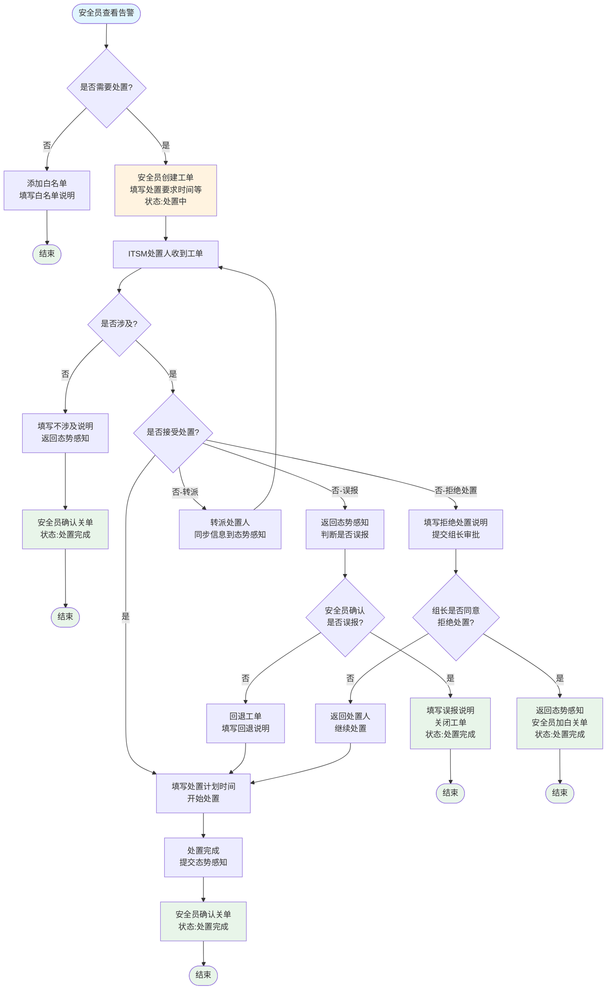
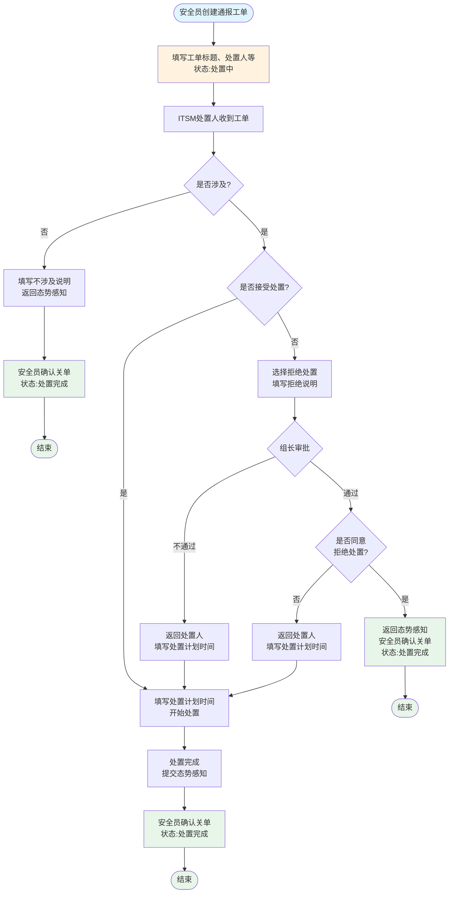
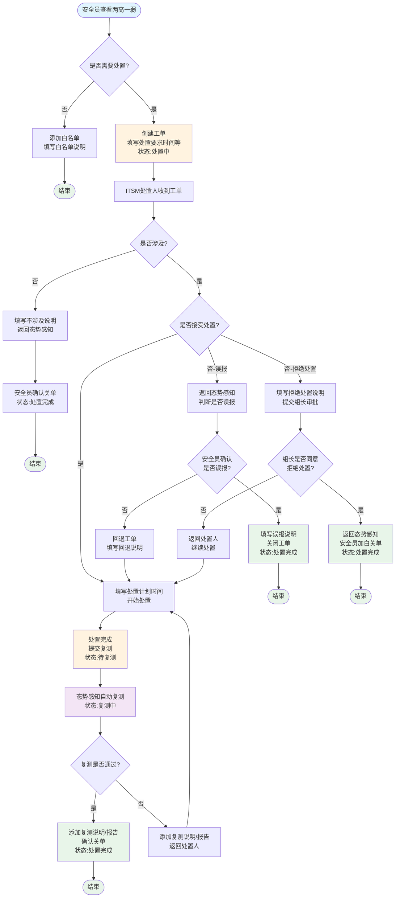
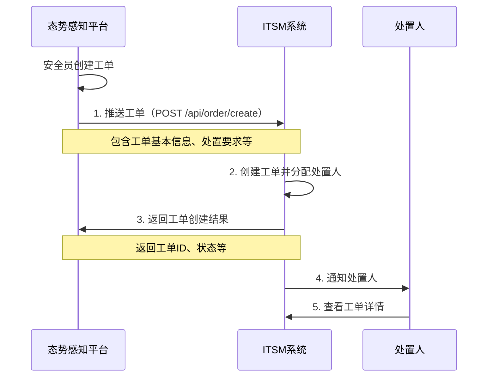
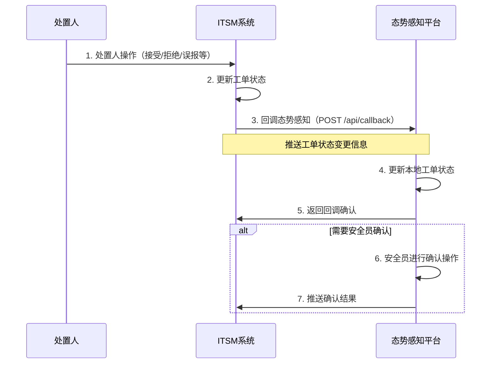
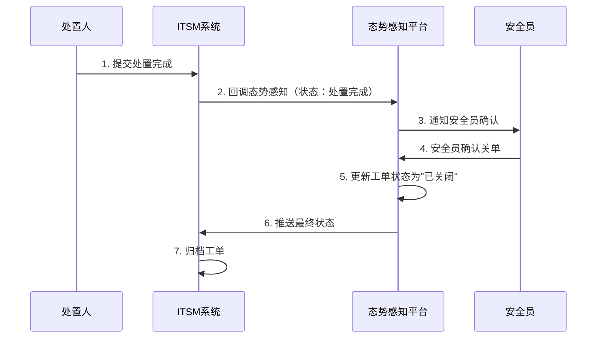
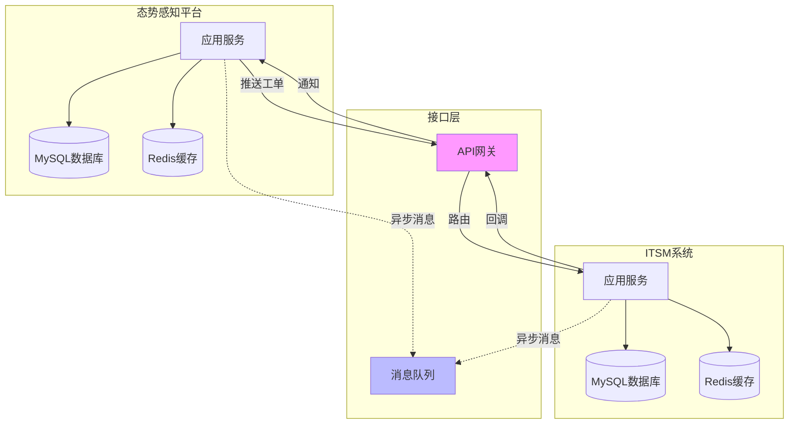

# 某XXX企业ITSM平台与态势感知对接工单接口设计

## 📋 文档说明

:::info 设计范围
本文档设计仅针对**态势感知平台**与**ITSM系统**的对接，不涉及其他平台的业务需求。对于接口和字典如需兼容其他情况，请ITSM开发组补充。
:::

### 文档符号说明

| 符号 | 说明 | 示例 |
|------|------|------|
| `[]` | 表示对应在平台上的操作 | <span style={{color: 'red'}}>[态势感知]</span>、<span style={{color: 'blue'}}>[ITSM]</span> |
| `< >` | 表示对应各平台中所需要做的下拉菜单判断 | `是否涉及` |
| `【】` | 表示填写的字段和流程中对应的处置状态 | 【处置要求时间(非必填)】 |

---

## 一、工单流转状态

### 1.1 告警工单流程

#### 1.1.1 安全员判断是否需要处置

**<span style={{color: 'red'}}>[态势感知]</span> 安全员操作：**

- **否（不需要处置）**：安全员判断不需要处置就直接添加白名单并填写【白名单说明(非必填)】

- **是（需要处置）**：安全员选择告警条目并填写以下信息：
  - 【处置要求时间(非必填)】
  - 【工单附件(非必填)】
  - 【工单说明(非必填)】
  
  发送给ITSM平台申请工单，告警处置状态变更为：**【处置中】**

#### 1.1.2 处置人判断是否涉及

**<span style={{color: 'blue'}}>[ITSM]</span> 根据安全告警条目创建工单给对应的负责人，负责人需要判断：**

##### 场景1：是否涉及 = **否**

处置人判定负责的系统不涉及该安全问题：
1. 填写【不涉及说明(非必填)】
2. 将【不涉及(可选)】和【不涉及说明(非必填)】返回给 <span style={{color: 'red'}}>[态势感知]</span>
3. 安全员确认关闭工单
4. 告警处置状态为：**【处置完成】**
5. 自动同步【处置完成时间】

##### 场景2：是否涉及 = **是**

处置人需要继续判断是否接受处置：

**2.1 是否接受处置 = 是（接受）**

1. 处置人填写【处置计划时间(必填)】
2. 将【接受】、【处置计划时间(必填)】返回给态势感知
3. 根据工单中的内容或处置意见进行处置

**2.2 是否接受处置 = 否（拒绝）**

处置人需要判断原因：

**2.2.1 误报场景**

<span style={{color: 'blue'}}>[ITSM]</span> 处置人判断为误报，返回给安全员确认：

- **<span style={{color: 'red'}}>[态势感知]</span> 是否误报 = 是**：
  - 安全员填写【误报说明(非必填)】确认关闭工单
  - 自动同步【处置完成时间】
  - 告警处置状态为：**【处置完成】**

- **<span style={{color: 'red'}}>[态势感知]</span> 是否误报 = 否**：
  - 回退工单并填写【回退说明(非必填)】（说明不是误报的原因）
  - 返回给 <span style={{color: 'blue'}}>[ITSM]</span> 处置人继续填写【处置计划时间】并进行处置

**2.2.2 转派场景**

- <span style={{color: 'blue'}}>[ITSM]</span> 推送转派人信息到态势感知服务
- <span style={{color: 'red'}}>[态势感知]</span> 工单同步转派人信息

**2.2.3 拒绝处置场景**

处置人判断存在该安全问题，但由于某种原因无法处置：

1. <span style={{color: 'blue'}}>[ITSM]</span> 处置人选择【拒绝处置(可选)】，填写【拒绝处置说明(非必填)】
2. 提交给组长审批

组长审批判断：

- **是否同意拒绝处置 = 是**：
  - 组长同意拒绝处置
  - 将【拒绝处置(可选)】和【拒绝处置说明(非必填)】返回给 <span style={{color: 'red'}}>[态势感知]</span>
  - 安全员对该事件确认加白并填写【白名单说明(非必填)】
  - 确认关闭工单，自动同步【处置完成时间】
  - 告警处置状态为：**【处置完成】**

- **是否同意拒绝处置 = 否**：
  - 组长不同意拒绝处置
  - 工单返回给处置人填写【处置计划时间】继续进行处置

#### 1.1.3 处置完成

<span style={{color: 'blue'}}>[ITSM]</span> 处置人完成安全事件的处置：
1. 提交给 <span style={{color: 'red'}}>[态势感知]</span> 安全员确认关单
2. 自动同步【处置完成时间】
3. 告警处置状态为：**【处置完成】**

#### 1.1.4 补充说明

**时间字段说明：**

| 字段 | 说明 |
|------|------|
| 【处置要求时间】 | 态势感知将告警推送给ITSM时，安全员标记的时间（可为空） |
| 【处置计划时间】 | ITSM处置人接到工单时首先反馈给态势感知的字段（必填） |
| 【处置完成时间】 | 处置人点击处置完成的时间 |

**时间校验规则：**
```
处置计划时间 ≤ 处置完成时间 ≤ 处置要求时间
```

**特殊操作权限：**
- ✅ 态势感知上允许安全员将已处置的工单回退给处置人
- ✅ 态势感知上允许安全员对安全事件告警添加白名单

#### 告警工单流程图



---

### 1.2 通报工单流程

#### 1.2.1 创建通报工单

**<span style={{color: 'red'}}>[态势感知]</span> 安全员填写通报信息：**

必填信息：
- 【工单标题(必填)】
- 【处置人(必填)】

可选信息：
- 【处置要求时间(非必填)】
- 【工单附件(非必填)】
- 【工单说明(非必填)】

发送给ITSM平台申请工单，通报处置状态为：**【处置中】**

#### 1.2.2 处置人判断是否涉及

**<span style={{color: 'blue'}}>[ITSM]</span> 根据通报信息创建工单给对应的负责人：**

##### 场景1：是否涉及 = **否**

1. 处置人填写【不涉及说明(非必填)】
2. 将【不涉及(可选)】和【不涉及说明(非必填)】返回给 <span style={{color: 'red'}}>[态势感知]</span>
3. 安全员确认关闭工单
4. 自动同步【处置完成时间】
5. 通报处置状态为：**【处置完成】**

##### 场景2：是否涉及 = **是**

处置人需要继续判断是否接受处置：

**2.1 是否接受处置 = 是**

1. 处置人填写【处置计划时间(必填)】
2. 将【接受】、【处置计划时间(必填)】返回给态势感知
3. 开始处置

**2.2 是否接受处置 = 否（拒绝处置）**

1. 处置人选择【拒绝处置(可选)】，填写【拒绝处置说明(非必填)】
2. 提交给组长审批

组长审批流程：

- **组长审批 = 不通过**：
  - 返回给处置人填写【处置计划时间(必填)】继续处置

- **组长审批 = 通过**：
  - 继续判断是否同意拒绝处置
  
  - **是否同意 = 是**：
    - 组长同意拒绝处置
    - 将【拒绝处置(可选)】和【拒绝处置说明(非必填)】返回给 <span style={{color: 'red'}}>[态势感知]</span>
    - 安全员确认关闭工单
    - 自动同步【处置完成时间】
    - 通报处置状态为：**【处置完成】**
  
  - **是否同意 = 否**：
    - 组长不同意拒绝处置
    - 返回给处置人填写【处置计划时间(必填)】继续处置

#### 1.2.3 处置完成

<span style={{color: 'blue'}}>[ITSM]</span> 处置人完成处置：
1. 提交给 <span style={{color: 'red'}}>[态势感知]</span>
2. 安全员确认关闭工单
3. 自动同步【处置完成时间】
4. 通报处置状态为：**【处置完成】**

#### 1.2.4 补充说明

**时间字段说明：**

| 字段 | 说明 |
|------|------|
| 【处置要求时间】 | 态势感知将通报推送给ITSM时，安全员标记的时间（可为空） |
| 【处置计划时间】 | ITSM处置人接到工单时首先反馈给态势感知的字段（必填） |
| 【处置完成时间】 | 安全员最后确认关闭工单的时间 |

**时间校验规则：**
```
处置计划时间 ≤ 处置完成时间 ≤ 处置要求时间
```

**特殊操作权限：**
- ✅ 态势感知上允许安全员将已处置的工单回退给处置人

#### 通报工单流程图



---

### 1.3 两高一弱工单流程

:::info 两高一弱说明
**两高一弱** = 高危漏洞 + 高危端口 + 弱口令
:::

#### 1.3.1 安全员判断是否需要处置

**<span style={{color: 'red'}}>[态势感知]</span> 安全员查看漏洞、高危端口、弱口令：**

- **否（不需要处置）**：添加白名单并填写【白名单说明(非必填)】

- **是（需要处置）**：选择条目并填写以下信息：
  - 【处置要求时间(非必填)】
  - 【工单附件(非必填)】
  - 【工单说明(非必填)】
  
  发送给ITSM平台申请工单，漏洞处置状态为：**【处置中】**

#### 1.3.2 处置人判断是否涉及

**<span style={{color: 'blue'}}>[ITSM]</span> 创建工单给对应的负责人：**

##### 场景1：是否涉及 = **否**

1. 处置人填写【不涉及说明(非必填)】
2. 将【不涉及(可选)】和【不涉及说明(非必填)】返回给安全员
3. 安全员确认关闭工单
4. 自动同步【处置完成时间】
5. 漏洞处置状态为：**【处置完成】**

##### 场景2：是否涉及 = **是**

处置人需要继续判断是否接受处置：

**2.1 是否接受处置 = 是**

1. 处置人填写【处置计划时间(必填)】
2. 将【接受】、【处置计划时间(必填)】返回给态势感知
3. 开始处置

**2.2 是否接受处置 = 否**

处置人需要判断原因：

**2.2.1 误报场景**

<span style={{color: 'blue'}}>[ITSM]</span> 处置人判断为误报：

- **<span style={{color: 'red'}}>[态势感知]</span> 是否误报 = 是**：
  - 安全员填写【误报说明(非必填)】并确认关闭工单
  - 自动同步【处置完成时间】
  - 漏洞处置状态为：**【处置完成】**

- **<span style={{color: 'red'}}>[态势感知]</span> 是否误报 = 否**：
  - 回退工单并填写【回退说明(非必填)】
  - 返回给处置人继续填写【处置计划时间】并进行处置

**2.2.2 拒绝处置场景**

处置人判断存在该安全问题，但由于某种原因无法处置：

1. <span style={{color: 'blue'}}>[ITSM]</span> 处置人选择【拒绝处置(可选)】，填写【拒绝处置说明(非必填)】
2. 提交给组长审批

组长审批判断：

- **是否同意拒绝处置 = 是**：
  - 组长同意拒绝处置
  - 将【拒绝处置(可选)】和【拒绝处置说明(非必填)】返回给 <span style={{color: 'red'}}>[态势感知]</span>
  - 安全员对该漏洞加白并填写【白名单说明(非必填)】
  - 确认关闭工单，自动同步【处置完成时间】
  - 漏洞处置状态为：**【处置完成】**

- **是否同意拒绝处置 = 否**：
  - 组长不同意拒绝处置
  - 返回给处置人填写【处置计划时间】继续处置

#### 1.3.3 漏洞复测流程

**提交复测：**

<span style={{color: 'blue'}}>[ITSM]</span> 处置人完成漏洞处置后：
1. 提交给 <span style={{color: 'red'}}>[态势感知]</span> 进行复测
2. 漏洞处置状态为：**【待复测】**

**自动复测：**

<span style={{color: 'red'}}>[态势感知]</span> 根据待复测的漏洞信息条目进行自动复测：
1. 复测期间状态为：**【复测中】**
2. 复测完成后自动判断是否复测通过

**复测结果处理：**

- **是否复测通过 = 是**：
  - 态势感知将复测结果添加至【复测说明(非必填)】或附件（复测报告）
  - 确认关闭工单
  - 自动同步【处置完成时间】
  - 漏洞处置状态为：**【处置完成】**

- **是否复测通过 = 否**：
  - 安全员将复测结果添加至【复测说明(非必填)】或附件（复测报告）
  - 工单返回给处置人继续填写【处置计划时间】并进行处置

#### 1.3.4 补充说明

**时间字段说明：**

| 字段 | 说明 |
|------|------|
| 【处置要求时间】 | 态势感知将漏洞推送给ITSM时，安全员标记的时间（可为空） |
| 【处置计划时间】 | ITSM处置人接到工单时首先反馈给态势感知的字段（必填） |
| 【处置完成时间】 | 安全员最后确认关闭工单的时间 |

**时间校验规则：**
```
处置计划时间 ≤ 处置完成时间 ≤ 处置要求时间
```

**特殊操作权限：**
- ✅ 态势感知上允许安全员将已处置的工单回退给处置人
- ✅ 态势感知上允许安全员对两高一弱问题添加白名单

#### 两高一弱工单流程图



---

## 二、统一运维管理平台推送接口参数

### 2.1 API 样式

```json
[{
  "id": 12345,                    // 唯一标识
  "applicationName": "",          // 业务系统名称
  "applicationCode": "",          // 系统编码
  "applicationIp": "",            // 系统IP
  "managerNo": "",                // 系统负责人员工号
  "managerName": "",              // 系统负责人姓名
  "remark": "",                   // 说明
  "title": "",                    // 工单标题
  "work_order_type": "",          // 工单类型
  "work_order_status": "",        // 状态
  "work_order_owner": "",         // 当前处理人
  "work_order_creator": "",       // 发起人
  "notification": ""              // 工单通知
}]
```

---

### 2.2 数据字典

#### 2.2.1 告警工单数据字典

| 字段标识 | 字段名称 | 类型 | 说明示例 | 必填 |
|---------|---------|------|---------|------|
| `id` | 工单ID | string | 如：xxxx | ✅ 是 |
| `applicationName` | 业务系统名称 | string | 如：核心系统 | ✅ 是 |
| `applicationIp` | 系统IP/邮箱地址 | ip | 如：172.16.8.8、qwe@qq.com | ✅ 是 |
| `managerNo` | 系统负责人域账号 | string | wangwu（取ldap中的账号名称） | ✅ 是 |
| `title` | 工单标题 | string | 如：XDR安全设备转换类规则检测到攻击成功事件 | ✅ 是 |
| `work_order_type` | 工单类型 | enum | 如：通报工单、告警工单、两高一弱工单 | ✅ 是 |
| `start_time` | 发起时间 | date | 如：2025-06-09 14:50:15 | ✅ 是 |
| `deadline` | 截止时间 | date | 如：2025-06-09 16:50:15 | ✅ 是 |
| `organization_id_path` | 组织机构 | string | 如：集团/北京分公司 | ❌ 否 |
| `work_order_status` | 状态 | enum | 如：待处置、处置中、待复测、复测中、处置完成 | ✅ 是 |
| `work_order_creator` | 发起人 | string | 如：张三 | ✅ 是 |
| `content` | 工单内容 | text | 见下方示例 | ✅ 是 |
| `commit_attachment` | 工单附件 | file | 支持格式：rar、zip、gz、doc、docx、pdf、txt、ppt、pptx、xlsx、xls、csv、jpg、jpeg、png | ❌ 否 |
| - | 处置建议 | text | 安全事件告警的处置建议 | ✅ 是 |
| - | 处置要求时间 | datetime | 安全员申请工单填写的处置要求时间 | ❌ 否 |
| - | 工单说明 | text | 安全员申请工单填写的工单说明 | ❌ 否 |
| - | 白名单说明 | text | 安全员将安全事件添加白名单需要进行说明 | ❌ 否 |
| - | 回退说明 | text | 安全员判断该事件不是误报或重发，并添加说明 | ❌ 否 |

**工单内容示例：**

```
告警内容：检测到主机:10.18.180.139 (10.18.180.139)和10.16.35.245 (人力资源服务器)(ehr.corp.qihoo.net)之间存在可疑通信,命中用户自定义情报

告警类型：威胁情报
告警级别：紧急
攻击者组：ehr.corp.qihoo.net
受害者组：10.18.180.139
告警次数：11
开始时间：2025-06-26 13:20:27
```

---

#### 2.2.2 通报工单数据字典

| 字段标识 | 字段名称 | 类型 | 说明示例 | 必填 |
|---------|---------|------|---------|------|
| `id` | 工单ID | string | 如：xxxx | ✅ 是 |
| `title` | 工单标题 | string | 如：国家网络安全通报中心：发现一批境外恶意网址和恶意IP | ✅ 是 |
| `work_order_type` | 工单类型 | enum | 如：通报工单、告警工单、两高一弱工单 | ✅ 是 |
| `start_time` | 发起时间 | date | 如：2025-06-09 14:50:15 | ✅ 是 |
| `deadline` | 截止时间 | date | 如：2025-06-09 16:50:15 | ✅ 是 |
| `organization_id_path` | 组织机构 | string | 如：集团/北京分公司 | ❌ 否 |
| `work_order_status` | 状态 | enum | 如：待处置、处置中、待复测、复测中、处置完成 | ✅ 是 |
| - | 负责人域账号 | string | - | ✅ 是 |
| `work_order_creator` | 发起人 | string | 如：张三 | ✅ 是 |
| `content` | 工单内容 | text | 见下方示例 | ✅ 是 |
| `commit_attachment` | 工单附件 | file | 支持格式：rar、zip、gz、doc、docx、pdf、txt、ppt、pptx、xlsx、xls、csv、jpg、jpeg、png | ❌ 否 |
| - | 处置建议 | text | 安全事件告警的处置建议 | ✅ 是 |
| - | 处置要求时间 | datetime | 安全员申请工单填写的处置要求时间 | ❌ 否 |
| - | 工单说明 | text | 安全员申请工单填写的工单说明 | ❌ 否 |
| - | 回退说明 | text | 安全员重发，并添加说明 | ❌ 否 |

**工单内容示例：**

```
"国家网络安全通报中心"7月7日消息，中国国家网络与信息安全信息通报中心通过支撑单位发现一批境外恶意网址和恶意IP，相关恶意网址和恶意IP归属地主要涉及：美国、荷兰、瑞士、比利时、波兰、南非、立陶宛。

归属地：美国/加利福尼亚州/洛杉矶
威胁类型：后门
病毒家族：Zegost
描述：一种远控木马，它在系统中植入后门，从C2站点接收控制指令，能够下载文件、执行指定程序、收集系统信息、结束进程等。通常它会伪装成压缩包、图片等文档或系统文件，诱导用户点击执行。
```

---

#### 2.2.3 两高一弱工单数据字典

| 字段标识 | 字段名称 | 类型 | 说明示例 | 必填 |
|---------|---------|------|---------|------|
| `id` | 漏洞ID | string | - | ✅ 是 |
| `vulName` | 漏洞名 | string | Bash环境变量远程命令执行漏洞(CVE-2014-7169) | ✅ 是 |
| `vulGroup` | 漏洞所属 | string | 1:系统漏洞, 2:应用漏洞, 3:弱口令, 4:高危服务端口 | ✅ 是 |
| `targetScan` | IP/URL | string | 目标值，可能是IP，可能是http://地址 | ✅ 是 |
| `applicationName` | 业务系统 | List | `["测试系统100"]` | ✅ 是 |
| `vulDesc` | 漏洞描述 | string | GNU Bash 存在安全漏洞，该漏洞源于…… | ✅ 是 |
| `vulFormalSolution` | 修复建议 | string | 升级bash到最新版本，漏洞…… | ✅ 是 |
| `ownerAccountList` | 负责人域账号 | List | `["user-10101", "user-10112"]` | ✅ 是 |
| `touchVersion` | 影响版本 | string | - | ✅ 是 |
| `work_order_type` | 工单类型 | enum | 如：通报工单、告警工单、漏洞工单 | ✅ 是 |
| `processStatus` | 漏洞状态 | string | 如：待处置、处置中、待复测、复测中、处置完成 | ✅ 是 |
| - | 处置要求时间 | datetime | 安全员申请工单填写的处置要求时间 | ❌ 否 |
| - | 工单说明 | text | 安全员申请工单填写的工单说明 | ❌ 否 |
| - | 弱口令账号 | list | 在两高一弱的工单中，弱口令需要列出弱口令账号 | ✅ 是 |
| - | 高危端口 | list | 在两高一弱的工单中，需要列出高危端口是哪些 | ✅ 是 |
| - | 高危服务 | list | 在两高一弱的工单中，需要列出对应的高危服务有哪些 | ✅ 是 |
| - | 白名单说明 | text | 安全员将两高一弱添加白名单需要进行的说明 | ❌ 否 |
| - | 回退说明 | text | 安全员判断该漏洞不是误报或需要重发，并添加说明 | ❌ 否 |
| - | 复测说明 | text | 态势感知对两高一弱进行复测并添加说明（包含复测报告） | ❌ 否 |

---

## 三、统一运维管理平台返回接口参数

### 3.1 API 样式

```json
[{
  "id": 12345,                    // 唯一标识
  "applicationName": "",          // 业务系统名称
  "applicationCode": "",          // 系统编码
  "applicationIp": "",            // 系统IP
  "managerNo": "",                // 系统负责人员工号
  "managerName": "",              // 系统负责人姓名
  "remark": "",                   // 说明
  "title": "",                    // 工单标题
  "work_order_type": "",          // 工单类型
  "work_order_status": "",        // 状态
  "work_order_owner": "",         // 当前处理人
  "work_order_creator": "",       // 发起人
  "notification": ""              // 工单通知
}]
```

---

### 3.2 数据字典

#### 3.2.1 告警工单返回数据字典

| 字段标识 | 字段名称 | 类型 | 说明示例 | 必填 |
|---------|---------|------|---------|------|
| `id` | 工单ID | string | 如：xxxx | ✅ 是 |
| `title` | 工单标题 | string | 如：XDR安全设备转换类规则检测到攻击成功事件 | ✅ 是 |
| `work_order_type` | 工单类型 | enum | 如：通报工单、告警工单、漏洞工单 | ✅ 是 |
| `work_order_status` | 状态 | string | 如：待提交、待处置、处置完成、待审批、审批不通过、已回退、已关闭、已发布 | ✅ 是 |
| - | 处置计划时间 | datetime | 处置人首先返回给态感的处置完成的计划时间 | ✅ 是 |
| - | 处置完成时间 | datetime | 返回给态感处置人处置安全事件的完成时间 | ✅ 是 |
| - | 附件 | file | - | ❌ 否 |
| - | 是否涉及（是） | boolean | 需要传给态势感知是否涉及的情况，默认是【是】 | ✅ 是 |
| - | 不涉及说明 | text | 安全员判断不涉及该安全事件，并添加说明 | ❌ 否 |
| - | 是否接受（是） | boolean | 同是否涉及，需要返回给态势感知是否接受处置的情况，默认是【是】 | ✅ 是 |
| - | 误报 | boolean | 处置人判断该漏洞为误报 | ❌ 否 |
| - | 是否同意（是） | boolean | 由组长的页面进行返回，是否同意，默认是【是】 | ✅ 是 |
| - | 拒绝处置说明 | text | 处置人拒绝处置，添加的说明 | ❌ 否 |

---

#### 3.2.2 通报工单返回数据字典

| 字段标识 | 字段名称 | 类型 | 说明示例 | 必填 |
|---------|---------|------|---------|------|
| `id` | 工单ID | string | 如：xxxx | ✅ 是 |
| `title` | 工单标题 | string | 如：国家网络安全通报中心：发现一批境外恶意网址和恶意IP | ✅ 是 |
| `work_order_type` | 工单类型 | enum | 如：通报工单、告警工单、漏洞工单 | ✅ 是 |
| `work_order_status` | 状态 | string | 如：待提交、待处置、处置完成、待审批、审批不通过、已回退、已关闭、已发布 | ✅ 是 |
| - | 处置计划时间 | datetime | 处置人首先返回给态感的处置完成的计划时间 | ✅ 是 |
| - | 处置完成时间 | datetime | 返回给态感处置人处置安全事件的完成时间 | ✅ 是 |
| - | 附件 | file | - | ❌ 否 |
| - | 是否涉及（是） | boolean | 需要传给态势感知是否涉及的情况，默认是【是】 | ✅ 是 |
| - | 不涉及说明 | text | 安全员判断不涉及该安全事件，并添加说明 | ❌ 否 |
| - | 是否接受（是） | boolean | 同是否涉及，需要返回给态势感知是否接受处置的情况，默认是【是】 | ✅ 是 |
| - | 是否同意（是） | boolean | 由组长的页面进行返回，是否同意，默认是【是】 | ✅ 是 |
| - | 拒绝处置说明 | text | 处置人拒绝处置，添加的说明 | ❌ 否 |

---

#### 3.2.3 两高一弱工单返回数据字典

| 字段标识 | 字段名称 | 类型 | 说明示例 | 必填 |
|---------|---------|------|---------|------|
| `id` | 漏洞ID | string | 如：xxxx | ✅ 是 |
| `title` | 工单标题 | string | 如：国家网络安全通报中心：发现一批境外恶意网址和恶意IP | ✅ 是 |
| `work_order_type` | 工单类型 | enum | 如：通报工单、告警工单、漏洞工单 | ✅ 是 |
| `processStatus` | 漏洞状态 | string | **扫描**：新增、重复出现<br/>**验证**：已验证修复、已验证误报、已验证忽略<br/>**修复**：已下发待修复、已修复待核验<br/>**复测**：核验已修复、核验未修复 | ✅ 是 |
| - | 处置计划时间 | datetime | 处置人首先返回给态感的处置完成的计划时间 | ✅ 是 |
| - | 处置完成时间 | datetime | 返回给态感处置人处置安全事件的完成时间 | ✅ 是 |
| - | 附件 | file | - | ❌ 否 |
| - | 是否涉及（是） | boolean | 需要传给态势感知是否涉及的情况，默认是【是】 | ✅ 是 |
| - | 不涉及说明 | text | 安全员判断不涉及该安全事件，并添加说明 | ❌ 否 |
| - | 是否接受（是） | boolean | 同是否涉及，需要返回给态势感知是否接受处置的情况，默认是【是】 | ✅ 是 |
| - | 误报 | boolean | 处置人判断该漏洞为误报 | ❌ 否 |
| - | 是否同意（是） | boolean | 由组长的页面进行返回，是否同意，默认是【是】 | ✅ 是 |
| - | 拒绝处置说明 | text | 处置人拒绝处置，添加的说明 | ❌ 否 |

---

## 四、态势工单回调接口参数

### 4.1 API 样式

```json
[{  
  "id": "",                           // 工单唯一标识
  "title": "",                        // 工单标题
  "work_order_type": "",              // 工单类型
  "work_order_status": "",            // 当前状态
  "work_order_creator": "",           // 发起人姓名
  "work_order_owner": "",             // 当前处理人姓名
  "plan_finish_time": "",             // 计划完成时间，格式：yyyy-MM-dd HH:mm:ss
  "actual_finish_time": "",           // 实际完成时间
  "attachment": "",                   // 附件如何传输，待定
  "is_involved": "",                  // 是否涉及问题
  "not_involved_reason": "",          // 不涉及说明
  "is_accepted": "",                  // 是否接受处置
  "is_false_alarm": "",               // 是否为误报
  "is_approved": "",                  // 是否批准拒绝处置
  "action_type": "",                  // 审批动作类型
  "reject_dispose_reason": "",        // 拒绝处置说明
  "description": ""                   // 工单描述或备注信息
}]
```

---

### 4.2 回调数据字典

| 字段标识 | 字段名称 | 类型 | 说明 | 必填 |
|---------|---------|------|------|------|
| `id` | 工单ID | string | 工单唯一标识，**必须与态势感知平台最初推送的工单ID完全一致**，用于工单匹配与状态更新 | ✅ 是 |
| `title` | 工单标题 | string | 工单标题，便于识别和定位具体工单内容 | ✅ 是 |
| `work_order_type` | 工单类型 | enum | 工单类型，枚举值：**告警工单**、**通报工单**、**两高一弱工单** | ✅ 是 |
| `work_order_status` | 状态 | string | 当前工单状态，用于同步处置进度，取值见"状态码定义"章节 | ✅ 是 |
| `work_order_creator` | 发起人 | string | 工单发起人姓名（即态势感知侧的安全员姓名）；<br/>**转派场景下**表示转出的人（当前工单负责人） | ✅ 是 |
| `work_order_owner` | 工单处理人 | string | 当前工单的实际处理人姓名，用于责任追踪；<br/>**转派场景下**表示转入的人（新负责人） | ❌ 否 |
| `plan_finish_time` | 计划完成时间 | string | 计划完成处置的时间，格式：`yyyy-MM-dd HH:mm:ss` | ✅ 是 |
| `actual_finish_time` | 实际完成时间 | string | 实际完成处置的时间，格式：`yyyy-MM-dd HH:mm:ss`，在工单完成后填写 | ❌ 否 |
| `attachment` | 附件 | - | 待定 | ❌ 否 |
| `is_involved` | 是否涉及问题 | boolean | 是否涉及该安全问题：`true`（是）、`false`（否） | ✅ 是 |
| `not_involved_reason` | 不涉及说明 | string | 当 `is_involved = false` 时，说明不涉及的原因 | ❌ 否 |
| `is_accepted` | 是否接受处置 | boolean | 是否接受该处置任务：`true`（接受）、`false`（拒绝） | ✅ 是 |
| `is_false_alarm` | 是否为误报 | boolean | 是否判定为误报，仅适用于告警工单：`true`（是误报）、`false`（非误报） | ✅ 是 |
| `is_approved` | 是否批准拒绝处置 | boolean | 组长是否批准"拒绝处置"请求：`true`（同意拒绝）、`false`（驳回），用于审批流程 | ✅ 是 |
| `action_type` | 审批动作 | string | 审批动作类型：<br/>• `leader_reject`（拒绝处置且组长不同意）<br/>• `reassign`（转派处置）<br/>用于标识回调的具体操作类型 | ❌ 否 |
| `reject_dispose_reason` | 拒绝处置说明 | string | 拒绝处置的详细原因说明，建议在拒绝时填写 | ❌ 否 |
| `description` | 描述 | string | 工单描述或备注信息，可用于记录额外的处置说明、补充信息等 | ❌ 否 |

---

## 五、工单状态码定义

### 5.1 告警工单状态

| 状态码 | 状态名称 | 说明 | 所属平台 |
|--------|---------|------|---------|
| `PENDING` | 待处置 | 工单已创建，等待处置人处理 | ITSM |
| `PROCESSING` | 处置中 | 处置人正在处理工单 | ITSM |
| `COMPLETED` | 处置完成 | 工单已完成处置并关闭 | 态势感知 |
| `REJECTED` | 已回退 | 安全员回退工单给处置人 | 态势感知 |
| `PENDING_APPROVAL` | 待审批 | 等待组长审批 | ITSM |
| `APPROVAL_REJECTED` | 审批不通过 | 组长审批不通过 | ITSM |
| `WHITELISTED` | 已加白 | 安全员已将告警加入白名单 | 态势感知 |

### 5.2 通报工单状态

| 状态码 | 状态名称 | 说明 | 所属平台 |
|--------|---------|------|---------|
| `PENDING` | 待处置 | 工单已创建，等待处置人处理 | ITSM |
| `PROCESSING` | 处置中 | 处置人正在处理工单 | ITSM |
| `COMPLETED` | 处置完成 | 工单已完成处置并关闭 | 态势感知 |
| `REJECTED` | 已回退 | 安全员回退工单给处置人 | 态势感知 |
| `PENDING_APPROVAL` | 待审批 | 等待组长审批 | ITSM |
| `APPROVAL_REJECTED` | 审批不通过 | 组长审批不通过 | ITSM |

### 5.3 两高一弱工单状态

| 状态码 | 状态名称 | 说明 | 所属平台 |
|--------|---------|------|---------|
| `PENDING` | 待处置 | 工单已创建，等待处置人处理 | ITSM |
| `PROCESSING` | 处置中 | 处置人正在处理工单 | ITSM |
| `PENDING_RETEST` | 待复测 | 处置完成，等待复测 | 态势感知 |
| `RETESTING` | 复测中 | 正在进行自动复测 | 态势感知 |
| `RETEST_PASSED` | 复测通过 | 复测通过，准备关闭工单 | 态势感知 |
| `RETEST_FAILED` | 复测未通过 | 复测未通过，返回处置人 | 态势感知 |
| `COMPLETED` | 处置完成 | 工单已完成处置并关闭 | 态势感知 |
| `REJECTED` | 已回退 | 安全员回退工单给处置人 | 态势感知 |
| `PENDING_APPROVAL` | 待审批 | 等待组长审批 | ITSM |
| `APPROVAL_REJECTED` | 审批不通过 | 组长审批不通过 | ITSM |
| `WHITELISTED` | 已加白 | 安全员已将漏洞加入白名单 | 态势感知 |

---

## 六、接口调用流程

### 6.1 工单创建流程



### 6.2 工单处置流程



### 6.3 工单关闭流程



---

## 七、接口安全设计

### 7.1 认证机制

**推荐使用以下认证方式：**

1. **API Key 认证**
   ```http
   POST /api/order/create
   Headers:
     X-API-Key: your-api-key
     X-API-Secret: your-api-secret
   ```

2. **OAuth 2.0 认证**（推荐）
   ```http
   POST /api/order/create
   Headers:
     Authorization: Bearer {access_token}
   ```

### 7.2 数据加密

- **传输加密**：使用 HTTPS/TLS 1.2+ 协议
- **敏感字段加密**：对敏感信息（如密码、密钥等）使用 AES-256 加密
- **签名验证**：使用 HMAC-SHA256 对请求体进行签名

### 7.3 请求签名示例

```python
import hmac
import hashlib
import json
from datetime import datetime

def generate_signature(api_secret, request_body, timestamp):
    """
    生成请求签名
    """
    # 拼接签名字符串
    sign_string = f"{timestamp}{json.dumps(request_body)}"
    
    # 使用HMAC-SHA256生成签名
    signature = hmac.new(
        api_secret.encode('utf-8'),
        sign_string.encode('utf-8'),
        hashlib.sha256
    ).hexdigest()
    
    return signature

# 使用示例
api_secret = "your-api-secret"
request_body = {
    "id": "12345",
    "title": "测试工单",
    # ... 其他字段
}
timestamp = datetime.now().strftime("%Y%m%d%H%M%S")

signature = generate_signature(api_secret, request_body, timestamp)

# 请求头
headers = {
    "X-API-Key": "your-api-key",
    "X-Timestamp": timestamp,
    "X-Signature": signature
}
```

### 7.4 IP 白名单

建议配置 IP 白名单机制：

| 平台 | IP地址 | 用途 |
|------|--------|------|
| 态势感知平台 | 192.168.1.100 | 推送工单到ITSM |
| ITSM系统 | 192.168.1.200 | 回调态势感知 |

---

## 八、错误码定义

### 8.1 HTTP 状态码

| 状态码 | 说明 | 处理建议 |
|--------|------|---------|
| `200` | 成功 | - |
| `400` | 请求参数错误 | 检查请求参数格式 |
| `401` | 未授权 | 检查API Key或Token |
| `403` | 禁止访问 | 检查IP白名单 |
| `404` | 资源不存在 | 检查工单ID是否正确 |
| `429` | 请求过于频繁 | 降低请求频率 |
| `500` | 服务器内部错误 | 联系技术支持 |

### 8.2 业务错误码

| 错误码 | 错误描述 | 解决方案 |
|--------|---------|---------|
| `ORDER_001` | 工单ID不存在 | 检查工单ID是否正确 |
| `ORDER_002` | 工单状态不允许该操作 | 检查工单当前状态 |
| `ORDER_003` | 处置人不存在 | 检查处置人账号 |
| `ORDER_004` | 必填字段缺失 | 补充必填字段 |
| `ORDER_005` | 时间格式错误 | 使用正确的时间格式 |
| `ORDER_006` | 附件格式不支持 | 检查附件格式 |
| `ORDER_007` | 附件大小超限 | 压缩附件或分批上传 |
| `ORDER_008` | 签名验证失败 | 检查签名算法和密钥 |
| `ORDER_009` | 时间戳过期 | 检查系统时间同步 |
| `ORDER_010` | 工单已关闭，无法操作 | - |

### 8.3 错误响应格式

```json
{
  "success": false,
  "code": "ORDER_001",
  "message": "工单ID不存在",
  "data": null,
  "timestamp": "2025-10-20 14:30:00"
}
```

---

## 九、接口性能要求

### 9.1 性能指标

| 指标 | 要求 | 说明 |
|------|------|------|
| **响应时间** | < 500ms | 95%的请求应在500ms内返回 |
| **并发请求** | ≥ 100 QPS | 支持至少100个并发请求/秒 |
| **可用性** | ≥ 99.9% | 年度可用性不低于99.9% |
| **数据一致性** | 最终一致 | 允许短暂延迟，但最终状态一致 |

### 9.2 限流策略

| 类型 | 限制 | 说明 |
|------|------|------|
| **单IP限流** | 100次/分钟 | 单个IP每分钟最多100次请求 |
| **单用户限流** | 1000次/小时 | 单个用户每小时最多1000次请求 |
| **接口限流** | 5000次/分钟 | 单个接口每分钟最多5000次请求 |

---

## 十、部署建议

### 10.1 系统架构



### 10.2 技术栈建议

| 组件 | 推荐技术 | 说明 |
|------|---------|------|
| **应用框架** | Spring Boot 2.7+ | Java后端框架 |
| **API网关** | Spring Cloud Gateway | 统一接口网关 |
| **数据库** | MySQL 8.0+ | 关系型数据库 |
| **缓存** | Redis 6.0+ | 分布式缓存 |
| **消息队列** | RabbitMQ / Kafka | 异步消息处理 |
| **监控** | Prometheus + Grafana | 系统监控 |
| **日志** | ELK Stack | 日志收集分析 |

### 10.3 高可用方案

**应用层：**
- 部署至少2个应用实例
- 使用负载均衡（Nginx / HAProxy）
- 支持自动扩缩容

**数据层：**
- MySQL 主从复制 + 读写分离
- Redis 哨兵模式或集群模式
- 定期备份，支持快速恢复

**消息队列：**
- RabbitMQ 镜像队列
- Kafka 多副本机制

---

## 十一、测试用例

### 11.1 告警工单测试用例

| 用例ID | 测试场景 | 预期结果 |
|--------|---------|---------|
| TC_001 | 创建告警工单 | 工单创建成功，状态为"处置中" |
| TC_002 | 处置人判断不涉及 | 工单返回态势感知，等待安全员确认 |
| TC_003 | 处置人接受处置 | 返回处置计划时间，开始处置 |
| TC_004 | 处置人判断误报 | 返回态势感知，等待安全员确认 |
| TC_005 | 安全员确认误报 | 工单关闭，状态为"处置完成" |
| TC_006 | 安全员不确认误报 | 工单回退给处置人 |
| TC_007 | 处置人拒绝处置 | 提交组长审批 |
| TC_008 | 组长同意拒绝处置 | 返回态势感知，安全员加白关单 |
| TC_009 | 组长不同意拒绝处置 | 工单返回处置人继续处置 |
| TC_010 | 处置完成 | 安全员确认关单，状态为"处置完成" |

### 11.2 性能测试用例

| 测试项 | 测试条件 | 性能要求 |
|--------|---------|---------|
| 工单创建 | 100并发 | 响应时间 < 500ms |
| 工单查询 | 1000并发 | 响应时间 < 200ms |
| 工单更新 | 50并发 | 响应时间 < 300ms |
| 批量查询 | 100条/次 | 响应时间 < 1s |

---

## 十二、FAQ

### Q1：工单推送失败如何处理？

**A**：建议实现重试机制：
1. 立即重试1次
2. 如果失败，间隔5秒重试
3. 如果仍失败，间隔30秒重试
4. 最多重试3次
5. 如果全部失败，记录日志并告警

### Q2：如何保证工单状态的一致性？

**A**：
1. 使用消息队列保证消息不丢失
2. 实现幂等性，防止重复处理
3. 定时同步机制，每小时对账一次
4. 异常情况下人工介入处理

### Q3：附件如何传输？

**A**：推荐方案：
1. **小文件（< 10MB）**：Base64编码后直接传输
2. **大文件（> 10MB）**：先上传到文件服务器（如MinIO），传输文件URL
3. **超大文件（> 100MB）**：使用分片上传

### Q4：接口版本如何管理？

**A**：建议使用URL版本化：
```
v1: /api/v1/order/create
v2: /api/v2/order/create
```

---

## 十三、总结

本文档详细描述了**某XXX企业ITSM平台**与**态势感知系统**的工单对接接口设计，包括：

✅ **工单流转流程**（告警、通报、两高一弱）  
✅ **接口参数定义**（推送、返回、回调）  
✅ **数据字典规范**  
✅ **接口安全设计**  
✅ **错误码定义**  
✅ **性能要求**  
✅ **部署建议**  

### 后续工作

| 阶段 | 工作内容 | 负责方 |
|------|---------|--------|
| **第一阶段** | 接口详细设计评审 | 双方技术团队 |
| **第二阶段** | 接口开发与联调 | 开发团队 |
| **第三阶段** | 测试环境验证 | 测试团队 |
| **第四阶段** | 生产环境上线 | 运维团队 |

---

## 附录

### A. 参考文档

- [RESTful API 设计规范](https://restfulapi.net/)
- [OAuth 2.0 认证协议](https://oauth.net/2/)
- [ITSM最佳实践指南](https://www.itil.org/)

### B. 变更记录

| 版本号 | 日期 | 变更内容 | 变更人 |
|--------|------|---------|--------|
| V20251020.1 | 2025-10-20 | 初始版本 | - |

---

:::tip 联系方式
如有疑问或建议，请联系：
- **态势感知团队**：security@company.com
- **ITSM团队**：itsm@company.com
:::
