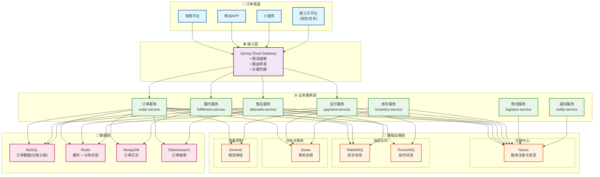
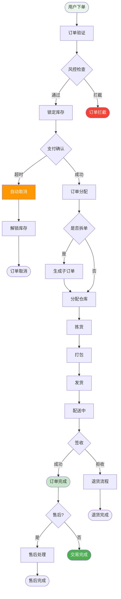

# OMS 订单管理系统设计

## 一、系统概述

### 1.1 系统简介

OMS（Order Management System）订单管理系统是一个专注于订单全生命周期管理的系统，涵盖订单接收、订单处理、库存分配、订单履约、售后服务等核心环节，支持多渠道、多仓库、多商家的复杂业务场景。

### 1.2 核心价值

| 价值点 | 说明 | 预期效果 |
|--------|------|----------|
| ⚡ **高并发处理** | 支持秒杀大促场景 | 峰值 10000+ TPS |
| 🎯 **智能分单** | 智能订单分配策略 | 履约效率提升 45% |
| 🔄 **全链路追踪** | 订单状态实时同步 | 客户满意度提升 40% |
| 📊 **数据一致性** | 强一致性保证 | 数据准确率 99.99% |
| 🚀 **快速响应** | 毫秒级订单处理 | 响应时间 < 100ms |

### 1.3 业务需求

#### 核心功能
- **订单接收**：多渠道订单接入、订单验证、订单拆分合并
- **订单处理**：订单审核、风控检查、支付确认、库存锁定
- **订单履约**：订单分配、拣货打包、物流发货、配送跟踪
- **售后服务**：退货退款、换货补发、售后审核
- **订单查询**：订单状态查询、物流跟踪、订单报表
- **异常处理**：超时处理、异常订单、补偿机制

#### 非功能需求
- **高并发**：支持秒杀、大促场景，峰值 10000+ TPS
- **高可用**：系统可用性 99.99%
- **实时性**：订单状态实时更新
- **可扩展**：支持多渠道、多仓库扩展
- **数据一致性**：保证订单数据强一致性

---

## 二、系统架构

### 2.1 技术架构



### 2.2 订单全流程



### 分库分表策略

#### 订单表分库分表
- **分库**：按用户ID取模分 8 个库
- **分表**：每个库按订单创建时间分 12 张表（按月）
- **路由规则**：`db = userId % 8`, `table = month % 12`

```sql
-- 示例：订单表分表
order_0, order_1, order_2, ..., order_11 (12张表)
```

### 核心服务

#### 1. 订单服务 (oms-order-service)
```java
- 订单创建 (Order Creation)
- 订单拆分 (Order Split)
- 订单合并 (Order Merge)
- 订单验证 (Order Validation)
- 订单查询 (Order Query)
- 订单取消 (Order Cancel)
```

#### 2. 履约服务 (oms-fulfillment-service)
```java
- 订单分配 (Order Allocation)
- 库存锁定 (Inventory Lock)
- 拣货管理 (Picking)
- 打包管理 (Packing)
- 发货管理 (Shipping)
- 配送跟踪 (Delivery Tracking)
```

#### 3. 售后服务 (oms-aftersale-service)
```java
- 退货申请 (Return Request)
- 退款申请 (Refund Request)
- 换货申请 (Exchange Request)
- 售后审核 (After-sale Approval)
- 补偿处理 (Compensation)
```

#### 4. 支付服务 (oms-payment-service)
```java
- 支付创建 (Payment Creation)
- 支付回调 (Payment Callback)
- 退款处理 (Refund)
- 支付查询 (Payment Query)
```

## 数据模型设计

### 核心表结构

#### 1. 订单主表 (order_main)
```sql
CREATE TABLE order_main_{month} (
    id BIGINT PRIMARY KEY COMMENT '订单ID(雪花算法)',
    order_no VARCHAR(50) NOT NULL UNIQUE COMMENT '订单号',
    parent_order_no VARCHAR(50) COMMENT '父订单号(拆单场景)',
    user_id BIGINT NOT NULL COMMENT '用户ID',
    channel TINYINT NOT NULL COMMENT '订单渠道:1-PC,2-H5,3-小程序,4-APP,5-第三方平台',
    channel_order_no VARCHAR(50) COMMENT '渠道订单号',
    order_type TINYINT DEFAULT 1 COMMENT '订单类型:1-普通订单,2-预售订单,3-秒杀订单,4-拼团订单',
    order_source TINYINT COMMENT '订单来源:1-自营,2-京东,3-天猫,4-拼多多',
    total_amount DECIMAL(15,2) NOT NULL COMMENT '订单总额',
    discount_amount DECIMAL(15,2) DEFAULT 0 COMMENT '优惠金额',
    freight_amount DECIMAL(15,2) DEFAULT 0 COMMENT '运费',
    pay_amount DECIMAL(15,2) NOT NULL COMMENT '实付金额',
    order_status TINYINT DEFAULT 1 COMMENT '订单状态:1-待付款,2-待发货,3-待收货,4-已完成,5-已取消,6-售后中',
    pay_status TINYINT DEFAULT 0 COMMENT '支付状态:0-未支付,1-已支付,2-退款中,3-已退款',
    pay_type TINYINT COMMENT '支付方式:1-微信,2-支付宝,3-银联,4-余额',
    pay_time DATETIME COMMENT '支付时间',
    consignee_name VARCHAR(50) NOT NULL COMMENT '收货人',
    consignee_mobile VARCHAR(20) NOT NULL COMMENT '收货手机',
    consignee_province VARCHAR(50) COMMENT '收货省份',
    consignee_city VARCHAR(50) COMMENT '收货城市',
    consignee_district VARCHAR(50) COMMENT '收货区县',
    consignee_address VARCHAR(200) NOT NULL COMMENT '收货详细地址',
    buyer_message VARCHAR(500) COMMENT '买家留言',
    seller_remark VARCHAR(500) COMMENT '卖家备注',
    is_timeout TINYINT DEFAULT 0 COMMENT '是否超时:0-否,1-是',
    cancel_reason VARCHAR(200) COMMENT '取消原因',
    cancel_time DATETIME COMMENT '取消时间',
    ship_time DATETIME COMMENT '发货时间',
    finish_time DATETIME COMMENT '完成时间',
    create_time DATETIME DEFAULT CURRENT_TIMESTAMP,
    update_time DATETIME DEFAULT CURRENT_TIMESTAMP ON UPDATE CURRENT_TIMESTAMP,
    INDEX idx_order_no (order_no),
    INDEX idx_user (user_id, create_time),
    INDEX idx_status (order_status),
    INDEX idx_create_time (create_time)
) ENGINE=InnoDB DEFAULT CHARSET=utf8mb4 COMMENT='订单主表';
```

#### 2. 订单明细表 (order_detail)
```sql
CREATE TABLE order_detail_{month} (
    id BIGINT PRIMARY KEY AUTO_INCREMENT,
    order_id BIGINT NOT NULL COMMENT '订单ID',
    order_no VARCHAR(50) NOT NULL COMMENT '订单号',
    product_id BIGINT NOT NULL COMMENT '商品ID',
    sku_id BIGINT NOT NULL COMMENT 'SKU ID',
    product_code VARCHAR(50) COMMENT '商品编码',
    product_name VARCHAR(200) NOT NULL COMMENT '商品名称',
    sku_name VARCHAR(200) COMMENT 'SKU名称',
    product_image VARCHAR(500) COMMENT '商品图片',
    category_id BIGINT COMMENT '分类ID',
    brand_id BIGINT COMMENT '品牌ID',
    unit_price DECIMAL(10,2) NOT NULL COMMENT '单价',
    quantity INT NOT NULL COMMENT '数量',
    discount_amount DECIMAL(10,2) DEFAULT 0 COMMENT '优惠金额',
    total_amount DECIMAL(15,2) NOT NULL COMMENT '总金额',
    is_gift TINYINT DEFAULT 0 COMMENT '是否赠品:0-否,1-是',
    promotion_id BIGINT COMMENT '促销活动ID',
    warehouse_id BIGINT COMMENT '发货仓库ID',
    refund_status TINYINT DEFAULT 0 COMMENT '退款状态:0-无,1-退款中,2-已退款',
    refund_quantity INT DEFAULT 0 COMMENT '退款数量',
    create_time DATETIME DEFAULT CURRENT_TIMESTAMP,
    INDEX idx_order (order_id),
    INDEX idx_order_no (order_no),
    INDEX idx_sku (sku_id)
) ENGINE=InnoDB DEFAULT CHARSET=utf8mb4 COMMENT='订单明细表';
```

#### 3. 订单履约表 (order_fulfillment)
```sql
CREATE TABLE order_fulfillment (
    id BIGINT PRIMARY KEY AUTO_INCREMENT,
    order_id BIGINT NOT NULL COMMENT '订单ID',
    order_no VARCHAR(50) NOT NULL COMMENT '订单号',
    warehouse_id BIGINT NOT NULL COMMENT '仓库ID',
    warehouse_name VARCHAR(100) COMMENT '仓库名称',
    allocation_time DATETIME COMMENT '分配时间',
    lock_status TINYINT DEFAULT 0 COMMENT '锁库状态:0-未锁定,1-已锁定,2-已释放',
    lock_time DATETIME COMMENT '锁定时间',
    pick_status TINYINT DEFAULT 0 COMMENT '拣货状态:0-待拣货,1-拣货中,2-已拣货',
    pick_time DATETIME COMMENT '拣货时间',
    pack_status TINYINT DEFAULT 0 COMMENT '打包状态:0-待打包,1-打包中,2-已打包',
    pack_time DATETIME COMMENT '打包时间',
    ship_status TINYINT DEFAULT 0 COMMENT '发货状态:0-待发货,1-已发货',
    ship_time DATETIME COMMENT '发货时间',
    logistics_company VARCHAR(50) COMMENT '物流公司',
    logistics_no VARCHAR(50) COMMENT '物流单号',
    create_time DATETIME DEFAULT CURRENT_TIMESTAMP,
    update_time DATETIME DEFAULT CURRENT_TIMESTAMP ON UPDATE CURRENT_TIMESTAMP,
    UNIQUE KEY uk_order (order_id),
    INDEX idx_order_no (order_no),
    INDEX idx_warehouse (warehouse_id),
    INDEX idx_ship_status (ship_status)
) ENGINE=InnoDB DEFAULT CHARSET=utf8mb4 COMMENT='订单履约表';
```

#### 4. 订单状态流转表 (order_status_log)
```sql
CREATE TABLE order_status_log (
    id BIGINT PRIMARY KEY AUTO_INCREMENT,
    order_id BIGINT NOT NULL COMMENT '订单ID',
    order_no VARCHAR(50) NOT NULL COMMENT '订单号',
    before_status TINYINT COMMENT '变更前状态',
    after_status TINYINT NOT NULL COMMENT '变更后状态',
    operator_type TINYINT COMMENT '操作类型:1-用户,2-系统,3-管理员',
    operator_id BIGINT COMMENT '操作人ID',
    operator_name VARCHAR(50) COMMENT '操作人',
    remark VARCHAR(500) COMMENT '备注',
    create_time DATETIME DEFAULT CURRENT_TIMESTAMP,
    INDEX idx_order (order_id),
    INDEX idx_order_no (order_no),
    INDEX idx_create_time (create_time)
) ENGINE=InnoDB DEFAULT CHARSET=utf8mb4 COMMENT='订单状态流转表';
```

#### 5. 售后单表 (aftersale_order)
```sql
CREATE TABLE aftersale_order (
    id BIGINT PRIMARY KEY AUTO_INCREMENT,
    aftersale_no VARCHAR(50) NOT NULL UNIQUE COMMENT '售后单号',
    order_id BIGINT NOT NULL COMMENT '订单ID',
    order_no VARCHAR(50) NOT NULL COMMENT '订单号',
    order_detail_id BIGINT NOT NULL COMMENT '订单明细ID',
    user_id BIGINT NOT NULL COMMENT '用户ID',
    aftersale_type TINYINT NOT NULL COMMENT '售后类型:1-仅退款,2-退货退款,3-换货',
    reason_type TINYINT COMMENT '原因类型:1-质量问题,2-发错货,3-不想要了,4-其他',
    reason_desc VARCHAR(500) COMMENT '原因描述',
    refund_amount DECIMAL(10,2) NOT NULL COMMENT '退款金额',
    quantity INT NOT NULL COMMENT '数量',
    status TINYINT DEFAULT 1 COMMENT '状态:1-待审核,2-审核通过,3-待退货,4-退货中,5-已完成,6-已拒绝,7-已取消',
    approve_time DATETIME COMMENT '审核时间',
    approver_id BIGINT COMMENT '审核人ID',
    reject_reason VARCHAR(200) COMMENT '拒绝原因',
    return_logistics_company VARCHAR(50) COMMENT '退货物流公司',
    return_logistics_no VARCHAR(50) COMMENT '退货物流单号',
    receive_time DATETIME COMMENT '收货时间',
    refund_time DATETIME COMMENT '退款时间',
    finish_time DATETIME COMMENT '完成时间',
    create_time DATETIME DEFAULT CURRENT_TIMESTAMP,
    update_time DATETIME DEFAULT CURRENT_TIMESTAMP ON UPDATE CURRENT_TIMESTAMP,
    INDEX idx_aftersale_no (aftersale_no),
    INDEX idx_order (order_id),
    INDEX idx_user (user_id),
    INDEX idx_status (status)
) ENGINE=InnoDB DEFAULT CHARSET=utf8mb4 COMMENT='售后单表';
```

#### 6. 支付单表 (payment_order)
```sql
CREATE TABLE payment_order (
    id BIGINT PRIMARY KEY AUTO_INCREMENT,
    payment_no VARCHAR(50) NOT NULL UNIQUE COMMENT '支付单号',
    order_no VARCHAR(50) NOT NULL COMMENT '订单号',
    user_id BIGINT NOT NULL COMMENT '用户ID',
    pay_type TINYINT NOT NULL COMMENT '支付方式:1-微信,2-支付宝,3-银联,4-余额',
    pay_amount DECIMAL(15,2) NOT NULL COMMENT '支付金额',
    pay_status TINYINT DEFAULT 0 COMMENT '支付状态:0-待支付,1-支付中,2-支付成功,3-支付失败,4-已取消',
    third_party_no VARCHAR(100) COMMENT '第三方交易号',
    pay_time DATETIME COMMENT '支付时间',
    notify_time DATETIME COMMENT '回调时间',
    notify_data TEXT COMMENT '回调数据',
    timeout_time DATETIME COMMENT '超时时间',
    remark VARCHAR(500) COMMENT '备注',
    create_time DATETIME DEFAULT CURRENT_TIMESTAMP,
    update_time DATETIME DEFAULT CURRENT_TIMESTAMP ON UPDATE CURRENT_TIMESTAMP,
    UNIQUE KEY uk_order (order_no),
    INDEX idx_payment_no (payment_no),
    INDEX idx_user (user_id),
    INDEX idx_status (pay_status)
) ENGINE=InnoDB DEFAULT CHARSET=utf8mb4 COMMENT='支付单表';
```

## 核心业务流程

### 1. 订单创建流程

```
提交订单 → 订单验证 → 计算价格 → 创建订单 → 创建支付单 → 支付
    ↓         ↓          ↓         ↓          ↓           ↓
 (参数校验) (库存校验)  (优惠计算) (订单入库)  (支付单)    (跳转支付)
```

**关键步骤**：
1. 接收订单数据（商品、数量、地址等）
2. 订单参数验证（必填项、格式等）
3. 库存可用性校验
4. 优惠券/促销计算
5. 计算订单金额（商品金额、运费、优惠）
6. 创建订单（主表+明细表）
7. 创建支付单
8. 返回支付信息
9. 用户支付

### 2. 订单支付成功流程

```
支付回调 → 验证签名 → 更新支付单 → 更新订单状态 → 锁定库存 → 订单分配 → 发送MQ
    ↓         ↓          ↓            ↓            ↓         ↓
 (异步回调) (安全校验)  (支付成功)    (待发货)     (锁库存)  (分配仓库)
```

**关键步骤**：
1. 接收支付回调（微信/支付宝）
2. 验证签名和金额
3. 更新支付单状态
4. 更新订单状态为"待发货"
5. 锁定库存
6. 订单分配（就近仓库分配）
7. 发送订单已支付消息（MQ）
8. 通知用户支付成功

### 3. 订单履约流程

```
订单分配 → 锁定库存 → 生成拣货单 → 拣货 → 打包 → 发货 → 物流跟踪 → 签收
    ↓         ↓          ↓         ↓      ↓      ↓        ↓         ↓
 (分配仓库) (锁库存)   (拣货任务)  (拣货) (打包) (发货)   (配送中)   (已完成)
```

**关键步骤**：
1. 订单分配（选择最优仓库）
2. 锁定库存（扣减可用库存）
3. 生成拣货单
4. 拣货（扫码拣货）
5. 打包（称重、打印面单）
6. 发货（交付物流）
7. 推送物流信息
8. 用户确认收货

### 4. 售后流程

```
提交售后 → 售后审核 → 退货 → 收货检验 → 退款 → 完成
    ↓         ↓        ↓      ↓          ↓      ↓
 (申请)    (审核)   (寄回)  (质检)     (退款)  (完成)
```

**关键步骤**：
1. 用户提交售后申请
2. 客服审核（同意/拒绝）
3. 用户寄回商品（退货退款）
4. 仓库收货检验
5. 处理退款
6. 释放库存
7. 完成售后

## 技术实现方案

### 1. 订单号生成（雪花算法）

```java
@Component
public class OrderNoGenerator {
    
    @Autowired
    private SnowflakeIdWorker snowflakeIdWorker;
    
    /**
     * 生成订单号
     * 格式：业务前缀(2位) + 时间戳(10位) + 雪花ID后6位
     */
    public String generateOrderNo() {
        long id = snowflakeIdWorker.nextId();
        String timestamp = String.valueOf(System.currentTimeMillis() / 1000);
        String suffix = String.valueOf(id % 1000000);
        
        return "OD" + timestamp + String.format("%06d", Long.parseLong(suffix));
    }
}
```

### 2. 订单分库分表（ShardingSphere）

```yaml
spring:
  shardingsphere:
    datasource:
      names: ds0,ds1,ds2,ds3,ds4,ds5,ds6,ds7
      ds0:
        type: com.zaxxer.hikari.HikariDataSource
        driver-class-name: com.mysql.cj.jdbc.Driver
        jdbc-url: jdbc:mysql://localhost:3306/oms_0
        username: root
        password: password
    rules:
      sharding:
        tables:
          order_main:
            actual-data-nodes: ds$->{0..7}.order_main_$->{0..11}
            database-strategy:
              standard:
                sharding-column: user_id
                sharding-algorithm-name: db-mod
            table-strategy:
              standard:
                sharding-column: create_time
                sharding-algorithm-name: table-month
            key-generate-strategy:
              column: id
              key-generator-name: snowflake
        sharding-algorithms:
          db-mod:
            type: MOD
            props:
              sharding-count: 8
          table-month:
            type: INLINE
            props:
              algorithm-expression: order_main_$->{month(create_time) % 12}
        key-generators:
          snowflake:
            type: SNOWFLAKE
```

### 3. 订单创建（分布式事务 - Seata）

```java
@Service
public class OrderService {
    
    @Autowired
    private OrderMapper orderMapper;
    
    @Autowired
    private InventoryServiceClient inventoryServiceClient;
    
    @Autowired
    private PaymentServiceClient paymentServiceClient;
    
    /**
     * 创建订单（分布式事务）
     */
    @GlobalTransactional(name = "create-order", rollbackFor = Exception.class)
    public OrderCreateResult createOrder(OrderCreateDTO dto) {
        // 1. 验证订单
        validateOrder(dto);
        
        // 2. 检查库存（远程调用）
        for (OrderItemDTO item : dto.getItems()) {
            boolean available = inventoryServiceClient.checkStock(
                item.getSkuId(), 
                item.getQuantity()
            );
            if (!available) {
                throw new BusinessException("商品库存不足");
            }
        }
        
        // 3. 计算价格
        OrderPriceResult priceResult = calculatePrice(dto);
        
        // 4. 创建订单
        OrderMain order = new OrderMain();
        order.setOrderNo(orderNoGenerator.generateOrderNo());
        order.setUserId(dto.getUserId());
        order.setTotalAmount(priceResult.getTotalAmount());
        order.setPayAmount(priceResult.getPayAmount());
        order.setOrderStatus(OrderStatus.WAIT_PAY);
        // ... 其他字段
        orderMapper.insert(order);
        
        // 5. 创建订单明细
        for (OrderItemDTO item : dto.getItems()) {
            OrderDetail detail = new OrderDetail();
            detail.setOrderId(order.getId());
            detail.setOrderNo(order.getOrderNo());
            detail.setSkuId(item.getSkuId());
            detail.setQuantity(item.getQuantity());
            // ... 其他字段
            orderDetailMapper.insert(detail);
        }
        
        // 6. 创建支付单（远程调用）
        PaymentCreateResult paymentResult = paymentServiceClient.createPayment(
            order.getOrderNo(),
            order.getUserId(),
            order.getPayAmount(),
            dto.getPayType()
        );
        
        // 7. 发送订单创建消息
        sendOrderCreatedMessage(order.getOrderNo());
        
        // 8. 返回结果
        OrderCreateResult result = new OrderCreateResult();
        result.setOrderId(order.getId());
        result.setOrderNo(order.getOrderNo());
        result.setPaymentNo(paymentResult.getPaymentNo());
        result.setPayUrl(paymentResult.getPayUrl());
        
        return result;
    }
    
    /**
     * 计算订单价格
     */
    private OrderPriceResult calculatePrice(OrderCreateDTO dto) {
        BigDecimal totalAmount = BigDecimal.ZERO;
        BigDecimal discountAmount = BigDecimal.ZERO;
        
        // 1. 计算商品总额
        for (OrderItemDTO item : dto.getItems()) {
            BigDecimal itemAmount = item.getPrice()
                .multiply(new BigDecimal(item.getQuantity()));
            totalAmount = totalAmount.add(itemAmount);
        }
        
        // 2. 计算优惠金额（优惠券、促销等）
        if (dto.getCouponId() != null) {
            discountAmount = calculateCouponDiscount(dto.getCouponId(), totalAmount);
        }
        
        // 3. 计算运费
        BigDecimal freightAmount = calculateFreight(dto);
        
        // 4. 计算实付金额
        BigDecimal payAmount = totalAmount
            .subtract(discountAmount)
            .add(freightAmount);
        
        OrderPriceResult result = new OrderPriceResult();
        result.setTotalAmount(totalAmount);
        result.setDiscountAmount(discountAmount);
        result.setFreightAmount(freightAmount);
        result.setPayAmount(payAmount);
        
        return result;
    }
}
```

### 4. 支付回调处理（幂等性）

```java
@Service
public class PaymentCallbackService {
    
    @Autowired
    private RedisTemplate<String, Object> redisTemplate;
    
    @Autowired
    private PaymentOrderMapper paymentOrderMapper;
    
    @Autowired
    private OrderService orderService;
    
    /**
     * 处理支付回调（幂等性）
     */
    public void handlePaymentCallback(PaymentCallbackDTO dto) {
        String paymentNo = dto.getPaymentNo();
        
        // 1. 幂等性校验（基于 Redis 分布式锁）
        String lockKey = "payment:callback:" + paymentNo;
        Boolean acquired = redisTemplate.opsForValue()
            .setIfAbsent(lockKey, "1", 5, TimeUnit.MINUTES);
        
        if (!acquired) {
            log.warn("支付回调处理中，忽略重复回调: {}", paymentNo);
            return;
        }
        
        try {
            // 2. 查询支付单
            PaymentOrder payment = paymentOrderMapper.selectByPaymentNo(paymentNo);
            
            // 3. 验证支付单状态
            if (payment.getPayStatus() == PayStatus.SUCCESS) {
                log.warn("支付单已处理: {}", paymentNo);
                return;
            }
            
            // 4. 验证签名和金额
            validateCallback(dto, payment);
            
            // 5. 更新支付单状态
            payment.setPayStatus(PayStatus.SUCCESS);
            payment.setThirdPartyNo(dto.getThirdPartyNo());
            payment.setPayTime(new Date());
            payment.setNotifyTime(new Date());
            paymentOrderMapper.updateById(payment);
            
            // 6. 处理订单（更新状态、锁库存、分配等）
            orderService.handleOrderPaid(payment.getOrderNo());
            
            // 7. 发送支付成功消息
            sendPaymentSuccessMessage(payment);
            
        } finally {
            // 释放锁
            redisTemplate.delete(lockKey);
        }
    }
}
```

### 5. 订单自动分配（就近原则）

```java
@Service
public class OrderAllocationService {
    
    @Autowired
    private WarehouseService warehouseService;
    
    @Autowired
    private InventoryService inventoryService;
    
    /**
     * 订单自动分配仓库
     */
    public Long allocateWarehouse(Long orderId) {
        OrderMain order = orderMapper.selectById(orderId);
        List<OrderDetail> details = orderDetailMapper.selectByOrderId(orderId);
        
        // 1. 获取所有仓库
        List<Warehouse> warehouses = warehouseService.listActiveWarehouses();
        
        // 2. 解析收货地址
        String province = order.getConsigneeProvince();
        String city = order.getConsigneeCity();
        
        // 3. 按优先级筛选仓库
        List<Warehouse> candidates = new ArrayList<>();
        
        // 优先级1：同城仓库
        candidates = warehouses.stream()
            .filter(w -> w.getCity().equals(city))
            .collect(Collectors.toList());
        
        // 优先级2：同省仓库
        if (candidates.isEmpty()) {
            candidates = warehouses.stream()
                .filter(w -> w.getProvince().equals(province))
                .collect(Collectors.toList());
        }
        
        // 优先级3：全国仓库
        if (candidates.isEmpty()) {
            candidates = warehouses;
        }
        
        // 4. 检查库存并选择仓库
        for (Warehouse warehouse : candidates) {
            boolean allAvailable = true;
            
            for (OrderDetail detail : details) {
                int available = inventoryService.getAvailableStock(
                    warehouse.getId(),
                    detail.getSkuId()
                );
                
                if (available < detail.getQuantity()) {
                    allAvailable = false;
                    break;
                }
            }
            
            if (allAvailable) {
                return warehouse.getId();
            }
        }
        
        throw new BusinessException("无可用仓库");
    }
}
```

### 6. 订单超时自动取消（延时消息）

使用 **RocketMQ 延时消息**：

```java
@Service
public class OrderTimeoutService {
    
    @Autowired
    private RocketMQTemplate rocketMQTemplate;
    
    /**
     * 发送订单超时检查消息
     */
    public void sendOrderTimeoutCheckMessage(String orderNo, int delayMinutes) {
        OrderTimeoutMessage message = new OrderTimeoutMessage();
        message.setOrderNo(orderNo);
        message.setSendTime(System.currentTimeMillis());
        
        // 延时级别：1s 5s 10s 30s 1m 2m 3m 4m 5m 6m 7m 8m 9m 10m 20m 30m 1h 2h
        // 30分钟对应延时级别 16
        rocketMQTemplate.syncSend(
            "order-timeout-topic",
            MessageBuilder.withPayload(message).build(),
            3000,
            16 // 延时级别
        );
    }
}

@Component
@RocketMQMessageListener(
    topic = "order-timeout-topic",
    consumerGroup = "order-timeout-consumer"
)
public class OrderTimeoutConsumer implements RocketMQListener<OrderTimeoutMessage> {
    
    @Autowired
    private OrderService orderService;
    
    @Override
    public void onMessage(OrderTimeoutMessage message) {
        String orderNo = message.getOrderNo();
        
        // 查询订单
        OrderMain order = orderMapper.selectByOrderNo(orderNo);
        
        // 如果订单还是待支付状态，自动取消
        if (order.getOrderStatus() == OrderStatus.WAIT_PAY) {
            orderService.autoCancelOrder(orderNo, "超时未支付");
        }
    }
}
```

### 7. 订单状态机

```java
@Component
public class OrderStateMachine {
    
    /**
     * 订单状态流转校验
     */
    public boolean canTransition(OrderStatus from, OrderStatus to) {
        // 定义状态流转规则
        Map<OrderStatus, Set<OrderStatus>> transitions = new HashMap<>();
        
        // 待付款 -> 待发货、已取消
        transitions.put(OrderStatus.WAIT_PAY, 
            Set.of(OrderStatus.WAIT_SHIP, OrderStatus.CANCELED));
        
        // 待发货 -> 待收货、已取消
        transitions.put(OrderStatus.WAIT_SHIP, 
            Set.of(OrderStatus.WAIT_RECEIVE, OrderStatus.CANCELED));
        
        // 待收货 -> 已完成、售后中
        transitions.put(OrderStatus.WAIT_RECEIVE, 
            Set.of(OrderStatus.FINISHED, OrderStatus.AFTER_SALE));
        
        // 售后中 -> 已完成
        transitions.put(OrderStatus.AFTER_SALE, 
            Set.of(OrderStatus.FINISHED));
        
        Set<OrderStatus> allowedTransitions = transitions.get(from);
        return allowedTransitions != null && allowedTransitions.contains(to);
    }
    
    /**
     * 更新订单状态
     */
    @Transactional
    public void updateOrderStatus(String orderNo, OrderStatus newStatus, String remark) {
        OrderMain order = orderMapper.selectByOrderNo(orderNo);
        OrderStatus oldStatus = order.getOrderStatus();
        
        // 校验状态流转
        if (!canTransition(oldStatus, newStatus)) {
            throw new BusinessException(
                String.format("订单状态不允许从 %s 变更为 %s", oldStatus, newStatus)
            );
        }
        
        // 更新订单状态
        order.setOrderStatus(newStatus);
        orderMapper.updateById(order);
        
        // 记录状态流转日志
        OrderStatusLog log = new OrderStatusLog();
        log.setOrderId(order.getId());
        log.setOrderNo(orderNo);
        log.setBeforeStatus(oldStatus);
        log.setAfterStatus(newStatus);
        log.setRemark(remark);
        orderStatusLogMapper.insert(log);
        
        // 发送状态变更消息
        sendOrderStatusChangeMessage(orderNo, oldStatus, newStatus);
    }
}
```

## API 接口设计

### 1. 订单接口

```java
@RestController
@RequestMapping("/api/oms/order")
public class OrderController {
    
    @Autowired
    private OrderService orderService;
    
    /**
     * 创建订单
     */
    @PostMapping("")
    public Result<OrderCreateResult> createOrder(@RequestBody @Valid OrderCreateDTO dto) {
        OrderCreateResult result = orderService.createOrder(dto);
        return Result.success(result);
    }
    
    /**
     * 订单详情
     */
    @GetMapping("/{orderNo}")
    public Result<OrderDetailVO> getOrderDetail(@PathVariable String orderNo) {
        OrderDetailVO vo = orderService.getOrderDetail(orderNo);
        return Result.success(vo);
    }
    
    /**
     * 订单列表
     */
    @GetMapping("/list")
    public Result<PageResult<OrderVO>> listOrders(
            @RequestParam(required = false) Integer status,
            @RequestParam(defaultValue = "1") Integer pageNum,
            @RequestParam(defaultValue = "20") Integer pageSize) {
        
        Long userId = SecurityUtils.getCurrentUserId();
        PageResult<OrderVO> result = orderService.listUserOrders(
            userId, status, pageNum, pageSize
        );
        return Result.success(result);
    }
    
    /**
     * 取消订单
     */
    @PostMapping("/{orderNo}/cancel")
    public Result<Void> cancelOrder(
            @PathVariable String orderNo,
            @RequestParam String reason) {
        
        orderService.cancelOrder(orderNo, reason);
        return Result.success();
    }
    
    /**
     * 确认收货
     */
    @PostMapping("/{orderNo}/confirm")
    public Result<Void> confirmReceive(@PathVariable String orderNo) {
        orderService.confirmReceive(orderNo);
        return Result.success();
    }
}
```

### 2. 售后接口

```java
@RestController
@RequestMapping("/api/oms/aftersale")
public class AftersaleController {
    
    @Autowired
    private AftersaleService aftersaleService;
    
    /**
     * 创建售后单
     */
    @PostMapping("")
    public Result<String> createAftersale(@RequestBody @Valid AftersaleCreateDTO dto) {
        String aftersaleNo = aftersaleService.createAftersale(dto);
        return Result.success(aftersaleNo);
    }
    
    /**
     * 售后详情
     */
    @GetMapping("/{aftersaleNo}")
    public Result<AftersaleDetailVO> getAftersaleDetail(@PathVariable String aftersaleNo) {
        AftersaleDetailVO vo = aftersaleService.getAftersaleDetail(aftersaleNo);
        return Result.success(vo);
    }
    
    /**
     * 审核售后单
     */
    @PostMapping("/{aftersaleNo}/approve")
    public Result<Void> approveAftersale(
            @PathVariable String aftersaleNo,
            @RequestParam Boolean approved,
            @RequestParam(required = false) String rejectReason) {
        
        aftersaleService.approveAftersale(aftersaleNo, approved, rejectReason);
        return Result.success();
    }
    
    /**
     * 退货物流
     */
    @PostMapping("/{aftersaleNo}/logistics")
    public Result<Void> submitReturnLogistics(
            @PathVariable String aftersaleNo,
            @RequestBody @Valid ReturnLogisticsDTO dto) {
        
        aftersaleService.submitReturnLogistics(aftersaleNo, dto);
        return Result.success();
    }
}
```

## 性能优化方案

### 1. 数据库优化
- **分库分表**：按用户ID分库，按月份分表
- **读写分离**：主库写，从库读
- **索引优化**：合理建立索引
- **定期归档**：归档历史订单数据

### 2. 缓存优化
- **订单缓存**：热点订单缓存到 Redis
- **商品信息缓存**：商品信息、库存缓存
- **用户信息缓存**：用户基本信息缓存

### 3. 异步化
- **消息队列**：订单创建、支付成功等事件异步处理
- **延时消息**：订单超时自动取消
- **异步通知**：短信、推送通知异步发送

### 4. 限流降级
- **接口限流**：使用 Sentinel 限流
- **服务降级**：非核心功能降级
- **熔断保护**：依赖服务熔断

### 5. 秒杀优化
- **Redis 预扣库存**：减少数据库压力
- **队列削峰**：消息队列削峰
- **限流**：接口限流
- **缓存预热**：提前加载数据到缓存

## 总结

OMS 订单管理系统的核心在于：
1. **高并发处理**：支持大促、秒杀等高并发场景
2. **数据一致性**：确保订单数据的强一致性
3. **可靠性**：保证订单不丢失、不重复
4. **实时性**：订单状态实时更新
5. **可扩展性**：支持多渠道、多仓库扩展

本设计方案基于 Spring Cloud 微服务架构，采用分库分表、缓存、消息队列等技术，可满足电商平台的订单管理需求。

