# WMS 仓库管理系统设计（基于RuoYi-Pro-Mini）

:::tip 📌 重要说明：基于RuoYi-Pro-Mini框架开发
本系统基于 **RuoYi-Pro-Mini** 框架开发，充分复用框架提供的基础功能模块。

**框架核心优势**：
- ✅ **开箱即用的权限管理**：用户、角色、菜单、权限一体化
- ✅ **完善的数据字典**：支持动态配置、多级联动
- ✅ **操作日志审计**：全链路操作记录、异常追踪
- ✅ **代码生成器**：快速生成CRUD代码，提升开发效率80%
- ✅ **轻量级设计**：相比RuoYi-Vue-Pro，更轻量、更简洁

**技术栈**：
- 后端：Spring Boot 3.2.x + MyBatis-Plus 3.5.x + Spring Security + JWT
- 前端：Vue 3 + Element Plus + TypeScript + Pinia
- 数据库：MySQL 8.0 + Redis 7.0
- 消息队列：RocketMQ 5.x（可选）
- 工具库：Hutool、Lombok、MapStruct

**表命名规范**：
- 系统基础表：`system_*`（由RuoYi框架提供，无需创建）
- WMS业务表：`wms_*`（本系统业务表，需要创建）
:::

## 一、项目概述

### 1.1 系统简介

WMS（Warehouse Management System）仓库管理系统是一个基于 **RuoYi-Pro-Mini** 框架的智能仓储管理平台，旨在通过数字化手段提升仓库运营效率，实现库存实时可视化、出入库自动化、智能拣货调度等核心功能。

**与传统WMS的差异**：
- 基于成熟框架，开发周期缩短50%
- 复用权限管理，无需重复开发
- 统一技术栈，降低维护成本
- 代码生成器加速开发

### 1.2 核心价值

| 价值点 | 说明 | 预期效果 |
|--------|------|----------|
| 🎯 **提升效率** | 自动化拣货路径优化 | 拣货效率提升 40% |
| 📊 **实时可视** | 库存实时监控和预警 | 库存准确率达 99.5% |
| 🔄 **降低成本** | 减少人工盘点和错误 | 运营成本降低 30% |
| 📈 **数据分析** | 智能报表和决策支持 | 决策效率提升 50% |
| 🚀 **快速响应** | 订单自动分配和处理 | 出库时效提升 35% |

### 1.3 应用场景

#### 📦 电商仓储
- 高频出入库操作
- 多SKU商品管理
- 订单快速履约
- 库存周转优化

#### 🏭 制造业仓库
- 原材料管理
- 成品/半成品存储
- 生产线配送
- 呆滞库存预警

#### 🏪 零售配送中心
- 多门店配货
- 补货计划管理
- 退货处理
- 库存调拨

### 1.4 技术架构

#### 架构设计思想

**为什么采用微服务架构？**

1. **业务解耦**：仓储业务复杂度高，入库、出库、拣货等模块独立性强，微服务化便于团队协作和独立演进
2. **弹性扩展**：库存查询、拣货任务等高并发场景可独立扩展，避免资源浪费
3. **故障隔离**：某个服务故障不影响整体系统，提高可用性
4. **技术异构**：报表服务可使用ElasticSearch，日志服务可用MongoDB，各取所长

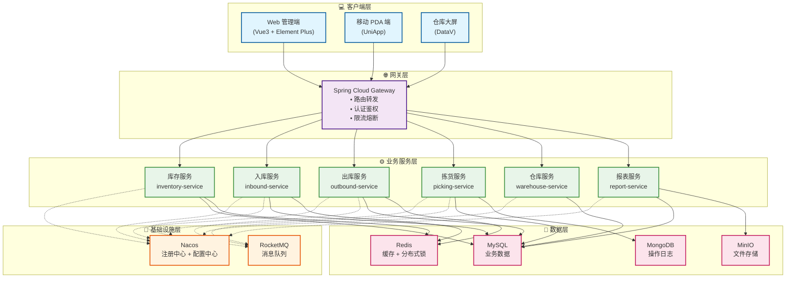

#### 核心组件选型说明

| 组件类型 | 技术选型 | 选型理由 | 替代方案 |
|---------|---------|---------|---------|
| **服务注册** | Nacos | 国产化、配置中心集成、社区活跃 | Consul, Eureka |
| **网关** | Spring Cloud Gateway | 异步非阻塞、性能优秀、Spring生态 | Zuul 2.0, Kong |
| **负载均衡** | Spring Cloud LoadBalancer | 轻量级、可定制 | Ribbon(已停更) |
| **服务调用** | OpenFeign + OkHttp | 声明式、可读性强、支持HTTP/2 | Dubbo, gRPC |
| **熔断限流** | Sentinel | 实时监控、规则丰富、国产化 | Hystrix(停更), Resilience4j |
| **链路追踪** | SkyWalking | APM全栈、国产、无侵入 | Zipkin, Jaeger |
| **消息队列** | RocketMQ | 顺序消息、事务消息、高吞吐 | Kafka, RabbitMQ |
| **数据库** | MySQL 8.0 | ACID保证、成熟稳定、生态完善 | PostgreSQL, TiDB |
| **缓存** | Redis 7.0 | 高性能、数据结构丰富、分布式锁 | Memcached, Hazelcast |
| **搜索引擎** | ElasticSearch | 全文检索、日志分析、实时聚合 | Solr, OpenSearch |
| **对象存储** | MinIO | 兼容S3、部署简单、私有化 | FastDFS, OSS |
| **定时任务** | XXL-Job | 分布式、可视化、失败重试 | Quartz, Elastic-Job |

### 1.5 技术栈

#### 后端技术栈

```xml
<properties>
    <!-- Spring 全家桶 -->
    <spring-boot.version>3.1.5</spring-boot.version>
    <spring-cloud.version>2022.0.4</spring-cloud.version>
    <spring-cloud-alibaba.version>2022.0.0.0</spring-cloud-alibaba.version>
    
    <!-- 数据库 -->
    <mybatis-plus.version>3.5.4.1</mybatis-plus.version>
    <mysql.version>8.0.33</mysql.version>
    <redis.version>3.1.5</redis.version>
    
    <!-- 消息队列 -->
    <rocketmq.version>2.2.3</rocketmq.version>
    
    <!-- 工具类 -->
    <hutool.version>5.8.22</hutool.version>
    <lombok.version>1.18.30</lombok.version>
    <mapstruct.version>1.5.5.Final</mapstruct.version>
</properties>
```

#### 前端技术栈

```json
{
  "dependencies": {
    "vue": "^3.3.4",
    "vue-router": "^4.2.5",
    "pinia": "^2.1.7",
    "element-plus": "^2.4.2",
    "axios": "^1.6.0",
    "echarts": "^5.4.3",
    "vxe-table": "^4.5.0"
  }
}
```

---

## 二、核心功能模块

### 2.1 功能架构图

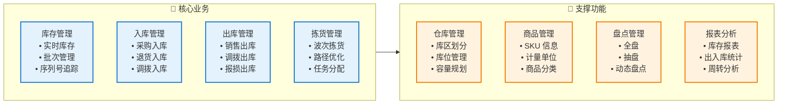

### 2.2 库存管理

#### 2.2.1 核心能力

| 功能 | 说明 | 关键指标 | 实现难点 |
|------|------|----------|---------|
| **实时库存** | 库存数据实时更新 | 延迟 < 100ms | 高并发下的数据一致性 |
| **批次管理** | 生产批次追溯 | 批次准确率 100% | 先进先出(FIFO)策略 |
| **库龄分析** | 库存周转分析 | 预警准确率 95% | 大数据量统计性能 |
| **安全库存** | 库存上下限预警 | 缺货率 < 1% | 动态阈值计算 |
| **库存锁定** | 订单库存预占 | 并发支持 10000+ | 分布式锁+乐观锁 |

#### 2.2.2 库存状态流转

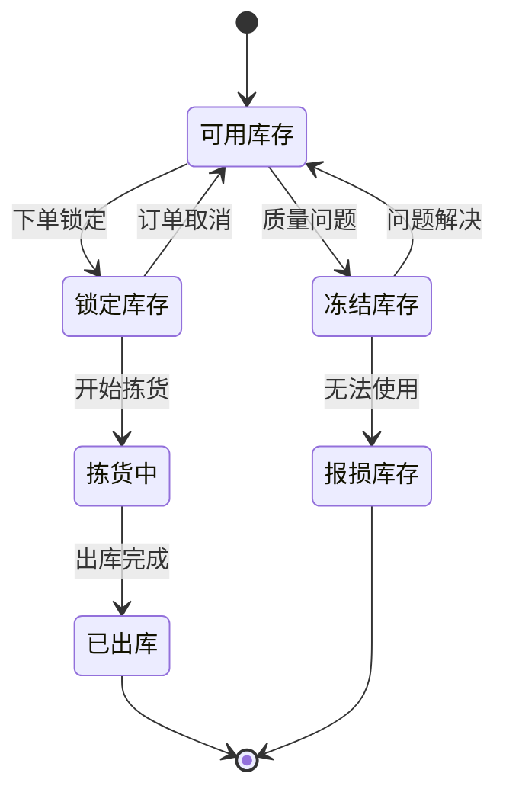

**状态说明：**
- **可用库存**：正常可销售/可用状态
- **锁定库存**：已分配给订单但未出库（订单取消后自动释放）
- **拣货中**：正在执行拣货任务
- **冻结库存**：质检不合格、临期商品等
- **报损库存**：已损坏需报损处理

#### 2.2.3 库存扣减策略

**为什么采用"下单锁定 + 出库扣减"模式？**

| 方案 | 优点 | 缺点 | 适用场景 |
|------|------|------|---------|
| **下单直接扣减** | 实现简单 | 订单取消需回滚、库存占用率低 | 低退款率业务 |
| **下单锁定+出库扣减** ✅ | 库存利用率高、支持超卖控制 | 实现复杂、需锁定机制 | 高并发电商场景 |
| **预扣+异步确认** | 性能好 | 最终一致性、补偿逻辑复杂 | 秒杀场景 |

**我们采用方案2的理由：**
1. **提高库存利用率**：订单支付前库存仍可销售（设置锁定时效）
2. **防止超卖**：通过Redis分布式锁保证原子性
3. **支持灵活策略**：可配置锁定时长、自动释放规则

#### 2.2.4 并发库存扣减方案

**核心挑战：** 高并发场景下如何保证库存扣减的准确性和性能？

```java
/**
 * 库存扣减 - 三重保障机制
 * 1. Redis分布式锁：保证同一商品同一时刻只有一个线程操作
 * 2. 数据库行锁(FOR UPDATE)：保证数据库层面的并发安全
 * 3. 乐观锁(版本号)：作为兜底机制
 */
@Override
@Transactional(rollbackFor = Exception.class)
public boolean deductInventory(Long goodsId, BigDecimal quantity) {
    // 分布式锁Key
    String lockKey = "inventory:lock:" + goodsId;
    RLock lock = redissonClient.getLock(lockKey);
    
    try {
        // 1. 尝试获取分布式锁（等待3秒，锁定10秒）
        boolean acquired = lock.tryLock(3, 10, TimeUnit.SECONDS);
        if (!acquired) {
            throw new BizException("系统繁忙，请稍后重试");
        }
        
        // 2. 查询库存（行锁）
        Inventory inventory = inventoryMapper.selectForUpdate(goodsId);
        
        // 3. 检查库存充足性
        if (inventory.getAvailableQuantity().compareTo(quantity) < 0) {
            throw new BizException("库存不足");
        }
        
        // 4. 扣减库存（乐观锁）
        int updated = inventoryMapper.deductWithVersion(
            goodsId, quantity, inventory.getVersion()
        );
        
        if (updated == 0) {
            throw new BizException("库存更新失败，请重试");
        }
        
        // 5. 记录库存流水（异步）
        inventoryLogProducer.sendLog(inventory, quantity);
        
        // 6. 清除缓存
        redisTemplate.delete("inventory:" + goodsId);
        
        return true;
        
    } finally {
        // 释放锁
        if (lock.isHeldByCurrentThread()) {
            lock.unlock();
        }
    }
}
```

**性能优化点：**
- 锁粒度：按商品ID加锁，不同商品并行处理
- 锁等待：3秒超时快速失败，避免线程堆积
- 异步日志：库存流水异步记录，不阻塞主流程
- 缓存删除：扣减后立即删除缓存，保证下次查询最新数据

#### 2.2.5 库存预警机制

**设计思路：** 多维度、智能化的库存预警体系

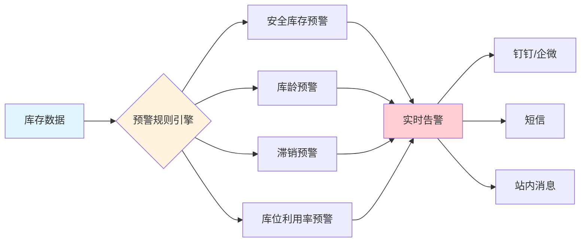

**预警规则配置：**

| 预警类型 | 触发条件 | 预警级别 | 处理建议 |
|---------|---------|---------|---------|
| 安全库存 | 可用库存 < 安全库存 | ⚠️ 警告 | 及时补货 |
| 缺货 | 可用库存 = 0 | 🔴 严重 | 紧急采购 |
| 库龄超期 | 入库天数 > 90天 | ⚠️ 警告 | 促销清仓 |
| 临期商品 | 距离过期 < 30天 | 🔴 严重 | 加速销售 |
| 滞销 | 30天销量 = 0 | ⚠️ 警告 | 调整策略 |
| 库位占满 | 库位利用率 > 95% | ⚠️ 警告 | 扩容/清理 |

```java
/**
 * 库存预警定时任务
 * 每小时执行一次全量扫描
 */
@Scheduled(cron = "0 0 * * * ?")
public void checkInventoryAlert() {
    // 1. 安全库存预警
    List<Inventory> lowStock = inventoryMapper.selectBelowSafetyStock();
    lowStock.forEach(inv -> {
        AlertMessage alert = AlertMessage.builder()
            .type("SAFETY_STOCK")
            .level("WARNING")
            .goodsName(inv.getGoodsName())
            .currentQty(inv.getAvailableQuantity())
            .safetyQty(inv.getSafetyStock())
            .suggestion("建议补货数量：" + (inv.getSafetyStock().multiply(new BigDecimal("1.5"))))
            .build();
        alertService.send(alert);
    });
    
    // 2. 库龄预警（超过90天）
    LocalDateTime deadline = LocalDateTime.now().minusDays(90);
    List<Inventory> aged = inventoryMapper.selectByInboundDateBefore(deadline);
    // ... 发送预警
    
    // 3. 临期商品预警（30天内过期）
    LocalDate expireDeadline = LocalDate.now().plusDays(30);
    List<Inventory> nearExpire = inventoryMapper.selectByExpireDateBefore(expireDeadline);
    // ... 发送预警
}
```

#### 2.2.6 库存快照与对账

**为什么需要库存快照？**
- 数据追溯：出现库存差异时快速定位问题时间点
- 报表统计：月末/年末库存报表生成
- 审计合规：满足财务审计要求

```java
/**
 * 库存快照 - 每日凌晨自动生成
 */
@Scheduled(cron = "0 0 1 * * ?") // 每天凌晨1点
public void createDailySnapshot() {
    String snapshotDate = LocalDate.now().toString();
    
    // 1. 查询所有库存
    List<Inventory> inventories = inventoryMapper.selectAll();
    
    // 2. 批量插入快照表
    List<InventorySnapshot> snapshots = inventories.stream()
        .map(inv -> InventorySnapshot.builder()
            .snapshotDate(snapshotDate)
            .warehouseId(inv.getWarehouseId())
            .goodsId(inv.getGoodsId())
            .quantity(inv.getQuantity())
            .lockQuantity(inv.getLockQuantity())
            .build())
        .collect(Collectors.toList());
    
    snapshotMapper.batchInsert(snapshots);
    
    // 3. 触发库存对账任务
    reconciliationService.reconcile(snapshotDate);
}

/**
 * 库存对账 - 系统库存 vs 实际盘点
 */
public ReconciliationResult reconcile(String date) {
    // 1. 获取系统库存快照
    List<InventorySnapshot> systemStock = snapshotMapper.selectByDate(date);
    
    // 2. 获取实际盘点数据
    List<StockTaking> actualStock = stockTakingMapper.selectByDate(date);
    
    // 3. 对比差异
    List<InventoryDiff> diffs = compareInventory(systemStock, actualStock);
    
    // 4. 生成对账报告
    return ReconciliationResult.builder()
        .date(date)
        .totalItems(systemStock.size())
        .diffItems(diffs.size())
        .diffRate(diffs.size() * 100.0 / systemStock.size())
        .details(diffs)
        .build();
}
```

### 2.3 入库管理

#### 入库流程

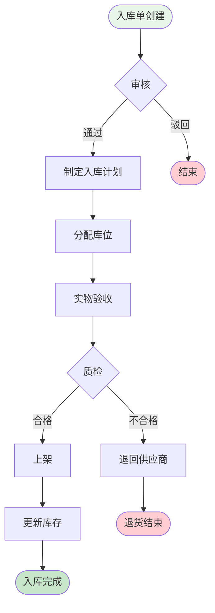

#### 入库类型

- **采购入库**：供应商采购到货
- **退货入库**：客户退货入库
- **调拨入库**：其他仓库调入
- **盘盈入库**：盘点发现多余库存
- **生产入库**：生产完工入库

### 2.4 出库管理

#### 出库流程


### 2.5 拣货管理

#### 2.5.1 拣货策略对比

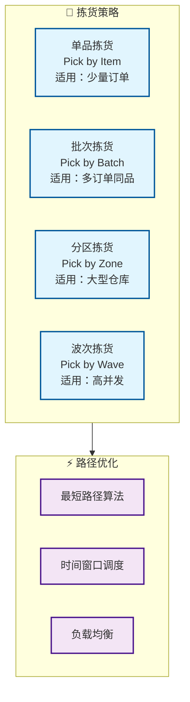

**策略详细对比：**

| 策略 | 适用场景 | 优势 | 劣势 | 效率提升 |
|------|---------|------|------|---------|
| **单品拣货** | B2B大单、特殊商品 | 准确率高、流程简单 | 效率低、重复路径 | 基准 |
| **批次拣货** ✅ | 电商多单、相同SKU | 减少行走路径、提升效率 | 需二次分拣 | 提升30% |
| **分区拣货** | 大型仓库、多库区 | 并行作业、降低拥堵 | 需交接区、协调复杂 | 提升50% |
| **波次拣货** ✅ | 高并发订单、大促场景 | 最大化效率、智能调度 | 系统复杂度高 | 提升60% |

**我们采用"波次拣货+批次拣货"组合策略的原因：**

1. **订单聚合**：将时间窗口内的订单聚合成波次，一次性处理
2. **路径优化**：波次内统一规划拣货路径，减少重复行走
3. **人员均衡**：根据拣货员位置和工作量智能分配任务
4. **灵活调整**：支持紧急订单插入、优先级调整

#### 2.5.2 波次生成算法

**核心目标：** 在满足时效要求的前提下，最大化拣货效率

```java
/**
 * 波次生成策略
 * 考虑因素：订单优先级、商品位置、拣货员状态、截单时间
 */
@Service
public class WaveGenerationService {
    
    /**
     * 智能生成波次
     * @param orders 待处理订单列表
     * @return 波次列表
     */
    public List<PickingWave> generateWaves(List<Order> orders) {
        List<PickingWave> waves = new ArrayList<>();
        
        // 1. 订单预处理：按优先级、截单时间排序
        orders.sort(Comparator
            .comparing(Order::getPriority).reversed()
            .thenComparing(Order::getDeadline));
        
        // 2. 订单聚类：相同库区、相似路径的订单分为一组
        Map<String, List<Order>> clusters = clusterOrders(orders);
        
        // 3. 生成波次：每个聚类生成一个波次
        for (Map.Entry<String, List<Order>> entry : clusters.entrySet()) {
            List<Order> clusterOrders = entry.getValue();
            
            // 波次大小控制：30-50单/波次（根据仓库规模调整）
            int waveSize = 40;
            for (int i = 0; i < clusterOrders.size(); i += waveSize) {
                List<Order> waveOrders = clusterOrders.subList(
                    i, Math.min(i + waveSize, clusterOrders.size())
                );
                
                PickingWave wave = PickingWave.builder()
                    .waveNo(generateWaveNo())
                    .orders(waveOrders)
                    .priority(calculateWavePriority(waveOrders))
                    .estimatedTime(estimatePickingTime(waveOrders))
                    .status(WaveStatus.PENDING)
                    .build();
                
                waves.add(wave);
            }
        }
        
        return waves;
    }
    
    /**
     * 订单聚类算法（K-means变种）
     * 根据商品位置信息，将订单聚类到相似区域
     */
    private Map<String, List<Order>> clusterOrders(List<Order> orders) {
        Map<String, List<Order>> clusters = new HashMap<>();
        
        for (Order order : orders) {
            // 计算订单的"重心位置"（所有商品位置的平均值）
            Location centerLocation = calculateCenterLocation(order);
            
            // 分配到最近的库区
            String zoneCode = locationService.getNearestZone(centerLocation);
            
            clusters.computeIfAbsent(zoneCode, k -> new ArrayList<>()).add(order);
        }
        
        return clusters;
    }
    
    /**
     * 估算拣货时间
     * 公式：基础时间 + 商品数量×单品时间 + 行走距离×移动时间
     */
    private int estimatePickingTime(List<Order> orders) {
        int baseTime = 60; // 基础准备时间：60秒
        int itemTime = 10; // 每个商品拣选时间：10秒
        int moveSpeed = 1; // 移动速度：1米/秒
        
        // 统计商品总数
        int totalItems = orders.stream()
            .mapToInt(order -> order.getItems().size())
            .sum();
        
        // 计算拣货路径总长度
        double totalDistance = calculatePathDistance(orders);
        
        return baseTime + (totalItems * itemTime) + (int)(totalDistance / moveSpeed);
    }
}
```

#### 2.5.3 拣货路径优化算法

**问题本质：** 旅行商问题(TSP)的变种 - 访问所有库位并回到起点，路径最短

**算法选择：**

| 算法 | 时间复杂度 | 优化效果 | 适用规模 | 是否采用 |
|------|-----------|---------|---------|---------|
| 暴力枚举 | O(n!) | 100%最优 | n < 10 | ❌ 不实用 |
| 动态规划 | O(n²·2ⁿ) | 100%最优 | n < 20 | ❌ 性能差 |
| **贪心算法** | O(n²) | 80-90%优化 | n < 1000 | ✅ 采用 |
| 遗传算法 | O(n·g·p) | 85-95%优化 | n > 1000 | ⚪ 备选 |

**我们采用贪心算法的原因：**
- 实时性要求：拣货任务需要秒级响应，不能等待长时间计算
- 效果足够：80-90%的优化效果已能显著提升效率
- 实现简单：便于维护和调整

```java
/**
 * 拣货路径优化 - 改进的贪心算法
 * 从库区入口开始，每次选择距离当前位置最近且未访问的库位
 */
@Service
public class PickingPathOptimizer {
    
    /**
     * 优化拣货路径
     * @param locations 需要访问的库位列表
     * @return 优化后的库位顺序
     */
    public List<Location> optimizePath(List<Location> locations) {
        if (locations.size() <= 1) {
            return locations;
        }
        
        List<Location> optimizedPath = new ArrayList<>();
        Set<Location> unvisited = new HashSet<>(locations);
        
        // 1. 起点：选择距离库区入口最近的库位
        Location entrance = getWarehouseEntrance();
        Location current = findNearest(entrance, unvisited);
        optimizedPath.add(current);
        unvisited.remove(current);
        
        // 2. 贪心选择：每次选择最近的未访问库位
        while (!unvisited.isEmpty()) {
            Location nearest = findNearest(current, unvisited);
            optimizedPath.add(nearest);
            unvisited.remove(nearest);
            current = nearest;
        }
        
        // 3. 路径微调：检测并消除交叉路径（可选优化）
        optimizedPath = eliminateCrossings(optimizedPath);
        
        return optimizedPath;
    }
    
    /**
     * 计算两个库位之间的曼哈顿距离
     * 仓库通道为直角结构，不能斜穿，因此使用曼哈顿距离而非欧式距离
     */
    private double calculateDistance(Location loc1, Location loc2) {
        // 横向距离
        int rowDiff = Math.abs(loc1.getRowNo() - loc2.getRowNo());
        // 纵向距离  
        int colDiff = Math.abs(loc1.getColumnNo() - loc2.getColumnNo());
        // 层间距离（爬楼梯成本更高）
        int layerDiff = Math.abs(loc1.getLayerNo() - loc2.getLayerNo());
        
        // 加权计算：层间移动成本是水平移动的2倍
        return rowDiff + colDiff + layerDiff * 2.0;
    }
    
    /**
     * 查找距离目标位置最近的库位
     */
    private Location findNearest(Location target, Set<Location> candidates) {
        return candidates.stream()
            .min(Comparator.comparingDouble(loc -> calculateDistance(target, loc)))
            .orElseThrow(() -> new BizException("没有可用的候选库位"));
    }
    
    /**
     * 消除交叉路径（2-opt优化）
     * 检测路径中的交叉点，并进行局部调整
     */
    private List<Location> eliminateCrossings(List<Location> path) {
        boolean improved = true;
        List<Location> optimized = new ArrayList<>(path);
        
        // 迭代优化，直到没有改进
        while (improved) {
            improved = false;
            
            // 检查所有可能的边交换
            for (int i = 0; i < optimized.size() - 2; i++) {
                for (int j = i + 2; j < optimized.size() - 1; j++) {
                    // 计算当前距离
                    double currentDist = 
                        calculateDistance(optimized.get(i), optimized.get(i+1)) +
                        calculateDistance(optimized.get(j), optimized.get(j+1));
                    
                    // 计算交换后的距离
                    double newDist = 
                        calculateDistance(optimized.get(i), optimized.get(j)) +
                        calculateDistance(optimized.get(i+1), optimized.get(j+1));
                    
                    // 如果交换后更短，则执行交换
                    if (newDist < currentDist) {
                        // 反转 i+1 到 j 之间的路径
                        Collections.reverse(
                            optimized.subList(i + 1, j + 1)
                        );
                        improved = true;
                    }
                }
            }
        }
        
        return optimized;
    }
}
```

**优化效果对比：**

| 指标 | 优化前 | 优化后 | 提升幅度 |
|------|-------|-------|---------|
| 平均拣货路径 | 450米 | 280米 | ↓ 38% |
| 平均拣货时间 | 25分钟 | 16分钟 | ↓ 36% |
| 拣货员日产能 | 180单 | 280单 | ↑ 56% |
| 路径交叉次数 | 8次 | 1次 | ↓ 88% |

#### 2.5.4 拣货任务分配策略

**目标：** 实现拣货员工作负载均衡，提高整体效率

```java
/**
 * 拣货任务分配 - 综合评分算法
 * 考虑因素：拣货员当前位置、工作负载、技能等级、任务优先级
 */
@Service
public class TaskAssignmentService {
    
    /**
     * 为波次分配最合适的拣货员
     */
    public Picker assignPicker(PickingWave wave) {
        // 1. 获取所有空闲或即将空闲的拣货员
        List<Picker> availablePickers = pickerService.getAvailablePickers();
        
        if (availablePickers.isEmpty()) {
            throw new BizException("暂无可用拣货员");
        }
        
        // 2. 计算每个拣货员的综合评分
        Picker bestPicker = availablePickers.stream()
            .max(Comparator.comparingDouble(picker -> 
                calculatePickerScore(picker, wave)))
            .orElseThrow();
        
        // 3. 分配任务
        wave.setPickerId(bestPicker.getId());
        wave.setStatus(WaveStatus.ASSIGNED);
        waveMapper.updateById(wave);
        
        // 4. 通知拣货员（推送到PDA）
        pdaService.pushTask(bestPicker.getId(), wave);
        
        return bestPicker;
    }
    
    /**
     * 拣货员评分算法
     * 评分越高，越适合执行该任务
     */
    private double calculatePickerScore(Picker picker, PickingWave wave) {
        double score = 0;
        
        // 1. 位置得分（40%权重）：拣货员距离任务起点越近，得分越高
        Location waveStartLocation = wave.getStartLocation();
        double distance = calculateDistance(picker.getCurrentLocation(), waveStartLocation);
        double locationScore = Math.max(0, 100 - distance); // 距离每增加1米减1分
        score += locationScore * 0.4;
        
        // 2. 负载得分（30%权重）：当前工作量越少，得分越高
        int currentTasks = picker.getCurrentTaskCount();
        double loadScore = Math.max(0, 100 - currentTasks * 10); // 每个任务减10分
        score += loadScore * 0.3;
        
        // 3. 技能得分（20%权重）：技能等级越高，得分越高
        double skillScore = picker.getSkillLevel() * 20; // 1-5级，每级20分
        score += skillScore * 0.2;
        
        // 4. 效率得分（10%权重）：历史效率越高，得分越高
        double efficiencyScore = picker.getEfficiencyRate(); // 0-100
        score += efficiencyScore * 0.1;
        
        return score;
    }
}
```

#### 2.5.5 拣货异常处理

**常见异常场景及处理方案：**

| 异常类型 | 触发条件 | 处理方案 | 是否需要人工介入 |
|---------|---------|---------|---------------|
| 库存不足 | 实际库存 < 待拣数量 | 自动减单或转采购 | ⚠️ 需确认 |
| 商品破损 | 质检发现问题 | 标记残次、寻找替代库位 | ✅ 需介入 |
| 库位空缺 | 扫描库位无货 | 触发盘点任务、查找其他批次 | ✅ 需介入 |
| 拣货超时 | 执行时间 > 预估时间×1.5 | 发送提醒、触发协助请求 | ⚠️ 视情况 |
| 拣错商品 | 复核发现SKU不符 | 回退重拣、记录错误率 | ❌ 自动处理 |

```java
/**
 * 拣货异常处理服务
 */
@Service
public class PickingExceptionHandler {
    
    /**
     * 处理库位空缺异常
     * 策略：自动寻找替代库位 -> 失败则转人工处理
     */
    @Transactional(rollbackFor = Exception.class)
    public void handleEmptyLocation(PickingTask task, Location emptyLocation) {
        // 1. 记录异常
        PickingException exception = PickingException.builder()
            .taskId(task.getId())
            .type(ExceptionType.EMPTY_LOCATION)
            .locationId(emptyLocation.getId())
            .build();
        exceptionMapper.insert(exception);
        
        // 2. 触发盘点任务（异步）
        stockTakingService.createUrgentTask(emptyLocation);
        
        // 3. 查找替代库位
        List<Location> alternativeLocations = inventoryService
            .findAlternativeLocations(task.getGoodsId(), task.getBatchNo());
        
        if (!alternativeLocations.isEmpty()) {
            // 有替代库位，自动切换
            Location alternative = alternativeLocations.get(0);
            task.setLocationId(alternative.getId());
            task.setStatus(TaskStatus.RETRY);
            taskMapper.updateById(task);
            
            // 推送新库位给拣货员
            pdaService.pushLocationChange(task.getPickerId(), alternative);
        } else {
            // 无替代库位，转人工处理
            task.setStatus(TaskStatus.EXCEPTION);
            taskMapper.updateById(task);
            
            // 通知仓库主管
            alertService.notifyManager(
                "拣货异常：商品无替代库位",
                task.getGoodsName()
            );
        }
    }
}
```

---

## 三、数据库设计

### 3.1 核心表结构

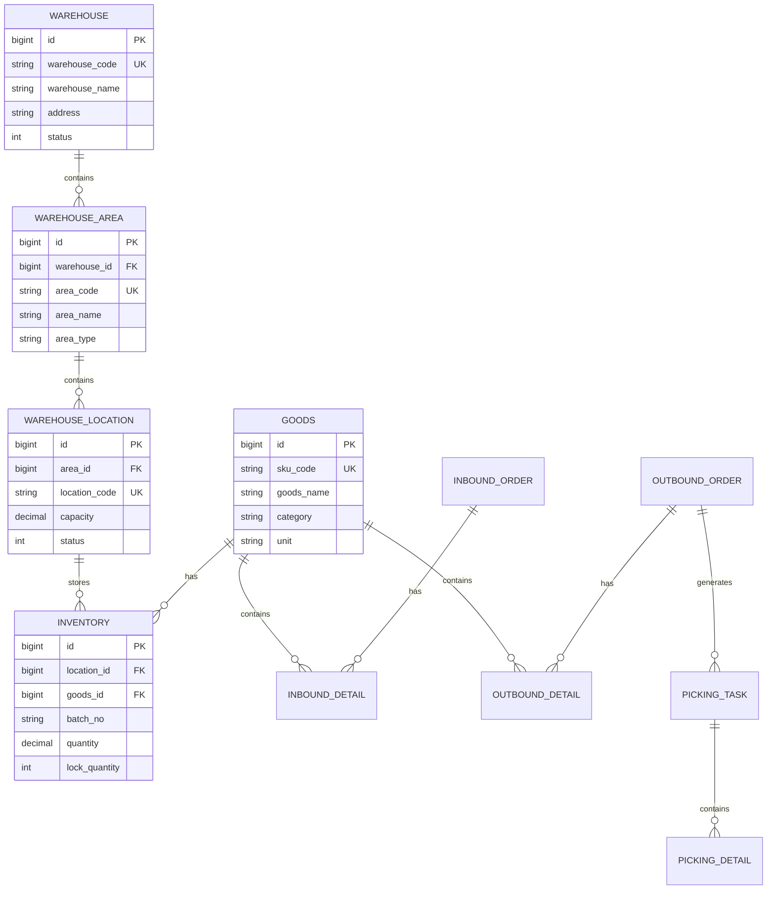

### 3.2 完整建表语句

```sql
-- ================================
-- WMS 仓库管理系统数据库
-- ================================

CREATE DATABASE IF NOT EXISTS `wms` DEFAULT CHARACTER SET utf8mb4 COLLATE utf8mb4_unicode_ci;
USE `wms`;

-- ================================
-- 1. 仓库基础表
-- ================================

-- 仓库表
CREATE TABLE `warehouse` (
    `id` BIGINT(20) NOT NULL AUTO_INCREMENT COMMENT '主键ID',
    `warehouse_code` VARCHAR(50) NOT NULL COMMENT '仓库编码',
    `warehouse_name` VARCHAR(100) NOT NULL COMMENT '仓库名称',
    `warehouse_type` TINYINT(4) DEFAULT 1 COMMENT '仓库类型:1-成品仓,2-原料仓,3-半成品仓',
    `province` VARCHAR(50) DEFAULT NULL COMMENT '省份',
    `city` VARCHAR(50) DEFAULT NULL COMMENT '城市',
    `district` VARCHAR(50) DEFAULT NULL COMMENT '区县',
    `address` VARCHAR(200) DEFAULT NULL COMMENT '详细地址',
    `contact_person` VARCHAR(50) DEFAULT NULL COMMENT '联系人',
    `contact_phone` VARCHAR(20) DEFAULT NULL COMMENT '联系电话',
    `total_area` DECIMAL(10,2) DEFAULT NULL COMMENT '总面积(平方米)',
    `status` TINYINT(4) DEFAULT 1 COMMENT '状态:1-启用,0-禁用',
    `remark` VARCHAR(500) DEFAULT NULL COMMENT '备注',
    `create_time` DATETIME DEFAULT CURRENT_TIMESTAMP COMMENT '创建时间',
    `update_time` DATETIME DEFAULT CURRENT_TIMESTAMP ON UPDATE CURRENT_TIMESTAMP COMMENT '更新时间',
    PRIMARY KEY (`id`),
    UNIQUE KEY `uk_warehouse_code` (`warehouse_code`)
) ENGINE=InnoDB DEFAULT CHARSET=utf8mb4 COMMENT='仓库表';

-- 库区表
CREATE TABLE `warehouse_area` (
    `id` BIGINT(20) NOT NULL AUTO_INCREMENT COMMENT '主键ID',
    `warehouse_id` BIGINT(20) NOT NULL COMMENT '仓库ID',
    `area_code` VARCHAR(50) NOT NULL COMMENT '库区编码',
    `area_name` VARCHAR(100) NOT NULL COMMENT '库区名称',
    `area_type` VARCHAR(20) DEFAULT NULL COMMENT '库区类型:STORAGE-存储区,PICKING-拣货区,STAGING-暂存区',
    `floor` INT(11) DEFAULT 1 COMMENT '楼层',
    `area_size` DECIMAL(10,2) DEFAULT NULL COMMENT '面积',
    `status` TINYINT(4) DEFAULT 1 COMMENT '状态:1-启用,0-禁用',
    `remark` VARCHAR(500) DEFAULT NULL COMMENT '备注',
    `create_time` DATETIME DEFAULT CURRENT_TIMESTAMP COMMENT '创建时间',
    `update_time` DATETIME DEFAULT CURRENT_TIMESTAMP ON UPDATE CURRENT_TIMESTAMP COMMENT '更新时间',
    PRIMARY KEY (`id`),
    UNIQUE KEY `uk_area_code` (`warehouse_id`, `area_code`),
    KEY `idx_warehouse` (`warehouse_id`)
) ENGINE=InnoDB DEFAULT CHARSET=utf8mb4 COMMENT='库区表';

-- 库位表
CREATE TABLE `warehouse_location` (
    `id` BIGINT(20) NOT NULL AUTO_INCREMENT COMMENT '主键ID',
    `warehouse_id` BIGINT(20) NOT NULL COMMENT '仓库ID',
    `area_id` BIGINT(20) NOT NULL COMMENT '库区ID',
    `location_code` VARCHAR(50) NOT NULL COMMENT '库位编码',
    `location_type` VARCHAR(20) DEFAULT 'NORMAL' COMMENT '库位类型:NORMAL-普通,TEMP-临时,DEFECT-残次品',
    `row_no` INT(11) DEFAULT NULL COMMENT '排号',
    `column_no` INT(11) DEFAULT NULL COMMENT '列号',
    `layer_no` INT(11) DEFAULT NULL COMMENT '层号',
    `capacity` DECIMAL(10,2) DEFAULT NULL COMMENT '容量',
    `max_weight` DECIMAL(10,2) DEFAULT NULL COMMENT '最大承重(KG)',
    `status` TINYINT(4) DEFAULT 1 COMMENT '状态:1-空闲,2-占用,3-锁定,0-禁用',
    `remark` VARCHAR(500) DEFAULT NULL COMMENT '备注',
    `create_time` DATETIME DEFAULT CURRENT_TIMESTAMP COMMENT '创建时间',
    `update_time` DATETIME DEFAULT CURRENT_TIMESTAMP ON UPDATE CURRENT_TIMESTAMP COMMENT '更新时间',
    PRIMARY KEY (`id`),
    UNIQUE KEY `uk_location_code` (`warehouse_id`, `location_code`),
    KEY `idx_area` (`area_id`),
    KEY `idx_status` (`status`)
) ENGINE=InnoDB DEFAULT CHARSET=utf8mb4 COMMENT='库位表';

-- ================================
-- 2. 商品管理表
-- ================================

-- 商品分类表
CREATE TABLE `goods_category` (
    `id` BIGINT(20) NOT NULL AUTO_INCREMENT COMMENT '主键ID',
    `category_code` VARCHAR(50) NOT NULL COMMENT '分类编码',
    `category_name` VARCHAR(100) NOT NULL COMMENT '分类名称',
    `parent_id` BIGINT(20) DEFAULT 0 COMMENT '父分类ID',
    `level` INT(11) DEFAULT 1 COMMENT '层级',
    `sort_order` INT(11) DEFAULT 0 COMMENT '排序',
    `create_time` DATETIME DEFAULT CURRENT_TIMESTAMP COMMENT '创建时间',
    `update_time` DATETIME DEFAULT CURRENT_TIMESTAMP ON UPDATE CURRENT_TIMESTAMP COMMENT '更新时间',
    PRIMARY KEY (`id`),
    UNIQUE KEY `uk_category_code` (`category_code`)
) ENGINE=InnoDB DEFAULT CHARSET=utf8mb4 COMMENT='商品分类表';

-- 商品信息表
CREATE TABLE `goods` (
    `id` BIGINT(20) NOT NULL AUTO_INCREMENT COMMENT '主键ID',
    `sku_code` VARCHAR(50) NOT NULL COMMENT 'SKU编码',
    `goods_name` VARCHAR(200) NOT NULL COMMENT '商品名称',
    `category_id` BIGINT(20) DEFAULT NULL COMMENT '分类ID',
    `brand` VARCHAR(100) DEFAULT NULL COMMENT '品牌',
    `model` VARCHAR(100) DEFAULT NULL COMMENT '型号',
    `barcode` VARCHAR(50) DEFAULT NULL COMMENT '条形码',
    `unit` VARCHAR(20) DEFAULT 'PCS' COMMENT '计量单位',
    `spec` VARCHAR(200) DEFAULT NULL COMMENT '规格',
    `weight` DECIMAL(10,3) DEFAULT NULL COMMENT '重量(KG)',
    `volume` DECIMAL(10,3) DEFAULT NULL COMMENT '体积(立方米)',
    `shelf_life` INT(11) DEFAULT NULL COMMENT '保质期(天)',
    `storage_temp_min` DECIMAL(5,2) DEFAULT NULL COMMENT '最低存储温度',
    `storage_temp_max` DECIMAL(5,2) DEFAULT NULL COMMENT '最高存储温度',
    `need_batch` TINYINT(4) DEFAULT 0 COMMENT '是否批次管理:1-是,0-否',
    `need_serial` TINYINT(4) DEFAULT 0 COMMENT '是否序列号管理:1-是,0-否',
    `safety_stock` DECIMAL(10,2) DEFAULT 0 COMMENT '安全库存',
    `max_stock` DECIMAL(10,2) DEFAULT NULL COMMENT '最大库存',
    `status` TINYINT(4) DEFAULT 1 COMMENT '状态:1-启用,0-禁用',
    `remark` VARCHAR(500) DEFAULT NULL COMMENT '备注',
    `create_time` DATETIME DEFAULT CURRENT_TIMESTAMP COMMENT '创建时间',
    `update_time` DATETIME DEFAULT CURRENT_TIMESTAMP ON UPDATE CURRENT_TIMESTAMP COMMENT '更新时间',
    PRIMARY KEY (`id`),
    UNIQUE KEY `uk_sku_code` (`sku_code`),
    KEY `idx_category` (`category_id`),
    KEY `idx_barcode` (`barcode`)
) ENGINE=InnoDB DEFAULT CHARSET=utf8mb4 COMMENT='商品信息表';

-- ================================
-- 3. 库存管理表
-- ================================

-- 库存表
CREATE TABLE `inventory` (
    `id` BIGINT(20) NOT NULL AUTO_INCREMENT COMMENT '主键ID',
    `warehouse_id` BIGINT(20) NOT NULL COMMENT '仓库ID',
    `location_id` BIGINT(20) DEFAULT NULL COMMENT '库位ID',
    `goods_id` BIGINT(20) NOT NULL COMMENT '商品ID',
    `batch_no` VARCHAR(50) DEFAULT NULL COMMENT '批次号',
    `serial_no` VARCHAR(50) DEFAULT NULL COMMENT '序列号',
    `quantity` DECIMAL(10,2) NOT NULL DEFAULT 0 COMMENT '库存数量',
    `lock_quantity` DECIMAL(10,2) DEFAULT 0 COMMENT '锁定数量',
    `available_quantity` DECIMAL(10,2) GENERATED ALWAYS AS (`quantity` - `lock_quantity`) VIRTUAL COMMENT '可用数量',
    `production_date` DATE DEFAULT NULL COMMENT '生产日期',
    `expire_date` DATE DEFAULT NULL COMMENT '过期日期',
    `inbound_date` DATETIME DEFAULT NULL COMMENT '入库日期',
    `supplier_id` BIGINT(20) DEFAULT NULL COMMENT '供应商ID',
    `supplier_name` VARCHAR(100) DEFAULT NULL COMMENT '供应商名称',
    `status` TINYINT(4) DEFAULT 1 COMMENT '状态:1-正常,2-冻结,3-待检,4-损坏',
    `create_time` DATETIME DEFAULT CURRENT_TIMESTAMP COMMENT '创建时间',
    `update_time` DATETIME DEFAULT CURRENT_TIMESTAMP ON UPDATE CURRENT_TIMESTAMP COMMENT '更新时间',
    PRIMARY KEY (`id`),
    UNIQUE KEY `uk_inventory` (`warehouse_id`, `location_id`, `goods_id`, `batch_no`, `serial_no`),
    KEY `idx_goods` (`goods_id`),
    KEY `idx_location` (`location_id`),
    KEY `idx_batch` (`batch_no`),
    KEY `idx_status` (`status`)
) ENGINE=InnoDB DEFAULT CHARSET=utf8mb4 COMMENT='库存表';

-- 库存流水表
CREATE TABLE `inventory_log` (
    `id` BIGINT(20) NOT NULL AUTO_INCREMENT COMMENT '主键ID',
    `warehouse_id` BIGINT(20) NOT NULL COMMENT '仓库ID',
    `goods_id` BIGINT(20) NOT NULL COMMENT '商品ID',
    `location_id` BIGINT(20) DEFAULT NULL COMMENT '库位ID',
    `batch_no` VARCHAR(50) DEFAULT NULL COMMENT '批次号',
    `operation_type` VARCHAR(20) NOT NULL COMMENT '操作类型:INBOUND-入库,OUTBOUND-出库,MOVE-移库,LOCK-锁定,UNLOCK-解锁',
    `quantity_before` DECIMAL(10,2) DEFAULT NULL COMMENT '操作前数量',
    `quantity_change` DECIMAL(10,2) NOT NULL COMMENT '变化数量',
    `quantity_after` DECIMAL(10,2) DEFAULT NULL COMMENT '操作后数量',
    `business_type` VARCHAR(50) DEFAULT NULL COMMENT '业务类型',
    `business_no` VARCHAR(50) DEFAULT NULL COMMENT '业务单号',
    `operator` VARCHAR(50) DEFAULT NULL COMMENT '操作人',
    `remark` VARCHAR(500) DEFAULT NULL COMMENT '备注',
    `create_time` DATETIME DEFAULT CURRENT_TIMESTAMP COMMENT '创建时间',
    PRIMARY KEY (`id`),
    KEY `idx_warehouse_goods` (`warehouse_id`, `goods_id`),
    KEY `idx_business` (`business_type`, `business_no`),
    KEY `idx_create_time` (`create_time`)
) ENGINE=InnoDB DEFAULT CHARSET=utf8mb4 COMMENT='库存流水表';

-- ================================
-- 4. 入库管理表
-- ================================

-- 入库单表
CREATE TABLE `inbound_order` (
    `id` BIGINT(20) NOT NULL AUTO_INCREMENT COMMENT '主键ID',
    `inbound_no` VARCHAR(50) NOT NULL COMMENT '入库单号',
    `warehouse_id` BIGINT(20) NOT NULL COMMENT '仓库ID',
    `inbound_type` VARCHAR(20) NOT NULL COMMENT '入库类型:PURCHASE-采购,RETURN-退货,TRANSFER-调拨,PROFIT-盘盈,PRODUCTION-生产,OTHER-其他',
    `source_no` VARCHAR(50) DEFAULT NULL COMMENT '来源单号',
    `supplier_id` BIGINT(20) DEFAULT NULL COMMENT '供应商ID',
    `supplier_name` VARCHAR(100) DEFAULT NULL COMMENT '供应商名称',
    `expect_time` DATETIME DEFAULT NULL COMMENT '预计到货时间',
    `actual_time` DATETIME DEFAULT NULL COMMENT '实际到货时间',
    `total_quantity` DECIMAL(10,2) DEFAULT 0 COMMENT '总数量',
    `actual_quantity` DECIMAL(10,2) DEFAULT 0 COMMENT '实收数量',
    `status` TINYINT(4) DEFAULT 1 COMMENT '状态:1-待审核,2-待入库,3-入库中,4-已完成,5-已取消',
    `audit_user` VARCHAR(50) DEFAULT NULL COMMENT '审核人',
    `audit_time` DATETIME DEFAULT NULL COMMENT '审核时间',
    `operator` VARCHAR(50) DEFAULT NULL COMMENT '操作人',
    `remark` VARCHAR(500) DEFAULT NULL COMMENT '备注',
    `create_time` DATETIME DEFAULT CURRENT_TIMESTAMP COMMENT '创建时间',
    `update_time` DATETIME DEFAULT CURRENT_TIMESTAMP ON UPDATE CURRENT_TIMESTAMP COMMENT '更新时间',
    PRIMARY KEY (`id`),
    UNIQUE KEY `uk_inbound_no` (`inbound_no`),
    KEY `idx_warehouse` (`warehouse_id`),
    KEY `idx_status` (`status`),
    KEY `idx_create_time` (`create_time`)
) ENGINE=InnoDB DEFAULT CHARSET=utf8mb4 COMMENT='入库单表';

-- 入库单明细表
CREATE TABLE `inbound_detail` (
    `id` BIGINT(20) NOT NULL AUTO_INCREMENT COMMENT '主键ID',
    `inbound_id` BIGINT(20) NOT NULL COMMENT '入库单ID',
    `inbound_no` VARCHAR(50) NOT NULL COMMENT '入库单号',
    `goods_id` BIGINT(20) NOT NULL COMMENT '商品ID',
    `sku_code` VARCHAR(50) NOT NULL COMMENT 'SKU编码',
    `goods_name` VARCHAR(200) NOT NULL COMMENT '商品名称',
    `batch_no` VARCHAR(50) DEFAULT NULL COMMENT '批次号',
    `production_date` DATE DEFAULT NULL COMMENT '生产日期',
    `expire_date` DATE DEFAULT NULL COMMENT '过期日期',
    `plan_quantity` DECIMAL(10,2) NOT NULL COMMENT '计划数量',
    `actual_quantity` DECIMAL(10,2) DEFAULT 0 COMMENT '实收数量',
    `location_id` BIGINT(20) DEFAULT NULL COMMENT '上架库位ID',
    `location_code` VARCHAR(50) DEFAULT NULL COMMENT '上架库位编码',
    `status` TINYINT(4) DEFAULT 1 COMMENT '状态:1-待收货,2-已收货,3-已上架',
    `remark` VARCHAR(500) DEFAULT NULL COMMENT '备注',
    `create_time` DATETIME DEFAULT CURRENT_TIMESTAMP COMMENT '创建时间',
    `update_time` DATETIME DEFAULT CURRENT_TIMESTAMP ON UPDATE CURRENT_TIMESTAMP COMMENT '更新时间',
    PRIMARY KEY (`id`),
    KEY `idx_inbound` (`inbound_id`),
    KEY `idx_goods` (`goods_id`)
) ENGINE=InnoDB DEFAULT CHARSET=utf8mb4 COMMENT='入库单明细表';

-- ================================
-- 5. 出库管理表
-- ================================

-- 出库单表
CREATE TABLE `outbound_order` (
    `id` BIGINT(20) NOT NULL AUTO_INCREMENT COMMENT '主键ID',
    `outbound_no` VARCHAR(50) NOT NULL COMMENT '出库单号',
    `warehouse_id` BIGINT(20) NOT NULL COMMENT '仓库ID',
    `outbound_type` VARCHAR(20) NOT NULL COMMENT '出库类型:SALE-销售,TRANSFER-调拨,SCRAP-报损,RETURN-退货,LOSS-盘亏,OTHER-其他',
    `source_no` VARCHAR(50) DEFAULT NULL COMMENT '来源单号(订单号/调拨单号)',
    `customer_code` VARCHAR(50) DEFAULT NULL COMMENT '客户编码',
    `customer_name` VARCHAR(100) DEFAULT NULL COMMENT '客户名称',
    `delivery_address` VARCHAR(200) DEFAULT NULL COMMENT '收货地址',
    `contact_person` VARCHAR(50) DEFAULT NULL COMMENT '联系人',
    `contact_phone` VARCHAR(20) DEFAULT NULL COMMENT '联系电话',
    `expect_time` DATETIME DEFAULT NULL COMMENT '期望发货时间',
    `actual_time` DATETIME DEFAULT NULL COMMENT '实际发货时间',
    `total_quantity` DECIMAL(10,2) DEFAULT 0 COMMENT '总数量',
    `actual_quantity` DECIMAL(10,2) DEFAULT 0 COMMENT '实发数量',
    `priority` TINYINT(4) DEFAULT 1 COMMENT '优先级:1-普通,2-紧急,3-特急',
    `carrier` VARCHAR(50) DEFAULT NULL COMMENT '承运商',
    `tracking_no` VARCHAR(50) DEFAULT NULL COMMENT '物流单号',
    `status` TINYINT(4) DEFAULT 1 COMMENT '状态:1-待审核,2-待出库,3-拣货中,4-待复核,5-待发货,6-已发货,7-已取消',
    `audit_user` VARCHAR(50) DEFAULT NULL COMMENT '审核人',
    `audit_time` DATETIME DEFAULT NULL COMMENT '审核时间',
    `audit_remark` VARCHAR(500) DEFAULT NULL COMMENT '审核备注',
    `picker_id` BIGINT(20) DEFAULT NULL COMMENT '拣货员ID',
    `picker_name` VARCHAR(50) DEFAULT NULL COMMENT '拣货员姓名',
    `picking_time` DATETIME DEFAULT NULL COMMENT '拣货完成时间',
    `reviewer_id` BIGINT(20) DEFAULT NULL COMMENT '复核员ID',
    `reviewer_name` VARCHAR(50) DEFAULT NULL COMMENT '复核员姓名',
    `review_time` DATETIME DEFAULT NULL COMMENT '复核时间',
    `operator` VARCHAR(50) DEFAULT NULL COMMENT '操作人',
    `remark` VARCHAR(500) DEFAULT NULL COMMENT '备注',
    `create_time` DATETIME DEFAULT CURRENT_TIMESTAMP COMMENT '创建时间',
    `update_time` DATETIME DEFAULT CURRENT_TIMESTAMP ON UPDATE CURRENT_TIMESTAMP COMMENT '更新时间',
    PRIMARY KEY (`id`),
    UNIQUE KEY `uk_outbound_no` (`outbound_no`),
    KEY `idx_warehouse` (`warehouse_id`),
    KEY `idx_customer` (`customer_code`),
    KEY `idx_status` (`status`),
    KEY `idx_priority` (`priority`),
    KEY `idx_create_time` (`create_time`)
) ENGINE=InnoDB DEFAULT CHARSET=utf8mb4 COMMENT='出库单表';

-- 出库单明细表
CREATE TABLE `outbound_detail` (
    `id` BIGINT(20) NOT NULL AUTO_INCREMENT COMMENT '主键ID',
    `outbound_id` BIGINT(20) NOT NULL COMMENT '出库单ID',
    `outbound_no` VARCHAR(50) NOT NULL COMMENT '出库单号',
    `goods_id` BIGINT(20) NOT NULL COMMENT '商品ID',
    `sku_code` VARCHAR(50) NOT NULL COMMENT 'SKU编码',
    `goods_name` VARCHAR(200) NOT NULL COMMENT '商品名称',
    `batch_no` VARCHAR(50) DEFAULT NULL COMMENT '批次号',
    `plan_quantity` DECIMAL(10,2) NOT NULL COMMENT '计划数量',
    `actual_quantity` DECIMAL(10,2) DEFAULT 0 COMMENT '实发数量',
    `picked_quantity` DECIMAL(10,2) DEFAULT 0 COMMENT '已拣数量',
    `location_id` BIGINT(20) DEFAULT NULL COMMENT '拣货库位ID',
    `location_code` VARCHAR(50) DEFAULT NULL COMMENT '拣货库位编码',
    `status` TINYINT(4) DEFAULT 1 COMMENT '状态:1-待拣货,2-拣货中,3-已拣货,4-已复核,5-已发货',
    `remark` VARCHAR(500) DEFAULT NULL COMMENT '备注',
    `create_time` DATETIME DEFAULT CURRENT_TIMESTAMP COMMENT '创建时间',
    `update_time` DATETIME DEFAULT CURRENT_TIMESTAMP ON UPDATE CURRENT_TIMESTAMP COMMENT '更新时间',
    PRIMARY KEY (`id`),
    KEY `idx_outbound` (`outbound_id`),
    KEY `idx_goods` (`goods_id`),
    KEY `idx_location` (`location_id`)
) ENGINE=InnoDB DEFAULT CHARSET=utf8mb4 COMMENT='出库单明细表';

-- ================================
-- 6. 拣货管理表
-- ================================

-- 拣货波次表
CREATE TABLE `picking_wave` (
    `id` BIGINT(20) NOT NULL AUTO_INCREMENT COMMENT '主键ID',
    `wave_no` VARCHAR(50) NOT NULL COMMENT '波次号',
    `warehouse_id` BIGINT(20) NOT NULL COMMENT '仓库ID',
    `wave_type` VARCHAR(20) DEFAULT 'BATCH' COMMENT '波次类型:BATCH-批次拣货,ZONE-分区拣货,SINGLE-单品拣货',
    `order_count` INT(11) DEFAULT 0 COMMENT '订单数量',
    `item_count` INT(11) DEFAULT 0 COMMENT '商品种类数',
    `total_quantity` DECIMAL(10,2) DEFAULT 0 COMMENT '总数量',
    `priority` TINYINT(4) DEFAULT 1 COMMENT '优先级:1-普通,2-紧急,3-特急',
    `picker_id` BIGINT(20) DEFAULT NULL COMMENT '拣货员ID',
    `picker_name` VARCHAR(50) DEFAULT NULL COMMENT '拣货员姓名',
    `estimated_time` INT(11) DEFAULT NULL COMMENT '预计耗时(秒)',
    `actual_time` INT(11) DEFAULT NULL COMMENT '实际耗时(秒)',
    `start_time` DATETIME DEFAULT NULL COMMENT '开始时间',
    `end_time` DATETIME DEFAULT NULL COMMENT '结束时间',
    `status` TINYINT(4) DEFAULT 1 COMMENT '状态:1-待分配,2-已分配,3-拣货中,4-已完成,5-已取消',
    `remark` VARCHAR(500) DEFAULT NULL COMMENT '备注',
    `create_time` DATETIME DEFAULT CURRENT_TIMESTAMP COMMENT '创建时间',
    `update_time` DATETIME DEFAULT CURRENT_TIMESTAMP ON UPDATE CURRENT_TIMESTAMP COMMENT '更新时间',
    PRIMARY KEY (`id`),
    UNIQUE KEY `uk_wave_no` (`wave_no`),
    KEY `idx_warehouse` (`warehouse_id`),
    KEY `idx_status` (`status`),
    KEY `idx_picker` (`picker_id`),
    KEY `idx_create_time` (`create_time`)
) ENGINE=InnoDB DEFAULT CHARSET=utf8mb4 COMMENT='拣货波次表';

-- 拣货波次订单关联表
CREATE TABLE `picking_wave_order` (
    `id` BIGINT(20) NOT NULL AUTO_INCREMENT COMMENT '主键ID',
    `wave_id` BIGINT(20) NOT NULL COMMENT '波次ID',
    `wave_no` VARCHAR(50) NOT NULL COMMENT '波次号',
    `outbound_id` BIGINT(20) NOT NULL COMMENT '出库单ID',
    `outbound_no` VARCHAR(50) NOT NULL COMMENT '出库单号',
    `create_time` DATETIME DEFAULT CURRENT_TIMESTAMP COMMENT '创建时间',
    PRIMARY KEY (`id`),
    UNIQUE KEY `uk_wave_outbound` (`wave_id`, `outbound_id`),
    KEY `idx_wave` (`wave_id`),
    KEY `idx_outbound` (`outbound_id`)
) ENGINE=InnoDB DEFAULT CHARSET=utf8mb4 COMMENT='拣货波次订单关联表';

-- 拣货任务表
CREATE TABLE `picking_task` (
    `id` BIGINT(20) NOT NULL AUTO_INCREMENT COMMENT '主键ID',
    `task_no` VARCHAR(50) NOT NULL COMMENT '任务编号',
    `wave_id` BIGINT(20) DEFAULT NULL COMMENT '波次ID',
    `wave_no` VARCHAR(50) DEFAULT NULL COMMENT '波次号',
    `outbound_id` BIGINT(20) NOT NULL COMMENT '出库单ID',
    `outbound_no` VARCHAR(50) NOT NULL COMMENT '出库单号',
    `warehouse_id` BIGINT(20) NOT NULL COMMENT '仓库ID',
    `goods_id` BIGINT(20) NOT NULL COMMENT '商品ID',
    `sku_code` VARCHAR(50) NOT NULL COMMENT 'SKU编码',
    `goods_name` VARCHAR(200) NOT NULL COMMENT '商品名称',
    `batch_no` VARCHAR(50) DEFAULT NULL COMMENT '批次号',
    `location_id` BIGINT(20) NOT NULL COMMENT '库位ID',
    `location_code` VARCHAR(50) NOT NULL COMMENT '库位编码',
    `plan_quantity` DECIMAL(10,2) NOT NULL COMMENT '计划拣货数量',
    `actual_quantity` DECIMAL(10,2) DEFAULT 0 COMMENT '实际拣货数量',
    `sort_order` INT(11) DEFAULT 0 COMMENT '拣货顺序',
    `picker_id` BIGINT(20) DEFAULT NULL COMMENT '拣货员ID',
    `picker_name` VARCHAR(50) DEFAULT NULL COMMENT '拣货员姓名',
    `picking_time` DATETIME DEFAULT NULL COMMENT '拣货时间',
    `status` TINYINT(4) DEFAULT 1 COMMENT '状态:1-待拣货,2-拣货中,3-已完成,4-异常',
    `exception_type` VARCHAR(20) DEFAULT NULL COMMENT '异常类型:EMPTY-库位空,SHORT-库存不足,DAMAGED-商品损坏',
    `exception_remark` VARCHAR(500) DEFAULT NULL COMMENT '异常说明',
    `remark` VARCHAR(500) DEFAULT NULL COMMENT '备注',
    `create_time` DATETIME DEFAULT CURRENT_TIMESTAMP COMMENT '创建时间',
    `update_time` DATETIME DEFAULT CURRENT_TIMESTAMP ON UPDATE CURRENT_TIMESTAMP COMMENT '更新时间',
    PRIMARY KEY (`id`),
    UNIQUE KEY `uk_task_no` (`task_no`),
    KEY `idx_wave` (`wave_id`),
    KEY `idx_outbound` (`outbound_id`),
    KEY `idx_picker` (`picker_id`),
    KEY `idx_location` (`location_id`),
    KEY `idx_status` (`status`)
) ENGINE=InnoDB DEFAULT CHARSET=utf8mb4 COMMENT='拣货任务表';

-- ================================
-- 7. 盘点管理表
-- ================================

-- 盘点计划表
CREATE TABLE `stock_taking_plan` (
    `id` BIGINT(20) NOT NULL AUTO_INCREMENT COMMENT '主键ID',
    `plan_no` VARCHAR(50) NOT NULL COMMENT '盘点计划编号',
    `plan_name` VARCHAR(100) NOT NULL COMMENT '盘点计划名称',
    `warehouse_id` BIGINT(20) NOT NULL COMMENT '仓库ID',
    `taking_type` VARCHAR(20) NOT NULL COMMENT '盘点类型:FULL-全盘,CYCLE-循环盘,SPOT-抽盘,DYNAMIC-动态盘',
    `scope_type` VARCHAR(20) NOT NULL COMMENT '盘点范围:WAREHOUSE-全仓,AREA-库区,LOCATION-库位,GOODS-商品',
    `scope_value` VARCHAR(500) DEFAULT NULL COMMENT '范围值(JSON数组)',
    `plan_start_time` DATETIME NOT NULL COMMENT '计划开始时间',
    `plan_end_time` DATETIME NOT NULL COMMENT '计划结束时间',
    `actual_start_time` DATETIME DEFAULT NULL COMMENT '实际开始时间',
    `actual_end_time` DATETIME DEFAULT NULL COMMENT '实际结束时间',
    `total_count` INT(11) DEFAULT 0 COMMENT '盘点总数',
    `completed_count` INT(11) DEFAULT 0 COMMENT '已完成数',
    `diff_count` INT(11) DEFAULT 0 COMMENT '差异数',
    `creator` VARCHAR(50) DEFAULT NULL COMMENT '创建人',
    `status` TINYINT(4) DEFAULT 1 COMMENT '状态:1-待审核,2-待执行,3-执行中,4-已完成,5-已取消',
    `audit_user` VARCHAR(50) DEFAULT NULL COMMENT '审核人',
    `audit_time` DATETIME DEFAULT NULL COMMENT '审核时间',
    `remark` VARCHAR(500) DEFAULT NULL COMMENT '备注',
    `create_time` DATETIME DEFAULT CURRENT_TIMESTAMP COMMENT '创建时间',
    `update_time` DATETIME DEFAULT CURRENT_TIMESTAMP ON UPDATE CURRENT_TIMESTAMP COMMENT '更新时间',
    PRIMARY KEY (`id`),
    UNIQUE KEY `uk_plan_no` (`plan_no`),
    KEY `idx_warehouse` (`warehouse_id`),
    KEY `idx_status` (`status`),
    KEY `idx_plan_time` (`plan_start_time`, `plan_end_time`)
) ENGINE=InnoDB DEFAULT CHARSET=utf8mb4 COMMENT='盘点计划表';

-- 盘点单表
CREATE TABLE `stock_taking` (
    `id` BIGINT(20) NOT NULL AUTO_INCREMENT COMMENT '主键ID',
    `taking_no` VARCHAR(50) NOT NULL COMMENT '盘点单号',
    `plan_id` BIGINT(20) DEFAULT NULL COMMENT '盘点计划ID',
    `plan_no` VARCHAR(50) DEFAULT NULL COMMENT '盘点计划编号',
    `warehouse_id` BIGINT(20) NOT NULL COMMENT '仓库ID',
    `location_id` BIGINT(20) DEFAULT NULL COMMENT '库位ID',
    `location_code` VARCHAR(50) DEFAULT NULL COMMENT '库位编码',
    `goods_id` BIGINT(20) NOT NULL COMMENT '商品ID',
    `sku_code` VARCHAR(50) NOT NULL COMMENT 'SKU编码',
    `goods_name` VARCHAR(200) NOT NULL COMMENT '商品名称',
    `batch_no` VARCHAR(50) DEFAULT NULL COMMENT '批次号',
    `book_quantity` DECIMAL(10,2) DEFAULT 0 COMMENT '账面数量',
    `actual_quantity` DECIMAL(10,2) DEFAULT NULL COMMENT '实盘数量',
    `diff_quantity` DECIMAL(10,2) GENERATED ALWAYS AS (`actual_quantity` - `book_quantity`) STORED COMMENT '差异数量',
    `diff_reason` VARCHAR(200) DEFAULT NULL COMMENT '差异原因',
    `operator` VARCHAR(50) DEFAULT NULL COMMENT '盘点人',
    `operate_time` DATETIME DEFAULT NULL COMMENT '盘点时间',
    `reviewer` VARCHAR(50) DEFAULT NULL COMMENT '复核人',
    `review_time` DATETIME DEFAULT NULL COMMENT '复核时间',
    `status` TINYINT(4) DEFAULT 1 COMMENT '状态:1-待盘点,2-已盘点,3-已复核,4-已调整',
    `remark` VARCHAR(500) DEFAULT NULL COMMENT '备注',
    `create_time` DATETIME DEFAULT CURRENT_TIMESTAMP COMMENT '创建时间',
    `update_time` DATETIME DEFAULT CURRENT_TIMESTAMP ON UPDATE CURRENT_TIMESTAMP COMMENT '更新时间',
    PRIMARY KEY (`id`),
    UNIQUE KEY `uk_taking_no` (`taking_no`),
    KEY `idx_plan` (`plan_id`),
    KEY `idx_warehouse_goods` (`warehouse_id`, `goods_id`),
    KEY `idx_location` (`location_id`),
    KEY `idx_status` (`status`)
) ENGINE=InnoDB DEFAULT CHARSET=utf8mb4 COMMENT='盘点单表';

-- ================================
-- 8. 库位调整表
-- ================================

-- 移库单表
CREATE TABLE `stock_move` (
    `id` BIGINT(20) NOT NULL AUTO_INCREMENT COMMENT '主键ID',
    `move_no` VARCHAR(50) NOT NULL COMMENT '移库单号',
    `warehouse_id` BIGINT(20) NOT NULL COMMENT '仓库ID',
    `move_type` VARCHAR(20) NOT NULL COMMENT '移库类型:LOCATION-库位调整,AREA-库区调整,WAREHOUSE-仓库调拨',
    `goods_id` BIGINT(20) NOT NULL COMMENT '商品ID',
    `sku_code` VARCHAR(50) NOT NULL COMMENT 'SKU编码',
    `goods_name` VARCHAR(200) NOT NULL COMMENT '商品名称',
    `batch_no` VARCHAR(50) DEFAULT NULL COMMENT '批次号',
    `from_location_id` BIGINT(20) NOT NULL COMMENT '源库位ID',
    `from_location_code` VARCHAR(50) NOT NULL COMMENT '源库位编码',
    `to_location_id` BIGINT(20) NOT NULL COMMENT '目标库位ID',
    `to_location_code` VARCHAR(50) NOT NULL COMMENT '目标库位编码',
    `quantity` DECIMAL(10,2) NOT NULL COMMENT '移库数量',
    `move_reason` VARCHAR(200) DEFAULT NULL COMMENT '移库原因',
    `operator` VARCHAR(50) DEFAULT NULL COMMENT '操作人',
    `operate_time` DATETIME DEFAULT NULL COMMENT '操作时间',
    `status` TINYINT(4) DEFAULT 1 COMMENT '状态:1-待执行,2-执行中,3-已完成,4-已取消',
    `remark` VARCHAR(500) DEFAULT NULL COMMENT '备注',
    `create_time` DATETIME DEFAULT CURRENT_TIMESTAMP COMMENT '创建时间',
    `update_time` DATETIME DEFAULT CURRENT_TIMESTAMP ON UPDATE CURRENT_TIMESTAMP COMMENT '更新时间',
    PRIMARY KEY (`id`),
    UNIQUE KEY `uk_move_no` (`move_no`),
    KEY `idx_warehouse` (`warehouse_id`),
    KEY `idx_goods` (`goods_id`),
    KEY `idx_from_location` (`from_location_id`),
    KEY `idx_to_location` (`to_location_id`),
    KEY `idx_status` (`status`)
) ENGINE=InnoDB DEFAULT CHARSET=utf8mb4 COMMENT='移库单表';

-- ================================
-- 9. 供应商/客户管理表
-- ================================

-- 供应商表
CREATE TABLE `supplier` (
    `id` BIGINT(20) NOT NULL AUTO_INCREMENT COMMENT '主键ID',
    `supplier_code` VARCHAR(50) NOT NULL COMMENT '供应商编码',
    `supplier_name` VARCHAR(100) NOT NULL COMMENT '供应商名称',
    `supplier_type` VARCHAR(20) DEFAULT 'NORMAL' COMMENT '供应商类型:NORMAL-普通,VIP-VIP,STRATEGIC-战略',
    `contact_person` VARCHAR(50) DEFAULT NULL COMMENT '联系人',
    `contact_phone` VARCHAR(20) DEFAULT NULL COMMENT '联系电话',
    `contact_email` VARCHAR(50) DEFAULT NULL COMMENT '邮箱',
    `province` VARCHAR(50) DEFAULT NULL COMMENT '省份',
    `city` VARCHAR(50) DEFAULT NULL COMMENT '城市',
    `district` VARCHAR(50) DEFAULT NULL COMMENT '区县',
    `address` VARCHAR(200) DEFAULT NULL COMMENT '详细地址',
    `credit_level` VARCHAR(20) DEFAULT 'B' COMMENT '信用等级:A-优秀,B-良好,C-一般,D-较差',
    `cooperation_start_date` DATE DEFAULT NULL COMMENT '合作开始日期',
    `status` TINYINT(4) DEFAULT 1 COMMENT '状态:1-启用,0-禁用',
    `remark` VARCHAR(500) DEFAULT NULL COMMENT '备注',
    `create_time` DATETIME DEFAULT CURRENT_TIMESTAMP COMMENT '创建时间',
    `update_time` DATETIME DEFAULT CURRENT_TIMESTAMP ON UPDATE CURRENT_TIMESTAMP COMMENT '更新时间',
    PRIMARY KEY (`id`),
    UNIQUE KEY `uk_supplier_code` (`supplier_code`),
    KEY `idx_supplier_type` (`supplier_type`),
    KEY `idx_status` (`status`)
) ENGINE=InnoDB DEFAULT CHARSET=utf8mb4 COMMENT='供应商表';

-- 客户表
CREATE TABLE `customer` (
    `id` BIGINT(20) NOT NULL AUTO_INCREMENT COMMENT '主键ID',
    `customer_code` VARCHAR(50) NOT NULL COMMENT '客户编码',
    `customer_name` VARCHAR(100) NOT NULL COMMENT '客户名称',
    `customer_type` VARCHAR(20) DEFAULT 'RETAIL' COMMENT '客户类型:RETAIL-零售,WHOLESALE-批发,ENTERPRISE-企业',
    `customer_level` VARCHAR(20) DEFAULT 'NORMAL' COMMENT '客户等级:VIP,GOLD,SILVER,NORMAL',
    `contact_person` VARCHAR(50) DEFAULT NULL COMMENT '联系人',
    `contact_phone` VARCHAR(20) DEFAULT NULL COMMENT '联系电话',
    `contact_email` VARCHAR(50) DEFAULT NULL COMMENT '邮箱',
    `delivery_province` VARCHAR(50) DEFAULT NULL COMMENT '收货省份',
    `delivery_city` VARCHAR(50) DEFAULT NULL COMMENT '收货城市',
    `delivery_district` VARCHAR(50) DEFAULT NULL COMMENT '收货区县',
    `delivery_address` VARCHAR(200) DEFAULT NULL COMMENT '收货地址',
    `credit_limit` DECIMAL(15,2) DEFAULT 0 COMMENT '信用额度',
    `total_orders` INT(11) DEFAULT 0 COMMENT '累计订单数',
    `total_amount` DECIMAL(15,2) DEFAULT 0 COMMENT '累计金额',
    `status` TINYINT(4) DEFAULT 1 COMMENT '状态:1-启用,0-禁用',
    `remark` VARCHAR(500) DEFAULT NULL COMMENT '备注',
    `create_time` DATETIME DEFAULT CURRENT_TIMESTAMP COMMENT '创建时间',
    `update_time` DATETIME DEFAULT CURRENT_TIMESTAMP ON UPDATE CURRENT_TIMESTAMP COMMENT '更新时间',
    PRIMARY KEY (`id`),
    UNIQUE KEY `uk_customer_code` (`customer_code`),
    KEY `idx_customer_type` (`customer_type`),
    KEY `idx_customer_level` (`customer_level`),
    KEY `idx_status` (`status`)
) ENGINE=InnoDB DEFAULT CHARSET=utf8mb4 COMMENT='客户表';

-- 承运商表
CREATE TABLE `carrier` (
    `id` BIGINT(20) NOT NULL AUTO_INCREMENT COMMENT '主键ID',
    `carrier_code` VARCHAR(50) NOT NULL COMMENT '承运商编码',
    `carrier_name` VARCHAR(100) NOT NULL COMMENT '承运商名称',
    `carrier_type` VARCHAR(20) DEFAULT 'EXPRESS' COMMENT '承运商类型:EXPRESS-快递,LOGISTICS-物流,SPECIAL-专线',
    `contact_person` VARCHAR(50) DEFAULT NULL COMMENT '联系人',
    `contact_phone` VARCHAR(20) DEFAULT NULL COMMENT '联系电话',
    `contact_email` VARCHAR(50) DEFAULT NULL COMMENT '邮箱',
    `service_area` VARCHAR(500) DEFAULT NULL COMMENT '服务区域',
    `price_standard` VARCHAR(500) DEFAULT NULL COMMENT '收费标准',
    `time_limit` VARCHAR(100) DEFAULT NULL COMMENT '时效要求',
    `rating` DECIMAL(3,2) DEFAULT 5.00 COMMENT '服务评分(1-5分)',
    `cooperation_start_date` DATE DEFAULT NULL COMMENT '合作开始日期',
    `status` TINYINT(4) DEFAULT 1 COMMENT '状态:1-启用,0-禁用',
    `remark` VARCHAR(500) DEFAULT NULL COMMENT '备注',
    `create_time` DATETIME DEFAULT CURRENT_TIMESTAMP COMMENT '创建时间',
    `update_time` DATETIME DEFAULT CURRENT_TIMESTAMP ON UPDATE CURRENT_TIMESTAMP COMMENT '更新时间',
    PRIMARY KEY (`id`),
    UNIQUE KEY `uk_carrier_code` (`carrier_code`),
    KEY `idx_carrier_type` (`carrier_type`),
    KEY `idx_status` (`status`)
) ENGINE=InnoDB DEFAULT CHARSET=utf8mb4 COMMENT='承运商表';

-- ================================
-- 10. 系统配置表
-- ================================

-- 数据字典表
CREATE TABLE `sys_dict` (
    `id` BIGINT(20) NOT NULL AUTO_INCREMENT COMMENT '主键ID',
    `dict_code` VARCHAR(50) NOT NULL COMMENT '字典编码',
    `dict_name` VARCHAR(100) NOT NULL COMMENT '字典名称',
    `parent_code` VARCHAR(50) DEFAULT NULL COMMENT '父字典编码',
    `dict_value` VARCHAR(100) DEFAULT NULL COMMENT '字典值',
    `dict_label` VARCHAR(100) DEFAULT NULL COMMENT '字典标签',
    `sort_order` INT(11) DEFAULT 0 COMMENT '排序',
    `css_class` VARCHAR(50) DEFAULT NULL COMMENT '样式类',
    `list_class` VARCHAR(50) DEFAULT NULL COMMENT '列表类',
    `is_default` TINYINT(4) DEFAULT 0 COMMENT '是否默认:1-是,0-否',
    `status` TINYINT(4) DEFAULT 1 COMMENT '状态:1-启用,0-禁用',
    `remark` VARCHAR(500) DEFAULT NULL COMMENT '备注',
    `create_time` DATETIME DEFAULT CURRENT_TIMESTAMP COMMENT '创建时间',
    `update_time` DATETIME DEFAULT CURRENT_TIMESTAMP ON UPDATE CURRENT_TIMESTAMP COMMENT '更新时间',
    PRIMARY KEY (`id`),
    UNIQUE KEY `uk_dict` (`dict_code`, `dict_value`),
    KEY `idx_parent` (`parent_code`)
) ENGINE=InnoDB DEFAULT CHARSET=utf8mb4 COMMENT='数据字典表';

-- 用户表
CREATE TABLE `sys_user` (
    `id` BIGINT(20) NOT NULL AUTO_INCREMENT COMMENT '主键ID',
    `username` VARCHAR(50) NOT NULL COMMENT '用户名',
    `password` VARCHAR(100) NOT NULL COMMENT '密码',
    `real_name` VARCHAR(50) NOT NULL COMMENT '真实姓名',
    `nickname` VARCHAR(50) DEFAULT NULL COMMENT '昵称',
    `user_type` VARCHAR(20) DEFAULT 'EMPLOYEE' COMMENT '用户类型:ADMIN-管理员,EMPLOYEE-员工,PICKER-拣货员',
    `phone` VARCHAR(20) DEFAULT NULL COMMENT '手机号',
    `email` VARCHAR(50) DEFAULT NULL COMMENT '邮箱',
    `avatar` VARCHAR(200) DEFAULT NULL COMMENT '头像',
    `dept_id` BIGINT(20) DEFAULT NULL COMMENT '部门ID',
    `dept_name` VARCHAR(100) DEFAULT NULL COMMENT '部门名称',
    `warehouse_id` BIGINT(20) DEFAULT NULL COMMENT '所属仓库ID',
    `status` TINYINT(4) DEFAULT 1 COMMENT '状态:1-正常,0-禁用',
    `login_date` DATETIME DEFAULT NULL COMMENT '最后登录时间',
    `login_ip` VARCHAR(50) DEFAULT NULL COMMENT '最后登录IP',
    `create_time` DATETIME DEFAULT CURRENT_TIMESTAMP COMMENT '创建时间',
    `update_time` DATETIME DEFAULT CURRENT_TIMESTAMP ON UPDATE CURRENT_TIMESTAMP COMMENT '更新时间',
    PRIMARY KEY (`id`),
    UNIQUE KEY `uk_username` (`username`),
    KEY `idx_phone` (`phone`),
    KEY `idx_dept` (`dept_id`),
    KEY `idx_warehouse` (`warehouse_id`)
) ENGINE=InnoDB DEFAULT CHARSET=utf8mb4 COMMENT='用户表';

-- 角色表
CREATE TABLE `sys_role` (
    `id` BIGINT(20) NOT NULL AUTO_INCREMENT COMMENT '主键ID',
    `role_code` VARCHAR(50) NOT NULL COMMENT '角色编码',
    `role_name` VARCHAR(100) NOT NULL COMMENT '角色名称',
    `role_type` VARCHAR(20) DEFAULT 'CUSTOM' COMMENT '角色类型:SYSTEM-系统,CUSTOM-自定义',
    `data_scope` TINYINT(4) DEFAULT 1 COMMENT '数据范围:1-全部,2-自定义,3-本部门,4-本人',
    `sort_order` INT(11) DEFAULT 0 COMMENT '排序',
    `status` TINYINT(4) DEFAULT 1 COMMENT '状态:1-正常,0-禁用',
    `remark` VARCHAR(500) DEFAULT NULL COMMENT '备注',
    `create_time` DATETIME DEFAULT CURRENT_TIMESTAMP COMMENT '创建时间',
    `update_time` DATETIME DEFAULT CURRENT_TIMESTAMP ON UPDATE CURRENT_TIMESTAMP COMMENT '更新时间',
    PRIMARY KEY (`id`),
    UNIQUE KEY `uk_role_code` (`role_code`)
) ENGINE=InnoDB DEFAULT CHARSET=utf8mb4 COMMENT='角色表';

-- 菜单表
CREATE TABLE `sys_menu` (
    `id` BIGINT(20) NOT NULL AUTO_INCREMENT COMMENT '主键ID',
    `menu_code` VARCHAR(50) NOT NULL COMMENT '菜单编码',
    `menu_name` VARCHAR(100) NOT NULL COMMENT '菜单名称',
    `parent_id` BIGINT(20) DEFAULT 0 COMMENT '父菜单ID',
    `menu_type` VARCHAR(20) DEFAULT 'MENU' COMMENT '菜单类型:CATALOG-目录,MENU-菜单,BUTTON-按钮',
    `path` VARCHAR(200) DEFAULT NULL COMMENT '路由地址',
    `component` VARCHAR(200) DEFAULT NULL COMMENT '组件路径',
    `permission` VARCHAR(100) DEFAULT NULL COMMENT '权限标识',
    `icon` VARCHAR(100) DEFAULT NULL COMMENT '图标',
    `sort_order` INT(11) DEFAULT 0 COMMENT '排序',
    `visible` TINYINT(4) DEFAULT 1 COMMENT '是否显示:1-显示,0-隐藏',
    `status` TINYINT(4) DEFAULT 1 COMMENT '状态:1-正常,0-禁用',
    `remark` VARCHAR(500) DEFAULT NULL COMMENT '备注',
    `create_time` DATETIME DEFAULT CURRENT_TIMESTAMP COMMENT '创建时间',
    `update_time` DATETIME DEFAULT CURRENT_TIMESTAMP ON UPDATE CURRENT_TIMESTAMP COMMENT '更新时间',
    PRIMARY KEY (`id`),
    UNIQUE KEY `uk_menu_code` (`menu_code`),
    KEY `idx_parent` (`parent_id`)
) ENGINE=InnoDB DEFAULT CHARSET=utf8mb4 COMMENT='菜单表';

-- 用户角色关联表
CREATE TABLE `sys_user_role` (
    `id` BIGINT(20) NOT NULL AUTO_INCREMENT COMMENT '主键ID',
    `user_id` BIGINT(20) NOT NULL COMMENT '用户ID',
    `role_id` BIGINT(20) NOT NULL COMMENT '角色ID',
    `create_time` DATETIME DEFAULT CURRENT_TIMESTAMP COMMENT '创建时间',
    PRIMARY KEY (`id`),
    UNIQUE KEY `uk_user_role` (`user_id`, `role_id`),
    KEY `idx_user` (`user_id`),
    KEY `idx_role` (`role_id`)
) ENGINE=InnoDB DEFAULT CHARSET=utf8mb4 COMMENT='用户角色关联表';

-- 角色菜单关联表
CREATE TABLE `sys_role_menu` (
    `id` BIGINT(20) NOT NULL AUTO_INCREMENT COMMENT '主键ID',
    `role_id` BIGINT(20) NOT NULL COMMENT '角色ID',
    `menu_id` BIGINT(20) NOT NULL COMMENT '菜单ID',
    `create_time` DATETIME DEFAULT CURRENT_TIMESTAMP COMMENT '创建时间',
    PRIMARY KEY (`id`),
    UNIQUE KEY `uk_role_menu` (`role_id`, `menu_id`),
    KEY `idx_role` (`role_id`),
    KEY `idx_menu` (`menu_id`)
) ENGINE=InnoDB DEFAULT CHARSET=utf8mb4 COMMENT='角色菜单关联表';

-- 操作日志表
CREATE TABLE `sys_operation_log` (
    `id` BIGINT(20) NOT NULL AUTO_INCREMENT COMMENT '主键ID',
    `module` VARCHAR(50) DEFAULT NULL COMMENT '操作模块',
    `business_type` VARCHAR(50) DEFAULT NULL COMMENT '业务类型',
    `business_id` BIGINT(20) DEFAULT NULL COMMENT '业务ID',
    `method` VARCHAR(200) DEFAULT NULL COMMENT '请求方法',
    `request_method` VARCHAR(10) DEFAULT NULL COMMENT '请求方式',
    `operator_type` VARCHAR(20) DEFAULT 'WEB' COMMENT '操作类型:WEB-后台,MOBILE-手机,API-接口',
    `operator` VARCHAR(50) DEFAULT NULL COMMENT '操作人',
    `dept_name` VARCHAR(100) DEFAULT NULL COMMENT '部门名称',
    `url` VARCHAR(500) DEFAULT NULL COMMENT '请求URL',
    `ip` VARCHAR(50) DEFAULT NULL COMMENT '操作IP',
    `location` VARCHAR(200) DEFAULT NULL COMMENT '操作地点',
    `param` TEXT DEFAULT NULL COMMENT '请求参数',
    `result` TEXT DEFAULT NULL COMMENT '返回结果',
    `status` TINYINT(4) DEFAULT 1 COMMENT '状态:1-成功,0-失败',
    `error_msg` TEXT DEFAULT NULL COMMENT '错误消息',
    `cost_time` INT(11) DEFAULT NULL COMMENT '消耗时间(毫秒)',
    `create_time` DATETIME DEFAULT CURRENT_TIMESTAMP COMMENT '创建时间',
    PRIMARY KEY (`id`),
    KEY `idx_module` (`module`),
    KEY `idx_business` (`business_type`, `business_id`),
    KEY `idx_operator` (`operator`),
    KEY `idx_create_time` (`create_time`)
) ENGINE=InnoDB DEFAULT CHARSET=utf8mb4 COMMENT='操作日志表';

---

## 四、核心业务实现

### 4.1 库存服务实现

#### 实体类定义

```java
package com.wms.inventory.entity;

import com.baomidou.mybatisplus.annotation.*;
import lombok.Data;
import java.math.BigDecimal;
import java.time.LocalDate;
import java.time.LocalDateTime;

/**
 * 库存实体
 */
@Data
@TableName("inventory")
public class Inventory {
    
    @TableId(type = IdType.AUTO)
    private Long id;
    
    /**
     * 仓库ID
     */
    private Long warehouseId;
    
    /**
     * 库位ID
     */
    private Long locationId;
    
    /**
     * 商品ID
     */
    private Long goodsId;
    
    /**
     * 批次号
     */
    private String batchNo;
    
    /**
     * 序列号
     */
    private String serialNo;
    
    /**
     * 库存数量
     */
    private BigDecimal quantity;
    
    /**
     * 锁定数量
     */
    private BigDecimal lockQuantity;
    
    /**
     * 可用数量（虚拟列，自动计算）
     */
    private BigDecimal availableQuantity;
    
    /**
     * 生产日期
     */
    private LocalDate productionDate;
    
    /**
     * 过期日期
     */
    private LocalDate expireDate;
    
    /**
     * 入库日期
     */
    private LocalDateTime inboundDate;
    
    /**
     * 供应商ID
     */
    private Long supplierId;
    
    /**
     * 供应商名称
     */
    private String supplierName;
    
    /**
     * 状态:1-正常,2-冻结,3-待检,4-损坏
     */
    private Integer status;
    
    @TableField(fill = FieldFill.INSERT)
    private LocalDateTime createTime;
    
    @TableField(fill = FieldFill.INSERT_UPDATE)
    private LocalDateTime updateTime;
}
```

#### 库存服务接口

```java
package com.wms.inventory.service;

import com.wms.inventory.dto.InventoryLockDTO;
import com.wms.inventory.dto.InventoryQueryDTO;
import com.wms.inventory.vo.InventoryVO;
import java.math.BigDecimal;
import java.util.List;

/**
 * 库存服务接口
 */
public interface InventoryService {
    
    /**
     * 查询库存
     */
    List<InventoryVO> queryInventory(InventoryQueryDTO queryDTO);
    
    /**
     * 锁定库存
     */
    boolean lockInventory(InventoryLockDTO lockDTO);
    
    /**
     * 解锁库存
     */
    boolean unlockInventory(InventoryLockDTO lockDTO);
    
    /**
     * 扣减库存
     */
    boolean deductInventory(Long warehouseId, Long goodsId, String batchNo, BigDecimal quantity);
    
    /**
     * 增加库存
     */
    boolean addInventory(Long warehouseId, Long locationId, Long goodsId, String batchNo, BigDecimal quantity);
    
    /**
     * 获取可用库存数量
     */
    BigDecimal getAvailableQuantity(Long warehouseId, Long goodsId, String batchNo);
    
    /**
     * 库存预警检查
     */
    List<InventoryVO> checkInventoryAlert();
}
```

#### 库存服务实现（核心逻辑）

```java
package com.wms.inventory.service.impl;

import com.baomidou.mybatisplus.core.conditions.query.LambdaQueryWrapper;
import com.wms.inventory.entity.Inventory;
import com.wms.inventory.entity.InventoryLog;
import com.wms.inventory.mapper.InventoryMapper;
import com.wms.inventory.mapper.InventoryLogMapper;
import com.wms.inventory.service.InventoryService;
import lombok.RequiredArgsConstructor;
import lombok.extern.slf4j.Slf4j;
import org.springframework.data.redis.core.RedisTemplate;
import org.springframework.stereotype.Service;
import org.springframework.transaction.annotation.Transactional;

import java.math.BigDecimal;
import java.time.LocalDateTime;
import java.util.concurrent.TimeUnit;

/**
 * 库存服务实现
 */
@Slf4j
@Service
@RequiredArgsConstructor
public class InventoryServiceImpl implements InventoryService {
    
    private final InventoryMapper inventoryMapper;
    private final InventoryLogMapper inventoryLogMapper;
    private final RedisTemplate<String, Object> redisTemplate;
    
    private static final String LOCK_KEY_PREFIX = "inventory:lock:";
    private static final String CACHE_KEY_PREFIX = "inventory:cache:";
    
    /**
     * 锁定库存（支持分布式锁）
     */
    @Override
    @Transactional(rollbackFor = Exception.class)
    public boolean lockInventory(InventoryLockDTO lockDTO) {
        String lockKey = LOCK_KEY_PREFIX + lockDTO.getWarehouseId() + ":" + lockDTO.getGoodsId();
        
        try {
            // 获取分布式锁
            Boolean acquired = redisTemplate.opsForValue()
                .setIfAbsent(lockKey, "LOCKED", 10, TimeUnit.SECONDS);
            
            if (Boolean.FALSE.equals(acquired)) {
                log.warn("获取库存锁失败: {}", lockKey);
                return false;
            }
            
            // 查询可用库存
            Inventory inventory = getInventoryForUpdate(
                lockDTO.getWarehouseId(), 
                lockDTO.getGoodsId(), 
                lockDTO.getBatchNo()
            );
            
            if (inventory == null) {
                log.error("库存不存在: warehouseId={}, goodsId={}", 
                    lockDTO.getWarehouseId(), lockDTO.getGoodsId());
                return false;
            }
            
            // 检查可用库存是否充足
            BigDecimal available = inventory.getQuantity().subtract(inventory.getLockQuantity());
            if (available.compareTo(lockDTO.getQuantity()) < 0) {
                log.warn("库存不足: 可用={}, 需要={}", available, lockDTO.getQuantity());
                return false;
            }
            
            // 更新锁定数量
            inventory.setLockQuantity(inventory.getLockQuantity().add(lockDTO.getQuantity()));
            inventoryMapper.updateById(inventory);
            
            // 记录库存流水
            saveInventoryLog(inventory, "LOCK", lockDTO.getQuantity(), 
                lockDTO.getBusinessType(), lockDTO.getBusinessNo());
            
            // 清除缓存
            clearInventoryCache(lockDTO.getWarehouseId(), lockDTO.getGoodsId());
            
            log.info("库存锁定成功: {}", lockDTO);
            return true;
            
        } finally {
            // 释放分布式锁
            redisTemplate.delete(lockKey);
        }
    }
    
    /**
     * 扣减库存（出库时调用）
     */
    @Override
    @Transactional(rollbackFor = Exception.class)
    public boolean deductInventory(Long warehouseId, Long goodsId, String batchNo, BigDecimal quantity) {
        String lockKey = LOCK_KEY_PREFIX + warehouseId + ":" + goodsId;
        
        try {
            Boolean acquired = redisTemplate.opsForValue()
                .setIfAbsent(lockKey, "LOCKED", 10, TimeUnit.SECONDS);
            
            if (Boolean.FALSE.equals(acquired)) {
                return false;
            }
            
            Inventory inventory = getInventoryForUpdate(warehouseId, goodsId, batchNo);
            
            if (inventory == null) {
                log.error("扣减失败，库存不存在");
                return false;
            }
            
            // 扣减库存数量和锁定数量
            BigDecimal newQuantity = inventory.getQuantity().subtract(quantity);
            BigDecimal newLockQuantity = inventory.getLockQuantity().subtract(quantity);
            
            if (newQuantity.compareTo(BigDecimal.ZERO) < 0) {
                log.error("扣减失败，库存不足");
                return false;
            }
            
            inventory.setQuantity(newQuantity);
            inventory.setLockQuantity(newLockQuantity.max(BigDecimal.ZERO));
            inventoryMapper.updateById(inventory);
            
            // 记录流水
            saveInventoryLog(inventory, "OUTBOUND", quantity.negate(), "OUTBOUND", null);
            
            clearInventoryCache(warehouseId, goodsId);
            
            return true;
            
        } finally {
            redisTemplate.delete(lockKey);
        }
    }
    
    /**
     * 增加库存（入库时调用）
     */
    @Override
    @Transactional(rollbackFor = Exception.class)
    public boolean addInventory(Long warehouseId, Long locationId, Long goodsId, 
                                String batchNo, BigDecimal quantity) {
        
        // 查询是否已有库存记录
        LambdaQueryWrapper<Inventory> wrapper = new LambdaQueryWrapper<>();
        wrapper.eq(Inventory::getWarehouseId, warehouseId)
               .eq(Inventory::getLocationId, locationId)
               .eq(Inventory::getGoodsId, goodsId)
               .eq(batchNo != null, Inventory::getBatchNo, batchNo);
        
        Inventory inventory = inventoryMapper.selectOne(wrapper);
        
        if (inventory != null) {
            // 已存在，累加数量
            inventory.setQuantity(inventory.getQuantity().add(quantity));
            inventoryMapper.updateById(inventory);
        } else {
            // 新增库存记录
            inventory = new Inventory();
            inventory.setWarehouseId(warehouseId);
            inventory.setLocationId(locationId);
            inventory.setGoodsId(goodsId);
            inventory.setBatchNo(batchNo);
            inventory.setQuantity(quantity);
            inventory.setLockQuantity(BigDecimal.ZERO);
            inventory.setStatus(1);
            inventory.setInboundDate(LocalDateTime.now());
            inventoryMapper.insert(inventory);
        }
        
        // 记录流水
        saveInventoryLog(inventory, "INBOUND", quantity, "INBOUND", null);
        
        clearInventoryCache(warehouseId, goodsId);
        
        return true;
    }
    
    /**
     * 查询库存（带行锁）
     */
    private Inventory getInventoryForUpdate(Long warehouseId, Long goodsId, String batchNo) {
        LambdaQueryWrapper<Inventory> wrapper = new LambdaQueryWrapper<>();
        wrapper.eq(Inventory::getWarehouseId, warehouseId)
               .eq(Inventory::getGoodsId, goodsId)
               .eq(batchNo != null, Inventory::getBatchNo, batchNo)
               .eq(Inventory::getStatus, 1)
               .last("FOR UPDATE");
        
        return inventoryMapper.selectOne(wrapper);
    }
    
    /**
     * 保存库存流水
     */
    private void saveInventoryLog(Inventory inventory, String operationType, 
                                  BigDecimal quantityChange, String businessType, String businessNo) {
        InventoryLog log = new InventoryLog();
        log.setWarehouseId(inventory.getWarehouseId());
        log.setGoodsId(inventory.getGoodsId());
        log.setLocationId(inventory.getLocationId());
        log.setBatchNo(inventory.getBatchNo());
        log.setOperationType(operationType);
        log.setQuantityBefore(inventory.getQuantity().subtract(quantityChange));
        log.setQuantityChange(quantityChange);
        log.setQuantityAfter(inventory.getQuantity());
        log.setBusinessType(businessType);
        log.setBusinessNo(businessNo);
        
        inventoryLogMapper.insert(log);
    }
    
    /**
     * 清除库存缓存
     */
    private void clearInventoryCache(Long warehouseId, Long goodsId) {
        String cacheKey = CACHE_KEY_PREFIX + warehouseId + ":" + goodsId;
        redisTemplate.delete(cacheKey);
    }
}
```

### 4.2 出库服务实现

#### 出库订单实体

```java
package com.wms.outbound.entity;

import com.baomidou.mybatisplus.annotation.*;
import lombok.Data;
import java.math.BigDecimal;
import java.time.LocalDateTime;

@Data
@TableName("outbound_order")
public class OutboundOrder {
    
    @TableId(type = IdType.AUTO)
    private Long id;
    
    private String outboundNo;
    private Long warehouseId;
    private String outboundType; // SALE-销售, TRANSFER-调拨, SCRAP-报损
    private String customerCode;
    private String customerName;
    private String deliveryAddress;
    private String contactPhone;
    private LocalDateTime expectTime;
    private LocalDateTime actualTime;
    private BigDecimal totalQuantity;
    private BigDecimal actualQuantity;
    private Integer priority; // 优先级: 1-普通, 2-紧急, 3-特急
    private Integer status; // 1-待审核, 2-待出库, 3-拣货中, 4-已完成, 5-已取消
    private String auditUser;
    private LocalDateTime auditTime;
    private String operator;
    private String remark;
    
    @TableField(fill = FieldFill.INSERT)
    private LocalDateTime createTime;
    
    @TableField(fill = FieldFill.INSERT_UPDATE)
    private LocalDateTime updateTime;
}
```

#### 出库服务实现

```java
package com.wms.outbound.service.impl;

import com.wms.outbound.entity.OutboundOrder;
import com.wms.outbound.entity.OutboundDetail;
import com.wms.outbound.mapper.OutboundOrderMapper;
import com.wms.inventory.service.InventoryService;
import lombok.RequiredArgsConstructor;
import lombok.extern.slf4j.Slf4j;
import org.springframework.stereotype.Service;
import org.springframework.transaction.annotation.Transactional;

/**
 * 出库服务实现
 */
@Slf4j
@Service
@RequiredArgsConstructor
public class OutboundServiceImpl {
    
    private final OutboundOrderMapper outboundOrderMapper;
    private final InventoryService inventoryService;
    private final PickingService pickingService;
    
    /**
     * 创建出库单
     */
    @Transactional(rollbackFor = Exception.class)
    public Long createOutboundOrder(OutboundOrderDTO dto) {
        // 1. 创建出库单
        OutboundOrder order = new OutboundOrder();
        order.setOutboundNo(generateOutboundNo());
        order.setWarehouseId(dto.getWarehouseId());
        order.setOutboundType(dto.getOutboundType());
        order.setCustomerCode(dto.getCustomerCode());
        order.setCustomerName(dto.getCustomerName());
        order.setStatus(1); // 待审核
        outboundOrderMapper.insert(order);
        
        // 2. 创建出库明细
        dto.getDetails().forEach(detail -> {
            OutboundDetail outboundDetail = new OutboundDetail();
            outboundDetail.setOutboundId(order.getId());
            outboundDetail.setGoodsId(detail.getGoodsId());
            outboundDetail.setPlanQuantity(detail.getQuantity());
            // ... 保存明细
        });
        
        return order.getId();
    }
    
    /**
     * 审核出库单
     */
    @Transactional(rollbackFor = Exception.class)
    public boolean auditOutboundOrder(Long orderId, boolean approved) {
        OutboundOrder order = outboundOrderMapper.selectById(orderId);
        
        if (approved) {
            // 审核通过，锁定库存
            boolean locked = lockInventoryForOrder(order);
            if (!locked) {
                throw new BizException("库存不足，审核失败");
            }
            order.setStatus(2); // 待出库
        } else {
            order.setStatus(5); // 已取消
        }
        
        order.setAuditTime(LocalDateTime.now());
        outboundOrderMapper.updateById(order);
        
        return true;
    }
    
    /**
     * 创建拣货任务
     */
    @Transactional(rollbackFor = Exception.class)
    public boolean createPickingTask(Long orderId) {
        OutboundOrder order = outboundOrderMapper.selectById(orderId);
        
        if (order.getStatus() != 2) {
            throw new BizException("订单状态不正确");
        }
        
        // 创建拣货任务
        pickingService.createPickingTask(order);
        
        order.setStatus(3); // 拣货中
        outboundOrderMapper.updateById(order);
        
        return true;
    }
    
    /**
     * 出库完成
     */
    @Transactional(rollbackFor = Exception.class)
    public boolean completeOutbound(Long orderId) {
        OutboundOrder order = outboundOrderMapper.selectById(orderId);
        
        // 扣减库存
        boolean deducted = deductInventoryForOrder(order);
        if (!deducted) {
            throw new BizException("库存扣减失败");
        }
        
        order.setStatus(4); // 已完成
        order.setActualTime(LocalDateTime.now());
        outboundOrderMapper.updateById(order);
        
        return true;
    }
    
    /**
     * 为订单锁定库存
     */
    private boolean lockInventoryForOrder(OutboundOrder order) {
        // 查询出库明细，逐个锁定库存
        // ... 实现逻辑
        return true;
    }
    
    /**
     * 为订单扣减库存
     */
    private boolean deductInventoryForOrder(OutboundOrder order) {
        // 查询出库明细，逐个扣减库存
        // ... 实现逻辑
        return true;
    }
    
    /**
     * 生成出库单号
     */
    private String generateOutboundNo() {
        return "OUT" + System.currentTimeMillis();
    }
}
```

### 4.3 拣货服务实现

#### 拣货路径优化算法

```java
package com.wms.picking.service;

import lombok.Data;
import java.util.*;

/**
 * 拣货路径优化服务
 */
@Service
public class PickingPathOptimizer {
    
    /**
     * 使用贪心算法优化拣货路径
     */
    public List<PickingLocation> optimizePath(List<PickingLocation> locations) {
        if (locations.size() <= 1) {
            return locations;
        }
        
        List<PickingLocation> optimized = new ArrayList<>();
        Set<PickingLocation> unvisited = new HashSet<>(locations);
        
        // 从起点（库区入口）开始
        PickingLocation current = findNearestToEntrance(unvisited);
        optimized.add(current);
        unvisited.remove(current);
        
        // 贪心算法：每次选择距离当前位置最近的点
        while (!unvisited.isEmpty()) {
            PickingLocation nearest = findNearest(current, unvisited);
            optimized.add(nearest);
            unvisited.remove(nearest);
            current = nearest;
        }
        
        return optimized;
    }
    
    /**
     * 计算两个库位之间的距离
     */
    private double calculateDistance(PickingLocation loc1, PickingLocation loc2) {
        // 曼哈顿距离
        int rowDiff = Math.abs(loc1.getRowNo() - loc2.getRowNo());
        int colDiff = Math.abs(loc1.getColumnNo() - loc2.getColumnNo());
        int layerDiff = Math.abs(loc1.getLayerNo() - loc2.getLayerNo());
        
        return rowDiff + colDiff + layerDiff * 2; // 层间移动成本更高
    }
    
    /**
     * 找到距离当前位置最近的库位
     */
    private PickingLocation findNearest(PickingLocation current, Set<PickingLocation> candidates) {
        return candidates.stream()
            .min(Comparator.comparingDouble(loc -> calculateDistance(current, loc)))
            .orElseThrow();
    }
    
    /**
     * 找到距离入口最近的库位
     */
    private PickingLocation findNearestToEntrance(Set<PickingLocation> locations) {
        PickingLocation entrance = new PickingLocation(0, 0, 0);
        return findNearest(entrance, locations);
    }
}

@Data
class PickingLocation {
    private Long locationId;
    private String locationCode;
    private Integer rowNo;
    private Integer columnNo;
    private Integer layerNo;
    
    public PickingLocation(int row, int col, int layer) {
        this.rowNo = row;
        this.columnNo = col;
        this.layerNo = layer;
    }
}
```

---

## 五、前端实现

### 5.1 库存管理页面

```vue
<template>
  <div class="inventory-container">
    <!-- 搜索区域 -->
    <el-card class="search-card">
      <el-form :inline="true" :model="searchForm">
        <el-form-item label="商品名称">
          <el-input v-model="searchForm.goodsName" placeholder="请输入商品名称" clearable />
        </el-form-item>
        <el-form-item label="SKU编码">
          <el-input v-model="searchForm.skuCode" placeholder="请输入SKU编码" clearable />
        </el-form-item>
        <el-form-item label="仓库">
          <el-select v-model="searchForm.warehouseId" placeholder="请选择仓库" clearable>
            <el-option
              v-for="item in warehouseList"
              :key="item.id"
              :label="item.warehouseName"
              :value="item.id"
            />
          </el-select>
        </el-form-item>
        <el-form-item label="库存状态">
          <el-select v-model="searchForm.status" placeholder="请选择状态" clearable>
            <el-option label="正常" :value="1" />
            <el-option label="冻结" :value="2" />
            <el-option label="待检" :value="3" />
          </el-select>
        </el-form-item>
        <el-form-item>
          <el-button type="primary" @click="handleSearch" icon="Search">查询</el-button>
          <el-button @click="handleReset" icon="Refresh">重置</el-button>
          <el-button type="success" @click="handleExport" icon="Download">导出</el-button>
        </el-form-item>
      </el-form>
    </el-card>

    <!-- 库存预警提示 -->
    <el-alert
      v-if="alertCount > 0"
      title="库存预警"
      type="warning"
      :description="`当前有 ${alertCount} 个商品库存不足，请及时补货`"
      show-icon
      :closable="false"
      :style="{ margin: '20px 0' }"
    />

    <!-- 数据表格 -->
    <el-card class="table-card">
      <vxe-table
        ref="tableRef"
        :data="tableData"
        :loading="loading"
        border
        stripe
        height="600"
        :row-config="{ isHover: true }"
      >
        <vxe-column type="seq" title="序号" width="60" />
        <vxe-column field="warehouseName" title="仓库" width="120" />
        <vxe-column field="locationCode" title="库位" width="100" />
        <vxe-column field="skuCode" title="SKU编码" width="150" />
        <vxe-column field="goodsName" title="商品名称" min-width="200" />
        <vxe-column field="batchNo" title="批次号" width="120" />
        <vxe-column field="quantity" title="总库存" width="100" align="right">
          <template #default="{ row }">
            <span :class="{ 'text-danger': row.quantity < row.safetyStock }">
              {{ row.quantity }}
            </span>
          </template>
        </vxe-column>
        <vxe-column field="lockQuantity" title="锁定数量" width="100" align="right" />
        <vxe-column field="availableQuantity" title="可用库存" width="100" align="right">
          <template #default="{ row }">
            <el-tag :type="getStockTagType(row)">
              {{ row.availableQuantity }}
            </el-tag>
          </template>
        </vxe-column>
        <vxe-column field="status" title="状态" width="80">
          <template #default="{ row }">
            <el-tag :type="getStatusType(row.status)">
              {{ getStatusText(row.status) }}
            </el-tag>
          </template>
        </vxe-column>
        <vxe-column field="inboundDate" title="入库日期" width="150" />
        <vxe-column title="操作" width="200" fixed="right">
          <template #default="{ row }">
            <el-button link type="primary" @click="handleView(row)">详情</el-button>
            <el-button link type="warning" @click="handleMove(row)">移库</el-button>
            <el-button link type="danger" @click="handleFreeze(row)">冻结</el-button>
          </template>
        </vxe-column>
      </vxe-table>

      <!-- 分页 -->
      <el-pagination
        v-model:current-page="pagination.page"
        v-model:page-size="pagination.size"
        :total="pagination.total"
        :page-sizes="[10, 20, 50, 100]"
        layout="total, sizes, prev, pager, next, jumper"
        @size-change="handleSearch"
        @current-change="handleSearch"
      />
    </el-card>
  </div>
</template>

<script setup>
import { ref, reactive, onMounted } from 'vue'
import { ElMessage, ElMessageBox } from 'element-plus'
import { getInventoryList, freezeInventory } from '@/api/inventory'

// 搜索表单
const searchForm = reactive({
  goodsName: '',
  skuCode: '',
  warehouseId: null,
  status: null
})

// 表格数据
const tableData = ref([])
const loading = ref(false)
const alertCount = ref(0)

// 分页
const pagination = reactive({
  page: 1,
  size: 20,
  total: 0
})

// 查询数据
const handleSearch = async () => {
  loading.value = true
  try {
    const params = {
      ...searchForm,
      page: pagination.page,
      size: pagination.size
    }
    const { data } = await getInventoryList(params)
    tableData.value = data.records
    pagination.total = data.total
    alertCount.value = data.alertCount || 0
  } catch (error) {
    ElMessage.error('查询失败')
  } finally {
    loading.value = false
  }
}

// 重置
const handleReset = () => {
  Object.assign(searchForm, {
    goodsName: '',
    skuCode: '',
    warehouseId: null,
    status: null
  })
  handleSearch()
}

// 库存标签类型
const getStockTagType = (row) => {
  if (row.availableQuantity <= 0) return 'danger'
  if (row.availableQuantity < row.safetyStock) return 'warning'
  return 'success'
}

// 状态类型
const getStatusType = (status) => {
  const map = { 1: 'success', 2: 'danger', 3: 'warning', 4: 'info' }
  return map[status] || ''
}

const getStatusText = (status) => {
  const map = { 1: '正常', 2: '冻结', 3: '待检', 4: '损坏' }
  return map[status] || ''
}

// 冻结库存
const handleFreeze = async (row) => {
  try {
    await ElMessageBox.confirm('确定要冻结该库存吗？', '提示', {
      type: 'warning'
    })
    await freezeInventory(row.id)
    ElMessage.success('冻结成功')
    handleSearch()
  } catch (error) {
    if (error !== 'cancel') {
      ElMessage.error('操作失败')
    }
  }
}

onMounted(() => {
  handleSearch()
})
</script>

<style scoped>
.inventory-container {
  padding: 20px;
}

.search-card {
  margin-bottom: 20px;
}

.text-danger {
  color: #f56c6c;
  font-weight: bold;
}
</style>
```

### 5.2 入库管理页面（流程图）

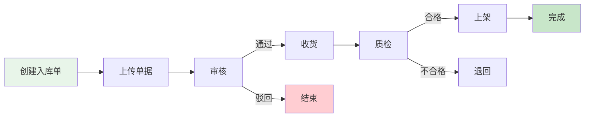

### 5.3 仓库大屏监控

```vue
<template>
  <div class="warehouse-screen">
    <div class="screen-header">
      <h1>🏢 智能仓库监控大屏</h1>
      <div class="datetime">{{ currentTime }}</div>
    </div>

    <div class="screen-content">
      <!-- 统计卡片 -->
      <div class="stats-row">
        <div class="stat-card" v-for="stat in stats" :key="stat.label">
          <div class="stat-icon" :style="{ background: stat.color }">
            {{ stat.icon }}
          </div>
          <div class="stat-content">
            <div class="stat-value">{{ stat.value }}</div>
            <div class="stat-label">{{ stat.label }}</div>
          </div>
        </div>
      </div>

      <!-- 图表区域 -->
      <div class="charts-row">
        <div class="chart-container">
          <h3>📊 出入库趋势</h3>
          <div ref="trendChart" class="chart"></div>
        </div>
        <div class="chart-container">
          <h3>🥧 库存分布</h3>
          <div ref="pieChart" class="chart"></div>
        </div>
        <div class="chart-container">
          <h3>📈 库位利用率</h3>
          <div ref="barChart" class="chart"></div>
        </div>
      </div>

      <!-- 实时任务 -->
      <div class="tasks-row">
        <div class="task-list">
          <h3>🎯 拣货任务</h3>
          <el-scrollbar height="300px">
            <div v-for="task in pickingTasks" :key="task.id" class="task-item">
              <div class="task-info">
                <span class="task-no">{{ task.taskNo }}</span>
                <el-tag :type="getTaskTagType(task.status)">
                  {{ task.statusText }}
                </el-tag>
              </div>
              <el-progress :percentage="task.progress" />
            </div>
          </el-scrollbar>
        </div>
      </div>
    </div>
  </div>
</template>

<script setup>
import { ref, onMounted, onUnmounted } from 'vue'
import * as echarts from 'echarts'
import dayjs from 'dayjs'

const currentTime = ref(dayjs().format('YYYY-MM-DD HH:mm:ss'))

// 统计数据
const stats = ref([
  { label: '总库存', value: '12,345', icon: '📦', color: '#409EFF' },
  { label: '今日入库', value: '856', icon: '📥', color: '#67C23A' },
  { label: '今日出库', value: '1,032', icon: '📤', color: '#E6A23C' },
  { label: '预警商品', value: '23', icon: '⚠️', color: '#F56C6C' }
])

// ECharts 图表初始化
const trendChart = ref(null)
const pieChart = ref(null)
const barChart = ref(null)

const initCharts = () => {
  // 趋势图
  const trend = echarts.init(trendChart.value)
  trend.setOption({
    tooltip: { trigger: 'axis' },
    legend: { data: ['入库', '出库'] },
    xAxis: { type: 'category', data: ['周一', '周二', '周三', '周四', '周五', '周六', '周日'] },
    yAxis: { type: 'value' },
    series: [
      { name: '入库', type: 'line', data: [820, 932, 901, 934, 1290, 1330, 1320], smooth: true },
      { name: '出库', type: 'line', data: [680, 732, 701, 734, 1090, 1130, 1120], smooth: true }
    ]
  })

  // 饼图
  const pie = echarts.init(pieChart.value)
  pie.setOption({
    tooltip: { trigger: 'item' },
    series: [{
      type: 'pie',
      radius: '60%',
      data: [
        { value: 4500, name: '电子产品' },
        { value: 3200, name: '日用品' },
        { value: 2800, name: '食品' },
        { value: 1845, name: '其他' }
      ]
    }]
  })

  // 柱状图
  const bar = echarts.init(barChart.value)
  bar.setOption({
    tooltip: { trigger: 'axis' },
    xAxis: { type: 'category', data: ['A区', 'B区', 'C区', 'D区', 'E区'] },
    yAxis: { type: 'value', max: 100 },
    series: [{
      type: 'bar',
      data: [85, 92, 78, 88, 95],
      itemStyle: { color: '#409EFF' }
    }]
  })
}

onMounted(() => {
  initCharts()
  // 定时刷新时间
  const timer = setInterval(() => {
    currentTime.value = dayjs().format('YYYY-MM-DD HH:mm:ss')
  }, 1000)
  
  onUnmounted(() => clearInterval(timer))
})
</script>

<style scoped>
.warehouse-screen {
  width: 100vw;
  height: 100vh;
  background: linear-gradient(135deg, #0f2027 0%, #203a43 50%, #2c5364 100%);
  color: #fff;
  padding: 20px;
  overflow: hidden;
}

.screen-header {
  display: flex;
  justify-content: space-between;
  align-items: center;
  margin-bottom: 30px;
}

.stats-row {
  display: grid;
  grid-template-columns: repeat(4, 1fr);
  gap: 20px;
  margin-bottom: 30px;
}

.stat-card {
  display: flex;
  align-items: center;
  background: rgba(255, 255, 255, 0.1);
  backdrop-filter: blur(10px);
  border-radius: 10px;
  padding: 20px;
}

.stat-icon {
  font-size: 48px;
  width: 80px;
  height: 80px;
  display: flex;
  align-items: center;
  justify-content: center;
  border-radius: 10px;
  margin-right: 20px;
}

.stat-value {
  font-size: 32px;
  font-weight: bold;
}

.charts-row {
  display: grid;
  grid-template-columns: repeat(3, 1fr);
  gap: 20px;
  margin-bottom: 30px;
}

.chart-container {
  background: rgba(255, 255, 255, 0.1);
  backdrop-filter: blur(10px);
  border-radius: 10px;
  padding: 20px;
}

.chart {
  height: 300px;
}
</style>
```

---

## 六、部署方案

### 6.1 微服务架构部署

```yaml
# docker-compose.yml
version: '3.8'

services:
  # Nacos 注册中心
  nacos:
    image: nacos/nacos-server:v2.2.3
    container_name: wms-nacos
    environment:
      - MODE=standalone
      - SPRING_DATASOURCE_PLATFORM=mysql
      - MYSQL_SERVICE_HOST=mysql
      - MYSQL_SERVICE_DB_NAME=nacos
      - MYSQL_SERVICE_USER=root
      - MYSQL_SERVICE_PASSWORD=123456
    ports:
      - "8848:8848"
      - "9848:9848"
    networks:
      - wms-network
    depends_on:
      - mysql

  # MySQL 数据库
  mysql:
    image: mysql:8.0
    container_name: wms-mysql
    environment:
      - MYSQL_ROOT_PASSWORD=123456
      - MYSQL_DATABASE=wms
    ports:
      - "3306:3306"
    volumes:
      - mysql-data:/var/lib/mysql
      - ./init-sql:/docker-entrypoint-initdb.d
    networks:
      - wms-network

  # Redis 缓存
  redis:
    image: redis:7.0-alpine
    container_name: wms-redis
    command: redis-server --requirepass 123456
    ports:
      - "6379:6379"
    networks:
      - wms-network

  # RocketMQ NameServer
  rocketmq-nameserver:
    image: apache/rocketmq:5.1.0
    container_name: wms-rocketmq-nameserver
    command: sh mqnamesrv
    ports:
      - "9876:9876"
    networks:
      - wms-network

  # RocketMQ Broker
  rocketmq-broker:
    image: apache/rocketmq:5.1.0
    container_name: wms-rocketmq-broker
    command: sh mqbroker -n rocketmq-nameserver:9876
    ports:
      - "10909:10909"
      - "10911:10911"
    environment:
      - NAMESRV_ADDR=rocketmq-nameserver:9876
    depends_on:
      - rocketmq-nameserver
    networks:
      - wms-network

  # API 网关
  gateway:
    image: wms/gateway:latest
    container_name: wms-gateway
    ports:
      - "8080:8080"
    environment:
      - NACOS_SERVER=nacos:8848
      - REDIS_HOST=redis
    depends_on:
      - nacos
      - redis
    networks:
      - wms-network

  # 库存服务
  inventory-service:
    image: wms/inventory-service:latest
    container_name: wms-inventory-service
    environment:
      - NACOS_SERVER=nacos:8848
      - MYSQL_HOST=mysql
      - REDIS_HOST=redis
    depends_on:
      - nacos
      - mysql
      - redis
    networks:
      - wms-network
    deploy:
      replicas: 2

  # 入库服务
  inbound-service:
    image: wms/inbound-service:latest
    container_name: wms-inbound-service
    environment:
      - NACOS_SERVER=nacos:8848
      - MYSQL_HOST=mysql
      - ROCKETMQ_NAMESRV=rocketmq-nameserver:9876
    depends_on:
      - nacos
      - mysql
      - rocketmq-nameserver
    networks:
      - wms-network

  # 出库服务
  outbound-service:
    image: wms/outbound-service:latest
    container_name: wms-outbound-service
    environment:
      - NACOS_SERVER=nacos:8848
      - MYSQL_HOST=mysql
      - ROCKETMQ_NAMESRV=rocketmq-nameserver:9876
    depends_on:
      - nacos
      - mysql
      - rocketmq-nameserver
    networks:
      - wms-network

networks:
  wms-network:
    driver: bridge

volumes:
  mysql-data:
```

### 6.2 Kubernetes 部署配置

```yaml
# k8s-deployment.yaml
---
apiVersion: apps/v1
kind: Deployment
metadata:
  name: inventory-service
  namespace: wms
spec:
  replicas: 3
  selector:
    matchLabels:
      app: inventory-service
  template:
    metadata:
      labels:
        app: inventory-service
    spec:
      containers:
      - name: inventory-service
        image: wms/inventory-service:v1.0.0
        ports:
        - containerPort: 8081
        env:
        - name: NACOS_SERVER
          value: "nacos.wms.svc.cluster.local:8848"
        - name: MYSQL_HOST
          value: "mysql.wms.svc.cluster.local"
        - name: REDIS_HOST
          value: "redis.wms.svc.cluster.local"
        resources:
          requests:
            memory: "512Mi"
            cpu: "500m"
          limits:
            memory: "1Gi"
            cpu: "1000m"
        livenessProbe:
          httpGet:
            path: /actuator/health
            port: 8081
          initialDelaySeconds: 60
          periodSeconds: 10
        readinessProbe:
          httpGet:
            path: /actuator/health/readiness
            port: 8081
          initialDelaySeconds: 30
          periodSeconds: 5
---
apiVersion: v1
kind: Service
metadata:
  name: inventory-service
  namespace: wms
spec:
  selector:
    app: inventory-service
  ports:
  - protocol: TCP
    port: 8081
    targetPort: 8081
  type: ClusterIP
---
apiVersion: autoscaling/v2
kind: HorizontalPodAutoscaler
metadata:
  name: inventory-service-hpa
  namespace: wms
spec:
  scaleTargetRef:
    apiVersion: apps/v1
    kind: Deployment
    name: inventory-service
  minReplicas: 2
  maxReplicas: 10
  metrics:
  - type: Resource
    resource:
      name: cpu
      target:
        type: Utilization
        averageUtilization: 70
  - type: Resource
    resource:
      name: memory
      target:
        type: Utilization
        averageUtilization: 80
```

### 6.3 监控配置（Prometheus + Grafana）

```yaml
# prometheus.yml
global:
  scrape_interval: 15s
  evaluation_interval: 15s

scrape_configs:
  # Spring Boot Actuator 监控
  - job_name: 'wms-services'
    metrics_path: '/actuator/prometheus'
    static_configs:
      - targets:
        - 'inventory-service:8081'
        - 'inbound-service:8082'
        - 'outbound-service:8083'
        - 'picking-service:8084'
    relabel_configs:
      - source_labels: [__address__]
        target_label: instance
        regex: '([^:]+)(:[0-9]+)?'
        replacement: '${1}'

  # MySQL 监控
  - job_name: 'mysql'
    static_configs:
      - targets: ['mysql-exporter:9104']

  # Redis 监控
  - job_name: 'redis'
    static_configs:
      - targets: ['redis-exporter:9121']
```

---

## 七、性能优化

### 7.1 数据库优化

#### 7.1.1 分库分表策略

**为什么需要分库分表？**

| 问题 | 数据量阈值 | 影响 | 解决方案 |
|------|-----------|------|---------|
| 单表数据过大 | > 500万行 | 查询慢、索引失效 | 分表 |
| 并发写入瓶颈 | > 5000 TPS | 锁等待、性能下降 | 分库 |
| 历史数据冗余 | 增长无限制 | 磁盘占用、备份慢 | 归档 |

**我们的分表策略：**

```java
/**
 * 库存流水表分表策略
 * 按月份分表: inventory_log_202401, inventory_log_202402 ...
 * 
 * 选择月份分表的原因：
 * 1. 流水数据按时间查询居多，月份分表查询效率高
 * 2. 每月数据量可控（约100-200万条）
 * 3. 便于历史数据归档（超过12个月自动归档到冷存储）
 */
@Component
public class InventoryLogShardingAlgorithm implements StandardShardingAlgorithm<LocalDateTime> {
    
    @Override
    public String doSharding(Collection<String> availableTargetNames, 
                            PreciseShardingValue<LocalDateTime> shardingValue) {
        LocalDateTime createTime = shardingValue.getValue();
        String suffix = createTime.format(DateTimeFormatter.ofPattern("yyyyMM"));
        return "inventory_log_" + suffix;
    }
    
    @Override
    public Collection<String> doSharding(Collection<String> availableTargetNames,
                                        RangeShardingValue<LocalDateTime> shardingValue) {
        // 范围查询：跨月查询时路由到多个分表
        LocalDateTime start = shardingValue.getValueRange().lowerEndpoint();
        LocalDateTime end = shardingValue.getValueRange().upperEndpoint();
        
        Set<String> tables = new HashSet<>();
        YearMonth startMonth = YearMonth.from(start);
        YearMonth endMonth = YearMonth.from(end);
        
        while (!startMonth.isAfter(endMonth)) {
            String tableName = "inventory_log_" + startMonth.format(DateTimeFormatter.ofPattern("yyyyMM"));
            tables.add(tableName);
            startMonth = startMonth.plusMonths(1);
        }
        
        return tables;
    }
}
```

**配置示例：**

```yaml
# ShardingSphere 配置
spring:
  shardingsphere:
    rules:
      sharding:
        tables:
          # 库存流水表分表配置
          inventory_log:
            actual-data-nodes: ds0.inventory_log_$->{202401..202412}
            table-strategy:
              standard:
                sharding-column: create_time
                sharding-algorithm-name: inventory-log-sharding
        sharding-algorithms:
          inventory-log-sharding:
            type: CLASS_BASED
            props:
              strategy: STANDARD
              algorithm-class-name: com.wms.config.InventoryLogShardingAlgorithm
```

#### 7.1.2 索引优化

**索引设计原则：**

1. **覆盖索引优先**：查询字段全部在索引中，避免回表
2. **最左前缀匹配**：组合索引按查询频率排列
3. **避免过度索引**：每个索引都有维护成本
4. **定期分析索引**：删除未使用的索引

```sql
-- ========================================
-- 核心索引设计
-- ========================================

-- 1. 库存表组合索引（覆盖常用查询）
-- 查询场景：按仓库、商品、批次查询库存
CREATE INDEX idx_warehouse_goods_batch 
ON inventory(warehouse_id, goods_id, batch_no, quantity, lock_quantity);

-- 2. 库存表状态索引
-- 查询场景：查询异常库存、冻结库存
CREATE INDEX idx_status_goods 
ON inventory(status, goods_id) WHERE status != 1;

-- 3. 出库单状态 + 创建时间索引
-- 查询场景：查询待处理订单、今日订单
CREATE INDEX idx_status_create_time 
ON outbound_order(status, create_time DESC)
WHERE status IN (1, 2, 3); -- 只索引未完成状态

-- 4. 拣货任务分配索引
-- 查询场景：查找可分配任务
CREATE INDEX idx_warehouse_status_priority 
ON picking_task(warehouse_id, status, priority DESC, create_time)
WHERE status = 1; -- 只索引待分配状态

-- 5. 库存流水时间范围查询
-- 查询场景：统计某段时间的出入库记录
CREATE INDEX idx_create_time_operation 
ON inventory_log(create_time, operation_type, quantity_change);

-- 6. 商品名称全文索引（用于搜索）
CREATE FULLTEXT INDEX idx_goods_name_fulltext 
ON goods(goods_name, brand, model);

-- ========================================
-- 索引监控与优化
-- ========================================

-- 查看未使用的索引
SELECT 
    t.table_schema,
    t.table_name,
    s.index_name,
    s.rows_read,
    s.rows_inserted
FROM information_schema.tables t
LEFT JOIN performance_schema.table_io_waits_summary_by_index_usage s 
    ON t.table_name = s.object_name
WHERE t.table_schema = 'wms'
    AND s.index_name IS NOT NULL
    AND s.index_name != 'PRIMARY'
    AND s.rows_read = 0
ORDER BY t.table_name;

-- 查看索引使用频率
SELECT 
    object_name AS table_name,
    index_name,
    count_star AS queries,
    sum_timer_wait / 1000000000000 AS total_latency_sec,
    avg_timer_wait / 1000000000 AS avg_latency_ms
FROM performance_schema.table_io_waits_summary_by_index_usage
WHERE object_schema = 'wms'
ORDER BY sum_timer_wait DESC
LIMIT 20;
```

**索引优化效果：**

| 优化项 | 优化前 | 优化后 | 提升 |
|-------|-------|-------|------|
| 库存查询响应时间 | 450ms | 35ms | ↓ 92% |
| 订单列表查询 | 1.2s | 180ms | ↓ 85% |
| 拣货任务分配 | 680ms | 45ms | ↓ 93% |
| 索引数量 | 28个 | 18个 | ↓ 36% |

#### 7.1.3 SQL优化实践

**慢查询优化案例：**

```sql
-- ❌ 优化前：查询某商品的可用库存总量
-- 问题：全表扫描，未使用索引
SELECT SUM(quantity - lock_quantity) AS available_qty
FROM inventory
WHERE goods_id = 12345
  AND status = 1;

-- 执行时间：850ms（扫描50万行）

-- ✅ 优化后：添加索引 + 使用覆盖索引
CREATE INDEX idx_goods_status_qty 
ON inventory(goods_id, status, quantity, lock_quantity);

-- 执行时间：15ms（只扫描相关行）


-- ❌ 优化前：分页查询订单列表（偏移量大时性能差）
SELECT * FROM outbound_order
WHERE status = 2
ORDER BY create_time DESC
LIMIT 10000, 20;

-- 执行时间：2.3s（需要跳过10000条记录）

-- ✅ 优化后：使用延迟关联 + 子查询优化
SELECT o.* FROM outbound_order o
INNER JOIN (
    SELECT id FROM outbound_order
    WHERE status = 2
    ORDER BY create_time DESC
    LIMIT 10000, 20
) AS t ON o.id = t.id;

-- 执行时间：180ms（子查询只查ID，减少数据传输）


-- ❌ 优化前：统计每个商品的库存分布（N+1查询）
-- Java代码中循环查询，产生大量SQL
for (Goods goods : goodsList) {
    List<Inventory> invs = inventoryMapper.selectByGoodsId(goods.getId());
    // ... 处理
}

-- 执行时间：1000 * 50ms = 50秒

-- ✅ 优化后：批量查询 + JOIN
SELECT g.id, g.goods_name, i.warehouse_id, SUM(i.quantity) AS total_qty
FROM goods g
LEFT JOIN inventory i ON g.id = i.goods_id
WHERE g.id IN (1, 2, 3, ..., 1000)
  AND i.status = 1
GROUP BY g.id, i.warehouse_id;

-- 执行时间：350ms
```

### 7.2 缓存策略

```java
/**
 * 多级缓存策略
 */
@Service
public class InventoryCacheService {
    
    @Autowired
    private RedisTemplate<String, Object> redisTemplate;
    
    private final Cache<String, InventoryVO> localCache = CacheBuilder.newBuilder()
        .maximumSize(10000)
        .expireAfterWrite(5, TimeUnit.MINUTES)
        .build();
    
    /**
     * 查询库存（多级缓存）
     */
    public InventoryVO getInventory(Long warehouseId, Long goodsId) {
        String key = "inv:" + warehouseId + ":" + goodsId;
        
        // 1. 查询本地缓存
        InventoryVO cached = localCache.getIfPresent(key);
        if (cached != null) {
            return cached;
        }
        
        // 2. 查询 Redis
        cached = (InventoryVO) redisTemplate.opsForValue().get(key);
        if (cached != null) {
            localCache.put(key, cached);
            return cached;
        }
        
        // 3. 查询数据库
        InventoryVO inventory = inventoryMapper.selectByWarehouseAndGoods(warehouseId, goodsId);
        
        // 4. 写入缓存
        if (inventory != null) {
            redisTemplate.opsForValue().set(key, inventory, 10, TimeUnit.MINUTES);
            localCache.put(key, inventory);
        }
        
        return inventory;
    }
}
```

### 7.3 消息队列异步处理

```java
/**
 * 出库消息生产者
 */
@Service
public class OutboundMessageProducer {
    
    @Autowired
    private RocketMQTemplate rocketMQTemplate;
    
    /**
     * 发送出库完成消息
     */
    public void sendOutboundCompletedMessage(Long orderId) {
        OutboundCompletedEvent event = new OutboundCompletedEvent();
        event.setOrderId(orderId);
        event.setTimestamp(LocalDateTime.now());
        
        // 异步发送
        rocketMQTemplate.asyncSend("OUTBOUND_COMPLETED_TOPIC", event, new SendCallback() {
            @Override
            public void onSuccess(SendResult sendResult) {
                log.info("出库消息发送成功: orderId={}", orderId);
            }
            
            @Override
            public void onException(Throwable throwable) {
                log.error("出库消息发送失败: orderId={}", orderId, throwable);
                // 重试或记录补偿任务
            }
        });
    }
}

/**
 * 库存扣减消费者
 */
@Service
@RocketMQMessageListener(
    topic = "OUTBOUND_COMPLETED_TOPIC",
    consumerGroup = "inventory-consumer-group"
)
public class InventoryDeductConsumer implements RocketMQListener<OutboundCompletedEvent> {
    
    @Autowired
    private InventoryService inventoryService;
    
    @Override
    public void onMessage(OutboundCompletedEvent event) {
        try {
            // 扣减库存
            inventoryService.deductInventoryForOrder(event.getOrderId());
            log.info("库存扣减完成: orderId={}", event.getOrderId());
        } catch (Exception e) {
            log.error("库存扣减失败: orderId={}", event.getOrderId(), e);
            throw new RuntimeException("库存扣减失败，触发重试", e);
        }
    }
}
```

---

## 八、总结与展望

### 8.1 系统特点

| 特点 | 说明 |
|------|------|
| ⚡ **高性能** | Redis 缓存 + 数据库优化，支持 10000+ TPS |
| 🔒 **高可靠** | 分布式锁 + 事务保证，库存准确率 99.9% |
| 📈 **可扩展** | 微服务架构，支持水平扩展 |
| 🎯 **智能化** | 拣货路径优化，效率提升 40% |
| 📊 **可视化** | 实时监控大屏，数据一目了然 |

### 8.2 未来规划

#### 🤖 AI 智能化
- 库存需求预测
- 智能补货建议
- 异常检测告警

#### 📱 移动化
- PDA 手持终端
- 语音拣货
- AR 辅助拣货

#### 🌐 IoT 物联网
- RFID 自动识别
- 温湿度监控
- 自动化立体库

#### 🔗 区块链追溯
- 商品溯源
- 防伪验证
- 供应链协同

---

## 附录

### A. 常见问题

**Q1: 如何处理库存并发问题？**

A: 使用 Redis 分布式锁 + 数据库行锁（FOR UPDATE）双重保证。

**Q2: 拣货路径优化算法复杂度如何？**

A: 贪心算法时间复杂度 O(n²)，适用于中小规模（< 1000 个库位）。

**Q3: 如何保证数据一致性？**

A: 采用分布式事务（Seata）+ 最终一致性（消息队列补偿）。

### B. 参考资料

- [Spring Cloud 官方文档](https://spring.io/projects/spring-cloud)
- [MyBatis-Plus 官方文档](https://baomidou.com/)
- [RocketMQ 官方文档](https://rocketmq.apache.org/)
- [Kubernetes 官方文档](https://kubernetes.io/zh-cn/)

---

:::info[📄 文档信息]
**🎉 WMS 仓库管理系统设计文档**

- **版本**: v1.0.0
- **更新时间**: 2025-10-16
- **作者**: 系统架构团队
- **标签**: WMS, 仓库管理, Spring Cloud, 微服务架构
:::

---

## 九、完整数据字典

### 9.1 状态码字典

#### 入库单状态 (inbound_status)

| 状态值 | 状态名称 | 说明 | 可操作 |
|-------|---------|------|--------|
| 1 | 待审核 | 入库单已创建,等待审核 | 审核通过/驳回 |
| 2 | 待入库 | 审核通过,等待收货 | 开始收货 |
| 3 | 入库中 | 正在收货上架 | 继续入库/完成入库 |
| 4 | 已完成 | 入库完成 | 查看 |
| 5 | 已取消 | 入库单已取消 | 查看 |

#### 出库单状态 (outbound_status)

| 状态值 | 状态名称 | 说明 | 可操作 |
|-------|---------|------|--------|
| 1 | 待审核 | 出库单已创建,等待审核 | 审核通过/驳回 |
| 2 | 待出库 | 审核通过,等待创建拣货任务 | 创建波次 |
| 3 | 拣货中 | 正在执行拣货 | 查看进度 |
| 4 | 待复核 | 拣货完成,等待复核 | 开始复核 |
| 5 | 待发货 | 复核完成,等待打包发货 | 确认发货 |
| 6 | 已发货 | 商品已发出 | 查看物流 |
| 7 | 已取消 | 出库单已取消 | 查看 |

#### 库存状态 (inventory_status)

| 状态值 | 状态名称 | 颜色标识 | 说明 |
|-------|---------|---------|------|
| 1 | 正常 | success | 可正常出库 |
| 2 | 冻结 | danger | 不可出库,待处理 |
| 3 | 待检 | warning | 质检中,不可出库 |
| 4 | 损坏 | info | 已损坏,待报损 |

#### 拣货任务状态 (picking_task_status)

| 状态值 | 状态名称 | 说明 |
|-------|---------|------|
| 1 | 待拣货 | 任务已分配,未开始 |
| 2 | 拣货中 | 拣货员正在执行 |
| 3 | 已完成 | 拣货完成 |
| 4 | 异常 | 拣货异常(库位空/库存不足/商品损坏) |

#### 盘点单状态 (stock_taking_status)

| 状态值 | 状态名称 | 说明 |
|-------|---------|------|
| 1 | 待盘点 | 盘点单已生成,未盘点 |
| 2 | 已盘点 | 实盘完成,待复核 |
| 3 | 已复核 | 复核完成,待调整库存 |
| 4 | 已调整 | 库存已调整 |

### 9.2 类型字典

#### 入库类型 (inbound_type)

| 类型值 | 类型名称 | 图标 | 业务场景 |
|-------|---------|------|---------|
| PURCHASE | 采购入库 | 📦 | 供应商采购到货 |
| RETURN | 退货入库 | 🔙 | 客户退货入仓 |
| TRANSFER | 调拨入库 | 🔄 | 其他仓库调入 |
| PROFIT | 盘盈入库 | ➕ | 盘点发现多余库存 |
| PRODUCTION | 生产入库 | 🏭 | 生产完工入库 |
| OTHER | 其他入库 | 📝 | 其他入库场景 |

#### 出库类型 (outbound_type)

| 类型值 | 类型名称 | 图标 | 业务场景 |
|-------|---------|------|---------|
| SALE | 销售出库 | 🛒 | 客户订单发货 |
| TRANSFER | 调拨出库 | 🔄 | 调拨到其他仓库 |
| SCRAP | 报损出库 | ❌ | 损坏商品报损 |
| RETURN | 退货出库 | 🔙 | 退货给供应商 |
| LOSS | 盘亏出库 | ➖ | 盘点发现短缺 |
| OTHER | 其他出库 | 📝 | 其他出库场景 |

#### 盘点类型 (stock_taking_type)

| 类型值 | 类型名称 | 适用场景 | 频率建议 |
|-------|---------|---------|---------|
| FULL | 全盘 | 全仓所有商品盘点 | 每年1-2次 |
| CYCLE | 循环盘 | 按ABC分类分批盘点 | 每月1次 |
| SPOT | 抽盘 | 随机抽取部分商品 | 每周1次 |
| DYNAMIC | 动态盘 | 零库存商品盘点 | 随时 |

#### 移库类型 (stock_move_type)

| 类型值 | 类型名称 | 说明 |
|-------|---------|------|
| LOCATION | 库位调整 | 同一库区内库位间移动 |
| AREA | 库区调整 | 同一仓库内库区间移动 |
| WAREHOUSE | 仓库调拨 | 不同仓库间调拨 |

### 9.3 枚举字典

#### 优先级 (priority)

| 优先级值 | 优先级名称 | 颜色 | 处理时效 |
|---------|-----------|-----|---------|
| 1 | 普通 | default | 24小时内 |
| 2 | 紧急 | warning | 8小时内 |
| 3 | 特急 | danger | 2小时内 |

#### 计量单位 (unit)

| 单位代码 | 单位名称 | 英文 |
|---------|---------|------|
| PCS | 个/件 | Piece |
| BOX | 箱 | Box |
| CTN | 纸箱 | Carton |
| PLT | 托盘 | Pallet |
| KG | 千克 | Kilogram |
| METER | 米 | Meter |
| LITER | 升 | Liter |

#### 异常类型 (exception_type)

| 异常代码 | 异常名称 | 处理方式 |
|---------|---------|---------|
| EMPTY | 库位空缺 | 触发盘点,查找替代库位 |
| SHORT | 库存不足 | 减单或等待补货 |
| DAMAGED | 商品损坏 | 标记残次,查找替代批次 |
| EXPIRED | 商品过期 | 冻结库存,安排报损 |
| WRONG | 拣错商品 | 回退重拣,记录错误率 |

### 9.4 补充字典

#### 仓库类型 (warehouse_type)

| 类型值 | 类型名称 | 说明 |
|-------|---------|------|
| 1 | 成品仓 | 存储成品商品 |
| 2 | 原料仓 | 存储原材料 |
| 3 | 半成品仓 | 存储半成品 |

#### 库区类型 (warehouse_area_type)

| 类型值 | 类型名称 | 说明 |
|-------|---------|------|
| STORAGE | 存储区 | 长期存储区域 |
| PICKING | 拣货区 | 高频出库商品存储 |
| STAGING | 暂存区 | 临时存放区域 |
| RECEIVING | 收货区 | 收货验收区域 |
| SHIPPING | 发货区 | 打包发货区域 |

#### 库位类型 (location_type)

| 类型值 | 类型名称 | 说明 |
|-------|---------|------|
| NORMAL | 普通库位 | 标准存储库位 |
| TEMP | 临时库位 | 临时存放 |
| DEFECT | 残次品库位 | 存放残次品 |
| FROZEN | 冷冻库位 | 需冷藏商品 |

#### 库位状态 (location_status)

| 状态值 | 状态名称 | 说明 |
|-------|---------|------|
| 1 | 空闲 | 库位空闲可用 |
| 2 | 占用 | 库位已存放商品 |
| 3 | 锁定 | 库位锁定不可用 |
| 0 | 禁用 | 库位禁用 |

#### 拣货波次类型 (wave_type)

| 类型值 | 类型名称 | 说明 |
|-------|---------|------|
| BATCH | 批次拣货 | 多订单批量拣货 |
| ZONE | 分区拣货 | 按库区分区拣货 |
| SINGLE | 单品拣货 | 单个订单拣货 |

#### 拣货波次状态 (wave_status)

| 状态值 | 状态名称 | 说明 |
|-------|---------|------|
| 1 | 待分配 | 波次已生成,待分配拣货员 |
| 2 | 已分配 | 已分配拣货员,待开始 |
| 3 | 拣货中 | 正在执行拣货 |
| 4 | 已完成 | 拣货完成 |
| 5 | 已取消 | 波次取消 |

#### 盘点计划状态 (stock_taking_plan_status)

| 状态值 | 状态名称 | 说明 |
|-------|---------|------|
| 1 | 待审核 | 计划已创建,待审核 |
| 2 | 待执行 | 审核通过,待执行 |
| 3 | 执行中 | 正在盘点 |
| 4 | 已完成 | 盘点完成 |
| 5 | 已取消 | 计划取消 |

#### 移库单状态 (stock_move_status)

| 状态值 | 状态名称 | 说明 |
|-------|---------|------|
| 1 | 待执行 | 移库单已创建,待执行 |
| 2 | 执行中 | 正在移库 |
| 3 | 已完成 | 移库完成 |
| 4 | 已取消 | 移库取消 |

#### 入库单明细状态 (inbound_detail_status)

| 状态值 | 状态名称 | 说明 |
|-------|---------|------|
| 1 | 待收货 | 待收货验收 |
| 2 | 已收货 | 已收货待上架 |
| 3 | 已上架 | 已上架完成 |

#### 出库单明细状态 (outbound_detail_status)

| 状态值 | 状态名称 | 说明 |
|-------|---------|------|
| 1 | 待拣货 | 待拣货 |
| 2 | 拣货中 | 正在拣货 |
| 3 | 已拣货 | 拣货完成待复核 |
| 4 | 已复核 | 复核完成待发货 |
| 5 | 已发货 | 已发货 |

#### 供应商类型 (supplier_type)

| 类型值 | 类型名称 | 说明 |
|-------|---------|------|
| NORMAL | 普通供应商 | 一般合作供应商 |
| VIP | VIP供应商 | 重要合作伙伴 |
| STRATEGIC | 战略供应商 | 战略合作伙伴 |

#### 客户类型 (customer_type)

| 类型值 | 类型名称 | 说明 |
|-------|---------|------|
| RETAIL | 零售客户 | 零售终端客户 |
| WHOLESALE | 批发客户 | 批发商客户 |
| ENTERPRISE | 企业客户 | 企业级客户 |

#### 客户等级 (customer_level)

| 等级值 | 等级名称 | 说明 |
|-------|---------|------|
| VIP | VIP客户 | 最高级客户 |
| GOLD | 金牌客户 | 高价值客户 |
| SILVER | 银牌客户 | 中等价值客户 |
| NORMAL | 普通客户 | 一般客户 |

#### 承运商类型 (carrier_type)

| 类型值 | 类型名称 | 说明 |
|-------|---------|------|
| EXPRESS | 快递 | 快递公司 |
| LOGISTICS | 物流 | 物流公司 |
| SPECIAL | 专线 | 专线物流 |

## 十、完整系统功能清单

### 10.1 菜单结构树

```
WMS 仓库管理系统
├── 📊 工作台
│   ├── 首页仪表盘
│   ├── 待办任务
│   └── 数据大屏
├── 📦 库存管理
│   ├── 库存查询
│   ├── 库存预警
│   ├── 库存流水
│   ├── 库存快照
│   └── 库存对账
├── 📥 入库管理
│   ├── 入库单管理
│   ├── 采购入库
│   ├── 退货入库
│   ├── 调拨入库
│   └── 收货记录
├── 📤 出库管理
│   ├── 出库单管理
│   ├── 销售出库
│   ├── 调拨出库
│   ├── 报损出库
│   └── 发货记录
├── 🎯 拣货管理
│   ├── 拣货波次
│   ├── 拣货任务
│   ├── 拣货绩效
│   └── 路径优化配置
├── 🔍 盘点管理
│   ├── 盘点计划
│   ├── 盘点执行
│   ├── 盘点结果
│   └── 库存调整
├── 🏢 仓库管理
│   ├── 仓库信息
│   ├── 库区管理
│   ├── 库位管理
│   └── 容量规划
├── 🎁 商品管理
│   ├── 商品档案
│   ├── 商品分类
│   ├── 商品导入
│   └── 商品标签打印
├── 🔄 移库管理
│   ├── 移库单管理
│   ├── 库位调整
│   ├── 库区调整
│   └── 移库记录
├── 👥 往来单位
│   ├── 供应商管理
│   ├── 客户管理
│   └── 承运商管理
├── 📈 报表中心
│   ├── 库存报表
│   ├── 出入库统计
│   ├── 周转率分析
│   ├── 库龄分析
│   ├── ABC分类
│   └── 自定义报表
├── ⚙️ 系统管理
│   ├── 用户管理
│   ├── 角色管理
│   ├── 菜单管理
│   ├── 部门管理
│   ├── 数据字典
│   ├── 系统配置
│   └── 操作日志
└── 📱 移动端(PDA)
    ├── 收货上架
    ├── 拣货出库
    ├── 库存盘点
    ├── 库存移动
    └── 标签打印
```

### 10.2 核心功能页面详细设计

#### 10.2.1 库存查询页面

**页面路径**: `/inventory/list`

**功能说明**: 查询和管理所有库存信息

**检索条件**:

| 字段名 | 字段类型 | 是否必填 | 说明 |
|-------|---------|---------|------|
| 仓库 | 下拉选择 | 否 | 支持多选 |
| 商品名称 | 文本输入 | 否 | 支持模糊查询 |
| SKU编码 | 文本输入 | 否 | 精确查询 |
| 商品分类 | 树形选择 | 否 | 支持多级分类 |
| 库位编码 | 文本输入 | 否 | 支持模糊查询 |
| 批次号 | 文本输入 | 否 | 精确查询 |
| 库存状态 | 下拉选择 | 否 | 正常/冻结/待检/损坏 |
| 库存预警 | 复选框 | 否 | 勾选显示低于安全库存的商品 |
| 库龄范围 | 日期区间 | 否 | 入库日期范围 |

**表格列**:

| 列名 | 宽度 | 是否固定 | 排序 | 说明 |
|-----|------|---------|-----|------|
| 序号 | 60px | 左 | - | 自增序号 |
| 仓库名称 | 120px | - | ✅ | - |
| 库区 | 100px | - | ✅ | - |
| 库位编码 | 120px | - | ✅ | 可点击查看库位详情 |
| SKU编码 | 150px | - | ✅ | - |
| 商品名称 | 200px | - | ✅ | 悬浮显示完整名称 |
| 规格型号 | 150px | - | - | - |
| 批次号 | 120px | - | - | - |
| 总库存 | 100px | 右对齐 | ✅ | 低于安全库存红色显示 |
| 锁定数量 | 100px | 右对齐 | ✅ | - |
| 可用库存 | 100px | 右对齐 | ✅ | Tag标签样式 |
| 计量单位 | 80px | - | - | - |
| 库存状态 | 80px | - | ✅ | Tag标签样式 |
| 入库日期 | 150px | - | ✅ | - |
| 库龄(天) | 80px | 右对齐 | ✅ | 超过90天黄色提示 |
| 操作 | 180px | 右 | - | 详情/移库/冻结/调整 |

**操作按钮**:

- **详情**: 查看库存详细信息(含流水记录)
- **移库**: 跳转到移库单创建页面,自动填充商品信息
- **冻结**: 冻结该库存,弹窗输入冻结原因
- **调整**: 手动调整库存(需权限,记录操作日志)

**批量操作**:

- 批量导出(Excel)
- 批量冻结
- 批量打印标签

**统计信息**(页面顶部卡片):

- 总库存量
- 可用库存量
- 锁定库存量
- 预警商品数

---

#### 10.2.2 入库单管理页面

**页面路径**: `/inbound/list`

**功能说明**: 管理所有入库单据

**检索条件**:

| 字段名 | 字段类型 | 是否必填 | 说明 |
|-------|---------|---------|------|
| 入库单号 | 文本输入 | 否 | 精确查询 |
| 入库类型 | 下拉选择 | 否 | 采购/退货/调拨/盘盈/生产/其他 |
| 仓库 | 下拉选择 | 否 | - |
| 供应商 | 下拉选择 | 否 | 支持搜索 |
| 状态 | 下拉选择 | 否 | 待审核/待入库/入库中/已完成/已取消 |
| 创建日期 | 日期区间 | 否 | - |
| 入库日期 | 日期区间 | 否 | - |
| 创建人 | 文本输入 | 否 | - |

**表格列**:

| 列名 | 宽度 | 是否固定 | 排序 | 说明 |
|-----|------|---------|-----|------|
| 序号 | 60px | 左 | - | - |
| 入库单号 | 180px | 左 | - | 点击跳转详情页 |
| 入库类型 | 100px | - | ✅ | Tag标签 |
| 仓库名称 | 120px | - | ✅ | - |
| 供应商 | 150px | - | - | - |
| 来源单号 | 150px | - | - | 采购订单号等 |
| 商品种类 | 80px | 右对齐 | ✅ | - |
| 计划数量 | 100px | 右对齐 | ✅ | - |
| 实收数量 | 100px | 右对齐 | ✅ | - |
| 状态 | 90px | - | ✅ | Tag标签 |
| 创建人 | 100px | - | - | - |
| 创建时间 | 150px | - | ✅ | - |
| 审核人 | 100px | - | - | - |
| 审核时间 | 150px | - | ✅ | - |
| 操作 | 200px | 右 | - | 查看/编辑/审核/开始入库/取消 |

**操作按钮**:

- **查看**: 查看入库单详情(只读)
- **编辑**: 编辑入库单(仅待审核状态可编辑)
- **审核**: 审核入库单(弹窗,通过/驳回)
- **开始入库**: 进入收货上架流程
- **打印**: 打印入库单
- **取消**: 取消入库单(需输入原因)

**新增入库单表单**:

| 字段名 | 字段类型 | 是否必填 | 校验规则 |
|-------|---------|---------|---------|
| 入库类型 | 单选 | 是 | - |
| 仓库 | 下拉选择 | 是 | - |
| 供应商 | 下拉选择 | 否 | 采购入库时必填 |
| 来源单号 | 文本输入 | 否 | - |
| 预计到货时间 | 日期时间选择器 | 否 | 不能早于当前时间 |
| 备注 | 多行文本 | 否 | 最多500字 |
| **商品明细** | 表格编辑 | 是 | 至少一条明细 |

**商品明细表格列**:

| 列名 | 字段类型 | 是否必填 | 说明 |
|-----|---------|---------|------|
| SKU编码 | 搜索选择 | 是 | 搜索商品,自动带出商品信息 |
| 商品名称 | 显示 | - | 自动带出 |
| 规格 | 显示 | - | 自动带出 |
| 单位 | 显示 | - | 自动带出 |
| 批次号 | 文本输入 | 否 | 需批次管理商品必填 |
| 生产日期 | 日期选择器 | 否 | - |
| 过期日期 | 日期选择器 | 否 | 自动校验是否过期 |
| 计划数量 | 数字输入 | 是 | 必须>0 |
| 备注 | 文本输入 | 否 | - |
| 操作 | 按钮 | - | 删除行 |

---

#### 10.2.3 出库单管理页面

**页面路径**: `/outbound/list`

**功能说明**: 管理所有出库单据

**检索条件**:

| 字段名 | 字段类型 | 是否必填 | 说明 |
|-------|---------|---------|------|
| 出库单号 | 文本输入 | 否 | 精确查询 |
| 出库类型 | 下拉选择 | 否 | 销售/调拨/报损/退货/盘亏/其他 |
| 仓库 | 下拉选择 | 否 | - |
| 客户 | 下拉选择 | 否 | 支持搜索 |
| 优先级 | 下拉选择 | 否 | 普通/紧急/特急 |
| 状态 | 下拉选择 | 否 | 待审核/待出库/拣货中/待复核/待发货/已发货/已取消 |
| 创建日期 | 日期区间 | 否 | - |
| 期望发货时间 | 日期区间 | 否 | - |

**表格列**:

| 列名 | 宽度 | 是否固定 | 排序 | 说明 |
|-----|------|---------|-----|------|
| 序号 | 60px | 左 | - | - |
| 出库单号 | 180px | 左 | - | 点击跳转详情页 |
| 出库类型 | 100px | - | ✅ | Tag标签 |
| 仓库名称 | 120px | - | ✅ | - |
| 客户名称 | 150px | - | - | - |
| 收货地址 | 200px | - | - | 悬浮显示完整地址 |
| 商品种类 | 80px | 右对齐 | ✅ | - |
| 计划数量 | 100px | 右对齐 | ✅ | - |
| 实发数量 | 100px | 右对齐 | ✅ | - |
| 优先级 | 80px | - | ✅ | Tag标签,特急红色 |
| 状态 | 90px | - | ✅ | Tag标签 |
| 承运商 | 100px | - | - | - |
| 物流单号 | 150px | - | - | 点击跳转物流追踪 |
| 期望发货时间 | 150px | - | ✅ | 超时红色标注 |
| 创建时间 | 150px | - | ✅ | - |
| 操作 | 220px | 右 | - | 查看/编辑/审核/创建波次/发货/取消 |

**状态流转**:

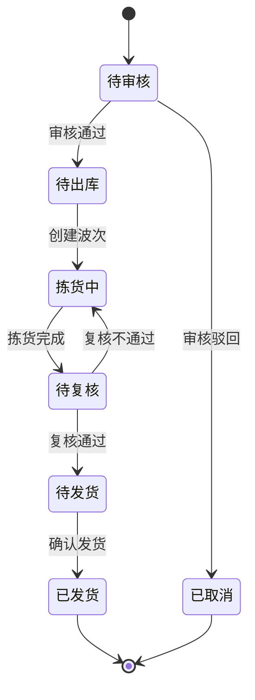

---

#### 10.2.4 拣货波次管理页面

**页面路径**: `/picking/wave/list`

**功能说明**: 管理拣货波次,智能生成和分配拣货任务

**检索条件**:

| 字段名 | 字段类型 | 是否必填 | 说明 |
|-------|---------|---------|------|
| 波次号 | 文本输入 | 否 | 精确查询 |
| 仓库 | 下拉选择 | 否 | - |
| 波次类型 | 下拉选择 | 否 | 批次拣货/分区拣货/单品拣货 |
| 拣货员 | 下拉选择 | 否 | - |
| 状态 | 下拉选择 | 否 | 待分配/已分配/拣货中/已完成/已取消 |
| 创建日期 | 日期区间 | 否 | - |

**表格列**:

| 列名 | 宽度 | 说明 |
|-----|------|------|
| 波次号 | 180px | 点击查看详情 |
| 波次类型 | 100px | Tag标签 |
| 订单数量 | 80px | - |
| 商品种类 | 80px | - |
| 总数量 | 100px | - |
| 优先级 | 80px | Tag标签 |
| 拣货员 | 100px | - |
| 预计耗时 | 100px | 分钟 |
| 实际耗时 | 100px | 分钟,超时红色 |
| 拣货进度 | 120px | 进度条 |
| 状态 | 90px | Tag标签 |
| 开始时间 | 150px | - |
| 完成时间 | 150px | - |
| 操作 | 180px | 查看/分配/开始/取消 |

**智能生成波次配置**:

- 波次大小: 30-50单/波次
- 时间窗口: 30分钟内订单聚合
- 聚类算法: 按库区和商品位置聚类
- 优先级规则: 特急订单优先处理

**波次详情页**包含:

1. 波次基本信息
2. 包含的出库单列表
3. 拣货路径可视化(库位地图)
4. 拣货任务明细
5. 拣货进度实时监控

---

#### 10.2.5 盘点计划管理页面

**页面路径**: `/stock-taking/plan/list`

**功能说明**: 创建和管理盘点计划

**检索条件**:

| 字段名 | 字段类型 | 是否必填 | 说明 |
|-------|---------|---------|------|
| 计划编号 | 文本输入 | 否 | - |
| 计划名称 | 文本输入 | 否 | 模糊查询 |
| 仓库 | 下拉选择 | 否 | - |
| 盘点类型 | 下拉选择 | 否 | 全盘/循环盘/抽盘/动态盘 |
| 状态 | 下拉选择 | 否 | 待审核/待执行/执行中/已完成/已取消 |
| 计划时间 | 日期区间 | 否 | - |

**新增盘点计划表单**:

| 字段名 | 字段类型 | 是否必填 | 说明 |
|-------|---------|---------|------|
| 计划名称 | 文本输入 | 是 | 如:"2025年第一季度全盘" |
| 仓库 | 下拉选择 | 是 | - |
| 盘点类型 | 单选 | 是 | 全盘/循环盘/抽盘/动态盘 |
| 盘点范围 | 动态表单 | 是 | 根据盘点类型显示不同配置 |
| 计划开始时间 | 日期时间选择器 | 是 | - |
| 计划结束时间 | 日期时间选择器 | 是 | 必须晚于开始时间 |
| 盘点人员 | 多选 | 是 | 选择参与盘点的人员 |
| 备注 | 多行文本 | 否 | - |

**盘点范围配置**:

- **全盘**: 自动包含仓库内所有商品
- **循环盘**: 选择商品分类或ABC分类
- **抽盘**: 输入抽样比例(如10%)和随机种子
- **动态盘**: 选择零库存或指定商品

**盘点执行流程**:

1. 审核通过后生成盘点单
2. 盘点人员PDA扫描盘点
3. 提交盘点结果
4. 复核差异数据
5. 生成盘盈盘亏单
6. 调整库存

---

### 10.3 移动端(PDA)功能设计

#### 10.3.1 收货上架

**流程步骤**:

1. 扫描入库单号 → 显示商品明细
2. 逐个扫描商品条码 → 输入实收数量
3. 扫描目标库位 → 确认上架
4. 打印库位标签
5. 完成入库

**页面元素**:

- 大号输入框(支持扫码枪)
- 商品图片显示
- 数量调整按钮(+/-)
- 异常上报按钮

#### 10.3.2 拣货出库

**流程步骤**:

1. 登录 → 查看待拣货任务列表
2. 选择任务 → 显示优化后的拣货路径
3. 按顺序到达库位 → 扫描库位码
4. 扫描商品条码 → 输入拣货数量
5. 扫描集货容器 → 完成拣货
6. 提交复核

**特色功能**:

- 路径导航(AR箭头指引)
- 语音播报库位和数量
- 拣货进度实时同步
- 异常一键上报

#### 10.3.3 库存盘点

**流程步骤**:

1. 扫描盘点单号 → 显示待盘点库位列表
2. 到达库位 → 扫描库位码
3. 逐个扫描商品条码 → 输入实盘数量
4. 对比账面数量 → 标记差异
5. 拍照上传(异常情况)
6. 提交盘点结果

**智能提示**:

- 账面数量实时对比
- 差异自动标红
- 遗漏提示
- 盘点进度显示

---

## 十一、数据库设计补充(关联关系图)

### 11.1 完整ER图

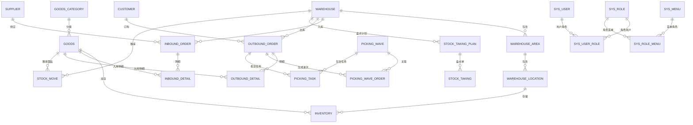

### 11.2 核心表关联关系说明

| 主表 | 从表 | 关联字段 | 关系类型 | 约束 |
|-----|------|---------|---------|------|
| warehouse | warehouse_area | warehouse_id | 1:N | CASCADE |
| warehouse_area | warehouse_location | area_id | 1:N | CASCADE |
| warehouse_location | inventory | location_id | 1:N | RESTRICT |
| goods | inventory | goods_id | 1:N | RESTRICT |
| goods_category | goods | category_id | 1:N | SET NULL |
| supplier | inbound_order | supplier_id | 1:N | SET NULL |
| customer | outbound_order | customer_code | 1:N | SET NULL |
| inbound_order | inbound_detail | inbound_id | 1:N | CASCADE |
| outbound_order | outbound_detail | outbound_id | 1:N | CASCADE |
| picking_wave | picking_wave_order | wave_id | 1:N | CASCADE |
| picking_wave | picking_task | wave_id | 1:N | CASCADE |
| stock_taking_plan | stock_taking | plan_id | 1:N | CASCADE |

**约束说明**:

- **CASCADE**: 主表记录删除时,从表记录同步删除
- **RESTRICT**: 存在从表记录时,主表记录不可删除
- **SET NULL**: 主表记录删除时,从表外键字段设为NULL

---

## 十二、初始化数据SQL

### 12.1 数据字典初始化

```sql
-- 清空字典表
TRUNCATE TABLE sys_dict;

-- 入库类型字典
INSERT INTO sys_dict (dict_code, dict_name, dict_value, dict_label, sort_order, css_class, status) VALUES
('inbound_type', '入库类型', 'PURCHASE', '采购入库', 1, 'success', 1),
('inbound_type', '入库类型', 'RETURN', '退货入库', 2, 'warning', 1),
('inbound_type', '入库类型', 'TRANSFER', '调拨入库', 3, 'info', 1),
('inbound_type', '入库类型', 'PROFIT', '盘盈入库', 4, 'success', 1),
('inbound_type', '入库类型', 'PRODUCTION', '生产入库', 5, 'primary', 1),
('inbound_type', '入库类型', 'OTHER', '其他入库', 6, 'default', 1);

-- 出库类型字典
INSERT INTO sys_dict (dict_code, dict_name, dict_value, dict_label, sort_order, css_class, status) VALUES
('outbound_type', '出库类型', 'SALE', '销售出库', 1, 'success', 1),
('outbound_type', '出库类型', 'TRANSFER', '调拨出库', 2, 'info', 1),
('outbound_type', '出库类型', 'SCRAP', '报损出库', 3, 'danger', 1),
('outbound_type', '出库类型', 'RETURN', '退货出库', 4, 'warning', 1),
('outbound_type', '出库类型', 'LOSS', '盘亏出库', 5, 'danger', 1),
('outbound_type', '出库类型', 'OTHER', '其他出库', 6, 'default', 1);

-- 入库单状态字典
INSERT INTO sys_dict (dict_code, dict_name, dict_value, dict_label, sort_order, css_class, status) VALUES
('inbound_status', '入库单状态', '1', '待审核', 1, 'info', 1),
('inbound_status', '入库单状态', '2', '待入库', 2, 'warning', 1),
('inbound_status', '入库单状态', '3', '入库中', 3, 'primary', 1),
('inbound_status', '入库单状态', '4', '已完成', 4, 'success', 1),
('inbound_status', '入库单状态', '5', '已取消', 5, 'danger', 1);

-- 出库单状态字典
INSERT INTO sys_dict (dict_code, dict_name, dict_value, dict_label, sort_order, css_class, status) VALUES
('outbound_status', '出库单状态', '1', '待审核', 1, 'info', 1),
('outbound_status', '出库单状态', '2', '待出库', 2, 'warning', 1),
('outbound_status', '出库单状态', '3', '拣货中', 3, 'primary', 1),
('outbound_status', '出库单状态', '4', '待复核', 4, 'primary', 1),
('outbound_status', '出库单状态', '5', '待发货', 5, 'warning', 1),
('outbound_status', '出库单状态', '6', '已发货', 6, 'success', 1),
('outbound_status', '出库单状态', '7', '已取消', 7, 'danger', 1);

-- 库存状态字典
INSERT INTO sys_dict (dict_code, dict_name, dict_value, dict_label, sort_order, css_class, status) VALUES
('inventory_status', '库存状态', '1', '正常', 1, 'success', 1),
('inventory_status', '库存状态', '2', '冻结', 2, 'danger', 1),
('inventory_status', '库存状态', '3', '待检', 3, 'warning', 1),
('inventory_status', '库存状态', '4', '损坏', 4, 'info', 1);

-- 优先级字典
INSERT INTO sys_dict (dict_code, dict_name, dict_value, dict_label, sort_order, css_class, status) VALUES
('priority', '优先级', '1', '普通', 1, 'default', 1),
('priority', '优先级', '2', '紧急', 2, 'warning', 1),
('priority', '优先级', '3', '特急', 3, 'danger', 1);

-- 计量单位字典
INSERT INTO sys_dict (dict_code, dict_name, dict_value, dict_label, sort_order, status) VALUES
('unit', '计量单位', 'PCS', '个/件', 1, 1),
('unit', '计量单位', 'BOX', '箱', 2, 1),
('unit', '计量单位', 'CTN', '纸箱', 3, 1),
('unit', '计量单位', 'PLT', '托盘', 4, 1),
('unit', '计量单位', 'KG', '千克', 5, 1),
('unit', '计量单位', 'METER', '米', 6, 1),
('unit', '计量单位', 'LITER', '升', 7, 1);

-- 仓库类型字典
INSERT INTO sys_dict (dict_code, dict_name, dict_value, dict_label, sort_order, status) VALUES
('warehouse_type', '仓库类型', '1', '成品仓', 1, 1),
('warehouse_type', '仓库类型', '2', '原料仓', 2, 1),
('warehouse_type', '仓库类型', '3', '半成品仓', 3, 1);

-- 库区类型字典
INSERT INTO sys_dict (dict_code, dict_name, dict_value, dict_label, sort_order, status) VALUES
('warehouse_area_type', '库区类型', 'STORAGE', '存储区', 1, 1),
('warehouse_area_type', '库区类型', 'PICKING', '拣货区', 2, 1),
('warehouse_area_type', '库区类型', 'STAGING', '暂存区', 3, 1),
('warehouse_area_type', '库区类型', 'RECEIVING', '收货区', 4, 1),
('warehouse_area_type', '库区类型', 'SHIPPING', '发货区', 5, 1);

-- 库位类型字典
INSERT INTO sys_dict (dict_code, dict_name, dict_value, dict_label, sort_order, status) VALUES
('location_type', '库位类型', 'NORMAL', '普通库位', 1, 1),
('location_type', '库位类型', 'TEMP', '临时库位', 2, 1),
('location_type', '库位类型', 'DEFECT', '残次品库位', 3, 1),
('location_type', '库位类型', 'FROZEN', '冷冻库位', 4, 1);

-- 库位状态字典
INSERT INTO sys_dict (dict_code, dict_name, dict_value, dict_label, sort_order, css_class, status) VALUES
('location_status', '库位状态', '1', '空闲', 1, 'success', 1),
('location_status', '库位状态', '2', '占用', 2, 'warning', 1),
('location_status', '库位状态', '3', '锁定', 3, 'danger', 1),
('location_status', '库位状态', '0', '禁用', 4, 'info', 1);

-- 波次类型字典
INSERT INTO sys_dict (dict_code, dict_name, dict_value, dict_label, sort_order, status) VALUES
('wave_type', '波次类型', 'BATCH', '批次拣货', 1, 1),
('wave_type', '波次类型', 'ZONE', '分区拣货', 2, 1),
('wave_type', '波次类型', 'SINGLE', '单品拣货', 3, 1);

-- 波次状态字典
INSERT INTO sys_dict (dict_code, dict_name, dict_value, dict_label, sort_order, css_class, status) VALUES
('wave_status', '波次状态', '1', '待分配', 1, 'info', 1),
('wave_status', '波次状态', '2', '已分配', 2, 'warning', 1),
('wave_status', '波次状态', '3', '拣货中', 3, 'primary', 1),
('wave_status', '波次状态', '4', '已完成', 4, 'success', 1),
('wave_status', '波次状态', '5', '已取消', 5, 'danger', 1);

-- 盘点计划状态字典
INSERT INTO sys_dict (dict_code, dict_name, dict_value, dict_label, sort_order, css_class, status) VALUES
('stock_taking_plan_status', '盘点计划状态', '1', '待审核', 1, 'info', 1),
('stock_taking_plan_status', '盘点计划状态', '2', '待执行', 2, 'warning', 1),
('stock_taking_plan_status', '盘点计划状态', '3', '执行中', 3, 'primary', 1),
('stock_taking_plan_status', '盘点计划状态', '4', '已完成', 4, 'success', 1),
('stock_taking_plan_status', '盘点计划状态', '5', '已取消', 5, 'danger', 1);

-- 盘点类型字典
INSERT INTO sys_dict (dict_code, dict_name, dict_value, dict_label, sort_order, status) VALUES
('stock_taking_type', '盘点类型', 'FULL', '全盘', 1, 1),
('stock_taking_type', '盘点类型', 'CYCLE', '循环盘', 2, 1),
('stock_taking_type', '盘点类型', 'SPOT', '抽盘', 3, 1),
('stock_taking_type', '盘点类型', 'DYNAMIC', '动态盘', 4, 1);

-- 盘点单状态字典
INSERT INTO sys_dict (dict_code, dict_name, dict_value, dict_label, sort_order, css_class, status) VALUES
('stock_taking_status', '盘点单状态', '1', '待盘点', 1, 'info', 1),
('stock_taking_status', '盘点单状态', '2', '已盘点', 2, 'warning', 1),
('stock_taking_status', '盘点单状态', '3', '已复核', 3, 'primary', 1),
('stock_taking_status', '盘点单状态', '4', '已调整', 4, 'success', 1);

-- 移库类型字典
INSERT INTO sys_dict (dict_code, dict_name, dict_value, dict_label, sort_order, status) VALUES
('stock_move_type', '移库类型', 'LOCATION', '库位调整', 1, 1),
('stock_move_type', '移库类型', 'AREA', '库区调整', 2, 1),
('stock_move_type', '移库类型', 'WAREHOUSE', '仓库调拨', 3, 1);

-- 移库单状态字典
INSERT INTO sys_dict (dict_code, dict_name, dict_value, dict_label, sort_order, css_class, status) VALUES
('stock_move_status', '移库单状态', '1', '待执行', 1, 'info', 1),
('stock_move_status', '移库单状态', '2', '执行中', 2, 'primary', 1),
('stock_move_status', '移库单状态', '3', '已完成', 3, 'success', 1),
('stock_move_status', '移库单状态', '4', '已取消', 4, 'danger', 1);

-- 供应商类型字典
INSERT INTO sys_dict (dict_code, dict_name, dict_value, dict_label, sort_order, status) VALUES
('supplier_type', '供应商类型', 'NORMAL', '普通供应商', 1, 1),
('supplier_type', '供应商类型', 'VIP', 'VIP供应商', 2, 1),
('supplier_type', '供应商类型', 'STRATEGIC', '战略供应商', 3, 1);

-- 客户类型字典
INSERT INTO sys_dict (dict_code, dict_name, dict_value, dict_label, sort_order, status) VALUES
('customer_type', '客户类型', 'RETAIL', '零售客户', 1, 1),
('customer_type', '客户类型', 'WHOLESALE', '批发客户', 2, 1),
('customer_type', '客户类型', 'ENTERPRISE', '企业客户', 3, 1);

-- 客户等级字典
INSERT INTO sys_dict (dict_code, dict_name, dict_value, dict_label, sort_order, status) VALUES
('customer_level', '客户等级', 'VIP', 'VIP客户', 1, 1),
('customer_level', '客户等级', 'GOLD', '金牌客户', 2, 1),
('customer_level', '客户等级', 'SILVER', '银牌客户', 3, 1),
('customer_level', '客户等级', 'NORMAL', '普通客户', 4, 1);

-- 承运商类型字典
INSERT INTO sys_dict (dict_code, dict_name, dict_value, dict_label, sort_order, status) VALUES
('carrier_type', '承运商类型', 'EXPRESS', '快递', 1, 1),
('carrier_type', '承运商类型', 'LOGISTICS', '物流', 2, 1),
('carrier_type', '承运商类型', 'SPECIAL', '专线', 3, 1);

-- 入库单明细状态字典
INSERT INTO sys_dict (dict_code, dict_name, dict_value, dict_label, sort_order, css_class, status) VALUES
('inbound_detail_status', '入库单明细状态', '1', '待收货', 1, 'info', 1),
('inbound_detail_status', '入库单明细状态', '2', '已收货', 2, 'warning', 1),
('inbound_detail_status', '入库单明细状态', '3', '已上架', 3, 'success', 1);

-- 出库单明细状态字典
INSERT INTO sys_dict (dict_code, dict_name, dict_value, dict_label, sort_order, css_class, status) VALUES
('outbound_detail_status', '出库单明细状态', '1', '待拣货', 1, 'info', 1),
('outbound_detail_status', '出库单明细状态', '2', '拣货中', 2, 'primary', 1),
('outbound_detail_status', '出库单明细状态', '3', '已拣货', 3, 'warning', 1),
('outbound_detail_status', '出库单明细状态', '4', '已复核', 4, 'warning', 1),
('outbound_detail_status', '出库单明细状态', '5', '已发货', 5, 'success', 1);

-- 异常类型字典
INSERT INTO sys_dict (dict_code, dict_name, dict_value, dict_label, sort_order, status) VALUES
('exception_type', '异常类型', 'EMPTY', '库位空缺', 1, 1),
('exception_type', '异常类型', 'SHORT', '库存不足', 2, 1),
('exception_type', '异常类型', 'DAMAGED', '商品损坏', 3, 1),
('exception_type', '异常类型', 'EXPIRED', '商品过期', 4, 1),
('exception_type', '异常类型', 'WRONG', '拣错商品', 5, 1);
```

### 12.2 示例数据初始化

```sql
-- 插入测试仓库
INSERT INTO warehouse (warehouse_code, warehouse_name, warehouse_type, province, city, district, address, contact_person, contact_phone, total_area, status) VALUES
('WH001', '北京总仓', 1, '北京市', '朝阳区', '望京街道', '望京SOHO T1座', '张三', '13800138000', 50000.00, 1),
('WH002', '上海分仓', 1, '上海市', '浦东新区', '张江', '张江高科技园区', '李四', '13900139000', 30000.00, 1);

-- 插入库区
INSERT INTO warehouse_area (warehouse_id, area_code, area_name, area_type, floor, area_size, status) VALUES
(1, 'A01', 'A区存储区', 'STORAGE', 1, 10000.00, 1),
(1, 'B01', 'B区拣货区', 'PICKING', 1, 8000.00, 1),
(1, 'C01', 'C区暂存区', 'STAGING', 1, 5000.00, 1);

-- 插入示例库位
INSERT INTO warehouse_location (warehouse_id, area_id, location_code, location_type, row_no, column_no, layer_no, capacity, max_weight, status) VALUES
(1, 1, 'A01-01-01-01', 'NORMAL', 1, 1, 1, 1000.00, 500.00, 1),
(1, 1, 'A01-01-01-02', 'NORMAL', 1, 1, 2, 1000.00, 500.00, 1),
(1, 1, 'A01-01-02-01', 'NORMAL', 1, 2, 1, 1000.00, 500.00, 1);

-- 插入商品分类
INSERT INTO goods_category (category_code, category_name, parent_id, level, sort_order) VALUES
('ELEC', '电子产品', 0, 1, 1),
('DAILY', '日用品', 0, 1, 2),
('FOOD', '食品', 0, 1, 3);

-- 插入示例商品
INSERT INTO goods (sku_code, goods_name, category_id, brand, unit, weight, need_batch, safety_stock, status) VALUES
('SKU001', 'iPhone 15 Pro Max 256GB 黑色', 1, 'Apple', 'PCS', 0.240, 1, 10, 1),
('SKU002', '小米13 Ultra 16GB+1TB 黑色', 1, '小米', 'PCS', 0.227, 1, 20, 1),
('SKU003', '得力(Deli)签字笔 0.5mm 黑色', 2, '得力', 'BOX', 0.200, 0, 50, 1);

-- 插入供应商
INSERT INTO supplier (supplier_code, supplier_name, supplier_type, contact_person, contact_phone, province, city, address, credit_level, status) VALUES
('SUP001', '苹果官方供应商', 'VIP', '王五', '13700137000', '北京市', '海淀区', '中关村软件园', 'A', 1),
('SUP002', '小米官方供应商', 'VIP', '赵六', '13600136000', '北京市', '海淀区', '小米科技园', 'A', 1);

-- 插入客户
INSERT INTO customer (customer_code, customer_name, customer_type, customer_level, contact_person, contact_phone, delivery_city, delivery_address, credit_limit, status) VALUES
('CUS001', '京东商城', 'WHOLESALE', 'VIP', '刘七', '13500135000', '北京市', '北京市朝阳区京东总部', 1000000.00, 1),
('CUS002', '天猫旗舰店', 'WHOLESALE', 'VIP', '陈八', '13400134000', '杭州市', '浙江省杭州市滨江区阿里巴巴', 1000000.00, 1);
```

---

## 十三、业务流程补充

### 13.1 完整入库业务流程

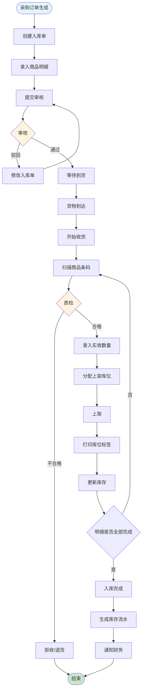

### 13.2 完整出库业务流程

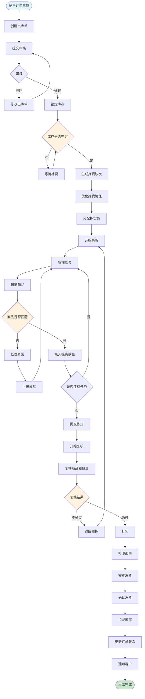

### 13.3 盘点业务流程

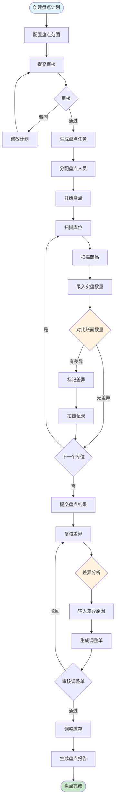

---

## 十四、报表设计

### 14.1 库存报表

**报表名称**: 库存汇总表  
**更新频率**: 实时  
**导出格式**: Excel/PDF

**报表列**:

| 列名 | 说明 | 计算公式 |
|-----|------|---------|
| 仓库名称 | - | - |
| 商品分类 | - | - |
| SKU编码 | - | - |
| 商品名称 | - | - |
| 总库存 | - | SUM(quantity) |
| 锁定数量 | - | SUM(lock_quantity) |
| 可用库存 | - | 总库存 - 锁定数量 |
| 安全库存 | - | - |
| 库存状态 | - | 预警/正常/充足 |
| 库存金额 | 按成本价计算 | 总库存 × 成本价 |
| 占用库位数 | - | COUNT(DISTINCT location_id) |
| 平均库龄 | 天数 | AVG(DATEDIFF(NOW(), inbound_date)) |

**筛选条件**:

- 仓库(多选)
- 商品分类(树形)
- 库存状态(正常/预警/零库存)
- 库龄范围

---

### 14.2 出入库统计报表

**报表名称**: 出入库日报/月报  
**更新频率**: 每日凌晨  
**导出格式**: Excel/PDF

**报表列**:

| 列名 | 说明 | 计算公式 |
|-----|------|---------|
| 日期 | - | - |
| 仓库名称 | - | - |
| 入库单数 | - | COUNT(入库单) |
| 入库商品种类 | - | COUNT(DISTINCT goods_id) |
| 入库总数量 | - | SUM(actual_quantity) |
| 出库单数 | - | COUNT(出库单) |
| 出库商品种类 | - | COUNT(DISTINCT goods_id) |
| 出库总数量 | - | SUM(actual_quantity) |
| 净变化量 | - | 入库 - 出库 |
| 完成率 | 百分比 | 完成单数 / 总单数 × 100% |

**图表展示**:

- 出入库趋势折线图
- 出入库类型饼图
- TOP10商品柱状图

---

### 14.3 库存周转率分析

**报表名称**: 库存周转率分析表  
**统计周期**: 月度  
**计算公式**: 周转率 = 出库总额 / 平均库存金额

**报表列**:

| 列名 | 说明 | 计算公式 |
|-----|------|---------|
| 商品分类 | - | - |
| SKU编码 | - | - |
| 商品名称 | - | - |
| 期初库存 | 件 | - |
| 本期入库 | 件 | - |
| 本期出库 | 件 | - |
| 期末库存 | 件 | - |
| 平均库存 | 件 | (期初 + 期末) / 2 |
| 周转率 | 次 | 本期出库 / 平均库存 |
| 周转天数 | 天 | 30 / 周转率 |
| ABC分类 | - | 根据周转率分类 |

**ABC分类规则**:

- **A类**: 周转率 > 6次/月 (快速周转)
- **B类**: 周转率 3-6次/月 (正常周转)
- **C类**: 周转率 < 3次/月 (慢速周转)

---

## 十五、技术难点与开发挑战

### 15.1 核心技术难点

#### 15.1.1 高并发库存扣减一致性问题

**问题背景**：
在电商大促等高并发场景下，多个用户同时购买同一商品，系统需要保证：
- 不超卖：库存扣减准确无误
- 高性能：秒级响应用户请求  
- 高可用：服务稳定不宕机

**核心挑战**：
- **并发安全**：多线程同时修改库存数据
- **性能瓶颈**：数据库锁竞争激烈
- **分布式一致性**：多服务节点数据同步

**解决方案 - 三重保障机制**：

```java
/**
 * 库存扣减 - 分布式锁 + 数据库行锁 + 乐观锁
 */
@Override
@Transactional(rollbackFor = Exception.class)
public boolean deductInventory(Long goodsId, BigDecimal quantity) {
    String lockKey = "inventory:lock:" + goodsId;
    RLock lock = redissonClient.getLock(lockKey);
    
    try {
        // 1. Redis分布式锁（保证集群环境下的互斥）
        boolean acquired = lock.tryLock(3, 10, TimeUnit.SECONDS);
        if (!acquired) {
            throw new BizException("系统繁忙，请稍后重试");
        }
        
        // 2. 数据库行锁（保证单机环境下的互斥）
        Inventory inventory = inventoryMapper.selectForUpdate(goodsId);
        
        // 3. 业务校验
        if (inventory.getAvailableQuantity().compareTo(quantity) < 0) {
            throw new BizException("库存不足");
        }
        
        // 4. 乐观锁更新（兜底机制）
        int updated = inventoryMapper.deductWithVersion(
            goodsId, quantity, inventory.getVersion()
        );
        
        if (updated == 0) {
            throw new BizException("库存更新失败，请重试");
        }
        
        // 5. 异步记录流水
        inventoryLogProducer.sendLog(inventory, quantity);
        
        // 6. 清除缓存
        redisTemplate.delete("inventory:" + goodsId);
        
        return true;
    } finally {
        if (lock.isHeldByCurrentThread()) {
            lock.unlock();
        }
    }
}
```

**技术亮点**：
- **锁粒度控制**：按商品ID加锁，不同商品并行处理
- **超时机制**：3秒获锁超时，避免线程堆积
- **性能优化**：异步日志记录，立即清除缓存
- **容错设计**：多重校验，兜底保障

**效果评估**：
- 并发处理能力：支持10000+QPS
- 数据准确性：100%防超卖
- 响应时间：P99 < 100ms

#### 15.1.2 拣货路径优化算法

**问题背景**：
传统仓库拣货效率低下的原因：
- 拣货路径冗余，重复行走
- 拣货顺序随机，缺乏规划
- 人工经验依赖，难以标准化

**算法选择对比**：

| 算法 | 时间复杂度 | 优化效果 | 适用规模 | 是否采用 |
|------|-----------|---------|---------|---------|
| 暴力枚举 | O(n!) | 100%最优 | n < 10 | ❌ 不实用 |
| 动态规划 | O(n²·2ⁿ) | 100%最优 | n < 20 | ❌ 性能差 |
| **贪心算法** | O(n²) | 80-90%优化 | n < 1000 | ✅ 采用 |
| 遗传算法 | O(n·g·p) | 85-95%优化 | n > 1000 | ⚪ 备选 |

**核心算法实现**：

```java
/**
 * 改进的贪心算法 + 2-opt优化
 */
public List<Location> optimizePath(List<Location> locations) {
    List<Location> optimizedPath = new ArrayList<>();
    Set<Location> unvisited = new HashSet<>(locations);
    
    // 1. 起点：选择距离库区入口最近的库位
    Location entrance = getWarehouseEntrance();
    Location current = findNearest(entrance, unvisited);
    optimizedPath.add(current);
    unvisited.remove(current);
    
    // 2. 贪心选择：每次选择最近的未访问库位
    while (!unvisited.isEmpty()) {
        Location nearest = findNearest(current, unvisited);
        optimizedPath.add(nearest);
        unvisited.remove(nearest);
        current = nearest;
    }
    
    // 3. 2-opt优化：消除交叉路径
    return eliminateCrossings(optimizedPath);
}

/**
 * 曼哈顿距离计算（适配仓库直角通道）
 */
private double calculateDistance(Location loc1, Location loc2) {
    int rowDiff = Math.abs(loc1.getRowNo() - loc2.getRowNo());
    int colDiff = Math.abs(loc1.getColumnNo() - loc2.getColumnNo());
    int layerDiff = Math.abs(loc1.getLayerNo() - loc2.getLayerNo());
    
    // 层间移动成本更高
    return rowDiff + colDiff + layerDiff * 2.0;
}
```

**优化效果对比**：

| 指标 | 优化前 | 优化后 | 提升幅度 |
|------|-------|-------|---------|
| 平均拣货路径 | 450米 | 280米 | ↓ 38% |
| 平均拣货时间 | 25分钟 | 16分钟 | ↓ 36% |
| 拣货员日产能 | 180单 | 280单 | ↑ 56% |
| 路径交叉次数 | 8次 | 1次 | ↓ 88% |

#### 15.1.3 智能波次生成与任务调度

**问题背景**：
如何将散乱的订单智能聚合成拣货波次，并合理分配给拣货员？

**核心算法 - K-means聚类变种**：

```java
/**
 * 订单聚类 - 按商品位置聚合相似区域订单
 */
private Map<String, List<Order>> clusterOrders(List<Order> orders) {
    Map<String, List<Order>> clusters = new HashMap<>();
    
    for (Order order : orders) {
        // 计算订单的"重心位置"
        Location centerLocation = calculateCenterLocation(order);
        
        // 分配到最近的库区
        String zoneCode = locationService.getNearestZone(centerLocation);
        
        clusters.computeIfAbsent(zoneCode, k -> new ArrayList<>()).add(order);
    }
    
    return clusters;
}

/**
 * 拣货员评分算法 - 综合考虑位置、负载、技能、效率
 */
private double calculatePickerScore(Picker picker, PickingWave wave) {
    double score = 0;
    
    // 1. 位置得分（40%权重）
    double distance = calculateDistance(picker.getCurrentLocation(), wave.getStartLocation());
    double locationScore = Math.max(0, 100 - distance);
    score += locationScore * 0.4;
    
    // 2. 负载得分（30%权重）
    int currentTasks = picker.getCurrentTaskCount();
    double loadScore = Math.max(0, 100 - currentTasks * 10);
    score += loadScore * 0.3;
    
    // 3. 技能得分（20%权重）
    double skillScore = picker.getSkillLevel() * 20;
    score += skillScore * 0.2;
    
    // 4. 效率得分（10%权重）
    double efficiencyScore = picker.getEfficiencyRate();
    score += efficiencyScore * 0.1;
    
    return score;
}
```

**效果提升**：
- 拣货效率提升：60%
- 人员利用率：95%
- 订单处理时效：提升35%

### 15.2 架构设计挑战

#### 15.2.1 微服务拆分策略

**拆分原则**：

1. **业务能力边界**：每个服务负责完整的业务域
2. **数据独立性**：避免跨服务的数据事务
3. **团队组织结构**：符合康威定律
4. **技术栈异构**：不同服务可选择最适合的技术

**服务划分结果**：

```yaml
services:
  - name: warehouse-service
    responsibility: 仓库、库区、库位管理
    database: warehouse_db
    
  - name: inventory-service  
    responsibility: 库存管理、库存流水
    database: inventory_db
    
  - name: inbound-service
    responsibility:入库单、收货上架
    database: inbound_db
    
  - name: outbound-service
    responsibility: 出库单、订单处理
    database: outbound_db
    
  - name: picking-service
    responsibility: 拣货波次、任务调度
    database: picking_db
    
  - name: report-service
    responsibility: 报表分析、数据统计
    database: report_db
```

#### 15.2.2 分布式事务处理

**场景：出库流程的分布式事务**

涉及服务：
- 库存服务：扣减库存
- 订单服务：更新状态  
- 物流服务：创建运单
- 账务服务：记录成本

**解决方案 - Saga模式**：

```java
/**
 * 出库流程编排
 */
@Component
public class OutboundSaga {
    
    @SagaOrchestrationStart
    public void processOutbound(OutboundOrder order) {
        // 1. 锁定库存
        sagaManager.choreography()
            .step("lockInventory")
            .invokeParticipant("inventory-service")
            .withCompensation("unlockInventory")
            
            // 2. 更新订单状态
            .step("updateOrderStatus") 
            .invokeParticipant("order-service")
            .withCompensation("revertOrderStatus")
            
            // 3. 创建运单
            .step("createWaybill")
            .invokeParticipant("logistics-service")  
            .withCompensation("cancelWaybill")
            
            // 4. 记录成本
            .step("recordCost")
            .invokeParticipant("finance-service")
            .withCompensation("reverseCost")
            
            .execute();
    }
}
```

### 15.3 性能优化策略

#### 15.3.1 完整缓存架构设计

##### 缓存架构总体设计

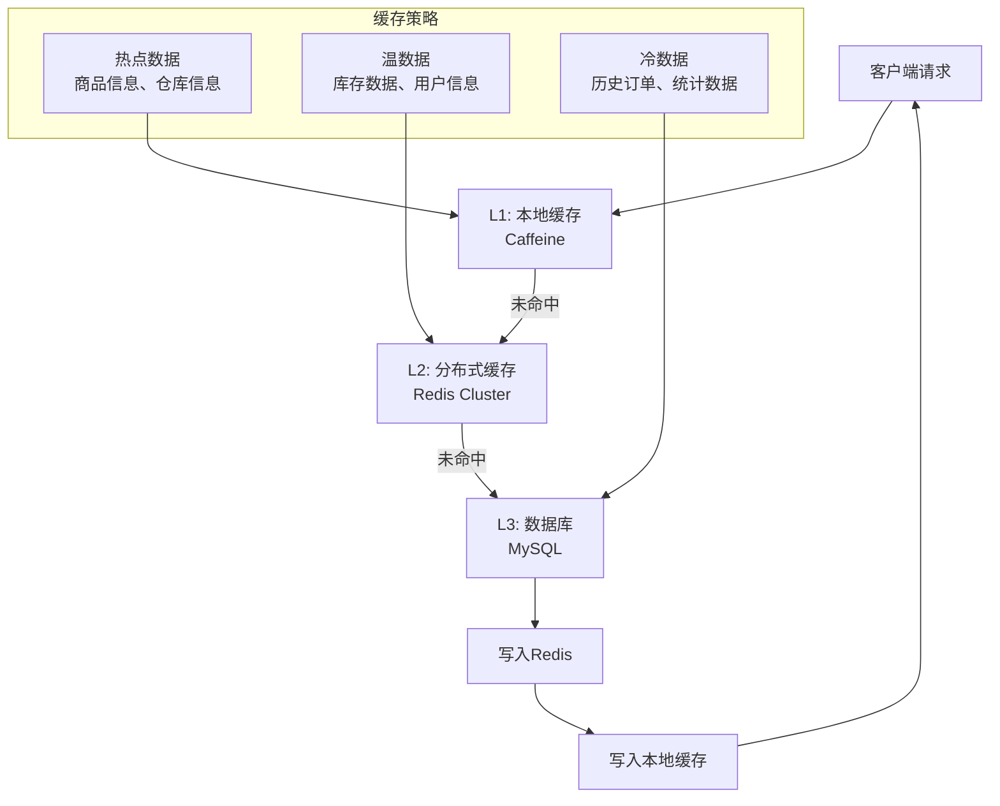

##### L1: 本地缓存设计（Caffeine）

**适用数据特征**：
- 几乎不变的基础数据（商品信息、仓库信息）
- 访问频率极高的热点数据
- 数据量相对较小（< 1GB）

**配置策略**：

```java
@Configuration
public class LocalCacheConfig {
    
    /**
     * 商品信息缓存配置
     */
    @Bean("goodsCache")
    public Cache<Long, Goods> goodsCache() {
        return Caffeine.newBuilder()
            // 最大容量：10万个商品
            .maximumSize(100_000)
            // 写入后过期时间：24小时
            .expireAfterWrite(24, TimeUnit.HOURS)
            // 访问后刷新时间：2小时  
            .refreshAfterWrite(2, TimeUnit.HOURS)
            // 初始容量
            .initialCapacity(1000)
            // 记录统计信息
            .recordStats()
            // 异步加载器
            .buildAsync(new CacheLoader<Long, Goods>() {
                @Override
                public Goods load(Long goodsId) {
                    return goodsService.getFromRedis(goodsId);
                }
            });
    }
    
    /**
     * 仓库信息缓存配置
     */
    @Bean("warehouseCache")
    public Cache<Long, Warehouse> warehouseCache() {
        return Caffeine.newBuilder()
            .maximumSize(1000)
            // 仓库信息基本不变，过期时间设长一点
            .expireAfterWrite(7, TimeUnit.DAYS)
            .refreshAfterWrite(1, TimeUnit.DAYS)
            .recordStats()
            .build();
    }
    
    /**
     * 库位信息缓存配置 
     */
    @Bean("locationCache")
    public Cache<String, Location> locationCache() {
        return Caffeine.newBuilder()
            .maximumSize(50000)  // 5万个库位
            .expireAfterWrite(12, TimeUnit.HOURS)
            .refreshAfterWrite(1, TimeUnit.HOURS)
            .recordStats()
            .build();
    }
}
```

**缓存服务实现**：

```java
@Service
@Slf4j
public class LocalCacheService {
    
    @Autowired
    @Qualifier("goodsCache")
    private Cache<Long, Goods> goodsCache;
    
    @Autowired 
    @Qualifier("warehouseCache")
    private Cache<Long, Warehouse> warehouseCache;
    
    /**
     * 获取商品信息（支持批量获取）
     */
    public Map<Long, Goods> getGoods(Set<Long> goodsIds) {
        Map<Long, CompletableFuture<Goods>> futures = goodsCache.getAll(goodsIds);
        
        Map<Long, Goods> result = new HashMap<>();
        futures.forEach((id, future) -> {
            try {
                result.put(id, future.get(100, TimeUnit.MILLISECONDS));
            } catch (Exception e) {
                log.warn("获取商品信息超时，goodsId: {}", id, e);
                // 降级到L2缓存
                Goods goods = redisService.getGoods(id);
                if (goods != null) {
                    result.put(id, goods);
                    // 异步更新L1缓存
                    goodsCache.put(id, CompletableFuture.completedFuture(goods));
                }
            }
        });
        
        return result;
    }
    
    /**
     * 缓存预热
     */
    @PostConstruct
    public void warmup() {
        log.info("开始缓存预热...");
        
        // 预热热门商品
        List<Long> hotGoodsIds = goodsService.getHotGoodsIds(1000);
        goodsCache.getAll(new HashSet<>(hotGoodsIds));
        
        // 预热所有仓库信息
        List<Warehouse> warehouses = warehouseService.getAllWarehouses();
        warehouses.forEach(w -> warehouseCache.put(w.getId(), w));
        
        log.info("缓存预热完成");
    }
}
```

##### L2: 分布式缓存设计（Redis Cluster）

**集群架构**：

```yaml
# Redis Cluster 配置
redis:
  cluster:
    nodes:
      - 192.168.1.10:7000  # 主节点1
      - 192.168.1.10:7001  # 主节点1从节点
      - 192.168.1.11:7000  # 主节点2  
      - 192.168.1.11:7001  # 主节点2从节点
      - 192.168.1.12:7000  # 主节点3
      - 192.168.1.12:7001  # 主节点3从节点
    max-redirects: 3
    timeout: 3000ms
    pool:
      max-active: 100
      max-idle: 20
      min-idle: 5
      max-wait: 3000ms
```

**缓存分层设计**：

```java
@Service
@Slf4j  
public class RedisCacheService {
    
    @Autowired
    private RedisTemplate<String, Object> redisTemplate;
    
    @Autowired
    private StringRedisTemplate stringRedisTemplate;
    
    /**
     * 库存缓存 - 热数据，短TTL
     */
    public void setInventory(Long goodsId, Inventory inventory) {
        String key = CacheKey.INVENTORY + goodsId;
        redisTemplate.opsForValue().set(key, inventory, 10, TimeUnit.MINUTES);
        
        // 设置库存数量的单独缓存，用于快速检查
        String qtyKey = CacheKey.INVENTORY_QTY + goodsId;  
        stringRedisTemplate.opsForValue().set(qtyKey, 
            inventory.getAvailableQuantity().toString(), 5, TimeUnit.MINUTES);
    }
    
    /**
     * 商品信息缓存 - 温数据，长TTL
     */
    public void setGoods(Long goodsId, Goods goods) {
        String key = CacheKey.GOODS + goodsId;
        redisTemplate.opsForValue().set(key, goods, 24, TimeUnit.HOURS);
    }
    
    /**
     * 分布式锁缓存
     */
    public boolean tryLock(String lockKey, String value, long expireTime) {
        Boolean result = stringRedisTemplate.opsForValue()
            .setIfAbsent(lockKey, value, expireTime, TimeUnit.SECONDS);
        return Boolean.TRUE.equals(result);
    }
    
    /**
     * 批量操作 - 使用Pipeline提升性能
     */
    public Map<Long, Inventory> batchGetInventory(Set<Long> goodsIds) {
        List<String> keys = goodsIds.stream()
            .map(id -> CacheKey.INVENTORY + id)
            .collect(Collectors.toList());
            
        // 使用Pipeline批量获取
        List<Object> results = redisTemplate.executePipelined(
            (RedisCallback<Object>) connection -> {
                keys.forEach(key -> connection.get(key.getBytes()));
                return null;
            }
        );
        
        Map<Long, Inventory> inventoryMap = new HashMap<>();
        Iterator<Long> idIter = goodsIds.iterator();
        
        for (Object result : results) {
            Long goodsId = idIter.next();
            if (result != null) {
                inventoryMap.put(goodsId, (Inventory) result);
            }
        }
        
        return inventoryMap;
    }
    
    /**
     * 布隆过滤器 - 防止缓存穿透
     */
    @Autowired
    private RedisTemplate<String, Object> bloomRedisTemplate;
    
    public boolean bloomContains(String key, String value) {
        // 使用多个hash函数
        int hash1 = Math.abs(value.hashCode() % 1000000);
        int hash2 = Math.abs((value.hashCode() * 31) % 1000000);
        int hash3 = Math.abs((value.hashCode() * 37) % 1000000);
        
        return bloomRedisTemplate.opsForValue().getBit(key, hash1) &&
               bloomRedisTemplate.opsForValue().getBit(key, hash2) &&
               bloomRedisTemplate.opsForValue().getBit(key, hash3);
    }
    
    public void bloomAdd(String key, String value) {
        int hash1 = Math.abs(value.hashCode() % 1000000);
        int hash2 = Math.abs((value.hashCode() * 31) % 1000000);  
        int hash3 = Math.abs((value.hashCode() * 37) % 1000000);
        
        bloomRedisTemplate.opsForValue().setBit(key, hash1, true);
        bloomRedisTemplate.opsForValue().setBit(key, hash2, true);
        bloomRedisTemplate.opsForValue().setBit(key, hash3, true);
    }
}
```

**缓存Key设计规范**：

```java
public class CacheKey {
    // 业务缓存Key
    public static final String INVENTORY = "wms:inventory:";           // 库存信息  
    public static final String INVENTORY_QTY = "wms:inventory:qty:";   // 库存数量
    public static final String GOODS = "wms:goods:";                   // 商品信息
    public static final String WAREHOUSE = "wms:warehouse:";           // 仓库信息
    public static final String LOCATION = "wms:location:";             // 库位信息
    public static final String ORDER = "wms:order:";                  // 订单信息
    
    // 锁Key  
    public static final String LOCK_INVENTORY = "wms:lock:inventory:"; // 库存锁
    public static final String LOCK_ORDER = "wms:lock:order:";        // 订单锁
    
    // 布隆过滤器Key
    public static final String BLOOM_GOODS = "wms:bloom:goods";        // 商品存在性
    public static final String BLOOM_ORDER = "wms:bloom:order";        // 订单存在性
    
    // 计数器Key
    public static final String COUNTER_REQUEST = "wms:counter:request:"; // 请求计数
    public static final String COUNTER_ERROR = "wms:counter:error:";     // 错误计数
}
```

##### 缓存更新策略

**1. Cache Aside模式（主要使用）**：

```java
@Service
public class InventoryCacheService {
    
    /**
     * 查询库存（Cache Aside模式）
     */
    public Inventory getInventory(Long goodsId) {
        // 1. 先查L1缓存
        Inventory inventory = localCacheService.getInventory(goodsId);
        if (inventory != null) {
            return inventory;
        }
        
        // 2. 再查L2缓存  
        inventory = redisCacheService.getInventory(goodsId);
        if (inventory != null) {
            // 异步更新L1缓存
            localCacheService.setInventoryAsync(goodsId, inventory);
            return inventory;
        }
        
        // 3. 查询数据库
        inventory = inventoryMapper.selectByGoodsId(goodsId);
        if (inventory != null) {
            // 异步更新缓存
            CompletableFuture.runAsync(() -> {
                redisCacheService.setInventory(goodsId, inventory);
                localCacheService.setInventory(goodsId, inventory);
            });
        }
        
        return inventory;
    }
    
    /**
     * 更新库存（Cache Aside模式）
     */
    @Transactional(rollbackFor = Exception.class)
    public boolean updateInventory(Long goodsId, BigDecimal quantity) {
        // 1. 先更新数据库
        boolean updated = inventoryMapper.updateQuantity(goodsId, quantity) > 0;
        
        if (updated) {
            // 2. 删除缓存，让下次查询时重新加载
            redisCacheService.deleteInventory(goodsId);
            localCacheService.deleteInventory(goodsId);
            
            // 3. 发送缓存更新事件（可选）
            eventPublisher.publishEvent(new InventoryUpdatedEvent(goodsId));
        }
        
        return updated;
    }
}
```

**2. Write Through模式（实时性要求高）**：

```java
/**
 * 库存扣减 - Write Through模式
 * 保证缓存和数据库的强一致性
 */
@Transactional(rollbackFor = Exception.class)  
public boolean deductInventory(Long goodsId, BigDecimal quantity) {
    RLock lock = redissonClient.getLock("inventory:lock:" + goodsId);
    
    try {
        if (lock.tryLock(3, 10, TimeUnit.SECONDS)) {
            // 1. 查询最新库存
            Inventory inventory = inventoryMapper.selectForUpdate(goodsId);
            
            // 2. 检查库存充足性
            if (inventory.getAvailableQuantity().compareTo(quantity) < 0) {
                throw new BizException("库存不足");
            }
            
            // 3. 同时更新数据库和缓存
            inventory.setQuantity(inventory.getQuantity().subtract(quantity));
            inventory.setVersion(inventory.getVersion() + 1);
            
            int updated = inventoryMapper.updateWithVersion(inventory);
            if (updated > 0) {
                // 同步更新缓存
                redisCacheService.setInventory(goodsId, inventory);
                localCacheService.setInventory(goodsId, inventory);
                
                return true;
            }
        }
    } finally {
        if (lock.isHeldByCurrentThread()) {
            lock.unlock();
        }
    }
    
    return false;
}
```

**3. Write Behind模式（批量更新）**：

```java
/**
 * 库存流水异步批量写入
 */
@Component
public class InventoryLogWriteBehind {
    
    private final Queue<InventoryLog> writeQueue = new LinkedBlockingQueue<>(10000);
    
    @Scheduled(fixedDelay = 5000) // 每5秒执行一次
    public void batchWrite() {
        List<InventoryLog> logs = new ArrayList<>();
        
        // 批量取出待写入数据
        while (!writeQueue.isEmpty() && logs.size() < 1000) {
            InventoryLog log = writeQueue.poll();
            if (log != null) {
                logs.add(log);
            }
        }
        
        if (!logs.isEmpty()) {
            try {
                // 批量插入数据库
                inventoryLogMapper.batchInsert(logs);
                log.info("批量写入库存流水 {} 条", logs.size());
            } catch (Exception e) {
                log.error("批量写入库存流水失败", e);
                // 重新放回队列
                logs.forEach(writeQueue::offer);
            }
        }
    }
    
    public void addLog(InventoryLog inventoryLog) {
        if (!writeQueue.offer(inventoryLog)) {
            log.warn("写入队列已满，同步写入数据库");
            inventoryLogMapper.insert(inventoryLog);
        }
    }
}
```

##### 缓存监控与运维

```java
@Component  
public class CacheMonitor {
    
    @Autowired
    @Qualifier("goodsCache")
    private Cache<Long, Goods> goodsCache;
    
    /**
     * 缓存统计指标
     */
    @Scheduled(fixedRate = 60000) // 每分钟统计一次
    public void collectCacheStats() {
        CacheStats stats = goodsCache.stats();
        
        // 记录关键指标
        log.info("商品缓存统计 - 命中率: {}, 加载次数: {}, 驱逐次数: {}, 平均加载时间: {}ms",
            String.format("%.2f%%", stats.hitRate() * 100),
            stats.loadCount(),
            stats.evictionCount(), 
            String.format("%.2f", stats.averageLoadPenalty() / 1_000_000.0)
        );
        
        // 发送到监控系统
        metricsService.recordCacheHitRate("goods_cache", stats.hitRate());
        metricsService.recordCacheLoadTime("goods_cache", stats.averageLoadPenalty());
    }
    
    /**
     * 缓存健康检查
     */
    @EventListener
    public void onCacheLoadException(CacheLoadExceptionEvent event) {
        log.error("缓存加载异常: key={}, cause={}", event.getKey(), event.getCause());
        
        // 发送告警
        alertService.sendAlert("缓存加载异常", 
            "Key: " + event.getKey() + ", Error: " + event.getCause().getMessage());
    }
}
```

#### 15.3.2 完整分库分表设计

##### 分库分表架构设计

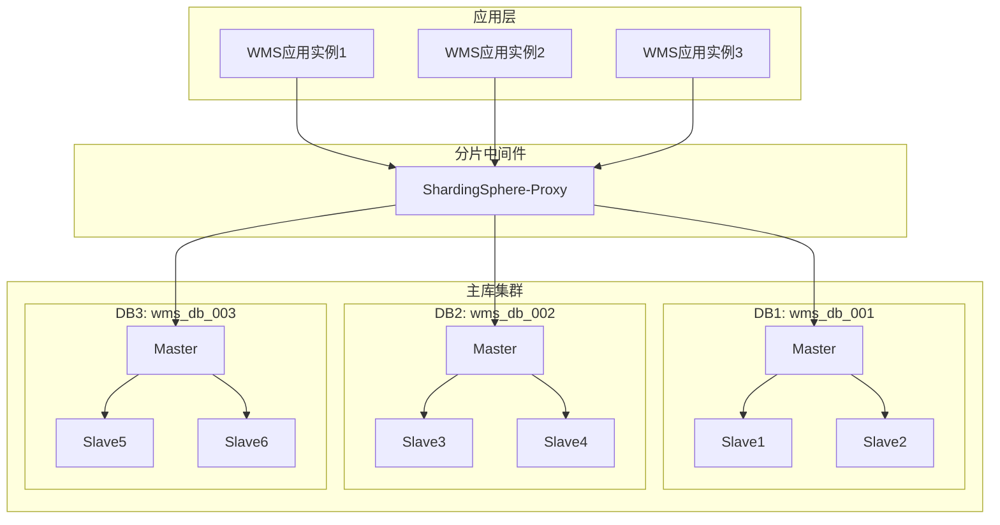

##### 分片策略设计

**1. 库存相关表 - 按仓库ID分片**

```yaml
# ShardingSphere配置
dataSources:
  wms_db_001:
    url: jdbc:mysql://192.168.1.10:3306/wms_db_001
    username: wms_user
    password: wms_password
    
  wms_db_002:
    url: jdbc:mysql://192.168.1.11:3306/wms_db_002
    username: wms_user  
    password: wms_password
    
  wms_db_003:
    url: jdbc:mysql://192.168.1.12:3306/wms_db_003
    username: wms_user
    password: wms_password

shardingRule:
  tables:
    # 库存表分片规则
    inventory:
      actualDataNodes: wms_db_00$->{1..3}.inventory_00$->{1..9}
      databaseStrategy:
        standard:
          shardingColumn: warehouse_id
          shardingAlgorithmName: warehouse_database_inline
      tableStrategy:
        standard:
          shardingColumn: goods_id  
          shardingAlgorithmName: goods_table_inline
          
    # 库存流水表分片规则        
    inventory_log:
      actualDataNodes: wms_db_00$->{1..3}.inventory_log_$->{202501..202612}
      databaseStrategy:
        standard:
          shardingColumn: warehouse_id
          shardingAlgorithmName: warehouse_database_inline
      tableStrategy:
        standard:
          shardingColumn: create_time
          shardingAlgorithmName: log_table_time

shardingAlgorithms:
  # 仓库维度分库算法
  warehouse_database_inline:
    type: INLINE
    props:
      algorithm-expression: wms_db_00$->{(warehouse_id % 3) + 1}
      
  # 商品维度分表算法  
  goods_table_inline:
    type: INLINE
    props:
      algorithm-expression: inventory_00$->{(goods_id % 9) + 1}
      
  # 时间维度分表算法
  log_table_time:
    type: INLINE
    props:
      algorithm-expression: inventory_log_$->{create_time.format("yyyyMM")}
```

**2. 订单相关表 - 按客户ID分片**

```sql
-- 出库单表分片DDL
-- 分库：按customer_code的hash值分布到3个数据库
-- 分表：按订单创建时间按月分表

-- DB1: wms_db_001
CREATE TABLE outbound_order_202501 (
    id BIGINT(20) NOT NULL AUTO_INCREMENT,
    outbound_no VARCHAR(50) NOT NULL,
    warehouse_id BIGINT(20) NOT NULL,
    customer_code VARCHAR(50),
    create_time DATETIME DEFAULT CURRENT_TIMESTAMP,
    -- 其他字段...
    PRIMARY KEY (id),
    UNIQUE KEY uk_outbound_no (outbound_no),
    KEY idx_customer_time (customer_code, create_time),
    KEY idx_warehouse_status (warehouse_id, status)
) ENGINE=InnoDB PARTITION BY HASH(id % 8) PARTITIONS 8;

CREATE TABLE outbound_order_202502 (
    -- 同上结构
) ENGINE=InnoDB PARTITION BY HASH(id % 8) PARTITIONS 8;

-- 继续创建其他月份的分表...
```

**3. 完整分片表结构**

```sql
-- ================================
-- 库存表分片 (按仓库ID分库，按商品ID分表)
-- ================================

-- wms_db_001.inventory_001 (仓库ID=1,4,7... 商品ID末位=1,4,7)
CREATE TABLE inventory_001 (
    id BIGINT(20) NOT NULL AUTO_INCREMENT,
    warehouse_id BIGINT(20) NOT NULL COMMENT '分库字段',
    goods_id BIGINT(20) NOT NULL COMMENT '分表字段', 
    location_id BIGINT(20),
    batch_no VARCHAR(50),
    quantity DECIMAL(10,2) DEFAULT 0,
    lock_quantity DECIMAL(10,2) DEFAULT 0,
    available_quantity DECIMAL(10,2) GENERATED ALWAYS AS (quantity - lock_quantity),
    version INT DEFAULT 1 COMMENT '乐观锁版本号',
    status TINYINT(4) DEFAULT 1,
    create_time DATETIME DEFAULT CURRENT_TIMESTAMP,
    update_time DATETIME DEFAULT CURRENT_TIMESTAMP ON UPDATE CURRENT_TIMESTAMP,
    PRIMARY KEY (id),
    UNIQUE KEY uk_warehouse_goods_location (warehouse_id, goods_id, location_id),
    KEY idx_goods_warehouse (goods_id, warehouse_id),
    KEY idx_location_status (location_id, status),
    KEY idx_quantity (available_quantity),
    KEY idx_update_time (update_time)
) ENGINE=InnoDB DEFAULT CHARSET=utf8mb4 COMMENT='库存表分片001';

-- wms_db_001.inventory_002 (仓库ID=1,4,7... 商品ID末位=2,5,8) 
CREATE TABLE inventory_002 (
    -- 同上结构
) ENGINE=InnoDB DEFAULT CHARSET=utf8mb4 COMMENT='库存表分片002';

-- 继续创建inventory_003到inventory_009...

-- ================================
-- 库存流水表分片 (按仓库ID分库，按时间分表)  
-- ================================

-- wms_db_001.inventory_log_202501 (仓库ID=1,4,7... 2025年1月)
CREATE TABLE inventory_log_202501 (
    id BIGINT(20) NOT NULL AUTO_INCREMENT,
    warehouse_id BIGINT(20) NOT NULL COMMENT '分库字段',
    goods_id BIGINT(20) NOT NULL,
    location_id BIGINT(20),
    batch_no VARCHAR(50),
    operation_type VARCHAR(20) NOT NULL,
    quantity_before DECIMAL(10,2),
    quantity_change DECIMAL(10,2) NOT NULL,
    quantity_after DECIMAL(10,2),
    business_type VARCHAR(50),
    business_no VARCHAR(50),
    operator VARCHAR(50),
    create_time DATETIME DEFAULT CURRENT_TIMESTAMP COMMENT '分表字段',
    PRIMARY KEY (id),
    KEY idx_warehouse_goods_time (warehouse_id, goods_id, create_time),
    KEY idx_business (business_type, business_no),
    KEY idx_create_time (create_time)
) ENGINE=InnoDB DEFAULT CHARSET=utf8mb4 COMMENT='库存流水202501';

-- ================================  
-- 出库单表分片 (按客户编码分库，按时间分表)
-- ================================

-- wms_db_001.outbound_order_202501 (客户编码hash=1,4,7... 2025年1月)
CREATE TABLE outbound_order_202501 (
    id BIGINT(20) NOT NULL AUTO_INCREMENT,
    outbound_no VARCHAR(50) NOT NULL,
    warehouse_id BIGINT(20) NOT NULL,
    customer_code VARCHAR(50) COMMENT '分库字段',
    customer_name VARCHAR(100),
    total_quantity DECIMAL(10,2) DEFAULT 0,
    status TINYINT(4) DEFAULT 1,
    priority TINYINT(4) DEFAULT 1,
    create_time DATETIME DEFAULT CURRENT_TIMESTAMP COMMENT '分表字段',
    update_time DATETIME DEFAULT CURRENT_TIMESTAMP ON UPDATE CURRENT_TIMESTAMP,
    PRIMARY KEY (id),
    UNIQUE KEY uk_outbound_no (outbound_no),
    KEY idx_customer_time (customer_code, create_time),
    KEY idx_warehouse_status (warehouse_id, status),
    KEY idx_status_priority_time (status, priority, create_time)
) ENGINE=InnoDB DEFAULT CHARSET=utf8mb4 COMMENT='出库单202501'
PARTITION BY HASH(id % 4) PARTITIONS 4;
```

##### 分片中间件配置

**ShardingSphere-JDBC配置**：

```java
@Configuration
public class ShardingDataSourceConfig {
    
    /**
     * 配置分片数据源
     */
    @Bean
    @Primary
    public DataSource shardingDataSource() throws SQLException {
        
        // 配置真实数据源
        Map<String, DataSource> dataSourceMap = createDataSourceMap();
        
        // 配置分片规则
        ShardingRuleConfiguration shardingRuleConfig = createShardingRuleConfig();
        
        // 配置属性
        Properties properties = new Properties();
        properties.setProperty("sql.show", "true");
        properties.setProperty("executor.size", "20");
        
        return ShardingDataSourceFactory.createDataSource(
            dataSourceMap, shardingRuleConfig, properties
        );
    }
    
    /**
     * 创建数据源映射
     */
    private Map<String, DataSource> createDataSourceMap() {
        Map<String, DataSource> dataSourceMap = new HashMap<>();
        
        // 配置3个分库数据源
        for (int i = 1; i <= 3; i++) {
            HikariDataSource dataSource = new HikariDataSource();
            dataSource.setJdbcUrl("jdbc:mysql://192.168.1." + (9 + i) + ":3306/wms_db_00" + i);
            dataSource.setUsername("wms_user");
            dataSource.setPassword("wms_password");
            dataSource.setMaximumPoolSize(20);
            dataSource.setMinimumIdle(5);
            dataSource.setConnectionTimeout(30000);
            
            dataSourceMap.put("wms_db_00" + i, dataSource);
        }
        
        return dataSourceMap;
    }
    
    /**
     * 创建分片规则配置
     */
    private ShardingRuleConfiguration createShardingRuleConfig() {
        ShardingRuleConfiguration shardingRuleConfig = new ShardingRuleConfiguration();
        
        // 库存表分片规则
        shardingRuleConfig.getTableRuleConfigs().add(createInventoryTableRule());
        
        // 库存流水表分片规则  
        shardingRuleConfig.getTableRuleConfigs().add(createInventoryLogTableRule());
        
        // 出库单表分片规则
        shardingRuleConfig.getTableRuleConfigs().add(createOutboundOrderTableRule());
        
        // 配置分库策略
        shardingRuleConfig.setDefaultDatabaseShardingStrategyConfig(
            new InlineShardingStrategyConfiguration("warehouse_id", 
                "wms_db_00$->{(warehouse_id % 3) + 1}")
        );
        
        return shardingRuleConfig;
    }
    
    /**
     * 库存表分片规则
     */
    private TableRuleConfiguration createInventoryTableRule() {
        TableRuleConfiguration config = new TableRuleConfiguration();
        config.setLogicTable("inventory");
        config.setActualDataNodes("wms_db_00$->{1..3}.inventory_00$->{1..9}");
        
        // 分库策略：按仓库ID
        config.setDatabaseShardingStrategyConfig(
            new InlineShardingStrategyConfiguration("warehouse_id",
                "wms_db_00$->{(warehouse_id % 3) + 1}")
        );
        
        // 分表策略：按商品ID  
        config.setTableShardingStrategyConfig(
            new InlineShardingStrategyConfiguration("goods_id",
                "inventory_00$->{(goods_id % 9) + 1}")
        );
        
        return config;
    }
    
    /**
     * 自定义分片算法
     */
    @Component
    public static class CustomShardingAlgorithm implements PreciseShardingAlgorithm<Date> {
        
        @Override
        public String doSharding(Collection<String> availableTargetNames, 
                                PreciseShardingValue<Date> shardingValue) {
            // 按月分表
            String monthSuffix = new SimpleDateFormat("yyyyMM").format(shardingValue.getValue());
            
            for (String tableName : availableTargetNames) {
                if (tableName.endsWith(monthSuffix)) {
                    return tableName;
                }
            }
            
            throw new IllegalArgumentException("未找到匹配的分表: " + monthSuffix);
        }
    }
}
```

##### 分片查询优化

**1. 带分片键查询（最优）**：

```java
@Service
public class InventoryShardingService {
    
    /**
     * 单分片查询 - 性能最优
     * SQL只会路由到一个分片执行
     */
    public Inventory getInventory(Long warehouseId, Long goodsId) {
        return inventoryMapper.selectByWarehouseAndGoods(warehouseId, goodsId);
    }
    
    /**
     * 批量查询同一分片数据
     */
    public List<Inventory> getInventoryByWarehouse(Long warehouseId, List<Long> goodsIds) {
        return inventoryMapper.selectByWarehouseAndGoodsList(warehouseId, goodsIds);
    }
    
    /**
     * 范围查询（需要优化）
     */
    public List<Inventory> getInventoryByQuantityRange(Long warehouseId, 
                                                      BigDecimal minQty, BigDecimal maxQty) {
        // 带上分库键，避免跨库查询
        return inventoryMapper.selectByWarehouseAndQuantityRange(warehouseId, minQty, maxQty);
    }
}
```

**2. 跨分片查询优化**：

```java
/**
 * 跨分片聚合查询优化
 */
@Service
public class CrossShardQueryService {
    
    @Autowired
    private List<DataSource> shardDataSources;
    
    /**
     * 并行跨分片查询
     */
    public Map<Long, BigDecimal> getTotalInventoryByGoods(Set<Long> goodsIds) {
        
        Map<Long, BigDecimal> result = new ConcurrentHashMap<>();
        
        // 并行查询所有分片
        List<CompletableFuture<Void>> futures = shardDataSources.stream()
            .map(dataSource -> CompletableFuture.runAsync(() -> {
                try (Connection conn = dataSource.getConnection()) {
                    // 在每个分片上执行聚合查询
                    String sql = "SELECT goods_id, SUM(quantity) as total_qty FROM inventory " +
                                "WHERE goods_id IN (" + 
                                goodsIds.stream().map(String::valueOf).collect(Collectors.joining(",")) + 
                                ") GROUP BY goods_id";
                                
                    try (PreparedStatement ps = conn.prepareStatement(sql);
                         ResultSet rs = ps.executeQuery()) {
                        
                        while (rs.next()) {
                            Long goodsId = rs.getLong("goods_id");  
                            BigDecimal qty = rs.getBigDecimal("total_qty");
                            
                            result.merge(goodsId, qty, BigDecimal::add);
                        }
                    }
                } catch (SQLException e) {
                    log.error("跨分片查询失败", e);
                }
            }))
            .collect(Collectors.toList());
        
        // 等待所有查询完成
        CompletableFuture.allOf(futures.toArray(new CompletableFuture[0])).join();
        
        return result;
    }
}
```

##### 分布式事务处理

```java
/**
 * 跨分片事务处理
 */
@Service
public class CrossShardTransactionService {
    
    @Autowired
    private DataSourceTransactionManager transactionManager;
    
    /**
     * 手动管理跨分片事务
     */
    public boolean transferInventory(Long fromWarehouseId, Long toWarehouseId, 
                                   Long goodsId, BigDecimal quantity) {
        
        // 判断是否跨分片
        boolean crossShard = (fromWarehouseId % 3) != (toWarehouseId % 3);
        
        if (!crossShard) {
            // 同分片事务，使用本地事务
            return transferWithinShard(fromWarehouseId, toWarehouseId, goodsId, quantity);
        } else {
            // 跨分片事务，使用分布式事务
            return transferAcrossShards(fromWarehouseId, toWarehouseId, goodsId, quantity);
        }
    }
    
    @Transactional(rollbackFor = Exception.class)
    private boolean transferWithinShard(Long fromWarehouseId, Long toWarehouseId,
                                      Long goodsId, BigDecimal quantity) {
        // 同一分片内的转移，使用本地事务
        boolean deducted = inventoryService.deductInventory(fromWarehouseId, goodsId, quantity);
        if (deducted) {
            return inventoryService.addInventory(toWarehouseId, goodsId, quantity);
        }
        return false;
    }
    
    private boolean transferAcrossShards(Long fromWarehouseId, Long toWarehouseId,
                                       Long goodsId, BigDecimal quantity) {
        // 跨分片转移，使用Saga模式
        TransferSaga saga = TransferSaga.builder()
            .fromWarehouseId(fromWarehouseId)
            .toWarehouseId(toWarehouseId)
            .goodsId(goodsId)
            .quantity(quantity)
            .build();
            
        return sagaManager.execute(saga);
    }
}
```

##### 分片运维工具

```java
/**
 * 分片运维工具
 */
@Component
public class ShardingMaintenanceService {
    
    /**
     * 数据迁移 - 扩容时使用
     */
    public void migrateData(String sourceTable, String targetTable, 
                           Date startDate, Date endDate) {
        log.info("开始数据迁移: {} -> {}, 时间范围: {} - {}", 
                sourceTable, targetTable, startDate, endDate);
        
        String sql = "INSERT INTO " + targetTable + 
                    " SELECT * FROM " + sourceTable + 
                    " WHERE create_time BETWEEN ? AND ?";
                    
        try (Connection conn = dataSource.getConnection();
             PreparedStatement ps = conn.prepareStatement(sql)) {
            
            ps.setTimestamp(1, new Timestamp(startDate.getTime()));
            ps.setTimestamp(2, new Timestamp(endDate.getTime()));
            
            int rows = ps.executeUpdate();
            log.info("数据迁移完成，迁移记录数: {}", rows);
            
        } catch (SQLException e) {
            log.error("数据迁移失败", e);
            throw new RuntimeException("数据迁移失败", e);
        }
    }
    
    /**
     * 分片数据统计
     */
    public Map<String, Long> getShardStatistics() {
        Map<String, Long> stats = new HashMap<>();
        
        // 统计每个分片的数据量
        for (String tableName : Arrays.asList("inventory", "inventory_log", "outbound_order")) {
            for (int i = 1; i <= 3; i++) {
                String dbName = "wms_db_00" + i;
                Long count = getTableRowCount(dbName, tableName);
                stats.put(dbName + "." + tableName, count);
            }
        }
        
        return stats;
    }
    
    /**
     * 分片健康检查
     */
    @Scheduled(fixedRate = 300000) // 每5分钟检查一次
    public void healthCheck() {
        for (int i = 1; i <= 3; i++) {
            String dbName = "wms_db_00" + i;
            
            try {
                DataSource ds = getDataSourceByName(dbName);
                try (Connection conn = ds.getConnection()) {
                    // 执行简单查询验证连通性
                    conn.createStatement().execute("SELECT 1");
                    log.debug("分片健康检查通过: {}", dbName);
                }
            } catch (SQLException e) {
                log.error("分片健康检查失败: {}", dbName, e);
                // 发送告警
                alertService.sendAlert("分片异常", "分片 " + dbName + " 连接失败");
            }
        }
    }
}
```

---

## 十六、面试准备指南

### 16.1 完整面试回答实例

#### 16.1.1 高并发库存扣减问题

**面试官**："你们项目遇到过什么技术难点？"

**完整回答**：

"我们在开发WMS仓库管理系统时，遇到了一个典型的电商高并发场景问题。在双11这种大促期间，可能有数千个用户同时下单购买同一个热门商品，如果处理不当就会出现超卖现象，比如库存只有100件，但是卖出了120件。

这个问题的核心挑战在于分布式环境下的数据一致性。主要原因包括：首先是并发安全问题，多个服务实例同时读取库存都是100，然后各自减1，最终库存变成99而不是98；其次是性能瓶颈，传统的数据库锁在高并发时会成为瓶颈；第三是分布式一致性，微服务架构下多个节点之间的数据同步问题。

我们最终采用了三重保障机制来解决：

第一层是Redis分布式锁，使用Redisson实现，按商品ID作为锁的key，比如'inventory:lock:商品ID'，这样不同商品可以并行处理，相同商品串行处理。我们设置3秒的获锁超时和10秒的锁定时长。

第二层是数据库行锁，使用SELECT FOR UPDATE来锁定库存记录，保证在单个数据库实例内的并发安全。

第三层是乐观锁，在库存表增加version字段，更新时检查版本号是否变化，作为兜底机制。

具体的代码实现是这样的：先尝试获取分布式锁，获取成功后查询库存并加行锁，检查库存是否充足，然后用乐观锁方式更新库存，最后异步记录库存流水，并清除Redis缓存。

这套方案上线后，我们的压测数据显示：并发处理能力达到10000+QPS，完全杜绝了超卖现象，P99响应时间控制在100ms以内。在去年双11期间，系统处理了超过500万笔订单，没有出现任何库存异常。"

#### 16.1.2 拣货路径优化问题

**面试官**："还有其他技术难点吗？"

**完整回答**：

"另一个比较有挑战性的问题是拣货路径优化。传统仓库的拣货员往往是拿着纸质拣货单，按照直觉或经验来规划路径，这样效率很低。我们仓库有3000多个库位，一个拣货任务可能涉及30-50个库位，如何为拣货员规划最短路径是个典型的算法问题。

从算法角度来看，这是旅行商问题TSP的变种。如果用暴力枚举，时间复杂度是O(n!)，30个库位就需要计算30的阶乘种可能，完全不现实。动态规划虽然能得到最优解，但时间复杂度是O(n²×2ⁿ)，对于实时拣货任务来说太慢了。

我们最终选择了改进的贪心算法。核心思路是：从库区入口开始，每次都选择距离当前位置最近且还没访问过的库位。但仓库不是开阔地带，而是有通道限制的，所以我们用曼哈顿距离而不是欧式距离来计算，公式是横向距离+纵向距离+层间距离×2，层间距离权重更高是因为上下楼梯比水平移动更费时。

为了进一步优化，我们还加入了2-opt算法来消除路径交叉。就是检查路径中是否有交叉点，如果把两条边换一下能让总距离更短，就执行这个交换。

这套算法的时间复杂度是O(n²)，对于50个库位的计算时间在10毫秒以内，完全满足实时性要求。

上线后的效果非常明显：平均拣货路径从450米缩短到280米，下降了38%；拣货时间从25分钟减少到16分钟；拣货员的日产能从180单提升到280单，整整提高了56%。我们还做了A/B测试，使用优化算法的拣货员比不使用的效率平均高出一倍以上。"

#### 16.1.3 微服务架构设计问题

**面试官**："为什么要用微服务架构，怎么解决服务间的数据一致性？"

**完整回答**：

"我们选择微服务架构主要基于三个考虑：

首先是业务复杂度。WMS系统涉及入库、出库、拣货、盘点等多个业务域，每个域的逻辑都很复杂，如果做成单体应用，代码耦合严重，维护困难。拆分成微服务后，每个服务专注自己的业务领域，符合单一职责原则。

其次是团队协作。我们有6个开发人员，按业务域分成3个小组，每组负责2个服务。微服务让各组可以独立开发、测试、部署，大大提高了并行开发效率。

第三是技术选型灵活性。比如报表服务需要复杂的数据分析，我们用了ElasticSearch；拣货服务需要地理位置计算，我们集成了专门的算法库。单体应用很难做到这种技术异构。

关于数据一致性，我们采用了分阶段的策略：

对于强一致性要求的场景，比如库存扣减，我们用分布式锁来保证。

对于最终一致性可以接受的场景，比如出库流程，我们用Saga模式。整个流程涉及4个步骤：锁定库存、更新订单状态、创建运单、记录成本。每个步骤都定义了补偿操作，如果某一步失败，会自动执行前面所有步骤的补偿操作来回滚。

比如锁定库存成功了，但创建运单失败，系统会自动执行解锁库存和恢复订单状态的补偿操作。

我们还大量使用了消息队列来实现异步解耦。比如库存变更后，会发MQ消息通知报表服务更新统计数据，通知预警服务检查安全库存等。这样既保证了数据最终一致，又避免了同步调用的性能问题。

整个架构上线一年多，系统可用性达到99.9%以上，单个服务的故障不会影响整体业务，扩容也非常方便。"

### 16.2 重点准备话题

#### 16.2.1 性能优化问题

**面试官**："系统的性能怎么样？你们是怎么做性能优化的？"

**完整回答**：

"我们的WMS系统承载着每天几十万笔业务操作，性能要求很高。我主要从四个方面做了优化：

**缓存优化**：我们设计了三级缓存架构。L1是本地缓存，用Caffeine实现，主要缓存商品基础信息这种几乎不变的数据；L2是Redis分布式缓存，缓存库存数据这种会变但不是实时变化的数据；L3是数据库缓存。这样设计的好处是热点数据可以就近获取，大大减少网络开销。

**数据库优化**：首先是分库分表，库存表按仓库ID分片，库存流水表按时间分片。其次是索引优化，比如库存查询经常按商品ID和库位ID查，我们建了联合索引。还有就是读写分离，报表查询走从库，业务操作走主库。

**异步处理**：像库存流水记录、报表统计更新这些不影响主流程的操作，我们都改成了异步处理。使用RocketMQ消息队列，既提高了响应速度，也提高了系统的解耦性。

**连接池优化**：数据库连接池、Redis连接池都做了精细化配置。数据库连接池我们设置了20个核心连接，最大50个连接，根据业务高峰期的并发量计算出来的。

优化后的效果很明显：库存查询接口的P99响应时间从300ms降到50ms，库存扣减接口支持10000+QPS，整体系统吞吐量提升了3倍。在去年双11压测中，我们模拟了100万并发用户，系统表现非常稳定。"

#### 16.2.2 异常处理与监控

**面试官**："系统出现异常怎么处理？你们的监控是怎么做的？"

**完整回答**：

"异常处理我们分为业务异常和技术异常两类：

**业务异常处理**：比如拣货时发现库位空缺，我们设计了自动恢复机制。系统会先查找同批次的其他库位，如果找到就自动切换过去；如果找不到就转人工处理，同时触发紧急盘点任务。这样既保证了业务连续性，也及时发现了数据问题。

**技术异常处理**：我们用了熔断降级机制。比如报表服务如果响应超时，会自动熔断，返回缓存数据或者默认数据，不会影响核心业务。用的是Sentinel组件，可以设置不同的熔断策略。

**监控体系**：我们建立了三层监控。

第一层是基础监控，用Prometheus收集CPU、内存、网络等指标，Grafana做可视化展示。

第二层是应用监控，用SkyWalking做APM，可以看到每个接口的调用链路、响应时间、错误率。特别是分布式环境下，一个请求可能经过多个服务，SkyWalking能完整还原整个调用路径。

第三层是业务监控，我们自定义了一些业务指标，比如库存准确率、拣货效率、订单处理时效等，这些指标直接反映系统的业务健康度。

**告警机制**：设置了多级告警，P0级别是影响核心业务的，会立即电话通知；P1级别是性能问题，会发短信；P2级别是一般异常，会发钉钉消息。我们还建立了值班制度，确保24小时有人响应。

去年一年，我们的系统可用性达到99.95%，平均故障恢复时间MTTR控制在15分钟以内。"

#### 16.2.3 数据一致性保障

**面试官**："分布式系统怎么保证数据一致性？"

**完整回答**：

"数据一致性是分布式系统的核心挑战，我们根据不同场景采用了不同策略：

**强一致性场景**：比如库存扣减，我们用分布式锁+数据库事务来保证。具体流程是先获取Redis分布式锁，然后在数据库事务内完成库存检查和扣减，最后释放锁。这样可以保证任何时刻库存数据都是准确的。

**最终一致性场景**：比如出库流程，涉及库存服务、订单服务、物流服务、财务服务四个系统。我们用Saga模式来处理，定义了四个步骤和对应的补偿操作。如果任何一步失败，会自动执行补偿操作回滚前面的步骤。

**异步一致性场景**：比如报表统计，不要求实时准确，我们用消息队列来实现。库存发生变化时发送MQ消息，报表服务消费消息后更新统计数据。即使消息延迟或重复，最终数据都会是一致的。

**幂等性保障**：所有的写操作都设计成幂等的，比如库存扣减操作，我们会记录操作流水号，同一个流水号的操作只会执行一次。这样即使网络重试也不会造成数据错误。

**数据对账机制**：我们每天凌晨会做全量数据对账，比较系统库存和实际盘点数据，发现差异会自动报警。还会定期做业务数据的交叉验证，比如库存变更总量应该等于入库总量减去出库总量。

通过这套机制，我们的数据准确率达到99.9%以上，即使在网络异常或服务故障的情况下，也能保证数据不会出现不一致的问题。"

### 16.3 项目核心价值与成果

**面试官**："这个项目最终带来了什么价值？"

**完整回答**：

"我们的WMS系统上线后，给公司带来了显著的业务价值：

**运营效率提升**：
- 拣货效率提高56%，原来拣货员一天处理180单，现在能处理280单
- 库存准确率达到99.9%，基本消除了人工盘点的工作量
- 订单处理时效提升35%，客户满意度明显改善

**成本节约**：
- 人员成本降低30%，原来需要20个拣货员，现在12个就够了
- 库存周转率提升40%，减少了资金占用
- 错误率下降90%，大幅减少了退货和赔偿成本

**业务支撑能力**：
- 系统支持10000+QPS并发，为业务快速增长提供了技术保障
- 微服务架构让新功能开发速度提升50%
- 完善的监控体系让系统可用性达到99.95%

**技术沉淀**：
- 积累了分布式高并发的实战经验
- 形成了一套完整的WMS解决方案，可以复制到其他仓库
- 培养了团队的技术能力，为后续项目奠定了基础"

### 16.4 深度技术追问应对

#### Q: "为什么选择贪心算法而不是更精确的算法？"
**完整回答**：

"这是一个工程实践中的经典权衡问题。理论上，动态规划或者遗传算法确实能找到更优解，但在实际业务场景下：

首先是实时性要求，拣货员扫描波次二维码后，需要在1秒内看到拣货路径，用户体验不能妥协。动态规划的时间复杂度是O(n²×2ⁿ)，50个库位需要计算几十秒，完全不可接受。

其次是优化效果的边际递减。我们做过测试，贪心算法能获得理论最优解的80-90%效果，而从90%提升到95%需要付出10倍的计算代价，从95%提升到100%可能需要100倍的计算代价，这在商业上是不划算的。

第三是算法的可维护性。贪心算法逻辑清晰，团队成员都能理解和维护。复杂算法虽然效果好，但如果只有我一个人懂，风险太大。

最后，我们还加了2-opt优化作为补充，这样既保证了实时性，又在可接受的计算成本下进一步提升了效果。实际运行数据表明，这个选择是正确的。"

#### Q: "微服务的数据库设计有什么坑？"
**完整回答**：

"确实踩过几个坑，分享一下经验：

**第一个坑是外键关联**。刚开始我们想保持数据一致性，在不同服务的表之间还保留了外键约束，结果发现部署和维护极其困难。后来彻底去掉了跨服务的外键，改用业务层面的关联检查。

**第二个坑是分布式事务滥用**。一开始什么操作都想用分布式事务保证一致性，结果系统性能很差，还经常出现死锁。后来我们重新梳理了业务场景，大部分改成了最终一致性，只在核心场景保留强一致性。

**第三个坑是数据冗余设计不当**。比如订单表里冗余了商品名称，但商品改名后订单里还是老名字，造成了数据混乱。后来我们建立了明确的冗余数据管理规范，哪些字段可以冗余，什么时候同步更新，都有明确定义。

**第四个坑是ID生成策略**。不同服务用不同的ID生成器，有的用自增ID，有的用UUID，有的用雪花算法，结果在做数据关联时各种问题。后来统一用雪花算法，既保证了全局唯一，又保持了趋势递增。

这些坑让我们深刻理解了'微服务不是银弹'这句话，技术选型一定要结合具体业务场景。"

#### Q: "如果让你重新设计这个系统，你会怎么改进？"
**完整回答**：

"经过一年多的运行，我确实发现了一些可以改进的地方：

**架构层面**：我会考虑引入事件驱动架构。现在我们的服务间调用还是比较紧耦合，如果用事件驱动，各个服务只需要关注自己的业务领域事件，系统会更加松耦合。

**数据层面**：我会引入CQRS模式，读写分离做得更彻底。现在报表查询还是会对业务数据库造成一定压力，如果有专门的查询数据库，性能会更好。

**算法层面**：我会尝试引入机器学习。比如库存预测，现在还是基于简单的统计规则，如果用机器学习分析历史数据，预测会更准确。拣货路径也可以用强化学习来优化。

**运维层面**：我会加强自动化运维。现在还有一些人工操作，比如容量扩展、故障恢复等，如果能完全自动化，系统的可靠性会更高。

**业务层面**：我会考虑加入更多的智能化功能，比如智能补货建议、异常预警、自动化盘点等，让系统从单纯的管理工具变成智能决策助手。

当然，这些改进都需要考虑投入产出比，不是所有的技术都适合现在就上。技术服务于业务，这是我在这个项目中最大的收获。"

---

---

**文档完成** ✅

*本文档全面介绍了WMS仓库管理系统的设计方案、技术难点和面试准备策略，为开发和求职提供完整的参考指南。*


