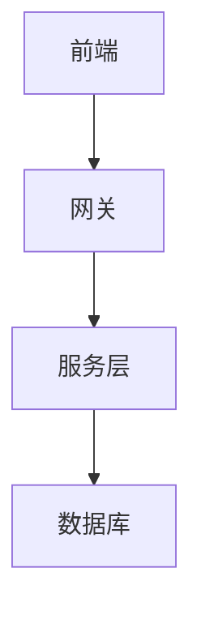
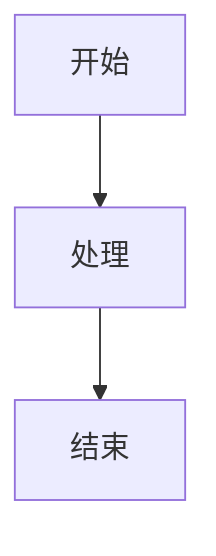
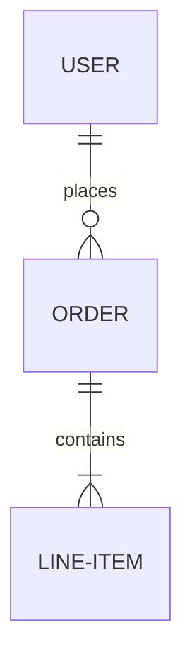

# ZoomableMermaid 组件使用说明

可缩放的Mermaid图表组件，提供放大、缩小、重置、全屏查看等功能，优化大型图表的阅读体验。

## ✨ 功能特性

- 🔍 **缩放控制**：支持放大/缩小操作，缩放范围 50%-300%
- 📱 **响应式设计**：自适应不同屏幕尺寸
- 🌓 **暗黑模式**：完美适配亮色/暗色主题
- ⌨️ **键盘快捷键**：ESC退出全屏
- 🖼️ **全屏查看**：支持全屏模式，便于查看复杂图表
- 🎨 **美观界面**：现代化工具栏设计

## 📦 使用方法

### 基础用法

在MDX文件中导入并使用：

```mdx
import ZoomableMermaid from '@site/src/components/ZoomableMermaid';

<ZoomableMermaid title="系统架构图">



</ZoomableMermaid>
```

### 带标题的图表

```mdx
<ZoomableMermaid title="业务流程图">



</ZoomableMermaid>
```

### 无标题图表

```mdx
<ZoomableMermaid>



</ZoomableMermaid>
```

## 🎮 操作按钮

| 按钮 | 功能 | 说明 |
|-----|------|------|
| ➖ | 缩小 | 每次缩小20%，最小50% |
| ➕ | 放大 | 每次放大20%，最大300% |
| 🔄 | 重置 | 恢复到100%原始大小 |
| ⛶ | 全屏 | 全屏查看图表，ESC退出 |

## 🔧 Props 参数

| 参数 | 类型 | 必填 | 默认值 | 说明 |
|-----|------|------|-------|------|
| title | string | 否 | - | 图表标题，显示在工具栏左侧 |
| children | ReactNode | 是 | - | Mermaid图表内容 |

## 💡 使用建议

### 何时使用

- ✅ 大型架构图（超过10个节点）
- ✅ 复杂流程图（多个分支和层级）
- ✅ ER图（多表关联）
- ✅ 需要细节查看的图表

### 何时不用

- ❌ 简单的2-3节点图表
- ❌ 已经很清晰的小图
- ❌ 文字较少的图表

## 🎨 样式定制

组件支持通过CSS变量进行主题定制：

```css
.zoomable-mermaid-wrapper {
  --border-color: #e0e0e0;
  --toolbar-bg: #f5f5f5;
  --button-hover-bg: #1976d2;
}
```

## 📱 响应式行为

- **桌面端（>768px）**：完整工具栏，标题完整显示
- **移动端（≤768px）**：紧凑工具栏，标题截断显示

## 🌗 暗黑模式

组件自动适配Docusaurus的暗黑模式，无需额外配置。

## 🐛 常见问题

### Q: 图表显示不出来？
A: 确保Mermaid代码块前后有空行，且正确使用三个反引号包裹。

### Q: 全屏模式无法退出？
A: 按ESC键或点击遮罩层即可退出。

### Q: 缩放后图表位置不对？
A: 点击重置按钮恢复默认状态。

## 📝 完整示例

参考以下文档查看实际使用效果：
- `docs/projectDesign/attendance-system-design.mdx`
- `docs/projectDesign/wms-system-design.mdx`

## 🔄 更新日志

### V1.0.0 (2025-11-10)
- ✨ 初始版本发布
- ✅ 支持缩放、重置、全屏功能
- ✅ 响应式设计和暗黑模式适配

